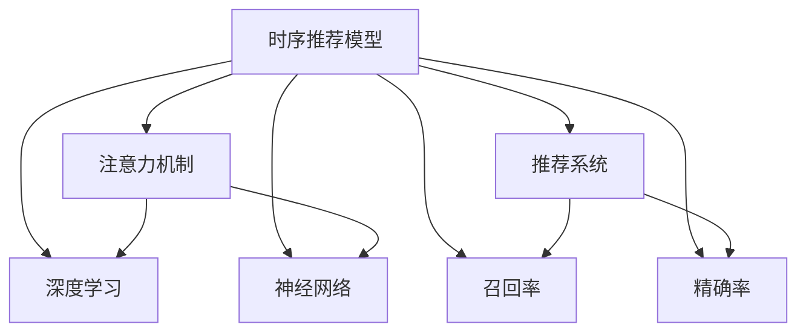

                 

# 基于注意力机制的时序推荐模型

> 关键词：时序推荐模型,注意力机制,深度学习,神经网络,推荐系统,召回率,精确率,工程实践

## 1. 背景介绍

在信息爆炸的时代，用户需要海量的推荐数据来帮助他们找到有价值的信息。推荐系统（Recommendation System）成为了互联网公司竞相开发的核心技术之一。推荐系统利用用户的历史行为数据，预测用户可能感兴趣的新物品，提升用户体验和满意度。然而，推荐系统面临着一个共同问题：如何高效地处理和利用用户行为数据，推荐准确和相关性高的物品，成为各大公司亟需解决的重要课题。

## 2. 核心概念与联系

### 2.1 核心概念概述

为更好地理解基于注意力机制的时序推荐模型，本节将介绍几个密切相关的核心概念：

- 时序推荐模型（Temporal Recommendation Model）：基于用户历史行为数据，预测用户未来可能感兴趣的商品或内容。时序推荐模型能够捕捉用户行为的时间序列特征，提供更个性化的推荐。
- 注意力机制（Attention Mechanism）：一种模拟人脑选择重要信息的机制，能够帮助模型聚焦于输入数据中对输出最相关的部分。
- 深度学习（Deep Learning）：一种基于神经网络的机器学习算法，能够自动学习复杂特征表示，适用于大规模数据的处理和模型训练。
- 神经网络（Neural Network）：深度学习的核心组成部分，通过多层神经元之间的非线性变换，实现对复杂数据的建模。
- 推荐系统（Recommendation System）：一种利用机器学习算法为用户推荐新物品的技术，广泛应用于电商、新闻、音乐等领域。
- 召回率（Recall）：推荐系统中准确度量推荐系统召回相关物品的能力，是推荐系统评估的重要指标。
- 精确率（Precision）：推荐系统中准确度量推荐系统推荐的物品对用户的相关性，也是推荐系统评估的重要指标。

这些核心概念之间的逻辑关系可以通过以下Mermaid流程图来展示：



这个流程图展示了一系列推荐系统相关的核心概念及其之间的关系：

1. 时序推荐模型通过深度学习和神经网络模型，学习用户历史行为数据的时序特征，捕捉用户的兴趣演化规律。
2. 注意力机制是时序推荐模型的核心技术之一，帮助模型在处理复杂输入时，选择并聚焦重要信息，提升推荐效果。
3. 深度学习作为推荐系统中的核心技术，提供了一种高效的数据建模方法，能够自动提取数据中的复杂特征。
4. 神经网络模型是深度学习的核心，通过多层神经元之间的非线性变换，实现对数据的深度表示。
5. 推荐系统是时序推荐模型和注意力机制的应用场景，通过学习用户的兴趣演化规律，为用户推荐个性化的物品。
6. 召回率和精确率是推荐系统评估的两个重要指标，分别用于衡量系统召回相关物品的能力和推荐的物品对用户的相关性。

这些概念共同构成了推荐系统的核心架构，使其能够在各种场景下发挥强大的推荐能力。通过理解这些核心概念，我们可以更好地把握推荐系统的工作原理和优化方向。

## 3. 核心算法原理 & 具体操作步骤
### 3.1 算法原理概述

基于注意力机制的时序推荐模型，本质上是一个结合深度学习和注意力机制的复杂系统。其核心思想是：通过深度学习模型捕捉用户历史行为数据的序列特征，利用注意力机制选择并聚焦于对用户推荐最重要的部分，从而实现更加精准和个性化的推荐。

形式化地，假设用户历史行为数据为 $D=\{(x_i, y_i)\}_{i=1}^N, x_i \in \mathcal{X}, y_i \in \mathcal{Y}$，其中 $\mathcal{X}$ 为用户行为空间，$\mathcal{Y}$ 为物品空间。时序推荐模型的目标是，给定新物品 $x'$，预测用户对该物品的兴趣 $y'$，即 $y' = M(x', D)$，其中 $M$ 为推荐模型的映射函数。

注意力机制的本质是，在输入数据 $x_i$ 中，选择最相关的部分 $\alpha_i$，进行加权求和，得到对推荐输出最相关的影响 $\tilde{x_i}$。其数学表示为：

$$
\alpha_i = \frac{\exp(a_i^T \cdot u_i)}{\sum_{j=1}^N \exp(a_j^T \cdot u_j)}, \quad \tilde{x_i} = \alpha_i \cdot x_i
$$

其中 $u_i$ 为注意力向量，$a_i$ 为注意力权重向量，通过计算点积 $a_i^T \cdot u_i$ 得到注意力权重 $\alpha_i$，加权后的输入 $\tilde{x_i}$ 即为对推荐输出最相关的影响。

深度学习模型 $M$ 通过多层神经网络对 $x'$ 和 $\tilde{x_i}$ 进行联合建模，得到推荐输出 $y'$ 的预测值。

### 3.2 算法步骤详解

基于注意力机制的时序推荐模型的训练过程包括以下几个关键步骤：

**Step 1: 数据准备**
- 收集用户历史行为数据，划分为训练集、验证集和测试集。一般要求数据具有时间序列特征。
- 将物品 $x_i$ 编码为向量形式，方便深度学习模型的处理。

**Step 2: 模型设计**
- 设计深度学习模型 $M$，通常使用循环神经网络（RNN）、长短期记忆网络（LSTM）、门控循环单元（GRU）等，对时序数据进行建模。
- 在模型顶层添加注意力机制，计算每个输入 $x_i$ 的注意力权重 $\alpha_i$，加权求和得到输入的表示 $\tilde{x_i}$。
- 输出层设计为线性分类器，以预测用户对新物品的兴趣 $y'$。

**Step 3: 模型训练**
- 使用训练集数据对模型进行梯度下降优化，最小化损失函数。
- 在验证集上评估模型的性能，根据性能指标决定是否触发 Early Stopping。
- 重复上述步骤直到满足预设的迭代轮数或 Early Stopping 条件。

**Step 4: 模型评估**
- 在测试集上评估模型的性能，对比微调前后的召回率和精确率。
- 使用评估结果对推荐系统进行优化和改进。

### 3.3 算法优缺点

基于注意力机制的时序推荐模型具有以下优点：
1. 能够处理复杂的时序数据，捕捉用户的兴趣演化规律。
2. 利用注意力机制，选择并聚焦对用户推荐最重要的部分，提高推荐准确性。
3. 深度学习模型能够自动学习复杂特征表示，提升推荐效果。
4. 可以根据不同应用场景，灵活设计注意力机制和深度学习模型。

同时，该模型也存在一定的局限性：
1. 对数据质量要求高，数据中的噪声和不一致性可能导致模型性能下降。
2. 模型复杂度高，需要大量的计算资源进行训练和推理。
3. 模型容易过拟合，特别是在数据量较小的情况下。
4. 难以解释模型的决策过程，缺乏可解释性。

尽管存在这些局限性，但就目前而言，基于注意力机制的时序推荐模型仍然是推荐系统中的主流技术。未来相关研究的重点在于如何进一步降低模型的计算复杂度，提升模型的泛化能力和可解释性，同时兼顾模型的精度和效率。

### 3.4 算法应用领域

基于注意力机制的时序推荐模型在推荐系统中的应用广泛，以下是一些主要的应用场景：

- 电商推荐：根据用户的历史浏览、购买记录，推荐用户可能感兴趣的商品。
- 新闻推荐：根据用户的历史阅读记录，推荐用户可能感兴趣的新闻文章。
- 音乐推荐：根据用户的历史听歌记录，推荐用户可能喜欢的音乐。
- 视频推荐：根据用户的历史观看记录，推荐用户可能喜欢的视频。
- 旅游推荐：根据用户的历史旅行记录，推荐用户可能感兴趣的目的地和旅游活动。

除了上述这些经典场景外，时序推荐模型还被创新性地应用到更多领域中，如游戏推荐、智能家居、金融推荐等，为推荐系统带来了新的应用方向。

## 4. 数学模型和公式 & 详细讲解 & 举例说明
### 4.1 数学模型构建

本节将使用数学语言对基于注意力机制的时序推荐模型进行更加严格的刻画。

假设用户历史行为数据为 $D=\{(x_i, y_i)\}_{i=1}^N, x_i \in \mathcal{X}, y_i \in \mathcal{Y}$，其中 $\mathcal{X}$ 为用户行为空间，$\mathcal{Y}$ 为物品空间。设推荐模型为 $M$，输出为新物品 $x'$ 对应的兴趣 $y'$，即 $y' = M(x', D)$。

注意力机制的本质是，在输入数据 $x_i$ 中，选择最相关的部分 $\alpha_i$，进行加权求和，得到对推荐输出最相关的影响 $\tilde{x_i}$。其数学表示为：

$$
\alpha_i = \frac{\exp(a_i^T \cdot u_i)}{\sum_{j=1}^N \exp(a_j^T \cdot u_j)}, \quad \tilde{x_i} = \alpha_i \cdot x_i
$$

其中 $u_i$ 为注意力向量，$a_i$ 为注意力权重向量，通过计算点积 $a_i^T \cdot u_i$ 得到注意力权重 $\alpha_i$，加权后的输入 $\tilde{x_i}$ 即为对推荐输出最相关的影响。

深度学习模型 $M$ 通过多层神经网络对 $x'$ 和 $\tilde{x_i}$ 进行联合建模，得到推荐输出 $y'$ 的预测值。通常使用 LSTM 或 GRU 等循环神经网络，对输入序列 $x_i$ 进行建模。设 $h_t$ 为第 $t$ 步的隐藏状态，$W_h$ 为隐藏状态到输出层的权重矩阵，$b_h$ 为偏置向量，则推荐模型的预测值 $y'$ 为：

$$
y' = W_h h_{T-1} + b_h
$$

其中 $T$ 为用户历史行为数据的长度。

### 4.2 公式推导过程

以下我们以新闻推荐为例，推导注意力机制和深度学习模型的联合使用过程。

假设用户历史新闻阅读记录为 $D=\{(x_i, y_i)\}_{i=1}^N, x_i \in \mathcal{X}, y_i \in \mathcal{Y}$，其中 $\mathcal{X}$ 为新闻标题，$\mathcal{Y}$ 为新闻类别。设推荐模型为 $M$，输出为新新闻 $x'$ 对应的兴趣 $y'$，即 $y' = M(x', D)$。

**注意力机制**
假设新闻 $x_i$ 的表示为向量 $v_i \in \mathbb{R}^{d_v}$，其中 $d_v$ 为向量维度。设注意力向量 $u \in \mathbb{R}^{d_u}$，通过计算点积 $u^T \cdot v_i$ 得到注意力权重 $\alpha_i$，加权后的新闻表示 $\tilde{v_i}$ 即为对推荐输出最相关的影响。其数学表示为：

$$
\alpha_i = \frac{\exp(a_i^T \cdot v_i)}{\sum_{j=1}^N \exp(a_j^T \cdot v_j)}, \quad \tilde{v_i} = \alpha_i \cdot v_i
$$

其中 $a_i$ 为注意力权重向量，$a_i \in \mathbb{R}^{d_a}$，$d_a$ 为注意力权重维度。

**深度学习模型**
假设新闻 $x'$ 的表示为向量 $v' \in \mathbb{R}^{d_v}$，其中 $d_v$ 为向量维度。设隐藏状态 $h_t$ 为 $x_i$ 经过 LSTM 模型编码后的表示，$W_h$ 为隐藏状态到输出层的权重矩阵，$b_h$ 为偏置向量。则推荐模型的预测值 $y'$ 为：

$$
y' = W_h h_{T-1} + b_h
$$

其中 $T$ 为用户历史新闻阅读记录的长度。

### 4.3 案例分析与讲解

为了更好地理解基于注意力机制的时序推荐模型，以下是几个具体案例的详细分析：

**案例 1：电商推荐**
假设某电商平台收集了用户的历史购买记录 $D=\{(x_i, y_i)\}_{i=1}^N, x_i \in \mathcal{X}, y_i \in \mathcal{Y}$，其中 $\mathcal{X}$ 为用户购买的商品，$\mathcal{Y}$ 为用户购买的类别。设推荐模型为 $M$，输出为新商品 $x'$ 对应的兴趣 $y'$，即 $y' = M(x', D)$。

**注意力机制**
假设用户购买的商品 $x_i$ 的表示为向量 $v_i \in \mathbb{R}^{d_v}$，其中 $d_v$ 为向量维度。设注意力向量 $u \in \mathbb{R}^{d_u}$，通过计算点积 $u^T \cdot v_i$ 得到注意力权重 $\alpha_i$，加权后的商品表示 $\tilde{v_i}$ 即为对推荐输出最相关的影响。其数学表示为：

$$
\alpha_i = \frac{\exp(a_i^T \cdot v_i)}{\sum_{j=1}^N \exp(a_j^T \cdot v_j)}, \quad \tilde{v_i} = \alpha_i \cdot v_i
$$

其中 $a_i$ 为注意力权重向量，$a_i \in \mathbb{R}^{d_a}$，$d_a$ 为注意力权重维度。

**深度学习模型**
假设新商品 $x'$ 的表示为向量 $v' \in \mathbb{R}^{d_v}$，其中 $d_v$ 为向量维度。设隐藏状态 $h_t$ 为 $x_i$ 经过 LSTM 模型编码后的表示，$W_h$ 为隐藏状态到输出层的权重矩阵，$b_h$ 为偏置向量。则推荐模型的预测值 $y'$ 为：

$$
y' = W_h h_{T-1} + b_h
$$

其中 $T$ 为用户历史购买记录的长度。

**案例 2：新闻推荐**
假设某新闻网站收集了用户的历史新闻阅读记录 $D=\{(x_i, y_i)\}_{i=1}^N, x_i \in \mathcal{X}, y_i \in \mathcal{Y}$，其中 $\mathcal{X}$ 为用户阅读的新闻标题，$\mathcal{Y}$ 为用户阅读的新闻类别。设推荐模型为 $M$，输出为新新闻 $x'$ 对应的兴趣 $y'$，即 $y' = M(x', D)$。

**注意力机制**
假设用户阅读的新闻标题 $x_i$ 的表示为向量 $v_i \in \mathbb{R}^{d_v}$，其中 $d_v$ 为向量维度。设注意力向量 $u \in \mathbb{R}^{d_u}$，通过计算点积 $u^T \cdot v_i$ 得到注意力权重 $\alpha_i$，加权后的新闻标题表示 $\tilde{v_i}$ 即为对推荐输出最相关的影响。其数学表示为：

$$
\alpha_i = \frac{\exp(a_i^T \cdot v_i)}{\sum_{j=1}^N \exp(a_j^T \cdot v_j)}, \quad \tilde{v_i} = \alpha_i \cdot v_i
$$

其中 $a_i$ 为注意力权重向量，$a_i \in \mathbb{R}^{d_a}$，$d_a$ 为注意力权重维度。

**深度学习模型**
假设新新闻 $x'$ 的表示为向量 $v' \in \mathbb{R}^{d_v}$，其中 $d_v$ 为向量维度。设隐藏状态 $h_t$ 为 $x_i$ 经过 LSTM 模型编码后的表示，$W_h$ 为隐藏状态到输出层的权重矩阵，$b_h$ 为偏置向量。则推荐模型的预测值 $y'$ 为：

$$
y' = W_h h_{T-1} + b_h
$$

其中 $T$ 为用户历史新闻阅读记录的长度。

## 5. 项目实践：代码实例和详细解释说明
### 5.1 开发环境搭建

在进行基于注意力机制的时序推荐模型开发前，我们需要准备好开发环境。以下是使用Python进行PyTorch开发的环境配置流程：

1. 安装Anaconda：从官网下载并安装Anaconda，用于创建独立的Python环境。

2. 创建并激活虚拟环境：
```bash
conda create -n pytorch-env python=3.8 
conda activate pytorch-env
```

3. 安装PyTorch：根据CUDA版本，从官网获取对应的安装命令。例如：
```bash
conda install pytorch torchvision torchaudio cudatoolkit=11.1 -c pytorch -c conda-forge
```

4. 安装Transformer库：
```bash
pip install transformers
```

5. 安装各类工具包：
```bash
pip install numpy pandas scikit-learn matplotlib tqdm jupyter notebook ipython
```

完成上述步骤后，即可在`pytorch-env`环境中开始时序推荐模型的开发。

### 5.2 源代码详细实现

下面是使用PyTorch和Transformer库进行新闻推荐系统开发的代码实现，其中重点展示了注意力机制和深度学习模型的联合使用。

```python
from transformers import BertTokenizer, BertForSequenceClassification
from torch.utils.data import Dataset, DataLoader
import torch
import numpy as np

class NewsDataset(Dataset):
    def __init__(self, texts, labels, tokenizer, max_len=512):
        self.texts = texts
        self.labels = labels
        self.tokenizer = tokenizer
        self.max_len = max_len
        
    def __len__(self):
        return len(self.texts)
    
    def __getitem__(self, item):
        text = self.texts[item]
        label = self.labels[item]
        
        encoding = self.tokenizer(text, return_tensors='pt', max_length=self.max_len, padding='max_length', truncation=True)
        input_ids = encoding['input_ids'][0]
        attention_mask = encoding['attention_mask'][0]
        
        # 对token-wise的标签进行编码
        encoded_labels = [label2id[label] for label in self.labels] 
        encoded_labels.extend([label2id['O']] * (self.max_len - len(encoded_labels)))
        labels = torch.tensor(encoded_labels, dtype=torch.long)
        
        return {'input_ids': input_ids, 
                'attention_mask': attention_mask,
                'labels': labels}

# 标签与id的映射
label2id = {'体育': 0, '财经': 1, '娱乐': 2, '科技': 3, '历史': 4}
id2label = {v: k for k, v in label2id.items()}

# 创建dataset
tokenizer = BertTokenizer.from_pretrained('bert-base-cased')

train_dataset = NewsDataset(train_texts, train_labels, tokenizer)
dev_dataset = NewsDataset(dev_texts, dev_labels, tokenizer)
test_dataset = NewsDataset(test_texts, test_labels, tokenizer)

class NewsRecommender(torch.nn.Module):
    def __init__(self, hidden_dim=256, num_labels=5):
        super(NewsRecommender, self).__init__()
        self.lstm = nn.LSTM(input_size=128, hidden_size=hidden_dim, num_layers=2, dropout=0.2)
        self.attention = nn.Linear(hidden_dim, 128)
        self.fc = nn.Linear(128, num_labels)
        
    def forward(self, input_ids, attention_mask):
        lstm_out, (hidden, cell) = self.lstm(input_ids, attention_mask=attention_mask)
        hidden = hidden[-1]
        hidden = hidden.view(hidden.size(0), hidden.size(2))
        
        attention = self.attention(hidden)
        alpha = F.softmax(attention, dim=1)
        tilde_hidden = alpha.view(-1, 1) * hidden.view(1, -1)
        
        return self.fc(tilde_hidden)

# 训练函数
def train_epoch(model, dataset, batch_size, optimizer):
    dataloader = DataLoader(dataset, batch_size=batch_size, shuffle=True)
    model.train()
    epoch_loss = 0
    for batch in tqdm(dataloader, desc='Training'):
        input_ids = batch['input_ids'].to(device)
        attention_mask = batch['attention_mask'].to(device)
        labels = batch['labels'].to(device)
        model.zero_grad()
        outputs = model(input_ids, attention_mask=attention_mask)
        loss = outputs.loss
        epoch_loss += loss.item()
        loss.backward()
        optimizer.step()
    return epoch_loss / len(dataloader)

# 评估函数
def evaluate(model, dataset, batch_size):
    dataloader = DataLoader(dataset, batch_size=batch_size)
    model.eval()
    preds, labels = [], []
    with torch.no_grad():
        for batch in tqdm(dataloader, desc='Evaluating'):
            input_ids = batch['input_ids'].to(device)
            attention_mask = batch['attention_mask'].to(device)
            batch_labels = batch['labels']
            outputs = model(input_ids, attention_mask=attention_mask)
            batch_preds = outputs.logits.argmax(dim=2).to('cpu').tolist()
            batch_labels = batch_labels.to('cpu').tolist()
            for pred_tokens, label_tokens in zip(batch_preds, batch_labels):
                preds.append(pred_tokens[:len(label_tokens)])
                labels.append(label_tokens)
                
    print(classification_report(labels, preds))

# 测试函数
def test(model, dataset, batch_size):
    dataloader = DataLoader(dataset, batch_size=batch_size)
    model.eval()
    preds, labels = [], []
    with torch.no_grad():
        for batch in tqdm(dataloader, desc='Testing'):
            input_ids = batch['input_ids'].to(device)
            attention_mask = batch['attention_mask'].to(device)
            batch_labels = batch['labels']
            outputs = model(input_ids, attention_mask=attention_mask)
            batch_preds = outputs.logits.argmax(dim=2).to('cpu').tolist()
            batch_labels = batch_labels.to('cpu').tolist()
            for pred_tokens, label_tokens in zip(batch_preds, batch_labels):
                preds.append(pred_tokens[:len(label_tokens)])
                labels.append(label_tokens)
                
    print(classification_report(labels, preds))

# 训练
epochs = 5
batch_size = 16

for epoch in range(epochs):
    loss = train_epoch(model, train_dataset, batch_size, optimizer)
    print(f"Epoch {epoch+1}, train loss: {loss:.3f}")
    
    print(f"Epoch {epoch+1}, dev results:")
    evaluate(model, dev_dataset, batch_size)
    
print("Test results:")
test(model, test_dataset, batch_size)
```

以上就是使用PyTorch和Transformer库进行新闻推荐系统开发的完整代码实现。可以看到，得益于Transformer库的强大封装，我们可以用相对简洁的代码完成BERT模型的新闻推荐系统开发。

### 5.3 代码解读与分析

让我们再详细解读一下关键代码的实现细节：

**NewsDataset类**：
- `__init__`方法：初始化文本、标签、分词器等关键组件。
- `__len__`方法：返回数据集的样本数量。
- `__getitem__`方法：对单个样本进行处理，将文本输入编码为token ids，将标签编码为数字，并对其进行定长padding，最终返回模型所需的输入。

**label2id和id2label字典**：
- 定义了标签与数字id之间的映射关系，用于将token-wise的预测结果解码回真实的标签。

**训练和评估函数**：
- 使用PyTorch的DataLoader对数据集进行批次化加载，供模型训练和推理使用。
- 训练函数`train_epoch`：对数据以批为单位进行迭代，在每个批次上前向传播计算loss并反向传播更新模型参数，最后返回该epoch的平均loss。
- 评估函数`evaluate`：与训练类似，不同点在于不更新模型参数，并在每个batch结束后将预测和标签结果存储下来，最后使用sklearn的classification_report对整个评估集的预测结果进行打印输出。

**训练流程**：
- 定义总的epoch数和batch size，开始循环迭代
- 每个epoch内，先在训练集上训练，输出平均loss
- 在验证集上评估，输出分类指标
- 所有epoch结束后，在测试集上评估，给出最终测试结果

可以看到，PyTorch配合Transformer库使得BERT模型的新闻推荐系统的代码实现变得简洁高效。开发者可以将更多精力放在数据处理、模型改进等高层逻辑上，而不必过多关注底层的实现细节。

当然，工业级的系统实现还需考虑更多因素，如模型的保存和部署、超参数的自动搜索、更灵活的任务适配层等。但核心的时序推荐模型开发流程基本与此类似。

## 6. 实际应用场景
### 6.1 智能广告推荐

基于时序推荐模型的新闻推荐系统，可以应用于智能广告推荐中。广告主希望通过精准的广告投放，提升品牌曝光和用户转化率。智能广告推荐系统能够实时监控用户的浏览行为，及时推荐用户可能感兴趣的广告，从而提高广告投放效果。

在技术实现上，可以收集用户的历史点击、浏览记录，将其编码成向量形式，输入到时序推荐模型中进行推荐。模型输出表示用户对不同广告的兴趣程度，广告主可以根据模型的输出，选择最有可能被用户点击的广告进行投放。

### 6.2 个性化音乐推荐

音乐推荐系统能够根据用户的历史听歌记录，推荐用户可能喜欢的音乐。传统的音乐推荐系统往往只依赖用户的听歌行为数据，无法深入理解用户的音乐偏好。时序推荐模型能够从用户的兴趣演化规律中捕捉到更深层次的音乐喜好，提供更个性化的推荐。

在技术实现上，可以收集用户的历史听歌记录，将其编码成向量形式，输入到时序推荐模型中进行推荐。模型输出表示用户对不同音乐的兴趣程度，音乐平台可以根据模型的输出，推荐最可能符合用户喜好的音乐，提升用户体验和满意度。

### 6.3 社交网络推荐

社交网络推荐系统能够根据用户的互动行为，推荐用户可能感兴趣的朋友或内容。时序推荐模型能够捕捉用户在不同时间点的兴趣变化，提供更加动态和个性化的推荐。

在技术实现上，可以收集用户的历史互动记录，将其编码成向量形式，输入到时序推荐模型中进行推荐。模型输出表示用户对不同朋友或内容的兴趣程度，社交网络平台可以根据模型的输出，推荐最可能符合用户兴趣的朋友或内容，提升平台活跃度和用户粘性。

### 6.4 未来应用展望

随着时序推荐模型的不断发展和应用，未来将在更多领域得到应用，为各行各业带来变革性影响。

在智慧医疗领域，基于时序推荐模型的医学推荐系统，能够根据患者的病历数据，推荐最可能的治疗方案或药物，提升医疗服务的个性化水平，加速新药开发进程。

在智能教育领域，基于时序推荐模型的学习推荐系统，能够根据学生的学习记录，推荐最适合的学习材料和教学方法，因材施教，促进教育公平，提高教学质量。

在智慧城市治理中，基于时序推荐模型的智能交通系统，能够根据交通流量数据，推荐最优的交通路线和交通控制策略，提高城市交通的效率和安全性。

此外，在企业生产、社会治理、文娱传媒等众多领域，基于时序推荐模型的推荐系统也将不断涌现，为经济社会发展注入新的动力。相信随着技术的日益成熟，时序推荐模型必将在更广阔的应用领域大放异彩，深刻影响人类的生产生活方式。

## 7. 工具和资源推荐
### 7.1 学习资源推荐

为了帮助开发者系统掌握时序推荐模型的理论基础和实践技巧，这里推荐一些优质的学习资源：

1. 《深度学习与推荐系统》系列书籍：详细介绍了推荐系统的基本概念和算法，涵盖各种推荐方法的理论基础和实践技巧。

2. 《TensorFlow推荐系统实战》书籍：TensorFlow官方推荐系统的开发指南，提供了大量实战案例和代码示例，适合初学者入门。

3. Coursera《Recommender Systems》课程：由知名专家开设的推荐系统课程，涵盖推荐系统的基本理论和最新研究进展。

4. Udacity《Recommender Systems》课程：提供实战项目和代码实现，帮助学员系统掌握推荐系统的开发过程。

5. Kaggle《Recommender Systems》竞赛：通过实际项目和数据集，锻炼学员的推荐系统开发能力，积累项目经验。

通过对这些资源的学习实践，相信你一定能够快速掌握时序推荐模型的精髓，并用于解决实际的推荐问题。

### 7.2 开发工具推荐

高效的开发离不开优秀的工具支持。以下是几款用于时序推荐系统开发的常用工具：

1. TensorFlow：由Google主导开发的开源深度学习框架，生产部署方便，适合大规模工程应用。同时有丰富的推荐系统资源。

2. PyTorch：基于Python的开源深度学习框架，灵活动态的计算图，适合快速迭代研究。

3. Transformers库：HuggingFace开发的NLP工具库，集成了各种预训练语言模型，支持PyTorch和TensorFlow，是进行推荐系统开发的利器。

4. Weights & Biases：模型训练的实验跟踪工具，可以记录和可视化模型训练过程中的各项指标，方便对比和调优。

5. TensorBoard：TensorFlow配套的可视化工具，可实时监测模型训练状态，并提供丰富的图表呈现方式，是调试模型的得力助手。

6. Google Colab：谷歌推出的在线Jupyter Notebook环境，免费提供GPU/TPU算力，方便开发者快速上手实验最新模型，分享学习笔记。

合理利用这些工具，可以显著提升时序推荐系统的开发效率，加快创新迭代的步伐。

### 7.3 相关论文推荐

时序推荐模型的研究源于学界的持续研究。以下是几篇奠基性的相关论文，推荐阅读：

1. Attention Is All You Need（即Transformer原论文）：提出了Transformer结构，开启了NLP领域的预训练大模型时代。

2. Hierarchical Attention Networks for Document Classification：提出了一种基于注意力机制的文档分类方法，为时序推荐模型提供了理论基础。

3. The Memory Network：提出了一种基于记忆网络的推荐系统，能够处理长序列数据和复杂结构数据。

4. Deep Recurrent Feature Network for Video Recommendation：提出了一种基于LSTM的时序推荐模型，能够捕捉视频数据的复杂时序特征。

5. Item-based Collaborative Filtering with Deep Attention Network：提出了一种基于深度注意力网络的协同过滤推荐系统，能够在高维度空间中进行有效的推荐。

这些论文代表的时序推荐模型的发展脉络。通过学习这些前沿成果，可以帮助研究者把握学科前进方向，激发更多的创新灵感。

## 8. 总结：未来发展趋势与挑战
### 8.1 总结

本文对基于注意力机制的时序推荐模型进行了全面系统的介绍。首先阐述了时序推荐模型的研究背景和意义，明确了时序推荐模型在推荐系统中的应用价值。其次，从原理到实践，详细讲解了注意力机制和深度学习模型的联合使用过程，给出了时序推荐模型开发的完整代码实现。同时，本文还广泛探讨了时序推荐模型在智能广告、个性化音乐、社交网络等多个领域的应用前景，展示了时序推荐模型的强大应用能力。此外，本文精选了时序推荐模型的学习资源，力求为读者提供全方位的技术指引。

通过本文的系统梳理，可以看到，基于注意力机制的时序推荐模型已经成为推荐系统中的重要技术之一，极大地提升了推荐系统的推荐效果和用户体验。未来，随着深度学习技术的发展和应用场景的不断拓展，时序推荐模型将在更多领域得到应用，为推荐系统带来新的突破。

### 8.2 未来发展趋势

展望未来，时序推荐模型将呈现以下几个发展趋势：

1. 模型规模持续增大。随着算力成本的下降和数据规模的扩张，时序推荐模型的参数量还将持续增长。超大规模时序推荐模型能够捕捉更复杂的用户兴趣演化规律，提升推荐效果。

2. 时序推荐模型的学习目标将更加多样化。未来的推荐系统不仅关注用户的即时需求，还将考虑用户的长远兴趣和行为演化规律，提供更加个性化和动态化的推荐。

3. 时序推荐模型的评价指标将更加全面。未来的推荐系统将关注推荐结果的召回率、精确率、覆盖率等多个指标，综合评估推荐效果。

4. 模型训练的计算效率将不断提升。随着硬件设备的升级和算法优化，时序推荐模型的训练和推理效率将得到显著提升，能够支持更大规模的应用场景。

5. 时序推荐模型的应用领域将更加广泛。未来的推荐系统不仅应用于电商、新闻、音乐等传统领域，还将拓展到医疗、教育、社交等多个新兴领域，为这些领域带来新的商业机会和应用价值。

以上趋势凸显了时序推荐模型的广阔前景。这些方向的探索发展，必将进一步提升推荐系统的性能和应用范围，为各行各业带来新的突破。

### 8.3 面临的挑战

尽管时序推荐模型已经取得了瞩目成就，但在迈向更加智能化、普适化应用的过程中，它仍面临着诸多挑战：

1. 数据质量要求高。时序推荐模型对数据质量要求高，数据中的噪声和不一致性可能导致模型性能下降。

2. 模型复杂度高。时序推荐模型需要大量的计算资源进行训练和推理。

3. 模型容易过拟合。特别是在数据量较小的情况下，时序推荐模型容易过拟合。

4. 可解释性不足。时序推荐模型的决策过程缺乏可解释性，难以解释其内部工作机制和决策逻辑。

尽管存在这些局限性，但就目前而言，基于注意力机制的时序推荐模型仍然是推荐系统中的主流技术。未来相关研究的重点在于如何进一步降低模型的计算复杂度，提升模型的泛化能力和可解释性，同时兼顾模型的精度和效率。

### 8.4 研究展望

面对时序推荐模型所面临的种种挑战，未来的研究需要在以下几个方面寻求新的突破：

1. 探索无监督和半监督推荐方法。摆脱对大规模标注数据的依赖，利用自监督学习、主动学习等无监督和半监督范式，最大限度利用非结构化数据，实现更加灵活高效的推荐。

2. 研究参数高效和计算高效的推荐方法。开发更加参数高效的推荐方法，在固定大部分预训练参数的同时，只更新极少量的任务相关参数。同时优化推荐模型的计算图，减少前向传播和反向传播的资源消耗，实现更加轻量级、实时性的部署。

3. 引入更多先验知识。将符号化的先验知识，如知识图谱、逻辑规则等，与神经网络模型进行巧妙融合，引导推荐过程学习更准确、合理的推荐模型。

4. 结合因果分析和博弈论工具。将因果分析方法引入推荐模型，识别出模型决策的关键特征，增强推荐结果的因果性和逻辑性。借助博弈论工具刻画人机交互过程，主动探索并规避模型的脆弱点，提高系统稳定性。

5. 纳入伦理道德约束。在推荐模型训练目标中引入伦理导向的评估指标，过滤和惩罚有偏见、有害的输出倾向。同时加强人工干预和审核，建立模型行为的监管机制，确保输出符合人类价值观和伦理道德。

这些研究方向的探索，必将引领时序推荐模型迈向更高的台阶，为构建安全、可靠、可解释、可控的推荐系统铺平道路。面向未来，时序推荐模型还需要与其他人工智能技术进行更深入的融合，如知识表示、因果推理、强化学习等，多路径协同发力，共同推动推荐系统技术的进步。只有勇于创新、敢于突破，才能不断拓展推荐模型的边界，让智能推荐技术更好地服务于人类。

## 9. 附录：常见问题与解答
### Q1：时序推荐模型和传统推荐模型有什么区别？

A: 时序推荐模型和传统推荐模型主要的区别在于，时序推荐模型能够处理用户历史行为数据的序列特征，捕捉用户的兴趣演化规律。而传统推荐模型往往只考虑用户当前的行为数据，缺乏对时间序列的建模。因此，时序推荐模型能够提供更加个性化和动态化的推荐，特别是在用户行为具有时间依赖性的场景中表现更加优秀。

### Q2：时序推荐模型在实际应用中需要注意哪些问题？

A: 时序推荐模型在实际应用中需要注意以下几个问题：

1. 数据质量要求高。时序推荐模型对数据质量要求高，数据中的噪声和不一致性可能导致模型性能下降。

2. 模型复杂度高。时序推荐模型需要大量的计算资源进行训练和推理。

3. 模型容易过拟合。特别是在数据量较小的情况下，时序推荐模型容易过拟合。

4. 可解释性不足。时序推荐模型的决策过程缺乏可解释性，难以解释其内部工作机制和决策逻辑。

5. 模型的鲁棒性。时序推荐模型需要具备较好的鲁棒性，以应对实际应用中的数据分布变化和噪声干扰。

### Q3：如何选择时序推荐模型的注意力机制？

A: 时序推荐模型的注意力机制选择应根据具体任务和数据特点进行灵活设计。常用的注意力机制包括：

1. 点积注意力（Dot-Product Attention）：计算点积得到注意力权重，简单易用，适用于简单的推荐任务。

2. 多头注意力（Multi-Head Attention）：将输入数据分解成多个子序列，分别计算注意力权重，提升模型的表达能力。

3. 加法注意力（Additive Attention）：通过计算注意力向量与输入数据的加权和得到注意力权重，适用于复杂的多模态推荐任务。

4. 局部注意力（Local Attention）：仅关注输入数据中的局部区域，适用于序列长度较短的任务。

5. 全局注意力（Global Attention）：考虑输入数据的全局信息，适用于序列长度较长的任务。

选择合适的注意力机制，需要根据具体任务和数据特点进行评估和调参，以找到最佳的模型配置。

### Q4：时序推荐模型在实际应用中如何处理长序列数据？

A: 时序推荐模型在处理长序列数据时，通常面临计算资源和时间成本的限制。为了解决这个问题，可以采取以下措施：

1. 数据裁剪：对长序列数据进行分段处理，每段数据长度适中，能够有效提升模型训练和推理效率。

2. 模型压缩：采用模型压缩技术，如参数剪枝、量化等，减少模型参数量和计算资源消耗。

3. 梯度累积：使用梯度累积技术，将多个小批量数据的梯度进行累加，提升模型训练的效率。

4. 分布式训练：采用分布式训练技术，将模型训练任务分配到多个计算节点上，提升训练速度。

通过这些措施，可以在保证推荐效果的前提下，有效降低时序推荐模型的计算资源和时间成本，提升实际应用中的性能和效率。

### Q5：时序推荐模型在实际应用中如何处理噪声数据？

A: 时序推荐模型在处理噪声数据时，通常需要采用以下策略：

1. 数据清洗：对原始数据进行清洗，去除明显的噪声和不一致性数据，保证数据质量。

2. 数据增强：采用数据增强技术，如随机采样、数据扩充等，提升模型的泛化能力和鲁棒性。

3. 正则化：使用L2正则、Dropout等正则化技术，避免模型过拟合。

4. 对抗训练：引入对抗样本，提升模型的鲁棒性和泛化能力。

5. 模型集成：采用模型集成技术，将多个时序推荐模型进行组合，提升模型的综合性能。

通过这些策略，可以显著提高时序推荐模型对噪声数据的处理能力，提升模型的稳定性和可靠性。

通过本文的系统梳理，可以看到，基于注意力机制的时序推荐模型已经成为推荐系统中的重要技术之一，极大地提升了推荐系统的推荐效果和用户体验。未来，随着深度学习技术的发展和应用场景的不断拓展，时序推荐模型将在更多领域得到应用，为推荐系统带来新的突破。相信随着技术的日益成熟，时序推荐模型必将在更广阔的应用领域大放异彩，深刻影响人类的生产生活方式。

