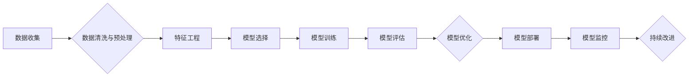

> AI开发流程，Lepton AI，标准化，最佳实践，机器学习，深度学习，模型训练，部署，监控

## 1. 背景介绍

人工智能（AI）技术近年来发展迅速，已渗透到各个领域，从自动驾驶到医疗诊断，从个性化推荐到金融风险控制，AI正在改变着我们的生活和工作方式。然而，AI开发是一个复杂且充满挑战的过程，缺乏标准化流程和最佳实践会导致开发效率低下、模型质量参差不齐，甚至难以进行可持续的维护和迭代。

Lepton AI 作为一家专注于 AI 解决方案的科技公司，在多年的实践中积累了丰富的经验，并形成了一个完善的 AI 开发标准化流程，旨在帮助企业高效、可靠地开发和部署 AI 应用。

## 2. 核心概念与联系

Lepton AI 的 AI 开发标准化流程基于以下核心概念：

* **数据驱动:** AI 模型的性能直接取决于训练数据的质量和数量。Lepton AI 强调数据收集、清洗、预处理和特征工程等环节的重要性，并采用先进的数据管理和分析工具，确保数据质量和可用性。
* **模型迭代:** AI 模型的开发是一个迭代的过程，需要不断地调整模型架构、训练参数和评估指标，以获得最佳的性能。Lepton AI 采用敏捷开发方法，鼓励快速迭代和实验，并利用自动化测试和监控工具，确保模型的稳定性和可靠性。
* **可解释性:** 对于许多应用场景，需要对 AI 模型的决策过程进行解释和理解。Lepton AI 关注模型的可解释性，并采用可解释 AI 技术，帮助用户理解模型的决策逻辑，提高用户信任度。

Lepton AI 的 AI 开发标准化流程可以概括为以下步骤：



## 3. 核心算法原理 & 具体操作步骤

### 3.1  算法原理概述

Lepton AI 在 AI 开发过程中广泛应用于机器学习和深度学习算法。

* **机器学习:** 机器学习算法通过学习从数据中提取的模式和规律，来预测未来事件或分类数据。常见的机器学习算法包括线性回归、逻辑回归、支持向量机、决策树、随机森林等。
* **深度学习:** 深度学习算法是一种更高级的机器学习算法，它利用多层神经网络来模拟人类大脑的学习过程，能够处理更复杂的数据类型，并取得更优异的性能。常见的深度学习算法包括卷积神经网络（CNN）、循环神经网络（RNN）、生成对抗网络（GAN）等。

### 3.2  算法步骤详解

Lepton AI 的 AI 开发流程中，对于机器学习和深度学习算法的应用，通常遵循以下步骤：

1. **数据准备:** 收集、清洗、预处理和特征工程。
2. **模型选择:** 根据具体应用场景选择合适的机器学习或深度学习算法。
3. **模型训练:** 使用训练数据训练模型，并调整模型参数以获得最佳性能。
4. **模型评估:** 使用测试数据评估模型的性能，并选择最佳模型。
5. **模型部署:** 将训练好的模型部署到生产环境中，用于实际应用。
6. **模型监控:** 持续监控模型的性能，并进行必要的调整和更新。

### 3.3  算法优缺点

* **机器学习算法:**
    * **优点:** 
        * 适用范围广，可以处理各种类型的数据。
        * 训练速度相对较快。
        * 可解释性相对较高。
    * **缺点:** 
        * 对数据质量要求较高。
        * 难以处理复杂的数据模式。
        * 性能可能不如深度学习算法。
* **深度学习算法:**
    * **优点:** 
        * 能够处理复杂的数据模式，取得更优异的性能。
        * 自动学习特征，减少人工特征工程的负担。
    * **缺点:** 
        * 对数据量要求较高。
        * 训练速度相对较慢。
        * 可解释性相对较低。

### 3.4  算法应用领域

Lepton AI 的 AI 开发流程和算法应用于多个领域，包括：

* **图像识别:** 人脸识别、物体检测、图像分类等。
* **自然语言处理:** 文本分类、情感分析、机器翻译等。
* **语音识别:** 语音转文本、语音助手等。
* **推荐系统:** 商品推荐、内容推荐等。
* **医疗诊断:** 病情预测、疾病诊断等。

## 4. 数学模型和公式 & 详细讲解 & 举例说明

### 4.1  数学模型构建

Lepton AI 在 AI 开发过程中，广泛应用数学模型来描述和分析问题，并构建 AI 算法。常见的数学模型包括：

* **线性回归模型:** 用于预测连续变量，假设目标变量与输入变量之间存在线性关系。
* **逻辑回归模型:** 用于分类问题，假设目标变量服从伯努利分布。
* **神经网络模型:** 采用多层神经元网络来模拟人类大脑的学习过程，能够处理复杂的数据模式。

### 4.2  公式推导过程

例如，线性回归模型的目标是找到最佳的权重参数，使得模型预测值与真实值之间的误差最小化。

**损失函数:**

$$
J(\theta) = \frac{1}{2m} \sum_{i=1}^{m} (h_\theta(x^{(i)}) - y^{(i)})^2
$$

其中：

* $J(\theta)$ 是损失函数，表示模型预测值与真实值之间的误差。
* $\theta$ 是模型的权重参数。
* $m$ 是训练样本的数量。
* $h_\theta(x^{(i)})$ 是模型对第 $i$ 个样本的预测值。
* $y^{(i)}$ 是第 $i$ 个样本的真实值。

**梯度下降算法:**

$$
\theta_j := \theta_j - \alpha \frac{\partial J(\theta)}{\partial \theta_j}
$$

其中：

* $\alpha$ 是学习率，控制着参数更新的步长。
* $\frac{\partial J(\theta)}{\partial \theta_j}$ 是损失函数对参数 $\theta_j$ 的偏导数。

### 4.3  案例分析与讲解

例如，假设我们想要构建一个预测房价的线性回归模型。我们可以收集房价和相关特征的数据，例如房屋面积、房间数量、地理位置等。然后，我们可以使用线性回归模型和梯度下降算法来训练模型，并评估模型的预测性能。

## 5. 项目实践：代码实例和详细解释说明

### 5.1  开发环境搭建

Lepton AI 的 AI 开发流程通常使用 Python 作为编程语言，并结合以下工具和框架：

* **Python:** 广泛应用于数据科学和机器学习领域，拥有丰富的库和工具。
* **NumPy:** 用于高效的数值计算和数组操作。
* **Pandas:** 用于数据分析和处理。
* **Scikit-learn:** 提供各种机器学习算法和工具。
* **TensorFlow/PyTorch:** 用于深度学习模型的开发和训练。

### 5.2  源代码详细实现

以下是一个使用 Scikit-learn 库构建线性回归模型的 Python 代码示例：

```python
import numpy as np
from sklearn.linear_model import LinearRegression
from sklearn.model_selection import train_test_split
from sklearn.metrics import mean_squared_error

# 生成示例数据
X = np.array([[1], [2], [3], [4], [5]])
y = np.array([2, 4, 5, 4, 5])

# 将数据划分为训练集和测试集
X_train, X_test, y_train, y_test = train_test_split(X, y, test_size=0.2, random_state=42)

# 创建线性回归模型
model = LinearRegression()

# 训练模型
model.fit(X_train, y_train)

# 预测测试集数据
y_pred = model.predict(X_test)

# 计算模型性能
mse = mean_squared_error(y_test, y_pred)
print(f"Mean Squared Error: {mse}")
```

### 5.3  代码解读与分析

这段代码首先生成示例数据，然后将数据划分为训练集和测试集。接着，创建线性回归模型并使用训练集训练模型。最后，使用测试集数据进行预测，并计算模型的性能指标 Mean Squared Error (MSE)。

### 5.4  运行结果展示

运行这段代码后，会输出模型的 MSE 值，该值越小表示模型的预测性能越好。

## 6. 实际应用场景

Lepton AI 的 AI 开发标准化流程已成功应用于多个实际场景，例如：

* **智能客服:** 利用自然语言处理技术，构建智能客服系统，自动回复用户咨询，提高客户服务效率。
* **精准营销:** 利用机器学习算法，分析用户行为数据，进行精准营销，提高营销效果。
* **欺诈检测:** 利用机器学习算法，识别异常交易行为，降低欺诈风险。

### 6.4  未来应用展望

Lepton AI 将继续探索 AI 技术的应用，并将其应用于更多领域，例如：

* **医疗诊断:** 利用深度学习算法，辅助医生进行疾病诊断，提高诊断准确率。
* **自动驾驶:** 利用机器学习和深度学习算法，开发自动驾驶系统，提高交通安全和效率。
* **个性化教育:** 利用机器学习算法，提供个性化的学习方案，提高学习效率。

## 7. 工具和资源推荐

### 7.1  学习资源推荐

* **在线课程:** Coursera, edX, Udacity 等平台提供丰富的 AI 课程。
* **书籍:** 《深度学习》、《机器学习实战》等书籍是 AI 学习的经典教材。
* **博客和论坛:** Kaggle, Towards Data Science 等平台提供丰富的 AI 相关博客和论坛。

### 7.2  开发工具推荐

* **Python:** 作为 AI 开发的主要编程语言。
* **Jupyter Notebook:** 用于交互式编程和数据可视化。
* **TensorFlow/PyTorch:** 用于深度学习模型的开发和训练。
* **Scikit-learn:** 用于机器学习算法的开发和应用。

### 7.3  相关论文推荐

* **《ImageNet Classification with Deep Convolutional Neural Networks》:** 介绍了 AlexNet 模型，标志着深度学习在图像识别领域的突破。
* **《Attention Is All You Need》:** 介绍了 Transformer 模型，在自然语言处理领域取得了突破性进展。

## 8. 总结：未来发展趋势与挑战

### 8.1  研究成果总结

Lepton AI 的 AI 开发标准化流程和算法应用取得了显著成果，在多个领域实现了实际应用，并为企业带来了价值。

### 8.2  未来发展趋势

AI 技术将继续快速发展，未来发展趋势包括：

* **模型规模和复杂度提升:** 模型规模和复杂度将进一步提升，以处理更复杂的数据模式。
* **模型可解释性增强:** 研究者将更加关注模型的可解释性，使 AI 模型的决策过程更加透明和可理解。
* **边缘计算和联邦学习:** AI 模型将更加广泛地部署到边缘设备和分布式系统中，以提高效率和隐私保护。

### 8.3  面临的挑战

AI 技术发展也面临着一些挑战，例如：

* **数据安全和隐私保护:** AI 模型的训练和应用需要大量数据，如何确保数据安全和隐私保护是一个重要问题。
* **算法偏见和公平性:** AI 模型可能存在算法偏见，导致不公平的结果，需要研究如何解决算法偏见问题。
* **AI 伦理和社会影响:** AI 技术的快速发展引发了伦理和社会影响的讨论，需要制定相应的规范和政策。

### 8.