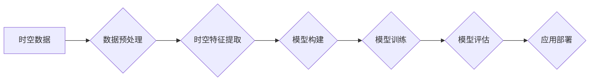

> AI时空建模, 时空数据, 深度学习, 图神经网络, 时序预测, 空间分析, 计算机视觉

## 1. 背景介绍

随着人工智能技术的飞速发展，时空数据在各个领域得到了广泛应用，例如交通管理、城市规划、精准营销等。时空数据包含了时间和空间两个维度的信息，其复杂性和多样性使得传统的处理方法难以满足需求。因此，构建高效的AI时空建模方法成为一个重要的研究方向。

AI时空建模旨在利用人工智能技术，对时空数据进行分析、预测和理解，从而挖掘其中的潜在价值。它融合了人工智能、地理信息科学、数据库技术等多学科的知识，为解决现实世界中的时空问题提供了新的思路和方法。

## 2. 核心概念与联系

**2.1 时空数据**

时空数据是指包含时间和空间信息的数据，例如GPS轨迹、传感器数据、社交媒体信息等。时空数据的特点是：

* **多维性:** 包含时间和空间两个维度，以及可能的其他属性信息。
* **动态性:** 时空数据随时间不断变化，具有动态性。
* **关联性:** 不同时空数据之间存在着复杂的关联关系。

**2.2 AI时空建模**

AI时空建模是指利用人工智能技术对时空数据进行分析、预测和理解，从而挖掘其中的潜在价值。它包括以下几个关键步骤：

* **数据采集:** 收集各种类型的时空数据。
* **数据预处理:** 对收集到的数据进行清洗、转换和格式化。
* **时空特征提取:** 从时空数据中提取有意义的特征，例如轨迹、热点、聚类等。
* **模型构建:** 利用深度学习、图神经网络等人工智能技术构建时空建模模型。
* **模型训练:** 使用训练数据对模型进行训练，使其能够准确地预测和理解时空数据。
* **模型评估:** 使用测试数据对模型进行评估，并根据评估结果进行模型优化。
* **应用部署:** 将训练好的模型部署到实际应用场景中，例如交通预测、城市规划、精准营销等。

**2.3  核心架构**



## 3. 核心算法原理 & 具体操作步骤

### 3.1  算法原理概述

AI时空建模中常用的算法包括：

* **深度学习:** 深度学习算法能够自动学习时空数据的复杂特征，并进行预测和分类。常用的深度学习模型包括循环神经网络(RNN)、长短期记忆网络(LSTM)和卷积神经网络(CNN)。
* **图神经网络:** 图神经网络能够处理时空数据的关联关系，并进行节点分类、边预测等任务。常用的图神经网络模型包括Graph Convolutional Network (GCN)和Graph Attention Network (GAT)。

### 3.2  算法步骤详解

**3.2.1 深度学习算法步骤:**

1. **数据预处理:** 对时空数据进行清洗、转换和格式化，例如将时间信息转换为数字格式，将空间信息转换为坐标系等。
2. **特征提取:** 从预处理后的数据中提取有意义的特征，例如时间序列特征、空间距离特征、轨迹特征等。
3. **模型构建:** 选择合适的深度学习模型，例如RNN、LSTM或CNN，并根据任务需求进行模型结构设计。
4. **模型训练:** 使用训练数据对模型进行训练，并使用损失函数和优化算法进行模型参数更新。
5. **模型评估:** 使用测试数据对模型进行评估，并根据评估结果进行模型优化。

**3.2.2 图神经网络算法步骤:**

1. **图构建:** 将时空数据转换为图结构，其中节点代表时空实体，边代表时空关系。
2. **特征嵌入:** 对图中的节点和边进行特征嵌入，将它们转换为向量表示。
3. **图卷积:** 使用图卷积操作对图结构进行信息传播，学习节点之间的关系特征。
4. **节点分类或边预测:** 根据学习到的特征，对图中的节点进行分类或预测图中的边关系。

### 3.3  算法优缺点

**3.3.1 深度学习算法:**

* **优点:** 能够自动学习时空数据的复杂特征，具有较高的预测精度。
* **缺点:** 需要大量的训练数据，训练时间较长，模型解释性较差。

**3.3.2 图神经网络算法:**

* **优点:** 能够处理时空数据的关联关系，对稀疏数据具有较好的鲁棒性。
* **缺点:** 对图结构的构建和特征嵌入有较高的要求，模型规模较大。

### 3.4  算法应用领域

AI时空建模算法在以下领域具有广泛的应用前景：

* **交通预测:** 预测交通流量、拥堵情况、出行时间等。
* **城市规划:** 分析城市人口流动、交通模式、资源分布等，为城市规划提供决策支持。
* **精准营销:** 根据用户时空轨迹和行为模式，进行精准的广告投放和营销活动。
* **安全监控:** 分析视频监控数据，识别异常行为和潜在安全威胁。
* **环境监测:** 分析环境监测数据，预测污染物扩散、自然灾害等。

## 4. 数学模型和公式 & 详细讲解 & 举例说明

### 4.1  数学模型构建

时空建模通常使用以下数学模型：

* **时间序列模型:** 用于预测时间序列数据，例如ARIMA、SARIMA、LSTM等。
* **空间统计模型:** 用于分析空间数据，例如空间自相关、空间回归等。
* **时空关联模型:** 用于分析时间和空间之间的关联关系，例如空间-时间克里金插值、时空回归等。

### 4.2  公式推导过程

**4.2.1 ARIMA模型**

ARIMA模型是一种常用的时间序列模型，其核心公式如下：

$$
y_t = c + \phi_1 y_{t-1} + \phi_2 y_{t-2} + ... + \phi_p y_{t-p} + \theta_1 \epsilon_{t-1} + \theta_2 \epsilon_{t-2} + ... + \theta_q \epsilon_{t-q} + \epsilon_t
$$

其中：

* $y_t$ 是时间点 $t$ 的观测值。
* $c$ 是截距项。
* $\phi_i$ 是自回归系数。
* $\theta_i$ 是移动平均系数。
* $\epsilon_t$ 是白噪声项。
* $p$ 是自回归阶数。
* $q$ 是移动平均阶数。

**4.2.2 空间自相关模型**

空间自相关模型用于分析空间数据之间的相关性，常用的模型包括Moran's I和Geary's C。

**Moran's I:**

$$
I = \frac{\sum_{i=1}^{n} \sum_{j=1}^{n} w_{ij} (z_i - \bar{z})(z_j - \bar{z})}{\sum_{i=1}^{n} \sum_{j=1}^{n} w_{ij} \sum_{i=1}^{n} (z_i - \bar{z})^2}
$$

其中：

* $z_i$ 是空间单元 $i$ 的值。
* $\bar{z}$ 是所有空间单元值的平均值。
* $w_{ij}$ 是空间单元 $i$ 和 $j$ 之间的权重。

### 4.3  案例分析与讲解

**4.3.1 交通流量预测**

可以使用ARIMA模型预测交通流量，例如预测某个路段在特定时间段的车辆流量。

**4.3.2 城市热点分析**

可以使用空间自相关模型分析城市热点，例如分析城市中人口密度、商业活动、犯罪率等热点区域。

## 5. 项目实践：代码实例和详细解释说明

### 5.1  开发环境搭建

* **操作系统:** Ubuntu 20.04
* **编程语言:** Python 3.8
* **深度学习框架:** TensorFlow 2.0
* **图神经网络库:** PyTorch Geometric

### 5.2  源代码详细实现

```python
# 导入必要的库
import tensorflow as tf
from tensorflow.keras.models import Sequential
from tensorflow.keras.layers import LSTM, Dense

# 定义LSTM模型
model = Sequential()
model.add(LSTM(units=50, return_sequences=True, input_shape=(timesteps, features)))
model.add(LSTM(units=50))
model.add(Dense(units=1))

# 编译模型
model.compile(optimizer='adam', loss='mean_squared_error')

# 训练模型
model.fit(X_train, y_train, epochs=100, batch_size=32)

# 评估模型
loss = model.evaluate(X_test, y_test)
print('Test loss:', loss)
```

### 5.3  代码解读与分析

* **LSTM模型:** 使用LSTM网络进行时间序列预测，LSTM网络能够学习时间序列数据的长期依赖关系。
* **模型结构:** 模型包含两层LSTM层和一层全连接层，用于输出预测值。
* **模型编译:** 使用Adam优化器和均方误差损失函数对模型进行编译。
* **模型训练:** 使用训练数据对模型进行训练，训练epochs和batch_size可以根据实际情况进行调整。
* **模型评估:** 使用测试数据对模型进行评估，并打印测试损失。

### 5.4  运行结果展示

运行代码后，可以得到模型的训练过程和测试结果，例如训练损失、测试损失、预测值与真实值的对比图等。

## 6. 实际应用场景

### 6.1 交通预测

AI时空建模可以用于预测交通流量、拥堵情况、出行时间等，为交通管理提供决策支持。例如，可以预测高峰时段的交通流量，并根据预测结果调整交通信号灯的控制策略，从而缓解交通拥堵。

### 6.2 城市规划

AI时空建模可以分析城市人口流动、交通模式、资源分布等，为城市规划提供决策支持。例如，可以分析城市居民的出行轨迹，并根据分析结果规划新的公共交通线路，提高城市交通效率。

### 6.3 精准营销

AI时空建模可以根据用户时空轨迹和行为模式，进行精准的广告投放和营销活动。例如，可以根据用户的购物历史和出行轨迹，向用户推送相关的商品广告。

### 6.4 未来应用展望

AI时空建模在未来将有更广泛的应用前景，例如：

* **智能城市:** 建立智能交通系统、智能环境监测系统、智能安全监控系统等。
* **智慧医疗:** 分析患者的时空轨迹和健康数据，进行疾病预测和预防。
* **精准农业:** 分析农作物的生长环境和产量数据，进行精准施肥和灌溉。

## 7. 工具和资源推荐

### 7.1 学习资源推荐

* **书籍:**
    * 《深度学习》
    * 《图神经网络》
    * 《时空数据分析》
* **在线课程:**
    * Coursera: 深度学习
    * edX: 图神经网络
    * Udacity: 时空数据分析

### 7.2 开发工具推荐

* **编程语言:** Python
* **深度学习框架:** TensorFlow, PyTorch
* **图神经网络库:** PyTorch Geometric, DGL

### 7.3 相关论文推荐

* **时空建模:**
    * "A Survey on Spatio-Temporal Data Mining"
    * "Spatio-Temporal Data Analysis: A Review"
* **深度学习:**
    * "Deep Learning"
    * "Recurrent Neural Networks"
* **图神经网络:**
    * "Graph Convolutional Networks"
    * "Graph Attention Networks"

## 8. 总结：未来发展趋势与挑战

### 8.1 研究成果总结

AI时空建模取得了显著的进展，在交通预测