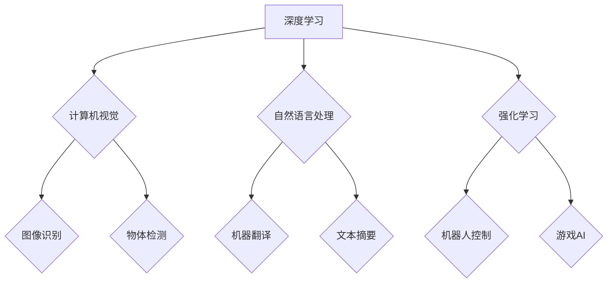

> 人工智能，深度学习，计算机视觉，自然语言处理，强化学习，模型压缩，可解释性，伦理

## 1. 背景介绍

人工智能（AI）正以惊人的速度发展，深刻地改变着我们生活的方方面面。从自动驾驶汽车到智能语音助手，AI技术已经渗透到我们的日常生活中。作为AI领域的领军人物之一，Andrej Karpathy 在过去几年中做出了许多开创性的贡献，他的研究和观点对AI的未来发展方向具有重要的指导意义。

## 2. 核心概念与联系

**2.1 深度学习**

深度学习是人工智能领域的一个重要分支，它利用多层神经网络来模拟人类大脑的学习过程。通过大量的训练数据，深度学习模型能够自动学习特征，并进行复杂的模式识别和预测。

**2.2 计算机视觉**

计算机视觉是让计算机“看”世界的一种技术，它旨在使计算机能够理解和解释图像和视频信息。深度学习在计算机视觉领域取得了突破性的进展，例如图像识别、物体检测、图像分割等。

**2.3 自然语言处理**

自然语言处理（NLP）是让计算机“理解”人类语言的技术，它旨在使计算机能够理解、生成和处理自然语言文本。深度学习在NLP领域也取得了显著的成果，例如机器翻译、文本摘要、情感分析等。

**2.4 强化学习**

强化学习是一种基于奖励机制的机器学习方法，它通过不断与环境交互，学习最优的策略来最大化奖励。强化学习在机器人控制、游戏 AI 等领域具有广泛的应用前景。

**2.5 模型压缩**

随着深度学习模型规模的不断增长，模型部署和推理效率成为一个瓶颈。模型压缩技术旨在通过各种方法减小模型大小，提高推理速度，同时保持模型性能。

**2.6 可解释性**

深度学习模型的决策过程通常是不可解释的，这使得其应用在一些关键领域受到限制。可解释性研究旨在提高深度学习模型的透明度，使人类能够理解模型的决策过程。

**2.7 伦理**

随着AI技术的快速发展，其伦理问题也日益受到关注。例如，AI算法的偏见、隐私保护、责任归属等问题都需要得到认真思考和解决。

**Mermaid 流程图**



## 3. 核心算法原理 & 具体操作步骤

### 3.1 算法原理概述

深度学习算法的核心是多层神经网络，它由多个神经元组成的层级结构组成。每个神经元接收来自上一层的输入，并通过权重进行加权求和，然后经过激活函数进行非线性变换，最后输出到下一层。通过训练大量的样本数据，神经网络的权重会不断调整，最终学习到数据的特征和规律。

### 3.2 算法步骤详解

1. **数据预处理:** 将原始数据转换为深度学习模型可以理解的格式，例如归一化、编码等。
2. **网络结构设计:** 根据任务需求设计神经网络的层数、神经元数量、激活函数等参数。
3. **模型训练:** 使用训练数据训练神经网络，通过反向传播算法调整神经网络的权重，使模型的预测结果与真实值尽可能接近。
4. **模型评估:** 使用测试数据评估模型的性能，例如准确率、召回率、F1-score等。
5. **模型调优:** 根据评估结果，调整模型参数，例如学习率、正则化参数等，以提高模型性能。

### 3.3 算法优缺点

**优点:**

* 能够自动学习特征，无需人工特征工程。
* 能够处理复杂的数据模式，取得优异的性能。
* 广泛应用于各种领域，例如计算机视觉、自然语言处理、语音识别等。

**缺点:**

* 需要大量的训练数据，否则模型性能会下降。
* 训练过程耗时且耗能。
* 模型的决策过程通常是不可解释的。

### 3.4 算法应用领域

深度学习算法已广泛应用于以下领域：

* **计算机视觉:** 图像识别、物体检测、图像分割、人脸识别、视频分析等。
* **自然语言处理:** 机器翻译、文本摘要、情感分析、问答系统、聊天机器人等。
* **语音识别:** 语音转文本、语音助手、语音搜索等。
* **推荐系统:** 商品推荐、内容推荐、用户画像等。
* **医疗诊断:** 病理图像分析、疾病预测、药物研发等。

## 4. 数学模型和公式 & 详细讲解 & 举例说明

### 4.1 数学模型构建

深度学习模型通常可以看作是一个多层感知机（MLP），其数学模型可以表示为：

$$
y = f(W_L \cdot a_{L-1} + b_L)
$$

其中：

* $y$ 是模型的输出。
* $a_{L-1}$ 是上一层的激活值。
* $W_L$ 是第 $L$ 层的权重矩阵。
* $b_L$ 是第 $L$ 层的偏置向量。
* $f$ 是激活函数。

### 4.2 公式推导过程

深度学习模型的训练过程是通过反向传播算法来进行的。反向传播算法的核心思想是通过计算损失函数对模型参数的梯度，并利用梯度下降法更新模型参数。

损失函数通常定义为预测值与真实值的差值，例如均方误差（MSE）：

$$
L = \frac{1}{N} \sum_{i=1}^{N} (y_i - \hat{y}_i)^2
$$

其中：

* $N$ 是样本数量。
* $y_i$ 是第 $i$ 个样本的真实值。
* $\hat{y}_i$ 是第 $i$ 个样本的预测值。

通过链式法则，可以计算损失函数对每个参数的梯度，并利用梯度下降法更新参数：

$$
\theta = \theta - \alpha \nabla L(\theta)
$$

其中：

* $\theta$ 是模型参数。
* $\alpha$ 是学习率。
* $\nabla L(\theta)$ 是损失函数对参数 $\theta$ 的梯度。

### 4.3 案例分析与讲解

例如，在图像分类任务中，深度学习模型可以学习到图像特征，并将其映射到不同的类别。训练过程中，模型会不断调整权重，使预测结果与真实类别尽可能一致。

## 5. 项目实践：代码实例和详细解释说明

### 5.1 开发环境搭建

* Python 3.x
* TensorFlow 或 PyTorch
* CUDA 和 cuDNN (可选，用于GPU加速)

### 5.2 源代码详细实现

```python
import tensorflow as tf

# 定义模型结构
model = tf.keras.models.Sequential([
    tf.keras.layers.Conv2D(32, (3, 3), activation='relu', input_shape=(28, 28, 1)),
    tf.keras.layers.MaxPooling2D((2, 2)),
    tf.keras.layers.Conv2D(64, (3, 3), activation='relu'),
    tf.keras.layers.MaxPooling2D((2, 2)),
    tf.keras.layers.Flatten(),
    tf.keras.layers.Dense(10, activation='softmax')
])

# 编译模型
model.compile(optimizer='adam',
              loss='sparse_categorical_crossentropy',
              metrics=['accuracy'])

# 训练模型
model.fit(x_train, y_train, epochs=5)

# 评估模型
loss, accuracy = model.evaluate(x_test, y_test)
print('Test loss:', loss)
print('Test accuracy:', accuracy)
```

### 5.3 代码解读与分析

这段代码定义了一个简单的卷积神经网络模型，用于手写数字识别任务。

* `tf.keras.models.Sequential` 创建了一个顺序模型，层级结构按照顺序连接。
* `tf.keras.layers.Conv2D` 定义了一个卷积层，用于提取图像特征。
* `tf.keras.layers.MaxPooling2D` 定义了一个最大池化层，用于降维和提高模型鲁棒性。
* `tf.keras.layers.Flatten` 将多维特征转换为一维向量。
* `tf.keras.layers.Dense` 定义了一个全连接层，用于分类。
* `model.compile` 编译模型，指定优化器、损失函数和评价指标。
* `model.fit` 训练模型，使用训练数据进行训练。
* `model.evaluate` 评估模型，使用测试数据计算损失和准确率。

### 5.4 运行结果展示

训练完成后，模型的准确率会随着训练轮数的增加而提高。最终的准确率取决于训练数据、模型结构和超参数设置等因素。

## 6. 实际应用场景

### 6.1 医疗诊断

深度学习可以用于分析医学图像，例如X光片、CT扫描和MRI扫描，辅助医生诊断疾病。例如，深度学习模型可以用于检测肺癌、乳腺癌和脑肿瘤等。

### 6.2 自动驾驶

深度学习是自动驾驶汽车的关键技术之一，它可以用于感知周围环境、规划路径和控制车辆。例如，深度学习模型可以用于识别道路标线、交通信号灯和行人等。

### 6.3 金融风险管理

深度学习可以用于分析金融数据，识别潜在的风险和欺诈行为。例如，深度学习模型可以用于检测信用卡欺诈、股票市场异常波动和客户信用风险等。

### 6.4 未来应用展望

随着深度学习技术的不断发展，其应用场景将更加广泛。例如，深度学习可以用于个性化教育、精准医疗、智能制造等领域。

## 7. 工具和资源推荐

### 7.1 学习资源推荐

* **书籍:**
    * Deep Learning by Ian Goodfellow, Yoshua Bengio, and Aaron Courville
    * Hands-On Machine Learning with Scikit-Learn, Keras & TensorFlow by Aurélien Géron
* **在线课程:**
    * Deep Learning Specialization by Andrew Ng (Coursera)
    * Fast.ai Deep Learning Course
* **博客和网站:**
    * Andrej Karpathy's Blog: https://karpathy.github.io/
    * OpenAI Blog: https://openai.com/blog/

### 7.2 开发工具推荐

* **TensorFlow:** https://www.tensorflow.org/
* **PyTorch:** https://pytorch.org/
* **Keras:** https://keras.io/

### 7.3 相关论文推荐

* **ImageNet Classification with Deep Convolutional Neural Networks** by Alex Krizhevsky, Ilya Sutskever, and Geoffrey E. Hinton
* **Attention Is All You Need** by Ashish Vaswani, Noam Shazeer, Niki Parmar, Jakob Uszkoreit, Llion Jones, Aidan N. Gomez, Łukasz Kaiser, and Illia Polosukhin

## 8. 总结：未来发展趋势与挑战

### 8.1 研究成果总结

近年来，深度学习取得了令人瞩目的成果，在计算机视觉、自然语言处理、语音识别等领域取得了突破性的进展。

### 8.2 未来发展趋势

* **模型规模和效率:** 研究更大型、更高效的深度学习模型，以提高模型性能和推理速度。
* **可解释性:** 研究更可解释的深度学习模型，使模型的决策过程更加透明。
* **联邦学习:** 研究联邦学习等隐私保护技术，使深度学习模型能够在不泄露敏感数据的情况下进行训练。
* **跨模态学习:** 研究跨模态学习，使深度学习模型能够理解和处理