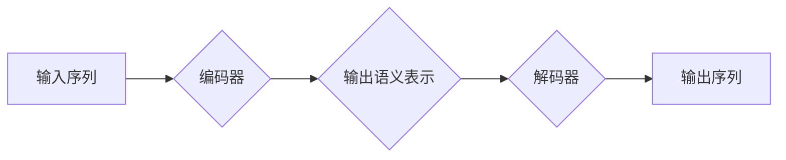

BERT, Transformer, 自然语言处理, 文本理解, 预训练语言模型, 序列标注, 代码实战

## 1. 背景介绍

自然语言处理 (NLP) 领域近年来取得了显著进展，其中预训练语言模型 (PLM) 扮演着越来越重要的角色。BERT (Bidirectional Encoder Representations from Transformers) 是 Google AI 团队于 2018 年提出的一个强大的 PLM，它在许多 NLP 任务中取得了state-of-the-art 的性能，例如文本分类、问答系统、情感分析等。BERT 的核心优势在于其双向编码机制和 Transformer 架构，能够更好地理解上下文信息，从而提升模型的表达能力和泛化能力。

## 2. 核心概念与联系

BERT 基于 Transformer 架构，并采用了双向编码机制。

**2.1 Transformer 架构**

Transformer 架构是一种新型的序列到序列模型，它摒弃了传统的循环神经网络 (RNN) 的顺序处理方式，而是通过注意力机制 (Attention) 来捕捉序列中的长距离依赖关系。Transformer 的核心组件包括：

* **编码器 (Encoder):** 用于将输入序列编码成语义表示。
* **解码器 (Decoder):** 用于根据编码后的语义表示生成输出序列。

**2.2 双向编码机制**

传统的语言模型通常采用单向编码机制，即只考虑输入序列中的前一个词的信息。而 BERT 则采用了双向编码机制，它同时考虑了输入序列中的前后词的信息，从而能够更好地理解上下文信息。

**2.3 Mermaid 流程图**



## 3. 核心算法原理 & 具体操作步骤

**3.1 算法原理概述**

BERT 的核心算法原理是通过训练一个双向编码器来学习语言的语义表示。训练过程主要包括以下步骤：

1. **Masked Language Modeling (MLM):** 随机遮盖输入序列中的部分词，然后训练模型预测被遮盖词的词语。
2. **Next Sentence Prediction (NSP):** 给定两个句子，训练模型预测这两个句子是否相邻。

**3.2 算法步骤详解**

1. **数据预处理:** 将文本数据进行分词、标记等预处理操作。
2. **模型构建:** 使用 Transformer 架构构建 BERT 模型，包括编码器和解码器。
3. **模型训练:** 使用 MLM 和 NSP 任务训练 BERT 模型。
4. **模型评估:** 使用测试集评估模型的性能。
5. **模型微调:** 将预训练好的 BERT 模型微调到特定任务，例如文本分类、问答系统等。

**3.3 算法优缺点**

**优点:**

* 能够更好地理解上下文信息。
* 在许多 NLP 任务中取得了state-of-the-art 的性能。
* 预训练模型可以用于多种下游任务，降低了训练成本。

**缺点:**

* 训练成本较高。
* 模型参数量较大，需要较大的计算资源。

**3.4 算法应用领域**

BERT 在许多 NLP 任务中都有广泛的应用，例如：

* 文本分类
* 问答系统
* 情感分析
* 机器翻译
* 文本摘要

## 4. 数学模型和公式 & 详细讲解 & 举例说明

**4.1 数学模型构建**

BERT 模型的数学模型构建基于 Transformer 架构，其核心是注意力机制和多头注意力机制。

**4.2 公式推导过程**

注意力机制的公式如下：

$$
Attention(Q, K, V) = softmax(\frac{QK^T}{\sqrt{d_k}})V
$$

其中：

* $Q$：查询矩阵
* $K$：键矩阵
* $V$：值矩阵
* $d_k$：键向量的维度
* $softmax$：softmax 函数

多头注意力机制是将多个注意力机制并行执行，然后将结果进行拼接。

**4.3 案例分析与讲解**

假设我们有一个句子 "The cat sat on the mat"，我们想要计算 "cat" 这个词的注意力权重。

1. 将句子编码成词向量表示。
2. 计算 "cat" 词的查询向量 $Q$，以及其他词的键向量 $K$ 和值向量 $V$。
3. 计算注意力权重，即每个词对 "cat" 的注意力贡献。
4. 将注意力权重与值向量进行加权求和，得到 "cat" 词的最终语义表示。

## 5. 项目实践：代码实例和详细解释说明

**5.1 开发环境搭建**

* Python 3.6+
* TensorFlow 或 PyTorch
* CUDA 和 cuDNN (可选)

**5.2 源代码详细实现**

```python
# 使用 TensorFlow 实现 BERT 模型的简单示例

import tensorflow as tf

# 定义 BERT 模型的编码器层
class BERTEncoder(tf.keras.layers.Layer):
    def __init__(self, vocab_size, embedding_dim, num_heads, num_layers):
        super(BERTEncoder, self).__init__()
        self.embedding = tf.keras.layers.Embedding(vocab_size, embedding_dim)
        self.transformer_blocks = [
            tf.keras.layers.MultiHeadAttention(num_heads=num_heads, key_dim=embedding_dim)
            for _ in range(num_layers)
        ]

    def call(self, inputs):
        # 将输入序列编码成词向量表示
        embeddings = self.embedding(inputs)
        # 通过 Transformer 块进行编码
        for transformer_block in self.transformer_blocks:
            embeddings = transformer_block(embeddings)
        return embeddings

# 定义 BERT 模型
class BERT(tf.keras.Model):
    def __init__(self, vocab_size, embedding_dim, num_heads, num_layers):
        super(BERT, self).__init__()
        self.encoder = BERTEncoder(vocab_size, embedding_dim, num_heads, num_layers)

    def call(self, inputs):
        # 通过编码器进行编码
        embeddings = self.encoder(inputs)
        return embeddings

# 实例化 BERT 模型
bert = BERT(vocab_size=30000, embedding_dim=128, num_heads=8, num_layers=6)

# 训练 BERT 模型
# ...

```

**5.3 代码解读与分析**

* `BERTEncoder` 类定义了 BERT 模型的编码器层，包含词嵌入层和多个 Transformer 块。
* `BERT` 类定义了完整的 BERT 模型，包含编码器层。
* 代码示例展示了如何实例化 BERT 模型并进行训练。

**5.4 运行结果展示**

训练完成后，BERT 模型可以用于各种下游任务，例如文本分类、问答系统等。

## 6. 实际应用场景

BERT 在许多实际应用场景中取得了成功，例如：

* **搜索引擎:** BERT 可以用于理解用户搜索意图，提高搜索结果的准确率。
* **聊天机器人:** BERT 可以用于训练更智能的聊天机器人，能够更好地理解用户对话内容。
* **文本摘要:** BERT 可以用于自动生成文本摘要，提取文本的关键信息。

**6.4 未来应用展望**

BERT 的应用前景十分广阔，未来可能在以下领域得到更广泛的应用：

* **多语言理解:** 将 BERT 扩展到支持多种语言。
* **跨模态理解:** 将 BERT 与其他模态数据 (例如图像、音频) 结合，实现跨模态理解。
* **个性化推荐:** 使用 BERT 理解用户的偏好，提供个性化推荐。

## 7. 工具和资源推荐

**7.1 学习资源推荐**

* **BERT 官方论文:** https://arxiv.org/abs/1810.04805
* **Hugging Face Transformers 库:** https://huggingface.co/transformers/
* **TensorFlow 官方文档:** https://www.tensorflow.org/

**7.2 开发工具推荐**

* **Jupyter Notebook:** https://jupyter.org/
* **Google Colab:** https://colab.research.google.com/

**7.3 相关论文推荐**

* **XLNet:** https://arxiv.org/abs/1906.08237
* **RoBERTa:** https://arxiv.org/abs/1907.11692
* **GPT-3:** https://openai.com/blog/gpt-3/

## 8. 总结：未来发展趋势与挑战

**8.1 研究成果总结**

BERT 的提出和发展标志着预训练语言模型在 NLP 领域取得了重大突破。BERT 的双向编码机制和 Transformer 架构能够更好地理解上下文信息，从而提升了模型的表达能力和泛化能力。

**8.2 未来发展趋势**

* **模型规模的进一步扩大:** 预训练模型的规模将继续扩大，从而提升模型的性能。
* **多模态理解:** 将 BERT 与其他模态数据 (例如图像、音频) 结合，实现跨模态理解。
* **可解释性:** 研究 BERT 模型的决策过程，提高模型的可解释性。

**8.3 面临的挑战**

* **训练成本:** 预训练大型语言模型的训练成本非常高。
* **数据偏见:** 预训练模型可能受到训练数据中的偏见影响。
* **安全问题:** 预训练模型可能被用于生成恶意内容。

**8.4 研究展望**

未来研究将集中在解决上述挑战，并探索 BERT 在更多领域的新应用。


## 9. 附录：常见问题与解答

**9.1 BERT 和 ELMo 的区别是什么？**

BERT 和 ELMo 都是预训练语言模型，但它们在训练方式和模型结构上有所不同。ELMo 使用单向编码机制，而 BERT 使用双向编码机制。

**9.2 如何使用预训练好的 BERT 模型进行微调？**

可以使用 Hugging Face Transformers 库轻松地进行 BERT 模型的微调。

**9.3 BERT 模型的训练数据是什么？**

BERT 模型的训练数据来自 Google 的 BookCorpus 和 Wikipedia 数据集。


作者：禅与计算机程序设计艺术 / Zen and the Art of Computer Programming 
<end_of_turn>