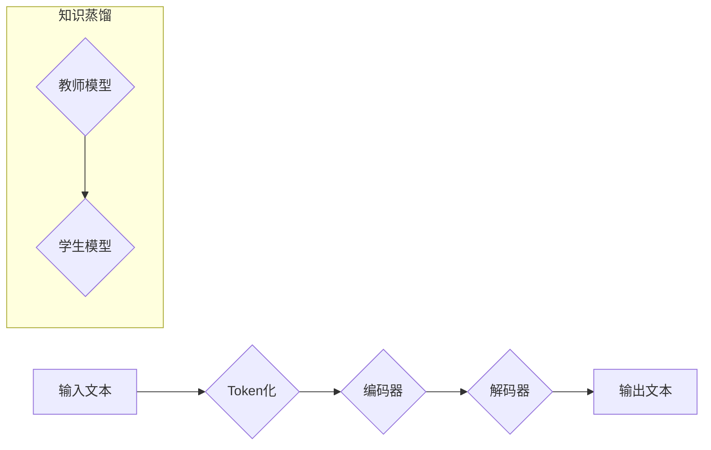

> ChatGLM3-6B, 开源协议, 大语言模型, 知识蒸馏, 训练方法, 应用场景

## 1. 背景介绍

近年来，大语言模型（LLM）在自然语言处理领域取得了显著进展，展现出强大的文本生成、理解和翻译能力。其中，ChatGLM3-6B 是由清华大学人工智能实验室开源的一款60亿参数的对话式LLM，其在对话生成、文本摘要、问答等任务上表现出色。ChatGLM3-6B 的开源协议为研究者和开发者提供了宝贵的资源，促进了LLM技术的普及和应用。

## 2. 核心概念与联系

ChatGLM3-6B 基于Transformer架构，并采用了知识蒸馏技术进行训练。

**2.1 Transformer 架构**

Transformer是一种新型的神经网络架构，其核心是自注意力机制（Self-Attention）。自注意力机制能够捕捉文本序列中单词之间的长距离依赖关系，从而提高模型的理解能力。

**2.2 知识蒸馏**

知识蒸馏是一种模型压缩技术，通过将一个大型模型（教师模型）的知识迁移到一个小型模型（学生模型）中，从而提高小型模型的性能。ChatGLM3-6B 的训练过程中，采用了知识蒸馏技术，将预训练的GPT-3模型的知识迁移到ChatGLM3-6B模型中，从而提高了ChatGLM3-6B的性能。

**2.3  流程图**

## 3. 核心算法原理 & 具体操作步骤

**3.1 算法原理概述**

ChatGLM3-6B 的核心算法是基于Transformer架构的语言模型训练算法。该算法通过最大化预测下一个单词的概率来学习语言的规律。训练过程中，模型会不断调整参数，以最小化预测误差。

**3.2 算法步骤详解**

1. **数据预处理:** 将文本数据进行清洗、分词、标记等预处理操作，生成训练数据。
2. **模型初始化:** 初始化Transformer模型的参数。
3. **前向传播:** 将输入文本通过编码器和解码器进行处理，得到输出文本的概率分布。
4. **损失函数计算:** 计算模型预测结果与真实结果之间的误差，即损失函数值。
5. **反向传播:** 使用梯度下降算法，根据损失函数值更新模型参数。
6. **知识蒸馏:** 将教师模型的输出作为指导信号，调整学生模型的参数，提高学生模型的性能。
7. **迭代训练:** 重复步骤3-6，直到模型性能达到预期目标。

**3.3 算法优缺点**

**优点:**

* 能够捕捉文本序列中长距离依赖关系。
* 训练效率高，能够处理海量文本数据。
* 性能优异，在多种自然语言处理任务上表现出色。

**缺点:**

* 参数量大，需要大量的计算资源进行训练。
* 训练过程复杂，需要专业的技术人员进行操作。

**3.4 算法应用领域**

ChatGLM3-6B 的应用领域非常广泛，包括：

* **对话系统:** 开发更加自然、流畅的对话机器人。
* **文本生成:** 生成高质量的新闻文章、小说、诗歌等文本。
* **机器翻译:** 实现更加准确、自然的机器翻译。
* **问答系统:** 开发能够理解用户问题并提供准确答案的问答系统。

## 4. 数学模型和公式 & 详细讲解 & 举例说明

**4.1 数学模型构建**

ChatGLM3-6B 的数学模型基于Transformer架构，其核心是自注意力机制和多头注意力机制。

**4.2 公式推导过程**

自注意力机制的计算公式如下：

$$
Attention(Q, K, V) = softmax(\frac{QK^T}{\sqrt{d_k}})V
$$

其中：

* $Q$：查询矩阵
* $K$：键矩阵
* $V$：值矩阵
* $d_k$：键向量的维度
* $softmax$：softmax函数

**4.3 案例分析与讲解**

假设我们有一个句子“我爱学习编程”，将其转换为词向量表示，得到四个词向量：

* 我： [0.1, 0.2, 0.3]
* 爱： [0.4, 0.5, 0.6]
* 学习： [0.7, 0.8, 0.9]
* 编程： [1.0, 1.1, 1.2]

使用自注意力机制计算每个词向量与其他词向量的注意力权重，可以得到每个词向量在句子中的重要性得分。例如，"编程" 的注意力权重会比 "我" 高，因为 "编程" 是句子的核心内容。

## 5. 项目实践：代码实例和详细解释说明

**5.1 开发环境搭建**

ChatGLM3-6B 的开发环境需要安装Python、PyTorch等软件包。

**5.2 源代码详细实现**

ChatGLM3-6B 的源代码可以在清华大学人工智能实验室的GitHub仓库中找到。

**5.3 代码解读与分析**

ChatGLM3-6B 的源代码主要包含以下部分：

* 模型定义：定义Transformer模型的结构和参数。
* 训练脚本：定义模型训练的流程和参数。
* 数据处理脚本：定义数据预处理和加载的流程。

**5.4 运行结果展示**

运行ChatGLM3-6B的训练脚本，可以得到模型的训练结果，包括损失函数值、准确率等指标。

## 6. 实际应用场景

ChatGLM3-6B 在多个实际应用场景中取得了成功，例如：

* **智能客服:** 开发能够理解用户问题并提供准确答案的智能客服系统。
* **教育辅助:** 开发能够提供个性化学习建议和答疑服务的教育辅助系统。
* **内容创作:** 开发能够生成高质量文章、故事、诗歌等内容的创作工具。

**6.4 未来应用展望**

ChatGLM3-6B 的未来应用前景广阔，例如：

* **跨语言理解:** 开发能够理解和生成多种语言的对话系统。
* **多模态交互:** 开发能够理解和生成文本、图像、音频等多模态信息的交互系统。
* **个性化服务:** 开发能够根据用户需求提供个性化服务的系统。

## 7. 工具和资源推荐

**7.1 学习资源推荐**

* Transformer论文：https://arxiv.org/abs/1706.03762
* PyTorch文档：https://pytorch.org/docs/stable/index.html

**7.2 开发工具推荐**

* PyTorch：https://pytorch.org/
* TensorFlow：https://www.tensorflow.org/

**7.3 相关论文推荐**

* ChatGLM: https://arxiv.org/abs/2203.09979
* GPT-3：https://openai.com/blog/gpt-3/

## 8. 总结：未来发展趋势与挑战

**8.1 研究成果总结**

ChatGLM3-6B 的开源协议为LLM研究和应用提供了宝贵的资源，促进了LLM技术的普及和发展。

**8.2 未来发展趋势**

未来LLM的发展趋势包括：

* 模型规模的进一步扩大
* 模型性能的持续提升
* 应用场景的不断拓展
* 伦理和安全问题的解决

**8.3 面临的挑战**

LLM的发展还面临着一些挑战，例如：

* 计算资源的限制
* 数据获取和标注的困难
* 伦理和安全问题的关注

**8.4 研究展望**

未来研究方向包括：

* 开发更加高效的训练算法
* 探索新的模型架构
* 构建更加安全可靠的LLM系统

## 9. 附录：常见问题与解答

**9.1 如何下载ChatGLM3-6B的模型权重？**

ChatGLM3-6B的模型权重可以在清华大学人工智能实验室的GitHub仓库中下载。

**9.2 如何使用ChatGLM3-6B进行对话生成？**

可以使用ChatGLM3-6B的源代码进行对话生成。

**9.3 ChatGLM3-6B的训练数据是什么？**

ChatGLM3-6B的训练数据包括大量的文本数据，例如书籍、文章、对话等。

作者：禅与计算机程序设计艺术 / Zen and the Art of Computer Programming 

<end_of_turn>