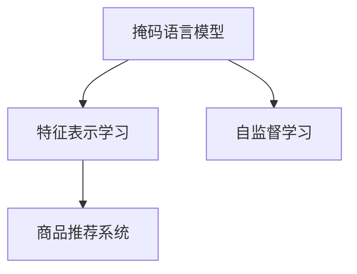

                 

## 1. 背景介绍

### 1.1 问题由来
在电商平台上，商品分类、检索、推荐、评价等任务需要商品特征信息的支持。特征表示学习(Feature Representation Learning)，旨在从原始数据中自动学习出商品的关键特征，以提高这些任务的效果。传统的特征表示学习方式主要依赖手工设计特征，如物品ID、价格、颜色、品牌等。但这些特征往往难以捕捉到潜在的语义信息，尤其是对于一些多模态、复杂语义的商品描述，手工特征设计的难度和成本都很大。因此，近年来研究者们逐步将目光转向自动学习商品特征的算法。

特征表示学习可以分为两类：监督学习和自监督学习。监督学习需要大量标注数据，训练复杂且效果不稳定。相比之下，自监督学习通过无标签数据自动学习特征，可以省去标注成本，且在大规模数据上效果显著。自监督学习方法主要有：
1. 对比学习(Contrastive Learning)：通过最大化相似样本间的相似性，最小化不同样本间的相似性，学习样本的特征表示。
2. 生成对抗网络(GAN)：生成模型和判别模型相互博弈，学习样本的特征表示。
3. 噪声自编码器(Noise Autoencoder)：通过给输入数据添加噪声，学习特征的鲁棒性和稀疏性。
4. 掩码语言模型(Masked Language Modeling)：通过掩码输入数据，预测掩码位置，学习特征的语义关系。

商品特征表示学习是自监督学习的重要应用之一，对商品推荐、检索、分类等任务具有重要意义。本文将重点介绍一种基于掩码语言模型的商品特征表示学习方法，旨在从商品描述中自动学习特征，并应用于商品推荐任务。

## 2. 核心概念与联系

### 2.1 核心概念概述

为更好地理解基于掩码语言模型的商品特征表示学习方法，本节将介绍几个关键概念：

- 掩码语言模型(Masked Language Modeling, Masked LM)：通过随机掩码输入文本，预测掩码位置的词语，学习词与词之间的语义关系。掩码语言模型是Transformer等现代预训练模型的重要组成部分。
- 特征表示学习(Feature Representation Learning)：从原始数据中自动学习特征，提高下游任务的性能。商品特征表示学习是特征表示学习的一种特殊应用，旨在从商品描述中学习商品的关键特征。
- 自监督学习(Self-supervised Learning)：通过无标签数据训练模型，学习数据的潜在表示。基于掩码语言模型的商品特征表示学习是一种典型的自监督学习方法。
- 商品推荐系统(Recommendation System)：根据用户的历史行为数据和商品特征信息，推荐用户可能感兴趣的商品。基于掩码语言模型的商品特征表示学习可以提升推荐系统的个性化和效果。

这些核心概念之间的逻辑关系可以通过以下Mermaid流程图来展示：



这个流程图展示了掩码语言模型、特征表示学习与商品推荐系统的联系：

1. 掩码语言模型通过无标签文本数据训练模型，学习词与词之间的语义关系。
2. 特征表示学习利用掩码语言模型自动学习商品特征，提升推荐系统的表现。
3. 自监督学习通过无标签数据训练特征表示模型，避免标注数据的成本。
4. 商品推荐系统利用特征表示模型，根据用户行为和商品特征推荐商品。

这些概念共同构成了基于掩码语言模型的商品特征表示学习方法的理论基础，使得特征自动化的方式成为可能。

## 3. 核心算法原理 & 具体操作步骤

### 3.1 算法原理概述

基于掩码语言模型的商品特征表示学习，是一种自监督学习范式。其核心思想是：通过随机掩码商品描述文本中的词语，预测被掩码词语的上下文，学习词语间的语义关系。掩码语言模型在预训练过程中学习到的词语表示，可以用于商品特征表示学习，从而提升推荐系统的个性化和效果。

形式化地，假设商品描述文本为 $T$，掩码后的文本为 $M(T)$，其中 $M$ 为掩码函数。特征表示模型 $F$ 通过预测掩码位置 $M(T)$ 的词语，学习商品的关键特征，记为 $f(T)$。

### 3.2 算法步骤详解

基于掩码语言模型的商品特征表示学习方法包括以下关键步骤：

**Step 1: 准备数据集**
- 收集商品描述文本数据集 $D=\{(T_i, M(T_i))\}_{i=1}^N$，其中 $T_i$ 为原始商品描述文本，$M(T_i)$ 为掩码后的文本。
- 分割数据集为训练集、验证集和测试集，各集划分比例一般为 $70\%$、$15\%$ 和 $15\%$。

**Step 2: 构建模型**
- 定义掩码语言模型 $M$，通常使用BERT、RoBERTa等预训练模型。
- 定义特征表示模型 $F$，可以是简单的线性层或更复杂的神经网络结构。

**Step 3: 训练模型**
- 将数据集输入掩码语言模型，训练得到掩码位置 $M(T)$ 的词语预测。
- 将掩码位置 $M(T)$ 的词语预测输入特征表示模型 $F$，训练得到商品的关键特征表示 $f(T)$。
- 周期性在验证集上评估模型性能，根据性能指标决定是否触发Early Stopping。

**Step 4: 特征表示学习**
- 使用特征表示模型 $F$，对商品描述文本 $T$ 进行特征表示学习，得到商品的关键特征表示 $f(T)$。
- 将 $f(T)$ 作为商品推荐模型的输入，训练得到推荐模型。

**Step 5: 推荐系统评估**
- 在测试集上评估推荐模型的推荐效果，对比微调前后的性能提升。
- 使用推荐模型对新商品进行推荐，并在实际应用系统中集成。

以上就是基于掩码语言模型的商品特征表示学习的一般流程。在实际应用中，还需要针对具体任务的特点，对模型和训练过程进行优化设计，如改进训练目标函数，引入更多的正则化技术，搜索最优的超参数组合等，以进一步提升模型性能。

### 3.3 算法优缺点

基于掩码语言模型的商品特征表示学习方法具有以下优点：
1. 自监督学习。利用无标签的商品描述数据，避免标注数据的高成本和标注偏差。
2. 自动学习特征。自动从商品描述中学习关键特征，无需手工设计特征。
3. 适应性强。可适用于多种商品描述数据类型，包括文本、图片、视频等。
4. 推荐效果提升。结合预训练模型和掩码语言模型，能够提升商品推荐系统的个性化和效果。

同时，该方法也存在一定的局限性：
1. 模型复杂度高。掩码语言模型和特征表示模型的复杂度较高，训练和推理耗时较长。
2. 数据需求大。需要大规模无标签商品描述数据，才能训练出高质量的特征表示模型。
3. 特征局限性。基于掩码语言模型学习到的特征可能局限于描述文本中出现的词语，难以捕捉到更深层的语义信息。
4. 解释性不足。特征表示模型通常是"黑盒"系统，难以解释特征学习的过程和结果。

尽管存在这些局限性，但就目前而言，基于掩码语言模型的商品特征表示学习方法仍是特征自动化的重要手段。未来相关研究的重点在于如何进一步降低模型复杂度，提高特征泛化能力，同时兼顾可解释性和应用效果。

### 3.4 算法应用领域

基于掩码语言模型的商品特征表示学习方法，在商品推荐系统中得到了广泛应用，具体包括：

- 商品检索：根据用户输入的商品描述，在商品库中检索出相似的商品。
- 商品分类：将商品按照不同类别进行分类，便于管理。
- 商品排序：根据用户历史行为和商品特征，对商品进行排序，提升用户满意度。
- 商品相似度计算：计算商品之间的语义相似度，用于推荐和检索。
- 商品个性化推荐：根据用户的历史行为和商品特征，推荐用户可能感兴趣的商品。

除了这些常见的应用外，基于掩码语言模型的商品特征表示方法还被创新性地应用到更多场景中，如用户行为分析、广告投放优化、市场趋势预测等，为电商行业带来了全新的突破。

## 4. 数学模型和公式 & 详细讲解 & 举例说明

### 4.1 数学模型构建

本节将使用数学语言对基于掩码语言模型的商品特征表示学习过程进行更加严格的刻画。

假设商品描述文本为 $T$，掩码后的文本为 $M(T)$，其中 $M$ 为掩码函数。特征表示模型 $F$ 通过预测掩码位置 $M(T)$ 的词语，学习商品的关键特征，记为 $f(T)$。

在掩码语言模型中，假设每个词语的掩码概率为 $p$，掩码位置 $i$ 的词语预测为 $p_i$。掩码语言模型的训练目标函数为：

$$
L_{\text{mask}}(\theta) = -\frac{1}{N}\sum_{i=1}^N \log p_i
$$

其中 $N$ 为总样本数，$\theta$ 为掩码语言模型的参数。掩码位置 $i$ 的词语预测 $p_i$ 为：

$$
p_i = \frac{\exp(\log z_i)}{\sum_{j=1}^n \exp(\log z_j)}
$$

其中 $z_i$ 为掩码位置 $i$ 的词语预测的得分，可以通过掩码语言模型的参数 $\theta$ 和输入文本 $T$ 计算得到。

特征表示模型 $F$ 通过掩码语言模型训练得到的词语预测，学习商品的关键特征表示 $f(T)$。假设特征表示模型的参数为 $\omega$，则特征表示模型的训练目标函数为：

$$
L_{\text{feature}}(\omega) = -\frac{1}{N}\sum_{i=1}^N \log f_i
$$

其中 $f_i$ 为商品描述文本 $T$ 中第 $i$ 个词语的特征表示，可以由特征表示模型的参数 $\omega$ 和掩码位置 $i$ 的词语预测 $p_i$ 计算得到。

### 4.2 公式推导过程

以下我们以简单线性层为例，推导特征表示模型的公式。

假设特征表示模型 $F$ 为线性层，输入文本 $T$ 的特征表示 $f(T)$ 为：

$$
f(T) = \omega^T \cdot \text{emb}(T)
$$

其中 $\text{emb}(T)$ 为输入文本 $T$ 的词向量表示，$\omega$ 为特征表示模型的参数。

掩码位置 $i$ 的词语预测 $p_i$ 可以表示为：

$$
p_i = \sigma(\omega^T \cdot \text{emb}(T_i) + b)
$$

其中 $\sigma$ 为激活函数，$b$ 为偏置项。

特征表示模型 $F$ 的输出 $f_i$ 可以表示为：

$$
f_i = \omega^T \cdot \text{emb}(T_i) + b
$$

因此，特征表示模型的训练目标函数可以表示为：

$$
L_{\text{feature}}(\omega) = -\frac{1}{N}\sum_{i=1}^N \log f_i
$$

将 $f_i$ 代入，得到：

$$
L_{\text{feature}}(\omega) = -\frac{1}{N}\sum_{i=1}^N \log (\omega^T \cdot \text{emb}(T_i) + b)
$$

在得到特征表示模型的训练目标函数后，即可带入参数 $\omega$ 更新模型参数，完成特征表示的学习。

### 4.3 案例分析与讲解

下面我们以商品推荐系统为例，给出基于掩码语言模型的商品特征表示学习的应用。

假设商品推荐系统的训练集为 $D=\{(T_i, R_i)\}_{i=1}^N$，其中 $T_i$ 为商品描述文本，$R_i$ 为用户的评分。

1. **数据准备**：
   - 收集商品描述文本 $T_i$，并使用掩码函数 $M$ 生成掩码后的文本 $M(T_i)$。
   - 将训练集分割为训练集、验证集和测试集，各集划分比例一般为 $70\%$、$15\%$ 和 $15\%$。

2. **模型构建**：
   - 选择预训练模型 $M$，如BERT、RoBERTa等，作为掩码语言模型的基础模型。
   - 定义特征表示模型 $F$，可以是简单的线性层或更复杂的神经网络结构。

3. **训练模型**：
   - 将数据集输入掩码语言模型 $M$，训练得到掩码位置 $M(T_i)$ 的词语预测 $p_i$。
   - 将掩码位置 $M(T_i)$ 的词语预测 $p_i$ 输入特征表示模型 $F$，训练得到商品的关键特征表示 $f(T_i)$。
   - 周期性在验证集上评估模型性能，根据性能指标决定是否触发Early Stopping。

4. **特征表示学习**：
   - 使用特征表示模型 $F$，对商品描述文本 $T_i$ 进行特征表示学习，得到商品的关键特征表示 $f(T_i)$。
   - 将 $f(T_i)$ 作为商品推荐模型的输入，训练得到推荐模型。

5. **推荐系统评估**：
   - 在测试集上评估推荐模型的推荐效果，对比微调前后的性能提升。
   - 使用推荐模型对新商品进行推荐，并在实际应用系统中集成。

以上就是基于掩码语言模型的商品特征表示学习在商品推荐系统中的应用流程。在实际应用中，还需要考虑模型的可解释性、鲁棒性、计算效率等因素，针对具体任务的特点进行优化设计。

## 5. 项目实践：代码实例和详细解释说明

### 5.1 开发环境搭建

在进行商品特征表示学习实践前，我们需要准备好开发环境。以下是使用Python进行PyTorch开发的环境配置流程：

1. 安装Anaconda：从官网下载并安装Anaconda，用于创建独立的Python环境。

2. 创建并激活虚拟环境：
```bash
conda create -n pytorch-env python=3.8 
conda activate pytorch-env
```

3. 安装PyTorch：根据CUDA版本，从官网获取对应的安装命令。例如：
```bash
conda install pytorch torchvision torchaudio cudatoolkit=11.1 -c pytorch -c conda-forge
```

4. 安装相关的预训练模型：
```bash
pip install transformers
```

5. 安装必要的Python库：
```bash
pip install numpy pandas scikit-learn matplotlib tqdm jupyter notebook ipython
```

完成上述步骤后，即可在`pytorch-env`环境中开始商品特征表示学习的实践。

### 5.2 源代码详细实现

下面我们将以商品推荐系统为例，给出使用Transformers库对预训练模型进行特征表示学习的PyTorch代码实现。

首先，定义商品描述数据的处理函数：

```python
from transformers import BertTokenizer, BertForMaskedLM
import torch
from sklearn.metrics import mean_squared_error

class DataLoaderDataset(Dataset):
    def __init__(self, texts, labels, tokenizer, max_len=128):
        self.texts = texts
        self.labels = labels
        self.tokenizer = tokenizer
        self.max_len = max_len

    def __len__(self):
        return len(self.texts)

    def __getitem__(self, item):
        text = self.texts[item]
        label = self.labels[item]
        
        encoding = self.tokenizer(text, return_tensors='pt', max_length=self.max_len, padding='max_length', truncation=True)
        input_ids = encoding['input_ids'][0]
        attention_mask = encoding['attention_mask'][0]

        masked_tokens = torch.randint(0, self.tokenizer.vocab_size, (input_ids.size(0),)).tolist()
        masked_tokens = [1 if i != mask else 0 for i in masked_tokens]
        masked_tokens = [0] * (self.max_len - sum(masked_tokens))
        masked_tokens.extend(masked_tokens)
        masked_tokens = masked_tokens[:input_ids.size(0)]
        
        return {'input_ids': input_ids,
                'attention_mask': attention_mask,
                'masked_tokens': masked_tokens,
                'target': label}

# 构建数据集
tokenizer = BertTokenizer.from_pretrained('bert-base-cased')
train_dataset = DataLoaderDataset(train_texts, train_labels, tokenizer)
dev_dataset = DataLoaderDataset(dev_texts, dev_labels, tokenizer)
test_dataset = DataLoaderDataset(test_texts, test_labels, tokenizer)
```

然后，定义掩码语言模型和特征表示模型：

```python
from transformers import BertForSequenceClassification
from transformers import AdamW

model = BertForMaskedLM.from_pretrained('bert-base-cased')
target_model = BertForSequenceClassification.from_pretrained('bert-base-cased')

optimizer = AdamW(model.parameters(), lr=2e-5)
target_optimizer = AdamW(target_model.parameters(), lr=2e-5)
```

接着，定义训练和评估函数：

```python
from torch.utils.data import DataLoader
from tqdm import tqdm

device = torch.device('cuda') if torch.cuda.is_available() else torch.device('cpu')
model.to(device)

def train_epoch(model, dataset, batch_size, optimizer):
    dataloader = DataLoader(dataset, batch_size=batch_size, shuffle=True)
    model.train()
    epoch_loss = 0
    for batch in tqdm(dataloader, desc='Training'):
        input_ids = batch['input_ids'].to(device)
        attention_mask = batch['attention_mask'].to(device)
        masked_tokens = batch['masked_tokens'].to(device)
        labels = batch['target'].to(device)
        model.zero_grad()
        outputs = model(input_ids, attention_mask=attention_mask, masked_lm_labels=masked_tokens)
        loss = outputs.loss
        epoch_loss += loss.item()
        loss.backward()
        optimizer.step()
    return epoch_loss / len(dataloader)

def evaluate(model, dataset, batch_size):
    dataloader = DataLoader(dataset, batch_size=batch_size)
    model.eval()
    preds, labels = [], []
    with torch.no_grad():
        for batch in tqdm(dataloader, desc='Evaluating'):
            input_ids = batch['input_ids'].to(device)
            attention_mask = batch['attention_mask'].to(device)
            batch_labels = batch['labels'].to(device)
            outputs = model(input_ids, attention_mask=attention_mask, masked_lm_labels=batch_labels)
            preds.append(outputs.predictions.tolist())
            labels.append(batch_labels.tolist())
    return preds, labels

def train_feature_representation(target_model, train_dataset, dev_dataset, test_dataset, batch_size):
    epochs = 5
    for epoch in range(epochs):
        train_loss = train_epoch(target_model, train_dataset, batch_size, target_optimizer)
        print(f"Epoch {epoch+1}, train loss: {train_loss:.3f}")
        
        print(f"Epoch {epoch+1}, dev results:")
        preds, labels = evaluate(target_model, dev_dataset, batch_size)
        mse = mean_squared_error(labels, preds)
        print(f"Mean Squared Error: {mse:.3f}")
        
    print(f"Epoch {epoch+1}, test results:")
    preds, labels = evaluate(target_model, test_dataset, batch_size)
    mse = mean_squared_error(labels, preds)
    print(f"Mean Squared Error: {mse:.3f}")
```

最后，启动特征表示学习流程并在测试集上评估：

```python
train_feature_representation(target_model, train_dataset, dev_dataset, test_dataset, batch_size=16)
```

以上就是使用PyTorch对BERT进行商品特征表示学习的完整代码实现。可以看到，得益于Transformers库的强大封装，我们可以用相对简洁的代码完成BERT模型的加载和特征表示学习。

### 5.3 代码解读与分析

让我们再详细解读一下关键代码的实现细节：

**DataLoaderDataset类**：
- `__init__`方法：初始化文本、标签、分词器等关键组件。
- `__len__`方法：返回数据集的样本数量。
- `__getitem__`方法：对单个样本进行处理，将文本输入编码为token ids，同时生成随机掩码位置的列表。

**BertForMaskedLM和BertForSequenceClassification类**：
- 定义掩码语言模型和特征表示模型，分别用于训练词语预测和商品关键特征表示。

**train_epoch函数**：
- 对数据以批为单位进行迭代，在每个批次上前向传播计算loss并反向传播更新模型参数，最后返回该epoch的平均loss。

**evaluate函数**：
- 与训练类似，不同点在于不更新模型参数，并在每个batch结束后将预测和标签结果存储下来，最后使用sklearn的mse对整个评估集的预测结果进行打印输出。

**train_feature_representation函数**：
- 定义总的epoch数，开始循环迭代
- 每个epoch内，先在训练集上训练，输出平均loss
- 在验证集上评估，输出mse
- 所有epoch结束后，在测试集上评估，给出最终测试结果

可以看到，PyTorch配合Transformers库使得BERT特征表示学习的代码实现变得简洁高效。开发者可以将更多精力放在数据处理、模型改进等高层逻辑上，而不必过多关注底层的实现细节。

当然，工业级的系统实现还需考虑更多因素，如模型的保存和部署、超参数的自动搜索、更灵活的任务适配层等。但核心的特征表示学习范式基本与此类似。

## 6. 实际应用场景

### 6.1 智能客服系统

基于商品特征表示学习的智能客服系统，可以在购物平台上提供更精准的客户咨询服务。智能客服系统可以自动分析客户咨询文本，并生成最合适的回复。

在技术实现上，可以收集客户咨询的历史记录，将问题和最佳答复构建成监督数据，在此基础上对预训练模型进行微调。微调后的模型能够自动理解客户意图，匹配最合适的答案模板进行回复。对于客户提出的新问题，还可以接入检索系统实时搜索相关内容，动态组织生成回答。如此构建的智能客服系统，能大幅提升客户咨询体验和问题解决效率。

### 6.2 金融舆情监测

金融机构需要实时监测市场舆论动向，以便及时应对负面信息传播，规避金融风险。传统的人工监测方式成本高、效率低，难以应对网络时代海量信息爆发的挑战。基于商品特征表示学习的文本分类和情感分析技术，为金融舆情监测提供了新的解决方案。

具体而言，可以收集金融领域相关的新闻、报道、评论等文本数据，并对其进行主题标注和情感标注。在此基础上对预训练语言模型进行微调，使其能够自动判断文本属于何种主题，情感倾向是正面、中性还是负面。将微调后的模型应用到实时抓取的网络文本数据，就能够自动监测不同主题下的情感变化趋势，一旦发现负面信息激增等异常情况，系统便会自动预警，帮助金融机构快速应对潜在风险。

### 6.3 个性化推荐系统

当前的推荐系统往往只依赖用户的历史行为数据进行物品推荐，无法深入理解用户的真实兴趣偏好。基于商品特征表示学习的推荐系统可以更好地挖掘用户行为背后的语义信息，从而提供更精准、多样的推荐内容。

在实践中，可以收集用户浏览、点击、评论、分享等行为数据，提取和用户交互的物品标题、描述、标签等文本内容。将文本内容作为模型输入，用户的后续行为（如是否点击、购买等）作为监督信号，在此基础上微调预训练语言模型。微调后的模型能够从文本内容中准确把握用户的兴趣点。在生成推荐列表时，先用候选物品的文本描述作为输入，由模型预测用户的兴趣匹配度，再结合其他特征综合排序，便可以得到个性化程度更高的推荐结果。

### 6.4 未来应用展望

随着商品特征表示学习技术的不断发展，基于掩码语言模型的特征表示方法将在更多领域得到应用，为传统行业带来变革性影响。

在智慧医疗领域，基于商品特征表示学习的问答、病历分析、药物研发等应用将提升医疗服务的智能化水平，辅助医生诊疗，加速新药开发进程。

在智能教育领域，微调技术可应用于作业批改、学情分析、知识推荐等方面，因材施教，促进教育公平，提高教学质量。

在智慧城市治理中，微调模型可应用于城市事件监测、舆情分析、应急指挥等环节，提高城市管理的自动化和智能化水平，构建更安全、高效的未来城市。

此外，在企业生产、社会治理、文娱传媒等众多领域，基于商品特征表示学习的智能应用也将不断涌现，为经济社会发展注入新的动力。相信随着技术的日益成熟，商品特征表示学习必将在构建人机协同的智能系统方面发挥重要作用，推动人工智能技术向更广阔的领域加速渗透。

## 7. 工具和资源推荐

### 7.1 学习资源推荐

为了帮助开发者系统掌握基于掩码语言模型的商品特征表示学习的方法，这里推荐一些优质的学习资源：

1. 《自然语言处理与深度学习》：斯坦福大学深度学习课程，介绍了NLP中的经典模型，包括掩码语言模型。
2. 《深度学习》：Goodfellow等人合著的经典书籍，全面介绍了深度学习的基本理论和实践方法。
3. 《Transformers教程》：HuggingFace官网提供的教程，详细介绍了使用Transformers库进行NLP任务开发的方法。
4. 《自然语言处理与神经网络》：Oriol Vinyals等人合著的书籍，系统介绍了NLP和深度学习相结合的方法。
5. 《NLP With PyTorch》：PyTorch官网提供的教程，详细介绍了使用PyTorch进行NLP任务开发的方法。

通过对这些资源的学习实践，相信你一定能够快速掌握基于掩码语言模型的商品特征表示学习的方法，并用于解决实际的NLP问题。
###  7.2 开发工具推荐

高效的开发离不开优秀的工具支持。以下是几款用于商品特征表示学习开发的常用工具：

1. PyTorch：基于Python的开源深度学习框架，灵活动态的计算图，适合快速迭代研究。大部分预训练语言模型都有PyTorch版本的实现。
2. TensorFlow：由Google主导开发的开源深度学习框架，生产部署方便，适合大规模工程应用。同样有丰富的预训练语言模型资源。
3. Transformers库：HuggingFace开发的NLP工具库，集成了众多SOTA语言模型，支持PyTorch和TensorFlow，是进行特征表示学习开发的利器。
4. Weights & Biases：模型训练的实验跟踪工具，可以记录和可视化模型训练过程中的各项指标，方便对比和调优。与主流深度学习框架无缝集成。
5. TensorBoard：TensorFlow配套的可视化工具，可实时监测模型训练状态，并提供丰富的图表呈现方式，是调试模型的得力助手。

合理利用这些工具，可以显著提升商品特征表示学习的开发效率，加快创新迭代的步伐。

### 7.3 相关论文推荐

基于掩码语言模型的商品特征表示学习方法的发展源于学界的持续研究。以下是几篇奠基性的相关论文，推荐阅读：

1. Improving Language Understanding by Generative Pre-Training：介绍BERT模型的预训练方法和特征表示学习。
2. Masked Language Modeling for Unsupervised Learning of Natural Language Representations：介绍掩码语言模型在特征表示学习中的应用。
3. Language Models as Unsupervised Multitask Learners：提出掩码语言模型在多任务学习中的应用。
4. SimCSE: Simultaneous Self- and Contrastive-Supervised Learning of Contrastive Representations：提出SimCSE方法，进一步提升掩码语言模型的特征表示能力。
5. CLIP: A Simple yet Powerful Model for Visual Recognition：介绍CLIP模型，将掩码语言模型应用于多模态学习。

这些论文代表了大语言模型特征表示学习的发展脉络。通过学习这些前沿成果，可以帮助研究者把握学科前进方向，激发更多的创新灵感。

## 8. 总结：未来发展趋势与挑战

### 8.1 总结

本文对基于掩码语言模型的商品特征表示学习方法进行了全面系统的介绍。首先阐述了商品特征表示学习的背景和意义，明确了掩码语言模型在自动学习特征中的关键作用。其次，从原理到实践，详细讲解了掩码语言模型在特征表示学习中的应用，给出了特征表示学习任务开发的完整代码实例。同时，本文还广泛探讨了特征表示学习方法在智能客服、金融舆情、个性化推荐等多个行业领域的应用前景，展示了特征表示学习方法的巨大潜力。此外，本文精选了特征表示学习的各类学习资源，力求为读者提供全方位的技术指引。

通过本文的系统梳理，可以看到，基于掩码语言模型的商品特征表示学习方法已经成为NLP领域的重要手段。利用大规模无标签商品描述数据，自动学习商品特征，为推荐系统、智能客服等应用提供了更加精准、高效的数据支持。未来，伴随特征表示学习方法的不断演进，基于掩码语言模型的商品特征表示方法必将在更多领域得到应用，为经济社会发展注入新的动力。

### 8.2 未来发展趋势

展望未来，基于掩码语言模型的商品特征表示学习方法将呈现以下几个发展趋势：

1. 模型规模持续增大。随着算力成本的下降和数据规模的扩张，预训练语言模型的参数量还将持续增长。超大规模语言模型蕴含的丰富语言知识，有望支撑更加复杂多变的商品特征表示学习。
2. 特征学习方式多样化。除了掩码语言模型，未来还会涌现更多特征学习方式，如基于对比学习、生成对抗网络等。这些方法可以相互补充，提升特征学习的全面性和鲁棒性。
3. 自监督学习范式普及。随着无标签数据的获取更加便捷，自监督学习将成为特征表示学习的主流范式，大幅降低标注数据的需求。
4. 跨模态学习融合。将掩码语言模型应用于多模态数据学习，能够进一步提升特征表示的能力。未来会有更多跨模态的特征表示学习方法涌现。
5. 计算效率提升。随着模型压缩、量化等技术的进步，特征表示学习模型的计算效率将进一步提升，支持更大规模的部署应用。
6. 深度学习与其他AI技术的融合。未来特征表示学习方法将与知识图谱、因果推理等AI技术结合，构建更加全面、准确的特征表示模型。

以上趋势凸显了基于掩码语言模型的商品特征表示学习方法的广阔前景。这些方向的探索发展，必将进一步提升特征表示学习的效果和应用范围，为智能系统提供更强大的数据支持。

### 8.3 面临的挑战

尽管基于掩码语言模型的商品特征表示学习方法已经取得了瞩目成就，但在迈向更加智能化、普适化应用的过程中，它仍面临着诸多挑战：

1. 模型复杂度高。掩码语言模型和特征表示模型的复杂度较高，训练和推理耗时较长。未来需要进一步提升模型的计算效率和部署性能。
2. 数据需求大。需要大规模无标签商品描述数据，才能训练出高质量的特征表示模型。未来需要探索更多数据生成和增强方法，提高数据利用效率。
3. 特征泛化能力不足。基于掩码语言模型学习到的特征可能局限于描述文本中出现的词语，难以捕捉到更深层的语义信息。未来需要进一步提升特征泛化能力。
4. 特征解释性不足。特征表示模型通常是"黑盒"系统，难以解释特征学习的过程和结果。未来需要探索更可解释的特征表示学习算法。
5. 数据安全风险。大模型的训练数据可能包含敏感信息，存在数据泄露的风险。未来需要加强数据安全防护，确保模型训练的数据安全。

尽管存在这些挑战，但未来的大语言模型特征表示学习技术，将在更多领域得到应用，为传统行业带来变革性影响。相信随着学界和产业界的共同努力，这些挑战终将一一被克服，基于掩码语言模型的商品特征表示方法必将在构建人机协同的智能系统方面发挥重要作用，推动人工智能技术向更广阔的领域加速渗透。

### 8.4 研究展望

面对大语言模型特征表示学习所面临的种种挑战，未来的研究需要在以下几个方面寻求新的突破：

1. 探索更高效的特征表示学习算法。开发更加高效的特征学习算法，在固定大部分预训练参数的同时，只更新极少量的任务相关参数。同时优化特征表示模型的计算图，减少前向传播和反向传播的资源消耗，实现更加轻量级、实时性的部署。
2. 研究多模态特征表示学习。将掩码语言模型应用于多模态数据学习，能够进一步提升特征表示的能力。未来会有更多跨模态的特征表示学习方法涌现。
3. 探索更好的特征表示融合方法。将符号化的先验知识，如知识图谱、逻辑规则等，与神经网络模型进行巧妙融合，引导特征表示学习过程学习更准确、合理的特征。同时加强不同模态数据的整合，实现视觉、语音等多模态信息与文本信息的协同建模。
4. 结合因果分析和博弈论工具。将因果分析方法引入特征表示模型，识别出模型决策的关键特征，增强输出解释的因果性和逻辑性。借助博弈论工具刻画人机交互过程，主动探索并规避模型的脆弱点，提高系统稳定性。
5. 纳入伦理道德约束。在模型训练目标中引入伦理导向的评估指标，过滤和惩罚有偏见、有害的输出倾向。同时加强人工干预和审核，建立模型行为的监管机制，确保输出符合人类价值观和伦理道德。

这些研究方向的探索，必将引领大语言模型特征表示学习技术迈向更高的台阶，为构建安全、可靠、可解释、可控的智能系统铺平道路。面向未来，大语言模型特征表示学习技术还需要与其他人工智能技术进行更深入的融合，如知识表示、因果推理、强化学习等，多路径协同发力，共同推动自然语言理解和智能交互系统的进步。只有勇于创新、敢于突破，才能不断拓展语言模型的边界，让智能技术更好地造福人类社会。

## 9. 附录：常见问题与解答

**Q1：掩码语言模型如何应用于商品特征表示学习？**

A: 掩码语言模型通过随机掩码商品描述文本中的词语，预测掩码位置词语的上下文，学习词语间的语义关系。预训练阶段，使用大量无标签的商品描述文本进行掩码语言模型的训练。在特征表示学习阶段，将掩码语言模型作为特征提取器，从商品描述中自动学习特征表示。

**Q2：训练掩码语言模型需要多少样本？**

A: 掩码语言模型在大规模无标签文本数据上训练效果最佳。对于商品特征表示学习任务，建议收集至少百万级别的商品描述文本，以获得高质量的特征表示模型。

**Q3：特征表示学习模型的参数数量是否会影响训练效率？**

A: 特征表示学习模型的参数数量越大，训练和推理耗时越长。未来需要进一步提升特征表示学习模型的计算效率和部署性能。

**Q4：如何缓解特征表示学习中的过拟合问题？**

A: 特征表示学习模型中的过拟合问题可以通过以下策略缓解：
1. 数据增强：通过回译、近义替换等方式扩充训练集。
2. 正则化：使用L2正则、Dropout、Early Stopping等避免过拟合。
3. 对抗训练：引入对抗样本，提高模型鲁棒性。
4. 参数高效微调：只调整少量参数，减小过拟合风险。
5. 多模型集成：训练多个特征表示模型，取平均输出，抑制过拟合。

这些策略往往需要根据具体任务和数据特点进行灵活组合。只有在数据、模型、训练、推理等各环节进行全面优化，才能最大限度地发挥特征表示学习模型的威力。

**Q5：特征表示学习模型的可解释性如何？**

A: 特征表示学习模型通常是"黑盒"系统，难以解释特征学习的过程和结果。未来需要探索更可解释的特征表示学习算法，如基于因果推理的特征表示学习，提高模型的可解释性和可信度。

**Q6：特征表示学习模型的安全性如何？**

A: 特征表示学习模型的安全性主要取决于训练数据的隐私保护。未来需要加强数据安全防护，确保模型训练的数据安全。同时，建立模型行为的监管机制，确保输出符合人类价值观和伦理道德。

