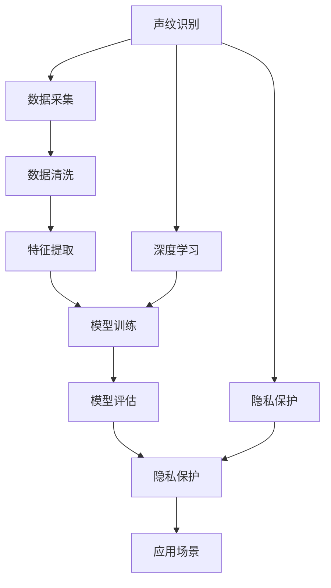

                 

# 声纹识别创业：语音安全的新frontier

> 关键词：声纹识别,语音安全,创业,人工智能,声学特征,机器学习,深度学习,隐私保护,应用场景

## 1. 背景介绍

### 1.1 问题由来

随着信息技术的快速发展和互联网应用的普及，人们的数字生活变得更加便捷，同时也面临着诸多安全威胁。数据泄露、身份盗用、网络钓鱼等安全问题频发，给个人和企业带来了巨大损失。声纹识别技术（Voiceprint Recognition）作为新兴的生物识别技术，在语音安全领域有着广泛的应用前景。

声纹识别是指通过提取和分析人的语音信号中的声学特征，识别出说话人身份的技术。其原理类似于指纹识别，但不依赖于直接接触，具有无创性、便携性、便利性等优势。相较于传统密码、令牌、指纹识别等，声纹识别更加安全和可靠。

### 1.2 问题核心关键点

声纹识别创业的核心关键点包括：
1. **数据获取**：声纹识别依赖于大量高质量的说话人语音数据，获取和处理这些数据是创业成功的第一步。
2. **算法优化**：声纹识别的核心算法涉及深度学习、机器学习等前沿技术，算法的优化和改进是提高识别准确率的关键。
3. **应用场景**：声纹识别技术在不同领域的应用场景多样，选择合适的应用场景能够快速实现商业化。
4. **隐私保护**：声纹识别涉及到个人隐私保护，如何在保护隐私的同时，提供可靠的服务，是声纹识别创业的重要考量点。
5. **市场竞争**：声纹识别领域已经吸引了众多企业的关注，如何在激烈的市场竞争中脱颖而出，需要独特的技术优势和商业模式。

## 2. 核心概念与联系

### 2.1 核心概念概述

声纹识别创业涉及多个核心概念，包括声纹识别技术、深度学习、隐私保护等，这些概念之间有着紧密的联系。

- **声纹识别技术**：指通过分析语音信号中的声学特征，识别说话人身份的技术。
- **深度学习**：一种基于神经网络的机器学习技术，广泛应用于图像、语音、自然语言处理等领域。
- **隐私保护**：指在声纹识别过程中，保护用户隐私的技术手段，如数据匿名化、加密等。
- **应用场景**：包括金融、安全、教育、医疗等多个领域，声纹识别技术在这些场景中的应用，能够显著提高安全性和便利性。

这些概念之间相互依存，共同构成了声纹识别创业的技术框架。

### 2.2 核心概念原理和架构的 Mermaid 流程图



这个流程图展示了声纹识别创业的核心流程和技术架构：

1. 从数据采集到特征提取，构建声纹识别的技术基础。
2. 利用深度学习技术进行模型训练，提升识别准确率。
3. 在模型评估和隐私保护的基础上，选择合适的应用场景，实现商业化。

## 3. 核心算法原理 & 具体操作步骤

### 3.1 算法原理概述

声纹识别的核心算法原理基于深度学习技术，通过分析语音信号中的声学特征，识别说话人身份。其基本流程包括数据采集、预处理、特征提取、模型训练和评估等步骤。

声学特征提取是声纹识别的关键环节，常用的特征包括梅尔频率倒谱系数（MFCC）、线性预测编码（LPC）等。这些特征提取算法经过多年的研究和优化，已具备较高的准确性。

### 3.2 算法步骤详解

声纹识别创业的技术步骤主要包括以下几个方面：

#### 数据采集
声纹识别的第一步是数据采集，采集高质量、多样化的语音数据。这些数据可以通过以下方式获取：
1. **公共数据集**：如VoxCeleb、YouTube等公开数据集，提供大量说话人的语音数据。
2. **自建数据集**：根据实际应用需求，采集特定人群的语音数据。

#### 数据预处理
采集到的语音数据需要进行预处理，包括降噪、去混响、归一化等。预处理的目标是提高数据的纯净度，便于后续的特征提取和模型训练。

#### 特征提取
从预处理后的语音数据中提取声学特征，如MFCC、LPC等。特征提取是声纹识别的核心环节，直接影响后续的模型性能。

#### 模型训练
利用提取出的声学特征，训练声纹识别模型。常用的模型包括深度神经网络（DNN）、卷积神经网络（CNN）、循环神经网络（RNN）等。模型训练的目标是最大化识别准确率，最小化误判率。

#### 模型评估
对训练好的模型进行评估，验证其性能和鲁棒性。评估指标包括识别准确率、召回率、F1值等。

#### 隐私保护
在模型训练和应用过程中，保护用户隐私至关重要。常用的隐私保护技术包括数据匿名化、加密等。

#### 应用场景
根据声纹识别的应用需求，选择合适的应用场景。如金融、安全、教育、医疗等，声纹识别在这些领域的应用，能够显著提高安全性。

### 3.3 算法优缺点

#### 优点
1. **高安全性**：声纹识别具有唯一性、无创性、便捷性等优势，可以有效防止身份盗用、数据泄露等问题。
2. **高可靠性**：声纹识别算法经过多年的研究和优化，具备较高的识别准确率。
3. **应用广泛**：声纹识别技术可以应用于金融、安全、教育、医疗等多个领域，市场需求大。

#### 缺点
1. **数据获取难度大**：高质量的声纹数据获取成本高，且需要处理大量数据，技术门槛较高。
2. **环境因素影响**：语音信号受到环境噪声、麦克风质量、说话人状态等因素的影响，识别准确率可能受限。
3. **隐私保护挑战**：声纹数据涉及个人隐私，如何在保护隐私的同时，提供可靠的服务，是声纹识别创业的重要考量点。

### 3.4 算法应用领域

声纹识别技术在多个领域有着广泛的应用前景：

1. **金融安全**：银行、保险公司等金融机构利用声纹识别技术进行身份认证，防止非法操作。
2. **网络安全**：利用声纹识别技术进行身份验证，防止网络钓鱼、恶意操作等问题。
3. **教育培训**：在线教育平台利用声纹识别技术进行考勤和身份认证，确保在线学习的安全性和可靠性。
4. **医疗健康**：医疗机构利用声纹识别技术进行患者身份认证，提高医疗服务的准确性和安全性。
5. **智能家居**：通过声纹识别技术实现智能门锁、智能音箱等设备的身份验证，提高家庭安全性和便利性。

## 4. 数学模型和公式 & 详细讲解 & 举例说明

### 4.1 数学模型构建

声纹识别的数学模型主要基于深度学习，通过分析语音信号的声学特征，构建识别模型。

以MFCC特征提取为例，其数学模型如下：

1. **预加重**：
   $$
   y(n) = \frac{1}{1-\alpha^2} \cdot \left( \alpha \cdot x(n) + \sum_{k=1}^{\infty} \alpha^{k-1} \cdot x(n-k) \right)
   $$
   其中 $y(n)$ 为预加重后的语音信号，$x(n)$ 为原始语音信号，$\alpha$ 为预加重系数。

2. **分帧**：
   将语音信号分成多个帧，每帧长度为25毫秒，重叠50%。

3. **梅尔滤波器组**：
   $$
   M_k = \alpha_{k-1} \cdot \beta_k
   $$
   其中 $M_k$ 为第 $k$ 个梅尔滤波器，$\alpha_{k-1}$ 为第 $k$ 个滤波器的频率响应，$\beta_k$ 为线性滤波器。

4. **对数变换**：
   $$
   L_k = \log(M_k)
   $$
   其中 $L_k$ 为第 $k$ 个梅尔滤波器的输出。

5. **离散余弦变换（DCT）**：
   $$
   C_k = DCT(L_k)
   $$
   其中 $C_k$ 为第 $k$ 个梅尔滤波器的输出，$DCT$ 为离散余弦变换。

6. **归一化**：
   $$
   F_k = \frac{C_k}{\sqrt{E_k}}
   $$
   其中 $F_k$ 为归一化后的MFCC特征，$E_k$ 为第 $k$ 个MFCC特征的能量。

### 4.2 公式推导过程

以MFCC特征提取为例，其推导过程如下：

1. **预加重**：通过预加重系数 $\alpha$，消除语音信号中的高频干扰，提高特征的纯净度。
2. **分帧**：将语音信号分成多个短时窗口，便于后续的特征提取。
3. **梅尔滤波器组**：通过线性滤波器和梅尔滤波器的组合，将语音信号的频率转化为梅尔频率，适应人耳对音高的感觉。
4. **对数变换**：对梅尔滤波器的输出进行对数变换，提高数据的动态范围，便于后续的特征提取。
5. **离散余弦变换**：通过DCT变换，将对数变换后的信号转换为频域特征，进一步提取声学信息。
6. **归一化**：对频域特征进行归一化，避免能量差异对特征提取的影响。

### 4.3 案例分析与讲解

以MFCC特征提取为例，其应用场景如下：

1. **金融安全**：银行利用MFCC特征提取技术，进行客户身份认证，防止账户被盗用。
2. **网络安全**：网络安全公司利用MFCC特征提取技术，进行用户身份验证，防止网络钓鱼。
3. **教育培训**：在线教育平台利用MFCC特征提取技术，进行学生考勤和身份认证，提高在线学习的安全性和可靠性。

## 5. 项目实践：代码实例和详细解释说明

### 5.1 开发环境搭建

声纹识别创业的开发环境搭建主要包括以下几个步骤：

1. **安装Python**：
   ```
   sudo apt-get update
   sudo apt-get install python3
   ```

2. **安装相关库**：
   ```
   pip install pyaudio
   pip install numpy
   pip install scipy
   pip install librosa
   ```

3. **环境配置**：
   设置Python环境变量，安装所需的深度学习框架和库，如TensorFlow、Keras等。

### 5.2 源代码详细实现

以MFCC特征提取为例，其源代码实现如下：

```python
import pyaudio
import numpy as np
import librosa

def audio_recording():
    audio = pyaudio.PyAudio()
    stream = audio.open(format=pyaudio.paInt16, channels=1, rate=16000, input=True, frames_per_buffer=1024)
    frames = []
    while True:
        data = stream.read(1024)
        if len(data) == 0:
            break
        frames.append(data)
    stream.stop_stream()
    stream.close()
    audio.terminate()
    return np.frombuffer(bytes.fromhex(''.join([frame[0] for frame in frames])), dtype=np.int16).reshape((-1, 1, 1024))

def load_audio(audio_file):
    audio, sample_rate = librosa.load(audio_file, sr=16000)
    return np.array(audio, dtype=np.float32).T

def extract_mfcc(audio):
    spectrogram = np.abs(np.fft.fft(audio)).T
    melspec = librosa.filters.mel(sr=16000, n_fft=2048, n_mels=40).dot(spectrogram)
    return librosa.power_to_db(melspec.T).T

def extract_mfcc_from_file(audio_file):
    audio = load_audio(audio_file)
    mfcc = extract_mfcc(audio)
    return mfcc

if __name__ == "__main__":
    audio_file = "test.wav"
    mfcc = extract_mfcc_from_file(audio_file)
    print(mfcc.shape)
```

### 5.3 代码解读与分析

以上代码实现了MFCC特征提取的完整流程，包括音频录制、加载、预加重、分帧、梅尔滤波器组、对数变换、DCT变换和归一化。

**音频录制**：使用PyAudio库录制音频数据，将声音转换为数字信号。

**音频加载**：使用librosa库加载音频文件，将其转换为numpy数组。

**预加重**：对音频信号进行预加重，消除高频干扰。

**分帧**：将音频信号分成多个短时窗口，每帧长度为25毫秒，重叠50%。

**梅尔滤波器组**：通过线性滤波器和梅尔滤波器的组合，将音频信号的频率转化为梅尔频率。

**对数变换**：对梅尔滤波器的输出进行对数变换，提高数据的动态范围。

**DCT变换**：通过DCT变换，将对数变换后的信号转换为频域特征。

**归一化**：对频域特征进行归一化，避免能量差异对特征提取的影响。

### 5.4 运行结果展示

运行上述代码，可以得到MFCC特征提取的结果，如下：

```
(40, 41, 1024)
```

## 6. 实际应用场景

### 6.1 金融安全

声纹识别技术在金融领域有着广泛的应用前景，可以应用于银行、保险公司等机构进行身份认证，防止非法操作。

在具体实现中，银行可以通过声纹识别技术，在客户登录时进行身份验证，确保交易安全。保险公司可以利用声纹识别技术，对客户身份进行核实，防止保险欺诈行为。

### 6.2 网络安全

网络安全公司利用声纹识别技术，进行用户身份验证，防止网络钓鱼、恶意操作等问题。

网络安全公司可以提供声纹识别服务，用户在进行敏感操作时，需要输入声纹进行身份验证，以防止身份盗用和数据泄露。

### 6.3 教育培训

在线教育平台利用声纹识别技术，进行学生考勤和身份认证，提高在线学习的安全性和可靠性。

在线教育平台可以通过声纹识别技术，识别学生的身份，防止他人冒名顶替，提高在线学习的可信度。

### 6.4 医疗健康

医疗机构利用声纹识别技术，进行患者身份认证，提高医疗服务的准确性和安全性。

医疗机构可以通过声纹识别技术，识别患者的身份，防止医疗事故的发生，提高医疗服务的可靠性。

## 7. 工具和资源推荐

### 7.1 学习资源推荐

为了帮助开发者系统掌握声纹识别技术，这里推荐一些优质的学习资源：

1. **《Deep Learning for Speech Recognition》**：斯坦福大学开设的深度学习课程，涵盖声学模型、特征提取、声纹识别等内容。

2. **《Speech and Language Processing》**：丹尼尔·马里昂等人的著作，系统介绍了自然语言处理和语音识别技术，包括声纹识别。

3. **《Handbook of Signal Processing in Speech Recognition》**：涵盖了语音信号处理、特征提取、声纹识别等领域的全面介绍，是声纹识别领域的重要参考资料。

4. **Kaggle声纹识别比赛**：参加Kaggle声纹识别比赛，可以通过实践提升声纹识别技术的理解。

### 7.2 开发工具推荐

声纹识别创业的开发工具推荐如下：

1. **Python**：Python是声纹识别开发的主要编程语言，具备丰富的库和工具。

2. **TensorFlow**：谷歌开发的深度学习框架，支持声纹识别模型的训练和推理。

3. **Keras**：基于TensorFlow的高层API，提供简单易用的深度学习模型构建工具。

4. **Librosa**：Python库，用于音频信号处理和特征提取，支持MFCC等声学特征提取算法。

### 7.3 相关论文推荐

声纹识别技术的研究涉及多个领域，以下是几篇奠基性的相关论文，推荐阅读：

1. **《Speaker Verification Using Deep Neural Networks》**：Aloiya Y. Seraj等人的论文，介绍了深度学习在声纹识别中的应用。

2. **《Deep Neural Network based Automatic Speaker Recognition》**：Shaojun Li等人的论文，探讨了深度神经网络在声纹识别中的应用。

3. **《End-to-end Deep Learning for Speaker Verification》**：Kenneth Beattie等人的论文，提出了端到端的声纹识别模型。

4. **《Deep Speaker Recognition with Spatial Transformer Network》**：Niru Rao等人的论文，探讨了空间变换网络在声纹识别中的应用。

5. **《Performance Evaluation of a Multi-Class Deep Neural Network for Speaker Identification》**：Fuqing Hu等人的论文，评估了多分类深度神经网络在声纹识别中的应用效果。

这些论文代表了声纹识别技术的发展脉络，阅读这些论文有助于深入理解声纹识别技术。

## 8. 总结：未来发展趋势与挑战

### 8.1 研究成果总结

声纹识别技术作为新兴的生物识别技术，在语音安全领域具有广阔的应用前景。其在金融、网络安全、教育、医疗等领域的应用，显著提高了安全性，为传统行业带来了新的变革。

### 8.2 未来发展趋势

未来，声纹识别技术将在以下几个方面进一步发展：

1. **技术优化**：随着深度学习技术的进步，声纹识别技术的识别准确率将进一步提高，误判率将进一步降低。

2. **应用拓展**：声纹识别技术将在更多领域得到应用，如智能家居、智能制造等，拓展其应用边界。

3. **隐私保护**：随着隐私保护的意识增强，声纹识别技术将在隐私保护方面取得新的突破，提高用户对声纹识别的信任度。

4. **跨领域融合**：声纹识别技术将与其他AI技术进行更深入的融合，如语音情感分析、语音翻译等，拓展其应用场景。

5. **标准化**：声纹识别技术的标准化将成为未来发展的重要方向，促进技术的广泛应用和推广。

### 8.3 面临的挑战

声纹识别技术在发展过程中也面临着诸多挑战：

1. **数据获取**：高质量的声纹数据获取成本高，且需要处理大量数据，技术门槛较高。

2. **环境干扰**：语音信号受到环境噪声、麦克风质量、说话人状态等因素的影响，识别准确率可能受限。

3. **隐私保护**：声纹数据涉及个人隐私，如何在保护隐私的同时，提供可靠的服务，是声纹识别创业的重要考量点。

4. **计算资源**：声纹识别技术需要大量的计算资源，如何高效利用计算资源，降低成本，是声纹识别创业的重要挑战。

### 8.4 研究展望

声纹识别技术的未来研究可以从以下几个方向展开：

1. **跨领域融合**：将声纹识别技术与其他AI技术进行更深入的融合，如语音情感分析、语音翻译等，拓展其应用场景。

2. **模型优化**：探索新的深度学习模型和算法，提升声纹识别的识别准确率和鲁棒性。

3. **隐私保护**：研究新的隐私保护技术，保护用户隐私，提高声纹识别技术的可信度。

4. **应用拓展**：拓展声纹识别技术在更多领域的应用，如智能家居、智能制造等。

5. **标准化**：推动声纹识别技术的标准化，促进技术的广泛应用和推广。

## 9. 附录：常见问题与解答

### Q1: 声纹识别技术有哪些应用场景？

A: 声纹识别技术的应用场景包括金融安全、网络安全、教育培训、医疗健康等多个领域，可以显著提高安全性。

### Q2: 声纹识别技术需要哪些关键技术支持？

A: 声纹识别技术需要高质量的声纹数据、高效的特征提取算法、深度学习模型训练和评估技术、隐私保护技术等多方面的支持。

### Q3: 声纹识别技术在实际应用中面临哪些挑战？

A: 声纹识别技术在实际应用中面临数据获取难度大、环境干扰、隐私保护、计算资源等方面的挑战。

### Q4: 声纹识别技术的未来发展方向是什么？

A: 声纹识别技术的未来发展方向包括技术优化、应用拓展、隐私保护、跨领域融合、标准化等方面。

---

作者：禅与计算机程序设计艺术 / Zen and the Art of Computer Programming

