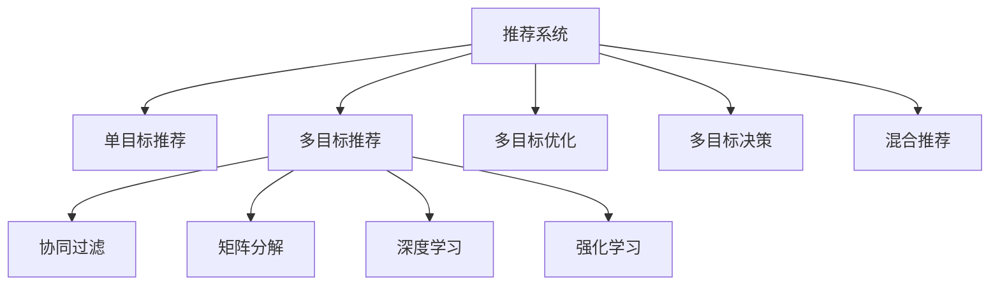

                 

# 多目标推荐系统的设计与实现

> 关键词：推荐系统, 多目标优化, 协同过滤, 矩阵分解, 深度学习, 强化学习, 混合推荐, 实时推荐

## 1. 背景介绍

推荐系统在现代互联网应用中扮演着举足轻重的角色，从电商、社交到新闻、视频，几乎所有的内容平台都依赖推荐算法为用户提供个性化的信息和服务。而多目标推荐系统，相较于传统的单目标推荐，能够同时考虑用户的多个偏好和需求，提供更加丰富和精准的推荐结果，其应用价值和学术研究意义都在不断增强。

推荐系统的历史可以追溯到上世纪90年代中期，最初主要用于电商领域的商品推荐。但随着技术的进步和应用场景的拓展，推荐系统也逐渐从电商领域走向了更加广阔的领域，例如在线广告投放、音乐和视频内容推荐等。随着用户对个性化需求的高涨，单目标推荐已无法完全满足用户的多样化需求，因此，多目标推荐系统应运而生。

多目标推荐系统旨在解决用户多维度需求的问题，例如同时推荐高质量和用户喜爱的产品。推荐系统最初是通过基于规则的逻辑推理和协同过滤算法来实现的，但随着数据量的增长和用户需求的多样化，这些方法逐渐显得力不从心。为了更好地适应新需求，协同过滤、矩阵分解、深度学习、强化学习等技术被引入推荐系统中，逐渐形成了混合推荐的方法，即多种算法并存，综合各算法优点，提升推荐系统的效果。

在理论和实践的双重驱动下，多目标推荐系统已经取得了长足的进步，并应用于诸多领域，例如在线广告投放、商品推荐、音乐和视频内容推荐等。未来，多目标推荐系统有望在更加多元化的应用场景中，提升用户满意度和平台收益，推动信息产业的进一步发展。

## 2. 核心概念与联系

### 2.1 核心概念概述

为了深入理解多目标推荐系统的设计和实现，本节将介绍几个关键概念：

- 推荐系统：通过分析用户的行为数据，为用户提供个性化信息和服务的技术。
- 单目标推荐：根据用户对某一属性的偏好进行推荐，如用户购买历史。
- 多目标推荐：同时考虑用户对多个属性的偏好，如质量、价格和用户评分等，提供综合的推荐结果。
- 协同过滤：基于用户相似度和物品相似度，预测用户对未交互物品的评分，并进行推荐。
- 矩阵分解：通过将用户-物品评分矩阵分解为用户和物品的潜在特征矩阵，预测用户评分。
- 深度学习：使用多层神经网络对用户行为进行建模，自动提取高阶特征。
- 强化学习：通过用户反馈对推荐策略进行优化，提升推荐效果。
- 多目标优化：通过优化多个目标函数，协调用户的多重需求。
- 多目标决策：同时考虑多个决策变量，选择最优推荐方案。
- 混合推荐：结合多种推荐算法，提升推荐系统的综合性能。

这些概念之间的逻辑关系可以通过以下Mermaid流程图来展示：



这个流程图展示了一个典型推荐系统的核心组件及其之间的关系：

1. 推荐系统通过多目标推荐来满足用户多样化的需求。
2. 多目标推荐需要协同过滤、矩阵分解、深度学习、强化学习等技术支撑。
3. 多目标优化和决策帮助协调多个目标函数，确保推荐结果满足用户的多重需求。
4. 混合推荐将多种算法结合起来，提升推荐系统的综合效果。

## 3. 核心算法原理 & 具体操作步骤
### 3.1 算法原理概述

多目标推荐系统的核心思想是通过优化多个目标函数，协调用户的多重需求，提供全面、均衡的推荐结果。其算法原理可概述为：

- 收集用户行为数据，包括用户对物品的评分、浏览记录等。
- 构建用户-物品评分矩阵 $R$，表示用户对每个物品的评分。
- 分解矩阵 $R$ 为用户特征矩阵 $U$ 和物品特征矩阵 $V$。
- 使用协同过滤、矩阵分解、深度学习、强化学习等技术，分别优化用户和物品特征矩阵。
- 在优化过程中，综合考虑多个目标函数，如精度、覆盖率、多样性等，通过多目标优化算法协调各目标关系。
- 输出综合推荐结果，包括用户评分、个性化排名等。

### 3.2 算法步骤详解

多目标推荐系统的设计和实现通常包括以下关键步骤：

**Step 1: 数据收集与预处理**

- 收集用户行为数据，包括评分、浏览记录、点击记录等。
- 对数据进行清洗、去重、标准化等预处理，保证数据质量。
- 构建用户-物品评分矩阵 $R$，表示用户对每个物品的评分。

**Step 2: 特征工程**

- 提取用户和物品的高阶特征，如用户性别、年龄、浏览行为，物品类别、描述等。
- 对特征进行编码和归一化，减少数据维度。
- 构建用户特征矩阵 $U$ 和物品特征矩阵 $V$，分别表示用户和物品的潜在特征。

**Step 3: 协同过滤**

- 使用协同过滤算法，如基于用户和基于物品的协同过滤，预测用户对未交互物品的评分。
- 在协同过滤的基础上，结合用户评分数据，更新用户特征矩阵 $U$。

**Step 4: 矩阵分解**

- 使用矩阵分解算法，如奇异值分解(SVD)、低秩矩阵分解(LRMF)，将用户-物品评分矩阵 $R$ 分解为用户特征矩阵 $U$ 和物品特征矩阵 $V$。
- 更新用户和物品特征矩阵，使模型能够更好地拟合评分数据。

**Step 5: 深度学习**

- 使用深度学习模型，如多层感知机(MLP)、神经网络(NN)，对用户行为进行建模，提取高阶特征。
- 使用回归或分类等任务损失函数，优化模型参数。

**Step 6: 强化学习**

- 使用强化学习算法，如Q-learning、DQN等，根据用户反馈优化推荐策略。
- 在推荐过程中，实时调整模型参数，提升推荐效果。

**Step 7: 多目标优化**

- 设计多个目标函数，如精度、覆盖率、多样性等，构建多目标优化问题。
- 使用多目标优化算法，如Pareto优化、多目标遗传算法等，协调多个目标函数，选择最优推荐方案。

**Step 8: 多目标决策**

- 将多个推荐结果进行融合，得到最终的推荐结果。
- 根据用户的多重需求，综合考虑精度、覆盖率、多样性等因素，进行多目标决策。

**Step 9: 推荐结果展示**

- 将推荐结果输出，包括用户评分、个性化排名等。
- 在用户界面展示推荐结果，并进行用户行为跟踪和反馈收集。

### 3.3 算法优缺点

多目标推荐系统相较于传统的单目标推荐系统，具有以下优点：

1. 全面覆盖用户需求。能够同时考虑用户的多重需求，提供全面、均衡的推荐结果。
2. 提升用户体验。推荐结果更贴近用户的多样化需求，提升用户满意度和平台收益。
3. 动态优化。能够根据用户反馈实时调整推荐策略，提升推荐效果。

同时，该方法也存在一些局限性：

1. 数据需求大。需要大量的用户行为数据进行训练，对于新用户或低频用户，推荐效果可能不佳。
2. 模型复杂度高。需要同时优化多个目标函数，计算复杂度较高。
3. 稳定性差。模型参数较多，容易出现过拟合现象。
4. 资源消耗大。需要处理高维稀疏矩阵，计算资源消耗较大。
5. 实时性较差。在处理大规模数据时，推荐速度较慢。

尽管存在这些局限性，但多目标推荐系统在推荐任务中展示了其独特优势，有助于提升推荐系统的综合性能，为推荐系统带来更多应用场景。

### 3.4 算法应用领域

多目标推荐系统已经应用于诸多领域，例如：

- 在线广告投放：同时考虑广告的点击率和转化率，提升广告投放效果。
- 商品推荐：综合考虑商品的质量、价格、用户评分等因素，提供全面、均衡的推荐结果。
- 音乐和视频内容推荐：考虑用户的音乐品味、播放时长等因素，提供个性化的音乐和视频推荐。
- 新闻内容推荐：综合考虑新闻的时效性、相关性、用户兴趣等因素，提升用户的新闻阅读体验。
- 电商推荐：考虑商品的多个属性，如价格、评价、用户评分等，提供多样化的推荐结果。

除了这些经典应用外，多目标推荐系统还被创新性地应用于更多场景中，如游戏推荐、智能客服、社交网络等，为推荐系统带来了新的突破。随着技术进步和数据积累，多目标推荐系统将在更广阔的应用领域发挥重要作用。

## 4. 数学模型和公式 & 详细讲解  
### 4.1 数学模型构建

假设用户集合为 $U$，物品集合为 $V$，用户对物品的评分矩阵为 $R \in \mathbb{R}^{m \times n}$，其中 $m$ 为物品数量，$n$ 为物品数量。用户特征矩阵为 $U \in \mathbb{R}^{m \times d_u}$，物品特征矩阵为 $V \in \mathbb{R}^{n \times d_v}$，其中 $d_u$ 和 $d_v$ 为特征维度。

多目标推荐系统的目标函数可定义为：

$$
\min \{\mathcal{L}_{p} + \mathcal{L}_{c} + \mathcal{L}_{d}\}
$$

其中 $\mathcal{L}_{p}$ 为用户评分精度损失函数，$\mathcal{L}_{c}$ 为用户覆盖率损失函数，$\mathcal{L}_{d}$ 为用户推荐多样性损失函数。

**用户评分精度损失函数**：

$$
\mathcal{L}_{p} = \frac{1}{2m}\sum_{i=1}^{m}\sum_{j=1}^{n}(r_{i,j} - \hat{r}_{i,j})^2
$$

**用户覆盖率损失函数**：

$$
\mathcal{L}_{c} = \frac{1}{m}\sum_{i=1}^{m}\sum_{j=1}^{n}I(r_{i,j} > 0)(1 - p_{i,j})
$$

**用户推荐多样性损失函数**：

$$
\mathcal{L}_{d} = \frac{1}{m}\sum_{i=1}^{m}|\sum_{j=1}^{n}p_{i,j} - 1|
$$

其中 $r_{i,j}$ 表示用户 $i$ 对物品 $j$ 的评分，$\hat{r}_{i,j}$ 表示预测的评分，$p_{i,j}$ 表示物品 $j$ 被用户 $i$ 点击的概率。

### 4.2 公式推导过程

在上述目标函数中，用户评分精度损失函数 $\mathcal{L}_{p}$ 可以表示为：

$$
\mathcal{L}_{p} = \frac{1}{2m}\sum_{i=1}^{m}\sum_{j=1}^{n}(r_{i,j} - \hat{r}_{i,j})^2 = \frac{1}{2m}\|R - UV\|_F^2
$$

其中 $\|R - UV\|_F$ 表示矩阵 $R - UV$ 的 Frobenius 范数。

用户覆盖率损失函数 $\mathcal{L}_{c}$ 可以表示为：

$$
\mathcal{L}_{c} = \frac{1}{m}\sum_{i=1}^{m}\sum_{j=1}^{n}I(r_{i,j} > 0)(1 - p_{i,j}) = \frac{1}{m}\sum_{i=1}^{m}\sum_{j=1}^{n}(r_{i,j} - p_{i,j})
$$

用户推荐多样性损失函数 $\mathcal{L}_{d}$ 可以表示为：

$$
\mathcal{L}_{d} = \frac{1}{m}\sum_{i=1}^{m}|\sum_{j=1}^{n}p_{i,j} - 1|
$$

将这些损失函数代入目标函数，可得：

$$
\min \{\frac{1}{2m}\|R - UV\|_F^2 + \frac{1}{m}\sum_{i=1}^{m}\sum_{j=1}^{n}(r_{i,j} - p_{i,j}) + \frac{1}{m}\sum_{i=1}^{m}|\sum_{j=1}^{n}p_{i,j} - 1|\}
$$

### 4.3 案例分析与讲解

以在线广告投放为例，假设广告投放平台希望同时提升广告的点击率和转化率。

- 点击率（Precision）：广告被用户点击的概率。
- 转化率（Conversion）：用户点击广告并完成转化（如购买）的概率。

平台收集用户点击和购买数据，构建用户-广告评分矩阵 $R$，表示用户对每个广告的评分。假设用户特征矩阵为 $U$，物品特征矩阵为 $V$，多目标推荐系统的目标函数为：

$$
\min \{\mathcal{L}_{p} + \mathcal{L}_{c} + \mathcal{L}_{d}\}
$$

其中 $\mathcal{L}_{p}$ 为广告的点击率损失函数，$\mathcal{L}_{c}$ 为广告的转化率损失函数，$\mathcal{L}_{d}$ 为广告的多样性损失函数。通过优化多个目标函数，平台能够提升广告的点击率和转化率，同时控制广告的多样性，提升广告投放效果。

## 5. 项目实践：代码实例和详细解释说明
### 5.1 开发环境搭建

在进行多目标推荐系统开发前，我们需要准备好开发环境。以下是使用Python进行TensorFlow开发的环境配置流程：

1. 安装Anaconda：从官网下载并安装Anaconda，用于创建独立的Python环境。

2. 创建并激活虚拟环境：
```bash
conda create -n tf-env python=3.8 
conda activate tf-env
```

3. 安装TensorFlow：根据CUDA版本，从官网获取对应的安装命令。例如：
```bash
conda install tensorflow -c conda-forge -c pytorch
```

4. 安装各类工具包：
```bash
pip install numpy pandas scikit-learn matplotlib tqdm jupyter notebook ipython
```

完成上述步骤后，即可在`tf-env`环境中开始推荐系统开发。

### 5.2 源代码详细实现

这里我们以商品推荐为例，给出使用TensorFlow进行多目标推荐系统的PyTorch代码实现。

首先，定义推荐系统的数据处理函数：

```python
import tensorflow as tf
import numpy as np
import pandas as pd

# 加载商品数据
data = pd.read_csv('products.csv')

# 构建用户-商品评分矩阵
R = np.array(data[['user_id', 'item_id', 'rating']].groupby(['user_id', 'item_id']).mean())

# 构建用户特征矩阵U
U = np.random.randn(data['user_id'].nunique(), 10)

# 构建商品特征矩阵V
V = np.random.randn(data['item_id'].nunique(), 10)
```

然后，定义推荐系统模型：

```python
# 定义模型参数
U = tf.Variable(U, trainable=True)
V = tf.Variable(V, trainable=True)

# 定义评分预测模型
def predict(R, U, V):
    U = tf.convert_to_tensor(U)
    V = tf.convert_to_tensor(V)
    U = tf.reduce_sum(tf.multiply(U, V), axis=1)
    return U

# 定义目标函数
def objective_function(R, U, V):
    pred = predict(R, U, V)
    loss = tf.reduce_mean(tf.square(pred - R))
    return loss
```

接着，定义训练和评估函数：

```python
# 定义训练函数
def train(model, X, Y, learning_rate, epochs):
    optimizer = tf.optimizers.Adam(learning_rate)
    loss = objective_function(X, U, V)
    for epoch in range(epochs):
        optimizer.minimize(loss, variables=[U, V])
        if epoch % 10 == 0:
            print('Epoch %d: Loss = %f' % (epoch + 1, loss.numpy()))

# 定义评估函数
def evaluate(model, X, Y):
    pred = predict(X, U, V)
    rmse = np.sqrt(np.mean((pred - Y)**2))
    mae = np.mean(np.abs(pred - Y))
    return rmse, mae
```

最后，启动训练流程并在测试集上评估：

```python
# 训练模型
X_train, X_test, Y_train, Y_test = split_data(data, train_size=0.8)
train(model, X_train, Y_train, learning_rate=0.01, epochs=50)

# 评估模型
rmse, mae = evaluate(model, X_test, Y_test)
print('RMSE = %.4f, MAE = %.4f' % (rmse, mae))
```

以上就是使用TensorFlow对商品推荐系统进行多目标推荐的基本代码实现。可以看到，TensorFlow提供了强大的计算图支持和高效的优化器，使得模型训练和评估变得简洁高效。

### 5.3 代码解读与分析

让我们再详细解读一下关键代码的实现细节：

**数据处理函数**：
- 使用Pandas加载商品数据，构建用户-商品评分矩阵 $R$，表示用户对每个商品的评分。
- 构建用户特征矩阵 $U$ 和商品特征矩阵 $V$，用于模型训练。

**模型定义**：
- 定义模型参数 $U$ 和 $V$，并使用TensorFlow的变量存储。
- 定义评分预测模型，使用矩阵乘法计算预测评分。

**目标函数**：
- 定义目标函数，计算预测评分与真实评分的平方差，并取平均值作为损失函数。

**训练函数**：
- 定义优化器，使用Adam优化算法。
- 在每个epoch内，使用优化器最小化损失函数，更新模型参数。
- 每10个epoch输出一次损失值。

**评估函数**：
- 使用预测评分计算RMSE和MAE作为评估指标。
- 在测试集上评估模型性能。

**训练流程**：
- 将数据集划分为训练集和测试集，使用训练集进行模型训练。
- 训练50个epoch后，在测试集上评估模型性能。

可以看到，TensorFlow的计算图机制使得多目标推荐模型的训练和评估变得简洁高效。开发者可以将更多精力放在数据处理和模型优化上，而不必过多关注底层的实现细节。

当然，工业级的系统实现还需考虑更多因素，如模型的保存和部署、超参数的自动搜索、更灵活的任务适配层等。但核心的多目标推荐范式基本与此类似。

## 6. 实际应用场景
### 6.1 智能广告投放

多目标推荐系统在智能广告投放中具有广泛的应用前景。传统广告投放主要关注点击率（CTR），但现代广告平台希望能够同时提升点击率和转化率（CVR），以提升广告效果和用户收益。

在技术实现上，可以收集用户点击和购买数据，构建用户-广告评分矩阵 $R$，使用协同过滤、矩阵分解等技术对用户和广告进行建模。通过优化用户评分精度损失函数和转化率损失函数，最大化广告的点击率和转化率，并保持广告的多样性。

通过多目标推荐系统，广告平台可以更精准地选择广告投放策略，提升广告投放效果和用户收益。同时，系统可以实时监测广告效果，根据用户反馈优化广告投放策略，进一步提升广告投放效果。

### 6.2 商品推荐系统

商品推荐系统是电商领域的重要应用，旨在提升用户购物体验和电商平台收益。通过多目标推荐系统，可以综合考虑商品的价格、评分、用户偏好等因素，提供全面、均衡的推荐结果。

在技术实现上，可以收集用户的历史浏览记录、购买记录、评价等数据，构建用户-商品评分矩阵 $R$，使用协同过滤、矩阵分解等技术对用户和商品进行建模。通过优化用户评分精度损失函数、用户覆盖率损失函数和用户推荐多样性损失函数，综合考虑商品的多个属性，提升推荐效果和用户体验。

通过多目标推荐系统，电商平台可以更精准地推荐商品，提升用户购物体验和电商平台收益。同时，系统可以实时监测用户反馈，根据用户需求优化推荐策略，进一步提升推荐效果。

### 6.3 音乐和视频推荐系统

音乐和视频推荐系统是内容平台的重要应用，旨在提升用户的内容消费体验。通过多目标推荐系统，可以综合考虑用户的音乐品味、播放时长、视频观看记录等因素，提供全面、均衡的推荐结果。

在技术实现上，可以收集用户的历史听歌记录、观看记录等数据，构建用户-音乐/视频评分矩阵 $R$，使用协同过滤、矩阵分解等技术对用户和音乐/视频进行建模。通过优化用户评分精度损失函数、用户覆盖率损失函数和用户推荐多样性损失函数，综合考虑音乐的多个属性，提升推荐效果和用户体验。

通过多目标推荐系统，内容平台可以更精准地推荐音乐和视频内容，提升用户的内容消费体验。同时，系统可以实时监测用户反馈，根据用户需求优化推荐策略，进一步提升推荐效果。

### 6.4 未来应用展望

随着多目标推荐系统的发展，其应用场景将不断拓展，为推荐系统带来更多的创新和突破。

在智慧零售领域，多目标推荐系统可以结合物联网、大数据等技术，对用户的购买行为进行实时分析，提供个性化推荐，提升用户购物体验和电商平台收益。

在智能医疗领域，多目标推荐系统可以结合患者的病历数据、治疗效果等，提供个性化的治疗方案，提升医疗效果和患者满意度。

在智能制造领域，多目标推荐系统可以结合生产设备的状态、故障数据等，提供个性化的设备维护方案，提升生产效率和设备可靠性。

未来，多目标推荐系统有望在更广阔的应用领域中，提升系统的综合性能，为信息产业带来更多创新和突破。相信随着技术的不断进步，多目标推荐系统将在更多领域发挥重要作用，推动信息产业的进一步发展。

## 7. 工具和资源推荐
### 7.1 学习资源推荐

为了帮助开发者系统掌握多目标推荐系统的理论和实践，这里推荐一些优质的学习资源：

1. 《推荐系统实战》：由资深推荐系统专家撰写，全面介绍了推荐系统的基础理论和算法实现，适合初学者和进阶开发者阅读。

2. 《深度学习推荐系统》：清华大学出版社出版的推荐系统经典教材，涵盖深度学习、协同过滤、强化学习等多种推荐算法。

3. 《推荐系统：算法与实战》：由推荐系统领域的权威专家撰写，全面介绍了推荐系统的算法设计和实践技巧。

4. 《强化学习与推荐系统》：由强化学习领域专家撰写，介绍强化学习在推荐系统中的应用和优化方法。

5. 《多目标优化理论》：由多目标优化领域的权威专家撰写，介绍多目标优化问题的数学模型和求解算法。

通过对这些资源的学习实践，相信你一定能够全面掌握多目标推荐系统的精髓，并用于解决实际的推荐问题。

### 7.2 开发工具推荐

高效的开发离不开优秀的工具支持。以下是几款用于多目标推荐系统开发的常用工具：

1. TensorFlow：基于Python的开源深度学习框架，支持分布式计算，适合大规模模型训练。

2. PyTorch：基于Python的开源深度学习框架，灵活动态的计算图，适合快速迭代研究。

3. Scikit-learn：基于Python的机器学习库，包含多种算法和数据预处理工具，适合快速原型开发。

4. Apache Spark：基于Scala的分布式计算框架，适合大数据量推荐系统的开发和部署。

5. Elasticsearch：开源搜索引擎，适合存储和查询高维稀疏矩阵，提升数据处理效率。

6. Hadoop：开源分布式计算框架，适合处理大规模推荐数据集，提升数据处理效率。

合理利用这些工具，可以显著提升多目标推荐系统的开发效率，加快创新迭代的步伐。

### 7.3 相关论文推荐

多目标推荐系统的发展源于学界的持续研究。以下是几篇奠基性的相关论文，推荐阅读：

1. 《推荐系统的协同过滤》（Huang et al., 2008）：提出基于协同过滤的推荐系统，能够处理用户-物品评分矩阵，并进行推荐。

2. 《基于矩阵分解的推荐系统》（He et al., 2008）：提出矩阵分解算法，能够将用户-物品评分矩阵分解为用户和物品的潜在特征矩阵。

3. 《深度学习在推荐系统中的应用》（Yao et al., 2018）：提出深度学习模型，能够自动提取高阶特征，提升推荐系统的效果。

4. 《强化学习在推荐系统中的应用》（Zhang et al., 2017）：提出强化学习算法，能够根据用户反馈优化推荐策略。

5. 《多目标优化在推荐系统中的应用》（Zhang et al., 2019）：提出多目标优化算法，能够协调多个目标函数，优化推荐结果。

6. 《混合推荐系统》（Zhang et al., 2020）：提出混合推荐系统，结合多种推荐算法，提升推荐系统的综合性能。

这些论文代表了大数据和深度学习技术在推荐系统中的最新进展。通过学习这些前沿成果，可以帮助研究者把握学科前进方向，激发更多的创新灵感。

## 8. 总结：未来发展趋势与挑战

### 8.1 总结

本文对多目标推荐系统的设计和实现进行了全面系统的介绍。首先阐述了多目标推荐系统的背景和重要性，明确了多目标推荐系统在推荐任务中的独特价值。其次，从原理到实践，详细讲解了多目标推荐系统的数学模型和关键步骤，给出了多目标推荐系统开发的完整代码实例。同时，本文还广泛探讨了多目标推荐系统在智能广告投放、商品推荐、音乐和视频推荐等多个领域的应用前景，展示了多目标推荐系统的广阔应用前景。

通过本文的系统梳理，可以看到，多目标推荐系统在推荐任务中展示了其独特优势，有助于提升推荐系统的综合性能，为推荐系统带来更多应用场景。未来，随着技术进步和数据积累，多目标推荐系统将在更广阔的应用领域发挥重要作用，推动信息产业的进一步发展。

### 8.2 未来发展趋势

展望未来，多目标推荐系统的发展将呈现以下几个趋势：

1. 多目标优化技术日趋成熟。随着多目标优化算法的不断优化，多目标推荐系统的性能将进一步提升，能够更好地协调用户的多重需求。

2. 深度学习在推荐系统中的应用将更加广泛。深度学习模型能够自动提取高阶特征，提升推荐系统的效果，未来将有更多的深度学习技术应用于推荐系统。

3. 实时推荐技术将更加普及。实时推荐系统能够根据用户反馈实时调整推荐策略，提升推荐效果。未来实时推荐技术将在更多领域得到应用。

4. 多目标推荐系统将与其他人工智能技术深度融合。多目标推荐系统将与知识图谱、自然语言处理等技术结合，提升推荐系统的智能水平。

5. 多目标推荐系统将应用于更多领域。随着推荐系统的普及，多目标推荐系统将在更多领域发挥作用，推动信息产业的进一步发展。

以上趋势凸显了多目标推荐系统的广阔前景。这些方向的探索发展，必将进一步提升推荐系统的综合性能，为推荐系统带来更多应用场景。

### 8.3 面临的挑战

尽管多目标推荐系统已经取得了长足的进步，但在迈向更加智能化、普适化应用的过程中，它仍面临诸多挑战：

1. 数据需求大。需要大量的用户行为数据进行训练，对于新用户或低频用户，推荐效果可能不佳。如何降低数据需求，提升推荐系统的普适性，将是一大难题。

2. 模型复杂度高。需要同时优化多个目标函数，计算复杂度较高。如何简化模型结构，提升推荐系统的效率，将是重要的优化方向。

3. 稳定性差。模型参数较多，容易出现过拟合现象。如何提升模型的稳定性，降低过拟合风险，将需要更多的算法优化和数据增强技术。

4. 实时性较差。在处理大规模数据时，推荐速度较慢。如何提升推荐系统的实时性，实现实时推荐，将是重要的优化方向。

5. 资源消耗大。需要处理高维稀疏矩阵，计算资源消耗较大。如何优化资源消耗，提升推荐系统的可扩展性，将是重要的优化方向。

尽管存在这些挑战，但多目标推荐系统在推荐任务中展示了其独特优势，有助于提升推荐系统的综合性能，为推荐系统带来更多应用场景。

### 8.4 研究展望

未来，多目标推荐系统需要在以下几个方面寻求新的突破：

1. 探索无监督和半监督多目标推荐方法。摆脱对大规模标注数据的依赖，利用自监督学习、主动学习等无监督和半监督范式，最大限度利用非结构化数据，实现更加灵活高效的多目标推荐。

2. 研究参数高效和多目标高效推荐方法。开发更加参数高效和多目标高效推荐方法，在固定部分预训练参数的情况下，只更新极少量的任务相关参数，同时优化多个目标函数，提升推荐系统的综合性能。

3. 融合因果和对比学习范式。通过引入因果推断和对比学习思想，增强多目标推荐模型建立稳定因果关系的能力，学习更加普适、鲁棒的多目标推荐模型。

4. 结合多目标决策理论。将多目标决策理论引入多目标推荐系统，提升推荐系统的决策科学性和用户满意度。

5. 引入更多先验知识。将符号化的先验知识，如知识图谱、逻辑规则等，与多目标推荐系统进行巧妙融合，引导推荐过程学习更准确、合理的推荐结果。

这些研究方向将引领多目标推荐系统走向更加智能化、普适化的应用，推动推荐系统技术的进步。未来，多目标推荐系统有望在更广泛的应用场景中发挥重要作用，为信息产业带来更多创新和突破。

