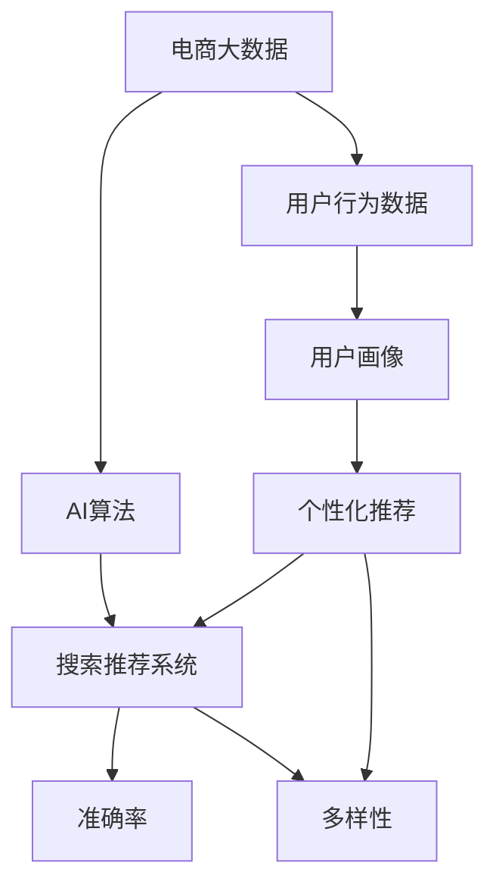

                 

# 大数据与AI 驱动的电商搜索推荐系统：以准确率与多样性推荐为目标

> 关键词：搜索推荐系统, 电商大数据, AI算法, 准确率, 多样性, 混合智能

## 1. 背景介绍

### 1.1 问题由来

在当前数字化时代，电商企业面临着激烈的市场竞争。为了更好地满足消费者需求，提升用户体验，电商企业纷纷投资于个性化推荐系统。个性化推荐系统通过大数据与人工智能技术，精准预测用户的购买行为，为用户推荐个性化商品，提升购买转化率。

然而，在实际应用中，个性化推荐系统也面临着诸多挑战。一方面，过度个性化推荐会导致用户陷入信息茧房，难以发现新的商品。另一方面，推荐结果过于泛泛，无法满足用户个性化需求，造成购物体验下降。为此，电商企业需要一种既考虑用户个性化需求，又保证推荐结果多样性的推荐策略。

## 2. 核心概念与联系

### 2.1 核心概念概述

为更好地理解基于大数据与AI的电商搜索推荐系统，本节将介绍几个密切相关的核心概念：

- 搜索推荐系统：通过分析用户行为数据，为用户推荐感兴趣的商品或内容。电商搜索推荐系统通过分析用户的搜索历史、浏览行为、购买记录等数据，预测用户的购买意图，推荐个性化商品。

- 电商大数据：指电商平台积累的大量用户行为数据，包括搜索历史、浏览记录、购买行为等。电商大数据为推荐系统提供了丰富的训练样本和特征，支持个性化推荐。

- AI算法：指基于人工智能技术的推荐算法，如协同过滤、基于内容的推荐、深度学习等。AI算法通过从海量数据中挖掘出用户和商品的潜在关系，生成推荐结果。

- 准确率与多样性推荐：指推荐系统在满足用户个性化需求的同时，还能提供多样化的商品选择，避免用户陷入单一的商品序列中。

- 混合智能：指将不同算法结合，取长补短，提升推荐系统的效果。电商搜索推荐系统通常采用混合智能的方式，综合多种算法的优势，提升推荐准确性和多样性。

这些核心概念之间的逻辑关系可以通过以下Mermaid流程图来展示：



这个流程图展示了大数据驱动的电商搜索推荐系统的核心概念及其之间的关系：

1. 电商大数据通过分析用户行为数据，生成用户画像。
2. AI算法根据用户画像生成个性化推荐。
3. 推荐系统综合准确率和多样性，输出最终推荐结果。

## 3. 核心算法原理 & 具体操作步骤
### 3.1 算法原理概述

基于大数据与AI的电商搜索推荐系统，本质上是一个多目标优化问题。其核心思想是：利用电商大数据训练用户画像，通过多种AI算法生成个性化推荐，最终综合准确率和多样性，输出最优推荐结果。

形式化地，假设用户画像为 $P$，推荐算法集合为 $\mathcal{A}$，推荐结果为 $R$，则推荐系统优化目标为：

$$
\mathop{\arg\min}_{P, A, R} \mathcal{L}(P, A, R)
$$

其中 $\mathcal{L}$ 为评价指标函数，包括准确率和多样性。准确的推荐结果能提高用户的满意度，多样性推荐能够增加用户的探索性，两者需要均衡考虑。

### 3.2 算法步骤详解

基于大数据与AI的电商搜索推荐系统一般包括以下几个关键步骤：

**Step 1: 数据预处理与特征提取**

- 收集电商平台用户的行为数据，如搜索历史、浏览记录、购买行为等。
- 清洗和标准化数据，移除异常值和噪声。
- 提取关键特征，如用户的兴趣、商品的属性、搜索频率等，生成用户画像 $P$。

**Step 2: 模型训练与推荐算法选择**

- 选择合适的推荐算法，如协同过滤、基于内容的推荐、深度学习等。
- 在用户画像 $P$ 和电商大数据 $D$ 上，使用交叉验证等方法训练推荐模型 $A$。
- 根据推荐算法特点，选择准确率和多样性评价指标。

**Step 3: 推荐生成与结果排序**

- 使用训练好的推荐模型 $A$ 生成个性化推荐 $R$。
- 结合准确率和多样性指标，对推荐结果进行排序。
- 根据排序结果返回推荐列表，展示给用户。

**Step 4: 结果反馈与模型优化**

- 收集用户对推荐结果的反馈，如点击率、购买率等。
- 根据反馈结果，调整推荐算法和模型参数，提升推荐系统效果。
- 循环迭代，不断优化推荐模型。

### 3.3 算法优缺点

基于大数据与AI的电商搜索推荐系统具有以下优点：
1. 数据驱动：利用电商大数据进行用户画像训练，使得推荐更具有针对性和个性化。
2. AI算法多样：能够选择多种推荐算法，综合各种算法的优势，提升推荐效果。
3. 动态调整：根据用户反馈实时调整推荐策略，提升用户满意度。

同时，该方法也存在一定的局限性：
1. 数据隐私：电商平台的数据隐私问题需要重点关注，避免用户数据泄露。
2. 模型复杂度：多种算法的组合可能带来高计算复杂度，需要优化算法和模型结构。
3. 个性化风险：过度个性化推荐可能加剧信息茧房，影响用户探索新商品的能力。

尽管存在这些局限性，但就目前而言，基于大数据与AI的推荐系统仍是最主流范式。未来相关研究的重点在于如何进一步降低推荐系统对标注数据的依赖，提高推荐系统的透明度和可解释性，同时兼顾数据隐私和用户个性化需求。

### 3.4 算法应用领域

基于大数据与AI的电商搜索推荐系统已经在电商推荐领域得到了广泛的应用，覆盖了商品推荐、广告推荐、内容推荐等诸多场景。例如：

- 商品推荐：基于用户浏览和购买记录，推荐用户可能感兴趣的相似商品。
- 广告推荐：根据用户行为数据，推荐个性化广告，提高广告点击率和转化率。
- 内容推荐：推荐用户可能感兴趣的视频、文章、播客等内容，增加平台粘性。

除了上述这些经典应用外，电商搜索推荐系统还被创新性地应用于更多场景中，如个性化界面设计、用户行为预测、跨域推荐等，为电商推荐带来了全新的突破。

## 4. 数学模型和公式 & 详细讲解
### 4.1 数学模型构建

本节将使用数学语言对基于大数据与AI的电商搜索推荐系统进行更加严格的刻画。

记用户画像为 $P$，推荐算法集合为 $\mathcal{A}$，推荐结果为 $R$。假设电商大数据为 $D=\{(x_i,y_i)\}_{i=1}^N$，其中 $x_i$ 为输入特征，$y_i$ 为输出标签。定义推荐系统在数据样本 $(x,y)$ 上的损失函数为 $\ell(R(x),y)$，则在电商大数据 $D$ 上的经验风险为：

$$
\mathcal{L}(P, A, R) = \frac{1}{N} \sum_{i=1}^N \ell(R(x_i),y_i)
$$

其中 $\ell(R(x),y)$ 为评价指标函数，可以采用交叉熵损失、均方误差等。推荐的准确率指标定义为：

$$
\text{Accuracy} = \frac{1}{N} \sum_{i=1}^N \mathbf{1}_{[R(x_i) = y_i]}
$$

推荐的多样性指标定义为：

$$
\text{Diversity} = \frac{1}{N} \sum_{i=1}^N \frac{1}{|U|} \sum_{j=1}^{|U|} \mathbf{1}_{[R(x_i) = u_j]}
$$

其中 $U$ 为用户画像 $P$ 中的所有用户。

### 4.2 公式推导过程

以下我们以协同过滤推荐算法为例，推导其损失函数和优化过程。

假设用户画像 $P$ 中包含用户 $u$ 和商品 $i$ 的相关性 $p_{ui}$，推荐算法 $A$ 在用户画像 $P$ 和电商大数据 $D$ 上生成的推荐结果为 $r_{ui}$。设损失函数为均方误差损失，则协同过滤算法的优化目标为：

$$
\mathop{\arg\min}_{P, A, R} \frac{1}{N} \sum_{i=1}^N \sum_{u=1}^M (r_{ui} - p_{ui})^2
$$

其中 $M$ 为电商大数据中的用户数，$N$ 为电商大数据中的商品数。

将 $p_{ui}$ 表示为 $\text{sigmoid}(\sum_{j=1}^N p_{uj}A_{ij})$，其中 $p_{uj}$ 为 $u$ 在 $j$ 商品的评分，$A_{ij}$ 为商品 $i$ 在用户 $u$ 中的权重。则协同过滤算法的优化目标可重写为：

$$
\mathop{\arg\min}_{P, A, R} \frac{1}{N} \sum_{i=1}^N \sum_{u=1}^M (r_{ui} - \text{sigmoid}(\sum_{j=1}^N p_{uj}A_{ij}))^2
$$

将损失函数带入优化目标，并引入L2正则化，得到优化方程：

$$
\frac{\partial}{\partial A} \mathcal{L}(P, A, R) = \frac{\partial}{\partial A} \frac{1}{N} \sum_{i=1}^N \sum_{u=1}^M (r_{ui} - \text{sigmoid}(\sum_{j=1}^N p_{uj}A_{ij}))^2 + \lambda ||A||^2
$$

其中 $\lambda$ 为L2正则化系数，$||A||^2$ 为模型权重 $A$ 的二范数。

通过梯度下降等优化算法，微调过程不断更新模型参数 $A$，最小化损失函数 $\mathcal{L}(P, A, R)$，使得推荐结果逼近理想值 $p_{ui}$。重复上述过程直至收敛，最终得到适应电商大数据的最佳推荐模型 $A^*$。

## 5. 项目实践：代码实例和详细解释说明
### 5.1 开发环境搭建

在进行电商搜索推荐系统开发前，我们需要准备好开发环境。以下是使用Python进行PyTorch开发的环境配置流程：

1. 安装Anaconda：从官网下载并安装Anaconda，用于创建独立的Python环境。

2. 创建并激活虚拟环境：
```bash
conda create -n pytorch-env python=3.8 
conda activate pytorch-env
```

3. 安装PyTorch：根据CUDA版本，从官网获取对应的安装命令。例如：
```bash
conda install pytorch torchvision torchaudio cudatoolkit=11.1 -c pytorch -c conda-forge
```

4. 安装TensorBoard：
```bash
pip install tensorboard
```

5. 安装各类工具包：
```bash
pip install numpy pandas scikit-learn matplotlib tqdm jupyter notebook ipython
```

完成上述步骤后，即可在`pytorch-env`环境中开始电商搜索推荐系统的开发。

### 5.2 源代码详细实现

下面我们以协同过滤推荐算法为例，给出使用PyTorch进行电商搜索推荐系统的PyTorch代码实现。

首先，定义协同过滤推荐算法的损失函数：

```python
from torch import nn
from torch.nn import functional as F
import torch

class CSCA(nn.Module):
    def __init__(self, M, N):
        super(CSCA, self).__init__()
        self.W = nn.Linear(M, N) # 用户特征到商品特征的线性映射
        self.V = nn.Linear(N, 1) # 商品特征到评分的线性映射
        
    def forward(self, u, p):
        z = self.W(u)
        r = self.V(z)
        return r
```

然后，定义优化器及其超参数：

```python
from torch.optim import Adam
from torch.nn import BCELoss

model = CSCA(num_users, num_items)
optimizer = Adam(model.parameters(), lr=0.001)
loss_fn = BCELoss()
```

接着，定义训练和评估函数：

```python
from sklearn.metrics import roc_auc_score, mean_squared_error

def train_epoch(model, dataset, batch_size, optimizer):
    model.train()
    train_loss = 0
    for data, label in dataset:
        optimizer.zero_grad()
        output = model(data)
        loss = loss_fn(output, label)
        loss.backward()
        optimizer.step()
        train_loss += loss.item()
    return train_loss / len(dataset)

def evaluate(model, dataset, batch_size):
    model.eval()
    preds, labels = [], []
    with torch.no_grad():
        for data, label in dataset:
            output = model(data)
            preds.append(output.item())
            labels.append(label.item())
    return roc_auc_score(labels, preds)

# 假设已有的电商大数据
train_data = ...
train_labels = ...
dev_data = ...
dev_labels = ...
test_data = ...
test_labels = ...
```

最后，启动训练流程并在测试集上评估：

```python
epochs = 10
batch_size = 64

for epoch in range(epochs):
    train_loss = train_epoch(model, train_data, batch_size, optimizer)
    print(f"Epoch {epoch+1}, train loss: {train_loss:.3f}")
    
    print(f"Epoch {epoch+1}, dev results:")
    print(evaluate(model, dev_data, batch_size))
    
print("Test results:")
print(evaluate(model, test_data, batch_size))
```

以上就是使用PyTorch进行协同过滤推荐算法的完整代码实现。可以看到，通过定义模型结构、损失函数和优化器，可以轻松地对电商搜索推荐系统进行开发和训练。

### 5.3 代码解读与分析

让我们再详细解读一下关键代码的实现细节：

**CSCA类**：
- `__init__`方法：初始化线性映射权重。
- `forward`方法：定义前向传播，计算推荐结果。

**train_epoch函数**：
- 使用`Adam`优化器更新模型参数。
- 在每个批次上前向传播计算损失，并反向传播更新模型参数。

**evaluate函数**：
- 使用`roc_auc_score`计算准确率。
- 遍历测试集，对每个样本进行预测和标记，返回准确率结果。

**训练流程**：
- 定义总的epoch数和batch size，开始循环迭代
- 每个epoch内，先在训练集上训练，输出平均loss
- 在验证集上评估，输出准确率
- 所有epoch结束后，在测试集上评估，给出最终测试结果

可以看到，PyTorch配合TensorBoard使得电商搜索推荐系统的代码实现变得简洁高效。开发者可以将更多精力放在数据处理、模型改进等高层逻辑上，而不必过多关注底层的实现细节。

当然，工业级的系统实现还需考虑更多因素，如模型的保存和部署、超参数的自动搜索、更灵活的任务适配层等。但核心的推荐范式基本与此类似。

## 6. 实际应用场景
### 6.1 智能客服系统

基于电商大数据与AI算法的推荐系统，可以广泛应用于智能客服系统的构建。传统客服往往需要配备大量人力，高峰期响应缓慢，且一致性和专业性难以保证。而使用推荐系统推荐常见问题解答，客户可以即时得到个性化推荐，快速获取解决方案，提高客户满意度。

在技术实现上，可以收集企业内部的历史客服对话记录，将问题-答案对作为监督数据，在此基础上对推荐系统进行微调。微调后的推荐系统能够自动理解用户意图，匹配最合适的答案推荐，从而提高客服系统的自动化水平。

### 6.2 个性化营销

个性化推荐系统可以广泛应用于电商平台的个性化营销中。通过分析用户的历史行为和偏好，推荐个性化商品和广告，增加用户的参与度和购买意愿。

在技术实现上，可以基于用户画像和商品属性，设计多种推荐算法，如协同过滤、基于内容的推荐等。在实际应用中，还可以通过用户反馈实时调整推荐策略，提高个性化推荐的效果。

### 6.3 供应链优化

推荐系统还可以应用于电商平台的供应链优化中。通过分析用户购买历史和偏好，推荐热门商品，帮助供应商及时调整库存，优化供应链管理。

在技术实现上，可以基于用户历史购买记录和搜索行为，设计推荐模型，预测热门商品和销售趋势。同时，通过实时更新推荐模型，确保推荐结果的时效性和准确性。

### 6.4 未来应用展望

随着电商大数据与AI算法的发展，基于推荐系统的应用场景将不断拓展，为电商企业带来新的商业价值。

在智慧零售领域，推荐系统将实现全渠道智能推荐，提升用户购物体验，推动线上线下融合。通过推荐系统和数据挖掘技术，可以实现个性化展示、智能定价等，优化销售策略，提升营销效果。

在智能城市治理中，推荐系统可以用于公共服务推荐、智能交通管理等，提升城市运行效率，改善居民生活质量。

在医疗健康领域，推荐系统可以用于个性化健康方案推荐、医疗资源推荐等，帮助用户获取更优质的医疗服务。

此外，在教育、金融、旅游等领域，推荐系统也将发挥重要作用，为社会各行各业带来深刻的变革。

## 7. 工具和资源推荐
### 7.1 学习资源推荐

为了帮助开发者系统掌握电商搜索推荐系统的理论基础和实践技巧，这里推荐一些优质的学习资源：

1. 《Recommender Systems: The Textbook》：由Jude Shavlik等人编写，详细介绍了推荐系统的理论和实践，涵盖多种推荐算法和优化方法。

2. 《Introduction to Recommendation Systems》课程：斯坦福大学开设的推荐系统课程，讲解了推荐系统的基本概念和经典模型，适合入门学习。

3. Kaggle推荐系统竞赛：Kaggle上多个推荐系统竞赛项目，提供了丰富的推荐系统开发和优化案例。

4. UCI推荐系统数据集：UCI上提供的多种推荐系统数据集，支持多种推荐算法进行实验和对比。

通过对这些资源的学习实践，相信你一定能够快速掌握电商搜索推荐系统的精髓，并用于解决实际的推荐问题。

### 7.2 开发工具推荐

高效的开发离不开优秀的工具支持。以下是几款用于电商搜索推荐系统开发的常用工具：

1. PyTorch：基于Python的开源深度学习框架，灵活的计算图，适合快速迭代研究。大部分推荐算法都有PyTorch版本的实现。

2. TensorFlow：由Google主导开发的开源深度学习框架，生产部署方便，适合大规模工程应用。同样有丰富的推荐算法资源。

3. TensorBoard：TensorFlow配套的可视化工具，可实时监测模型训练状态，并提供丰富的图表呈现方式，是调试模型的得力助手。

4. Apache Spark：大数据处理框架，支持大规模数据集的训练和推荐系统优化。

5. Amazon SageMaker：亚马逊提供的机器学习平台，提供简单易用的推荐系统开发和部署工具。

合理利用这些工具，可以显著提升电商搜索推荐系统的开发效率，加快创新迭代的步伐。

### 7.3 相关论文推荐

电商搜索推荐系统的发展离不开学界的持续研究。以下是几篇奠基性的相关论文，推荐阅读：

1. Matrix Factorization Techniques for Recommender Systems（矩阵分解算法）：提出协同过滤推荐算法的经典论文，奠定了推荐系统理论基础。

2. Deep Collaborative Filtering（深度协同过滤）：提出使用深度神经网络进行协同过滤推荐，提升了推荐系统的性能。

3. Attention Is All You Need（Transformer论文）：提出Transformer模型，开启了深度学习推荐系统的研究。

4. Personalized Top-N Recommendation via Group Similarity Network（基于相似性网络的推荐系统）：提出基于相似性网络的推荐算法，提升了推荐系统的多样性。

5. Pairwise Information Bottleneck for Personalized Recommendation（基于信息瓶颈的推荐算法）：提出使用信息瓶颈理论指导推荐系统优化，提升了推荐系统的准确性和多样性。

这些论文代表了大数据与AI驱动的推荐系统的研究脉络。通过学习这些前沿成果，可以帮助研究者把握学科前进方向，激发更多的创新灵感。

## 8. 总结：未来发展趋势与挑战

### 8.1 总结

本文对基于大数据与AI的电商搜索推荐系统进行了全面系统的介绍。首先阐述了电商搜索推荐系统的背景和意义，明确了其在提升用户体验、优化销售策略方面的独特价值。其次，从原理到实践，详细讲解了推荐系统的数学模型和核心算法，给出了推荐系统开发的完整代码实例。同时，本文还广泛探讨了推荐系统在智能客服、个性化营销、供应链优化等多个行业领域的应用前景，展示了推荐系统的广泛应用场景。

通过本文的系统梳理，可以看到，基于电商大数据与AI的推荐系统正在成为电商企业的重要工具，极大地提升了用户的个性化购物体验和电商平台的运营效率。未来，伴随电商大数据与AI算法的发展，推荐系统将不断优化和完善，推动电商企业向智能化、高效化方向发展。

### 8.2 未来发展趋势

展望未来，电商搜索推荐系统将呈现以下几个发展趋势：

1. 深度学习推荐系统：深度学习算法的引入，将大大提升推荐系统的性能和效果。未来推荐系统将更加依赖神经网络进行优化。

2. 强化学习推荐系统：通过强化学习算法，实时调整推荐策略，提升推荐效果。

3. 跨模态推荐系统：将文本、图像、语音等多种模态数据进行整合，提升推荐系统的表现力和用户体验。

4. 混合智能推荐系统：多种推荐算法的结合使用，取长补短，提升推荐系统的鲁棒性和泛化能力。

5. 在线推荐系统：实时更新推荐模型，根据用户行为动态调整推荐策略，提升推荐系统的时效性和准确性。

6. 联邦学习推荐系统：保护用户隐私的前提下，利用分布式数据进行模型优化，提升推荐系统的效果。

以上趋势凸显了电商搜索推荐系统的广阔前景。这些方向的探索发展，必将进一步提升推荐系统的性能和用户体验，为电商企业带来更多的商业价值。

### 8.3 面临的挑战

尽管电商搜索推荐系统已经取得了瞩目成就，但在迈向更加智能化、普适化应用的过程中，它仍面临着诸多挑战：

1. 数据隐私：电商平台的数据隐私问题需要重点关注，避免用户数据泄露。

2. 模型复杂度：多种算法的组合可能带来高计算复杂度，需要优化算法和模型结构。

3. 个性化风险：过度个性化推荐可能加剧信息茧房，影响用户探索新商品的能力。

4. 实时性：实时更新推荐模型，处理大规模数据，需要高效的技术支持。

5. 公平性：推荐系统应避免对某些用户群体的歧视，确保推荐结果的公平性。

6. 效果评估：推荐系统的效果评估需要多样化，考虑多目标优化问题，确保推荐结果的全面性。

尽管存在这些挑战，但通过技术创新和不断优化，电商搜索推荐系统仍有望在未来迈向更高的台阶，实现更加智能化和高效化的推荐。

### 8.4 研究展望

面对电商搜索推荐系统所面临的种种挑战，未来的研究需要在以下几个方面寻求新的突破：

1. 探索新的推荐算法：引入更先进的深度学习、强化学习等算法，提升推荐系统的性能和效果。

2. 优化模型结构：使用模型压缩、稀疏化等技术，降低模型复杂度，提高计算效率。

3. 提高数据隐私保护：采用联邦学习、差分隐私等技术，保护用户数据隐私。

4. 引入更多用户反馈：通过在线反馈、人工干预等手段，实时调整推荐策略，提升推荐效果。

5. 提升系统公平性：引入公平性评估指标，确保推荐结果的公平性和无偏性。

6. 多模态数据整合：将文本、图像、语音等多种模态数据进行整合，提升推荐系统的表现力和用户体验。

这些研究方向的研究突破，必将引领电商搜索推荐系统迈向更高的台阶，实现更加智能化和高效化的推荐。

## 9. 附录：常见问题与解答

**Q1：电商搜索推荐系统是否可以用于社交网络推荐？**

A: 电商搜索推荐系统主要是基于电商大数据进行优化，其推荐算法和模型适用于电商领域的个性化推荐。而社交网络推荐系统需要分析用户社交关系和动态，具有不同的数据特征和应用场景。虽然推荐算法有共通之处，但具体的实现方式和策略需要有所不同。

**Q2：电商搜索推荐系统是否可以用于推荐广告？**

A: 电商搜索推荐系统可以用于推荐广告，但需要注意广告推荐的效果评估和优化。广告推荐需要考虑点击率、转化率、点击成本等指标，需要针对这些指标进行系统优化。此外，广告推荐需要考虑广告主的利益，确保推荐广告对用户具有价值。

**Q3：电商搜索推荐系统是否可以用于跨域推荐？**

A: 电商搜索推荐系统可以用于跨域推荐，但需要注意不同领域的用户画像和商品属性不同。跨域推荐需要考虑如何将不同领域的用户行为数据进行整合，形成统一的推荐策略。此外，跨域推荐需要考虑数据隐私和安全问题，确保用户数据的安全性。

**Q4：电商搜索推荐系统是否可以用于推荐视频和内容？**

A: 电商搜索推荐系统可以用于推荐视频和内容，但需要注意视频和内容的推荐算法和模型与商品推荐有所不同。视频推荐需要考虑用户观看行为和视频内容的多样性，内容推荐需要考虑用户兴趣和内容的相关性。此外，视频和内容推荐需要考虑用户的使用场景和设备特点，确保推荐内容的适用性。

**Q5：电商搜索推荐系统是否可以用于推荐实时数据？**

A: 电商搜索推荐系统可以用于推荐实时数据，但需要注意实时数据的复杂性和多样性。实时数据推荐需要考虑数据的时效性和实时性，需要高效的技术支持。此外，实时数据推荐需要考虑数据来源和数据质量，确保推荐结果的准确性和可靠性。

通过本文的系统梳理，可以看到，电商搜索推荐系统正在成为电商企业的重要工具，极大地提升了用户的个性化购物体验和电商平台的运营效率。未来，伴随电商大数据与AI算法的发展，推荐系统将不断优化和完善，推动电商企业向智能化、高效化方向发展。

---

作者：禅与计算机程序设计艺术 / Zen and the Art of Computer Programming

