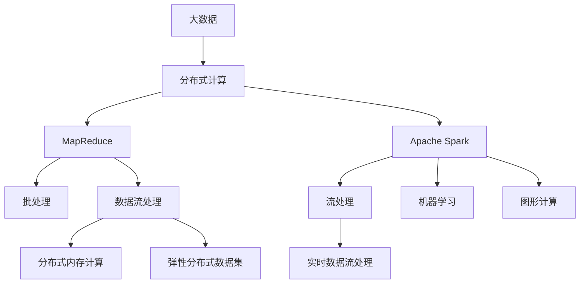

                 

# 大数据处理技术：MapReduce 和 Apache Spark

> 关键词：大数据, 分布式处理, MapReduce, Apache Spark, 数据流处理, 数据存储, 分布式系统, 云计算, 大数据平台, 大数据技术

## 1. 背景介绍

### 1.1 问题由来

随着互联网和物联网的快速发展，数据量的增长速度呈指数级增长。面对海量数据的存储、处理和分析，传统集中式的数据处理方法变得越来越难以胜任。如何高效、可靠地处理大规模数据，成为大数据时代的关键技术挑战。

MapReduce和大数据处理框架Apache Spark的诞生，彻底改变了数据处理的方式。它们能够在大规模集群中并行化处理数据，极大提升了数据处理的效率和灵活性，满足了大数据时代的计算需求。

### 1.2 问题核心关键点

大数据处理的核心问题包括：
- 数据的分布式存储和计算：如何高效地存储和处理分布式的大规模数据。
- 算法的可扩展性：如何设计可扩展的算法，以适应分布式环境。
- 大数据处理的技术框架：MapReduce和Apache Spark等框架的原理和应用。
- 大数据平台的选择：选择适合自身业务需求的大数据处理平台。
- 大数据技术的未来发展趋势：了解大数据技术的发展方向和应用前景。

本文将从大数据处理的基本概念、MapReduce和Apache Spark的核心原理、实际应用和未来趋势等方面，全面解析MapReduce和Apache Spark，帮助读者深入理解大数据处理技术。

## 2. 核心概念与联系

### 2.1 核心概念概述

为了更好地理解MapReduce和Apache Spark，本节将介绍几个密切相关的核心概念：

- **大数据(Big Data)**：指数据量、数据种类、数据生成速度等方面都远超传统数据处理技术的数据集合。大数据的典型特征包括：数据规模巨大、数据类型多样、数据增长快速等。

- **分布式计算(Distributed Computing)**：将大规模数据处理任务分布到多个计算节点上并行执行，以达到提高计算效率、降低硬件成本的目的。分布式计算的核心思想是将计算任务分割成小的子任务，并行分配到不同的计算节点上执行。

- **MapReduce**：一种用于大规模数据集并行处理的技术，由Google提出，被广泛应用于大数据处理。MapReduce将数据处理分为两个步骤：Map和Reduce。

- **Apache Spark**：一种快速、通用的大数据处理框架，支持批处理、流处理、机器学习和图形计算等多种数据处理模式。Spark的核心组件包括分布式内存计算、弹性分布式数据集(Resilient Distributed Datasets, RDDs)等。

- **流处理(Stream Processing)**：针对实时数据流的处理技术。与批处理不同，流处理可以实时处理数据流，适用于需要低延迟、高吞吐量的场景。

- **存储与计算分离(Store-Compute Separation)**：将数据的存储和计算任务分离，使得数据存储和处理可以更加灵活、高效。

这些核心概念之间的逻辑关系可以通过以下Mermaid流程图来展示：



这个流程图展示了大数据处理的核心概念及其之间的关系：

1. 大数据通过分布式计算进行存储和处理。
2. MapReduce和Apache Spark是两种分布式计算技术。
3. MapReduce主要支持批处理和数据流处理，而Apache Spark支持更多数据处理模式，包括批处理、流处理、机器学习和图形计算。
4. Apache Spark的核心组件包括分布式内存计算和RDDs等，提供了高效的数据处理能力。
5. 流处理、机器学习和图形计算等不同处理模式，可以通过Apache Spark实现。

## 3. 核心算法原理 & 具体操作步骤

### 3.1 算法原理概述

MapReduce和Apache Spark的核心算法原理主要包括以下几个方面：

1. **分布式存储**：在大规模集群中，使用Hadoop Distributed File System(HDFS)等分布式文件系统进行数据的存储和管理。
2. **分布式计算**：将数据处理任务分割成小的子任务，并行分配到不同的计算节点上执行。MapReduce将任务分为Map和Reduce两个阶段，而Apache Spark则通过弹性分布式数据集(RDDs)进行分布式计算。
3. **数据流处理**：针对实时数据流的处理技术。Apache Spark支持基于内存的流处理引擎——Spark Streaming，可以在秒级处理数据流。
4. **内存计算**：使用内存进行数据处理，相比于磁盘I/O，内存计算效率更高，适用于需要高吞吐量的场景。
5. **机器学习**：使用Spark MLlib等库进行机器学习，支持分类、回归、聚类等常见算法。
6. **图形计算**：使用Spark GraphX进行图形计算，支持构建和分析大型图形数据集。

### 3.2 算法步骤详解

#### MapReduce的步骤详解

1. **输入与分割**：将输入数据分割成若干个小的数据块，分别分配到不同的计算节点上进行处理。
2. **Map阶段**：每个计算节点对数据块进行Map操作，生成中间结果。
3. **Shuffle与Reduce**：将Map阶段生成的中间结果进行排序和分区，并将相同分区的数据汇总到同一个Reduce节点上。
4. **Reduce阶段**：每个Reduce节点对接收到的数据进行Reduce操作，生成最终结果。
5. **输出**：将Reduce阶段生成的结果合并输出。

#### Apache Spark的步骤详解

1. **创建弹性分布式数据集(RDDs)**：将数据集转换为RDDs，RDDs是Spark的核心数据结构，支持数据的分散和并行处理。
2. **数据转换与操作**：对RDDs进行转换和操作，如Map、Filter、Join、GroupBy等。
3. **计算操作**：对RDDs进行计算操作，如Reduce、Count、Sum、Aggregate等。
4. **数据流处理**：使用Spark Streaming处理实时数据流，实现数据的流式计算。
5. **内存计算**：使用Spark内存计算引擎，在内存中进行数据处理，提高计算效率。
6. **机器学习**：使用Spark MLlib库进行机器学习，实现分类、回归、聚类等算法。
7. **图形计算**：使用Spark GraphX进行图形计算，实现大型图形数据集的构建和分析。

### 3.3 算法优缺点

MapReduce和Apache Spark的优点包括：

1. **高可扩展性**：可以处理大规模数据集，支持多节点分布式计算，具有很好的可扩展性。
2. **高效性**：使用了内存计算等技术，可以大幅提升数据处理的效率。
3. **灵活性**：支持多种数据处理模式，包括批处理、流处理、机器学习和图形计算等。
4. **容错性**：可以自动检测和恢复计算节点中的故障，保证数据处理的可靠性。

MapReduce和Apache Spark的缺点包括：

1. **学习成本较高**：需要掌握分布式计算和编程模型，有一定的学习成本。
2. **数据冗余**：需要存储大量的中间数据，占用大量存储空间。
3. **性能瓶颈**：在数据量过大或计算节点过多时，可能会遇到性能瓶颈。
4. **扩展性有限**：在数据量不断增长的环境下，扩展性可能会受到限制。

### 3.4 算法应用领域

MapReduce和Apache Spark已经被广泛应用于多个领域，如：

1. **数据仓库与大数据分析**：用于大规模数据集的存储和分析，支持复杂的分析查询。
2. **实时数据流处理**：用于实时数据流的处理和分析，支持低延迟、高吞吐量的场景。
3. **机器学习**：用于大规模数据的机器学习，支持分类、回归、聚类等算法。
4. **图形分析**：用于大型图形数据集的构建和分析，支持社交网络、地理信息等复杂场景。
5. **日志分析**：用于大规模日志数据的存储和分析，支持日志事件的统计和查询。
6. **推荐系统**：用于用户行为数据的存储和分析，支持个性化推荐系统的构建。

除了这些领域，MapReduce和Apache Spark还被广泛应用于金融、医疗、电信、电商等各行各业，推动了大数据时代的到来。

## 4. 数学模型和公式 & 详细讲解 & 举例说明

### 4.1 数学模型构建

#### MapReduce的数学模型

MapReduce的数学模型可以表示为：

$$
\text{MapReduce} = \text{Map} + \text{Shuffle} + \text{Reduce}
$$

其中，Map函数将输入数据映射为若干个小的中间结果，Shuffle函数将中间结果进行排序和分区，Reduce函数将相同分区的数据汇总并计算。

#### Apache Spark的数学模型

Apache Spark的数学模型可以表示为：

$$
\text{Spark} = \text{RDDs} + \text{Transformations} + \text{Actions}
$$

其中，RDDs是Spark的核心数据结构，Transformations是对RDDs进行转换和操作，Actions是对RDDs进行计算和输出。

### 4.2 公式推导过程

#### MapReduce的公式推导

MapReduce的Map函数和Reduce函数的公式推导如下：

$$
\text{Map}(x_i) = \{y_1, y_2, ..., y_n\}
$$

$$
\text{Shuffle}(x_i) = \{z_1, z_2, ..., z_m\}
$$

$$
\text{Reduce}(z_j) = \{w_1, w_2, ..., w_k\}
$$

其中，$x_i$为输入数据，$y_j$为Map函数的输出，$z_j$为Shuffle阶段的输出，$w_j$为Reduce函数的输出。

#### Apache Spark的公式推导

Apache Spark的RDDs的转换和操作的公式推导如下：

$$
\text{RDDs}(x_i) = \{y_1, y_2, ..., y_n\}
$$

$$
\text{Transformations}(y_j) = \{z_1, z_2, ..., z_m\}
$$

$$
\text{Actions}(z_j) = \{w_1, w_2, ..., w_k\}
$$

其中，$x_i$为输入数据，$y_j$为RDDs的转换和操作后的结果，$z_j$为Transformations阶段的输出，$w_j$为Actions阶段的输出。

### 4.3 案例分析与讲解

#### MapReduce的案例分析

假设有一个包含1000万条记录的大数据集，需要进行数据统计和分析。使用MapReduce进行处理的步骤如下：

1. **Map阶段**：将1000万条记录分割成10000个数据块，分别分配到10000个计算节点上进行处理。
2. **Reduce阶段**：将Map阶段生成的中间结果进行排序和分区，并将相同分区的数据汇总到同一个Reduce节点上。
3. **计算结果**：每个Reduce节点对接收到的数据进行Reduce操作，生成最终结果。

#### Apache Spark的案例分析

假设有一个包含1000万条记录的大数据集，需要进行数据统计和分析。使用Apache Spark进行处理的步骤如下：

1. **创建RDDs**：将1000万条记录转换为RDDs。
2. **转换操作**：对RDDs进行转换操作，如Map、Filter、Join等。
3. **计算操作**：对RDDs进行计算操作，如Reduce、Count、Sum等。
4. **输出结果**：将计算结果输出到数据库或文件中。

## 5. 项目实践：代码实例和详细解释说明

### 5.1 开发环境搭建

在进行MapReduce和Apache Spark的实践前，我们需要准备好开发环境。以下是使用Python进行PySpark开发的环境配置流程：

1. 安装Anaconda：从官网下载并安装Anaconda，用于创建独立的Python环境。

2. 创建并激活虚拟环境：
```bash
conda create -n pyspark-env python=3.8 
conda activate pyspark-env
```

3. 安装PySpark：根据Spark版本，从官网获取对应的安装命令。例如：
```bash
conda install pyspark=3.2.1
```

4. 安装PyTorch、Pandas等工具包：
```bash
pip install torch pandas scikit-learn matplotlib tqdm jupyter notebook ipython
```

完成上述步骤后，即可在`pyspark-env`环境中开始实践。

### 5.2 源代码详细实现

下面我们以Word Count为例，给出使用PySpark进行MapReduce开发的PySpark代码实现。

首先，定义Map和Reduce函数：

```python
from pyspark import SparkContext, SparkConf

conf = SparkConf().setAppName("Word Count")
sc = SparkContext(conf=conf)

def map_func(line):
    words = line.split()
    return (word, 1) for word in words

def reduce_func(acc1, acc2):
    return (acc1[0], acc1[1] + acc2[1])

# 读取文件并分割为行
lines = sc.textFile("path/to/input")
# 对每一行进行Map操作
mapped = lines.map(map_func)
# 对Map结果进行Reduce操作
result = mapped.reduceByKey(reduce_func)

# 输出结果
for word, count in result.collect():
    print(f"{word}: {count}")
```

然后，启动Spark作业：

```bash
spark-submit --py-files /path/to/code.zip /path/to/script.py
```

### 5.3 代码解读与分析

让我们再详细解读一下关键代码的实现细节：

**map_func和reduce_func函数**：
- `map_func`函数将每一行文本拆分成单词，并返回单词和出现次数的元组。
- `reduce_func`函数对两个元组进行累加操作，返回单词和出现次数的元组。

**SparkContext的创建与配置**：
- `SparkConf`对象用于配置Spark的参数，如应用名称、内存分配等。
- `SparkContext`对象用于创建Spark环境，并执行分布式计算任务。

**数据处理流程**：
- 使用`sc.textFile`方法读取输入文件，分割为行。
- 对每一行进行`map`操作，生成单词和出现次数的元组。
- 使用`reduceByKey`方法对Map结果进行`Reduce`操作，并将相同单词的元组进行累加。
- 使用`collect`方法将Reduce结果收集到本地，并进行输出。

通过这个简单的示例，我们可以看到，PySpark使用Map和Reduce函数实现了大规模数据的分布式计算。这种高可扩展性和高效性，使得Spark成为了大数据处理的首选框架。

## 6. 实际应用场景

### 6.1 数据仓库与大数据分析

在大规模数据仓库和数据分析场景中，MapReduce和Apache Spark可以高效地处理海量数据，支持复杂的分析查询。例如，使用MapReduce和Spark可以处理多TB级别的数据，进行统计、聚合、分析等操作，帮助企业做出数据驱动的决策。

### 6.2 实时数据流处理

在实时数据流处理场景中，MapReduce和Apache Spark可以实时处理大量数据，支持低延迟、高吞吐量的场景。例如，使用Spark Streaming可以处理每秒数百万次的数据流，用于实时监控、日志分析、用户行为分析等。

### 6.3 机器学习

在机器学习场景中，MapReduce和Apache Spark可以高效地处理大规模数据，支持分布式机器学习算法。例如，使用Spark MLlib可以训练分布式机器学习模型，支持分类、回归、聚类等算法，支持大规模数据的处理和分析。

### 6.4 图形分析

在图形分析场景中，MapReduce和Apache Spark可以高效地处理大型图形数据集，支持社交网络、地理信息等复杂场景。例如，使用Spark GraphX可以进行大型图形数据的构建和分析，支持图算法、路径查询等操作。

### 6.5 日志分析

在日志分析场景中，MapReduce和Apache Spark可以高效地处理大量日志数据，支持日志事件的统计和查询。例如，使用MapReduce和Spark可以对日志数据进行分布式处理，统计日志事件的频率、来源、持续时间等指标。

### 6.6 推荐系统

在推荐系统场景中，MapReduce和Apache Spark可以高效地处理用户行为数据，支持个性化推荐系统的构建。例如，使用Spark MLlib可以训练分布式推荐算法，支持用户画像、物品推荐等操作。

## 7. 工具和资源推荐

### 7.1 学习资源推荐

为了帮助开发者系统掌握MapReduce和Apache Spark的理论基础和实践技巧，这里推荐一些优质的学习资源：

1.《Hadoop: The Definitive Guide》（中文翻译为《Hadoop权威指南》）：一本全面介绍Hadoop和MapReduce的书籍，适合初学者和进阶者阅读。
2.《Spark: The Definitive Guide》（中文翻译为《Spark权威指南》）：一本全面介绍Apache Spark的书籍，适合Spark开发者阅读。
3.《Data Science from Scratch》（中文翻译为《数据科学入门》）：一本从零开始的Data Science和Spark书籍，适合零基础读者阅读。
4. Coursera上的大数据课程：斯坦福大学、加州大学伯克利分校等名校开设的大数据课程，涵盖Hadoop、MapReduce、Spark等技术。
5. Udacity上的大数据纳米学位：Udacity提供的大数据纳米学位，涵盖Hadoop、Spark、数据仓库等技术。

通过对这些资源的学习实践，相信你一定能够快速掌握MapReduce和Apache Spark的精髓，并用于解决实际的NLP问题。

### 7.2 开发工具推荐

高效的开发离不开优秀的工具支持。以下是几款用于MapReduce和Apache Spark开发的常用工具：

1. PySpark：Python语言编写的Spark API，可以方便地在Python环境中使用Spark。
2. Spark UI：Spark提供的可视化界面，用于监控和管理Spark作业。
3. Zeppelin：一个基于Web的交互式数据分析平台，支持使用Scala和Python编写Spark作业。
4. Jupyter Notebook：一个基于Web的交互式编程环境，支持Python和Scala等语言，方便进行Spark作业开发和调试。
5. Hadoop：Hadoop是Hadoop生态的核心组件，提供分布式文件系统和MapReduce计算模型。

合理利用这些工具，可以显著提升MapReduce和Apache Spark的开发效率，加快创新迭代的步伐。

### 7.3 相关论文推荐

MapReduce和Apache Spark的研究源于学界的持续研究。以下是几篇奠基性的相关论文，推荐阅读：

1. MapReduce: Simplified Data Processing on Large Clusters（MapReduce原论文）：提出了MapReduce计算模型，奠定了大数据处理的基础。
2. Spark: Cluster Computing with Fault Tolerance（Spark原论文）：提出了Spark计算框架，实现了高效的内存计算和分布式处理。
3. Pregel: Pregel是一个用于大规模图形数据集处理的分布式计算系统，支持图算法、路径查询等操作。
4. MLlib: MLlib是Spark的机器学习库，支持分布式机器学习算法，如分类、回归、聚类等。
5. GraphX: GraphX是Spark的图形计算库，支持大型图形数据的构建和分析。

这些论文代表了大数据处理技术的发展脉络。通过学习这些前沿成果，可以帮助研究者把握学科前进方向，激发更多的创新灵感。

## 8. 总结：未来发展趋势与挑战

### 8.1 总结

本文对MapReduce和Apache Spark进行了全面系统的介绍。首先阐述了MapReduce和Apache Spark的研究背景和意义，明确了它们在大数据处理中的重要地位。其次，从原理到实践，详细讲解了MapReduce和Apache Spark的核心算法和具体操作步骤，给出了MapReduce和Apache Spark的代码实例。同时，本文还广泛探讨了MapReduce和Apache Spark在实际应用中的各种场景，展示了它们在各行各业中的广泛应用。

通过本文的系统梳理，可以看到，MapReduce和Apache Spark已经成为了大数据处理的主流技术，极大地提升了数据处理的效率和灵活性，满足了大数据时代的计算需求。未来，伴随MapReduce和Apache Spark的持续演进，必将进一步推动大数据技术的发展，拓展数据处理的应用范围。

### 8.2 未来发展趋势

展望未来，MapReduce和Apache Spark的发展趋势将呈现以下几个方面：

1. **分布式计算的普及**：随着分布式计算技术的普及，MapReduce和Apache Spark将广泛应用于更多行业，推动大数据技术的发展。
2. **内存计算的提升**：内存计算技术的不断提升，将使得MapReduce和Apache Spark在大数据处理中更加高效。
3. **流处理的强化**：Spark Streaming和Apache Flink等流处理框架的不断优化，将使得MapReduce和Apache Spark在实时数据处理中更加高效。
4. **机器学习的集成**：Spark MLlib和Apache MLlib等机器学习库的不断优化，将使得MapReduce和Apache Spark在机器学习应用中更加高效。
5. **多模型协同**：MapReduce和Apache Spark将与其他大数据处理技术（如Hadoop、NoSQL数据库等）进行更好的集成，实现多模型协同处理。
6. **多领域应用**：MapReduce和Apache Spark将在更多领域（如医疗、金融、电信等）得到广泛应用，推动大数据技术的发展。
7. **开源生态的完善**：MapReduce和Apache Spark的开源生态将不断完善，提供更多工具和库，支持更广泛的数据处理需求。

以上趋势凸显了MapReduce和Apache Spark的广阔前景。这些方向的探索发展，必将进一步提升MapReduce和Apache Spark的性能和应用范围，为大数据处理技术的未来发展注入新的动力。

### 8.3 面临的挑战

尽管MapReduce和Apache Spark已经取得了显著成就，但在迈向更加智能化、普适化应用的过程中，它们仍面临诸多挑战：

1. **学习曲线陡峭**：MapReduce和Apache Spark的学习曲线较陡峭，需要掌握分布式计算和编程模型，有一定的学习成本。
2. **性能瓶颈**：在数据量过大或计算节点过多时，可能会遇到性能瓶颈，需要优化数据分布和节点配置。
3. **资源消耗大**：MapReduce和Apache Spark需要消耗大量的计算资源，需要在成本和性能之间进行权衡。
4. **扩展性有限**：在数据量不断增长的环境下，扩展性可能会受到限制，需要优化集群管理和资源配置。
5. **数据冗余**：需要存储大量的中间数据，占用大量存储空间，需要优化数据压缩和存储。

正视MapReduce和Apache Spark面临的这些挑战，积极应对并寻求突破，将使得它们在大数据处理中更加高效和可靠。

### 8.4 研究展望

面对MapReduce和Apache Spark面临的挑战，未来的研究需要在以下几个方面寻求新的突破：

1. **优化分布式计算模型**：优化MapReduce和Apache Spark的计算模型，提高数据处理效率。
2. **提升内存计算能力**：提升内存计算能力，降低数据冗余，优化数据处理流程。
3. **优化流处理技术**：优化流处理技术，实现低延迟、高吞吐量的实时数据处理。
4. **优化机器学习算法**：优化机器学习算法，提高模型训练和推理效率。
5. **优化图形计算技术**：优化图形计算技术，支持大型图形数据集的构建和分析。
6. **优化资源管理**：优化集群管理和资源配置，提高资源利用率和系统稳定性。
7. **优化数据存储技术**：优化数据存储技术，支持高效的数据读写和存储。

这些研究方向将推动MapReduce和Apache Spark技术的不断进步，使得大数据处理更加高效、可靠和普适化。

## 9. 附录：常见问题与解答

**Q1：MapReduce和Apache Spark的主要区别是什么？**

A: MapReduce和Apache Spark都是用于大规模数据集分布式处理的框架，但它们有以下区别：
- MapReduce是一种基于磁盘的计算框架，适合处理批处理数据；而Apache Spark支持内存计算，适合处理实时数据流。
- MapReduce通过Hadoop文件系统进行数据存储和访问；而Apache Spark支持多种数据源和数据存储格式，如Hadoop、Hive、Cassandra等。
- MapReduce主要用于批处理和离线计算；而Apache Spark支持批处理、流处理、机器学习和图形计算等多种计算模式。

**Q2：如何优化MapReduce和Apache Spark的性能？**

A: 优化MapReduce和Apache Spark的性能可以从以下几个方面入手：
- 数据分布优化：优化数据分布和节点配置，减少数据传输和计算负载。
- 内存计算优化：使用内存计算技术，提高数据处理效率。
- 集群管理优化：优化集群管理和资源配置，提高资源利用率和系统稳定性。
- 数据压缩和存储优化：优化数据压缩和存储，减少数据冗余和存储空间占用。
- 算法优化：优化数据处理算法，减少计算复杂度和时间消耗。

**Q3：MapReduce和Apache Spark在实际应用中如何选择合适的存储和计算方式？**

A: 选择合适的存储和计算方式需要根据具体应用场景和数据特点进行综合考虑：
- 对于大规模批处理数据，可以选择Hadoop文件系统和MapReduce进行存储和计算。
- 对于实时数据流，可以选择HDFS和Spark Streaming进行存储和计算。
- 对于大规模图形数据，可以选择Spark GraphX进行存储和计算。
- 对于大规模机器学习数据，可以选择Spark MLlib进行存储和计算。
- 对于大规模分布式文件系统，可以选择Hadoop和MapReduce进行存储和计算。

选择合适的存储和计算方式，可以提高数据处理效率和系统稳定性，满足实际应用需求。

**Q4：MapReduce和Apache Spark在大数据处理中面临哪些挑战？**

A: MapReduce和Apache Spark在大数据处理中面临的挑战包括：
- 学习曲线陡峭：MapReduce和Apache Spark的学习曲线较陡峭，需要掌握分布式计算和编程模型。
- 性能瓶颈：在数据量过大或计算节点过多时，可能会遇到性能瓶颈，需要优化数据分布和节点配置。
- 资源消耗大：MapReduce和Apache Spark需要消耗大量的计算资源，需要在成本和性能之间进行权衡。
- 扩展性有限：在数据量不断增长的环境下，扩展性可能会受到限制，需要优化集群管理和资源配置。
- 数据冗余：需要存储大量的中间数据，占用大量存储空间，需要优化数据压缩和存储。

正视这些挑战，积极应对并寻求突破，将使得MapReduce和Apache Spark在大数据处理中更加高效和可靠。

**Q5：MapReduce和Apache Spark在大数据处理中如何实现高效的数据流处理？**

A: 实现高效的数据流处理可以从以下几个方面入手：
- 使用内存计算技术：Apache Spark支持内存计算，可以提高数据流处理的效率。
- 优化数据传输和存储：优化数据传输和存储，减少数据冗余和传输时间。
- 优化算法和模型：优化算法和模型，提高数据流处理的效率和精度。
- 使用流处理框架：使用Apache Spark Streaming、Apache Flink等流处理框架，支持低延迟、高吞吐量的数据流处理。

这些技术手段可以帮助MapReduce和Apache Spark在大数据处理中实现高效的数据流处理。

---

作者：禅与计算机程序设计艺术 / Zen and the Art of Computer Programming

