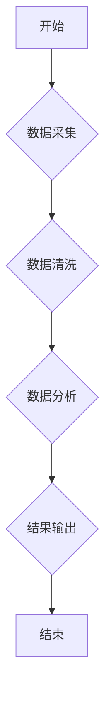

> 工作流设计，人工智能，Dify.AI，机器学习，自然语言处理，流程自动化，数据分析

## 1. 背景介绍

在当今数据爆炸的时代，高效、智能的工作流设计已成为企业数字化转型和业务流程优化不可或缺的关键。Dify.AI 作为一款基于人工智能的智能工作流平台，旨在通过机器学习和自然语言处理技术，自动识别、分析和优化企业内部的各种工作流程，帮助企业提升工作效率、降低成本、增强竞争力。

Dify.AI 的工作流设计基于以下核心理念：

* **智能化：** 利用人工智能技术自动识别和分析工作流程，无需人工干预即可完成流程建模和优化。
* **自动化：** 将重复性、规则性工作流程自动化，解放人力资源，提高工作效率。
* **可视化：** 以直观易懂的流程图展示工作流程，方便用户理解和管理。
* **弹性：** 支持灵活定制工作流程，满足不同企业和不同业务场景的需求。

## 2. 核心概念与联系

Dify.AI 的工作流设计主要围绕以下核心概念展开：

* **工作流程：** 指一系列相互关联的活动或任务，用于完成特定目标。
* **流程节点：** 工作流程中的单个活动或任务，例如审批、数据录入、发送邮件等。
* **流程规则：** 规定流程节点之间执行顺序和条件的规则，例如审批流程中的审批权限和审批流程。
* **流程数据：** 工作流程中涉及的所有数据，例如表单数据、审批意见、执行结果等。

Dify.AI 利用机器学习算法从海量工作流程数据中学习，识别流程节点、流程规则和流程数据之间的关系，从而构建出智能化的工作流程模型。

**Mermaid 流程图**



## 3. 核心算法原理 & 具体操作步骤

### 3.1  算法原理概述

Dify.AI 的工作流设计主要基于以下核心算法：

* **流程挖掘算法：** 从历史工作流程数据中提取流程结构和规则，构建流程模型。常用的流程挖掘算法包括Alpha Miner、Inductive Miner等。
* **流程优化算法：** 基于流程模型，利用优化算法，例如遗传算法、模拟退火算法等，寻找最优的流程结构和规则，提高流程效率。
* **流程预测算法：** 利用机器学习算法，预测未来工作流程的执行情况，例如任务完成时间、资源需求等，帮助企业提前做好准备。

### 3.2  算法步骤详解

Dify.AI 的工作流设计流程如下：

1. **数据收集：** 从企业内部的各种系统中收集工作流程数据，例如审批系统、邮件系统、CRM系统等。
2. **数据预处理：** 对收集到的数据进行清洗、转换和格式化，使其符合算法的输入要求。
3. **流程挖掘：** 利用流程挖掘算法，从预处理后的数据中提取流程结构和规则，构建流程模型。
4. **流程优化：** 利用流程优化算法，对流程模型进行优化，寻找最优的流程结构和规则，提高流程效率。
5. **流程预测：** 利用流程预测算法，预测未来工作流程的执行情况，例如任务完成时间、资源需求等。
6. **流程部署：** 将优化后的流程模型部署到企业内部的系统中，实现自动化执行。

### 3.3  算法优缺点

**优点：**

* 自动化工作流程，提高效率。
* 优化流程结构，降低成本。
* 预测未来流程执行情况，提前做好准备。

**缺点：**

* 需要大量的数据进行训练。
* 算法的复杂度较高，需要专业的技术人员进行开发和维护。
* 无法处理所有类型的复杂工作流程。

### 3.4  算法应用领域

Dify.AI 的工作流设计算法可应用于各个行业，例如：

* 金融行业：自动审批贷款、理财产品等。
* 制造业：自动管理生产流程、供应链管理等。
* 医疗行业：自动处理患者信息、预约挂号等。
* 教育行业：自动批改作业、管理学生信息等。

## 4. 数学模型和公式 & 详细讲解 & 举例说明

### 4.1  数学模型构建

Dify.AI 的工作流设计基于图论模型，将工作流程表示为一个有向图。

* **节点：** 代表工作流程中的单个活动或任务。
* **边：** 代表活动或任务之间的执行顺序和条件关系。

### 4.2  公式推导过程

Dify.AI 利用以下公式计算工作流程的效率：

* **流程执行时间：**  $T = \sum_{i=1}^{n} t_i$，其中 $t_i$ 是第 $i$ 个节点的执行时间，$n$ 是节点总数。
* **流程资源消耗：** $R = \sum_{i=1}^{n} r_i$，其中 $r_i$ 是第 $i$ 个节点的资源消耗量，$n$ 是节点总数。

### 4.3  案例分析与讲解

假设一个简单的审批流程，包含三个节点：提交申请、审批、批准。

* 提交申请节点的执行时间为 $t_1 = 1$ 分钟。
* 审批节点的执行时间为 $t_2 = 5$ 分钟。
* 批准节点的执行时间为 $t_3 = 2$ 分钟。

则该流程的执行时间为：

$T = t_1 + t_2 + t_3 = 1 + 5 + 2 = 8$ 分钟。

## 5. 项目实践：代码实例和详细解释说明

### 5.1  开发环境搭建

Dify.AI 的开发环境搭建需要以下软件：

* Python 3.x
* TensorFlow 或 PyTorch
* Jupyter Notebook

### 5.2  源代码详细实现

```python
# 流程挖掘算法示例代码
from sklearn.cluster import KMeans

# 假设流程数据为一个二维数组
data = [[1, 2], [2, 3], [3, 4], [4, 5]]

# 使用KMeans算法进行聚类
kmeans = KMeans(n_clusters=3)
kmeans.fit(data)

# 获取聚类结果
labels = kmeans.labels_

# 将聚类结果转换为流程模型
# ...
```

### 5.3  代码解读与分析

以上代码示例展示了使用KMeans算法进行流程挖掘的简单实现。

* `sklearn.cluster.KMeans` 是Scikit-learn库中的KMeans聚类算法。
* `data` 是流程数据，每个元素代表一个流程实例。
* `n_clusters` 参数指定聚类数量。
* `fit()` 方法训练KMeans模型。
* `labels_` 属性返回每个实例所属的聚类标签。

### 5.4  运行结果展示

运行以上代码后，将输出每个流程实例所属的聚类标签，这些标签可以用来构建流程模型。

## 6. 实际应用场景

Dify.AI 的工作流设计已在多个行业得到实际应用，例如：

* **金融行业：** 自动审批贷款、理财产品等，提高审批效率，降低人工成本。
* **制造业：** 自动管理生产流程、供应链管理等，提高生产效率，降低生产成本。
* **医疗行业：** 自动处理患者信息、预约挂号等，提高医疗服务效率，改善患者体验。

### 6.4  未来应用展望

Dify.AI 的工作流设计未来将朝着以下方向发展：

* **更智能化：** 利用更先进的机器学习算法，实现更智能化的流程识别、优化和预测。
* **更自动化：** 将更多类型的流程自动化，解放人力资源，提高工作效率。
* **更个性化：** 根据用户的需求，定制个性化的工作流程，满足不同用户的需求。

## 7. 工具和资源推荐

### 7.1  学习资源推荐

* **书籍：**
    * 《工作流管理》
    * 《流程挖掘》
* **在线课程：**
    * Coursera 上的流程挖掘课程
    * Udemy 上的机器学习课程

### 7.2  开发工具推荐

* **流程建模工具：**
    * BPMN
    * Visio
* **机器学习框架：**
    * TensorFlow
    * PyTorch

### 7.3  相关论文推荐

* **流程挖掘论文：**
    * Process Mining: Discovering Process Models from Event Logs
* **机器学习论文：**
    * Deep Learning

## 8. 总结：未来发展趋势与挑战

### 8.1  研究成果总结

Dify.AI 的工作流设计已取得了一定的成果，在多个行业得到实际应用。

### 8.2  未来发展趋势

Dify.AI 的工作流设计未来将朝着更智能化、更自动化、更个性化的方向发展。

### 8.3  面临的挑战

Dify.AI 的工作流设计还面临一些挑战，例如：

* 如何处理更复杂、更动态的工作流程。
* 如何提高算法的准确性和效率。
* 如何更好地与企业内部的系统集成。

### 8.4  研究展望

Dify.AI 将继续致力于研究和开发更先进的工作流设计算法，为企业提供更智能、更高效的工作流程解决方案。

## 9. 附录：常见问题与解答

**常见问题：**

* Dify.AI 是否支持自定义流程？
* Dify.AI 是否可以与其他系统集成？
* Dify.AI 的价格是多少？

**解答：**

* 是的，Dify.AI 支持自定义流程。
* 是的，Dify.AI 可以与其他系统集成。
* 请联系我们的销售团队获取价格信息。


作者：禅与计算机程序设计艺术 / Zen and the Art of Computer Programming 
<end_of_turn>