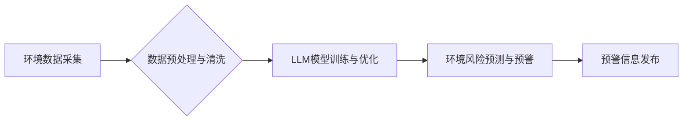

> Large Language Model (LLM), 环境监测, 预警系统, 自然语言处理, 机器学习, 深度学习, 数据分析, 可持续发展

## 1. 背景介绍

随着全球气候变化和环境问题的日益严峻，环境监测和预警系统已成为保障生态安全和可持续发展的关键基础设施。传统环境监测系统主要依赖于人工采集和分析数据，存在效率低、成本高、反应慢等问题。近年来，人工智能技术，特别是大型语言模型 (LLM) 的快速发展，为环境监测和预警系统带来了新的机遇。

LLM 是一种强大的深度学习模型，能够理解和生成人类语言，并具备强大的数据分析、模式识别和预测能力。将 LLM 应用于环境监测和预警系统，可以有效提升监测效率、准确性和预警时效性，为环境保护和灾害防治提供更精准、更有效的支持。

## 2. 核心概念与联系

### 2.1 环境监测和预警系统

环境监测和预警系统旨在实时监测环境质量，识别潜在的环境风险，并及时发出预警信息，以帮助人们采取措施预防和减轻环境灾害。

系统通常包括以下几个关键模块：

* **数据采集模块:** 收集环境数据，例如空气质量、水质、土壤质量、气象数据等。
* **数据处理模块:** 对采集到的数据进行预处理、清洗、分析和融合。
* **预警模型模块:** 基于历史数据和实时数据，构建预警模型，预测环境风险和潜在灾害。
* **预警发布模块:** 将预警信息及时发布给相关人员和公众，以便采取应对措施。

### 2.2 大型语言模型 (LLM)

LLM 是一种基于深度学习的强大自然语言处理 (NLP) 模型，能够理解和生成人类语言。其核心特点包括：

* **规模庞大:** LLM 通常拥有数十亿甚至数千亿个参数，能够学习和处理海量文本数据。
* **多任务学习:** LLM 可以进行多种 NLP 任务，例如文本分类、文本生成、机器翻译、问答系统等。
* **上下文理解:** LLM 能够理解文本中的上下文关系，并生成更自然、更流畅的文本。

### 2.3 LLM在环境监测和预警系统中的应用

将 LLM 应用于环境监测和预警系统，可以发挥其强大的数据分析、模式识别和预测能力，提升系统的效率和准确性。

**Mermaid 流程图:**



## 3. 核心算法原理 & 具体操作步骤

### 3.1 算法原理概述

LLM 在环境监测和预警系统中的应用主要基于以下核心算法原理：

* **自然语言处理 (NLP):** LLM 可以理解和处理环境监测数据中的文本信息，例如气象预报、新闻报道、专家报告等，提取关键信息和潜在风险。
* **机器学习 (ML):** LLM 可以学习环境数据中的模式和关系，构建预测模型，预测环境风险和潜在灾害。
* **深度学习 (DL):** LLM 是基于深度学习技术的，能够学习更复杂的模式和关系，提高预测精度。

### 3.2 算法步骤详解

LLM 在环境监测和预警系统中的应用，通常可以分为以下几个步骤：

1. **数据收集:** 收集环境监测数据，包括气象数据、水质数据、土壤数据、空气质量数据等，以及相关文本信息，例如新闻报道、专家报告等。
2. **数据预处理:** 对收集到的数据进行清洗、格式化、转换等预处理，使其能够被 LLM 模型理解和处理。
3. **模型训练:** 使用训练数据训练 LLM 模型，使其能够学习环境数据中的模式和关系，并构建预测模型。
4. **模型评估:** 对训练好的模型进行评估，测试其预测精度和可靠性。
5. **部署与应用:** 将训练好的模型部署到环境监测和预警系统中，实时监测环境数据，并根据模型预测结果发出预警信息。

### 3.3 算法优缺点

**优点:**

* **高准确性:** LLM 能够学习复杂的模式和关系，提高环境风险预测的准确性。
* **自动化程度高:** LLM 可以自动处理大量数据，提高监测效率和自动化程度。
* **多语言支持:** LLM 可以理解和处理多种语言的文本信息，拓展应用范围。

**缺点:**

* **数据依赖性强:** LLM 的性能取决于训练数据的质量和数量。
* **计算资源需求高:** 训练和部署 LLM 模型需要大量的计算资源。
* **解释性差:** LLM 的决策过程较为复杂，难以解释其预测结果。

### 3.4 算法应用领域

LLM 在环境监测和预警系统中的应用领域广泛，包括：

* **空气质量监测和预警:** 预测空气污染水平，发出预警信息，提醒公众采取防护措施。
* **水质监测和预警:** 监测水质变化，预测水污染风险，及时采取措施保护水资源。
* **土壤质量监测和预警:** 监测土壤污染情况，预测土壤侵蚀风险，指导农业生产和环境治理。
* **自然灾害预警:** 预测洪水、地震、火灾等自然灾害，及时发出预警信息，减少灾害损失。

## 4. 数学模型和公式 & 详细讲解 & 举例说明

### 4.1 数学模型构建

LLM 的训练过程本质上是一个优化问题，目标是找到模型参数，使得模型在训练数据上的预测性能达到最佳。常用的数学模型包括：

* **线性回归:** 用于预测连续变量，例如空气质量指数 (AQI)。
* **逻辑回归:** 用于预测分类变量，例如水质类别 (清洁、轻度污染、重度污染)。
* **支持向量机 (SVM):** 用于分类和回归问题，能够处理高维数据。
* **深度神经网络 (DNN):** 能够学习更复杂的模式和关系，提高预测精度。

### 4.2 公式推导过程

具体的公式推导过程取决于所使用的数学模型。例如，线性回归模型的目标函数是均方误差 (MSE)，其公式如下：

$$MSE = \frac{1}{n} \sum_{i=1}^{n} (y_i - \hat{y}_i)^2$$

其中：

* $n$ 是样本数量。
* $y_i$ 是第 $i$ 个样本的真实值。
* $\hat{y}_i$ 是第 $i$ 个样本的预测值。

通过最小化 MSE，可以找到模型参数，使得模型的预测性能最佳。

### 4.3 案例分析与讲解

例如，可以使用线性回归模型预测空气质量指数 (AQI)。训练数据包括历史的空气质量数据和相关气象数据，例如温度、湿度、风速等。模型训练完成后，可以输入实时气象数据，预测未来 AQI 的变化趋势。

## 5. 项目实践：代码实例和详细解释说明

### 5.1 开发环境搭建

* **操作系统:** Ubuntu 20.04 LTS
* **编程语言:** Python 3.8
* **深度学习框架:** TensorFlow 2.x 或 PyTorch 1.x
* **其他工具:** Jupyter Notebook、Git

### 5.2 源代码详细实现

```python
# 导入必要的库
import tensorflow as tf

# 定义模型结构
model = tf.keras.Sequential([
    tf.keras.layers.Dense(64, activation='relu', input_shape=(10,)),
    tf.keras.layers.Dense(32, activation='relu'),
    tf.keras.layers.Dense(1)
])

# 编译模型
model.compile(optimizer='adam', loss='mse')

# 训练模型
model.fit(X_train, y_train, epochs=10)

# 评估模型
loss = model.evaluate(X_test, y_test)
print('测试损失:', loss)

# 使用模型预测
predictions = model.predict(X_new)
```

### 5.3 代码解读与分析

* **模型结构:** 代码定义了一个简单的多层感知机 (MLP) 模型，包含三个全连接层和一个输出层。
* **激活函数:** 使用 ReLU 激活函数，能够提高模型的非线性表达能力。
* **损失函数:** 使用均方误差 (MSE) 作为损失函数，用于衡量模型预测结果与真实值的差异。
* **优化器:** 使用 Adam 优化器，用于更新模型参数，使得模型的损失函数最小化。
* **训练过程:** 使用训练数据训练模型，并设置训练轮数 (epochs)。
* **评估过程:** 使用测试数据评估模型的性能，计算测试损失。
* **预测过程:** 使用训练好的模型预测新的数据。

### 5.4 运行结果展示

运行代码后，会输出模型的训练过程和评估结果，例如训练损失、测试损失等。

## 6. 实际应用场景

### 6.1 空气质量监测和预警

LLM 可以分析气象数据、空气质量监测数据和新闻报道等信息，预测空气污染水平，并发出预警信息，提醒公众采取防护措施。例如，当空气质量指数 (AQI) 预计达到危险水平时，LLM 可以自动生成预警信息，发布到社交媒体平台或短信平台，提醒公众减少户外活动。

### 6.2 水质监测和预警

LLM 可以分析水质监测数据、水文数据和地质数据等信息，预测水污染风险，并及时发出预警信息，帮助相关部门采取措施保护水资源。例如，当水质监测数据显示水体污染程度超过安全标准时，LLM 可以自动生成预警信息，通知相关部门进行调查和处理。

### 6.3 土壤质量监测和预警

LLM 可以分析土壤质量监测数据、农业生产数据和气候数据等信息，预测土壤侵蚀风险，指导农业生产和环境治理。例如，当土壤质量监测数据显示土壤侵蚀程度较高时，LLM 可以自动生成预警信息，建议农民采取措施防止土壤流失，例如种植防风固沙植物。

### 6.4 未来应用展望

随着人工智能技术的不断发展，LLM 在环境监测和预警系统中的应用前景更加广阔。未来，LLM 可以应用于以下领域：

* **更精准的风险预测:** LLM 可以学习更复杂的模式和关系，提高环境风险预测的精准度。
* **更智能的预警系统:** LLM 可以根据不同的环境情境，自动生成个性化的预警信息，提高预警的针对性和有效性。
* **更有效的环境治理:** LLM 可以帮助制定更有效的环境治理策略，例如优化污染控制措施、引导绿色发展模式。

## 7. 工具和资源推荐

### 7.1 学习资源推荐

* **书籍:**
    * Deep Learning by Ian Goodfellow, Yoshua Bengio, and Aaron Courville
    * Natural Language Processing with Python by Steven Bird, Ewan Klein, and Edward Loper
* **在线课程:**
    * TensorFlow Tutorials: https://www.tensorflow.org/tutorials
    * PyTorch Tutorials: https://pytorch.org/tutorials/
* **博客和论坛:**
    * TensorFlow Blog: https://blog.tensorflow.org/
    * PyTorch Blog: https://pytorch.org/blog/
    * Stack Overflow: https://stackoverflow.com/

### 7.2 开发工具推荐

* **深度学习框架:** TensorFlow, PyTorch
* **数据处理工具:** Pandas, NumPy
* **可视化工具:** Matplotlib, Seaborn
* **云计算平台:** AWS, Azure, Google Cloud

### 7.3 相关论文推荐

* **BERT: Pre-training of Deep Bidirectional Transformers for Language Understanding**
* **GPT-3: Language Models are Few-Shot Learners**
* **XLNet: Generalized Autoregressive Pretraining for Language Understanding**

## 8. 总结：未来发展趋势与挑战

### 8.1 研究成果总结

LLM 在