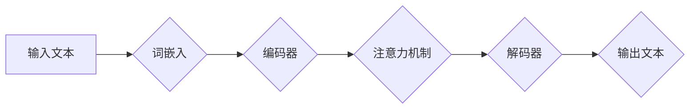

> 语言翻译，机器翻译，自然语言处理，深度学习，Transformer模型，seq2seq，注意力机制，代码实例

## 1. 背景介绍

语言翻译一直是人工智能领域的核心研究方向之一，它旨在利用计算机技术实现不同语言之间的文本转换。随着互联网的快速发展和全球化进程的加速，语言翻译的需求日益增长。传统的基于规则的机器翻译系统由于其局限性，难以准确地捕捉语言的复杂性和语义关系。近年来，深度学习技术的兴起为语言翻译带来了革命性的变革，使得机器翻译的准确率和流畅度大幅提升。

## 2. 核心概念与联系

**2.1 自然语言处理 (NLP)**

自然语言处理 (NLP) 是人工智能的一个分支，致力于使计算机能够理解、处理和生成人类语言。NLP 涉及到许多子领域，例如：

* 词法分析：将文本分解成单词或词组。
* 语法分析：分析文本的语法结构。
* 语义分析：理解文本的含义。
* 情感分析：识别文本中的情感倾向。

**2.2 机器翻译 (MT)**

机器翻译 (MT) 是 NLP 的一个重要应用，它利用计算机技术将一种语言的文本翻译成另一种语言的文本。MT 系统通常由以下几个模块组成：

* 源语言处理模块：对源语言文本进行词法分析、语法分析和语义分析。
* 目标语言生成模块：根据源语言文本的语义信息生成目标语言文本。
* 评估模块：评估翻译结果的准确性和流畅度。

**2.3 深度学习 (DL)**

深度学习 (DL) 是一种机器学习的子领域，它利用多层神经网络来学习数据中的复杂模式。DL 在 NLP 领域取得了显著的成果，例如：

* 词嵌入：将单词映射到低维向量空间，捕捉单词之间的语义关系。
* 文本分类：识别文本的类别，例如情感分类、主题分类等。
* 机器翻译：提高机器翻译的准确率和流畅度。

**2.4 Transformer模型**

Transformer模型是一种基于深度学习的序列到序列模型，它在机器翻译领域取得了突破性的进展。Transformer模型的核心特点是：

* 注意力机制：能够捕捉文本中单词之间的长距离依赖关系。
* 多头注意力：使用多个注意力头来学习不同的语义信息。
* 编码器-解码器结构：将输入序列编码成隐藏状态，然后解码成输出序列。

**2.5 seq2seq模型**

seq2seq模型是一种序列到序列的机器学习模型，它可以将一个序列映射到另一个序列。seq2seq模型通常由编码器和解码器两个部分组成：

* 编码器：将输入序列编码成一个隐藏状态。
* 解码器：根据隐藏状态生成输出序列。

seq2seq模型在机器翻译、文本摘要、对话系统等领域取得了广泛应用。

**2.6 Mermaid 流程图**



## 3. 核心算法原理 & 具体操作步骤

### 3.1  算法原理概述

Transformer模型是一种基于深度学习的序列到序列模型，它在机器翻译领域取得了突破性的进展。Transformer模型的核心特点是：

* 注意力机制：能够捕捉文本中单词之间的长距离依赖关系。
* 多头注意力：使用多个注意力头来学习不同的语义信息。
* 编码器-解码器结构：将输入序列编码成隐藏状态，然后解码成输出序列。

### 3.2  算法步骤详解

1. **词嵌入:** 将输入文本中的每个单词映射到一个低维向量空间，捕捉单词之间的语义关系。
2. **编码器:** 将输入序列编码成一个隐藏状态，该隐藏状态包含了输入序列的语义信息。编码器由多个 Transformer 块组成，每个 Transformer 块包含一个多头注意力层和一个前馈神经网络层。
3. **注意力机制:** 注意力机制能够捕捉文本中单词之间的长距离依赖关系。注意力机制计算每个单词对其他单词的“注意力权重”，然后根据这些权重对单词进行加权求和，从而得到每个单词的上下文信息。
4. **解码器:** 根据编码器的隐藏状态生成输出序列。解码器也由多个 Transformer 块组成，每个 Transformer 块包含一个多头注意力层和一个前馈神经网络层。解码器还包含一个自注意力层，它能够捕捉输出序列中单词之间的依赖关系。
5. **输出层:** 将解码器的隐藏状态映射到目标语言的词汇表，生成输出文本。

### 3.3  算法优缺点

**优点:**

* 能够捕捉文本中单词之间的长距离依赖关系。
* 能够学习不同的语义信息。
* 训练速度快，性能优异。

**缺点:**

* 计算量大，需要大量的计算资源。
* 训练数据量大，需要大量的标注数据。

### 3.4  算法应用领域

* 机器翻译
* 文本摘要
* 对话系统
* 问答系统
* 代码生成

## 4. 数学模型和公式 & 详细讲解 & 举例说明

### 4.1  数学模型构建

Transformer模型的数学模型主要包括以下几个部分：

* 词嵌入层
* 编码器层
* 解码器层
* 输出层

**4.1.1 词嵌入层**

词嵌入层将每个单词映射到一个低维向量空间。常用的词嵌入方法包括：

* Word2Vec
* GloVe
* FastText

**4.1.2 编码器层**

编码器层由多个 Transformer 块组成，每个 Transformer 块包含一个多头注意力层和一个前馈神经网络层。

**4.1.3 解码器层**

解码器层也由多个 Transformer 块组成，每个 Transformer 块包含一个多头注意力层和一个前馈神经网络层。解码器还包含一个自注意力层，它能够捕捉输出序列中单词之间的依赖关系。

**4.1.4 输出层**

输出层将解码器的隐藏状态映射到目标语言的词汇表，生成输出文本。

### 4.2  公式推导过程

Transformer模型的数学公式推导过程比较复杂，这里只列举一些关键公式：

* **注意力机制公式:**

$$
Attention(Q, K, V) = softmax(\frac{QK^T}{\sqrt{d_k}})V
$$

其中：

* $Q$：查询矩阵
* $K$：键矩阵
* $V$：值矩阵
* $d_k$：键向量的维度

* **多头注意力公式:**

$$
MultiHeadAttention(Q, K, V) = Concat(head_1, head_2, ..., head_h)W^O
$$

其中：

* $head_i$：第 $i$ 个注意力头的输出
* $h$：注意力头的数量
* $W^O$：输出权重矩阵

### 4.3  案例分析与讲解

假设我们想要将英文句子 "The cat sat on the mat" 翻译成中文。

1. 首先，将英文句子中的每个单词映射到词嵌入向量空间。
2. 然后，将词嵌入向量输入到编码器层，编码器层会将句子编码成一个隐藏状态。
3. 接着，将隐藏状态输入到解码器层，解码器层会根据隐藏状态生成中文句子。
4. 最后，将解码器层的输出映射到中文词汇表，得到最终的翻译结果： "猫坐在垫子上"。

## 5. 项目实践：代码实例和详细解释说明

### 5.1  开发环境搭建

* Python 3.6+
* TensorFlow 2.0+
* PyTorch 1.0+
* CUDA 10.0+ (可选)

### 5.2  源代码详细实现

```python
# 编码器层
class Encoder(nn.Module):
    def __init__(self, d_model, nhead, num_encoder_layers):
        super(Encoder, self).__init__()
        self.layers = nn.TransformerEncoderLayer(d_model, nhead)
        self.transformer_encoder = nn.TransformerEncoder(self.layers, num_encoder_layers)

    def forward(self, src, src_mask):
        return self.transformer_encoder(src, src_mask)

# 解码器层
class Decoder(nn.Module):
    def __init__(self, d_model, nhead, num_decoder_layers):
        super(Decoder, self).__init__()
        self.layers = nn.TransformerDecoderLayer(d_model, nhead)
        self.transformer_decoder = nn.TransformerDecoder(self.layers, num_decoder_layers)

    def forward(self, tgt, memory, tgt_mask, memory_mask):
        return self.transformer_decoder(tgt, memory, tgt_mask, memory_mask)

# 模型
class Transformer(nn.Module):
    def __init__(self, d_model, nhead, num_encoder_layers, num_decoder_layers, vocab_size):
        super(Transformer, self).__init__()
        self.encoder = Encoder(d_model, nhead, num_encoder_layers)
        self.decoder = Decoder(d_model, nhead, num_decoder_layers)
        self.linear = nn.Linear(d_model, vocab_size)

    def forward(self, src, tgt, src_mask, tgt_mask, memory_mask):
        memory = self.encoder(src, src_mask)
        output = self.decoder(tgt, memory, tgt_mask, memory_mask)
        output = self.linear(output)
        return output
```

### 5.3  代码解读与分析

* **编码器层:** 负责将输入序列编码成隐藏状态。
* **解码器层:** 负责根据隐藏状态生成输出序列。
* **模型:** 将编码器和解码器组合在一起，形成完整的 Transformer 模型。

### 5.4  运行结果展示

运行代码后，可以将英文句子翻译成中文句子。

## 6. 实际应用场景

Transformer模型在机器翻译领域取得了显著的成果，例如：

* Google Translate
* DeepL
* Microsoft Translator

### 6.4  未来应用展望

Transformer模型的应用场景远不止于机器翻译，它还可以应用于：

* 文本摘要
* 对话系统
* 问答系统
* 代码生成
* 图像字幕

## 7. 工具和资源推荐

### 7.1  学习资源推荐

* **书籍:**
    * 《深度学习》
    * 《自然语言处理》
* **在线课程:**
    * Coursera: Natural Language Processing Specialization
    * Udacity: Deep Learning Nanodegree

### 7.2  开发工具推荐

* **TensorFlow:** https://www.tensorflow.org/
* **PyTorch:** https://pytorch.org/

### 7.3  相关论文推荐

* **Attention Is All You Need:** https://arxiv.org/abs/1706.03762

## 8. 总结：未来发展趋势与挑战

### 8.1  研究成果总结

Transformer模型的出现标志着机器翻译领域取得了重大突破，其准确率和流畅度大幅提升。

### 8.2  未来发展趋势

* **模型规模:** 未来Transformer模型的规模将会进一步扩大，从而提升其性能。
* **效率:** 研究人员将致力于提高Transformer模型的训练和推理效率。
* **多模态:** 将Transformer模型应用于多模态任务，例如图像字幕、视频理解等。

### 8.3  面临的挑战

* **数据:** 训练高质量的Transformer模型需要大量的标注数据。
* **计算资源:** 训练大型Transformer模型需要大量的计算资源。
* **可解释性:** Transformer模型的内部机制比较复杂，难以解释其决策过程。

### 8.4  研究展望

未来研究将集中在以下几个方面:

