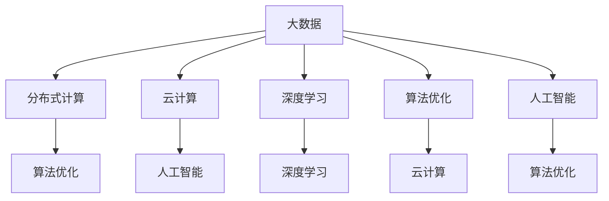

                 

# 大数据时代的利器：人类计算的应用前景

> 关键词：大数据, 人类计算, 分布式计算, 算法优化, 云计算, 人工智能

## 1. 背景介绍

### 1.1 问题由来
在过去几十年间，数据量的大幅度增长，数据处理能力的大幅提升，数据应用的广泛深入，推动着人类社会逐步迈向以数据为核心的新时代。各行各业纷纷构建大数据平台，积累海量的数据，挖掘深层次的价值。然而，在数据量激增的同时，如何高效地存储、计算、分析这些海量数据，成为了摆在全社会面前的一大难题。

与此同时，科技的迅猛发展，使得人工智能（AI）、云计算（Cloud Computing）、区块链（Blockchain）等新兴技术逐步崛起，提供了新的计算范式和处理方式。大数据时代，我们应如何充分利用这些新兴技术，加速数据的价值挖掘，提升计算效率？人类计算（Human Computing）这一新兴概念应运而生。

### 1.2 问题核心关键点
所谓人类计算，是指结合人类的智慧与新兴技术的力量，高效地处理、分析和利用大数据的技术范式。其核心思想是通过智能化的计算手段，借助人类的智慧与能力，大幅提升计算效率，解决传统计算模式难以应对的复杂问题。

人类计算涵盖了以下几个关键要素：

- **数据驱动**：以大数据为依托，充分利用数据本身的价值。
- **算法优化**：结合深度学习、机器学习等前沿算法，提升数据处理的准确性和效率。
- **分布式计算**：利用云计算、分布式计算框架，将计算任务分解到多个节点并行处理，提升计算能力。
- **人工智能助力**：利用深度学习、自然语言处理、计算机视觉等AI技术，提高数据处理和分析的智能化水平。
- **人类智慧结合**：借助人类认知智能，参与到关键计算任务的决策和调整中，提供更精细化的优化。

### 1.3 问题研究意义
研究人类计算的应用前景，对于挖掘大数据潜力，提升计算效率，推动数字化转型，具有重要意义：

1. **加速数据价值挖掘**：人类计算通过算法优化和智能化处理，能从海量数据中提取出更有价值的洞察。
2. **提升计算效率**：分布式计算和智能算法结合，极大提升了数据处理的效率。
3. **推动数字化转型**：通过高效的数据分析和智能决策，驱动各行业的数字化升级。
4. **促进科技创新**：结合最新的人工智能技术，人类计算有望解决传统计算难以应对的复杂问题，推动科技创新。
5. **赋能产业升级**：为传统行业提供更高效的数据处理能力，驱动产业升级和优化。

## 2. 核心概念与联系

### 2.1 核心概念概述

为更好地理解人类计算的应用前景，本节将介绍几个密切相关的核心概念：

- **大数据**：指规模巨大、结构复杂、数据种类多样的数据集。涵盖结构化数据、半结构化数据、非结构化数据等多种形式。
- **分布式计算**：指将大规模计算任务分解为多个小任务，在多个计算节点上并行处理的技术范式。
- **云计算**：指通过互联网提供计算资源、存储资源、应用软件等服务的计算模式。
- **深度学习**：一种基于神经网络的机器学习技术，通过多层次的非线性映射关系，自动从数据中提取特征。
- **算法优化**：指通过优化算法流程、参数选择等方式，提升数据处理效率和准确性的过程。
- **人工智能**：指通过算法、计算、数据等技术手段，赋予机器类似人类的智能。

这些核心概念之间的逻辑关系可以通过以下Mermaid流程图来展示：



这个流程图展示了大数据时代多个关键技术间的内在联系：

1. 大数据作为基础，通过分布式计算和算法优化提升计算效率。
2. 云计算提供高效稳定的计算资源，支撑大规模数据处理。
3. 深度学习在数据挖掘、模式识别等方面展现强大能力。
4. 人工智能结合算法和数据，赋予机器更高级的智能。
5. 分布式计算、云计算和人工智能相互支撑，共同构建高效的数据处理和分析系统。

## 3. 核心算法原理 & 具体操作步骤
### 3.1 算法原理概述

人类计算的实现，离不开核心算法原理的支撑。本节将详细讲解人类计算的关键算法原理，并结合具体操作步骤，阐释其实际应用。

### 3.2 算法步骤详解

人类计算的关键步骤通常包括以下几个环节：

**Step 1: 数据预处理**

在开始计算前，必须对原始数据进行预处理。预处理包括数据清洗、数据格式化、数据整合等步骤。通过预处理，去除数据中的噪声和冗余，确保数据的完整性和一致性。

**Step 2: 分布式计算任务分解**

将大规模计算任务分解为多个小任务，在多个计算节点上并行处理。这一步骤依赖于高效的算法设计和分布式计算框架，如Hadoop、Spark等。

**Step 3: 算法优化**

结合深度学习、机器学习等算法，对计算任务进行优化。这一过程涉及到参数调整、模型优化、算法选择等多个环节。

**Step 4: 云计算资源调度**

根据计算任务的需求，动态调整云计算资源的配置。这一步骤依赖于高效的网络通信、任务调度、资源管理等技术。

**Step 5: 人工智能辅助决策**

在关键计算任务中，结合人工智能技术，进行模型决策和优化。例如，利用自然语言处理技术提取数据中的语义信息，利用计算机视觉技术进行图像识别等。

**Step 6: 人类智慧参与**

在算法优化、任务决策等关键环节中，引入人类智慧，进行人工干预和调整。例如，对计算结果进行人工校验，对异常数据进行人工标注等。

### 3.3 算法优缺点

人类计算具有以下优点：

1. **高效性**：结合分布式计算和算法优化，大幅提升数据处理的效率。
2. **可扩展性**：通过云计算和分布式计算，能够动态调整资源，适应大规模数据处理需求。
3. **智能化**：通过人工智能技术，提升数据处理和分析的智能化水平。
4. **灵活性**：结合人类智慧，进行人工干预和调整，提高数据处理的灵活性和适应性。

同时，人类计算也存在以下缺点：

1. **依赖人力**：在关键环节中需要人类智慧参与，增加了计算任务的复杂性和成本。
2. **计算资源消耗大**：云计算和大数据处理需要大量的计算资源，增加了基础设施投入。
3. **数据隐私风险**：在分布式计算和云计算中，数据隐私和安全问题尤为突出。
4. **算法复杂性高**：优化算法的设计和选择复杂度较高，对技术人员要求较高。

### 3.4 算法应用领域

人类计算技术已经在多个领域得到了广泛应用，例如：

- **金融风控**：通过大数据分析和算法优化，实时监测和预测金融风险。
- **医疗健康**：结合深度学习和人工智能，进行疾病诊断、健康监测和个性化治疗。
- **智能制造**：通过工业大数据和分布式计算，优化生产流程，提高生产效率。
- **智慧城市**：结合城市大数据，进行交通流量分析、环境监测、公共安全预警等。
- **社交媒体分析**：通过自然语言处理技术，分析用户行为，提升社交媒体平台的用户体验。

除了这些经典应用外，人类计算还在更多领域展现出广泛的应用前景，如自动驾驶、精准农业、供应链管理等，为各行各业带来了新的增长点。

## 4. 数学模型和公式 & 详细讲解 & 举例说明
### 4.1 数学模型构建

本节将使用数学语言对人类计算的核心算法进行更加严格的刻画。

假设原始数据集为 $D=\{(x_i,y_i)\}_{i=1}^N$，其中 $x_i \in \mathbb{R}^d$ 为输入数据，$y_i \in \mathbb{R}$ 为输出标签。

定义人类计算的任务目标函数为：

$$
\min_{\theta} \mathcal{L}(\theta) = \sum_{i=1}^N \ell(y_i, f_\theta(x_i))
$$

其中 $f_\theta(x)$ 为任务对应的函数，$\ell$ 为损失函数，$\theta$ 为模型参数。

### 4.2 公式推导过程

以下我们以线性回归任务为例，推导人类计算的核心公式。

假设数据集 $D$ 符合线性回归模型 $y_i = \theta^T x_i + \epsilon_i$，其中 $\theta \in \mathbb{R}^d$ 为模型参数，$\epsilon_i$ 为噪声项。

根据最小二乘法，可得：

$$
\theta = (X^TX)^{-1}X^Ty
$$

其中 $X=\begin{bmatrix} x_1 \\ x_2 \\ \vdots \\ x_n \end{bmatrix}$，$y=\begin{bmatrix} y_1 \\ y_2 \\ \vdots \\ y_n \end{bmatrix}$。

这个公式展示了线性回归任务的数学模型和求解过程。

### 4.3 案例分析与讲解

以金融风控为例，介绍人类计算的应用场景。

金融机构在处理信贷申请时，面临大量的数据，包括客户的个人信息、信用记录、交易记录等。利用大数据和人类计算，可以进行以下步骤：

1. **数据预处理**：清洗和格式化原始数据，确保数据质量。
2. **分布式计算**：将数据划分为多个片段，并行处理。例如，利用Hadoop进行数据存储和处理。
3. **算法优化**：结合深度学习算法，对客户信用进行评估。例如，利用XGBoost进行模型训练，通过超参数调优提升模型准确性。
4. **云计算资源调度**：根据实时计算需求，动态调整云资源。例如，利用AWS进行弹性计算资源的分配和调整。
5. **人工智能辅助决策**：结合自然语言处理技术，对客户申请材料进行文本分析，提取关键信息。
6. **人类智慧参与**：对模型输出结果进行人工复核，调整模型参数。

通过这些步骤，金融机构可以高效地处理和分析客户数据，实时评估信贷风险，提高决策的准确性和智能化水平。

## 5. 项目实践：代码实例和详细解释说明
### 5.1 开发环境搭建

在进行人类计算项目开发前，需要先搭建好开发环境。以下是使用Python进行PyTorch开发的环境配置流程：

1. 安装Anaconda：从官网下载并安装Anaconda，用于创建独立的Python环境。

2. 创建并激活虚拟环境：
```bash
conda create -n pytorch-env python=3.8 
conda activate pytorch-env
```

3. 安装PyTorch：根据CUDA版本，从官网获取对应的安装命令。例如：
```bash
conda install pytorch torchvision torchaudio cudatoolkit=11.1 -c pytorch -c conda-forge
```

4. 安装各类工具包：
```bash
pip install numpy pandas scikit-learn matplotlib tqdm jupyter notebook ipython
```

5. 安装分布式计算框架：
```bash
pip install dask
```

完成上述步骤后，即可在`pytorch-env`环境中开始人类计算实践。

### 5.2 源代码详细实现

下面我们以金融风控任务为例，给出使用PyTorch和Dask进行人类计算的PyTorch代码实现。

首先，定义数据处理函数：

```python
import dask.dataframe as dd
import dask.distributed as dd
from sklearn.model_selection import train_test_split
from sklearn.preprocessing import StandardScaler
from sklearn.linear_model import LogisticRegression
from dask.distributed import Client, progress
from dask import dataframe as dd

def load_data(file_path):
    df = dd.read_csv(file_path)
    return df

def preprocess_data(df, label, features):
    X = df[features]
    y = df[label]
    X_train, X_test, y_train, y_test = train_test_split(X, y, test_size=0.2, random_state=42)
    scaler = StandardScaler()
    X_train = scaler.fit_transform(X_train)
    X_test = scaler.transform(X_test)
    return X_train, y_train, X_test, y_test

def train_model(X_train, y_train, X_test, y_test):
    model = LogisticRegression()
    model.fit(X_train, y_train)
    y_pred = model.predict(X_test)
    accuracy = accuracy_score(y_test, y_pred)
    return accuracy

# 创建分布式计算集群
client = Client('localhost:8786')
client
```

然后，定义数据加载、预处理和模型训练函数：

```python
def load_and_train_data(file_path):
    df = load_data(file_path)
    X_train, y_train, X_test, y_test = preprocess_data(df, 'label', features)
    accuracy = train_model(X_train, y_train, X_test, y_test)
    return accuracy
```

最后，启动训练流程：

```python
file_path = 'financial_data.csv'
accuracy = load_and_train_data(file_path)
print(f'模型准确度：{accuracy:.2f}')
```

以上就是使用PyTorch和Dask进行金融风控任务人类计算的完整代码实现。可以看到，利用Dask框架，我们将数据处理任务分解为多个并行计算任务，显著提高了计算效率。

### 5.3 代码解读与分析

让我们再详细解读一下关键代码的实现细节：

**load_data函数**：
- 使用Dask读取CSV文件，返回一个dask dataframe对象。

**preprocess_data函数**：
- 对数据进行特征选择、分割、标准化等预处理操作。
- 利用sklearn的LogisticRegression进行模型训练。

**train_model函数**：
- 对模型输出进行准确性评估。

**load_and_train_data函数**：
- 调用data加载、预处理和模型训练函数，返回模型准确度。

**dask.distributed模块**：
- 用于创建分布式计算集群，实现任务的并行处理。

**dask.dataframe模块**：
- 用于处理大规模数据集，支持并行计算和分布式存储。

通过上述代码，我们可以看到，利用Dask框架，能够有效提升大规模数据处理和计算任务的效率。

## 6. 实际应用场景
### 6.1 金融风控

金融风控是大数据和人类计算的重要应用场景之一。在传统金融风控中，需要处理大量的数据，包括客户的个人信息、信用记录、交易记录等。利用大数据和人类计算，可以实时监测和预测信贷风险，提高决策的准确性和智能化水平。

具体而言，可以采用以下步骤：

1. **数据预处理**：清洗和格式化原始数据，确保数据质量。
2. **分布式计算**：将数据划分为多个片段，并行处理。例如，利用Hadoop进行数据存储和处理。
3. **算法优化**：结合深度学习算法，对客户信用进行评估。例如，利用XGBoost进行模型训练，通过超参数调优提升模型准确性。
4. **云计算资源调度**：根据实时计算需求，动态调整云资源。例如，利用AWS进行弹性计算资源的分配和调整。
5. **人工智能辅助决策**：结合自然语言处理技术，对客户申请材料进行文本分析，提取关键信息。
6. **人类智慧参与**：对模型输出结果进行人工复核，调整模型参数。

通过这些步骤，金融机构可以高效地处理和分析客户数据，实时评估信贷风险，提高决策的准确性和智能化水平。

### 6.2 医疗健康

医疗健康是大数据和人类计算的另一个重要应用场景。在传统医疗健康领域，数据种类繁多，数据量巨大，利用大数据和人类计算，可以提升疾病诊断、健康监测和个性化治疗的效率和准确性。

具体而言，可以采用以下步骤：

1. **数据预处理**：清洗和格式化原始数据，确保数据质量。
2. **分布式计算**：将数据划分为多个片段，并行处理。例如，利用Spark进行数据存储和处理。
3. **算法优化**：结合深度学习算法，对疾病进行诊断。例如，利用卷积神经网络（CNN）进行图像识别，利用循环神经网络（RNN）进行序列数据处理。
4. **云计算资源调度**：根据实时计算需求，动态调整云资源。例如，利用AWS进行弹性计算资源的分配和调整。
5. **人工智能辅助决策**：结合自然语言处理技术，对医学文献进行文本分析，提取关键信息。
6. **人类智慧参与**：对模型输出结果进行人工复核，调整模型参数。

通过这些步骤，医疗机构可以高效地处理和分析医疗数据，实时诊断疾病，提高治疗效果。

### 6.3 智能制造

智能制造是大数据和人类计算在工业领域的典型应用。在传统制造行业中，数据种类繁多，数据量巨大，利用大数据和人类计算，可以优化生产流程，提高生产效率。

具体而言，可以采用以下步骤：

1. **数据预处理**：清洗和格式化原始数据，确保数据质量。
2. **分布式计算**：将数据划分为多个片段，并行处理。例如，利用Hadoop进行数据存储和处理。
3. **算法优化**：结合深度学习算法，进行工艺优化。例如，利用生成对抗网络（GAN）进行图像生成，利用强化学习进行控制策略优化。
4. **云计算资源调度**：根据实时计算需求，动态调整云资源。例如，利用AWS进行弹性计算资源的分配和调整。
5. **人工智能辅助决策**：结合计算机视觉技术，对生产流程进行图像分析，提取关键信息。
6. **人类智慧参与**：对模型输出结果进行人工复核，调整模型参数。

通过这些步骤，制造企业可以高效地处理和分析生产数据，实时优化生产流程，提高生产效率。

### 6.4 智慧城市

智慧城市是大数据和人类计算在城市治理领域的典型应用。在传统城市治理中，数据种类繁多，数据量巨大，利用大数据和人类计算，可以实现交通流量分析、环境监测、公共安全预警等。

具体而言，可以采用以下步骤：

1. **数据预处理**：清洗和格式化原始数据，确保数据质量。
2. **分布式计算**：将数据划分为多个片段，并行处理。例如，利用Hadoop进行数据存储和处理。
3. **算法优化**：结合深度学习算法，进行数据分析。例如，利用LSTM进行时间序列预测，利用GAN进行图像生成。
4. **云计算资源调度**：根据实时计算需求，动态调整云资源。例如，利用AWS进行弹性计算资源的分配和调整。
5. **人工智能辅助决策**：结合自然语言处理技术，对城市运行数据进行文本分析，提取关键信息。
6. **人类智慧参与**：对模型输出结果进行人工复核，调整模型参数。

通过这些步骤，智慧城市可以实现高效的城市管理和智能化决策，提升城市治理水平。

## 7. 工具和资源推荐
### 7.1 学习资源推荐

为了帮助开发者系统掌握人类计算的理论基础和实践技巧，这里推荐一些优质的学习资源：

1. 《人类计算：大数据时代的智能革命》书籍：介绍人类计算的基本概念、关键技术和应用案例，是一本系统性较强的入门书籍。
2. 《分布式系统设计与实践》课程：深入讲解分布式计算的原理和实现，提供丰富的案例和实践指导。
3. 《深度学习入门与实践》课程：介绍深度学习的基本原理和应用，提供实际项目的开发指导。
4. 《人工智能基础》课程：讲解人工智能的基本概念和算法，涵盖自然语言处理、计算机视觉等多个领域。
5. 《云计算技术与实践》课程：介绍云计算的基本概念和应用，提供丰富的案例和实践指导。

通过对这些资源的学习实践，相信你一定能够快速掌握人类计算的精髓，并用于解决实际的计算问题。
### 7.2 开发工具推荐

高效的开发离不开优秀的工具支持。以下是几款用于人类计算开发的常用工具：

1. PyTorch：基于Python的开源深度学习框架，灵活动态的计算图，适合快速迭代研究。大多数预训练语言模型都有PyTorch版本的实现。
2. TensorFlow：由Google主导开发的开源深度学习框架，生产部署方便，适合大规模工程应用。同样有丰富的预训练语言模型资源。
3. Dask：基于Python的分布式计算框架，支持大规模数据处理和并行计算。
4. AWS云平台：提供丰富的云服务资源，支持弹性计算资源的动态调整和分布式计算任务的处理。
5. Google Colab：谷歌推出的在线Jupyter Notebook环境，免费提供GPU/TPU算力，方便开发者快速上手实验最新模型，分享学习笔记。
6. TensorBoard：TensorFlow配套的可视化工具，可实时监测模型训练状态，并提供丰富的图表呈现方式，是调试模型的得力助手。

合理利用这些工具，可以显著提升人类计算任务的开发效率，加快创新迭代的步伐。

### 7.3 相关论文推荐

人类计算技术的发展源于学界的持续研究。以下是几篇奠基性的相关论文，推荐阅读：

1. Deep Learning in Art, Science, and Engineering（深度学习在艺术、科学和工程中的应用）：这篇论文介绍了深度学习在多个领域的广泛应用，包括语音识别、图像处理、自然语言处理等。
2. Human Computer Interaction：人类计算的先驱性论文，介绍了人类计算的基本概念和实现方法，奠定了人类计算的理论基础。
3. Human-Computer Interaction in Design（设计中的人机交互）：介绍了人机交互的基本原理和实现方法，强调人类智慧在计算任务中的重要性。
4. Neural Network and Machine Learning in Computer Vision（神经网络和机器学习在计算机视觉中的应用）：介绍了深度学习在计算机视觉中的应用，包括图像识别、图像生成等。
5. Human-AI Collaboration in Healthcare（人机协作在医疗中的应用）：介绍了深度学习在医疗健康中的应用，包括疾病诊断、医学图像分析等。

这些论文代表了大数据和人类计算技术的发展脉络。通过学习这些前沿成果，可以帮助研究者把握学科前进方向，激发更多的创新灵感。

## 8. 总结：未来发展趋势与挑战
### 8.1 总结

本文对人类计算的应用前景进行了全面系统的介绍。首先阐述了人类计算的基本概念和研究背景，明确了人类计算在数据处理、计算效率、智能化水平等方面的独特价值。其次，从原理到实践，详细讲解了人类计算的关键步骤和核心算法，提供了实际应用中的代码实现。同时，本文还广泛探讨了人类计算在金融风控、医疗健康、智能制造等多个行业领域的应用前景，展示了人类计算技术的巨大潜力。

通过本文的系统梳理，可以看到，人类计算技术正在成为大数据时代的重要计算范式，极大地提升了数据处理和分析的效率和智能化水平，推动了各行各业的数字化转型。未来，伴随技术的不断演进和应用的不断深入，人类计算必将在更广泛的领域发挥重要作用，为经济社会发展注入新的动力。

### 8.2 未来发展趋势

展望未来，人类计算技术将呈现以下几个发展趋势：

1. **深度融合**：人类计算技术将与其他新兴技术深度融合，如区块链、边缘计算等，提升数据处理的智能化水平和安全性。
2. **资源优化**：通过资源优化算法，进一步提升计算效率，减少资源消耗。
3. **边缘计算**：利用边缘计算技术，将计算任务在数据源附近处理，提升计算速度和数据隐私性。
4. **联邦学习**：结合联邦学习技术，在保护数据隐私的前提下，进行分布式计算和模型训练。
5. **多模态数据融合**：结合视觉、听觉、文本等多种数据，进行跨模态数据分析，提升数据处理的全面性和精准性。
6. **自适应学习**：结合自适应学习技术，实时调整算法和模型，适应数据分布的变化。

以上趋势凸显了人类计算技术的广阔前景。这些方向的探索发展，必将进一步提升数据处理的效率和智能化水平，为各行各业带来新的增长点。

### 8.3 面临的挑战

尽管人类计算技术已经取得了瞩目成就，但在迈向更加智能化、普适化应用的过程中，它仍面临着诸多挑战：

1. **数据隐私和安全**：在分布式计算和云计算中，数据隐私和安全问题尤为突出。如何在保护数据隐私的前提下，高效利用数据，是一个重要挑战。
2. **计算资源消耗**：大数据和分布式计算需要大量的计算资源，增加了基础设施投入。如何优化资源利用，提高计算效率，是一个重要课题。
3. **算法复杂度**：优化算法的设计和选择复杂度较高，对技术人员要求较高。如何在保持算法复杂度可控的同时，提升计算效率，是一个重要研究方向。
4. **实时处理能力**：实时处理大量数据需要高效的算法和硬件支持。如何提高实时处理能力，满足快速响应的需求，是一个重要挑战。
5. **模型泛化能力**：模型在面对新数据时，泛化能力不足。如何提高模型的泛化能力，适应数据分布的变化，是一个重要研究方向。

### 8.4 研究展望

面对人类计算所面临的挑战，未来的研究需要在以下几个方面寻求新的突破：

1. **隐私保护技术**：结合隐私保护技术，如差分隐私、联邦学习等，在保护数据隐私的前提下，进行分布式计算和模型训练。
2. **资源优化算法**：开发高效的资源优化算法，在保持计算效率的同时，减少资源消耗。
3. **边缘计算技术**：结合边缘计算技术，将计算任务在数据源附近处理，提升计算速度和数据隐私性。
4. **自适应学习算法**：结合自适应学习技术，实时调整算法和模型，适应数据分布的变化。
5. **跨模态数据融合**：结合视觉、听觉、文本等多种数据，进行跨模态数据分析，提升数据处理的全面性和精准性。
6. **模型泛化能力提升**：通过算法优化和数据增强等手段，提升模型的泛化能力，适应数据分布的变化。

这些研究方向将引领人类计算技术迈向更高的台阶，为构建安全、可靠、可解释、可控的智能系统铺平道路。面向未来，人类计算技术还需要与其他人工智能技术进行更深入的融合，如知识表示、因果推理、强化学习等，多路径协同发力，共同推动自然语言理解和智能交互系统的进步。只有勇于创新、敢于突破，才能不断拓展计算模型的边界，让智能技术更好地造福人类社会。

## 9. 附录：常见问题与解答

**Q1：人类计算技术是否适用于所有领域？**

A: 人类计算技术在数据处理、计算效率、智能化水平等方面具有独特优势，适用于大数据和计算密集型任务较多的领域。但对于一些特定领域，如教育、文学创作等，数据量和计算需求较小，直接使用人类计算可能过于复杂，需要结合其他技术手段。

**Q2：人类计算是否需要大量的计算资源？**

A: 人类计算确实需要一定的计算资源，尤其是在分布式计算和算法优化过程中。但通过合理配置云资源和优化算法，可以有效减少计算资源消耗。例如，利用云计算平台进行弹性资源调整，利用分布式计算框架进行任务分解和并行处理。

**Q3：人类计算是否容易受到数据偏差的影响？**

A: 人类计算确实容易受到数据偏差的影响。在数据预处理和算法优化过程中，需要充分考虑数据分布的均衡性和多样性，避免模型出现偏差。例如，采用数据增强技术，利用对抗样本提高模型鲁棒性。

**Q4：人类计算的实时处理能力如何？**

A: 人类计算的实时处理能力取决于多种因素，如算法优化、硬件配置、数据规模等。通过合理的算法设计和硬件配置，可以提升实时处理能力，满足快速响应的需求。例如，利用GPU/TPU等高性能设备，结合分布式计算框架，进行高效的数据处理。

**Q5：人类计算的隐私保护措施有哪些？**

A: 人类计算在数据隐私保护方面，可以采用多种措施，如差分隐私、联邦学习、区块链等。这些技术可以保护数据的隐私性，避免数据泄露和滥用。例如，采用差分隐私技术，对数据进行噪声化处理，保护个体隐私。

通过对这些问题的解答，相信你能够更全面地理解人类计算的应用前景和实践挑战。希望本文能够为你提供有用的指导和参考，助力你在大数据和智能计算领域取得更多突破。

---

作者：禅与计算机程序设计艺术 / Zen and the Art of Computer Programming

