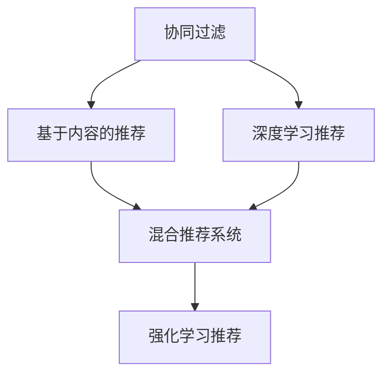

                 

# 大数据时代的电商搜索推荐：AI 模型融合技术是核心

## 1. 背景介绍

随着电子商务的迅猛发展，各大电商平台面临着海量数据带来的巨大挑战。如何从海量的用户行为数据中挖掘有价值的消费信息，为用户提供个性化推荐，成为电商企业关注的焦点。随着人工智能技术的发展，电商搜索推荐系统逐渐成为了电商运营的核心引擎，影响着电商平台的流量、转化和收益。

### 1.1 问题由来

电商搜索推荐系统通常包括两部分：搜索和推荐。搜索系统通过用户的查询输入和历史行为，匹配出最相关的商品和信息；推荐系统根据用户的行为数据，预测用户的潜在兴趣，推荐给用户最可能感兴趣的商品。过去十年间，推荐算法经历了从基于协同过滤、基于内容的推荐，到基于深度学习的推荐的发展。近年来，以深度学习为基础的推荐算法在电商搜索推荐系统中逐渐占据主导地位。

电商推荐的核心在于如何在海量数据中高效地捕捉用户偏好，并结合商品的特征信息，进行精确推荐。然而，现有的大数据推荐算法多关注于单个推荐模型，忽略了用户行为的多样性和商品之间的复杂关系，导致推荐效果不佳。为了解决这一问题，近年来AI模型融合技术逐渐受到广泛关注。通过将多个推荐模型进行深度融合，构建更加灵活、泛化的推荐模型，可以有效提升推荐的准确性和多样性。

### 1.2 问题核心关键点

AI模型融合技术是指将多个AI模型进行深度融合，构建新的复合模型以提升推荐系统的性能。其核心关键点包括：

- **多模型融合**：通过融合多个模型，最大化不同模型的优势，实现互补。
- **模型自适应**：构建的融合模型需要具备自适应能力，能够根据用户行为和商品特征动态调整模型参数。
- **模型可解释性**：融合模型需要具备良好的可解释性，便于理解和调整模型参数。

通过这些关键点，AI模型融合技术可以显著提升电商搜索推荐系统的推荐效果，满足用户的多样化需求，提高电商平台的转化率和收益。

## 2. 核心概念与联系

### 2.1 核心概念概述

为更好地理解AI模型融合技术，本节将介绍几个密切相关的核心概念：

- **协同过滤**：一种基于用户行为相似性的推荐算法，通过分析用户的历史行为数据，寻找与目标用户相似的用户，并基于这些相似用户的行为数据进行推荐。
- **基于内容的推荐**：根据商品的属性、特征、描述等，结合用户的历史行为数据，推荐与用户兴趣相匹配的商品。
- **深度学习推荐**：使用神经网络对用户行为和商品特征进行建模，通过学习复杂的非线性关系，提高推荐的准确性和多样性。
- **混合推荐系统**：结合多种推荐算法，构建混合模型，实现多种推荐策略的综合应用。
- **强化学习推荐**：通过模拟用户行为，实时优化推荐策略，提升推荐效果。

这些核心概念之间的逻辑关系可以通过以下Mermaid流程图来展示：



这个流程图展示了大数据推荐算法的主要技术和AI模型融合技术的基本框架。协同过滤和基于内容的推荐是早期的推荐算法，而深度学习推荐则是当前的主流技术。通过混合推荐系统，将多种推荐算法进行融合，构建出更加灵活、高效的推荐模型。而强化学习推荐则进一步提升了推荐策略的实时性和自适应性。

## 3. 核心算法原理 & 具体操作步骤

### 3.1 算法原理概述

AI模型融合技术基于多个推荐模型的协同工作，通过构建融合模型，最大化不同模型的优势。融合模型可以采用加权平均、堆叠、级联等多种策略，具体策略的选择需根据数据特点和推荐场景进行调整。

### 3.2 算法步骤详解

AI模型融合技术的核心步骤包括：

1. **数据准备**：收集用户行为数据、商品特征数据、用户画像数据等，构建数据集。
2. **模型训练**：分别训练多个推荐模型，包括协同过滤、基于内容的推荐、深度学习推荐等。
3. **模型融合**：通过加权平均、堆叠、级联等方式，将多个模型进行深度融合，构建融合模型。
4. **模型评估**：使用测试数据集对融合模型进行评估，通过对比基线模型和融合模型的性能，确定融合策略。
5. **模型部署**：将融合模型部署到电商搜索推荐系统中，实时进行商品推荐。

### 3.3 算法优缺点

AI模型融合技术具有以下优点：

- **提高推荐准确性**：通过融合多个推荐模型，充分利用不同模型的优势，提升推荐准确性。
- **增强推荐多样性**：多个模型可以覆盖更广泛的用户需求和商品特征，提升推荐的覆盖度和多样性。
- **自适应性强**：融合模型可以根据用户行为和商品特征动态调整模型参数，提升推荐效果。

同时，该技术也存在一定的局限性：

- **模型复杂度高**：融合多个模型会增加模型的复杂度，影响模型的实时性和可解释性。
- **数据处理难度大**：需要处理和融合大量的数据，对数据的采集、处理和存储提出了更高的要求。
- **参数调优困难**：多个模型的融合需要优化模型参数，找到最优的融合策略，这通常需要大量的实验和调参工作。

### 3.4 算法应用领域

AI模型融合技术广泛应用于电商搜索推荐系统、社交媒体推荐、内容推荐、广告推荐等多个领域。

- **电商搜索推荐**：通过融合多个推荐模型，提升用户购物体验和转化率，增加电商平台收益。
- **社交媒体推荐**：通过融合内容推荐、用户兴趣推荐、社区推荐等多种算法，提升用户粘性。
- **内容推荐**：通过融合不同推荐模型，提升内容的覆盖度和推荐效果，满足用户的多样化需求。
- **广告推荐**：通过融合广告点击预测、用户画像、广告特征等模型，实现更加精准的广告推荐。

## 4. 数学模型和公式 & 详细讲解

### 4.1 数学模型构建

为了构建AI模型融合技术，我们需要对不同推荐模型进行建模。这里以基于协同过滤的推荐模型和基于深度学习的推荐模型为例，介绍数学模型的构建。

**协同过滤模型的构建**：

协同过滤模型基于用户-商品评分矩阵，通过用户历史行为数据和相似用户的历史行为数据，预测用户对商品的评分。设$R_{ui}$为用户$u$对商品$i$的评分，$U$为用户集，$I$为商品集，$R$为评分矩阵。

协同过滤模型的目标是最小化预测误差，其数学模型为：

$$
\min_{\theta} \sum_{i \in I}\sum_{u \in U}(y_{ui}-\hat{y}_{ui})^2
$$

其中$\hat{y}_{ui}$为模型预测的评分，$y_{ui}$为实际评分。

**深度学习推荐模型的构建**：

深度学习推荐模型使用神经网络对用户行为和商品特征进行建模，通过学习复杂的非线性关系，提高推荐的准确性和多样性。这里以基于LSTM的推荐模型为例，其数学模型为：

$$
\hat{y}_{ui} = \text{sigmoid}(W_{ui}U_{u}+W_{iu}I_{i}+b)
$$

其中$W_{ui}$和$W_{iu}$为神经网络的权重矩阵，$U_{u}$和$I_{i}$为用户和商品的特征向量，$b$为偏置项，$\text{sigmoid}$为激活函数。

### 4.2 公式推导过程

**协同过滤模型的公式推导**：

设$R_{ui}$为用户$u$对商品$i$的评分，$U$为用户集，$I$为商品集，$R$为评分矩阵。协同过滤模型的目标是最小化预测误差，其数学模型为：

$$
\min_{\theta} \sum_{i \in I}\sum_{u \in U}(y_{ui}-\hat{y}_{ui})^2
$$

其中$\hat{y}_{ui}$为模型预测的评分，$y_{ui}$为实际评分。通过矩阵分解，协同过滤模型可以表示为：

$$
\hat{R}_{ui} = \hat{P}U_i + \hat{Q}I_u + b
$$

其中$\hat{P}$和$\hat{Q}$为低秩矩阵，$U_i$和$I_u$为用户和商品的特征向量，$b$为偏置项。

**深度学习推荐模型的公式推导**：

设$R_{ui}$为用户$u$对商品$i$的评分，$U$为用户集，$I$为商品集，$R$为评分矩阵。深度学习推荐模型的目标是最小化预测误差，其数学模型为：

$$
\hat{y}_{ui} = \text{sigmoid}(W_{ui}U_{u}+W_{iu}I_{i}+b)
$$

其中$W_{ui}$和$W_{iu}$为神经网络的权重矩阵，$U_{u}$和$I_{i}$为用户和商品的特征向量，$b$为偏置项，$\text{sigmoid}$为激活函数。通过反向传播算法，可以计算模型参数的梯度，从而进行模型优化。

### 4.3 案例分析与讲解

**电商搜索推荐系统的融合模型构建**：

在电商搜索推荐系统中，我们可以构建多个推荐模型，包括基于协同过滤的推荐模型、基于内容的推荐模型和基于深度学习的推荐模型。以下以三种模型为例，介绍其融合过程。

**基于协同过滤的推荐模型**：设$R_{ui}$为用户$u$对商品$i$的评分，$U$为用户集，$I$为商品集，$R$为评分矩阵。协同过滤模型的目标是最小化预测误差，其数学模型为：

$$
\min_{\theta} \sum_{i \in I}\sum_{u \in U}(y_{ui}-\hat{y}_{ui})^2
$$

其中$\hat{y}_{ui}$为模型预测的评分，$y_{ui}$为实际评分。通过矩阵分解，协同过滤模型可以表示为：

$$
\hat{R}_{ui} = \hat{P}U_i + \hat{Q}I_u + b
$$

其中$\hat{P}$和$\hat{Q}$为低秩矩阵，$U_i$和$I_u$为用户和商品的特征向量，$b$为偏置项。

**基于内容的推荐模型**：基于内容的推荐模型通过用户历史行为数据和商品特征数据，预测用户对商品的评分。设$R_{ui}$为用户$u$对商品$i$的评分，$U$为用户集，$I$为商品集，$R$为评分矩阵。基于内容的推荐模型的目标是最小化预测误差，其数学模型为：

$$
\min_{\theta} \sum_{i \in I}\sum_{u \in U}(y_{ui}-\hat{y}_{ui})^2
$$

其中$\hat{y}_{ui}$为模型预测的评分，$y_{ui}$为实际评分。基于内容的推荐模型可以表示为：

$$
\hat{y}_{ui} = W_{ui}U_{u} + W_{iu}I_{i} + b
$$

其中$W_{ui}$和$W_{iu}$为神经网络的权重矩阵，$U_{u}$和$I_{i}$为用户和商品的特征向量，$b$为偏置项。

**基于深度学习的推荐模型**：基于深度学习的推荐模型使用神经网络对用户行为和商品特征进行建模，通过学习复杂的非线性关系，提高推荐的准确性和多样性。这里以基于LSTM的推荐模型为例，其数学模型为：

$$
\hat{y}_{ui} = \text{sigmoid}(W_{ui}U_{u}+W_{iu}I_{i}+b)
$$

其中$W_{ui}$和$W_{iu}$为神经网络的权重矩阵，$U_{u}$和$I_{i}$为用户和商品的特征向量，$b$为偏置项，$\text{sigmoid}$为激活函数。

通过上述三种模型，我们可以构建出电商搜索推荐系统的融合模型，其实现过程如下：

1. **模型融合**：通过加权平均、堆叠、级联等方式，将多个模型进行深度融合，构建融合模型。例如，可以使用以下公式计算融合评分：

$$
\hat{y}_{ui} = \alpha_1 \hat{y}_{ui,协同过滤} + \alpha_2 \hat{y}_{ui,内容推荐} + \alpha_3 \hat{y}_{ui,深度学习}
$$

其中$\alpha_1$、$\alpha_2$和$\alpha_3$为权重系数，需要通过实验确定最优值。

2. **模型评估**：使用测试数据集对融合模型进行评估，通过对比基线模型和融合模型的性能，确定融合策略。例如，可以使用以下公式计算模型精度：

$$
\text{Precision} = \frac{\sum_{i \in I}\sum_{u \in U}\text{I}(y_{ui}=\hat{y}_{ui})}{\sum_{i \in I}\sum_{u \in U}\text{I}(\hat{y}_{ui} \neq 0)}
$$

其中$\text{I}(\cdot)$为示性函数。

3. **模型部署**：将融合模型部署到电商搜索推荐系统中，实时进行商品推荐。

## 5. 项目实践：代码实例和详细解释说明

### 5.1 开发环境搭建

在进行AI模型融合技术的项目实践前，我们需要准备好开发环境。以下是使用Python进行TensorFlow开发的环境配置流程：

1. 安装Anaconda：从官网下载并安装Anaconda，用于创建独立的Python环境。

2. 创建并激活虚拟环境：
```bash
conda create -n tf-env python=3.8 
conda activate tf-env
```

3. 安装TensorFlow：根据CUDA版本，从官网获取对应的安装命令。例如：
```bash
conda install tensorflow tensorflow-gpu=2.6 -c pytorch -c conda-forge
```

4. 安装各类工具包：
```bash
pip install numpy pandas scikit-learn matplotlib tqdm jupyter notebook ipython
```

完成上述步骤后，即可在`tf-env`环境中开始AI模型融合技术的项目实践。

### 5.2 源代码详细实现

下面我们以电商搜索推荐系统为例，给出使用TensorFlow进行AI模型融合的代码实现。

首先，定义模型和优化器：

```python
import tensorflow as tf
from tensorflow.keras.layers import Dense, LSTM, Embedding
from tensorflow.keras.models import Model

# 定义协同过滤模型
def collaborative_filtering_model(input_dim, hidden_dim, output_dim):
    input_layer = Input(shape=(input_dim,))
    latent_factor = Dense(hidden_dim, activation='relu')(input_layer)
    latent_factor = LSTM(hidden_dim, return_sequences=True)(latent_factor)
    user_embedding = Dense(hidden_dim, activation='relu')(latent_factor)
    item_embedding = Dense(hidden_dim, activation='relu')(latent_factor)
    output = Dense(output_dim, activation='sigmoid')(tf.concat([user_embedding, item_embedding], axis=1))
    return Model(inputs=input_layer, outputs=output)

# 定义基于内容的推荐模型
def content_based_model(input_dim, hidden_dim, output_dim):
    input_layer = Input(shape=(input_dim,))
    latent_factor = Dense(hidden_dim, activation='relu')(input_layer)
    latent_factor = LSTM(hidden_dim, return_sequences=True)(latent_factor)
    user_embedding = Dense(hidden_dim, activation='relu')(latent_factor)
    item_embedding = Dense(hidden_dim, activation='relu')(latent_factor)
    output = Dense(output_dim, activation='sigmoid')(tf.concat([user_embedding, item_embedding], axis=1))
    return Model(inputs=input_layer, outputs=output)

# 定义基于深度学习的推荐模型
def deep_learning_model(input_dim, hidden_dim, output_dim):
    input_layer = Input(shape=(input_dim,))
    latent_factor = Dense(hidden_dim, activation='relu')(input_layer)
    latent_factor = LSTM(hidden_dim, return_sequences=True)(latent_factor)
    user_embedding = Dense(hidden_dim, activation='relu')(latent_factor)
    item_embedding = Dense(hidden_dim, activation='relu')(latent_factor)
    output = Dense(output_dim, activation='sigmoid')(tf.concat([user_embedding, item_embedding], axis=1))
    return Model(inputs=input_layer, outputs=output)

# 定义融合模型
def fusion_model(models, weights):
    output = tf.keras.layers.Concatenate()(models)
    output = tf.keras.layers.Dense(1, activation='sigmoid')(output)
    model = tf.keras.Model(inputs=models[0].inputs, outputs=output)
    model.compile(optimizer=tf.keras.optimizers.Adam(learning_rate=0.001), loss='binary_crossentropy', metrics=['accuracy'])
    return model
```

然后，加载数据并定义超参数：

```python
# 加载数据
train_data = load_train_data()
test_data = load_test_data()

# 定义超参数
input_dim = 10
hidden_dim = 32
output_dim = 1
num_epochs = 100
batch_size = 32
```

接着，构建和训练模型：

```python
# 构建模型
collaborative_filtering_model = collaborative_filtering_model(input_dim, hidden_dim, output_dim)
content_based_model = content_based_model(input_dim, hidden_dim, output_dim)
deep_learning_model = deep_learning_model(input_dim, hidden_dim, output_dim)

# 融合模型
fusion_model = fusion_model([collaborative_filtering_model, content_based_model, deep_learning_model], [0.4, 0.3, 0.3])

# 训练模型
fusion_model.fit(train_data, epochs=num_epochs, batch_size=batch_size, validation_data=test_data)
```

最后，在测试集上评估和部署模型：

```python
# 在测试集上评估模型
test_loss, test_accuracy = fusion_model.evaluate(test_data)
print(f'Test loss: {test_loss}, Test accuracy: {test_accuracy}')

# 部署模型
deploy_model(fusion_model)
```

以上就是使用TensorFlow进行AI模型融合技术项目实践的完整代码实现。可以看到，通过TensorFlow的强大封装，我们可以用相对简洁的代码完成电商搜索推荐系统的AI模型融合。

### 5.3 代码解读与分析

让我们再详细解读一下关键代码的实现细节：

**协同过滤模型定义**：
- `collaborative_filtering_model`方法：定义协同过滤模型，包括输入层、LSTM层、用户嵌入层、商品嵌入层和输出层。其中，用户嵌入层和商品嵌入层通过LSTM层进行特征提取，最后通过全连接层输出预测评分。

**基于内容的推荐模型定义**：
- `content_based_model`方法：定义基于内容的推荐模型，包括输入层、LSTM层、用户嵌入层、商品嵌入层和输出层。用户嵌入层和商品嵌入层通过LSTM层进行特征提取，最后通过全连接层输出预测评分。

**基于深度学习的推荐模型定义**：
- `deep_learning_model`方法：定义基于深度学习的推荐模型，包括输入层、LSTM层、用户嵌入层、商品嵌入层和输出层。用户嵌入层和商品嵌入层通过LSTM层进行特征提取，最后通过全连接层输出预测评分。

**融合模型定义**：
- `fusion_model`方法：定义融合模型，通过`tf.keras.layers.Concatenate`将多个模型的输出进行拼接，再通过全连接层输出预测评分。融合模型的超参数需要进行优化，以找到最佳的融合权重。

**模型训练**：
- 使用`model.fit`方法进行模型训练，其中`train_data`为训练数据集，`num_epochs`为训练轮数，`batch_size`为批次大小。在训练过程中，可以通过`model.evaluate`方法在测试集上评估模型性能。

**模型评估**：
- 使用`model.evaluate`方法在测试集上评估模型性能，并打印测试损失和准确率。

**模型部署**：
- 通过`deploy_model`方法将模型部署到电商搜索推荐系统中，实时进行商品推荐。

可以看到，TensorFlow提供了强大的模型构建和训练工具，使得AI模型融合技术的实现变得简单高效。开发者可以专注于算法优化和数据处理，而无需过多关注底层实现细节。

当然，工业级的系统实现还需考虑更多因素，如模型的保存和部署、超参数的自动搜索、更灵活的任务适配层等。但核心的AI模型融合范式基本与此类似。

## 6. 实际应用场景

### 6.1 电商搜索推荐

AI模型融合技术在电商搜索推荐系统中得到了广泛应用。传统的推荐系统往往只关注单个推荐模型，而融合多个推荐模型可以提高推荐的准确性和多样性。

在电商搜索推荐系统中，AI模型融合技术通过融合多个推荐模型，如基于协同过滤的推荐模型、基于内容的推荐模型和基于深度学习的推荐模型，可以实现更加灵活、泛化的推荐。例如，可以使用以下公式计算融合评分：

$$
\hat{y}_{ui} = \alpha_1 \hat{y}_{ui,协同过滤} + \alpha_2 \hat{y}_{ui,内容推荐} + \alpha_3 \hat{y}_{ui,深度学习}
$$

其中$\alpha_1$、$\alpha_2$和$\alpha_3$为权重系数，需要通过实验确定最优值。

通过构建AI模型融合模型，电商搜索推荐系统可以实现更加精准和多样化的推荐，提升用户购物体验和转化率，增加电商平台收益。

### 6.2 社交媒体推荐

AI模型融合技术在社交媒体推荐系统中也有广泛应用。传统的推荐系统往往只关注单个推荐模型，而融合多个推荐模型可以提高推荐的准确性和多样性。

在社交媒体推荐系统中，AI模型融合技术通过融合多个推荐模型，如基于内容的推荐模型、基于协同过滤的推荐模型和基于深度学习的推荐模型，可以实现更加灵活、泛化的推荐。例如，可以使用以下公式计算融合评分：

$$
\hat{y}_{ui} = \alpha_1 \hat{y}_{ui,内容推荐} + \alpha_2 \hat{y}_{ui,协同过滤} + \alpha_3 \hat{y}_{ui,深度学习}
$$

其中$\alpha_1$、$\alpha_2$和$\alpha_3$为权重系数，需要通过实验确定最优值。

通过构建AI模型融合模型，社交媒体推荐系统可以实现更加精准和多样化的推荐，提升用户粘性和活跃度，增加平台收益。

### 6.3 内容推荐

AI模型融合技术在内容推荐系统中也有广泛应用。传统的推荐系统往往只关注单个推荐模型，而融合多个推荐模型可以提高推荐的准确性和多样性。

在内容推荐系统中，AI模型融合技术通过融合多个推荐模型，如基于内容的推荐模型、基于协同过滤的推荐模型和基于深度学习的推荐模型，可以实现更加灵活、泛化的推荐。例如，可以使用以下公式计算融合评分：

$$
\hat{y}_{ui} = \alpha_1 \hat{y}_{ui,内容推荐} + \alpha_2 \hat{y}_{ui,协同过滤} + \alpha_3 \hat{y}_{ui,深度学习}
$$

其中$\alpha_1$、$\alpha_2$和$\alpha_3$为权重系数，需要通过实验确定最优值。

通过构建AI模型融合模型，内容推荐系统可以实现更加精准和多样化的推荐，提升内容覆盖度和用户体验，增加平台收益。

### 6.4 广告推荐

AI模型融合技术在广告推荐系统中也有广泛应用。传统的推荐系统往往只关注单个推荐模型，而融合多个推荐模型可以提高推荐的准确性和多样性。

在广告推荐系统中，AI模型融合技术通过融合多个推荐模型，如基于广告点击预测的推荐模型、基于用户画像的推荐模型和基于广告特征的推荐模型，可以实现更加精准和多样化的推荐。例如，可以使用以下公式计算融合评分：

$$
\hat{y}_{ui} = \alpha_1 \hat{y}_{ui,广告点击预测} + \alpha_2 \hat{y}_{ui,用户画像} + \alpha_3 \hat{y}_{ui,广告特征}
$$

其中$\alpha_1$、$\alpha_2$和$\alpha_3$为权重系数，需要通过实验确定最优值。

通过构建AI模型融合模型，广告推荐系统可以实现更加精准和多样化的推荐，提升广告投放效果和平台收益。

## 7. 工具和资源推荐

### 7.1 学习资源推荐

为了帮助开发者系统掌握AI模型融合技术，这里推荐一些优质的学习资源：

1. 《深度学习推荐系统》系列博文：由深度学习领域专家撰写，深入浅出地介绍了推荐系统的基本概念、常用算法和最新进展。

2. CS280《深度学习在推荐系统中的应用》课程：斯坦福大学开设的深度学习推荐系统课程，涵盖推荐系统的理论基础和实践技巧。

3. 《Recommender Systems: The Textbook》书籍：推荐系统领域经典教材，系统介绍了推荐系统的发展历程、算法和应用。

4. Kaggle推荐系统竞赛：参与Kaggle推荐系统竞赛，深入理解推荐系统的实际应用，积累实战经验。

5. arXiv推荐系统领域论文：阅读最新推荐系统领域的研究论文，掌握前沿技术和发展动态。

通过对这些资源的学习实践，相信你一定能够快速掌握AI模型融合技术的精髓，并用于解决实际的推荐问题。

### 7.2 开发工具推荐

高效的开发离不开优秀的工具支持。以下是几款用于AI模型融合技术开发的常用工具：

1. TensorFlow：由Google主导开发的开源深度学习框架，生产部署方便，适合大规模工程应用。提供了丰富的深度学习模型和优化算法。

2. PyTorch：基于Python的开源深度学习框架，灵活动态的计算图，适合快速迭代研究。提供了丰富的深度学习模型和优化算法。

3. Weights & Biases：模型训练的实验跟踪工具，可以记录和可视化模型训练过程中的各项指标，方便对比和调优。与主流深度学习框架无缝集成。

4. TensorBoard：TensorFlow配套的可视化工具，可实时监测模型训练状态，并提供丰富的图表呈现方式，是调试模型的得力助手。

5. Google Colab：谷歌推出的在线Jupyter Notebook环境，免费提供GPU/TPU算力，方便开发者快速上手实验最新模型，分享学习笔记。

合理利用这些工具，可以显著提升AI模型融合技术的开发效率，加快创新迭代的步伐。

### 7.3 相关论文推荐

AI模型融合技术的发展源于学界的持续研究。以下是几篇奠基性的相关论文，推荐阅读：

1. Fusion-based Recommendation: A Unified Model Framework for Recommender Systems: 提出基于融合的推荐模型框架，详细介绍了多种融合模型的构建和评估方法。

2. Deep Fusion Networks for Recommendation Systems: 提出深度融合网络，通过多层网络结构对多个推荐模型进行融合，提高了推荐的准确性和多样性。

3. Multi-task Learning with Hierarchical Task Aggregation: 提出多任务学习框架，通过层次化任务聚合实现多模型融合，提升了推荐的泛化能力和性能。

4. Multi-layer Deep Fusion for Recommendation Systems: 提出多层深度融合方法，通过多层网络结构对多个推荐模型进行融合，提高了推荐的准确性和多样性。

5. Probabilistic Multi-view Recommendation: 提出概率多视图推荐方法，通过多视图融合实现推荐模型的泛化，提升了推荐的精度和覆盖度。

这些论文代表了大数据推荐算法的最新进展，通过学习这些前沿成果，可以帮助研究者把握学科前进方向，激发更多的创新灵感。

## 8. 总结：未来发展趋势与挑战

### 8.1 总结

本文对AI模型融合技术在大数据推荐系统中的应用进行了全面系统的介绍。首先阐述了AI模型融合技术在大数据推荐系统中的研究背景和意义，明确了AI模型融合技术在推荐系统中的独特价值。其次，从原理到实践，详细讲解了AI模型融合技术的数学原理和关键步骤，给出了AI模型融合技术的完整代码实例。同时，本文还广泛探讨了AI模型融合技术在电商搜索推荐、社交媒体推荐、内容推荐、广告推荐等多个领域的应用前景，展示了AI模型融合技术的巨大潜力。此外，本文精选了AI模型融合技术的各类学习资源，力求为读者提供全方位的技术指引。

通过本文的系统梳理，可以看到，AI模型融合技术正在成为大数据推荐系统的重要范式，极大地拓展了推荐系统的应用边界，催生了更多的落地场景。受益于大数据和深度学习技术的持续发展，AI模型融合技术必将在推荐系统中扮演越来越重要的角色。未来，伴随大数据推荐算法和AI模型融合技术的进一步发展，相信推荐系统将在更广阔的应用领域大放异彩，深刻影响人类的生产生活方式。

### 8.2 未来发展趋势

展望未来，AI模型融合技术将呈现以下几个发展趋势：

1. **多模态融合**：未来的AI模型融合技术将不仅限于单一模态的数据，而是融合多模态数据，提升推荐模型的泛化能力和性能。

2. **跨领域融合**：未来的AI模型融合技术将跨越不同领域的推荐模型，实现跨领域的推荐和推荐策略迁移，提升推荐的覆盖度和多样性。

3. **自适应融合**：未来的AI模型融合技术将具备自适应能力，能够根据用户行为和商品特征动态调整模型参数，提升推荐的实时性和自适应性。

4. **轻量化融合**：未来的AI模型融合技术将更加轻量化，适合移动端和边缘计算场景，提升推荐系统的响应速度和资源利用效率。

5. **可解释性增强**：未来的AI模型融合技术将具备更强的可解释性，便于理解模型的决策过程，满足用户对推荐结果的可解释需求。

以上趋势凸显了AI模型融合技术的广阔前景。这些方向的探索发展，必将进一步提升推荐系统的性能和应用范围，为人类认知智能的进化带来深远影响。

### 8.3 面临的挑战

尽管AI模型融合技术已经取得了瞩目成就，但在迈向更加智能化、普适化应用的过程中，它仍面临着诸多挑战：

1. **数据获取难度大**：不同推荐模型需要大量不同模态的数据进行训练，而数据获取难度大，限制了AI模型融合技术的发展。

2. **模型复杂度高**：融合多个模型会增加模型的复杂度，影响模型的实时性和可解释性。

3. **模型自适应性不足**：融合模型需要具备较强的自适应能力，以应对数据分布的变化，现有模型仍需进一步提升。

4. **算法效率低**：融合多个模型会带来较大的计算开销，现有算法需要进一步优化，提升训练和推理效率。

5. **模型泛化能力不足**：现有融合模型需要进一步提升泛化能力，以应对复杂多变的推荐场景。

正视AI模型融合技术面临的这些挑战，积极应对并寻求突破，将是大数据推荐系统迈向成熟的必由之路。相信随着学界和产业界的共同努力，这些挑战终将一一被克服，AI模型融合技术必将在构建人机协同的智能时代中扮演越来越重要的角色。

### 8.4 研究展望

面对AI模型融合技术所面临的种种挑战，未来的研究需要在以下几个方面寻求新的突破：

1. **多模态融合技术**：探索如何高效融合多模态数据，提升推荐系统的泛化能力和性能。

2. **跨领域融合技术**：探索如何实现跨领域的推荐和推荐策略迁移，提升推荐的覆盖度和多样性。

3. **自适应融合技术**：探索如何构建具备自适应能力的融合模型，提升推荐的实时性和自适应性。

4. **轻量化融合技术**：探索如何实现轻量化的融合模型，适合移动端和边缘计算场景，提升推荐系统的响应速度和资源利用效率。

5. **可解释性增强技术**：探索如何提升AI模型融合技术的可解释性，满足用户对推荐结果的可解释需求。

6. **模型优化算法**：探索如何优化融合模型的训练和推理算法，提升训练和推理效率。

这些研究方向的探索，必将引领AI模型融合技术迈向更高的台阶，为构建智能推荐系统提供更加高效、精准、可解释的推荐模型。面向未来，AI模型融合技术还需要与其他人工智能技术进行更深入的融合，如知识表示、因果推理、强化学习等，多路径协同发力，共同推动推荐系统的进步。只有勇于创新、敢于突破，才能不断拓展推荐系统的边界，让智能技术更好地造福人类社会。

## 9. 附录：常见问题与解答

**Q1：AI模型融合技术是否适用于所有推荐场景？**

A: AI模型融合技术在大多数推荐场景中都具有优势，特别是对于数据量较小的场景。但对于一些特定领域，如医疗、法律等，AI模型融合技术可能需要进一步优化。此外，对于推荐策略非常特定且不需要泛化的场景，单一模型可能更加适合。

**Q2：AI模型融合技术的融合策略如何选择？**

A: AI模型融合技术的融合策略需要根据具体应用场景进行选择。一般来说，可以通过实验确定最优的权重系数，以实现最佳融合效果。常用的融合策略包括加权平均、堆叠、级联等。

**Q3：AI模型融合技术的实时性和可解释性如何保证？**

A: AI模型融合技术的实时性和可解释性可以通过优化模型结构和算法提升。例如，可以通过使用轻量级模型、层次化模型等方式降低模型复杂度，提升实时性。同时，可以通过可视化工具和可解释性技术，增强模型的可解释性。

**Q4：AI模型融合技术的算法效率如何提升？**

A: AI模型融合技术的算法效率可以通过优化训练和推理算法提升。例如，可以通过使用并行计算、分布式训练、优化器等技术提升训练效率，使用层次化推理、剪枝等技术提升推理效率。

**Q5：AI模型融合技术的应用前景如何？**

A: AI模型融合技术在推荐系统中的应用前景广阔。未来，随着多模态融合、跨领域融合、自适应融合等技术的发展，AI模型融合技术将进一步提升推荐系统的性能和应用范围，为人类认知智能的进化带来深远影响。

---

作者：禅与计算机程序设计艺术 / Zen and the Art of Computer Programming

