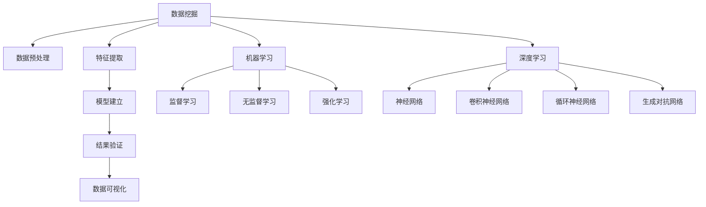

                 

# 大数据时代的知识发现：机遇与挑战

> 关键词：大数据,知识发现,数据挖掘,机器学习,深度学习,数据可视化

## 1. 背景介绍

### 1.1 问题由来
随着信息技术的高速发展，数据已经成为了当今时代最重要的资源之一。各行各业都产生了海量数据，其中蕴含着大量有价值的信息。这些信息既可以转化为知识，为人类提供决策支持，也可以反过来推动技术的进步。但是，由于数据量大、结构复杂、来源广泛，如何从中挖掘出有价值的知识，成为了一个极具挑战性的问题。

数据科学和大数据技术的发展，为解决这一问题提供了新的思路和方法。数据科学通过分析数据，发现数据背后的规律，构建知识模型，为决策提供支撑；大数据技术则提供了处理、存储和分析海量数据的能力，使得数据的价值得以充分释放。

### 1.2 问题核心关键点
大数据时代，知识发现的核心在于如何高效、准确地从大规模数据中挖掘出有价值的信息。这一过程可以分为数据清洗、特征提取、模型建立、结果验证等多个环节。其中，数据清洗是基础，特征提取是关键，模型建立是核心，结果验证是保障。

当前，知识发现的主要技术手段包括数据挖掘、机器学习、深度学习、自然语言处理、计算机视觉等。这些技术手段在各自领域的应用已经较为成熟，但如何将它们进行有效融合，形成系统的知识发现体系，仍是一个需要解决的问题。

### 1.3 问题研究意义
研究大数据时代的知识发现方法，对于推动数据科学的发展，促进知识创新，加速产业升级，具有重要意义：

1. 数据驱动决策。通过大数据分析，企业可以更精准地进行市场预测、客户分析、产品研发，提高决策的科学性和效率。
2. 知识自动化构建。将知识发现过程自动化，可以大幅减少人工干预，提高知识构建的效率和质量。
3. 技术落地应用。知识发现技术为传统行业提供了新的技术手段，推动了数字化转型的进程，提升了产业竞争力。
4. 创新驱动发展。知识发现技术促进了跨学科、跨领域的研究，推动了创新思维和创新方法的产生。

## 2. 核心概念与联系

### 2.1 核心概念概述

为了更好地理解大数据时代的知识发现方法，本节将介绍几个密切相关的核心概念：

- 数据挖掘(Data Mining)：从大规模数据中发现规律、构建知识模型的过程。数据挖掘包括数据预处理、特征提取、模型建立、结果验证等多个步骤。

- 机器学习(Machine Learning)：通过数据分析，建立模型，使计算机能够自主学习和改进的过程。机器学习主要分为监督学习、无监督学习、强化学习等不同类型。

- 深度学习(Deep Learning)：基于神经网络的机器学习技术，通过多层非线性映射，实现对复杂模式的学习和识别。深度学习在图像识别、语音识别等领域取得了显著成果。

- 数据可视化(Data Visualization)：通过图表、地图、动画等形式，将数据可视化，使数据更加直观、易于理解。数据可视化是知识发现的重要工具，可以帮助分析师快速发现数据中的规律和异常。

- 自然语言处理(Natural Language Processing, NLP)：研究计算机如何理解和处理人类语言的技术，包括分词、词性标注、命名实体识别、情感分析、机器翻译等。NLP技术在文本挖掘、智能客服、信息检索等领域有广泛应用。

- 计算机视觉(Computer Vision)：研究计算机如何通过图像、视频等视觉信息识别、理解世界。计算机视觉技术在图像识别、物体检测、人脸识别等领域取得了突破性进展。

这些核心概念之间的逻辑关系可以通过以下Mermaid流程图来展示：



这个流程图展示了大数据时代知识发现的各个环节及其之间的联系：

1. 数据挖掘是整个过程的基础，包括数据预处理、特征提取等。
2. 模型建立是核心，使用机器学习和深度学习等技术手段，建立知识模型。
3. 结果验证是保障，通过数据可视化等手段，验证模型效果。
4. 数据可视化是辅助工具，帮助分析师更好地理解和分析数据。

这些概念共同构成了大数据时代知识发现的框架，使其能够高效、准确地从大规模数据中挖掘出有价值的信息。

## 3. 核心算法原理 & 具体操作步骤
### 3.1 算法原理概述

大数据时代的知识发现，本质上是一个数据驱动的建模过程。其核心思想是：通过数据挖掘和机器学习技术，从大规模数据中发现规律和模式，构建知识模型，用于指导决策和预测。

形式化地，假设我们有一组大规模数据集 $D$，其中 $D=\{(x_i,y_i)\}_{i=1}^N$，$x_i$ 为输入特征，$y_i$ 为输出标签。知识发现的目标是通过训练一个模型 $f$，使得 $f$ 能够从输入 $x$ 中预测出输出 $y$。

假设 $f$ 是一个线性回归模型，则模型形式可以表示为：

$$
f(x) = \theta_0 + \sum_{i=1}^n \theta_i x_i
$$

其中 $\theta_0,\theta_1,\cdots,\theta_n$ 为模型参数。知识发现的过程包括：

1. 数据预处理：清洗、转换和归一化数据。
2. 特征提取：选择和提取数据中的关键特征。
3. 模型训练：使用监督学习或无监督学习等方法，训练模型参数。
4. 结果验证：通过交叉验证等方法，评估模型的泛化能力和准确性。

### 3.2 算法步骤详解

大数据时代的知识发现通常包括以下关键步骤：

**Step 1: 数据预处理**
- 数据清洗：去除噪声、缺失值和异常值，确保数据质量。
- 数据转换：将数据转换为标准格式，便于后续处理。
- 数据归一化：对数据进行归一化处理，避免不同特征之间的数值差异对模型训练产生影响。

**Step 2: 特征提取**
- 特征选择：选择与目标变量相关的关键特征，减少计算量。
- 特征提取：通过主成分分析(PCA)、独立成分分析(ICA)等技术，提取数据中的关键特征。
- 特征变换：通过降维技术(如LDA、SVD)，将高维数据降维至低维空间。

**Step 3: 模型建立**
- 模型选择：根据任务需求选择合适的模型，如线性回归、决策树、支持向量机、神经网络等。
- 模型训练：使用训练集对模型进行训练，调整模型参数。
- 模型评估：使用测试集对模型进行评估，验证模型泛化能力。

**Step 4: 结果验证**
- 交叉验证：将数据集划分为训练集和验证集，通过交叉验证评估模型性能。
- 数据可视化：使用图表、地图等形式，将模型预测结果可视化，帮助分析师发现数据中的规律和异常。

**Step 5: 部署与应用**
- 模型部署：将训练好的模型部署到生产环境，实现自动化预测和决策。
- 实时监测：实时监测模型预测结果，及时发现和修正模型错误。

以上是知识发现的一般流程。在实际应用中，还需要针对具体任务的特点，对各个环节进行优化设计，如改进特征选择算法，引入更多正则化技术，搜索最优的超参数组合等，以进一步提升模型性能。

### 3.3 算法优缺点

大数据时代的知识发现方法具有以下优点：
1. 高效性：大规模数据集提供了丰富的训练样本，可以有效降低过拟合风险。
2. 准确性：通过模型训练和评估，可以构建高精度的知识模型。
3. 可解释性：许多机器学习算法具有可解释性，便于分析师理解模型结果。
4. 灵活性：可以根据任务需求，选择不同的算法和模型，灵活应对复杂场景。

同时，该方法也存在一定的局限性：
1. 数据质量依赖：模型性能高度依赖数据质量，数据清洗和预处理工作量较大。
2. 计算资源需求：大规模数据集和复杂模型需要大量计算资源，可能面临算力瓶颈。
3. 模型复杂性：复杂的模型容易过拟合，需要适当的正则化技术和数据增强手段。
4. 结果解释性：一些深度学习模型难以解释其内部决策逻辑，存在“黑盒”问题。

尽管存在这些局限性，但就目前而言，大数据时代的知识发现方法仍然是数据科学领域的主流范式。未来相关研究的重点在于如何进一步降低数据处理和模型训练的复杂度，提高模型解释性和鲁棒性，同时兼顾高效性和准确性。

### 3.4 算法应用领域

大数据时代的知识发现方法在各个领域都有广泛的应用，例如：

- 金融风控：通过对客户交易数据的分析，构建风险预测模型，及时发现和防范金融风险。
- 医疗诊断：利用患者病历数据，构建疾病诊断模型，辅助医生进行病情预测和诊疗决策。
- 市场营销：通过分析消费者行为数据，构建市场预测模型，指导营销策略的制定。
- 零售推荐：利用用户购买数据，构建推荐模型，提升零售商的商品推荐效果。
- 交通管理：通过分析交通流量数据，构建交通预测模型，优化交通管理策略。

除了上述这些经典应用外，大数据时代的知识发现技术还在更多场景中得到应用，如智能制造、环境保护、城市规划等，为各个行业带来了新的发展机遇。

## 4. 数学模型和公式 & 详细讲解  
### 4.1 数学模型构建

本节将使用数学语言对大数据时代的知识发现方法进行更加严格的刻画。

假设我们有一组大规模数据集 $D=\{(x_i,y_i)\}_{i=1}^N$，其中 $x_i \in \mathcal{X}$，$y_i \in \mathcal{Y}$。

定义模型 $f: \mathcal{X} \rightarrow \mathcal{Y}$，其中 $\mathcal{X}$ 为输入空间，$\mathcal{Y}$ 为输出空间。知识发现的目标是最小化模型误差，即：

$$
\min_{f} \frac{1}{N} \sum_{i=1}^N (y_i - f(x_i))^2
$$

通过最小化上述目标函数，可以找到最优模型 $f^*$。

在实际应用中，我们通常使用机器学习和深度学习算法来求解上述优化问题。例如，使用线性回归模型，可以得到以下公式：

$$
f(x) = \theta_0 + \sum_{i=1}^n \theta_i x_i
$$

其中 $\theta_0,\theta_1,\cdots,\theta_n$ 为模型参数。

### 4.2 公式推导过程

以下我们以线性回归模型为例，推导最小二乘法的损失函数及其梯度计算公式。

假设 $f(x) = \theta_0 + \sum_{i=1}^n \theta_i x_i$，则模型预测结果与真实标签之间的误差为：

$$
\delta_i = y_i - f(x_i) = y_i - (\theta_0 + \sum_{i=1}^n \theta_i x_i)
$$

定义均方误差损失函数 $\ell(y,f(x))$：

$$
\ell(y,f(x)) = \frac{1}{N} \sum_{i=1}^N (\delta_i)^2 = \frac{1}{N} \sum_{i=1}^N (y_i - (\theta_0 + \sum_{i=1}^n \theta_i x_i))^2
$$

对损失函数求偏导，得到参数 $\theta_0,\theta_1,\cdots,\theta_n$ 的梯度：

$$
\frac{\partial \ell}{\partial \theta_0} = \frac{2}{N} \sum_{i=1}^N (\delta_i)
$$
$$
\frac{\partial \ell}{\partial \theta_i} = \frac{2}{N} \sum_{i=1}^N (\delta_i x_i)
$$

根据梯度下降算法，更新模型参数：

$$
\theta_0 \leftarrow \theta_0 - \eta \frac{2}{N} \sum_{i=1}^N (\delta_i)
$$
$$
\theta_i \leftarrow \theta_i - \eta \frac{2}{N} \sum_{i=1}^N (\delta_i x_i)
$$

其中 $\eta$ 为学习率，用于控制模型参数的更新步长。

在得到参数梯度后，即可带入参数更新公式，完成模型的迭代优化。重复上述过程直至收敛，最终得到适应数据集的最优模型参数 $\theta^*$。

## 5. 项目实践：代码实例和详细解释说明
### 5.1 开发环境搭建

在进行知识发现实践前，我们需要准备好开发环境。以下是使用Python进行Scikit-learn开发的环境配置流程：

1. 安装Anaconda：从官网下载并安装Anaconda，用于创建独立的Python环境。

2. 创建并激活虚拟环境：
```bash
conda create -n sklearn-env python=3.8 
conda activate sklearn-env
```

3. 安装Scikit-learn：
```bash
pip install -U scikit-learn
```

4. 安装各类工具包：
```bash
pip install numpy pandas matplotlib scikit-learn seaborn jupyter notebook ipython
```

完成上述步骤后，即可在`sklearn-env`环境中开始知识发现实践。

### 5.2 源代码详细实现

这里我们以线性回归模型为例，给出使用Scikit-learn进行知识发现的Python代码实现。

首先，定义数据集：

```python
import numpy as np
import pandas as pd
import matplotlib.pyplot as plt
from sklearn.model_selection import train_test_split

# 创建随机数据集
np.random.seed(42)
X = np.random.rand(100, 5)
y = X.dot([1.5, -1.5, 0.5, -0.5, 1]) + np.random.normal(0, 0.1, 100)

# 将数据集分割为训练集和测试集
X_train, X_test, y_train, y_test = train_test_split(X, y, test_size=0.2, random_state=42)
```

然后，定义线性回归模型：

```python
from sklearn.linear_model import LinearRegression

# 定义线性回归模型
model = LinearRegression()
```

接着，训练模型并进行评估：

```python
# 训练模型
model.fit(X_train, y_train)

# 预测测试集结果
y_pred = model.predict(X_test)

# 评估模型性能
from sklearn.metrics import mean_squared_error, r2_score
mse = mean_squared_error(y_test, y_pred)
r2 = r2_score(y_test, y_pred)

print(f"Mean Squared Error: {mse:.3f}")
print(f"R-squared: {r2:.3f}")
```

最后，绘制模型预测结果与真实值之间的散点图：

```python
# 绘制预测结果与真实值之间的散点图
plt.scatter(X_test, y_test, color='blue', label='True Values')
plt.plot(X_test, y_pred, color='red', label='Predictions')
plt.legend()
plt.show()
```

以上就是使用Scikit-learn进行线性回归模型训练和评估的完整代码实现。可以看到，Scikit-learn提供了丰富的机器学习算法和评估指标，可以大大简化模型的开发和评估过程。

### 5.3 代码解读与分析

让我们再详细解读一下关键代码的实现细节：

**创建随机数据集**：
- `np.random.seed(42)`：设置随机数种子，确保数据集可复现。
- `X`：随机生成5维特征向量，`np.random.rand(100, 5)` 生成100个5维随机向量。
- `y`：目标变量，通过特征向量线性组合生成。

**训练模型并进行评估**：
- `model.fit(X_train, y_train)`：训练线性回归模型。
- `y_pred = model.predict(X_test)`：预测测试集结果。
- `mean_squared_error` 和 `r2_score`：分别计算均方误差和R^2分数，用于评估模型性能。

**绘制散点图**：
- `plt.scatter`：绘制真实值与预测值之间的散点图，`color='blue'` 表示真实值蓝色，`label='True Values'` 表示图例标签。
- `plt.plot`：绘制预测值曲线，`color='red'` 表示红色，`label='Predictions'` 表示图例标签。
- `plt.legend`：显示图例。
- `plt.show()`：显示图形。

可以看到，Scikit-learn的机器学习库提供了丰富的函数和方法，可以快速实现模型的训练、评估和可视化。利用这些函数和方法，开发者可以快速构建和评估多种机器学习模型，提升知识发现的效率和准确性。

当然，工业级的系统实现还需考虑更多因素，如模型保存和部署、超参数调优、模型压缩和优化等。但核心的知识发现范式基本与此类似。

## 6. 实际应用场景
### 6.1 金融风控

在金融领域，知识发现技术可以用于构建风险预测模型，及时发现和防范金融风险。例如，可以通过分析客户交易数据，构建信用评分模型，预测客户的违约风险。这不仅可以减少银行的坏账率，还可以提升客户满意度，增加业务收入。

在技术实现上，可以收集客户的交易数据、信用记录、社交网络信息等，使用机器学习算法训练信用评分模型。模型预测客户的违约概率，根据预测结果进行贷款审批或风险控制。对于高风险客户，系统可以及时预警，提醒银行采取措施。

### 6.2 医疗诊断

在医疗领域，知识发现技术可以用于构建疾病诊断模型，辅助医生进行病情预测和诊疗决策。例如，可以通过分析患者的病历数据，构建疾病分类模型，预测患者的疾病类型和严重程度。这可以提升医生的诊疗效率，减少误诊和漏诊。

在技术实现上，可以收集患者的病历数据、体征数据、治疗记录等，使用深度学习算法训练疾病分类模型。模型预测患者的疾病类型和严重程度，根据预测结果推荐治疗方案或调整治疗方案。

### 6.3 市场营销

在市场营销领域，知识发现技术可以用于构建市场预测模型，指导营销策略的制定。例如，可以通过分析消费者的行为数据，构建市场细分模型，识别不同消费者的特征和需求。这可以提升营销效果，降低营销成本。

在技术实现上，可以收集消费者的购买记录、浏览历史、社交媒体数据等，使用机器学习算法训练市场细分模型。模型识别消费者的特征和需求，根据预测结果制定针对性的营销策略，提升销售效果。

### 6.4 零售推荐

在零售领域，知识发现技术可以用于构建推荐模型，提升商品推荐效果。例如，可以通过分析用户的购买数据，构建推荐模型，推荐用户可能感兴趣的商品。这可以提升用户的购买体验，增加零售商的销售额。

在技术实现上，可以收集用户的购买数据、浏览数据、评价数据等，使用协同过滤、基于内容的推荐算法训练推荐模型。模型根据预测结果推荐商品，提升用户的购物体验，增加零售商的销售额。

### 6.5 未来应用展望

随着知识发现技术的不断发展，其在各个领域的应用前景更加广阔。未来，知识发现技术将继续推动数据科学的发展，为各行各业带来新的发展机遇。

在智慧城市领域，知识发现技术可以用于优化城市管理，提升城市的智能化水平。例如，可以通过分析交通流量数据，构建交通预测模型，优化交通信号控制策略，减少交通拥堵。

在农业领域，知识发现技术可以用于优化农业生产，提高农业生产效率。例如，可以通过分析土壤数据、气象数据、作物生长数据等，构建农业生产模型，优化种植方案，提高农作物的产量和质量。

在环境监测领域，知识发现技术可以用于分析环境数据，提升环境保护水平。例如，可以通过分析空气质量数据、水质数据、土壤数据等，构建环境监测模型，预测环境污染趋势，制定环境保护措施。

总之，大数据时代的知识发现技术在各个领域都有广泛的应用前景，为各行各业带来新的发展机遇。相信随着技术的不断进步，知识发现技术将在更多领域得到应用，推动产业升级和经济社会的持续发展。

## 7. 工具和资源推荐
### 7.1 学习资源推荐

为了帮助开发者系统掌握大数据时代的知识发现方法，这里推荐一些优质的学习资源：

1. 《机器学习实战》系列书籍：介绍机器学习和深度学习的基本概念和实践技巧，适合初学者入门。

2. 《Python数据科学手册》系列书籍：全面介绍Python在数据科学中的应用，涵盖数据清洗、特征提取、模型建立、结果验证等多个环节。

3. 《深度学习》在线课程：斯坦福大学开设的深度学习课程，深入浅出地介绍了深度学习的基本概念和算法，适合进阶学习。

4. 《Kaggle入门指南》：Kaggle提供的入门指南，涵盖数据预处理、特征工程、模型选择等多个环节，适合实战练习。

5. 《机器学习之TensorFlow实战》书籍：介绍TensorFlow在机器学习中的应用，适合深入学习TensorFlow技术。

通过对这些资源的学习实践，相信你一定能够快速掌握大数据时代知识发现的核心技术，并用于解决实际的行业问题。

### 7.2 开发工具推荐

高效的开发离不开优秀的工具支持。以下是几款用于知识发现开发的常用工具：

1. Python：数据科学领域的主流编程语言，丰富的库和框架支持，适合快速迭代研究。

2. Scikit-learn：Python机器学习库，提供了多种机器学习算法和评估指标，适合构建和评估多种模型。

3. TensorFlow：由Google主导开发的深度学习框架，生产部署方便，适合大规模工程应用。

4. Keras：基于TensorFlow的高级神经网络库，简单易用，适合快速原型开发。

5. Jupyter Notebook：交互式编程环境，支持Python、R等多种语言，适合数据分析和模型调试。

6. Visual Studio Code：轻量级、高效的编程IDE，支持Python、R等多种语言，适合综合开发环境。

合理利用这些工具，可以显著提升知识发现的开发效率，加快创新迭代的步伐。

### 7.3 相关论文推荐

知识发现技术的发展离不开学界的持续研究。以下是几篇奠基性的相关论文，推荐阅读：

1. "On the Shoulders of Giants"：由Yann LeCun、Geoffrey Hinton和Yoshua Bengio撰写的综述性论文，系统介绍了深度学习的基本概念和技术。

2. "Introduction to Statistical Learning"：由Gareth James、Daniela Witten等撰写的机器学习入门教材，涵盖机器学习的基本概念和算法。

3. "A Survey on Deep Learning in Healthcare"：由Chen Zhou等撰写的综述性论文，介绍了深度学习在医疗领域的应用。

4. "Data Mining and Statistical Learning"：由John D. Kelleher和Shlomo Weiss撰写的机器学习教材，涵盖了数据挖掘和机器学习的基本概念和算法。

5. "Deep Learning for Self-Driving Cars"：由Ian Goodfellow等撰写的综述性论文，介绍了深度学习在自动驾驶领域的应用。

这些论文代表了大数据时代知识发现技术的发展脉络。通过学习这些前沿成果，可以帮助研究者把握学科前进方向，激发更多的创新灵感。

## 8. 总结：未来发展趋势与挑战

### 8.1 总结

本文对大数据时代的知识发现方法进行了全面系统的介绍。首先阐述了大数据时代知识发现的背景和意义，明确了知识发现方法在数据科学中的核心地位。其次，从原理到实践，详细讲解了知识发现的数学模型和核心算法，给出了知识发现任务开发的完整代码实例。同时，本文还广泛探讨了知识发现方法在金融风控、医疗诊断、市场营销等多个行业领域的应用前景，展示了知识发现技术的巨大潜力。此外，本文精选了知识发现技术的各类学习资源，力求为读者提供全方位的技术指引。

通过本文的系统梳理，可以看到，大数据时代的知识发现技术正在成为数据科学领域的重要范式，极大地拓展了数据的应用边界，催生了更多的落地场景。受益于大规模数据的预处理和分析能力，知识发现技术为各行各业带来了新的发展机遇，推动了数据驱动决策的发展进程。未来，随着数据量的不断增长和技术手段的不断进步，知识发现技术必将在更多领域得到应用，为经济社会发展注入新的动力。

### 8.2 未来发展趋势

展望未来，大数据时代的知识发现技术将呈现以下几个发展趋势：

1. 数据规模不断增大。随着物联网、互联网等技术的快速发展，数据规模将持续增长。大规模数据集为知识发现提供了更丰富的样本，使得模型更具代表性。

2. 技术手段日趋多样。知识发现技术将融合更多领域的技术手段，如自然语言处理、计算机视觉等，提升知识发现的能力和效果。

3. 自动化和智能化程度提升。随着自动化机器学习(AutoML)、强化学习等技术的发展，知识发现过程将更加自动化和智能化，减少人工干预。

4. 应用场景更加多样化。知识发现技术将在更多领域得到应用，如智慧城市、智能制造、农业、环境监测等，推动各行各业的智能化升级。

5. 可解释性和透明性加强。随着可解释性机器学习(Explainable AI)技术的发展，知识发现模型的决策过程将更加透明，便于用户理解和接受。

以上趋势凸显了大数据时代知识发现技术的广阔前景。这些方向的探索发展，必将进一步提升知识发现技术的准确性和鲁棒性，使其在更广泛的场景下发挥作用。

### 8.3 面临的挑战

尽管大数据时代的知识发现技术已经取得了显著进展，但在迈向更加智能化、普适化应用的过程中，它仍面临诸多挑战：

1. 数据质量和数量瓶颈。知识发现技术的性能高度依赖数据质量和数量，数据获取和处理成本较高，数据不平衡和数据噪声等问题也亟需解决。

2. 计算资源需求高。大规模数据集和复杂模型需要大量计算资源，可能面临算力瓶颈。需要进一步优化计算资源的使用，提高计算效率。

3. 模型复杂性高。知识发现模型通常具有高维、非线性的特点，容易过拟合。需要进一步探索新的正则化技术和数据增强方法，提高模型泛化能力。

4. 结果解释性不足。许多深度学习模型难以解释其内部决策逻辑，存在“黑盒”问题。如何提高模型的可解释性，将是未来的一个重要研究方向。

5. 伦理和隐私问题。知识发现技术在数据采集和应用过程中，可能面临数据隐私和安全问题，需要进一步探索隐私保护和数据治理技术。

6. 领域知识和背景知识缺乏。知识发现模型通常局限于领域内数据，难以充分利用领域知识和背景知识。如何更好地结合领域知识，提升知识发现模型的性能，也将是未来的一个重要研究方向。

正视知识发现面临的这些挑战，积极应对并寻求突破，将是大数据时代知识发现技术走向成熟的必由之路。相信随着学界和产业界的共同努力，这些挑战终将一一被克服，知识发现技术必将在更多领域得到应用，为经济社会发展注入新的动力。

### 8.4 研究展望

面对大数据时代知识发现所面临的种种挑战，未来的研究需要在以下几个方面寻求新的突破：

1. 探索自动化知识发现技术。进一步探索自动化机器学习技术，降低数据清洗、特征选择和模型训练的复杂度，提高知识发现的效率和效果。

2. 研究可解释性和透明性技术。进一步探索可解释性机器学习技术，提高知识发现模型的可解释性和透明性，便于用户理解和接受。

3. 引入多领域知识。将领域知识和背景知识引入知识发现模型，提高模型的泛化能力和性能。

4. 优化计算资源使用。进一步优化计算资源的使用，提高知识发现模型的计算效率，降低算力成本。

5. 探索隐私保护技术。进一步探索隐私保护技术，保护用户数据隐私，确保知识发现技术的安全性。

这些研究方向将推动知识发现技术向更加智能化、普适化方向发展，提升知识发现的效率和效果，为经济社会发展注入新的动力。

## 9. 附录：常见问题与解答

**Q1：大数据时代知识发现的优点和局限性是什么？**

A: 大数据时代知识发现的优点包括：
1. 高效性：大规模数据集提供了丰富的训练样本，可以有效降低过拟合风险。
2. 准确性：通过模型训练和评估，可以构建高精度的知识模型。
3. 可解释性：许多机器学习算法具有可解释性，便于分析师理解模型结果。
4. 灵活性：可以根据任务需求，选择不同的算法和模型，灵活应对复杂场景。

其局限性包括：
1. 数据质量依赖：模型性能高度依赖数据质量，数据清洗和预处理工作量较大。
2. 计算资源需求：大规模数据集和复杂模型需要大量计算资源，可能面临算力瓶颈。
3. 模型复杂性：复杂的模型容易过拟合，需要适当的正则化技术和数据增强手段。
4. 结果解释性：一些深度学习模型难以解释其内部决策逻辑，存在“黑盒”问题。

尽管存在这些局限性，但就目前而言，大数据时代的知识发现方法仍然是数据科学领域的主流范式。未来相关研究的重点在于如何进一步降低数据处理和模型训练的复杂度，提高模型解释性和鲁棒性，同时兼顾高效性和准确性。

**Q2：如何进行大数据时代的知识发现？**

A: 大数据时代的知识发现通常包括以下关键步骤：
1. 数据预处理：清洗、转换和归一化数据。
2. 特征提取：选择和提取数据中的关键特征。
3. 模型建立：使用机器学习和深度学习等技术手段，建立知识模型。
4. 结果验证：通过交叉验证等方法，评估模型的泛化能力和准确性。

在实际应用中，还需要针对具体任务的特点，对各个环节进行优化设计，如改进特征选择算法，引入更多正则化技术，搜索最优的超参数组合等，以进一步提升模型性能。

**Q3：如何提高大数据时代的知识发现模型的泛化能力？**

A: 提高知识发现模型的泛化能力，需要从多个方面进行优化：
1. 数据增强：通过回译、近义替换等方式扩充训练集，增加数据多样性。
2. 正则化技术：使用L2正则、Dropout、Early Stopping等技术，防止模型过拟合。
3. 多模型集成：训练多个模型，取平均输出，抑制过拟合。
4. 数据清洗：去除噪声、缺失值和异常值，确保数据质量。
5. 模型选择：根据任务需求选择合适的模型，如线性回归、决策树、支持向量机、神经网络等。
6. 参数优化：通过网格搜索、随机搜索等技术，搜索最优的模型参数。

这些方法需要根据具体任务和数据特点进行灵活组合，才能最大限度地提高模型的泛化能力。

**Q4：如何实现大数据时代的知识发现模型的自动化？**

A: 实现知识发现模型的自动化，需要借助自动化机器学习(AutoML)技术。AutoML可以自动化地完成数据预处理、特征选择、模型建立、模型优化等过程，减少人工干预。常见的AutoML工具包括H2O、AutoML-Zero等。

AutoML通常包括以下几个步骤：
1. 数据预处理：清洗、转换和归一化数据。
2. 特征选择：使用特征选择算法，自动选择最优特征。
3. 模型选择：使用模型选择算法，自动选择最优模型。
4. 模型优化：使用超参数优化算法，自动搜索最优超参数。
5. 结果验证：使用交叉验证等方法，自动评估模型性能。

AutoML可以大大降低知识发现模型的开发和优化复杂度，提升模型的效果和泛化能力。

**Q5：如何保护大数据时代的知识发现模型的隐私？**

A: 保护知识发现模型的隐私，需要从数据采集和应用两个环节进行保护。以下是一些常用的隐私保护技术：
1. 数据匿名化：通过数据匿名化技术，去除数据中的敏感信息，保护用户隐私。
2. 差分隐私：通过差分隐私技术，保证模型训练和应用过程中，数据隐私不被泄露。
3. 联邦学习：通过联邦学习技术，将模型训练和应用分散在多个设备上，避免数据集中存储。
4. 数据加密：通过数据加密技术，保护数据传输和存储过程中的隐私。
5. 隐私保护算法：通过隐私保护算法，保护模型训练和应用过程中，数据隐私不被泄露。

这些技术可以结合使用，构建更加安全、可靠的隐私保护体系，保护知识发现模型的隐私。

通过这些常见问题的解答，可以看到，大数据时代的知识发现技术在多个领域都有广泛的应用前景，但同时也面临着诸多挑战和问题。只有不断优化数据处理和模型训练的流程，提升模型的可解释性和鲁棒性，才能更好地应对未来技术发展带来的机遇和挑战。

---

作者：禅与计算机程序设计艺术 / Zen and the Art of Computer Programming

