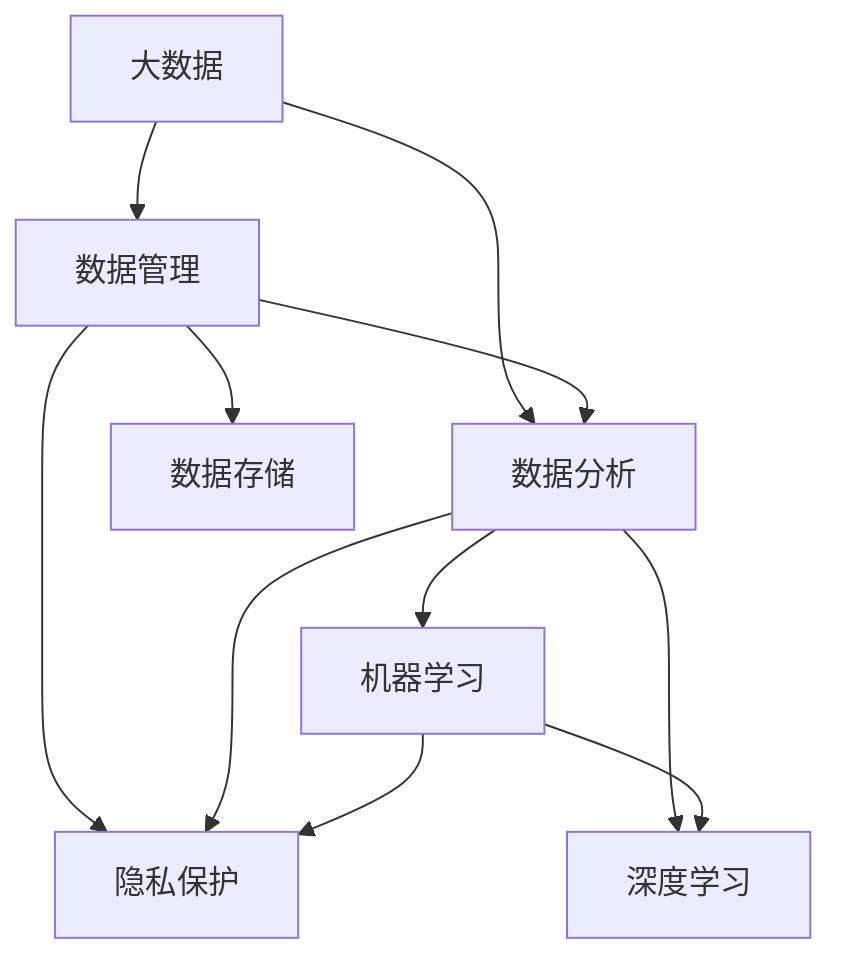

                 

# 大数据时代：人类计算的机遇与挑战

> 关键词：大数据,人类计算,机器学习,深度学习,数据管理,数据分析,存储技术,隐私保护,伦理问题

## 1. 背景介绍

### 1.1 问题由来
随着信息技术的飞速发展，人类社会已经迈入了一个全新的阶段——大数据时代。大数据带来的巨量数据、多样数据源和复杂数据类型，不仅极大地改变了人们的日常生活方式，也为各行各业带来了前所未有的机遇和挑战。在商业决策、科学研究、政府治理等诸多领域，大数据正在发挥着越来越重要的作用。然而，面对海量数据的采集、存储、处理和应用，人类计算面临的挑战也日益严峻。如何在高效利用大数据的同时，确保数据安全、合规性和伦理道德，成为当下亟待解决的问题。

### 1.2 问题核心关键点
大数据时代下，人类计算的机遇与挑战主要体现在以下几个方面：

- **机遇**：大数据提供了更丰富、更精准的数据源，使得机器学习、深度学习等算法能够更高效地提取和利用数据中的信息，推动科学发现和商业创新。例如，基于大数据的精准营销、个性化推荐、智能客服等应用，已经显著提高了企业的运营效率和用户满意度。

- **挑战**：数据量的爆炸式增长带来了存储、传输和处理的技术挑战。如何有效管理和优化大数据系统，保证数据的安全性和隐私保护，是当前亟待解决的问题。此外，大数据应用过程中涉及的伦理和法律问题，如数据使用权、隐私权等，也需要得到充分关注和规范。

## 2. 核心概念与联系

### 2.1 核心概念概述

为更好地理解大数据时代下的人类计算，本节将介绍几个关键概念及其联系：

- **大数据**：指那些超出传统数据库软件工具处理能力范围的数据集合。具有“4V”特性：Volume（规模）、Velocity（速度）、Variety（多样性）、Veracity（真实性）。

- **数据管理**：指对大数据进行收集、存储、清洗、转换和分析的过程。包括数据仓库、数据湖、数据管道等技术。

- **数据分析**：指从数据中提取有用信息，进行统计分析、机器学习和深度学习等，以发现数据背后的规律和趋势。

- **机器学习**：指通过算法让计算机从数据中自动学习规律，并用于预测和决策。包括监督学习、无监督学习、强化学习等。

- **深度学习**：指基于神经网络的机器学习，通过多层次的特征提取和表示学习，实现对复杂模式的学习和理解。

- **数据存储**：指将大数据存储在各种硬件和软件中，如硬盘、云存储、分布式文件系统等。

- **隐私保护**：指在数据收集、存储和处理过程中，保护个人隐私不被泄露和滥用的技术和措施。

- **伦理问题**：指在数据应用过程中涉及的伦理和法律问题，如数据使用权、隐私权等。

这些概念之间的联系和相互作用，构成了大数据时代人类计算的基本框架。通过理解这些概念，我们可以更好地把握大数据时代的机遇和挑战，探索更为高效和负责任的数据处理方式。

### 2.2 核心概念原理和架构的 Mermaid 流程图



这个流程图展示了大数据时代人类计算的核心概念及其相互关系：

1. **大数据**：通过数据管理，对海量数据进行存储和清洗，为数据分析提供数据基础。
2. **数据管理**：涉及数据存储、隐私保护等，确保数据的安全性和合规性。
3. **数据分析**：通过机器学习和深度学习技术，从数据中提取知识和洞见。
4. **机器学习**：基于数据构建模型，用于预测和决策。
5. **深度学习**：利用神经网络对复杂数据进行高效处理。
6. **隐私保护**：在数据处理过程中，确保个人隐私不被滥用。
7. **伦理问题**：在数据应用过程中，需要遵循伦理和法律规范。

这些概念构成了大数据时代人类计算的基础框架，指引着我们如何在高效利用大数据的同时，确保数据的规范和安全。

## 3. 核心算法原理 & 具体操作步骤

### 3.1 算法原理概述

在大数据时代，人类计算的机遇与挑战主要集中在数据处理、分析和应用等方面。以下将从算法原理的角度，详细讲解大数据时代人类计算的核心算法及其操作步骤。

- **数据预处理**：指对原始数据进行清洗、归一化和转换，以提高后续分析的准确性和效率。常用的预处理方法包括缺失值处理、异常值检测、数据规范化等。

- **特征工程**：指根据业务需求，从原始数据中提取和构造有意义的特征，用于构建模型。特征工程是机器学习中非常重要的一环，其质量直接影响模型的效果。

- **模型选择与训练**：根据问题的性质和数据的特点，选择合适的模型，如线性回归、决策树、随机森林、神经网络等，并在训练集上进行模型训练。

- **模型评估与优化**：使用验证集对训练好的模型进行评估，调整模型参数，以提高模型的泛化能力和性能。

- **模型部署与应用**：将训练好的模型部署到生产环境中，进行实时或批处理数据的预测和决策。

### 3.2 算法步骤详解

下面以深度学习模型在大数据环境下的应用为例，详细讲解其操作步骤：

**Step 1: 数据收集与预处理**

- 收集大数据集，包括结构化数据、半结构化数据和非结构化数据。
- 对数据进行清洗，去除噪声和缺失值。
- 进行数据归一化和特征工程，提取有意义的特征。

**Step 2: 模型训练与优化**

- 选择合适的深度学习框架和模型，如TensorFlow、PyTorch等。
- 在训练集上训练模型，并使用验证集进行模型调优。
- 应用正则化技术、Dropout、L2正则等方法，防止过拟合。

**Step 3: 模型评估与测试**

- 在测试集上评估模型性能，如准确率、召回率、F1值等。
- 使用混淆矩阵、ROC曲线等工具，分析模型预测结果。

**Step 4: 模型部署与监控**

- 将训练好的模型部署到生产环境中，进行实时或批处理数据的预测。
- 定期监控模型性能，及时发现和解决问题。

### 3.3 算法优缺点

基于深度学习的模型在大数据时代的优点包括：

- **高效处理大规模数据**：深度学习模型可以并行处理大量数据，显著提高计算效率。
- **自适应复杂模式**：深度学习模型能够学习到数据中的复杂模式，提高模型的预测能力。
- **实时性**：深度学习模型在实时数据流处理中表现出色，能够快速响应数据变化。

然而，这些算法也存在一些局限性：

- **计算资源消耗大**：深度学习模型参数量大，训练和推理过程中需要大量的计算资源。
- **过拟合风险高**：深度学习模型容易过拟合，需要精心设计的正则化和数据增强技术。
- **模型可解释性不足**：深度学习模型通常被认为是"黑盒"模型，难以解释其内部决策过程。

### 3.4 算法应用领域

基于深度学习的模型在大数据时代的广泛应用，涵盖了以下几个领域：

- **金融科技**：用于风险评估、信用评分、投资策略等。
- **医疗健康**：用于疾病预测、医学影像分析、个性化治疗等。
- **智能制造**：用于质量控制、设备维护、供应链优化等。
- **智慧城市**：用于交通管理、环境监测、公共安全等。
- **智能客服**：用于自然语言处理、情感分析、智能推荐等。

这些领域的应用展示了深度学习在大数据时代人类计算中的重要地位和广阔前景。

## 4. 数学模型和公式 & 详细讲解 & 举例说明

### 4.1 数学模型构建

本节将使用数学语言对大数据时代人类计算的核心算法进行详细讲解。

假设大数据集为 $\mathcal{D}=\{(x_i,y_i)\}_{i=1}^N$，其中 $x_i \in \mathcal{X}$ 为输入特征，$y_i \in \mathcal{Y}$ 为输出标签。模型的目标是找到一个映射函数 $f: \mathcal{X} \rightarrow \mathcal{Y}$，使得在训练集上最小化经验风险：

$$
\hat{L}(f) = \frac{1}{N}\sum_{i=1}^N \ell(f(x_i),y_i)
$$

其中 $\ell$ 为损失函数，常用的有交叉熵损失、均方误差损失等。

### 4.2 公式推导过程

以下以深度学习模型为例，推导其训练和优化过程的数学公式。

假设模型 $f$ 由多层神经网络构成，每个神经元 $j$ 的输出为 $f_j(x)$，则模型的预测结果为 $f(x) = \{f_j(x)\}_{j=1}^m$。假设输出为二分类问题，则目标函数为：

$$
\ell(f(x),y) = -(y\log f(x) + (1-y)\log(1-f(x)))
$$

目标是最小化该损失函数：

$$
\hat{L}(f) = \frac{1}{N}\sum_{i=1}^N \ell(f(x_i),y_i)
$$

使用随机梯度下降（SGD）算法进行优化，其更新公式为：

$$
f_j(x) \leftarrow f_j(x) - \eta \frac{\partial}{\partial f_j(x)}\ell(f(x),y)
$$

其中 $\eta$ 为学习率。

### 4.3 案例分析与讲解

以一个简单的图像分类问题为例，分析深度学习模型的训练和优化过程。

假设有一组图像分类数据，其中包含猫和狗两类。使用深度学习模型进行训练和优化，步骤如下：

1. **数据预处理**：将图像数据转换为神经网络的输入格式，并进行归一化处理。
2. **模型初始化**：随机初始化模型的权重和偏置。
3. **前向传播**：将训练集数据输入模型，计算预测结果。
4. **计算损失**：使用交叉熵损失计算预测结果与真实标签之间的差异。
5. **反向传播**：根据损失函数对模型参数进行反向传播，更新权重和偏置。
6. **参数调整**：使用正则化技术和学习率调整，防止过拟合。
7. **模型评估**：在测试集上评估模型性能，进行模型调优。

通过以上步骤，可以训练出一个准确的图像分类模型。

## 5. 项目实践：代码实例和详细解释说明

### 5.1 开发环境搭建

在进行深度学习项目开发前，需要准备好开发环境。以下是使用Python进行PyTorch开发的环境配置流程：

1. 安装Anaconda：从官网下载并安装Anaconda，用于创建独立的Python环境。

2. 创建并激活虚拟环境：
```bash
conda create -n pytorch-env python=3.8 
conda activate pytorch-env
```

3. 安装PyTorch：根据CUDA版本，从官网获取对应的安装命令。例如：
```bash
conda install pytorch torchvision torchaudio cudatoolkit=11.1 -c pytorch -c conda-forge
```

4. 安装各类工具包：
```bash
pip install numpy pandas scikit-learn matplotlib tqdm jupyter notebook ipython
```

完成上述步骤后，即可在`pytorch-env`环境中开始项目开发。

### 5.2 源代码详细实现

这里我们以图像分类任务为例，给出使用Transformers库对VGG模型进行训练和优化的PyTorch代码实现。

首先，定义图像分类任务的数据处理函数：

```python
from torchvision import datasets, transforms
from torch.utils.data import DataLoader

# 数据预处理
transform = transforms.Compose([
    transforms.Resize((224, 224)),
    transforms.ToTensor(),
    transforms.Normalize(mean=[0.485, 0.456, 0.406], std=[0.229, 0.224, 0.225])
])

# 加载数据集
train_dataset = datasets.CIFAR10(root='./data', train=True, download=True, transform=transform)
test_dataset = datasets.CIFAR10(root='./data', train=False, download=True, transform=transform)

# 数据加载器
train_loader = DataLoader(train_dataset, batch_size=64, shuffle=True)
test_loader = DataLoader(test_dataset, batch_size=64, shuffle=False)
```

然后，定义模型和优化器：

```python
from torchvision import models
from torch import nn
from torch import optim

# 加载预训练的VGG模型
model = models.vgg16(pretrained=True)
model.classifier = nn.Sequential(
    nn.Linear(25088, 4096),
    nn.ReLU(),
    nn.Dropout(p=0.5),
    nn.Linear(4096, 2)
)

# 定义损失函数和优化器
criterion = nn.CrossEntropyLoss()
optimizer = optim.SGD(model.parameters(), lr=0.001, momentum=0.9)
```

接着，定义训练和评估函数：

```python
def train_epoch(model, train_loader, optimizer):
    model.train()
    total_loss = 0
    for images, labels in train_loader:
        optimizer.zero_grad()
        outputs = model(images)
        loss = criterion(outputs, labels)
        loss.backward()
        optimizer.step()
        total_loss += loss.item()
    return total_loss / len(train_loader)

def evaluate(model, test_loader):
    model.eval()
    correct = 0
    total = 0
    with torch.no_grad():
        for images, labels in test_loader:
            outputs = model(images)
            _, predicted = torch.max(outputs, 1)
            total += labels.size(0)
            correct += (predicted == labels).sum().item()
    accuracy = correct / total
    return accuracy
```

最后，启动训练流程并在测试集上评估：

```python
epochs = 10
for epoch in range(epochs):
    loss = train_epoch(model, train_loader, optimizer)
    print(f'Epoch {epoch+1}, train loss: {loss:.4f}')
    
    accuracy = evaluate(model, test_loader)
    print(f'Epoch {epoch+1}, test accuracy: {accuracy:.4f}')
    
print(f'Final accuracy: {evaluate(model, test_loader):.4f}')
```

以上就是使用PyTorch对VGG模型进行图像分类任务训练和优化的完整代码实现。可以看到，通过简单的几行代码，就可以实现一个基础的图像分类模型，并快速进行训练和评估。

### 5.3 代码解读与分析

让我们再详细解读一下关键代码的实现细节：

**数据处理函数**：
- 使用`torchvision.transforms`模块对图像进行预处理，包括大小归一化、通道转换和标准化。

**模型定义**：
- 加载预训练的VGG模型，并替换其顶部全连接层为新的分类器。
- 定义交叉熵损失函数和随机梯度下降优化器。

**训练和评估函数**：
- `train_epoch`函数：对数据集进行迭代训练，更新模型参数。
- `evaluate`函数：在测试集上评估模型性能，计算准确率。

**训练流程**：
- 循环迭代多次epoch，每次epoch训练完毕后，在测试集上评估模型性能。

通过以上步骤，可以训练出一个基本的图像分类模型。在实际应用中，还需要针对具体任务进行优化设计，如改进模型结构、调整超参数等，以进一步提升模型性能。

## 6. 实际应用场景

### 6.1 智能制造

大数据时代，智能制造领域正在发生深刻的变革。通过深度学习和数据挖掘技术，企业可以实现生产过程的自动化、智能化和优化，大幅提升生产效率和产品质量。

具体应用包括：

- **设备状态监控**：通过传感器收集生产设备的实时数据，使用深度学习模型进行状态预测和故障诊断。
- **质量控制**：基于历史生产数据和实时数据，使用深度学习模型进行产品缺陷检测和质量评估。
- **供应链优化**：利用大数据分析，优化生产计划和库存管理，减少浪费，提升供应链效率。

### 6.2 智慧城市

智慧城市建设是当前城市治理的重要方向。通过大数据和深度学习技术，城市管理者可以实时监控和管理城市运行，提高城市治理水平。

具体应用包括：

- **交通管理**：利用实时交通数据，使用深度学习模型进行交通流量预测和路径优化。
- **环境监测**：通过传感器收集环境数据，使用深度学习模型进行环境变化分析和预警。
- **公共安全**：利用视频监控数据，使用深度学习模型进行异常行为检测和预警。

### 6.3 医疗健康

医疗健康领域是大数据和深度学习的重要应用场景。通过大数据分析和深度学习技术，医疗机构可以实现精准医疗和健康管理。

具体应用包括：

- **疾病预测**：基于历史病历数据和实时监测数据，使用深度学习模型进行疾病预测和早期诊断。
- **医学影像分析**：利用医学影像数据，使用深度学习模型进行疾病诊断和病理分析。
- **个性化治疗**：基于患者基因信息和病历数据，使用深度学习模型进行个性化治疗方案设计。

### 6.4 未来应用展望

随着大数据和深度学习技术的不断发展，未来在大数据时代人类计算领域将迎来更多创新和突破：

- **联邦学习**：通过分布式数据处理技术，实现数据在不同节点上的联合训练，保护数据隐私。
- **边缘计算**：在设备端进行数据处理和分析，减少数据传输和存储需求。
- **自监督学习**：利用未标注数据进行自监督学习，降低对标注数据的依赖。
- **跨模态学习**：结合视觉、音频、文本等多种模态数据，提高模型的跨领域迁移能力。

这些技术的应用将进一步推动大数据时代人类计算的发展，为各行各业带来更高效、更智能、更安全的解决方案。

## 7. 工具和资源推荐

### 7.1 学习资源推荐

为了帮助开发者系统掌握大数据时代人类计算的理论基础和实践技巧，这里推荐一些优质的学习资源：

1. 《深度学习》系列书籍：由多位深度学习领域的专家编写，全面介绍了深度学习的理论基础、算法和应用。
2. 《大数据技术与应用》课程：由知名大学开设的大数据技术课程，涵盖大数据技术、数据管理和深度学习等内容。
3. Kaggle竞赛平台：全球最大的数据科学竞赛平台，通过参加比赛可以积累实战经验，学习优秀算法和解决方案。
4. GitHub开源项目：通过浏览和参与开源项目，学习优秀的代码实现和最佳实践。

通过对这些资源的学习实践，相信你一定能够快速掌握大数据时代人类计算的精髓，并用于解决实际的业务问题。

### 7.2 开发工具推荐

高效的开发离不开优秀的工具支持。以下是几款用于大数据和深度学习开发的常用工具：

1. PyTorch：基于Python的开源深度学习框架，灵活动态的计算图，适合快速迭代研究。
2. TensorFlow：由Google主导开发的开源深度学习框架，生产部署方便，适合大规模工程应用。
3. Apache Hadoop：基于MapReduce的分布式数据处理框架，适用于大规模数据存储和处理。
4. Apache Spark：基于内存计算的分布式数据处理框架，适用于大规模数据流处理。
5. Apache Kafka：分布式流处理平台，适用于实时数据采集和处理。

合理利用这些工具，可以显著提升大数据和深度学习项目的开发效率，加快创新迭代的步伐。

### 7.3 相关论文推荐

大数据和深度学习领域的研究进展日新月异，以下是几篇奠基性的相关论文，推荐阅读：

1. Deep Learning：一种新型的机器学习技术，由Yann LeCun等编写，全面介绍了深度学习的理论和实践。
2. Distributed Deep Learning: Algorithms and Issues on Scalability: 讨论了分布式深度学习的算法和优化方法。
3. Google Brain Team: Big Data Machine Learning Engine: 介绍了Google在大数据机器学习方面的实践和经验。

这些论文代表了大数据时代人类计算的研究进展，通过学习这些前沿成果，可以帮助研究者把握学科前进方向，激发更多的创新灵感。

## 8. 总结：未来发展趋势与挑战

### 8.1 研究成果总结

大数据时代人类计算的研究已经取得了显著进展，推动了诸多领域的技术进步和应用创新。然而，面对海量数据和复杂问题的挑战，仍然存在许多难题需要解决。本文从大数据和深度学习的角度，全面梳理了人类计算的机遇与挑战，希望能为相关领域的开发者和研究者提供参考。

### 8.2 未来发展趋势

展望未来，大数据时代人类计算将呈现以下几个发展趋势：

1. **数据驱动决策**：基于大数据分析，推动更多决策过程的数字化、智能化。
2. **深度学习普及化**：深度学习技术将更加普及，应用于更多行业和领域。
3. **联邦学习**：分布式数据处理技术将得到广泛应用，保护数据隐私。
4. **边缘计算**：数据处理和分析将更多在设备端进行，降低数据传输和存储需求。
5. **跨模态学习**：多模态数据融合技术将得到发展，提高模型的跨领域迁移能力。

这些趋势将推动大数据时代人类计算的进一步发展，为各行各业带来更多的创新和突破。

### 8.3 面临的挑战

尽管大数据时代人类计算取得了显著进展，但仍面临诸多挑战：

1. **数据质量问题**：大数据中存在大量的噪声和缺失值，如何有效清洗和处理数据是重要难题。
2. **计算资源限制**：深度学习模型需要大量的计算资源，如何高效利用计算资源是关键问题。
3. **数据隐私和安全**：在数据处理和应用过程中，如何保护用户隐私和数据安全是重要问题。
4. **模型可解释性**：深度学习模型通常被认为是"黑盒"模型，如何提高模型的可解释性是重要研究方向。
5. **伦理和法律问题**：大数据应用过程中涉及的伦理和法律问题，如数据使用权、隐私权等，需要得到充分关注和规范。

这些挑战需要通过技术进步和政策支持，才能得到有效解决。

### 8.4 研究展望

面对大数据时代人类计算所面临的挑战，未来的研究需要在以下几个方面寻求新的突破：

1. **数据清洗和处理**：开发更加高效的数据清洗和处理技术，提高数据质量。
2. **计算资源优化**：研究和应用高效的计算资源管理技术，提高计算效率。
3. **数据隐私保护**：开发更加安全的隐私保护技术，保护数据隐私。
4. **模型可解释性**：研究和应用可解释性技术，提高模型的可解释性。
5. **伦理和法律规范**：制定和实施数据应用中的伦理和法律规范，保护用户权益。

这些研究方向的探索，将引领大数据时代人类计算技术的不断进步，为构建安全、可靠、智能的解决方案提供技术保障。

## 9. 附录：常见问题与解答

**Q1：如何选择合适的数据预处理方法？**

A: 数据预处理方法的选择需要根据具体数据的特点和分析目的来决定。常用的预处理方法包括缺失值处理、异常值检测、数据标准化等。具体方法的选择需要结合数据类型、数据规模和分析目标进行综合考虑。

**Q2：如何防止深度学习模型的过拟合？**

A: 深度学习模型容易过拟合，可以采用以下方法进行防止：

1. 正则化技术：使用L2正则、Dropout等方法，防止模型过拟合。
2. 数据增强：通过数据增强技术，增加数据多样性，防止模型对噪声数据过拟合。
3. 早停法：在验证集性能不再提升时，停止训练，防止模型过拟合。

**Q3：如何在深度学习模型中进行特征工程？**

A: 特征工程在深度学习模型中非常重要，其效果直接影响模型的性能。特征工程包括特征提取、特征选择、特征变换等步骤。具体方法需要根据数据的特点和分析目的来决定。

**Q4：深度学习模型在实际应用中需要注意哪些问题？**

A: 在实际应用中，深度学习模型需要注意以下几个问题：

1. 模型训练和推理的效率问题，需要考虑模型的计算资源消耗。
2. 模型的可解释性问题，需要通过可视化工具和技术，增强模型的可解释性。
3. 模型的隐私和安全问题，需要设计合理的隐私保护机制和数据安全策略。

**Q5：联邦学习如何解决数据隐私问题？**

A: 联邦学习通过分布式数据处理技术，实现了模型在多个节点上的联合训练，避免了数据的集中存储和传输。通过这种方式，可以保护数据隐私，同时提高模型的泛化能力和性能。

---

作者：禅与计算机程序设计艺术 / Zen and the Art of Computer Programming

