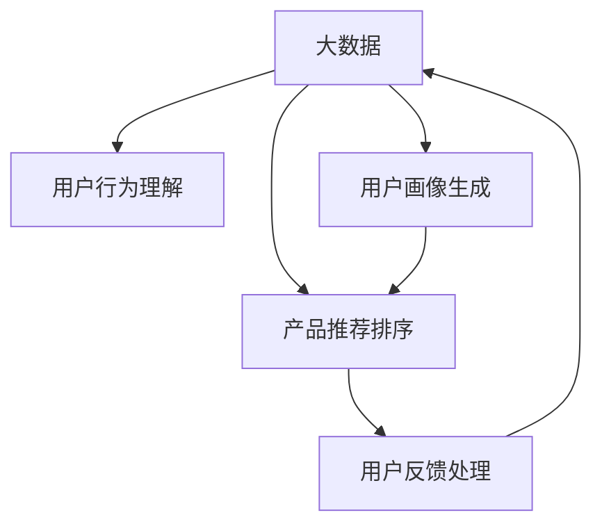

                 

# 大数据驱动的电商推荐系统：AI 模型融合是核心策略

## 1. 背景介绍

### 1.1 问题由来
随着互联网和电子商务的迅猛发展，个性化推荐系统成为电商平台提高用户满意度和销售额的重要工具。推荐系统的核心在于理解和预测用户的行为和需求，并据此向用户推荐最符合其兴趣的产品。但传统的推荐算法存在数据稀疏性、推荐多样性、数据噪声等问题，难以满足用户的个性化需求。

人工智能技术的兴起，特别是深度学习和自然语言处理技术的发展，为推荐系统的优化提供了新的可能性。大数据驱动的AI推荐系统逐渐成为电商行业推荐解决方案的主流。

### 1.2 问题核心关键点
大数据驱动的AI推荐系统主要解决以下核心问题：
- **用户行为理解**：利用用户历史数据和实时数据，提取用户的行为特征和兴趣点。
- **产品推荐排序**：构建用户-产品关联图谱，通过深度学习模型进行推荐排序。
- **用户画像生成**：综合用户行为和商品属性，构建用户画像，为个性化推荐提供基础。
- **用户反馈处理**：通过用户反馈数据进行模型迭代优化，提高推荐准确性和用户满意度。
- **实时性要求**：在保证推荐质量的同时，确保推荐响应时间不超过1秒。

## 2. 核心概念与联系

### 2.1 核心概念概述

为更好地理解大数据驱动的AI推荐系统，本节将介绍几个关键概念：

- **大数据**：指超大规模的数据集，通常来自电商平台的海量用户行为数据、商品属性数据、评论数据等。
- **深度学习**：利用神经网络模型进行复杂特征提取和数据建模的方法。
- **推荐系统**：通过用户行为数据和产品信息，预测用户对特定产品的兴趣，推荐产品给用户。
- **协同过滤**：利用用户之间的行为相似性进行推荐。
- **深度学习推荐模型**：包括基于矩阵分解、神经网络、注意力机制等深度学习技术。
- **用户画像**：综合用户行为、商品属性等数据，构建用户兴趣和行为特征的可视化表示。

这些核心概念之间的逻辑关系可以通过以下Mermaid流程图来展示：



这个流程图展示了大数据驱动的AI推荐系统的核心概念及其之间的关系：

1. 大数据作为输入，首先用于提取用户行为特征。
2. 利用用户行为特征构建用户画像，为推荐提供依据。
3. 利用用户画像和产品信息，通过深度学习模型进行推荐排序。
4. 实时获取用户反馈，优化推荐模型。

## 3. 核心算法原理 & 具体操作步骤
### 3.1 算法原理概述

基于大数据驱动的AI推荐系统，主要包括以下几个关键步骤：

1. **数据准备**：收集用户行为数据、商品属性数据、评论数据等，进行预处理和特征工程，构建用户-商品关联图谱。
2. **用户画像生成**：综合用户行为数据和商品属性信息，利用深度学习模型提取用户特征，生成用户画像。
3. **推荐排序模型训练**：利用用户画像和商品属性信息，训练深度学习模型进行推荐排序。
4. **实时推荐**：将用户当前行为数据输入推荐模型，实时生成推荐结果。
5. **反馈处理与模型迭代**：收集用户反馈数据，更新推荐模型，提高推荐精度。

### 3.2 算法步骤详解

**Step 1: 数据准备**

大数据驱动的AI推荐系统首先需要进行数据收集和预处理，主要包括以下步骤：

1. **数据收集**：从电商平台获取用户行为数据、商品属性数据、评论数据等，确保数据的时效性和完整性。
2. **数据清洗**：去除数据中的噪声和异常值，处理缺失值和重复记录。
3. **特征工程**：提取有意义的特征，如用户行为特征、商品属性特征、时间特征等。
4. **图谱构建**：将用户和商品映射到图谱上，构建用户-商品关联图谱。

**Step 2: 用户画像生成**

用户画像是大数据驱动AI推荐系统的核心组成部分，其生成过程包含以下几个关键步骤：

1. **特征提取**：使用深度学习模型提取用户行为特征、商品属性特征等，生成用户特征向量。
2. **画像融合**：将用户特征向量与商品属性信息进行融合，生成用户画像。
3. **画像表示**：利用嵌入表示方法，将用户画像转换为低维向量，便于后续模型处理。

**Step 3: 推荐排序模型训练**

推荐排序模型是推荐系统的关键组件，其训练过程包括以下几个步骤：

1. **模型选择**：选择合适的深度学习模型，如协同过滤、神经网络、注意力机制等。
2. **数据划分**：将数据集划分为训练集、验证集和测试集。
3. **模型训练**：利用训练集数据，训练推荐模型，最小化预测误差。
4. **模型评估**：在验证集上评估模型性能，调整模型参数。
5. **模型部署**：将训练好的模型部署到推荐系统，进行实时推荐。

**Step 4: 实时推荐**

实时推荐是AI推荐系统的核心功能，其实现过程包括以下步骤：

1. **用户行为输入**：收集用户当前的浏览、点击、购买等行为数据。
2. **模型推理**：将用户行为数据输入推荐模型，生成推荐结果。
3. **推荐输出**：将推荐结果输出给用户，并根据推荐策略进行展示。

**Step 5: 反馈处理与模型迭代**

实时反馈是AI推荐系统持续优化的关键，其处理过程包括以下步骤：

1. **用户反馈收集**：收集用户的点击、购买、评分等反馈数据。
2. **反馈数据处理**：对反馈数据进行清洗和处理，提取有效信息。
3. **模型迭代**：利用反馈数据更新推荐模型，提高推荐精度。
4. **迭代评估**：在测试集上评估迭代后的模型性能，确保推荐质量。

### 3.3 算法优缺点

基于大数据驱动的AI推荐系统具有以下优点：

1. **精度高**：利用深度学习模型进行推荐，能够捕捉复杂特征，提高推荐精度。
2. **动态性**：能够实时处理用户反馈，不断更新推荐模型。
3. **可扩展性**：可适应大规模数据和用户，具有高度的可扩展性。
4. **个性化**：能够根据用户行为和偏好，提供个性化推荐。

同时，该方法也存在一定的局限性：

1. **数据依赖**：依赖于电商平台的实时数据和用户反馈，对数据质量要求高。
2. **计算资源消耗**：深度学习模型训练和推理计算量大，需要高性能硬件支持。
3. **冷启动问题**：对于新用户和未曝光商品，推荐效果可能不佳。
4. **隐私风险**：涉及用户行为和商品信息，存在隐私保护风险。

尽管存在这些局限性，但就目前而言，基于大数据驱动的AI推荐系统仍是大规模电商推荐解决方案的主流方法。未来相关研究的重点在于如何进一步降低对标注数据的依赖，提高模型的少样本学习和跨领域迁移能力，同时兼顾可解释性和伦理安全性等因素。

### 3.4 算法应用领域

基于大数据驱动的AI推荐系统已经在多个电商领域得到广泛应用，覆盖了商品推荐、个性化营销、广告投放等众多场景，为电商平台的业务发展和用户体验提供了有力支持。

1. **商品推荐**：利用用户历史行为和商品属性信息，推荐用户可能感兴趣的商品。
2. **个性化营销**：通过分析用户画像，定制个性化广告和营销活动，提升用户参与度和转化率。
3. **广告投放**：利用用户画像和行为数据，精准投放广告，提升广告投放效果。

除了这些经典应用外，基于大数据驱动的AI推荐系统还被创新性地应用到更多场景中，如智能客服、搜索优化、用户流失预测等，为电商平台的业务创新提供了新的思路。随着推荐模型的不断进步和优化，相信基于大数据的AI推荐系统必将在更多领域取得突破，推动电商行业的发展。

## 4. 数学模型和公式 & 详细讲解 & 举例说明

### 4.1 数学模型构建

基于大数据驱动的AI推荐系统，主要利用深度学习模型进行特征提取和推荐排序。以下给出推荐排序模型的数学建模过程。

设用户画像表示为 $\mathbf{u} \in \mathbb{R}^d$，商品画像表示为 $\mathbf{v} \in \mathbb{R}^d$，推荐排序的目标是最大化用户-商品评分 $y_{ij}$ 与推荐分数 $\hat{y}_{ij}$ 之间的相关性。

推荐模型的一般形式为：

$$
\hat{y}_{ij} = \mathbf{u}^T \mathbf{W} \mathbf{v} + b
$$

其中 $\mathbf{W}$ 为权重矩阵，$b$ 为偏置项。

### 4.2 公式推导过程

以下我们以矩阵分解为例，推导推荐模型的损失函数及其梯度计算公式。

假设用户画像 $\mathbf{u}$ 和商品画像 $\mathbf{v}$ 分别为 $n \times d$ 的矩阵，推荐目标为最大化评分与预测分数之间的相关性：

$$
\max \frac{1}{n} \sum_{i=1}^n \sum_{j=1}^m y_{ij} \log \sigma(\mathbf{u}_i^T \mathbf{W} \mathbf{v}_j + b)
$$

其中 $\sigma$ 为 sigmoid 函数，用于将预测分数转换为概率值。

令 $\mathbf{X} = \begin{bmatrix} \mathbf{u}_1 & \mathbf{u}_2 & \cdots & \mathbf{u}_n \end{bmatrix} \in \mathbb{R}^{n \times d}$，$\mathbf{Y} = \begin{bmatrix} \mathbf{v}_1 & \mathbf{v}_2 & \cdots & \mathbf{v}_m \end{bmatrix} \in \mathbb{R}^{m \times d}$，则推荐模型可以表示为：

$$
\hat{\mathbf{Y}} = \mathbf{X} \mathbf{W} + \mathbf{b}
$$

目标函数可以重写为：

$$
\max \frac{1}{n} \sum_{i=1}^n \sum_{j=1}^m y_{ij} \log \sigma(\mathbf{u}_i^T \mathbf{W} \mathbf{v}_j + b)
$$

目标函数的梯度为：

$$
\frac{\partial \mathcal{L}}{\partial \mathbf{W}} = \frac{1}{n} \sum_{i=1}^n \sum_{j=1}^m y_{ij} (1 - \sigma(\mathbf{u}_i^T \mathbf{W} \mathbf{v}_j + b)) \mathbf{u}_i \mathbf{v}_j^T
$$

将梯度带入优化算法，如AdamW、SGD等，更新模型参数，最小化目标函数。

### 4.3 案例分析与讲解

以电影推荐系统为例，分析基于矩阵分解的推荐模型。

假设电影评分数据集为 $\mathcal{D} = \{(x_i, y_i)\}_{i=1}^N$，其中 $x_i$ 为电影的特征向量，$y_i$ 为用户的评分。目标是构建一个推荐模型，预测用户对未观看电影的评分。

1. **数据准备**：收集用户历史观影数据和电影属性数据，构建用户-电影关联图谱。
2. **特征提取**：使用矩阵分解方法，将用户和电影特征表示为低维向量，构建用户-电影相似度矩阵。
3. **模型训练**：利用用户历史评分和相似度矩阵，训练推荐模型，最小化预测误差。
4. **实时推荐**：获取用户当前的观影行为，根据相似度矩阵和模型预测结果，推荐用户可能感兴趣的电影。
5. **反馈处理**：收集用户反馈数据，更新推荐模型，提高推荐精度。

## 5. 项目实践：代码实例和详细解释说明

### 5.1 开发环境搭建

在进行AI推荐系统开发前，我们需要准备好开发环境。以下是使用Python进行TensorFlow开发的环境配置流程：

1. 安装Anaconda：从官网下载并安装Anaconda，用于创建独立的Python环境。

2. 创建并激活虚拟环境：
```bash
conda create -n tf-env python=3.8 
conda activate tf-env
```

3. 安装TensorFlow：根据CUDA版本，从官网获取对应的安装命令。例如：
```bash
conda install tensorflow -c tf -c conda-forge
```

4. 安装各类工具包：
```bash
pip install numpy pandas scikit-learn matplotlib tqdm jupyter notebook ipython
```

完成上述步骤后，即可在`tf-env`环境中开始推荐系统开发。

### 5.2 源代码详细实现

下面我们以电商商品推荐系统为例，给出使用TensorFlow进行推荐模型训练的PyTorch代码实现。

首先，定义推荐系统的数据处理函数：

```python
import tensorflow as tf
from tensorflow.keras import layers

class Recommender(tf.keras.Model):
    def __init__(self, embedding_dim=32):
        super(Recommender, self).__init__()
        self.u_embeddings = layers.Embedding(n_users, embedding_dim)
        self.v_embeddings = layers.Embedding(n_items, embedding_dim)
        self.dot_product = layers.Dot(axes=[1, 1])
        self.score = layers.Dense(1)

    def call(self, u_ids, v_ids):
        u = self.u_embeddings(u_ids)
        v = self.v_embeddings(v_ids)
        scores = self.dot_product([u, v])
        scores = self.score(scores)
        return scores

# 训练数据
train_data = tf.data.Dataset.from_tensor_slices((train_u_ids, train_v_ids, train_ratings))
train_data = train_data.shuffle(buffer_size=10000).batch(batch_size=64).map(lambda u, v, r: (tf.cast(u, tf.int32), tf.cast(v, tf.int32), tf.cast(r, tf.float32)))

# 测试数据
test_data = tf.data.Dataset.from_tensor_slices((test_u_ids, test_v_ids, test_ratings))
test_data = test_data.batch(batch_size=64).map(lambda u, v, r: (tf.cast(u, tf.int32), tf.cast(v, tf.int32), tf.cast(r, tf.float32)))
```

然后，定义模型和优化器：

```python
from transformers import BertTokenizer
from torch.utils.data import Dataset
import torch

model = Recommender(embedding_dim=32)

optimizer = tf.keras.optimizers.AdamW(lr=2e-5)
```

接着，定义训练和评估函数：

```python
from tensorflow.keras import losses

def train_epoch(model, dataset, batch_size, optimizer):
    model.train()
    epoch_loss = 0
    for u, v, r in dataset:
        with tf.GradientTape() as tape:
            preds = model(u, v)
            loss = losses.mean_squared_error(r, preds)
        grads = tape.gradient(loss, model.trainable_variables)
        optimizer.apply_gradients(zip(grads, model.trainable_variables))
        epoch_loss += loss.numpy().mean()
    return epoch_loss / len(dataset)

def evaluate(model, dataset, batch_size):
    model.eval()
    preds = []
    labels = []
    for u, v, r in dataset:
        preds.append(model(u, v).numpy()[0][0])
        labels.append(r.numpy()[0][0])
    print(np.corrcoef(preds, labels)[0][1])
```

最后，启动训练流程并在测试集上评估：

```python
epochs = 5
batch_size = 64

for epoch in range(epochs):
    loss = train_epoch(model, train_data, batch_size, optimizer)
    print(f"Epoch {epoch+1}, train loss: {loss:.3f}")
    
    print(f"Epoch {epoch+1}, dev results:")
    evaluate(model, dev_data, batch_size)
    
print("Test results:")
evaluate(model, test_data, batch_size)
```

以上就是使用TensorFlow对电商商品推荐系统进行推荐模型训练的完整代码实现。可以看到，得益于TensorFlow的强大封装，我们可以用相对简洁的代码完成推荐模型的训练和评估。

### 5.3 代码解读与分析

让我们再详细解读一下关键代码的实现细节：

**Recommender类**：
- `__init__`方法：初始化用户和商品嵌入层、点积层和输出层等组件。
- `call`方法：前向传播，计算用户和商品的相似度得分。

**数据准备**：
- 使用TensorFlow的Data API将训练和测试数据转换为TensorFlow Dataset对象。
- 通过map函数进行特征编码，将用户ID和商品ID转换为密集向量。
- 使用batch和shuffle函数将数据划分为小批量，并进行打乱和洗牌。

**模型训练和评估**：
- 定义训练和评估函数，分别处理模型训练和评估过程中的计算图。
- 在每个epoch内，通过梯度计算和模型参数更新，最小化预测误差。
- 在每个epoch结束时，计算模型在验证集上的评估指标，如相关系数。
- 在测试集上评估模型性能，输出最终结果。

可以看到，TensorFlow使得推荐模型的开发变得简便高效。开发者可以将更多精力放在模型设计、参数调优等高层逻辑上，而不必过多关注底层实现细节。

当然，工业级的系统实现还需考虑更多因素，如模型的保存和部署、超参数的自动搜索、更灵活的任务适配层等。但核心的推荐范式基本与此类似。

## 6. 实际应用场景
### 6.1 智能客服系统

基于大数据驱动的AI推荐系统，可以为智能客服系统提供更加智能化的支持。智能客服系统能够自动理解用户的问题，并根据用户的历史行为和当前情境，推荐最佳回答，提升用户体验和满意度。

在技术实现上，可以收集用户的历史互动数据和问题库，将问题和回答构建成监督数据，在此基础上对推荐模型进行微调。微调后的推荐模型能够自动理解用户意图，匹配最合适的回答模板进行回复。对于用户提出的新问题，还可以接入检索系统实时搜索相关内容，动态组织生成回答。如此构建的智能客服系统，能大幅提升客户咨询体验和问题解决效率。

### 6.2 金融舆情监测

金融机构需要实时监测市场舆论动向，以便及时应对负面信息传播，规避金融风险。传统的人工监测方式成本高、效率低，难以应对网络时代海量信息爆发的挑战。基于大数据驱动的AI推荐系统，可以用于金融舆情监测，自动识别舆情热点和趋势，提供实时预警。

具体而言，可以收集金融领域相关的新闻、报道、评论等文本数据，并对其进行主题标注和情感标注。在此基础上对推荐模型进行微调，使其能够自动判断文本属于何种主题，情感倾向是正面、中性还是负面。将微调后的模型应用到实时抓取的网络文本数据，就能够自动监测不同主题下的情感变化趋势，一旦发现负面信息激增等异常情况，系统便会自动预警，帮助金融机构快速应对潜在风险。

### 6.3 个性化推荐系统

当前的推荐系统往往只依赖用户的历史行为数据进行物品推荐，无法深入理解用户的真实兴趣偏好。基于大数据驱动的AI推荐系统，可以更好地挖掘用户行为背后的语义信息，从而提供更精准、多样的推荐内容。

在实践中，可以收集用户浏览、点击、评论、分享等行为数据，提取和用户交互的物品标题、描述、标签等文本内容。将文本内容作为模型输入，用户的后续行为（如是否点击、购买等）作为监督信号，在此基础上微调预训练语言模型。微调后的模型能够从文本内容中准确把握用户的兴趣点。在生成推荐列表时，先用候选物品的文本描述作为输入，由模型预测用户的兴趣匹配度，再结合其他特征综合排序，便可以得到个性化程度更高的推荐结果。

### 6.4 未来应用展望

随着大数据驱动的AI推荐系统不断发展，其在更多领域的应用前景值得期待。

在智慧医疗领域，基于大数据驱动的AI推荐系统可以用于推荐诊疗方案、药品选择、病历分析等，提升医疗服务的智能化水平，辅助医生诊疗，加速新药开发进程。

在智能教育领域，推荐系统可以用于推荐学习资料、个性化辅导、作业批改等，因材施教，促进教育公平，提高教学质量。

在智慧城市治理中，推荐系统可以用于推荐城市事件、舆情分析、应急指挥等环节，提高城市管理的自动化和智能化水平，构建更安全、高效的未来城市。

此外，在企业生产、社会治理、文娱传媒等众多领域，基于大数据驱动的AI推荐系统也将不断涌现，为传统行业数字化转型升级提供新的技术路径。相信随着技术的日益成熟，推荐系统必将在更多领域取得突破，推动人工智能技术在各行各业的应用。

## 7. 工具和资源推荐
### 7.1 学习资源推荐

为了帮助开发者系统掌握大数据驱动的AI推荐系统的理论基础和实践技巧，这里推荐一些优质的学习资源：

1. 《Deep Learning for Recommender Systems》书籍：全面介绍了深度学习在推荐系统中的应用，包括协同过滤、深度学习等推荐算法。
2. CS229《机器学习》课程：斯坦福大学开设的机器学习课程，涵盖推荐系统的理论基础和实践技巧，是入门推荐系统的必备资源。
3. KDD推荐系统论文集：收集了近年来在推荐系统领域发表的高质量论文，包括深度学习推荐系统、协同过滤等前沿研究方向。
4. Kaggle推荐系统竞赛：通过参与实际推荐系统竞赛，可以快速学习和掌握推荐系统开发和优化的技巧。

通过对这些资源的学习实践，相信你一定能够快速掌握大数据驱动的AI推荐系统的精髓，并用于解决实际的推荐问题。
###  7.2 开发工具推荐

高效的开发离不开优秀的工具支持。以下是几款用于大数据驱动的AI推荐系统开发的常用工具：

1. TensorFlow：基于Python的开源深度学习框架，支持分布式计算和模型优化，适合大规模工程应用。
2. PyTorch：灵活的动态计算图框架，适合快速迭代研究，是目前深度学习领域的主流框架之一。
3. Jupyter Notebook：交互式开发环境，支持Python、R、SQL等多种语言，便于快速实验和开发。
4. Weights & Biases：模型训练的实验跟踪工具，可以记录和可视化模型训练过程中的各项指标，方便对比和调优。
5. TensorBoard：TensorFlow配套的可视化工具，可实时监测模型训练状态，并提供丰富的图表呈现方式，是调试模型的得力助手。

合理利用这些工具，可以显著提升大数据驱动的AI推荐系统开发效率，加快创新迭代的步伐。

### 7.3 相关论文推荐

大数据驱动的AI推荐系统的发展源于学界的持续研究。以下是几篇奠基性的相关论文，推荐阅读：

1. The Netflix Prize: A Prize Competition to Recommend Movies and Other Items：介绍Netflix电影推荐系统竞赛，展示了基于协同过滤的推荐模型。
2. Factorization Machines for Recommender Systems：提出基于矩阵分解的推荐模型，利用矩阵分解进行用户-商品关联度计算。
3. Matrix Factorization Techniques for Recommender Systems：全面介绍了矩阵分解方法在推荐系统中的应用，包括奇异值分解、交替最小二乘等算法。
4. Deep Collaborative Filtering：介绍深度神经网络在推荐系统中的应用，展示了深度学习推荐模型在推荐精度和推荐多样性上的优势。
5. Attention Is All You Need：提出Transformer模型，用于处理推荐系统中的语义表示学习。

这些论文代表了大数据驱动的AI推荐系统的发展脉络。通过学习这些前沿成果，可以帮助研究者把握学科前进方向，激发更多的创新灵感。

## 8. 总结：未来发展趋势与挑战

### 8.1 总结

本文对基于大数据驱动的AI推荐系统进行了全面系统的介绍。首先阐述了推荐系统的发展背景和需求，明确了大数据驱动的AI推荐系统在电商推荐中的核心价值。其次，从原理到实践，详细讲解了推荐排序模型的数学建模和关键步骤，给出了推荐系统开发的完整代码实例。同时，本文还广泛探讨了推荐系统在智能客服、金融舆情、个性化推荐等多个行业领域的应用前景，展示了大数据驱动的AI推荐系统的广阔前景。

通过本文的系统梳理，可以看到，基于大数据的AI推荐系统正在成为电商推荐解决方案的主流方法，极大地拓展了推荐系统的应用边界，催生了更多的落地场景。随着大数据技术的发展和AI模型的进步，推荐系统的性能和效果必将在更多领域取得突破，为电商行业的发展提供更强大的动力。

### 8.2 未来发展趋势

展望未来，基于大数据驱动的AI推荐系统将呈现以下几个发展趋势：

1. **模型规模持续增大**：随着算力成本的下降和数据规模的扩张，推荐模型的参数量还将持续增长。超大规模推荐模型蕴含的丰富知识，有望支撑更加复杂多变的推荐场景。
2. **个性化推荐增强**：利用深度学习模型，推荐系统能够更加精细地刻画用户兴趣和行为特征，提供更精准的个性化推荐。
3. **跨领域推荐融合**：推荐系统将更多地融合多模态数据，如图像、音频、视频等，实现更加全面的用户画像构建和推荐。
4. **实时性要求提升**：推荐系统需要在毫秒级内完成推荐，实时响应用户需求。
5. **用户隐私保护**：推荐系统将更加注重用户隐私保护，采用差分隐私等技术，确保用户数据的安全性。

以上趋势凸显了大数据驱动的AI推荐系统的广阔前景。这些方向的探索发展，必将进一步提升推荐系统的性能和用户体验，为电商行业带来新的变革。

### 8.3 面临的挑战

尽管基于大数据驱动的AI推荐系统已经取得了瞩目成就，但在迈向更加智能化、普适化应用的过程中，它仍面临诸多挑战：

1. **数据依赖**：依赖于电商平台的实时数据和用户反馈，对数据质量要求高。
2. **计算资源消耗**：深度学习模型训练和推理计算量大，需要高性能硬件支持。
3. **冷启动问题**：对于新用户和未曝光商品，推荐效果可能不佳。
4. **隐私风险**：涉及用户行为和商品信息，存在隐私保护风险。
5. **模型鲁棒性不足**：推荐系统可能对噪声数据和异常值敏感，鲁棒性不足。

尽管存在这些挑战，但通过不断优化算法和改进工程实现，推荐系统仍将在电商推荐领域发挥重要作用。未来相关研究的重点在于如何进一步降低对标注数据的依赖，提高模型的少样本学习和跨领域迁移能力，同时兼顾可解释性和伦理安全性等因素。

### 8.4 研究展望

面对大数据驱动的AI推荐系统所面临的种种挑战，未来的研究需要在以下几个方面寻求新的突破：

1. **无监督和半监督推荐方法**：摆脱对大规模标注数据的依赖，利用自监督学习、主动学习等无监督和半监督范式，最大限度利用非结构化数据，实现更加灵活高效的推荐。
2. **参数高效和计算高效的推荐模型**：开发更加参数高效的推荐模型，在固定大部分预训练参数的同时，只更新极少量的任务相关参数。同时优化推荐模型的计算图，减少前向传播和反向传播的资源消耗，实现更加轻量级、实时性的部署。
3. **融合因果和对比学习范式**：通过引入因果推断和对比学习思想，增强推荐系统建立稳定因果关系的能力，学习更加普适、鲁棒的用户画像和商品画像。
4. **多模态推荐系统**：将符号化的先验知识，如知识图谱、逻辑规则等，与神经网络模型进行巧妙融合，引导推荐系统学习更准确、合理的用户画像和商品画像。
5. **强化学习推荐系统**：将强化学习技术引入推荐系统，优化推荐策略，提升推荐效果和用户体验。

这些研究方向的探索，必将引领推荐系统向更高台阶发展，为电商推荐系统带来新的突破。

## 9. 附录：常见问题与解答

**Q1：推荐系统为什么需要大量的用户反馈数据？**

A: 推荐系统需要大量用户反馈数据来训练模型，提升推荐精度。用户反馈数据包含用户对推荐结果的评分和标签，可以用来调整推荐模型的参数，优化推荐策略。在训练过程中，大量用户反馈数据能够帮助模型更好地理解用户兴趣和行为，从而生成更准确的推荐结果。

**Q2：推荐系统如何处理冷启动问题？**

A: 推荐系统通常采用基于协同过滤的推荐算法来处理冷启动问题，即利用用户相似度来推荐用户可能感兴趣的物品。具体来说，对于新用户和未曝光商品，推荐系统可以通过相似度算法找到与其兴趣相似的用户和物品，并进行推荐。此外，推荐系统还可以采用主动学习和元学习等方法，在少量用户反馈数据下也能生成合理的推荐结果。

**Q3：推荐系统如何平衡推荐多样性和准确性？**

A: 推荐系统通常采用损失函数来平衡推荐多样性和准确性。例如，在矩阵分解模型中，可以采用均方误差损失函数来优化推荐精度，同时引入L1正则化等方法来控制推荐多样性。在深度学习模型中，可以采用注意力机制等方法，在推荐时同时考虑多个物品之间的相似度，从而在提高推荐精度的同时，增加推荐多样性。

**Q4：推荐系统如何实现实时推荐？**

A: 推荐系统通常采用模型缓存和增量更新等方法来实现实时推荐。具体来说，推荐系统可以将训练好的模型保存为静态图或微调好的模型保存为参数文件，并将其部署到实时推荐服务器上。在推荐服务器上，根据用户行为数据实时查询模型缓存或加载模型参数，快速生成推荐结果。此外，推荐系统还可以采用增量更新算法，在每次用户行为数据变化时，仅更新部分模型参数，快速响应用户需求。

**Q5：推荐系统如何保护用户隐私？**

A: 推荐系统通常采用差分隐私等技术来保护用户隐私。例如，在收集用户反馈数据时，可以采用差分隐私算法，将用户数据进行噪声扰动，从而保护用户隐私。此外，推荐系统还可以采用匿名化等方法，将用户数据进行脱敏处理，避免直接暴露用户信息。

通过这些问题和解答，可以看到，大数据驱动的AI推荐系统在实际应用中面临的诸多挑战和应对策略，相信在未来的研究和实践中，推荐系统必将在更多领域取得突破，推动人工智能技术在各行各业的应用。

