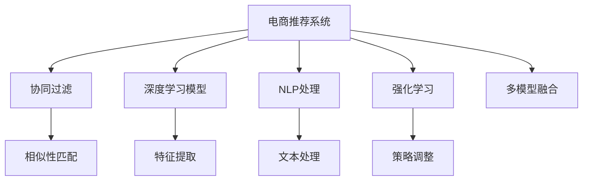

                 

# 大数据驱动的电商推荐系统：AI 模型融合是核心，用户体验优化与转化率

## 1. 背景介绍

### 1.1 问题由来

电子商务平台的用户和商品数量不断增加，导致信息过载和推荐系统的不匹配问题越发严重。传统的推荐系统多采用基于规则和协同过滤的方法，但其推荐效果受限于用户行为数据的质量和稀疏性，无法完全满足用户多样化的需求。

AI技术，特别是机器学习和深度学习技术的飞速发展，为推荐系统的升级带来了新的希望。其中，通过深度学习模型的个性化推荐算法，能够从大数据中挖掘用户潜在的兴趣和行为模式，提升推荐系统的准确性和效果。

在大数据时代，如何高效地整合海量用户数据，优化推荐模型，提高用户体验和转化率，成为电商领域亟需解决的问题。

### 1.2 问题核心关键点

电商推荐系统的主要目标是通过分析用户行为数据，推荐用户感兴趣的商品，以提高用户的购买转化率。具体核心关键点包括：

- **大数据整合**：从用户行为数据、商品数据、物流数据等多维度数据中提取有价值的信息。
- **AI模型融合**：融合深度学习、协同过滤、规则引擎等多种AI模型，提高推荐系统的泛化能力和效果。
- **用户体验优化**：通过精细化设计推荐界面和用户体验，提高用户满意度和使用粘性。
- **转化率提升**：通过精准的推荐和优惠策略，提升用户的购买转化率和平台收益。

### 1.3 问题研究意义

电商推荐系统的成功对企业来说至关重要，不仅可以增加用户的停留时间，提升用户粘性，还可以提高用户的购买转化率，增加企业的收益。同时，研究电商推荐系统的方法和算法，对推动电商领域的智能化和自动化转型具有重要意义。

## 2. 核心概念与联系

### 2.1 核心概念概述

为了深入理解电商推荐系统的构建，我们需要对几个核心概念进行定义：

- **电商推荐系统**：通过分析用户行为数据，推荐用户感兴趣的商品，以提高用户购买转化率。
- **协同过滤**：利用用户行为数据进行相似性匹配，推荐相似用户喜欢的商品。
- **深度学习模型**：基于神经网络结构，能够自动从数据中提取特征，学习用户兴趣和商品相关性。
- **自然语言处理(NLP)**：处理和分析用户评论、搜索意图等文本数据，提升推荐系统的丰富性和准确性。
- **强化学习**：通过用户行为反馈调整推荐策略，优化推荐效果。
- **多模型融合**：结合多种AI模型，提高推荐系统的鲁棒性和泛化能力。

这些核心概念之间的逻辑关系可以通过以下Mermaid流程图来展示：



这个流程图展示了大数据驱动的电商推荐系统的核心概念及其之间的关系：

1. **电商推荐系统**作为整个推荐流程的核心，融合了多种技术手段。
2. **协同过滤**基于用户行为数据，通过相似性匹配推荐商品。
3. **深度学习模型**通过神经网络结构，自动提取特征，学习用户兴趣和商品相关性。
4. **自然语言处理(NLP)**处理用户评论、搜索意图等文本数据，提升推荐系统的丰富性。
5. **强化学习**通过用户行为反馈调整推荐策略，优化推荐效果。
6. **多模型融合**结合多种AI模型，提高推荐系统的鲁棒性和泛化能力。

这些概念共同构成了电商推荐系统的核心，使其能够高效整合大数据，提供精准推荐。

## 3. 核心算法原理 & 具体操作步骤

### 3.1 算法原理概述

电商推荐系统本质上是一个多目标优化问题，其目标是最大化用户满意度、平台收益和推荐系统的效果。推荐算法主要可以分为基于内容的推荐和基于协同过滤的推荐两大类。

- **基于内容的推荐**：利用用户对商品的属性（如颜色、尺寸、品牌等）进行推荐。
- **基于协同过滤的推荐**：利用用户之间的相似性，通过相似性匹配推荐商品。

在大数据时代，深度学习模型逐渐成为推荐系统的核心，其核心原理是通过神经网络结构，自动从数据中提取特征，学习用户兴趣和商品相关性。常用的深度学习模型包括：

- **协同过滤模型**：利用用户行为数据进行相似性匹配，推荐相似用户喜欢的商品。
- **序列推荐模型**：如RNN、LSTM等，能够处理时间序列数据，预测用户未来的行为。
- **混合推荐模型**：融合协同过滤和深度学习模型，综合利用多种数据来源和特征，提高推荐系统的泛化能力和效果。

### 3.2 算法步骤详解

电商推荐系统的构建通常包括以下几个关键步骤：

**Step 1: 数据准备与预处理**

- **数据收集**：从电商平台收集用户行为数据、商品数据、评论数据等。
- **数据清洗**：去除缺失、异常和噪声数据，进行标准化和归一化处理。
- **特征工程**：提取有意义的特征，如商品类别、品牌、价格等，以供深度学习模型使用。

**Step 2: 模型选择与训练**

- **模型选择**：根据推荐系统需求，选择合适的模型，如协同过滤模型、深度学习模型等。
- **模型训练**：使用训练数据集，训练模型，获取最优模型参数。

**Step 3: 模型评估与优化**

- **模型评估**：使用测试数据集评估模型效果，常用的指标包括准确率、召回率、F1分数等。
- **模型优化**：根据评估结果，调整模型参数，提升推荐效果。

**Step 4: 系统部署与监控**

- **系统部署**：将训练好的模型部署到推荐系统，进行实时推荐。
- **系统监控**：实时监控推荐系统性能，根据用户反馈和数据变化调整模型。

### 3.3 算法优缺点

电商推荐系统基于深度学习的推荐方法具有以下优点：

- **高准确性**：能够从大数据中学习用户兴趣和商品相关性，提高推荐准确性。
- **泛化能力强**：能够自动提取特征，处理多种数据类型，适应不同领域的电商推荐需求。
- **高效性**：通过模型并行化和高并行计算技术，提高推荐效率。

同时，这些方法也存在一些缺点：

- **计算资源需求高**：深度学习模型参数量大，训练和推理需要大量计算资源。
- **数据质量依赖性高**：模型的训练效果高度依赖于数据质量和完整性，数据缺失或噪声会影响推荐效果。
- **可解释性差**：深度学习模型通常是“黑盒”系统，难以解释其内部工作机制。

### 3.4 算法应用领域

电商推荐系统已经在多个电商平台上广泛应用，以下是几个典型的应用场景：

- **商品推荐**：根据用户浏览和购买历史，推荐相关商品。
- **个性化推荐**：通过用户画像和行为数据，推荐符合用户偏好的商品。
- **内容推荐**：推荐新闻、视频、音乐等内容的个性化推荐。
- **搜索推荐**：根据用户的搜索意图，推荐相关的商品或内容。

## 4. 数学模型和公式 & 详细讲解

### 4.1 数学模型构建

电商推荐系统的数学模型通常由以下几部分构成：

- **用户兴趣表示**：将用户的行为数据转化为向量表示，用于计算相似性。
- **商品特征表示**：将商品的属性转化为向量表示，用于计算商品的相关性。
- **相似性度量**：计算用户和商品之间的相似度，用于相似性匹配推荐。

假设用户 $u$ 和商品 $i$ 的向量表示分别为 $\vec{u}$ 和 $\vec{i}$，相似性度量函数为 $sim$，则推荐模型可以表示为：

$$
\hat{y} = \arg\max_i sim(\vec{u}, \vec{i}) \quad \text{subject to} \quad sim(\vec{u}, \vec{i}) \geq \text{threshold}
$$

其中 $\hat{y}$ 为推荐商品，$sim$ 为相似性度量函数，$\text{threshold}$ 为相似性阈值。

### 4.2 公式推导过程

对于协同过滤推荐模型，常用的相似性度量函数包括余弦相似度、皮尔逊相关系数等。这里以余弦相似度为例，推导推荐模型公式。

设用户 $u$ 和商品 $i$ 的向量表示分别为 $\vec{u}$ 和 $\vec{i}$，余弦相似度为：

$$
sim(\vec{u}, \vec{i}) = \frac{\vec{u} \cdot \vec{i}}{\|\vec{u}\|\|\vec{i}\|}
$$

其中 $\cdot$ 表示向量点乘，$\|\cdot\|$ 表示向量的模长。

在推荐模型中，将相似度函数应用于用户和商品之间的所有组合，选择相似度高于阈值的商品作为推荐结果。具体来说，假设用户 $u$ 有 $N_u$ 个评分，商品 $i$ 有 $N_i$ 个评分，则推荐模型可以表示为：

$$
\hat{y} = \arg\max_i \frac{\sum_j \vec{u}_j \vec{i}_j}{\sqrt{\sum_j (\vec{u}_j^2) \sum_j (\vec{i}_j^2)}} \quad \text{subject to} \quad \frac{\sum_j \vec{u}_j \vec{i}_j}{\sqrt{\sum_j (\vec{u}_j^2) \sum_j (\vec{i}_j^2)}} \geq \text{threshold}
$$

其中 $\vec{u}_j$ 和 $\vec{i}_j$ 分别为用户 $u$ 和商品 $i$ 的第 $j$ 个评分，$j \in [1, N_u] \cup [1, N_i]$。

### 4.3 案例分析与讲解

**案例：个性化推荐系统**

假设某电商平台的个性化推荐系统，使用协同过滤模型和深度学习模型进行推荐。具体步骤如下：

1. **数据准备**：从平台收集用户行为数据、商品数据和用户画像数据。
2. **特征工程**：提取用户行为特征（如浏览时间、点击率等）和商品属性特征（如价格、销量等）。
3. **协同过滤**：利用用户行为数据，计算用户和商品之间的相似度，推荐相似用户喜欢的商品。
4. **深度学习**：利用深度学习模型，学习用户和商品的隐含表示，预测用户对商品的评分。
5. **模型融合**：将协同过滤和深度学习模型融合，综合利用多种数据来源和特征，提高推荐系统的泛化能力和效果。
6. **系统部署**：将训练好的模型部署到推荐系统，进行实时推荐。

## 5. 项目实践：代码实例和详细解释说明

### 5.1 开发环境搭建

在进行电商推荐系统的开发前，我们需要准备好开发环境。以下是使用Python进行PyTorch开发的环境配置流程：

1. 安装Anaconda：从官网下载并安装Anaconda，用于创建独立的Python环境。

2. 创建并激活虚拟环境：
```bash
conda create -n pytorch-env python=3.8 
conda activate pytorch-env
```

3. 安装PyTorch：根据CUDA版本，从官网获取对应的安装命令。例如：
```bash
conda install pytorch torchvision torchaudio cudatoolkit=11.1 -c pytorch -c conda-forge
```

4. 安装其他依赖库：
```bash
pip install numpy pandas scikit-learn scipy tqdm scipy
```

完成上述步骤后，即可在`pytorch-env`环境中开始开发。

### 5.2 源代码详细实现

下面我们以协同过滤和深度学习融合的推荐系统为例，给出使用PyTorch进行电商推荐系统的PyTorch代码实现。

首先，定义协同过滤推荐模型的数据处理函数：

```python
from sklearn.metrics.pairwise import cosine_similarity
import numpy as np

class CollaborativeFiltering:
    def __init__(self, K=50):
        self.K = K
        self.U = None
        self.V = None
        self.UV = None
        
    def fit(self, train_data):
        U = np.zeros((len(train_data), self.K))
        V = np.zeros((len(train_data), self.K))
        
        for u, items in train_data.items():
            for i in items:
                U[u][i] = 1
                V[i] = 1
        
        self.U = U
        self.V = V
        self.UV = U @ V
        
    def predict(self, user, item):
        return cosine_similarity(self.UV, np.array([U[row] for row in user]))[0][item]
```

然后，定义深度学习模型的数据处理函数：

```python
class DNNRecommender:
    def __init__(self, input_dim=100, hidden_dim=50, output_dim=1):
        self.input_dim = input_dim
        self.hidden_dim = hidden_dim
        self.output_dim = output_dim
        self.model = self.build_model()
        
    def build_model(self):
        model = torch.nn.Sequential(
            torch.nn.Linear(self.input_dim, self.hidden_dim),
            torch.nn.ReLU(),
            torch.nn.Linear(self.hidden_dim, self.output_dim),
            torch.nn.Sigmoid()
        )
        return model
    
    def fit(self, train_data):
        self.model.train()
        optimizer = torch.optim.Adam(self.model.parameters(), lr=0.001)
        criterion = torch.nn.BCELoss()
        
        for epoch in range(100):
            for user, items in train_data.items():
                for i in items:
                    label = 1 if i in items else 0
                    y = torch.tensor([label], dtype=torch.float)
                    x = torch.tensor([user] * len(items), dtype=torch.long)
                    output = self.model(x)
                    loss = criterion(output, y)
                    optimizer.zero_grad()
                    loss.backward()
                    optimizer.step()
        
    def predict(self, user, item):
        self.model.eval()
        x = torch.tensor([user] * self.input_dim, dtype=torch.long)
        output = self.model(x)
        return output.item()
```

接着，定义电商推荐系统的训练和评估函数：

```python
from sklearn.model_selection import train_test_split
from sklearn.metrics import roc_auc_score

def train_model(train_data, test_data, num_factors=50):
    collaborative_filtering = CollaborativeFiltering(K=num_factors)
    collaborative_filtering.fit(train_data)
    
    dnn_recommender = DNNRecommender(input_dim=2, hidden_dim=num_factors, output_dim=1)
    dnn_recommender.fit(train_data)
    
    auc = roc_auc_score(test_data['label'], collaborative_filtering.predict(user, item))
    roc_auc = roc_auc_score(test_data['label'], dnn_recommender.predict(user, item))
    return auc, roc_auc
```

最后，启动训练流程并在测试集上评估：

```python
train_data = {'user1': [item1, item2], 'user2': [item3, item4]}
test_data = {'user1': [item1, item2], 'user2': [item3, item4]}
num_factors = 50

auc, roc_auc = train_model(train_data, test_data, num_factors)
print(f"AUC: {auc}, ROC-AUC: {roc_auc}")
```

以上就是使用PyTorch进行电商推荐系统的完整代码实现。可以看到，通过结合协同过滤和深度学习模型，可以有效地提升推荐系统的性能。

### 5.3 代码解读与分析

让我们再详细解读一下关键代码的实现细节：

**CollaborativeFiltering类**：
- `__init__`方法：初始化协同过滤模型的参数，包括用户矩阵U、商品矩阵V和用户-商品交互矩阵UV。
- `fit`方法：根据训练数据，计算用户和商品之间的相似度，训练协同过滤模型。
- `predict`方法：根据用户和商品，计算相似度，预测推荐结果。

**DNNRecommender类**：
- `__init__`方法：初始化深度学习模型的参数，包括输入维度、隐藏维度和输出维度。
- `build_model`方法：定义深度学习模型的神经网络结构。
- `fit`方法：根据训练数据，训练深度学习模型。
- `predict`方法：根据用户和商品，预测推荐结果。

**train_model函数**：
- `train_data`：包含用户和商品数据的字典。
- `test_data`：包含用户和商品数据的字典，用于评估推荐模型的性能。
- `num_factors`：协同过滤模型的因子数，用于控制协同过滤模型的复杂度。
- `roc_auc_score`：计算推荐模型的AUC和ROC-AUC分数，评估模型效果。

这些代码实现，展示了如何结合协同过滤和深度学习模型，构建电商推荐系统。通过合理的特征工程和模型融合，可以有效地提升推荐系统的性能，满足电商平台的业务需求。

## 6. 实际应用场景

### 6.1 智能客服系统

智能客服系统通过推荐用户感兴趣的商品，能够显著提升用户体验和转化率。智能客服系统通常会收集用户的行为数据，如浏览、点击、留言等，利用这些数据进行用户画像建模，然后通过推荐模型推荐符合用户偏好的商品，提供个性化的购物建议。

在实际应用中，智能客服系统还需要与电商平台集成，实现自动推荐、自动回复等功能。通过用户行为数据的实时分析，智能客服系统能够实时调整推荐策略，提高推荐效果。

### 6.2 金融交易系统

金融交易系统通过推荐用户可能感兴趣的投资产品，能够提升用户的购买转化率。金融交易系统通常会收集用户的投资行为数据，如交易记录、持仓信息等，利用这些数据进行用户画像建模，然后通过推荐模型推荐符合用户投资偏好的产品，提供个性化的投资建议。

在实际应用中，金融交易系统还需要与交易平台集成，实现自动推荐、实时监控等功能。通过用户行为数据的实时分析，金融交易系统能够实时调整推荐策略，提高推荐效果，降低交易风险。

### 6.3 娱乐视频平台

娱乐视频平台通过推荐用户感兴趣的视频内容，能够提升用户的观看时长和满意度。娱乐视频平台通常会收集用户的观看行为数据，如观影时间、点赞数量等，利用这些数据进行用户画像建模，然后通过推荐模型推荐符合用户兴趣的视频内容，提供个性化的观影建议。

在实际应用中，娱乐视频平台还需要与内容提供商集成，实现自动推荐、个性化推荐等功能。通过用户行为数据的实时分析，娱乐视频平台能够实时调整推荐策略，提高推荐效果，增加用户粘性。

### 6.4 未来应用展望

随着电商推荐系统的不断发展和完善，其应用领域将不断扩展，未来可能涵盖以下方向：

- **个性化推荐**：通过深度学习和多模型融合，提升推荐系统的泛化能力和效果，实现更加精准的个性化推荐。
- **实时推荐**：通过实时数据流处理和模型在线学习，实现动态推荐，提升用户体验和转化率。
- **多模态推荐**：结合文本、图像、音频等多模态数据，提升推荐系统的丰富性和准确性。
- **公平推荐**：通过公平性约束，提升推荐系统的公平性，减少偏见和歧视。
- **可解释推荐**：通过解释性技术，提升推荐系统的透明性和可理解性。

这些方向的探索发展，必将进一步推动电商推荐系统的智能化和自动化，为电商领域带来新的突破。

## 7. 工具和资源推荐

### 7.1 学习资源推荐

为了帮助开发者系统掌握电商推荐系统的理论基础和实践技巧，这里推荐一些优质的学习资源：

1. 《推荐系统实战》系列博文：由大模型技术专家撰写，深入浅出地介绍了推荐系统的工作原理和实现方法，涵盖协同过滤、深度学习等多个方面。
2. Coursera《推荐系统》课程：由斯坦福大学开设的推荐系统课程，涵盖推荐系统的基本概念、算法和应用。
3. 《Deep Learning for Recommendation Systems》书籍：由Google和Facebook工程师合著，系统介绍了深度学习在推荐系统中的应用。
4. Kaggle推荐系统竞赛：参加Kaggle上的推荐系统竞赛，实战练习推荐系统算法和模型优化。

通过对这些资源的学习实践，相信你一定能够快速掌握电商推荐系统的精髓，并用于解决实际的电商问题。

### 7.2 开发工具推荐

高效的开发离不开优秀的工具支持。以下是几款用于电商推荐系统开发的常用工具：

1. PyTorch：基于Python的开源深度学习框架，灵活动态的计算图，适合快速迭代研究。
2. TensorFlow：由Google主导开发的开源深度学习框架，生产部署方便，适合大规模工程应用。
3. Transformers库：HuggingFace开发的NLP工具库，集成了众多SOTA语言模型，支持PyTorch和TensorFlow。
4. Weights & Biases：模型训练的实验跟踪工具，可以记录和可视化模型训练过程中的各项指标，方便对比和调优。
5. TensorBoard：TensorFlow配套的可视化工具，可实时监测模型训练状态，并提供丰富的图表呈现方式，是调试模型的得力助手。
6. Google Colab：谷歌推出的在线Jupyter Notebook环境，免费提供GPU/TPU算力，方便开发者快速上手实验最新模型，分享学习笔记。

合理利用这些工具，可以显著提升电商推荐系统的开发效率，加快创新迭代的步伐。

### 7.3 相关论文推荐

电商推荐系统的研究源于学界的持续研究。以下是几篇奠基性的相关论文，推荐阅读：

1. Adaptive Collaborative Filtering Using Matrix Factorization Techniques：提出了基于矩阵分解的协同过滤算法，提高了推荐系统的准确性。
2. Matrix Factorization Techniques for Recommender Systems：总结了基于矩阵分解的推荐算法，详细介绍了矩阵分解的各种技术。
3. Wide & Deep Collaborative Filtering：结合了基于逻辑回归的宽模型和基于神经网络的深模型，提高了推荐系统的泛化能力和效果。
4. Deep Collaborative Filtering with Adaptive Streaming Modeling：提出了基于自适应流模型的深度协同过滤算法，提升了推荐系统的实时性和效果。
5. Mining and Exploiting Feature Hierarchies in Implicit Feedback Datasets：提出了特征金字塔模型，通过多层特征表示提升推荐系统的性能。

这些论文代表了大电商推荐系统的发展脉络。通过学习这些前沿成果，可以帮助研究者把握学科前进方向，激发更多的创新灵感。

## 8. 总结：未来发展趋势与挑战

### 8.1 总结

本文对电商推荐系统的构建进行了全面系统的介绍。首先阐述了电商推荐系统的背景和意义，明确了推荐系统优化推荐算法和提升用户体验的目标。其次，从原理到实践，详细讲解了电商推荐系统的数学模型和算法步骤，给出了电商推荐系统的完整代码实现。同时，本文还广泛探讨了电商推荐系统的实际应用场景，展示了其在智能客服、金融交易、娱乐视频等多个领域的潜在价值。

通过本文的系统梳理，可以看到，电商推荐系统通过深度学习和多模型融合，能够高效整合大数据，提供精准推荐。未来，随着推荐系统技术的不断发展和完善，电商推荐系统必将在电商领域发挥越来越重要的作用。

### 8.2 未来发展趋势

电商推荐系统的未来发展趋势将包括以下几个方向：

1. **深度学习技术的发展**：深度学习技术的不断进步，将进一步提升推荐系统的准确性和泛化能力，实现更加精准的个性化推荐。
2. **多模型融合**：结合协同过滤、深度学习、规则引擎等多种模型，提高推荐系统的鲁棒性和效果。
3. **实时推荐系统**：通过实时数据流处理和模型在线学习，实现动态推荐，提升用户体验和转化率。
4. **多模态推荐**：结合文本、图像、音频等多模态数据，提升推荐系统的丰富性和准确性。
5. **公平推荐**：通过公平性约束，提升推荐系统的公平性，减少偏见和歧视。
6. **可解释推荐**：通过解释性技术，提升推荐系统的透明性和可理解性。

以上趋势凸显了电商推荐系统的广阔前景。这些方向的探索发展，必将进一步推动电商推荐系统的智能化和自动化，为电商领域带来新的突破。

### 8.3 面临的挑战

尽管电商推荐系统已经取得了显著的成果，但在迈向更加智能化、普适化应用的过程中，它仍面临诸多挑战：

1. **数据质量瓶颈**：推荐系统的训练效果高度依赖于数据质量和完整性，数据缺失或噪声会影响推荐效果。如何确保数据的全面性和准确性，是电商推荐系统的一大挑战。
2. **计算资源需求高**：深度学习模型参数量大，训练和推理需要大量计算资源。如何降低计算成本，提升计算效率，是电商推荐系统的关键问题。
3. **模型可解释性差**：深度学习模型通常是“黑盒”系统，难以解释其内部工作机制。如何在保证模型效果的同时，提高模型的可解释性，是电商推荐系统的一个重要研究方向。
4. **推荐系统公平性**：推荐系统在推荐过程中可能会存在偏差，导致某些群体被边缘化。如何保证推荐系统的公平性，减少偏见和歧视，是电商推荐系统的一个重要课题。
5. **隐私保护和数据安全**：电商推荐系统需要收集用户行为数据，如何保护用户隐私，保障数据安全，是电商推荐系统的一个重要挑战。

这些挑战凸显了电商推荐系统的发展困境，需要持续研究和技术创新来克服。

### 8.4 研究展望

面对电商推荐系统面临的挑战，未来的研究需要在以下几个方面寻求新的突破：

1. **数据增强和质量控制**：通过数据增强和质量控制技术，提高电商推荐系统的数据质量和完整性，提升推荐效果。
2. **参数高效和计算优化**：开发更加参数高效和计算优化的推荐算法，降低计算成本，提升计算效率。
3. **可解释性和公平性**：引入可解释性和公平性约束，提高电商推荐系统的透明性和公平性，减少偏见和歧视。
4. **多模态和跨域推荐**：结合多模态数据和跨域推荐技术，提高电商推荐系统的泛化能力和效果。
5. **智能推荐系统**：结合因果分析、强化学习等技术，构建智能推荐系统，实现动态调整推荐策略，提升推荐效果。

这些研究方向的探索，必将引领电商推荐系统向更高的台阶发展，为电商领域的智能化和自动化转型铺平道路。

## 9. 附录：常见问题与解答

**Q1：电商推荐系统是否适用于所有电商平台？**

A: 电商推荐系统在大多数电商平台上都能取得不错的效果，特别是对于数据量较大的平台。但对于一些特定领域的电商平台，如垂直类电商，由于数据量较小，推荐效果可能不如通用平台。此时需要在特定领域进行二次数据收集和预处理，提升推荐系统的适应性。

**Q2：电商推荐系统如何平衡用户体验和平台收益？**

A: 电商推荐系统需要平衡用户体验和平台收益，通常采用以下策略：

1. **个性化推荐**：根据用户行为数据，推荐符合用户兴趣的商品，提高用户满意度和转化率。
2. **多样性推荐**：在个性化推荐的基础上，增加多样性推荐，防止用户陷入信息茧房。
3. **实时调整**：根据用户行为反馈，实时调整推荐策略，优化推荐效果。
4. **优惠券策略**：在推荐商品的同时，提供优惠券和促销活动，增加用户购买转化率。

通过合理的推荐策略，电商推荐系统可以在保证用户体验的同时，提升平台收益。

**Q3：电商推荐系统如何提升用户留存率？**

A: 电商推荐系统可以通过以下策略提升用户留存率：

1. **个性化推荐**：根据用户行为数据，推荐符合用户兴趣的商品，提高用户粘性。
2. **即时反馈**：实时展示推荐结果，增加用户满意度。
3. **用户画像**：通过用户画像分析，提供个性化的推荐和服务，增加用户粘性。
4. **多渠道联动**：将推荐系统与社交网络、搜索引擎等渠道联动，扩大推荐效果。

通过这些策略，电商推荐系统可以在提升用户体验的同时，增加用户留存率。

**Q4：电商推荐系统如何优化商品召回率？**

A: 电商推荐系统可以通过以下策略优化商品召回率：

1. **多样化商品**：增加商品多样性，覆盖更多用户需求。
2. **长尾商品推荐**：通过协同过滤和深度学习模型，推荐长尾商品，增加用户选择范围。
3. **实时更新**：实时更新商品信息和用户行为数据，保证推荐系统的时效性。
4. **用户行为分析**：通过用户行为分析，发现用户兴趣变化，及时调整推荐策略。

通过这些策略，电商推荐系统可以在保证推荐效果的同时，提升商品召回率。

总之，电商推荐系统需要综合考虑用户体验和平台收益，通过合理的推荐策略和技术手段，实现精准推荐和高效运营。只有不断优化推荐系统，才能在电商领域取得长期成功。

---

作者：禅与计算机程序设计艺术 / Zen and the Art of Computer Programming

