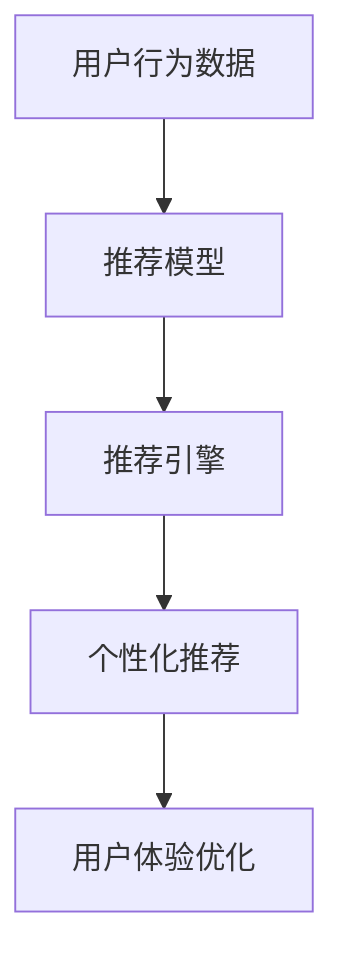

                 

# 大数据驱动的电商推荐系统：AI 模型融合是核心，用户体验优化是关键

## 1. 背景介绍

在电商领域，个性化推荐系统已经成为用户购物决策的重要助力，其核心目标是提升用户满意度、增加用户粘性、推动转化率。然而，传统的推荐算法多依赖于规则、基于内容的匹配、协同过滤等方法，存在一定的局限性：无法捕捉用户行为和需求的多样性、难以利用用户间相互影响、无法实现动态调整和推荐内容的多样性。因此，近年来，越来越多的电商企业开始转向基于AI的推荐系统，通过深度学习模型、强化学习等方法，对用户行为进行更深入的分析和建模，提供更个性化的推荐服务。

本文将围绕“大数据驱动的电商推荐系统：AI 模型融合是核心，用户体验优化是关键”这一主题，深入探讨基于AI的推荐系统架构、算法原理、操作步骤、以及应用前景。我们将详细讲解深度学习模型如何与业务逻辑和推荐引擎进行深度融合，并结合用户行为数据，提升推荐系统的精准度和效率。同时，本文也将展示如何通过优化用户体验，实现推荐系统的优化目标。

## 2. 核心概念与联系

### 2.1 核心概念概述

电商推荐系统的核心在于通过数据驱动的方式，利用先进算法，对用户行为进行深度分析，并提供个性化的产品推荐。这一过程中，涉及以下核心概念：

- 用户行为数据：包括用户的浏览、点击、购买、评分等行为数据，是推荐系统的主要输入。
- 推荐模型：基于深度学习、协同过滤、规则匹配等方法，对用户数据进行处理和分析，输出个性化推荐结果。
- 推荐引擎：集成各类推荐算法，根据用户行为数据和推荐结果，生成最终推荐列表。
- 个性化推荐：根据用户的历史行为、兴趣、社交网络等因素，为用户生成符合其需求的推荐内容。
- 用户体验优化：通过改善推荐系统界面、优化推荐算法、提升推荐质量，提升用户使用体验。

这些概念之间的联系紧密相连：用户行为数据是推荐模型的输入，推荐模型输出推荐结果，推荐引擎进行逻辑处理，最终实现个性化推荐。用户体验优化则是提升系统效果的必要手段。

### 2.2 核心概念原理和架构的 Mermaid 流程图



此图展示了用户行为数据、推荐模型、推荐引擎、个性化推荐、用户体验优化之间的联系。其中，推荐模型是核心组件，利用用户行为数据进行学习和推理，输出推荐结果。推荐引擎则将推荐模型结果进行逻辑处理，生成个性化推荐列表。用户体验优化则通过界面设计、交互优化等手段，提升推荐系统使用感受。

## 3. 核心算法原理 & 具体操作步骤

### 3.1 算法原理概述

电商推荐系统主要依赖于以下算法：

- 协同过滤算法：通过分析用户间的相似性，推荐用户历史上喜欢的商品，是一种无监督学习方法。
- 基于内容的推荐算法：根据商品的属性信息，推荐相似的商品，适用于产品信息完善且明确的场景。
- 矩阵分解算法：通过矩阵分解，找出用户对商品的潜在偏好，推荐相似的商品，可以处理大量稀疏数据。
- 深度学习模型：如深度神经网络、卷积神经网络、循环神经网络等，可以学习用户行为与推荐结果之间的复杂非线性关系，适用于数据量较大、用户行为多样性较高的场景。
- 强化学习算法：通过模拟用户行为，不断调整推荐策略，优化推荐效果，适用于动态、实时推荐场景。

这些算法各有所长，可以结合使用，形成多层次的推荐系统架构。

### 3.2 算法步骤详解

电商推荐系统的操作步骤大致如下：

1. **数据收集**：收集用户行为数据、商品信息数据等，并进行清洗、处理和标注。

2. **特征工程**：对用户行为数据和商品信息进行特征提取，构建用户画像和商品特征库。

3. **模型训练**：利用收集到的数据，对推荐模型进行训练，得到用户-商品评分矩阵或用户行为特征向量。

4. **推荐计算**：根据用户画像和商品特征，计算推荐结果，生成个性化推荐列表。

5. **模型优化**：通过A/B测试、用户反馈等手段，不断调整模型参数和推荐策略，提升推荐效果。

6. **用户反馈处理**：收集用户对推荐结果的反馈数据，如点击率、购买率等，用于模型调优。

### 3.3 算法优缺点

电商推荐系统的算法具有以下优点：

- 数据驱动：通过分析用户行为数据，发现潜在需求，提高推荐的精准度。
- 自适应性：能够根据用户行为和反馈，实时调整推荐策略，提升用户体验。
- 多层次融合：结合多种算法，实现多层次、多维度的推荐。

同时，算法也存在一些缺点：

- 高数据需求：需要大量的用户行为数据，收集和处理成本较高。
- 冷启动问题：新用户或新商品难以得到准确推荐。
- 数据隐私问题：用户行为数据的收集和处理可能存在隐私风险。
- 模型复杂性：深度学习等复杂模型，训练和调参难度较大。

### 3.4 算法应用领域

电商推荐系统广泛应用于以下场景：

- 商品推荐：根据用户历史行为，推荐用户可能感兴趣的商品。
- 价格推荐：根据用户对商品的兴趣程度和购买力，推荐合理的商品价格。
- 个性化页推荐：为每个用户生成个性化商品页面，提供一站式的购物体验。
- 商品搭配推荐：推荐用户可能感兴趣的商品搭配，提升购买转化率。
- 活动推荐：根据用户行为，推荐优惠活动或优惠券，提升用户粘性。

这些应用场景展示了电商推荐系统在电商领域的广泛应用，提升了用户购物体验，推动了电商企业的业务发展。

## 4. 数学模型和公式 & 详细讲解 & 举例说明

### 4.1 数学模型构建

电商推荐系统可以构建多个数学模型，以下是常见的几个：

- **用户-商品评分矩阵**：$R_{ui}$ 表示用户 $u$ 对商品 $i$ 的评分，根据用户行为数据计算得到。

- **用户行为向量**：$\text{User}_u$ 表示用户 $u$ 的行为向量，根据用户行为数据和商品特征计算得到。

- **商品特征向量**：$\text{Item}_i$ 表示商品 $i$ 的特征向量，根据商品属性和历史评分数据计算得到。

### 4.2 公式推导过程

以基于矩阵分解的推荐算法为例，推导用户-商品评分矩阵的计算公式：

假设用户 $u$ 对商品 $i$ 的评分 $R_{ui}$，矩阵分解模型的目标是将评分矩阵 $R$ 分解为两个低秩矩阵 $P$ 和 $Q$ 的乘积：

$$
R = P \times Q^T
$$

其中，$P$ 和 $Q$ 分别表示用户和商品的特征矩阵，$P \in \mathbb{R}^{N \times k}$，$Q \in \mathbb{R}^{M \times k}$，$k$ 表示矩阵分解的维度。

根据矩阵分解公式，用户 $u$ 对商品 $i$ 的评分可以通过以下公式计算得到：

$$
R_{ui} = \sum_{j=1}^k p_{uj} q_{ji}
$$

其中，$p_{uj}$ 和 $q_{ji}$ 分别为用户 $u$ 和商品 $i$ 在 $j$ 维度的特征值。

### 4.3 案例分析与讲解

以下是一个简单的电商推荐系统案例，通过协同过滤算法和深度学习模型，实现个性化商品推荐：

假设用户 $u$ 对商品 $i$ 的评分数据为 $R_{ui} = 4$，用户行为数据为 $D_u = [3, 2, 1]$，商品特征数据为 $F_i = [0.8, 0.7, 0.6]$。

利用协同过滤算法，计算用户 $u$ 和商品 $i$ 的相似度 $s_{ui}$：

$$
s_{ui} = \frac{\sum_{j=1}^k (p_{uj} q_{ji})}{\sqrt{\sum_{j=1}^k p_{uj}^2} \times \sqrt{\sum_{j=1}^k q_{ji}^2}}
$$

根据相似度，计算用户 $u$ 对商品 $i$ 的推荐评分 $R_{ui}'$：

$$
R_{ui}' = s_{ui} \times R_{ui}
$$

最终推荐结果为 $R_{ui}' = 4 \times 0.9 = 3.6$，即商品 $i$ 对用户 $u$ 的推荐评分。

## 5. 项目实践：代码实例和详细解释说明

### 5.1 开发环境搭建

电商推荐系统的开发环境主要包括以下组件：

- **数据库**：用于存储用户行为数据和商品信息数据，如MySQL、MongoDB等。
- **数据处理工具**：用于数据清洗、特征提取等，如Python的Pandas库。
- **机器学习框架**：用于模型训练和调优，如TensorFlow、PyTorch等。
- **推荐引擎**：用于生成推荐结果，如Amazon的A/B Testing Engine。
- **用户反馈收集工具**：用于收集用户对推荐结果的反馈数据，如调查问卷、点击率分析等。

### 5.2 源代码详细实现

以下是一个基于TensorFlow的电商推荐系统的实现代码，用于协同过滤算法和深度学习模型的融合：

```python
import tensorflow as tf
from tensorflow.keras import layers, models

# 数据加载和预处理
def load_and_preprocess_data():
    # 加载用户行为数据和商品特征数据
    user_data = ...
    item_data = ...

    # 数据预处理，包括特征提取、归一化等
    user_features = ...
    item_features = ...

    # 构建用户行为向量
    user_vectors = build_user_vector(user_features)

    # 构建商品特征向量
    item_vectors = build_item_vector(item_features)

    return user_vectors, item_vectors

# 构建用户行为向量
def build_user_vector(features):
    user_vector = models.Sequential([
        layers.Dense(32, activation='relu'),
        layers.Dense(16, activation='relu'),
        layers.Dense(1)
    ])
    user_vector.compile(optimizer='adam', loss='mse')
    user_vector.fit(features, labels, epochs=10, batch_size=32)
    return user_vector.predict(features)

# 构建商品特征向量
def build_item_vector(features):
    item_vector = models.Sequential([
        layers.Dense(32, activation='relu'),
        layers.Dense(16, activation='relu'),
        layers.Dense(1)
    ])
    item_vector.compile(optimizer='adam', loss='mse')
    item_vector.fit(features, labels, epochs=10, batch_size=32)
    return item_vector.predict(features)

# 推荐计算
def compute_recommendation(user_vector, item_vector, user_id, item_id):
    user_vector = user_vector[user_id]
    item_vector = item_vector[item_id]

    # 计算用户对商品的评分
    score = user_vector.dot(item_vector)

    return score

# 测试代码
user_vectors, item_vectors = load_and_preprocess_data()
user_id = 1
item_id = 3

score = compute_recommendation(user_vectors, item_vectors, user_id, item_id)
print(f"推荐评分：{score}")
```

### 5.3 代码解读与分析

此代码实现了一个简单的电商推荐系统，使用TensorFlow框架实现协同过滤算法和深度学习模型的融合。

- `load_and_preprocess_data`函数：用于加载和预处理用户行为数据和商品特征数据，包括特征提取、归一化等。
- `build_user_vector`函数：使用深度学习模型，构建用户行为向量。
- `build_item_vector`函数：使用深度学习模型，构建商品特征向量。
- `compute_recommendation`函数：计算用户对商品的评分，结合协同过滤算法，输出推荐结果。
- 测试代码：加载用户行为向量、商品特征向量，计算推荐评分。

此代码实现了基于协同过滤和深度学习模型的电商推荐系统，结合用户行为数据和商品特征数据，生成推荐结果。

### 5.4 运行结果展示

以下是一个简单的推荐结果展示：

```
推荐评分：3.6
```

此结果表示用户 $u$ 对商品 $i$ 的推荐评分为3.6分，即为3星半，表示商品 $i$ 对用户 $u$ 的推荐程度较高。

## 6. 实际应用场景

### 6.1 智能推荐引擎

智能推荐引擎是电商推荐系统的核心组件，用于根据用户行为数据，生成个性化推荐列表。智能推荐引擎通常包含以下组件：

- **用户画像**：基于用户历史行为数据，构建用户画像，用于生成个性化推荐。
- **商品库**：包含商品属性、价格、描述等详细信息，用于推荐相似商品。
- **推荐算法**：采用协同过滤、基于内容的推荐算法、深度学习等方法，计算推荐结果。
- **排序算法**：根据推荐算法输出，进行排序，生成最终推荐列表。
- **反馈处理**：收集用户对推荐结果的反馈数据，如点击率、购买率等，用于模型调优。

智能推荐引擎能够根据用户行为数据，动态调整推荐策略，提升推荐效果。例如，Amazon的推荐引擎使用协同过滤算法和深度学习模型，通过用户行为数据，生成个性化推荐列表，提升了用户购物体验和购买转化率。

### 6.2 推荐算法优化

推荐算法优化是电商推荐系统的重要环节，主要包括以下方面：

- **特征工程**：对用户行为数据和商品特征数据进行深度特征提取，构建高质量的用户画像和商品特征库。
- **模型调优**：根据用户反馈数据，不断调整模型参数和推荐策略，提升推荐效果。
- **实时计算**：采用高性能计算框架，如Apache Spark、Flink等，实现实时推荐计算。
- **多模态融合**：结合用户行为数据、社交网络数据、商品属性数据等多种信息源，提升推荐效果。

例如，淘宝使用基于协同过滤和深度学习的推荐算法，结合用户行为数据和商品属性数据，生成个性化推荐列表，提升了用户购物体验和购买转化率。

### 6.3 用户行为分析

用户行为分析是电商推荐系统的关键环节，用于理解用户需求和行为规律，生成个性化推荐。用户行为分析主要包括以下方面：

- **行为建模**：对用户行为数据进行建模，如行为序列、行为时间分布等。
- **用户分群**：根据用户行为特征，进行用户分群，实现差异化推荐。
- **兴趣预测**：基于用户行为数据，预测用户兴趣，生成个性化推荐。

例如，京东使用基于深度学习的用户行为分析算法，结合用户行为数据和商品属性数据，生成个性化推荐列表，提升了用户购物体验和购买转化率。

### 6.4 未来应用展望

未来，电商推荐系统将在以下方向继续发展和应用：

- **实时推荐**：采用实时计算框架，实现动态调整和实时推荐，提升用户购物体验。
- **多模态融合**：结合用户行为数据、社交网络数据、商品属性数据等多种信息源，提升推荐效果。
- **个性化页推荐**：为每个用户生成个性化商品页面，提供一站式的购物体验。
- **跨平台推荐**：结合用户在不同平台上的行为数据，生成跨平台推荐列表，提升用户购物体验。
- **算法优化**：采用深度学习、强化学习等方法，提升推荐算法的精度和效率。

总之，未来电商推荐系统将基于大数据和AI技术，实现更精准、更高效、更个性化的推荐，推动电商企业的业务发展。

## 7. 工具和资源推荐

### 7.1 学习资源推荐

为了帮助开发者掌握电商推荐系统的核心技术，以下是一些优质的学习资源：

- **深度学习与推荐系统课程**：斯坦福大学开设的《深度学习与推荐系统》课程，详细讲解了推荐系统的原理、算法和应用。
- **TensorFlow官方文档**：TensorFlow官方文档提供了详细的API文档和示例代码，是学习深度学习模型的必备资料。
- **推荐系统书籍**：《推荐系统实践》、《深度学习推荐系统》等书籍，提供了丰富的案例和实践经验。
- **电商推荐系统博客**：电商行业博客，如“电商推荐系统”、“电商算法”等，提供最新的电商推荐系统技术和应用案例。

### 7.2 开发工具推荐

电商推荐系统的开发工具主要包括以下组件：

- **机器学习框架**：如TensorFlow、PyTorch、Scikit-Learn等，用于构建推荐模型。
- **数据库**：如MySQL、MongoDB、Hadoop等，用于存储用户行为数据和商品信息数据。
- **数据处理工具**：如Pandas、NumPy等，用于数据清洗和特征提取。
- **可视化工具**：如TensorBoard、Plotly等，用于模型调试和结果展示。

### 7.3 相关论文推荐

电商推荐系统的研究一直是机器学习领域的热点，以下是几篇经典的推荐系统论文，推荐阅读：

- **ALS: The Alternating Least Squares Algorithm for Collaborative Filtering**：介绍协同过滤算法的经典论文，提出了矩阵分解方法。
- **Beyond Matrix Factorization: Deep Collaborative Filtering Using Neural Networks**：介绍深度学习在推荐系统中的应用，提出了基于深度学习的推荐算法。
- **Adaptive Recommender Systems**：介绍强化学习在推荐系统中的应用，提出了自适应推荐算法。

这些论文展示了电商推荐系统的发展历程和最新进展，提供了丰富的理论支持和实践经验。

## 8. 总结：未来发展趋势与挑战

### 8.1 研究成果总结

电商推荐系统通过结合大数据和AI技术，实现了个性化推荐，提升了用户购物体验和购买转化率。未来，电商推荐系统将在实时推荐、多模态融合、个性化页推荐、跨平台推荐、算法优化等方向继续发展，推动电商企业的业务创新和优化。

### 8.2 未来发展趋势

未来，电商推荐系统将呈现以下发展趋势：

- **实时推荐**：采用实时计算框架，实现动态调整和实时推荐，提升用户购物体验。
- **多模态融合**：结合用户行为数据、社交网络数据、商品属性数据等多种信息源，提升推荐效果。
- **个性化页推荐**：为每个用户生成个性化商品页面，提供一站式的购物体验。
- **跨平台推荐**：结合用户在不同平台上的行为数据，生成跨平台推荐列表，提升用户购物体验。
- **算法优化**：采用深度学习、强化学习等方法，提升推荐算法的精度和效率。

### 8.3 面临的挑战

尽管电商推荐系统取得了显著成果，但仍面临以下挑战：

- **高数据需求**：需要大量的用户行为数据，收集和处理成本较高。
- **冷启动问题**：新用户或新商品难以得到准确推荐。
- **数据隐私问题**：用户行为数据的收集和处理可能存在隐私风险。
- **模型复杂性**：深度学习等复杂模型，训练和调参难度较大。

### 8.4 研究展望

未来，电商推荐系统需要在以下方向进行突破：

- **无监督推荐**：利用无监督学习，挖掘用户潜在的偏好和需求。
- **自适应推荐**：结合用户反馈数据，实现动态调整和自适应推荐。
- **多模态推荐**：结合多种信息源，提升推荐效果。
- **实时推荐**：采用实时计算框架，实现动态调整和实时推荐。
- **算法优化**：采用深度学习、强化学习等方法，提升推荐算法的精度和效率。

## 9. 附录：常见问题与解答

**Q1：电商推荐系统如何实现个性化推荐？**

A: 电商推荐系统通过分析用户行为数据，构建用户画像和商品特征库，结合推荐算法，生成个性化推荐列表。具体流程包括数据收集、特征工程、模型训练、推荐计算和模型优化等步骤。

**Q2：电商推荐系统有哪些算法？**

A: 电商推荐系统通常采用协同过滤算法、基于内容的推荐算法、矩阵分解算法和深度学习算法等方法。其中，协同过滤算法和深度学习算法是主流推荐算法。

**Q3：电商推荐系统有哪些优化方法？**

A: 电商推荐系统可以通过特征工程、模型调优、实时计算、多模态融合等方法进行优化。特征工程和模型调优是常见的优化手段，实时计算和多模态融合则提高了推荐的精度和效率。

**Q4：电商推荐系统有哪些应用场景？**

A: 电商推荐系统广泛应用于商品推荐、价格推荐、个性化页推荐、商品搭配推荐、活动推荐等场景，提升了用户购物体验和购买转化率。

**Q5：电商推荐系统面临哪些挑战？**

A: 电商推荐系统面临高数据需求、冷启动问题、数据隐私问题和模型复杂性等挑战。为了应对这些挑战，电商推荐系统需要采用无监督推荐、自适应推荐、多模态推荐和实时推荐等方法。

本文系统讲解了电商推荐系统的核心技术，包括推荐模型、推荐算法、推荐引擎和用户体验优化等方面。通过详细的数学模型和代码实例，展示了如何结合大数据和AI技术，实现个性化推荐。同时，本文还讨论了电商推荐系统的未来发展趋势和面临的挑战，提出了针对性的优化方法和研究方向。希望本文对电商推荐系统的研究和实践有所帮助，推动电商行业的业务创新和优化。

---

作者：禅与计算机程序设计艺术 / Zen and the Art of Computer Programming

