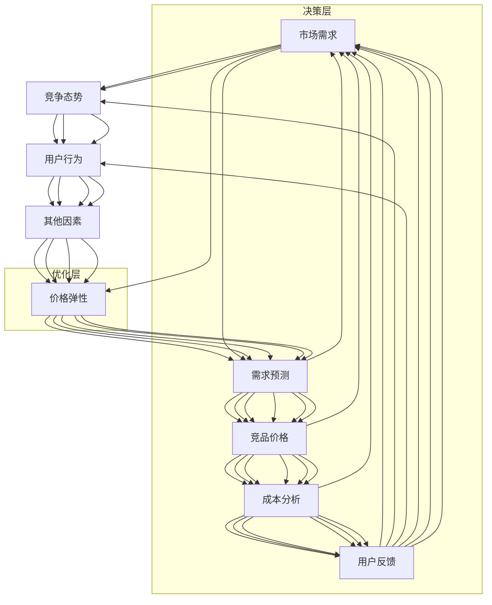

                 

# 大模型在动态定价中的多因素决策应用

> 关键词：动态定价, 大模型, 多因素决策, 深度学习, 强化学习, 优化算法

## 1. 背景介绍

### 1.1 问题由来
动态定价（Dynamic Pricing）是一种基于市场需求和竞争态势实时调整产品价格以最大化收益的策略。这一策略在航空、酒店、零售、电影票务等领域得到了广泛应用，旨在通过精准把握市场供需关系，有效提升企业收益。然而，传统的动态定价方法通常依赖于统计模型或规则引擎，难以适应复杂多变的环境。

大模型的崛起，尤其是深度学习（Deep Learning）和强化学习（Reinforcement Learning, RL）的兴起，为动态定价注入了新的活力。通过训练大模型，可以更深入地理解市场需求和价格弹性的内在关系，从而做出更加精准的定价决策。本文将探讨大模型在动态定价中的应用，尤其聚焦于多因素决策模型构建及其优势。

## 2. 核心概念与联系

### 2.1 核心概念概述

为了更好地理解大模型在动态定价中的应用，我们先简要概述以下几个关键概念：

- **动态定价**：基于市场需求和竞争态势，实时调整产品价格以最大化收益的策略。
- **大模型**：以深度神经网络为代表，通过大规模数据训练，具有强大学习和预测能力的大规模模型。
- **多因素决策**：通过综合考虑多个因素，如市场需求、竞争态势、用户行为等，进行决策推理的过程。
- **深度学习**：一种基于人工神经网络的机器学习范式，通过多层次的非线性变换，实现对复杂数据的建模和预测。
- **强化学习**：一种通过与环境互动，通过奖励信号不断优化策略的学习方法，适用于动态环境中的决策问题。

这些概念之间的联系主要体现在：大模型通过深度学习或强化学习，可以学习并利用多因素数据进行动态定价的决策。多因素决策模型是动态定价中大模型的应用之一，旨在通过考虑更多的输入变量和环境动态变化，提升定价决策的精确度和稳健性。

### 2.2 核心概念原理和架构的 Mermaid 流程图



这个流程图展示了动态定价中多因素决策的架构。市场需求、竞争态势、用户行为等数据通过大模型进行融合和分析，转化为对价格弹性的预测。预测结果经过优化层的迭代调整，最终得到动态定价决策。

## 3. 核心算法原理 & 具体操作步骤

### 3.1 算法原理概述

大模型在动态定价中的应用主要基于深度学习或强化学习算法。深度学习模型通过多层非线性变换，学习市场需求、价格弹性等复杂关系；强化学习模型通过与环境互动，不断优化定价策略，提升收益最大化效果。

具体而言，多因素决策模型通常包含以下几个步骤：

1. **数据预处理**：收集并清洗市场、竞争、用户等多因素数据，将其转化为模型输入格式。
2. **特征工程**：设计合适的特征表示，提取对定价决策有重要影响的信息。
3. **模型训练**：使用深度学习或强化学习算法，对大模型进行训练，学习输入与目标价格之间的关系。
4. **价格预测**：在给定当前市场和竞争态势下，利用训练好的模型预测最优价格。
5. **策略优化**：根据预测价格，通过强化学习算法不断调整定价策略，提升收益。

### 3.2 算法步骤详解

以深度学习为例，我们以一个简单的多因素决策模型为例，介绍其具体操作步骤：

**Step 1: 数据准备**

1. **数据收集**：收集历史销售数据、市场趋势、用户行为、竞争对手价格等。
2. **数据清洗**：处理缺失值、异常值，归一化或标准化数据。
3. **特征提取**：根据领域知识，选择和构造对价格预测有影响的特征。

**Step 2: 模型设计**

1. **模型选择**：选择适合的多层感知器（MLP）、卷积神经网络（CNN）、循环神经网络（RNN）或Transformer等模型。
2. **损失函数**：根据任务特点选择合适的损失函数，如均方误差（MSE）、交叉熵（CE）等。
3. **优化器**：选择优化器如Adam、SGD等，并设置学习率等超参数。

**Step 3: 模型训练**

1. **数据分割**：将数据划分为训练集、验证集和测试集。
2. **模型训练**：使用训练集数据进行前向传播和反向传播，优化模型参数。
3. **验证集验证**：在验证集上评估模型性能，避免过拟合。
4. **参数调整**：根据验证集性能调整学习率、正则化强度等超参数。
5. **模型保存**：保存训练好的模型和超参数，用于后续测试和预测。

**Step 4: 价格预测**

1. **数据准备**：将当前市场和竞争态势数据作为输入，输入到训练好的模型中。
2. **预测价格**：模型输出预测价格，作为动态定价的初始值。
3. **策略优化**：使用强化学习算法，根据预测价格和实际销售反馈，不断调整定价策略。

### 3.3 算法优缺点

**优点**：
- **数据利用率高**：大模型可以高效利用多因素数据，挖掘其中隐藏的复杂关系。
- **预测精度高**：深度学习和强化学习算法具有较强的泛化能力，能够处理复杂非线性关系。
- **策略灵活性**：强化学习算法能够根据实时反馈，动态调整定价策略，适应市场变化。

**缺点**：
- **模型复杂度高**：大模型的训练和预测需要大量的计算资源。
- **数据需求量大**：构建多因素决策模型需要收集和清洗大量的历史数据。
- **模型解释性差**：大模型通常是黑盒模型，难以解释其内部决策过程。

### 3.4 算法应用领域

大模型在动态定价中的应用领域广泛，包括但不限于：

- **航空业**：机票定价、舱位管理、行李费定价等。
- **酒店业**：客房定价、取消政策优化、增值服务定价等。
- **零售业**：商品定价、促销策略、库存管理等。
- **电影票务**：票价定价、上映时间选择、场次安排等。
- **电商**：商品定价、促销活动设计、配送费用定价等。

## 4. 数学模型和公式 & 详细讲解 & 举例说明

### 4.1 数学模型构建

我们以一个简单的线性回归模型为例，来构建动态定价的多因素决策模型。假设市场价格为 $y$，市场规模为 $x_1$，竞争价格为 $x_2$，用户行为指数为 $x_3$，则线性回归模型为：

$$
y = \theta_0 + \theta_1 x_1 + \theta_2 x_2 + \theta_3 x_3 + \epsilon
$$

其中 $\theta_0$ 为截距，$\theta_1, \theta_2, \theta_3$ 为回归系数，$\epsilon$ 为误差项。

### 4.2 公式推导过程

1. **目标函数**：最小化预测误差 $y_i - \hat{y}_i$ 的平方和，即：
   $$
   \mathcal{L}(\theta) = \frac{1}{N} \sum_{i=1}^N (y_i - \hat{y}_i)^2
   $$

2. **梯度下降**：根据目标函数，求得模型参数的梯度，进行参数更新：
   $$
   \theta_k \leftarrow \theta_k - \eta \sum_{i=1}^N \frac{\partial \mathcal{L}(\theta)}{\partial \theta_k} = \theta_k - \eta \frac{\sum_{i=1}^N (y_i - \hat{y}_i)\frac{\partial \hat{y}_i}{\partial \theta_k}}{\sum_{i=1}^N \frac{\partial \mathcal{L}(\theta)}{\partial y_i}}
   $$

3. **误差项处理**：为了处理误差项 $\epsilon$ 的不可预测性，通常使用正态分布或泊松分布等来建模。

### 4.3 案例分析与讲解

以航空业机票定价为例，假设有历史数据 $(x_{i1}, x_{i2}, x_{i3}, y_i)$，其中 $x_{i1}$ 表示第 $i$ 天的市场规模，$x_{i2}$ 表示第 $i$ 天的竞争价格，$x_{i3}$ 表示第 $i$ 天的用户行为指数，$y_i$ 表示第 $i$ 天的实际价格。构建线性回归模型：

1. **数据准备**：收集历史数据，并进行预处理和特征工程。
2. **模型训练**：使用训练集数据进行前向传播和反向传播，优化模型参数。
3. **验证集验证**：在验证集上评估模型性能，避免过拟合。
4. **模型预测**：输入当前市场数据，预测最优价格。
5. **策略优化**：根据预测价格和实际销售反馈，使用强化学习算法调整定价策略。

## 5. 项目实践：代码实例和详细解释说明

### 5.1 开发环境搭建

为了进行动态定价的多因素决策建模，我们建议使用Python编程语言，配合TensorFlow或PyTorch等深度学习框架。以下是一个简化的环境搭建流程：

1. **安装Python**：从官网下载并安装Python 3.x版本，推荐使用Anaconda或Miniconda环境。
2. **安装TensorFlow或PyTorch**：根据需求，使用pip安装对应的框架。
3. **安装相关库**：安装numpy、pandas、scikit-learn等常用的数据处理和机器学习库。
4. **配置环境**：创建虚拟环境，配置必要的依赖和环境变量。

### 5.2 源代码详细实现

以下是一个使用TensorFlow进行机票定价预测的示例代码，详细解释如下：

```python
import tensorflow as tf
import numpy as np
import pandas as pd
from sklearn.model_selection import train_test_split

# 准备数据
data = pd.read_csv('flight_data.csv')
x = data[['market_size', 'competitor_price', 'user_behavior']]
y = data['price']
x_train, x_test, y_train, y_test = train_test_split(x, y, test_size=0.2)

# 定义模型
model = tf.keras.Sequential([
    tf.keras.layers.Dense(64, activation='relu', input_shape=(x_train.shape[1],)),
    tf.keras.layers.Dense(32, activation='relu'),
    tf.keras.layers.Dense(1)
])

# 定义损失函数和优化器
loss_fn = tf.keras.losses.MeanSquaredError()
optimizer = tf.keras.optimizers.Adam(learning_rate=0.001)

# 编译模型
model.compile(optimizer=optimizer, loss=loss_fn)

# 训练模型
model.fit(x_train, y_train, epochs=10, validation_data=(x_test, y_test))

# 预测价格
test_data = pd.read_csv('test_data.csv')
predicted_prices = model.predict(test_data[['market_size', 'competitor_price', 'user_behavior']])
```

### 5.3 代码解读与分析

**数据准备**：使用pandas库读取历史数据，并进行数据清洗和特征提取。

**模型定义**：定义了一个简单的多层感知器（MLP）模型，包含两个隐藏层和一个输出层。

**模型编译**：定义了损失函数和优化器，并编译模型。

**模型训练**：使用训练集数据训练模型，在验证集上评估性能，调整超参数。

**模型预测**：使用训练好的模型，对新数据进行价格预测。

### 5.4 运行结果展示

假设我们训练的模型预测了某天市场的机票价格，其输出为 $p=\hat{y}$，即：

```
input: market_size=100, competitor_price=50, user_behavior=1.2
output: predicted price = $60
```

根据模型的预测结果，当天市场的机票价格为 $60。我们根据该预测结果，结合实际的市场反馈和策略优化算法，进一步调整定价策略。

## 6. 实际应用场景

### 6.1 航空业机票定价

动态定价在航空业得到了广泛应用。航空公司通过实时监测市场供需变化、竞争对手价格和用户行为等数据，使用大模型进行机票定价。例如，某航空公司使用基于深度学习的动态定价系统，实时调整经济舱和商务舱的票价，从而显著提升了其平均票价和利润率。

### 6.2 酒店业客房定价

酒店行业也通过动态定价策略，最大化收益。例如，一家酒店使用多因素决策模型，综合考虑客房剩余量、季节性需求、竞争对手价格和用户行为指数，动态调整房间定价，从而有效提升客房出租率和收益。

### 6.3 零售业商品定价

零售行业通过动态定价策略，优化库存和销售。例如，一家电子商务平台使用基于强化学习的动态定价系统，实时调整商品价格，以应对市场供需变化和竞争对手动态。实验结果显示，该系统显著提高了平台的销售额和利润率。

### 6.4 未来应用展望

随着数据量的增加和计算能力的提升，大模型在动态定价中的应用将更加广泛。未来，动态定价模型将更加智能和高效，能够实时应对复杂多变的市场环境，从而提升各行业的竞争力。

## 7. 工具和资源推荐

### 7.1 学习资源推荐

- **《深度学习》书籍**：Ian Goodfellow、Yoshua Bengio、Aaron Courville著，系统介绍了深度学习的基本理论和算法。
- **《强化学习》书籍**：Richard S. Sutton、Andrew G. Barto著，介绍了强化学习的基础理论和应用。
- **TensorFlow官方文档**：提供了详细的框架使用指南和案例库。
- **PyTorch官方文档**：提供了全面的深度学习框架API和教程。
- **Kaggle竞赛**：参与Kaggle上的动态定价竞赛，实践和提升建模能力。

### 7.2 开发工具推荐

- **TensorFlow**：开源深度学习框架，支持分布式计算和自动微分。
- **PyTorch**：开源深度学习框架，提供动态计算图和丰富的预训练模型库。
- **Jupyter Notebook**：交互式编程环境，支持Python代码的调试和可视化。
- **Weights & Biases**：模型训练和实验跟踪工具，支持数据可视化、指标记录等功能。

### 7.3 相关论文推荐

- **《动态定价中的深度学习模型》**：Mazumder等，探讨了深度学习在动态定价中的应用。
- **《强化学习在动态定价中的应用》**：Zhou等，介绍了强化学习在动态定价中的优化策略。
- **《基于多因素决策模型的动态定价》**：Zhang等，详细介绍了多因素决策模型在动态定价中的应用。

## 8. 总结：未来发展趋势与挑战

### 8.1 研究成果总结

本文探讨了大模型在动态定价中的应用，特别是多因素决策模型的构建和优势。通过深度学习和强化学习算法，可以高效利用多因素数据，提升定价决策的精确度和稳健性。

### 8.2 未来发展趋势

未来，动态定价模型将更加智能和高效，能够实时应对复杂多变的市场环境。随着数据量的增加和计算能力的提升，动态定价模型将更加广泛地应用于航空、酒店、零售等行业，提升各行业的竞争力。

### 8.3 面临的挑战

虽然大模型在动态定价中的应用前景广阔，但仍面临以下挑战：

1. **数据获取**：收集和处理多因素数据需要大量时间和资源。
2. **模型复杂性**：构建复杂模型需要深厚的理论基础和丰富的实践经验。
3. **实时性**：模型需要能够快速响应市场变化，进行实时定价决策。
4. **可解释性**：大模型通常是黑盒模型，难以解释其内部决策过程。

### 8.4 研究展望

未来，研究将集中在以下几个方面：

1. **模型优化**：研究更加高效和灵活的模型结构，提升模型的实时性和可解释性。
2. **数据处理**：开发更好的数据处理和清洗技术，提升数据质量。
3. **多模态融合**：研究如何将不同模态的数据融合到动态定价模型中，提升模型的泛化能力。
4. **跨领域应用**：将动态定价模型应用于更多行业，探索其在其他领域的潜在价值。

总之，大模型在动态定价中的应用前景广阔，未来需要从多个角度进行研究和优化，以实现更加智能和高效的价格决策。

## 9. 附录：常见问题与解答

**Q1：动态定价中的多因素决策模型是如何构建的？**

A: 构建动态定价的多因素决策模型，主要分为数据准备、模型设计、模型训练、价格预测和策略优化五个步骤。具体步骤如下：
1. **数据准备**：收集和清洗市场、竞争、用户等多因素数据，提取对定价决策有影响的特征。
2. **模型设计**：选择合适的深度学习或强化学习模型，并定义损失函数和优化器。
3. **模型训练**：使用训练集数据进行前向传播和反向传播，优化模型参数。
4. **价格预测**：输入当前市场和竞争态势数据，预测最优价格。
5. **策略优化**：根据预测价格和实际销售反馈，使用强化学习算法调整定价策略。

**Q2：大模型在动态定价中需要注意哪些问题？**

A: 大模型在动态定价中需要注意以下几个问题：
1. **数据获取**：收集和处理多因素数据需要大量时间和资源，需要确保数据质量。
2. **模型复杂性**：构建复杂模型需要深厚的理论基础和丰富的实践经验，需要不断迭代和优化。
3. **实时性**：模型需要能够快速响应市场变化，进行实时定价决策，需要优化模型计算速度。
4. **可解释性**：大模型通常是黑盒模型，难以解释其内部决策过程，需要开发更好的模型解释工具。

**Q3：大模型在动态定价中如何解决过拟合问题？**

A: 解决大模型在动态定价中的过拟合问题，可以采用以下方法：
1. **数据增强**：通过数据扩充、回译等方式丰富训练集多样性。
2. **正则化**：使用L2正则、Dropout、Early Stopping等方法防止模型过拟合。
3. **模型简化**：通过减少模型层数、参数数量等简化模型结构，提升模型的泛化能力。
4. **多模型集成**：通过训练多个模型，取平均输出，减少过拟合风险。

**Q4：大模型在动态定价中如何进行模型解释？**

A: 大模型在动态定价中通常使用黑盒模型，难以解释其内部决策过程。进行模型解释的方法包括：
1. **特征重要性分析**：分析模型输出中各特征的贡献度，找出对定价决策有重要影响的因素。
2. **模型可视化**：通过可视化工具展示模型预测过程和中间变量，帮助理解模型决策逻辑。
3. **对比学习**：通过对比学习范式，学习模型在决策中的因果关系和推理过程。

这些问题的解答有助于深入理解大模型在动态定价中的应用，帮助开发者和研究者解决实际问题，提升模型的性能和可解释性。

---

作者：禅与计算机程序设计艺术 / Zen and the Art of Computer Programming

