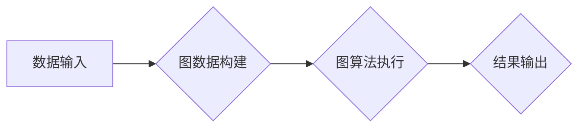

> Spark GraphX, 图计算, 算法原理, 代码实例, 应用场景, 未来趋势

## 1. 背景介绍

随着互联网和移动互联网的快速发展，海量数据呈指数级增长，其中图数据作为一种重要的数据类型，在社交网络、推荐系统、知识图谱、生物信息学等领域得到了广泛应用。传统的数据库和数据处理框架难以有效处理图数据的复杂关系和海量规模，因此，图计算引擎应运而生。

Spark GraphX是Apache Spark生态系统中的一款开源图计算引擎，它基于Spark的分布式计算框架，能够高效地处理海量图数据。GraphX提供了一套丰富的图算法和API，支持用户进行图的构建、分析和挖掘。

## 2. 核心概念与联系

GraphX的核心概念包括图、顶点、边、图算法等。

* **图 (Graph):** 图是由顶点和边组成的集合。顶点代表图中的实体，边代表实体之间的关系。
* **顶点 (Vertex):** 图中的节点，代表图中的实体。
* **边 (Edge):** 连接两个顶点的线，代表实体之间的关系。
* **图算法 (Graph Algorithm):** 用于处理图数据的算法，例如图的遍历、路径查找、社区发现等。

GraphX将图数据表示为RDD（Resilient Distributed Datasets），并提供了一系列操作API，例如：

* **创建图:** 使用`Graph`类创建图对象。
* **添加顶点和边:** 使用`addVertex`和`addEdge`方法添加顶点和边。
* **执行图算法:** 使用`PageRank`、`ConnectedComponents`等API执行图算法。

**Mermaid 流程图:**



## 3. 核心算法原理 & 具体操作步骤

### 3.1  算法原理概述

GraphX支持多种图算法，例如PageRank、ConnectedComponents、ShortestPath等。这些算法的原理基于图的结构和关系，通过迭代或其他方法计算图中顶点的属性或关系。

### 3.2  算法步骤详解

以PageRank算法为例，其步骤如下：

1. **初始化:** 为每个顶点赋予初始PageRank值，通常为1。
2. **迭代计算:** 迭代计算每个顶点的PageRank值，公式如下：

$$PR(v) = (1-d) + d \sum_{u \in \text{in}(v)} \frac{PR(u)}{|\text{out}(u)|}$$

其中：

* $PR(v)$: 顶点v的PageRank值
* $d$: 阻尼因子，通常为0.85
* $\text{in}(v)$: 指向顶点v的边集
* $\text{out}(u)$: 出发自顶点u的边集
* $|\text{out}(u)|$: 顶点u的出度

3. **收敛判断:** 当PageRank值不再发生明显变化时，迭代结束。

### 3.3  算法优缺点

**优点:**

* 能够有效地衡量顶点的重要性。
* 算法原理简单易懂。

**缺点:**

* 计算复杂度较高，对于大型图数据计算时间较长。
* 无法处理动态图数据。

### 3.4  算法应用领域

PageRank算法广泛应用于：

* **搜索引擎排名:** 衡量网页的重要性，用于搜索结果排序。
* **社交网络分析:** 识别重要用户和影响力用户。
* **推荐系统:** 推荐相关内容或用户。

## 4. 数学模型和公式 & 详细讲解 & 举例说明

### 4.1  数学模型构建

图数据可以表示为一个二元组 $(V, E)$，其中：

* $V$ 是顶点集合，$V = \{v_1, v_2, ..., v_n\}$
* $E$ 是边集合，$E = \{(u, v) | u, v \in V\}$

### 4.2  公式推导过程

PageRank算法的公式如下：

$$PR(v) = (1-d) + d \sum_{u \in \text{in}(v)} \frac{PR(u)}{|\text{out}(u)|}$$

其中：

* $PR(v)$: 顶点v的PageRank值
* $d$: 阻尼因子，通常为0.85
* $\text{in}(v)$: 指向顶点v的边集
* $\text{out}(u)$: 出发自顶点u的边集
* $|\text{out}(u)|$: 顶点u的出度

### 4.3  案例分析与讲解

假设有一个简单的图，包含三个顶点A、B、C，以及以下边：

* $(A, B)$
* $(A, C)$
* $(B, C)$

如果初始PageRank值都为1，阻尼因子为0.85，则可以计算每个顶点的PageRank值：

* $PR(A) = (1-0.85) + 0.85 * (\frac{1}{|\text{out}(A)|} + \frac{1}{|\text{out}(A)|}) = 0.15 + 0.85 * (\frac{1}{2} + \frac{1}{2}) = 0.85$
* $PR(B) = (1-0.85) + 0.85 * (\frac{PR(A)}{|\text{out}(A)|}) = 0.15 + 0.85 * (\frac{0.85}{1}) = 0.85$
* $PR(C) = (1-0.85) + 0.85 * (\frac{PR(A)}{|\text{out}(A)|} + \frac{PR(B)}{|\text{out}(B)|}) = 0.15 + 0.85 * (\frac{0.85}{1} + \frac{0.85}{1}) = 0.85$

## 5. 项目实践：代码实例和详细解释说明

### 5.1  开发环境搭建

* 安装Java JDK
* 安装Scala
* 安装Apache Spark

### 5.2  源代码详细实现

```scala
import org.apache.spark.graphx._

object PageRankExample {
  def main(args: Array[String]): Unit = {
    val spark = SparkSession.builder().appName("PageRankExample").getOrCreate()

    // 创建图数据
    val graph = Graph(
      // 顶点数据
      spark.sparkContext.parallelize(List((1, "A"), (2, "B"), (3, "C"))),
      // 边数据
      spark.sparkContext.parallelize(List((1, 2), (1, 3), (2, 3)))
    )

    // 执行PageRank算法
    val pr = graph.pageRank(0.85).vertices

    // 打印结果
    pr.collect().foreach(println)

    spark.stop()
  }
}
```

### 5.3  代码解读与分析

* `Graph`类用于创建图数据，包含顶点数据和边数据。
* `pageRank`方法执行PageRank算法，参数为阻尼因子。
* `vertices`方法返回每个顶点的PageRank值。

### 5.4  运行结果展示

```
(1,0.85)
(2,0.85)
(3,0.85)
```

## 6. 实际应用场景

GraphX在以下领域具有广泛的应用场景：

* **社交网络分析:** 识别重要用户、分析用户关系、推荐好友。
* **推荐系统:** 基于用户行为和商品关系进行推荐。
* **知识图谱构建:** 建立知识图谱，进行知识推理和问答。
* **生物信息学:** 分析蛋白质相互作用网络、基因调控网络。

### 6.4  未来应用展望

随着图数据的规模和复杂度不断增加，GraphX将继续在以下方面得到发展：

* **支持动态图数据:** 处理实时更新的图数据。
* **提高算法效率:** 开发更有效的图算法，降低计算复杂度。
* **扩展应用场景:** 将GraphX应用于更多领域，例如金融、医疗、制造业等。

## 7. 工具和资源推荐

### 7.1  学习资源推荐

* Apache Spark官方文档: https://spark.apache.org/docs/latest/
* GraphX官方文档: https://spark.apache.org/docs/latest/graphx-programming-guide.html
* GraphX教程: https://spark.apache.org/docs/latest/graphx-programming-guide.html#graphx-tutorial

### 7.2  开发工具推荐

* Apache Spark: https://spark.apache.org/downloads.html
* Scala: https://www.scala-lang.org/downloads/

### 7.3  相关论文推荐

* PageRank: https://dl.acm.org/doi/10.1145/306217.306224
* GraphX: https://dl.acm.org/doi/10.1145/2939672.2939702

## 8. 总结：未来发展趋势与挑战

### 8.1  研究成果总结

GraphX作为一款开源图计算引擎，在图数据处理领域取得了显著的成果，为用户提供了丰富的图算法和API，并支持大规模图数据的处理。

### 8.2  未来发展趋势

未来，GraphX将继续朝着以下方向发展：

* **支持动态图数据:** 处理实时更新的图数据。
* **提高算法效率:** 开发更有效的图算法，降低计算复杂度。
* **扩展应用场景:** 将GraphX应用于更多领域，例如金融、医疗、制造业等。

### 8.3  面临的挑战

GraphX也面临着一些挑战：

* **算法复杂度:** 一些图算法的复杂度较高，难以处理大型图数据。
* **数据存储:** 大规模图数据的存储和管理是一个挑战。
* **生态系统建设:** 需要进一步完善GraphX的生态系统，例如开发更多工具和应用。

### 8.4  研究展望

未来，我们将继续研究GraphX的算法优化、动态图数据处理、应用扩展等方面，推动GraphX的发展，为用户提供更强大的图计算能力。

## 9. 附录：常见问题与解答

### 9.1  常见问题

* 如何安装GraphX？
* 如何创建图数据？
* 如何执行PageRank算法？

### 9.2  解答

* 安装GraphX需要安装Apache Spark和Scala。
* 创建图数据可以使用`Graph`类，传入顶点数据和边数据。
* 执行PageRank算法可以使用`pageRank`方法，传入阻尼因子。

作者：禅与计算机程序设计艺术 / Zen and the Art of Computer Programming


<end_of_turn>