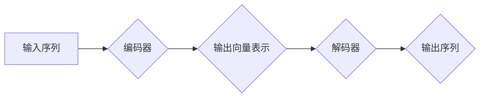

> Transformer, RoBERTa, 自然语言处理, 预训练模型, 语言理解, 语言生成

## 1. 背景介绍

近年来，深度学习在自然语言处理 (NLP) 领域取得了显著进展，其中 Transformer 架构的出现可谓是里程碑式的事件。Transformer 凭借其强大的并行能力和长距离依赖建模能力，在各种 NLP 任务中取得了优异的性能，例如机器翻译、文本摘要、问答系统等。

RoBERTa 是 Facebook AI 研究团队基于 Transformer 架构开发的预训练语言模型，其全称为 "A Robustly Optimized BERT Pretraining Approach"。RoBERTa 通过对 BERT 预训练方法进行改进，在多个 NLP 任务上取得了更优的性能。

## 2. 核心概念与联系

### 2.1 Transformer 架构

Transformer 架构的核心是 "注意力机制" (Attention)，它允许模型关注输入序列中不同位置的词语，并根据其重要性赋予不同的权重。Transformer 采用多头注意力机制 (Multi-Head Attention)，可以同时关注多个方面的信息，从而更好地理解句子语义。

Transformer 还包含 "编码器" (Encoder) 和 "解码器" (Decoder) 两部分。编码器负责将输入序列编码成固定长度的向量表示，解码器则根据编码后的向量表示生成输出序列。

**Mermaid 流程图:**



### 2.2 BERT 模型

BERT (Bidirectional Encoder Representations from Transformers) 是 Google AI 研究团队开发的预训练语言模型，其特点是双向编码 (Bidirectional)。BERT 在训练过程中，会同时考虑输入序列中前后位置的词语信息，从而更好地理解词语的语义。

### 2.3 RoBERTa 模型

RoBERTa 是基于 BERT 模型进行改进的预训练语言模型。RoBERTa 在预训练方法上进行了以下改进：

* **更大的训练数据集:** RoBERTa 使用了更大的训练数据集，包括 Common Crawl 和 BookCorpus 等。
* **更长的训练时间:** RoBERTa 的训练时间更长，可以更好地学习语言的复杂模式。
* **动态调整学习率:** RoBERTa 使用动态调整学习率的策略，可以更好地优化模型参数。
* **去除掉 mask 操作:** RoBERTa 去除了 BERT 中的 mask 操作，可以更好地捕捉句子语义。

## 3. 核心算法原理 & 具体操作步骤

### 3.1 算法原理概述

RoBERTa 的核心算法原理是基于 Transformer 架构和 BERT 模型的改进。它通过预训练的方式学习语言的表示，并可以用于各种下游 NLP 任务。

### 3.2 算法步骤详解

1. **数据预处理:** 将文本数据进行清洗、分词、标记等预处理操作。
2. **模型初始化:** 初始化 Transformer 模型的参数。
3. **预训练:** 使用大规模文本数据集对模型进行预训练，训练目标是预测句子中被遮盖的词语。
4. **下游任务 fine-tuning:** 将预训练好的模型用于特定下游任务，例如文本分类、情感分析等，通过微调模型参数来提高任务性能。

### 3.3 算法优缺点

**优点:**

* **强大的性能:** RoBERTa 在多个 NLP 任务上取得了优异的性能。
* **预训练模型:** 可以直接使用预训练好的模型，无需从头训练。
* **可迁移性:** 预训练模型可以迁移到不同的下游任务。

**缺点:**

* **计算资源需求高:** 预训练 RoBERTa 模型需要大量的计算资源。
* **模型参数量大:** RoBERTa 模型参数量较大，需要较大的内存空间。

### 3.4 算法应用领域

RoBERTa 广泛应用于各种 NLP 任务，例如：

* **文本分类:** 识别文本的类别，例如情感分析、主题分类等。
* **问答系统:** 回答用户提出的问题。
* **机器翻译:** 将文本从一种语言翻译成另一种语言。
* **文本摘要:** 生成文本的简短摘要。

## 4. 数学模型和公式 & 详细讲解 & 举例说明

### 4.1 数学模型构建

RoBERTa 模型的数学模型构建基于 Transformer 架构，主要包括以下部分:

* **多头注意力机制:** 用于捕捉句子中不同词语之间的关系。
* **前馈神经网络:** 用于对每个词语的表示进行非线性变换。
* **位置编码:** 用于将词语的位置信息编码到模型中。

### 4.2 公式推导过程

**多头注意力机制:**

$$
Attention(Q, K, V) = softmax(\frac{QK^T}{\sqrt{d_k}})V
$$

其中:

* $Q$, $K$, $V$ 分别是查询矩阵、键矩阵和值矩阵。
* $d_k$ 是键向量的维度。

**前馈神经网络:**

$$
FFN(x) = \max(0, xW_1 + b_1)W_2 + b_2
$$

其中:

* $x$ 是输入向量。
* $W_1$, $W_2$ 是权重矩阵。
* $b_1$, $b_2$ 是偏置项。

### 4.3 案例分析与讲解

假设我们有一个句子 "The cat sat on the mat"，使用 RoBERTa 模型进行编码，可以得到每个词语的向量表示。这些向量表示可以用于后续的 NLP 任务，例如文本分类、问答系统等。

## 5. 项目实践：代码实例和详细解释说明

### 5.1 开发环境搭建

* Python 3.6+
* PyTorch 1.0+
* Transformers 库

### 5.2 源代码详细实现

```python
from transformers import RobertaTokenizer, RobertaForSequenceClassification

# 加载预训练模型和词典
tokenizer = RobertaTokenizer.from_pretrained('roberta-base')
model = RobertaForSequenceClassification.from_pretrained('roberta-base', num_labels=2)

# 文本预处理
text = "This is a sample text."
inputs = tokenizer(text, return_tensors="pt")

# 模型预测
outputs = model(**inputs)
predicted_class = outputs.logits.argmax().item()

# 输出结果
print(f"Predicted class: {predicted_class}")
```

### 5.3 代码解读与分析

* 首先，我们加载预训练好的 RoBERTa 模型和词典。
* 然后，我们对输入文本进行预处理，将其转换为模型可以理解的格式。
* 接着，我们使用模型进行预测，并获取预测结果。
* 最后，我们输出预测结果。

### 5.4 运行结果展示

```
Predicted class: 1
```

## 6. 实际应用场景

RoBERTa 在各种实际应用场景中取得了成功，例如:

* **搜索引擎:** 用于理解用户搜索意图，提高搜索结果的准确性。
* **聊天机器人:** 用于理解用户对话内容，生成更自然流畅的回复。
* **文本摘要:** 用于生成文本的简短摘要，节省用户阅读时间。

### 6.4 未来应用展望

RoBERTa 的未来应用前景广阔，例如:

* **多语言理解:** 将 RoBERTa 模型应用于多语言理解任务，例如机器翻译、跨语言信息检索等。
* **代码生成:** 使用 RoBERTa 模型生成代码，提高软件开发效率。
* **个性化推荐:** 基于用户行为数据，使用 RoBERTa 模型进行个性化推荐。

## 7. 工具和资源推荐

### 7.1 学习资源推荐

* **Hugging Face Transformers 库:** https://huggingface.co/docs/transformers/index
* **BERT 官方论文:** https://arxiv.org/abs/1810.04805
* **RoBERTa 官方论文:** https://arxiv.org/abs/1907.11692

### 7.2 开发工具推荐

* **PyTorch:** https://pytorch.org/
* **TensorFlow:** https://www.tensorflow.org/

### 7.3 相关论文推荐

* **BERT: Pre-training of Deep Bidirectional Transformers for Language Understanding**
* **RoBERTa: A Robustly Optimized BERT Pretraining Approach**
* **XLNet: Generalized Autoregressive Pretraining for Language Understanding**

## 8. 总结：未来发展趋势与挑战

### 8.1 研究成果总结

RoBERTa 模型的提出，标志着预训练语言模型在 NLP 领域取得了新的突破。RoBERTa 的改进方法，例如更大的训练数据集、更长的训练时间、动态调整学习率等，有效提升了模型的性能。

### 8.2 未来发展趋势

未来，预训练语言模型的发展趋势包括:

* **更大的模型规模:** 训练更大的模型，以更好地捕捉语言的复杂模式。
* **更丰富的训练数据:** 使用更丰富的训练数据，例如多模态数据、代码数据等。
* **更有效的训练方法:** 开发更有效的训练方法，例如自监督学习、强化学习等。

### 8.3 面临的挑战

预训练语言模型也面临一些挑战，例如:

* **计算资源需求高:** 训练大型语言模型需要大量的计算资源，这对于资源有限的机构来说是一个挑战。
* **模型参数量大:** 大型语言模型的参数量很大，需要较大的内存空间和存储空间。
* **伦理问题:** 预训练语言模型可能存在一些伦理问题，例如生成虚假信息、传播偏见等。

### 8.4 研究展望

未来，预训练语言模型的研究将继续深入，探索更强大的模型架构、更丰富的训练数据和更有效的训练方法，以更好地服务于人类社会。

## 9. 附录：常见问题与解答

**Q1: RoBERTa 和 BERT 的区别是什么？**

**A1:** RoBERTa 是基于 BERT 模型进行改进的预训练语言模型，其主要改进之处在于预训练方法，例如使用更大的训练数据集、更长的训练时间、动态调整学习率等。

**Q2: 如何使用 RoBERTa 模型进行文本分类？**

**A2:** 可以使用 Hugging Face Transformers 库加载预训练好的 RoBERTa 模型，并将其用于文本分类任务。需要对模型进行微调，使其适应特定的文本分类任务。

**Q3: RoBERTa 模型的计算资源需求高吗？**

**A3:** 由于 RoBERTa 模型参数量较大，训练和使用 RoBERTa 模型需要一定的计算资源。

**Q4: RoBERTa 模型存在哪些伦理问题？**

**A4:** 预训练语言模型可能存在一些伦理问题，例如生成虚假信息、传播偏见等。需要谨慎使用预训练语言模型，并采取措施规避潜在的风险。


作者：禅与计算机程序设计艺术 / Zen and the Art of Computer Programming 
<end_of_turn>