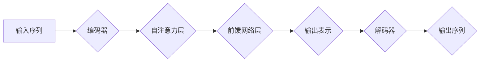

> Transformer, BERT, 预训练, 自然语言处理, 深度学习, 语言模型, 文本分类, 问答系统

## 1. 背景介绍

近年来，深度学习在自然语言处理（NLP）领域取得了显著进展，其中Transformer模型及其变体成为NLP领域最强大的工具之一。BERT（Bidirectional Encoder Representations from Transformers）模型作为Transformer架构的代表作，凭借其强大的预训练能力和优秀的性能，在各种NLP任务中取得了突破性的成果。

传统的NLP模型通常采用单向编码方式，例如RNN和LSTM，只能处理序列中一个词的上下文信息，难以捕捉长距离依赖关系。而Transformer模型通过引入自注意力机制（Self-Attention），能够同时关注序列中所有词的上下文信息，有效解决长距离依赖问题。BERT模型进一步在Transformer基础上，采用双向编码方式，对输入序列进行前后双向的编码，从而更深入地理解文本语义。

BERT模型的预训练策略也使其在各种下游任务中表现出色。BERT模型通过在大量的文本数据上进行预训练，学习到丰富的语言表示，这些预训练的知识可以迁移到不同的下游任务中，显著提升模型性能。

## 2. 核心概念与联系

### 2.1 Transformer架构

Transformer模型的核心是其独特的架构，它摒弃了传统的循环神经网络（RNN）结构，采用并行计算的方式处理序列数据。Transformer架构主要由以下几个部分组成：

* **编码器（Encoder）:** 负责将输入序列编码成语义表示。
* **解码器（Decoder）:** 负责根据编码后的语义表示生成输出序列。
* **自注意力机制（Self-Attention）:** 允许模型关注序列中所有词的上下文信息，捕捉长距离依赖关系。
* **多头注意力机制（Multi-Head Attention）:** 通过多个注意力头，从不同的角度学习文本语义。
* **前馈神经网络（Feed-Forward Network）:** 对每个词的表示进行非线性变换，进一步提取语义特征。

**Mermaid 流程图:**



### 2.2 BERT模型

BERT模型基于Transformer架构，并采用了双向编码方式。它在预训练阶段，通过Masked Language Modeling（MLM）和Next Sentence Prediction（NSP）两个任务进行训练。

* **MLM:** 随机掩盖输入序列中的部分词，然后预测被掩盖词的词语。
* **NSP:** 判断两个句子是否相邻。

通过这两个预训练任务，BERT模型学习到丰富的语言表示，能够捕捉文本语义和句法结构。

## 3. 核心算法原理 & 具体操作步骤

### 3.1 算法原理概述

BERT模型的核心算法是Transformer架构和自注意力机制。Transformer架构通过并行计算的方式处理序列数据，自注意力机制能够捕捉长距离依赖关系。BERT模型通过双向编码方式，对输入序列进行前后双向的编码，从而更深入地理解文本语义。

### 3.2 算法步骤详解

1. **输入处理:** 将输入文本序列转换为词嵌入向量。
2. **编码器:** 将词嵌入向量输入编码器，编码器通过多层Transformer模块进行处理，最终得到每个词的上下文表示。
3. **解码器:** 将编码器输出的上下文表示输入解码器，解码器通过多层Transformer模块进行处理，最终生成输出序列。
4. **输出处理:** 将解码器输出的序列转换为目标格式，例如文本、分类标签等。

### 3.3 算法优缺点

**优点:**

* 能够捕捉长距离依赖关系。
* 双向编码方式，更深入地理解文本语义。
* 预训练策略，迁移学习能力强。

**缺点:**

* 计算量大，训练成本高。
* 对训练数据要求高。

### 3.4 算法应用领域

BERT模型在各种NLP任务中取得了优异的性能，例如：

* 文本分类
* 问答系统
* 机器翻译
* 语义相似度计算
* 情感分析

## 4. 数学模型和公式 & 详细讲解 & 举例说明

### 4.1 数学模型构建

BERT模型的数学模型主要基于Transformer架构，其核心是自注意力机制和多头注意力机制。

**自注意力机制:**

自注意力机制计算每个词与序列中所有词之间的相关性，并根据相关性权重生成每个词的上下文表示。

**公式:**

$$
Attention(Q, K, V) = softmax(\frac{QK^T}{\sqrt{d_k}})V
$$

其中：

* $Q$：查询矩阵
* $K$：键矩阵
* $V$：值矩阵
* $d_k$：键向量的维度

**多头注意力机制:**

多头注意力机制通过多个注意力头，从不同的角度学习文本语义。

**公式:**

$$
MultiHead(Q, K, V) = Concat(head_1, head_2, ..., head_h)W^O
$$

其中：

* $head_i$：第 $i$ 个注意力头的输出
* $h$：注意力头的数量
* $W^O$：输出权重矩阵

### 4.2 公式推导过程

自注意力机制的公式推导过程如下：

1. 将查询矩阵 $Q$、键矩阵 $K$ 和值矩阵 $V$ 分别进行线性变换，得到 $Q'$, $K'$ 和 $V'$。
2. 计算 $Q'$ 与 $K'$ 的点积，并进行归一化，得到注意力权重矩阵。
3. 将注意力权重矩阵与 $V'$ 进行加权求和，得到每个词的上下文表示。

### 4.3 案例分析与讲解

假设我们有一个句子 "The cat sat on the mat"，我们使用BERT模型进行预训练，并将其应用于文本分类任务。

在预训练阶段，BERT模型会学习到每个词的上下文表示，例如 "cat" 的上下文表示会包含 "sat" 和 "on" 的信息。

在文本分类任务中，我们可以将句子输入BERT模型，获取每个词的上下文表示，然后将这些表示进行聚合，得到句子的整体表示。最后，将句子的整体表示输入分类器，进行分类。

## 5. 项目实践：代码实例和详细解释说明

### 5.1 开发环境搭建

* Python 3.6+
* TensorFlow 2.0+
* PyTorch 1.0+
* CUDA 10.0+

### 5.2 源代码详细实现

```python
# 导入必要的库
import tensorflow as tf

# 定义BERT模型
class BERT(tf.keras.Model):
    def __init__(self, vocab_size, embedding_dim, num_heads, num_layers):
        super(BERT, self).__init__()
        self.embedding = tf.keras.layers.Embedding(vocab_size, embedding_dim)
        self.transformer_layers = [
            tf.keras.layers.Transformer(num_heads=num_heads, num_layers=num_layers)
            for _ in range(num_layers)
        ]

    def call(self, inputs):
        # 将输入序列转换为词嵌入向量
        embeddings = self.embedding(inputs)
        # 将词嵌入向量输入Transformer层进行处理
        for transformer_layer in self.transformer_layers:
            embeddings = transformer_layer(embeddings)
        return embeddings

# 实例化BERT模型
bert_model = BERT(vocab_size=30000, embedding_dim=128, num_heads=8, num_layers=6)

# 训练模型
# ...

# 使用模型进行预测
# ...
```

### 5.3 代码解读与分析

* **BERT模型类:** 定义了BERT模型的结构和行为。
* **embedding层:** 将输入序列转换为词嵌入向量。
* **transformer_layers:** 多层Transformer模块，用于处理词嵌入向量。
* **call方法:** 定义了模型的输入和输出。

### 5.4 运行结果展示

训练完成后，BERT模型可以用于各种NLP任务，例如文本分类、问答系统等。

## 6. 实际应用场景

BERT模型在各种实际应用场景中取得了成功，例如：

* **搜索引擎:** BERT可以用于理解用户搜索意图，提高搜索结果的准确性。
* **聊天机器人:** BERT可以用于训练更智能的聊天机器人，能够更好地理解用户对话内容。
* **文本摘要:** BERT可以用于自动生成文本摘要，提取文本的关键信息。

### 6.4 未来应用展望

BERT模型的未来应用前景广阔，例如：

* **多语言理解:** 将BERT模型应用于多语言文本处理，实现跨语言理解。
* **知识图谱构建:** 利用BERT模型提取文本中的知识关系，构建知识图谱。
* **代码生成:** 利用BERT模型学习代码结构和语义，实现代码生成。

## 7. 工具和资源推荐

### 7.1 学习资源推荐

* **BERT论文:** https://arxiv.org/abs/1810.04805
* **HuggingFace Transformers库:** https://huggingface.co/transformers/
* **TensorFlow官方文档:** https://www.tensorflow.org/

### 7.2 开发工具推荐

* **Jupyter Notebook:** https://jupyter.org/
* **VS Code:** https://code.visualstudio.com/

### 7.3 相关论文推荐

* **XLNet:** https://arxiv.org/abs/1906.08237
* **RoBERTa:** https://arxiv.org/abs/1907.11692
* **GPT-3:** https://openai.com/blog/gpt-3/

## 8. 总结：未来发展趋势与挑战

### 8.1 研究成果总结

BERT模型的出现标志着Transformer架构在NLP领域的成功应用，其强大的预训练能力和优秀的性能，为NLP任务的解决提供了新的思路和方法。

### 8.2 未来发展趋势

* **模型规模更大:** 预训练模型规模将继续扩大，以学习更丰富的语言表示。
* **多模态理解:** 将BERT模型扩展到多模态数据，例如文本、图像、音频等，实现跨模态理解。
* **高效训练:** 研究更有效的训练方法，降低模型训练成本。

### 8.3 面临的挑战

* **数据获取和标注:** 大规模高质量的训练数据仍然是模型训练的瓶颈。
* **模型解释性:** BERT模型的内部机制仍然难以理解，缺乏可解释性。
* **公平性和偏见:** 预训练模型可能存在公平性和偏见问题，需要进行更深入的研究和解决。

### 8.4 研究展望

未来，BERT模型及其变体将继续在NLP领域发挥重要作用，并推动人工智能技术的进一步发展。


## 9. 附录：常见问题与解答

**Q1: BERT模型的预训练数据是什么？**

**A1:** BERT模型的预训练数据通常是公开的文本数据集，例如BookCorpus、Wikipedia等。

**Q2: 如何使用BERT模型进行文本分类？**

**A2:** 可以将BERT模型的输出表示输入分类器，例如线性分类器或softmax层，进行分类。

**Q3: BERT模型的训练成本高吗？**

**A3:** BERT模型的训练成本较高，需要大量的计算资源和时间。

**作者：禅与计算机程序设计艺术 / Zen and the Art of Computer Programming**


<end_of_turn>