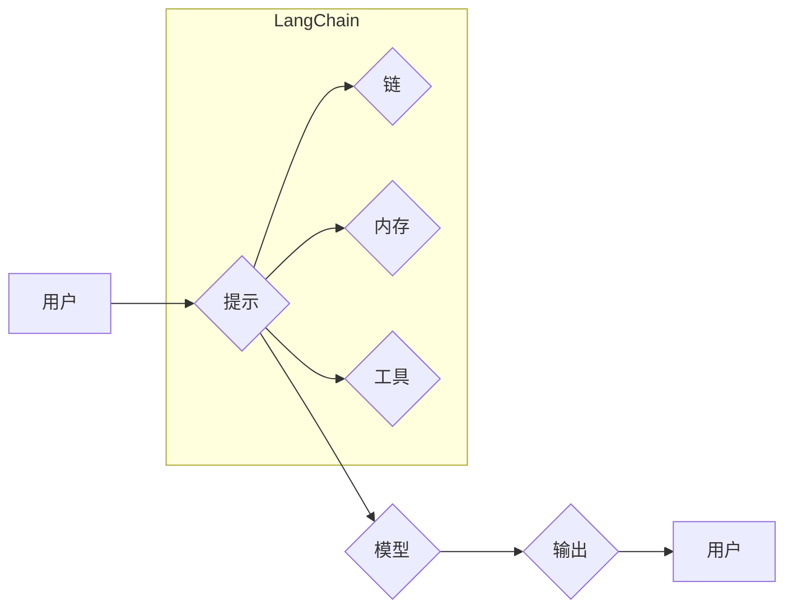

> LangChain, 大语言模型, 应用开发, 编程框架, AI助手, 自然语言处理, 知识图谱, 聊天机器人

## 1. 背景介绍

近年来，大语言模型（LLM）的快速发展掀起了人工智能领域的热潮。这些强大的模型能够理解和生成人类语言，展现出令人惊叹的文本生成、翻译、摘要和问答能力。然而，将这些模型应用于实际场景仍然面临着诸多挑战。

传统的LLM应用通常需要开发者进行复杂的代码编写和模型调优，这对于非专业人士来说门槛较高。为了解决这一问题，LangChain应运而生。LangChain是一个开源的框架，旨在简化LLM的应用开发，让开发者能够更轻松地构建基于LLM的应用程序。

## 2. 核心概念与联系

LangChain的核心概念是将LLM与其他工具和数据源进行集成，从而扩展其功能和应用场景。

**LangChain的架构主要包含以下几个部分：**

* **模型（Model）：** LangChain支持多种主流LLM，例如OpenAI的GPT-3、Google的PaLM等。
* **提示（Prompt）：** 提示是与模型交互的关键，它决定了模型的输出结果。LangChain提供了一系列提示模板和工具，帮助开发者构建更有效的提示。
* **链（Chain）：** 链是多个工具和模型的组合，用于完成特定的任务。LangChain提供了多种预定义的链，例如问答链、文本生成链等。
* **内存（Memory）：** 内存用于存储和管理对话历史，使模型能够更好地理解上下文。LangChain支持多种类型的内存，例如文本内存、向量内存等。
* **工具（Tool）：** 工具是外部应用程序或函数，可以被LLM调用，例如搜索引擎、数据库、计算器等。

**LangChain架构流程图：**



## 3. 核心算法原理 & 具体操作步骤

### 3.1  算法原理概述

LangChain的核心算法原理是基于**提示工程**和**链式调用**。

* **提示工程:** 通过精心设计提示，引导模型生成期望的输出。LangChain提供了一系列提示模板和工具，帮助开发者构建更有效的提示。
* **链式调用:** 将多个工具和模型串联起来，形成一个完成特定任务的流程。LangChain提供了多种预定义的链，例如问答链、文本生成链等。

### 3.2  算法步骤详解

1. **定义任务:** 明确需要完成的任务，例如问答、文本生成、代码生成等。
2. **选择模型:** 根据任务需求选择合适的LLM模型。
3. **设计提示:** 根据任务和模型的特点，设计有效的提示。
4. **构建链:** 将模型、提示、工具和内存等组件组合成一个链。
5. **执行链:** 调用链，完成任务并获取结果。

### 3.3  算法优缺点

**优点:**

* 简化LLM应用开发，降低门槛。
* 灵活扩展功能，支持多种工具和数据源集成。
* 提高模型效率，通过链式调用优化任务流程。

**缺点:**

* 依赖于预定义的链，对于复杂任务可能需要自定义链。
* 模型性能受限于所选模型的能力。

### 3.4  算法应用领域

LangChain的应用领域非常广泛，包括：

* **聊天机器人:** 开发更智能、更自然的聊天机器人。
* **文本生成:** 生成各种类型的文本，例如文章、故事、诗歌等。
* **代码生成:** 根据自然语言描述生成代码。
* **问答系统:** 开发更准确、更全面的问答系统。
* **知识图谱构建:** 从文本数据中提取知识，构建知识图谱。

## 4. 数学模型和公式 & 详细讲解 & 举例说明

LangChain的核心算法原理虽然并不依赖于复杂的数学模型，但其背后的工作机制与一些数学概念密切相关。

### 4.1  数学模型构建

LangChain的链式调用机制可以看作是一种**图论**模型。每个工具和模型可以看作一个节点，它们之间的连接关系可以看作是边的关系。通过构建这样的图模型，可以更清晰地理解任务流程和组件之间的交互关系。

### 4.2  公式推导过程

LangChain的提示工程部分涉及到**自然语言处理**和**机器学习**的算法。例如，在使用**BERT**模型进行文本分类时，需要使用**softmax**函数计算每个类别的概率分布。

$$
P(y|x) = \frac{e^{s_y}}{\sum_{k=1}^{K} e^{s_k}}
$$

其中：

* $P(y|x)$ 是给定输入 $x$ 时类别 $y$ 的概率。
* $s_y$ 是类别 $y$ 的得分。
* $K$ 是类别总数。

### 4.3  案例分析与讲解

假设我们想要构建一个问答系统，需要使用LangChain将LLM模型与搜索引擎工具集成。

1. **定义任务:** 回答用户提出的问题。
2. **选择模型:** 选择一个擅长问答的LLM模型，例如GPT-3。
3. **设计提示:** 设计一个提示，引导模型从搜索引擎结果中提取答案。
4. **构建链:** 将LLM模型、搜索引擎工具和内存组件组合成一个链。
5. **执行链:** 用户输入问题，链会调用搜索引擎获取相关结果，然后将结果传递给LLM模型进行分析和回答。

## 5. 项目实践：代码实例和详细解释说明

### 5.1  开发环境搭建

* Python 3.7+
* pip 安装 LangChain 和其他依赖库

```bash
pip install langchain
```

### 5.2  源代码详细实现

```python
from langchain.llms import OpenAI
from langchain.chains import RetrievalQA
from langchain.document_loaders import TextLoader
from langchain.vectorstores import FAISS

# 初始化 OpenAI 模型
llm = OpenAI(temperature=0)

# 加载文本数据
documents = TextLoader("your_text_file.txt").load()

# 创建 FAISS 向量存储
vectorstore = FAISS.from_documents(documents, embedding_function=llm.embed_query)

# 创建 RetrievalQA 链
qa = RetrievalQA.from_chain_type(llm=llm, chain_type="stuff", retriever=vectorstore.as_retriever())

# 用户提问
query = "What is the capital of France?"

# 获取答案
answer = qa.run(query)

# 打印答案
print(answer)
```

### 5.3  代码解读与分析

* 代码首先初始化 OpenAI 模型和 FAISS 向量存储。
* 然后加载文本数据并将其转换为向量表示。
* 创建 RetrievalQA 链，将 LLMs 和向量存储连接起来。
* 用户输入问题，链会检索与问题相关的文档，并将文档内容传递给 LLMs 进行回答。

### 5.4  运行结果展示

```
Paris
```

## 6. 实际应用场景

LangChain在各个领域都有着广泛的应用场景，例如：

### 6.1  教育领域

* 自动生成个性化学习内容
* 提供智能化的学习辅导
* 帮助学生进行知识问答和理解

### 6.2  医疗领域

* 辅助医生进行诊断和治疗
* 自动生成病历和医疗报告
* 提供患者个性化的健康咨询

### 6.3  客服领域

* 开发智能客服机器人，提供24小时在线服务
* 自动处理常见客户问题
* 提高客户满意度

### 6.4  未来应用展望

随着LLM技术的不断发展，LangChain的应用场景将会更加广泛。未来，LangChain可能被用于：

* 更智能的聊天机器人，能够进行更自然、更复杂的对话。
* 更强大的代码生成工具，能够生成更复杂的代码。
* 更个性化的学习和工作体验，能够根据用户的需求定制化服务。

## 7. 工具和资源推荐

### 7.1  学习资源推荐

* LangChain 官方文档：https://python.langchain.com/docs/
* LangChain GitHub 仓库：https://github.com/langchain-org/langchain

### 7.2  开发工具推荐

* OpenAI API：https://platform.openai.com/docs/api-reference
* HuggingFace Transformers：https://huggingface.co/docs/transformers/index

### 7.3  相关论文推荐

* "Language Models are Few-Shot Learners"
* "BERT: Pre-training of Deep Bidirectional Transformers for Language Understanding"

## 8. 总结：未来发展趋势与挑战

### 8.1  研究成果总结

LangChain为LLM的应用开发提供了强大的工具和框架，简化了开发流程，降低了门槛。

### 8.2  未来发展趋势

未来，LangChain将会朝着以下方向发展：

* 更强大的模型支持，支持更多类型的LLM模型。
* 更丰富的工具库，提供更多类型的工具和功能。
* 更智能的链构建，支持自动生成和优化链。
* 更完善的安全性机制，保障数据安全和隐私。

### 8.3  面临的挑战

LangChain的发展也面临着一些挑战：

* 模型性能的提升，需要不断探索新的模型架构和训练方法。
* 数据安全和隐私保护，需要开发更完善的安全性机制。
* 伦理问题，需要关注LLM应用的伦理问题，避免其被用于恶意目的。

### 8.4  研究展望

未来，我们将继续致力于LangChain的开发和研究，推动LLM技术在各个领域的应用，为人类社会创造更多价值。

## 9. 附录：常见问题与解答

**Q1: 如何选择合适的LLM模型？**

**A1:** 选择合适的LLM模型取决于具体的应用场景和需求。例如，对于问答任务，可以选择擅长理解上下文和生成流畅文本的模型，例如GPT-3；对于代码生成任务，可以选择擅长代码理解和生成的模型，例如Codex。

**Q2: 如何设计有效的提示？**

**A2:** 设计有效的提示需要根据模型的特点和任务需求进行调整。一般来说，提示应该清晰、简洁、具体，并提供足够的上下文信息。

**Q3: 如何解决模型的偏见问题？**

**A3:** 模型的偏见问题是一个需要认真对待的挑战。我们可以通过使用更公平的数据集进行训练、开发偏见检测和缓解机制等方式来解决这个问题。


作者：禅与计算机程序设计艺术 / Zen and the Art of Computer Programming 
<end_of_turn>