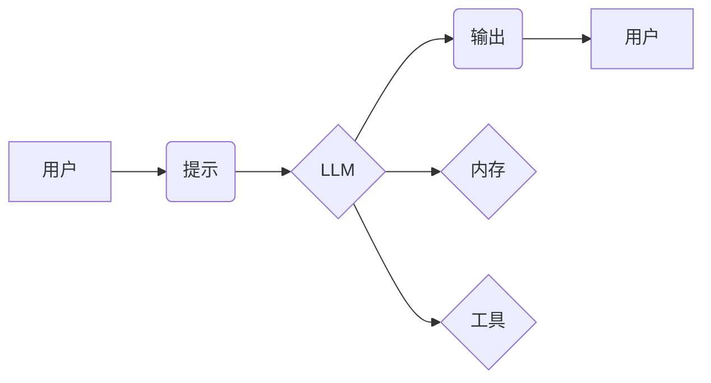

> LangChain, 语言模型, 应用开发, 编程框架, AI, 自然语言处理, 聊天机器人

## 1. 背景介绍

近年来，大型语言模型（LLM）的快速发展，如GPT-3、LaMDA等，为自然语言处理（NLP）领域带来了革命性的变革。这些模型展现出惊人的文本生成、翻译、摘要等能力，为各种应用场景提供了无限可能。然而，直接使用LLM往往需要复杂的代码编写和模型调优，对开发者门槛较高。

为了降低LLM应用的开发难度，并更好地利用LLM的强大能力，LangChain应运而生。LangChain是一个开源的框架，旨在简化LLM的应用开发，并提供丰富的工具和组件，帮助开发者构建更强大的AI应用。

## 2. 核心概念与联系

LangChain的核心概念是将LLM与其他工具和数据源进行连接，形成一个完整的AI应用生态系统。

**核心组件：**

* **模型（Model）：** LangChain支持多种LLM，包括OpenAI的GPT系列、HuggingFace的Transformers等。
* **提示（Prompt）：**  用于引导LLM生成特定类型的输出。LangChain提供多种提示模板和生成工具，帮助开发者设计更有效的提示。
* **链（Chain）：**  将多个组件组合在一起，形成一个完整的任务流程。例如，可以将LLM与搜索引擎、数据库等工具连接，构建一个问答系统。
* **内存（Memory）：**  用于存储和管理对话历史，使LLM能够理解上下文并进行更自然的对话。
* **工具（Tool）：**  提供额外的功能，例如计算、网络请求等，扩展LLM的能力。

**架构图：**



## 3. 核心算法原理 & 具体操作步骤

### 3.1  算法原理概述

LangChain的核心算法原理是基于**提示工程**和**链式调用**。

* **提示工程:** 通过精心设计提示，引导LLM生成期望的输出。
* **链式调用:** 将多个组件组合在一起，形成一个完整的任务流程。

### 3.2  算法步骤详解

1. **定义任务:** 明确需要完成的任务，例如文本摘要、对话生成等。
2. **选择模型:** 根据任务需求选择合适的LLM模型。
3. **设计提示:** 设计有效的提示，引导LLM生成期望的输出。
4. **构建链:** 将LLM与其他组件（例如搜索引擎、数据库等）连接，构建一个完整的任务流程。
5. **训练和评估:** 训练和评估模型性能，并根据结果进行调整。

### 3.3  算法优缺点

**优点:**

* **易于使用:** LangChain提供简洁的API，降低了LLM应用开发的难度。
* **灵活定制:** 可以根据需求灵活组合不同的组件，构建个性化的AI应用。
* **可扩展性强:** 可以与其他工具和数据源进行集成，扩展LLM的能力。

**缺点:**

* **依赖模型性能:**  模型性能直接影响应用效果，需要选择合适的模型。
* **提示设计复杂:**  设计有效的提示需要一定的经验和技巧。
* **资源消耗:**  LLM模型训练和推理需要大量的计算资源。

### 3.4  算法应用领域

LangChain的应用领域非常广泛，包括：

* **聊天机器人:**  构建更智能、更自然的对话机器人。
* **问答系统:**  构建能够回答用户问题的问答系统。
* **文本生成:**  生成各种类型的文本，例如文章、故事、代码等。
* **数据分析:**  利用LLM对数据进行分析和理解。
* **教育:**  提供个性化的学习体验。

## 4. 数学模型和公式 & 详细讲解 & 举例说明

LangChain的核心算法原理并不依赖于复杂的数学模型。其主要基于统计语言模型和深度学习算法，例如Transformer。

**Transformer模型:**

Transformer模型是一种基于注意力机制的深度学习模型，能够有效地捕捉文本中的长距离依赖关系。

**注意力机制:**

注意力机制允许模型关注输入序列中与当前任务最相关的部分，从而提高模型的理解能力和生成质量。

**公式:**

Transformer模型的注意力机制使用以下公式计算注意力权重：

$$
\text{Attention}(Q, K, V) = \text{softmax}\left(\frac{QK^T}{\sqrt{d_k}}\right)V
$$

其中：

* $Q$：查询矩阵
* $K$：键矩阵
* $V$：值矩阵
* $d_k$：键向量的维度

**举例说明:**

在文本摘要任务中，Transformer模型可以利用注意力机制关注文章中最关键的部分，并生成简洁准确的摘要。

## 5. 项目实践：代码实例和详细解释说明

### 5.1  开发环境搭建

* Python 3.7+
* pip install langchain transformers openai

### 5.2  源代码详细实现

```python
from langchain.llms import OpenAI
from langchain.chains import ConversationChain
from langchain.memory import ConversationBufferMemory

# 初始化LLM
llm = OpenAI(temperature=0.7)

# 初始化内存
memory = ConversationBufferMemory()

# 初始化对话链
conversation = ConversationChain(
    llm=llm,
    memory=memory,
    prompt=f"你好，我是你的AI助手。请问有什么可以帮你的吗？"
)

# 与模型交互
while True:
    user_input = input("用户: ")
    if user_input.lower() == "exit":
        break
    response = conversation.run(user_input)
    print("AI:", response)
```

### 5.3  代码解读与分析

* **初始化LLM:** 使用OpenAI类实例化LLM模型。
* **初始化内存:** 使用ConversationBufferMemory类实例化对话内存。
* **初始化对话链:** 使用ConversationChain类构建对话链，并将LLM和内存作为参数传入。
* **与模型交互:** 使用循环接收用户输入，并通过conversation.run()方法调用LLM进行响应。

### 5.4  运行结果展示

```
用户: 你好
AI: 你好，我是你的AI助手。请问有什么可以帮你的吗？
用户: 你能写一首诗吗？
AI: 
春风拂柳绿如烟，
鸟语花香满山间。
阳光明媚照大地，
万物复苏生机勃。
用户: 谢谢
AI: 不客气，有什么需要帮忙的尽管说。
用户: exit
```

## 6. 实际应用场景

LangChain在实际应用场景中展现出强大的潜力，例如：

* **客服机器人:**  构建能够自动回答用户问题的客服机器人，提高客户服务效率。
* **内容创作:**  利用LLM生成各种类型的文本内容，例如文章、故事、广告文案等。
* **代码生成:**  根据用户需求生成代码，提高开发效率。
* **教育辅助:**  提供个性化的学习体验，帮助学生理解知识。

### 6.4  未来应用展望

随着LLM技术的不断发展，LangChain的应用场景将更加广泛，例如：

* **多模态应用:**  将LLM与图像、音频等其他模态数据结合，构建更智能的应用。
* **个性化推荐:**  根据用户的兴趣和偏好，提供个性化的推荐服务。
* **科学研究:**  利用LLM辅助科学研究，例如药物研发、材料设计等。

## 7. 工具和资源推荐

### 7.1  学习资源推荐

* **LangChain官方文档:** https://python.langchain.com/docs/
* **HuggingFace Transformers:** https://huggingface.co/docs/transformers/index

### 7.2  开发工具推荐

* **VS Code:** https://code.visualstudio.com/
* **Jupyter Notebook:** https://jupyter.org/

### 7.3  相关论文推荐

* **Attention Is All You Need:** https://arxiv.org/abs/1706.03762

## 8. 总结：未来发展趋势与挑战

### 8.1  研究成果总结

LangChain为LLM应用开发提供了强大的工具和框架，降低了开发门槛，并促进了LLM技术的普及。

### 8.2  未来发展趋势

未来，LangChain将继续朝着以下方向发展：

* **更强大的模型支持:** 支持更多类型的LLM模型，例如多模态模型。
* **更丰富的组件库:** 提供更多类型的组件，例如数据库连接、API调用等。
* **更易于使用的API:** 提供更简洁、更易于使用的API，降低开发难度。

### 8.3  面临的挑战

LangChain也面临一些挑战，例如：

* **模型性能瓶颈:**  LLM模型的性能仍然存在瓶颈，需要不断提升模型能力。
* **提示设计难题:**  设计有效的提示仍然是一个难题，需要不断探索新的方法。
* **数据安全问题:**  LLM模型训练和应用需要处理大量数据，数据安全问题需要得到重视。

### 8.4  研究展望

未来，LangChain的研究方向将包括：

* **探索更有效的提示设计方法。**
* **开发更强大的LLM模型。**
* **解决数据安全问题。**
* **拓展LangChain的应用场景。**

## 9. 附录：常见问题与解答

**Q1: 如何选择合适的LLM模型？**

**A1:**  选择合适的LLM模型取决于具体的应用场景。例如，对于文本生成任务，可以选择GPT-3系列模型；对于对话生成任务，可以选择LaMDA系列模型。

**Q2: 如何设计有效的提示？**

**A2:**  设计有效的提示需要考虑以下因素：

* **明确任务:**  明确需要LLM完成的任务。
* **提供上下文:**  提供足够的上下文信息，帮助LLM理解任务。
* **使用示例:**  提供一些示例，引导LLM生成期望的输出。

**Q3: LangChain支持哪些LLM模型？**

**A3:**  LangChain支持多种LLM模型，包括OpenAI的GPT系列、HuggingFace的Transformers等。

**Q4: 如何安装LangChain？**

**A4:**  使用pip安装LangChain：

```
pip install langchain transformers openai
```


作者：禅与计算机程序设计艺术 / Zen and the Art of Computer Programming 
<end_of_turn>