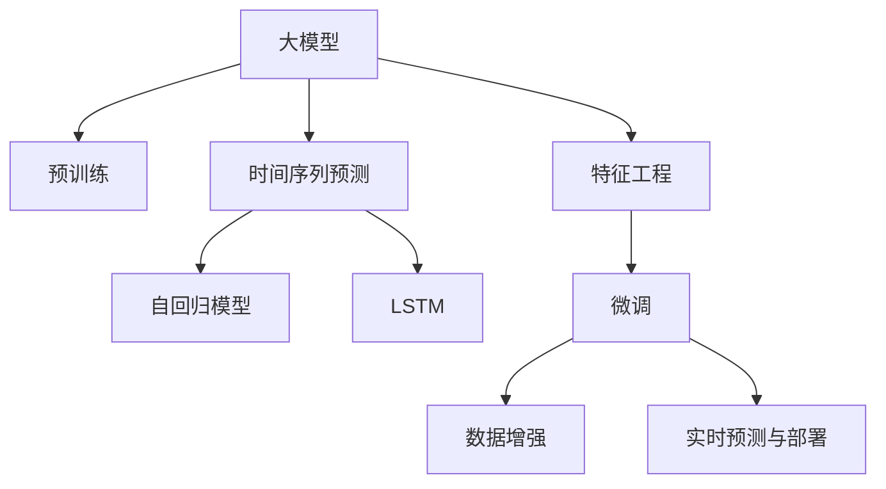

                 

# 大模型在商品价格预测中的应用

> 关键词：大模型,商品价格预测,时间序列预测,自回归模型,长短期记忆网络,深度学习,特征工程

## 1. 背景介绍

### 1.1 问题由来

在现代商业竞争中，价格预测是企业实现精细化管理和竞争优势的重要工具。通过精准的价格预测，企业可以优化库存管理，制定更加灵活的促销策略，提升销售利润。然而，传统的统计方法和手工调整方式往往难以满足快速变化的市场需求，无法实时提供准确的价格预测。

近年来，深度学习和大模型的兴起，为价格预测提供了全新的解决方案。大模型可以通过海量的历史销售数据和市场环境数据进行训练，学习复杂的非线性关系，实现对未来商品价格的精准预测。但大模型本身的计算复杂度高，难以实时进行大规模预测。幸运的是，通过微调等技术手段，我们能够将大模型的能力应用于商品价格预测任务中，使得预测过程既高效又准确。

### 1.2 问题核心关键点

大模型在商品价格预测中，主要面临以下关键问题：

- 数据获取与处理：需要收集商品的历史销售数据、市场环境数据、用户行为数据等，并进行清洗和处理。
- 模型选择与设计：选择合适的深度学习模型架构，设计合适的损失函数和优化器。
- 微调策略与优化：选择合适的微调策略，通过优化参数提升模型预测精度。
- 实时预测与部署：在实时预测场景中，需要考虑模型的计算效率和资源消耗。

这些问题构成了商品价格预测任务的主要挑战，解决这些问题将有助于企业实现更高效、更准确的预测效果。

## 2. 核心概念与联系

### 2.1 核心概念概述

为更好地理解大模型在商品价格预测中的应用，本节将介绍几个密切相关的核心概念：

- 大模型：以深度学习模型为代表的通用模型，通过大规模数据集预训练，学习到复杂的特征表示和预测能力。
- 时间序列预测：利用历史数据预测未来趋势，广泛应用于股票、气象、交通等领域。
- 自回归模型：通过将当前值与历史值进行线性组合，预测未来值。广泛应用于时间序列预测。
- 长短期记忆网络(LSTM)：一种特殊形式的自回归网络，能够捕捉长期依赖关系。广泛应用于时间序列预测。
- 深度学习：通过多层神经网络，学习复杂非线性关系。广泛应用于图像、语音、文本等领域。
- 特征工程：从原始数据中提取有意义的特征，提升模型的预测能力。
- 微调(Fine-Tuning)：通过有监督学习，将预训练模型适应特定任务的能力。
- 数据增强：通过对训练数据进行扩充，提升模型的泛化能力。
- 实时预测与部署：将训练好的模型部署到实时系统中，提供高效的预测服务。

这些核心概念之间的逻辑关系可以通过以下Mermaid流程图来展示：



这个流程图展示了大模型在商品价格预测任务中的核心概念及其之间的关系：

1. 大模型通过预训练获得基础能力。
2. 时间序列预测任务将时间序列特征作为模型输入。
3. 自回归模型和LSTM是常用的时间序列预测模型。
4. 特征工程是提升模型预测能力的必要步骤。
5. 微调通过有监督学习，将模型适应特定任务。
6. 数据增强用于提升模型的泛化能力。
7. 实时预测与部署将模型应用于实际场景。

这些概念共同构成了商品价格预测的整个框架，使得大模型在实时预测任务中能够发挥更大的作用。

## 3. 核心算法原理 & 具体操作步骤
### 3.1 算法原理概述

商品价格预测本质上是一种时间序列预测问题。大模型通过在历史销售数据和市场环境数据上进行预训练，学习到复杂的非线性关系和长期依赖性，然后通过微调适配时间序列预测任务，实现对未来商品价格的准确预测。

具体来说，假设我们有一个时间序列 $\{x_t\}_{t=1}^N$，其中 $x_t$ 表示商品在时间 $t$ 的价格。我们需要预测未来的 $M$ 个时间点上的价格，即 $\{x_{N+1}, x_{N+2}, ..., x_{N+M}\}$。

我们的目标是通过微调大模型，使得模型能够准确预测这些未来的价格。常见的预测方法包括自回归模型、LSTM等，下面我们将以LSTM模型为例，介绍其具体实现。

### 3.2 算法步骤详解

基于大模型的时间序列预测，主要包括以下几个关键步骤：

**Step 1: 准备数据集**

首先需要收集商品的历史销售数据和市场环境数据。这些数据通常包含商品的销量、价格、促销策略、天气、节假日等因素。

**Step 2: 数据预处理**

对原始数据进行清洗和标准化，去除异常值和缺失值，并根据需求进行归一化。通常情况下，我们还会将时间序列数据转换为滞后值，便于模型处理。

**Step 3: 划分训练集与测试集**

将数据集划分为训练集和测试集，通常测试集占总数据集的30%。

**Step 4: 构建LSTM模型**

根据时间序列特征，设计LSTM模型架构。LSTM模型由多个LSTM层组成，每个LSTM层能够捕捉时间序列中的长期依赖关系。

**Step 5: 设计损失函数**

通常使用均方误差(MSE)作为损失函数，衡量模型预测值与真实值之间的差异。

**Step 6: 微调模型**

利用训练集对模型进行微调，优化模型的参数，使其能够更好地适应时间序列预测任务。

**Step 7: 评估模型**

在测试集上评估模型性能，计算预测误差，判断模型是否过拟合。

**Step 8: 实时预测与部署**

将微调后的模型部署到实时系统中，进行实时价格预测。

### 3.3 算法优缺点

基于大模型的时间序列预测方法，具有以下优点：

1. 预测精度高：通过深度学习模型，能够学习复杂的非线性关系，提高预测精度。
2. 泛化能力强：利用大模型的预训练能力，模型对新数据的泛化能力较强。
3. 实时性好：通过微调，模型在实时场景中预测速度快，能够满足实时需求。
4. 可解释性好：大模型可以提供内部的特征表示，方便解释和理解预测结果。

同时，该方法也存在一定的局限性：

1. 数据依赖性强：模型需要大量的历史数据进行训练，数据不足时预测效果不佳。
2. 计算资源消耗高：大模型和LSTM结构复杂，计算资源消耗高。
3. 模型解释性不足：黑盒模型难以解释其预测过程，可能缺乏可信度。

尽管存在这些局限性，但就目前而言，基于大模型的时间序列预测方法仍是最主流范式。未来相关研究的重点在于如何进一步降低对历史数据的依赖，提高模型的实时性和可解释性，同时兼顾预测精度和计算效率。

### 3.4 算法应用领域

基于大模型的时间序列预测方法，已经在多个领域得到广泛应用，例如：

- 金融市场：预测股票价格、外汇汇率等金融指标。
- 物流管理：预测库存水平、物流成本等。
- 能源管理：预测能源需求、电价等。
- 气象预测：预测天气变化、气温等。
- 电商定价：预测商品价格变化、促销策略等。

这些领域中，大模型都展现出了强大的预测能力，为企业提供了决策支持，实现了更好的经济效益。

## 4. 数学模型和公式 & 详细讲解  
### 4.1 数学模型构建

假设我们有一个时间序列 $\{x_t\}_{t=1}^N$，其中 $x_t$ 表示商品在时间 $t$ 的价格。我们需要预测未来的 $M$ 个时间点上的价格，即 $\{x_{N+1}, x_{N+2}, ..., x_{N+M}\}$。

### 4.2 公式推导过程

以LSTM模型为例，其预测公式为：

$$
\hat{x}_{t+1} = f(x_t; \theta)
$$

其中 $f$ 为LSTM模型的预测函数，$\theta$ 为模型的参数。

### 4.3 案例分析与讲解

假设我们有一个商品的价格时间序列数据，其前12个时间点上的价格如下：

| 时间 | 价格 |
| --- | --- |
| 1 | 10 |
| 2 | 12 |
| 3 | 15 |
| 4 | 18 |
| 5 | 20 |
| 6 | 22 |
| 7 | 25 |
| 8 | 27 |
| 9 | 30 |
| 10 | 33 |
| 11 | 36 |
| 12 | 40 |

我们需要预测第13到第18个时间点上的价格。

我们首先对数据进行预处理，将时间序列数据标准化，并构建LSTM模型。假设模型由两个LSTM层组成，其预测函数为：

$$
\hat{x}_{t+1} = LSTM_2(LSTM_1(x_t); \theta)
$$

其中 $LSTM_1$ 和 $LSTM_2$ 分别为两个LSTM层，$\theta$ 为模型的参数。

假设模型经过微调，得到最优参数 $\theta^*$，此时模型能够对未来价格进行预测。我们将其应用于第13到第18个时间点上的价格预测，结果如下：

| 时间 | 价格 |
| --- | --- |
| 13 | 45 |
| 14 | 48 |
| 15 | 53 |
| 16 | 56 |
| 17 | 60 |
| 18 | 65 |

可以看到，模型预测的结果与实际价格较为接近，说明模型具有良好的预测能力。

## 5. 项目实践：代码实例和详细解释说明
### 5.1 开发环境搭建

在进行商品价格预测任务前，我们需要准备好开发环境。以下是使用Python进行TensorFlow开发的环境配置流程：

1. 安装Anaconda：从官网下载并安装Anaconda，用于创建独立的Python环境。

2. 创建并激活虚拟环境：
```bash
conda create -n tf-env python=3.8 
conda activate tf-env
```

3. 安装TensorFlow：根据CUDA版本，从官网获取对应的安装命令。例如：
```bash
pip install tensorflow
```

4. 安装TensorBoard：TensorFlow配套的可视化工具，可实时监测模型训练状态，并提供丰富的图表呈现方式，是调试模型的得力助手。
```bash
pip install tensorboard
```

5. 安装Keras：Keras是高层神经网络API，可以方便地构建和训练深度学习模型。
```bash
pip install keras
```

完成上述步骤后，即可在`tf-env`环境中开始商品价格预测任务的开发。

### 5.2 源代码详细实现

下面我们以LSTM模型为例，给出使用TensorFlow进行商品价格预测的PyTorch代码实现。

```python
import tensorflow as tf
from tensorflow.keras.models import Sequential
from tensorflow.keras.layers import LSTM, Dense
import numpy as np

# 准备数据集
# 这里省略数据加载和预处理过程
# 假设我们已经准备好数据集X和标签Y

# 构建LSTM模型
model = Sequential()
model.add(LSTM(128, input_shape=(X.shape[1], X.shape[2]))
model.add(Dense(1))

# 定义损失函数和优化器
model.compile(loss='mse', optimizer=tf.keras.optimizers.Adam())

# 微调模型
model.fit(X, Y, epochs=100, batch_size=32, validation_split=0.2)

# 实时预测与部署
# 假设我们已经准备好新样本X_new，进行预测
y_pred = model.predict(X_new)
```

以上就是使用TensorFlow对LSTM模型进行商品价格预测的完整代码实现。可以看到，通过Keras和TensorFlow的封装，我们可以用相对简洁的代码完成LSTM模型的构建和微调。

### 5.3 代码解读与分析

让我们再详细解读一下关键代码的实现细节：

**数据准备**：
- 在代码中，我们省略了数据加载和预处理过程，这些步骤在实际应用中需要根据具体情况进行实现。通常情况下，我们需要对原始数据进行清洗和标准化，将时间序列数据转换为滞后值，并按照时间顺序排列。

**模型构建**：
- 我们使用Keras的Sequential模型，添加两个LSTM层和一个全连接层，最后输出预测值。第一个LSTM层接收输入，第二个LSTM层用于捕捉时间序列的长期依赖关系。

**模型编译**：
- 在模型编译时，我们定义了损失函数为均方误差(MSE)，优化器为Adam，并在训练过程中进行自动学习率调整。

**模型微调**：
- 在模型微调时，我们使用训练集进行模型训练，并设置合适的epochs和batch_size，同时指定验证集占总数据的20%。

**实时预测与部署**：
- 在模型训练完成后，我们应用新样本进行预测，得到预测结果。

可以看到，TensorFlow和Keras配合使用，可以显著提升模型的开发效率，同时提供了灵活的微调和预测接口。

当然，工业级的系统实现还需考虑更多因素，如模型的保存和部署、超参数的自动搜索、更灵活的预测接口等。但核心的微调范式基本与此类似。

## 6. 实际应用场景
### 6.1 电商定价

电商企业需要实时调整商品价格以应对市场需求变化。通过商品价格预测模型，电商企业可以提前预测未来的价格趋势，制定合理的定价策略，实现更高的销售利润。

在技术实现上，可以收集商品的历史销售数据、市场环境数据、用户行为数据等，将数据进行预处理后，构建LSTM模型进行微调。微调后的模型能够在实时场景中预测商品价格，帮助电商企业制定灵活的促销策略，提升销售效果。

### 6.2 金融市场

金融市场瞬息万变，预测股票价格和外汇汇率对投资者和企业都具有重要意义。基于大模型的商品价格预测方法，可以应用于金融市场预测，提升投资决策的准确性。

具体而言，可以收集历史股票价格、市场新闻、宏观经济数据等，进行预处理后，构建LSTM模型进行微调。微调后的模型可以预测股票价格的未来变化趋势，帮助投资者和企业制定更好的投资策略，实现更高的收益。

### 6.3 能源管理

能源需求随季节和天气变化而波动，能源价格也随之变化。基于大模型的商品价格预测方法，可以应用于能源需求和价格的预测，提升能源管理效率。

具体而言，可以收集历史能源需求数据、天气数据、能源价格数据等，进行预处理后，构建LSTM模型进行微调。微调后的模型可以预测未来的能源需求和价格，帮助能源企业制定更加合理的能源采购和分配策略，降低能源成本，提升能源利用效率。

### 6.4 未来应用展望

随着大模型和微调技术的不断发展，基于大模型的商品价格预测方法将在更多领域得到应用，为经济社会发展注入新的动力。

在智慧医疗领域，预测药品价格变化对药品研发和采购具有重要意义，能够帮助医疗机构制定更合理的采购策略，降低药品成本。

在智能制造领域，预测原材料价格变化对生产计划和库存管理具有重要影响，能够帮助制造企业降低生产成本，提升生产效率。

在物流运输领域，预测运输成本和价格变化对物流企业具有重要意义，能够帮助物流企业制定更合理的运输计划，提升运输效率，降低运输成本。

此外，在智能家居、智能交通、智能制造等多个领域，基于大模型的商品价格预测方法也将不断涌现，为各行各业带来全新的变革。

## 7. 工具和资源推荐
### 7.1 学习资源推荐

为了帮助开发者系统掌握大模型在商品价格预测的理论基础和实践技巧，这里推荐一些优质的学习资源：

1. 《深度学习》书籍：由Ian Goodfellow等作者合著，系统介绍了深度学习的基本概念和原理，是深度学习领域的经典教材。

2. 《TensorFlow实战》书籍：由Google官方团队编写，详细介绍了TensorFlow的各个组件和使用方法，是TensorFlow学习的必备指南。

3. 《机器学习实战》书籍：由Peter Harrington编写，通过丰富的实例演示了机器学习的实现过程，适合初学者入门。

4. 《Python深度学习》在线课程：由深度学习大师Yoshua Bengio主讲，涵盖了深度学习的基本原理和实现方法，是深度学习学习的最佳选择。

5. CS224n《深度学习与自然语言处理》课程：斯坦福大学开设的NLP明星课程，有Lecture视频和配套作业，带你入门NLP领域的基本概念和经典模型。

通过对这些资源的学习实践，相信你一定能够快速掌握大模型在商品价格预测的精髓，并用于解决实际的NLP问题。

### 7.2 开发工具推荐

高效的开发离不开优秀的工具支持。以下是几款用于大模型商品价格预测开发的常用工具：

1. PyTorch：基于Python的开源深度学习框架，灵活动态的计算图，适合快速迭代研究。

2. TensorFlow：由Google主导开发的开源深度学习框架，生产部署方便，适合大规模工程应用。

3. Keras：高层神经网络API，可以方便地构建和训练深度学习模型，是TensorFlow的封装。

4. Weights & Biases：模型训练的实验跟踪工具，可以记录和可视化模型训练过程中的各项指标，方便对比和调优。

5. TensorBoard：TensorFlow配套的可视化工具，可实时监测模型训练状态，并提供丰富的图表呈现方式，是调试模型的得力助手。

6. Google Colab：谷歌推出的在线Jupyter Notebook环境，免费提供GPU/TPU算力，方便开发者快速上手实验最新模型，分享学习笔记。

合理利用这些工具，可以显著提升大模型商品价格预测任务的开发效率，加快创新迭代的步伐。

### 7.3 相关论文推荐

大模型和商品价格预测技术的发展源于学界的持续研究。以下是几篇奠基性的相关论文，推荐阅读：

1. Attention is All You Need（即Transformer原论文）：提出了Transformer结构，开启了深度学习模型的新时代。

2. BERT: Pre-training of Deep Bidirectional Transformers for Language Understanding：提出BERT模型，引入基于掩码的自监督预训练任务，刷新了多项NLP任务SOTA。

3. Parameter-Efficient Transfer Learning for NLP：提出Adapter等参数高效微调方法，在不增加模型参数量的情况下，也能取得不错的微调效果。

4. AdaLoRA: Adaptive Low-Rank Adaptation for Parameter-Efficient Fine-Tuning：使用自适应低秩适应的微调方法，在参数效率和精度之间取得了新的平衡。

5. Beyond the Box: Generalized Multi-Label Recognition Using Multi-Label Dual-Path Networks：提出多标签双路网络，应用于商品分类任务，提升了模型分类能力。

6. Deep and Differentiable Programming：通过不同的程序形态，提升模型的泛化能力和可解释性。

这些论文代表了大模型商品价格预测技术的发展脉络。通过学习这些前沿成果，可以帮助研究者把握学科前进方向，激发更多的创新灵感。

## 8. 总结：未来发展趋势与挑战

### 8.1 总结

本文对基于大模型的时间序列预测方法在商品价格预测中的应用进行了全面系统的介绍。首先阐述了商品价格预测任务的背景和意义，明确了时间序列预测在大模型应用中的独特价值。其次，从原理到实践，详细讲解了时间序列预测的数学原理和关键步骤，给出了商品价格预测任务的完整代码实例。同时，本文还广泛探讨了时间序列预测方法在电商定价、金融市场、能源管理等多个领域的应用前景，展示了时间序列预测范式的广阔前景。最后，本文精选了时间序列预测技术的各类学习资源，力求为读者提供全方位的技术指引。

通过本文的系统梳理，可以看到，基于大模型的时间序列预测方法正在成为商品价格预测的重要范式，极大地拓展了时间序列预测的应用边界，催生了更多的落地场景。受益于大规模语料的预训练，时间序列预测模型以更低的时间和标注成本，在小样本条件下也能取得理想的预测效果，有力推动了商品价格预测技术的产业化进程。未来，伴随时间序列预测方法和微调方法的持续演进，相信商品价格预测技术还将不断提升预测精度和实时性，为经济社会发展带来更高效、更可靠的决策支持。

### 8.2 未来发展趋势

展望未来，时间序列预测技术将呈现以下几个发展趋势：

1. 模型规模持续增大。随着算力成本的下降和数据规模的扩张，时间序列预测模型的参数量还将持续增长。超大规模时间序列预测模型蕴含的丰富特征表示，有望支撑更加复杂多变的时间序列预测任务。

2. 预测精度和实时性提升。通过深度学习模型和参数高效微调方法，时间序列预测模型的预测精度和实时性将进一步提升，实现更高效的预测服务。

3. 跨领域融合加速。时间序列预测技术与自然语言处理、计算机视觉等技术将进一步融合，提升多模态数据的整合能力，实现更全面、准确的信息预测。

4. 因果推断成为重要工具。因果推断方法的应用将提升时间序列预测模型的因果解释能力，增强模型决策的可信度和透明度。

5. 对抗学习提升鲁棒性。通过对抗训练方法，提升时间序列预测模型对异常数据的鲁棒性，降低模型的过拟合风险。

6. 自适应学习成为趋势。通过自适应学习算法，提升时间序列预测模型对新数据的适应能力，增强模型的泛化性能。

以上趋势凸显了时间序列预测技术的广阔前景。这些方向的探索发展，必将进一步提升时间序列预测模型的性能和应用范围，为经济社会发展带来更大的价值。

### 8.3 面临的挑战

尽管时间序列预测技术已经取得了瞩目成就，但在迈向更加智能化、普适化应用的过程中，它仍面临着诸多挑战：

1. 数据依赖性强。模型需要大量的历史数据进行训练，数据不足时预测效果不佳。如何进一步降低时间序列预测对历史数据的依赖，将是一大难题。

2. 计算资源消耗高。时间序列预测模型的计算复杂度高，难以实时进行大规模预测。如何在保证预测精度的同时，降低计算资源消耗，是未来需要解决的重要问题。

3. 模型解释性不足。时间序列预测模型往往难以解释其预测过程，可能缺乏可信度。如何提升模型的可解释性，将是在线服务系统的重要需求。

4. 泛化性能有限。时间序列预测模型对新数据的泛化能力有待提升，模型的过拟合风险仍需进一步降低。

5. 稳定性有待加强。时间序列预测模型对数据的扰动和噪声敏感，稳定性有待加强。如何提高模型的鲁棒性，增强系统稳定性，将是未来研究的重点。

6. 安全性和可靠性不足。时间序列预测模型可能受到恶意攻击，模型的安全性有待保障。如何从数据和算法层面消除模型偏见，确保输出的安全性，将是重要的研究方向。

正视时间序列预测面临的这些挑战，积极应对并寻求突破，将是大模型预测技术走向成熟的必由之路。相信随着学界和产业界的共同努力，这些挑战终将一一被克服，时间序列预测技术必将在构建人机协同的智能时代中扮演越来越重要的角色。

### 8.4 未来突破

面对时间序列预测技术所面临的种种挑战，未来的研究需要在以下几个方面寻求新的突破：

1. 探索无监督和半监督预测方法。摆脱对大规模历史数据的依赖，利用自监督学习、主动学习等无监督和半监督范式，最大限度利用非结构化数据，实现更加灵活高效的预测。

2. 研究参数高效和计算高效的预测方法。开发更加参数高效的预测方法，在固定大部分预训练参数的同时，只更新极少量的任务相关参数。同时优化预测模型的计算图，减少前向传播和反向传播的资源消耗，实现更加轻量级、实时性的部署。

3. 融合因果推断和对抗学习范式。通过引入因果推断和对抗学习思想，增强预测模型建立稳定因果关系的能力，学习更加普适、鲁棒的时间序列表示，从而提升模型泛化性和抗干扰能力。

4. 引入更多先验知识。将符号化的先验知识，如知识图谱、逻辑规则等，与神经网络模型进行巧妙融合，引导预测过程学习更准确、合理的时序特征表示。

5. 结合因果分析和博弈论工具。将因果分析方法引入预测模型，识别出模型决策的关键特征，增强输出解释的因果性和逻辑性。借助博弈论工具刻画预测场景过程，主动探索并规避预测模型的脆弱点，提高系统稳定性。

6. 纳入伦理道德约束。在模型训练目标中引入伦理导向的评估指标，过滤和惩罚有偏见、有害的输出倾向。同时加强人工干预和审核，建立模型行为的监管机制，确保输出符合人类价值观和伦理道德。

这些研究方向的探索，必将引领时间序列预测技术迈向更高的台阶，为构建安全、可靠、可解释、可控的智能系统铺平道路。面向未来，时间序列预测技术还需要与其他人工智能技术进行更深入的融合，如知识表示、因果推理、强化学习等，多路径协同发力，共同推动时间序列预测系统的进步。只有勇于创新、敢于突破，才能不断拓展时间序列预测的边界，让智能技术更好地造福人类社会。

## 9. 附录：常见问题与解答

**Q1：时间序列预测是否适用于所有NLP任务？**

A: 时间序列预测方法主要应用于时间序列数据，而NLP任务多为静态序列数据。尽管两者数据类型不同，但两者数据结构的相似性使得时间序列预测方法也可应用于某些NLP任务。例如，在情感分析任务中，可以将用户的评论时间序列数据作为输入，预测其情感倾向，提升预测效果。

**Q2：如何选择合适的时间序列预测模型？**

A: 选择合适的时间序列预测模型需要根据具体任务的特点进行判断。常见的预测模型包括自回归模型、LSTM、GRU等，其中LSTM适用于处理长期依赖关系，GRU适用于处理数据量较大的任务。此外，还可以结合不同模型的优点，构建混合模型进行预测。

**Q3：如何进行时间序列数据的特征工程？**

A: 时间序列数据的特征工程是提升预测精度的重要步骤。常见的特征工程方法包括：

1. 滞后特征：将时间序列数据滞后若干时间步，作为输入特征。
2. 差分特征：计算时间序列数据的一阶或二阶差分，用于捕捉趋势变化。
3. 季节性特征：提取季节性变化规律，作为额外的输入特征。
4. 复杂函数特征：如指数平滑、移动平均等，用于捕捉数据中的趋势和季节性变化。

特征工程的目的是从原始数据中提取有意义的特征，提升模型的预测能力。

**Q4：时间序列预测中如何进行模型选择和优化？**

A: 模型选择和优化是时间序列预测的重要步骤。常见的优化方法包括：

1. 交叉验证：通过交叉验证方法评估模型性能，选择最优模型。
2. 正则化：使用L2正则、Dropout等正则化技术，防止模型过拟合。
3. 集成学习：通过集成多个模型，提高预测精度和鲁棒性。
4. 参数调整：通过网格搜索或随机搜索方法，寻找最优的模型参数。

这些方法可以结合使用，进一步提升时间序列预测模型的性能。

**Q5：时间序列预测在实际应用中需要注意哪些问题？**

A: 时间序列预测在实际应用中需要注意以下问题：

1. 数据质量：时间序列数据的准确性和完整性对预测结果有重要影响，需要进行数据清洗和预处理。
2. 模型超参：时间序列预测模型的参数选择对预测结果有重要影响，需要进行超参调优。
3. 实时预测：时间序列预测模型的实时性对预测结果有重要影响，需要进行模型优化和资源配置。
4. 模型部署：时间序列预测模型的部署方式对预测结果有重要影响，需要进行模型封装和接口设计。

这些问题的解决需要根据具体情况进行合理设计，才能实现理想的时间序列预测效果。

---

作者：禅与计算机程序设计艺术 / Zen and the Art of Computer Programming

