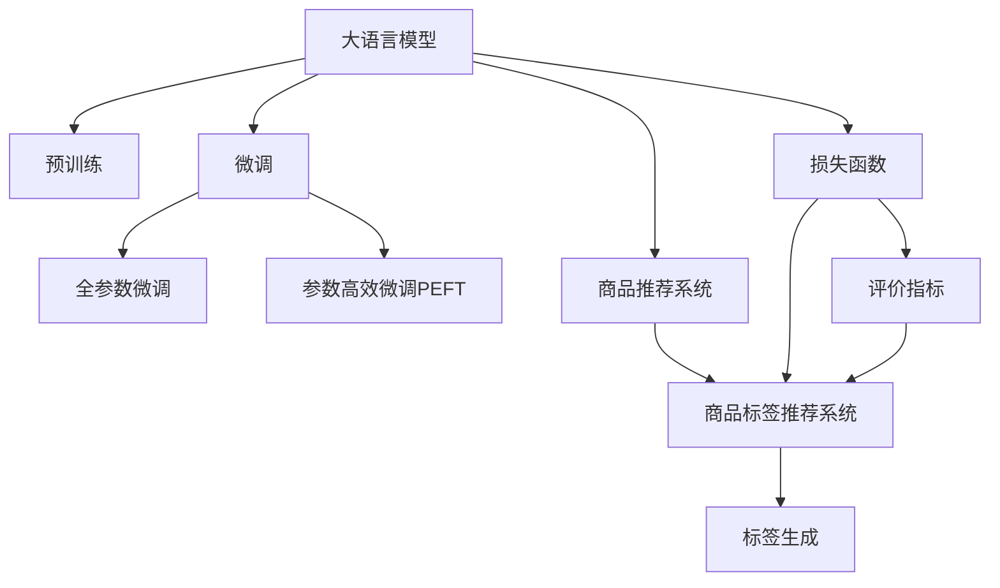

                 

# 大模型在商品标签推荐中的应用

> 关键词：大语言模型,商品推荐系统,预训练,微调,Fine-tuning,损失函数,评价指标,实案分析,代码实现

## 1. 背景介绍

在现代电商领域，商品标签推荐系统已成为提升用户购物体验、优化销售转化率的关键组件。传统商品推荐系统往往依赖用户历史行为数据进行推荐，但无法深入理解商品的上下文信息，且用户数据隐私问题较为突出。而利用预训练大语言模型，结合微调技术，可以更全面、准确地处理商品信息，进行高效、个性化的标签推荐。

近年来，大语言模型在预训练和微调方面的研究取得突破，其强大的语言理解和生成能力，使得大模型在商品推荐领域具备了广泛的应用潜力。大语言模型通常以自回归或自编码的方式进行预训练，学习到广泛的语义知识，能够在相对较小的微调样本集上取得优异的推荐效果。

本文将系统介绍基于大语言模型的商品标签推荐系统，从背景、核心概念、算法原理、项目实践等多个维度，深入剖析其实现机制和应用场景，并给出代码实例和运行结果，以期为电商行业的从业人员提供实际指导。

## 2. 核心概念与联系

### 2.1 核心概念概述

为更好地理解大模型在商品推荐系统中的应用，本节将介绍几个关键概念：

- 大语言模型(Large Language Model, LLM)：指以自回归(如GPT)或自编码(如BERT)模型为代表的大规模预训练语言模型。通过在海量无标签文本语料上进行预训练，学习通用的语言表示，具备强大的语言理解和生成能力。

- 预训练(Pre-training)：指在大规模无标签文本语料上，通过自监督学习任务训练通用语言模型的过程。常见的预训练任务包括言语建模、遮挡语言模型等。预训练使得模型学习到语言的通用表示。

- 微调(Fine-tuning)：指在预训练模型的基础上，使用下游任务的少量标注数据，通过有监督地训练来优化模型在特定任务上的性能。通常只需要调整顶层分类器或解码器，并以较小的学习率更新全部或部分的模型参数。

- 商品推荐系统(Recommendation System)：通过分析用户行为、商品信息等数据，自动为用户推荐可能感兴趣的商品。

- 商品标签推荐系统(Product Tag Recommendation System)：基于商品信息，为每个商品生成包含多个标签的描述，帮助用户了解商品属性和功能。

- 损失函数(Loss Function)：衡量模型输出与真实标签之间的差异，常见的损失函数包括交叉熵损失、均方误差损失等。

- 评价指标(Metric)：用于评估推荐系统的准确度和效果，常见的评价指标包括准确率、召回率、F1分数、ROC曲线等。

这些核心概念之间的逻辑关系可以通过以下Mermaid流程图来展示：



这个流程图展示了大语言模型在商品推荐系统中的关键概念及其之间的联系：

1. 大语言模型通过预训练获得基础能力。
2. 微调是对预训练模型进行任务特定的优化，可以为商品标签推荐系统提供更精准的标签生成。
3. 商品推荐系统基于标签进行商品推荐，提高推荐精度。
4. 标签生成需要根据商品的文本描述进行，而大语言模型可以高效地提取商品信息并生成标签。
5. 损失函数和评价指标用于评估标签生成模型的输出质量，指导微调过程。

这些概念共同构成了大语言模型在商品推荐系统中的应用框架，使得系统能够更全面地处理商品信息，实现高效、个性化的标签推荐。

## 3. 核心算法原理 & 具体操作步骤

### 3.1 算法原理概述

基于大语言模型的商品标签推荐系统，本质上是一个预训练-微调的学习框架。其核心思想是：利用预训练模型学习到广泛的语义知识，通过微调机制，在商品标签推荐任务上优化模型输出，实现商品信息的全面理解和准确标签生成。

具体而言，假设大语言模型为 $M_{\theta}$，其中 $\theta$ 为预训练得到的模型参数。给定商品 $i$ 的文本描述 $d_i$，预训练模型的任务是将 $d_i$ 生成若干个商品标签 $t_1, t_2, \cdots, t_k$，即：

$$
t = M_{\theta}(d_i)
$$

其中 $t$ 为一个长度为 $k$ 的标签向量。在商品推荐系统中，每个标签都代表了商品的一项属性，帮助用户了解商品的功能和特点。

微调的目标是最小化标签生成与实际标签的差异，即：

$$
\min_{\theta} \mathcal{L}(\theta) = \frac{1}{N}\sum_{i=1}^N \mathcal{L}(M_{\theta}(d_i), \{t_i^*\})
$$

其中 $\{t_i^*\}$ 为商品 $i$ 的真实标签集合。常见的损失函数包括交叉熵损失、均方误差损失等。

通过梯度下降等优化算法，微调过程不断更新模型参数 $\theta$，最小化损失函数 $\mathcal{L}$，使得模型输出逼近真实标签。由于 $\theta$ 已经通过预训练获得了较好的初始化，因此即便在商品标签推荐这一小样本任务上，也能较快收敛到理想的模型参数 $\hat{\theta}$。

### 3.2 算法步骤详解

基于大语言模型的商品标签推荐系统，一般包括以下几个关键步骤：

**Step 1: 准备预训练模型和数据集**
- 选择合适的预训练语言模型 $M_{\theta}$ 作为初始化参数，如 BERT、GPT 等。
- 准备商品推荐系统所需的大量商品描述数据，标注对应的商品标签。

**Step 2: 添加任务适配层**
- 根据商品标签生成任务，在预训练模型顶层设计合适的输出层和损失函数。
- 对于分类任务，通常在顶层添加线性分类器和交叉熵损失函数。
- 对于生成任务，通常使用语言模型的解码器输出概率分布，并以负对数似然为损失函数。

**Step 3: 设置微调超参数**
- 选择合适的优化算法及其参数，如 AdamW、SGD 等，设置学习率、批大小、迭代轮数等。
- 设置正则化技术及强度，包括权重衰减、Dropout、Early Stopping 等。
- 确定冻结预训练参数的策略，如仅微调顶层，或全部参数都参与微调。

**Step 4: 执行梯度训练**
- 将商品描述数据分批次输入模型，前向传播计算损失函数。
- 反向传播计算参数梯度，根据设定的优化算法和学习率更新模型参数。
- 周期性在验证集上评估模型性能，根据性能指标决定是否触发 Early Stopping。
- 重复上述步骤直到满足预设的迭代轮数或 Early Stopping 条件。

**Step 5: 测试和部署**
- 在测试集上评估微调后模型 $M_{\hat{\theta}}$ 的性能，对比微调前后的准确度提升。
- 使用微调后的模型对新商品进行标签生成，集成到实际的商品推荐系统中。
- 持续收集新的商品数据，定期重新微调模型，以适应数据分布的变化。

以上是基于大语言模型的商品标签推荐系统的微调流程。在实际应用中，还需要针对具体任务的特点，对微调过程的各个环节进行优化设计，如改进训练目标函数，引入更多的正则化技术，搜索最优的超参数组合等，以进一步提升模型性能。

### 3.3 算法优缺点

基于大语言模型的商品标签推荐系统，具有以下优点：

1. 标签生成准确度高。利用预训练模型的广泛语义知识，大模型能够生成更全面、准确的商品标签，有助于提升推荐精度。
2. 适应性强。微调过程可以通过少量标注数据快速优化模型输出，适应不同商品属性和描述风格。
3. 可扩展性好。商品标签推荐系统可以无缝集成到现有商品推荐系统，无需大规模重构。
4. 用户隐私保护。通过微调过程对用户商品描述进行语言生成，无需直接使用用户数据，保护用户隐私。

同时，该方法也存在一些局限性：

1. 计算资源需求高。由于大语言模型参数量较大，微调过程需要高算力支持。
2. 标注成本高。虽然较传统方法少，但仍需获取商品描述和真实标签，标注成本较高。
3. 可解释性不足。大模型的内部工作机制难以解释，用户可能难以理解标签生成的依据。

尽管存在这些局限性，但大语言模型在商品标签推荐中的应用，已经展现了显著的潜力。未来，随着算力提升和数据获取成本降低，这些方法有望在更多电商平台上得到广泛应用。

### 3.4 算法应用领域

基于大语言模型的商品标签推荐系统，已经在电商领域得到了初步应用，并展现出良好的效果。具体应用场景包括：

- 商品详情页标签生成：在商品详情页自动生成商品标签，辅助用户了解商品属性和功能。
- 商品搜索标签推荐：在商品搜索功能中，根据用户查询生成相关标签，提升搜索体验。
- 广告推荐标签生成：为广告内容自动生成标签，提高广告投放精准度。
- 用户评论标签推荐：根据用户评论内容，自动生成商品标签，辅助用户筛选商品。

此外，大语言模型还可以应用于跨语言商品推荐、商品分类、商品关联推荐等场景中，提升电商系统的智能化水平和用户体验。随着技术进步和数据积累，基于大语言模型的商品推荐系统将发挥更大的作用。

## 4. 数学模型和公式 & 详细讲解

### 4.1 数学模型构建

假设大语言模型为 $M_{\theta}$，其中 $\theta$ 为预训练得到的模型参数。给定商品 $i$ 的文本描述 $d_i$，商品标签集合 $\{t_i^*\}$，微调的目标是最小化损失函数 $\mathcal{L}(\theta)$，即：

$$
\min_{\theta} \mathcal{L}(\theta) = \frac{1}{N}\sum_{i=1}^N \mathcal{L}(M_{\theta}(d_i), \{t_i^*\})
$$

其中 $\mathcal{L}$ 为损失函数，常见的选择有交叉熵损失、均方误差损失等。

对于二分类任务，交叉熵损失函数定义为：

$$
\mathcal{L}(y, \hat{y}) = -y\log\hat{y} - (1-y)\log(1-\hat{y})
$$

其中 $y$ 为真实标签，$\hat{y}$ 为模型预测概率。

假设模型 $M_{\theta}$ 在输入 $d_i$ 上的输出为 $\hat{y}=M_{\theta}(d_i) \in [0,1]$，表示商品 $i$ 属于标签 $t_i$ 的概率。则交叉熵损失函数可以展开为：

$$
\mathcal{L}(M_{\theta}(d_i), \{t_i^*\}) = -\frac{1}{k}\sum_{j=1}^k \sum_{i=1}^N \mathcal{L}(\hat{y}_{ij}, t_{ij}^*)
$$

其中 $\hat{y}_{ij}$ 为模型对标签 $t_{ij}$ 的预测概率，$t_{ij}^*$ 为商品 $i$ 的真实标签，$k$ 为标签数量。

### 4.2 公式推导过程

下面以二分类任务为例，推导交叉熵损失函数及其梯度的计算公式。

假设模型 $M_{\theta}$ 在输入 $d_i$ 上的输出为 $\hat{y}=M_{\theta}(d_i) \in [0,1]$，表示商品 $i$ 属于标签 $t_i$ 的概率。真实标签 $y \in \{0,1\}$。则二分类交叉熵损失函数定义为：

$$
\mathcal{L}(M_{\theta}(d_i),y) = -y\log \hat{y} - (1-y)\log (1-\hat{y})
$$

将其代入经验风险公式，得：

$$
\mathcal{L}(\theta) = -\frac{1}{N}\sum_{i=1}^N \sum_{j=1}^k \mathcal{L}(M_{\theta}(d_i),t_{ij}^*)
$$

根据链式法则，损失函数对参数 $\theta_k$ 的梯度为：

$$
\frac{\partial \mathcal{L}(\theta)}{\partial \theta_k} = -\frac{1}{N}\sum_{i=1}^N \sum_{j=1}^k \frac{\partial \mathcal{L}(\hat{y}_{ij},t_{ij}^*)}{\partial \theta_k}
$$

其中：

$$
\frac{\partial \mathcal{L}(\hat{y}_{ij},t_{ij}^*)}{\partial \theta_k} = \begin{cases}
\frac{t_{ij}^*\hat{y}_{ij}(1-\hat{y}_{ij})}{\hat{y}_{ij}(1-\hat{y}_{ij})} \frac{\partial \hat{y}_{ij}}{\partial \theta_k} & t_{ij}^* = 1 \\
\frac{(1-t_{ij}^*)\hat{y}_{ij}(1-\hat{y}_{ij})}{\hat{y}_{ij}(1-\hat{y}_{ij})} \frac{\partial \hat{y}_{ij}}{\partial \theta_k} & t_{ij}^* = 0
\end{cases}
$$

$$
\frac{\partial \hat{y}_{ij}}{\partial \theta_k} = \frac{\partial}{\partial \theta_k} softmax(W_hM_{\theta}(d_i) + b_h)
$$

其中 $W_h$ 和 $b_h$ 为全连接层的权重和偏置。

在得到损失函数的梯度后，即可带入参数更新公式，完成模型的迭代优化。重复上述过程直至收敛，最终得到适应商品标签推荐任务的最优模型参数 $\theta^*$。

## 5. 项目实践：代码实例和详细解释说明

### 5.1 开发环境搭建

在进行商品标签推荐系统开发前，我们需要准备好开发环境。以下是使用Python进行PyTorch开发的环境配置流程：

1. 安装Anaconda：从官网下载并安装Anaconda，用于创建独立的Python环境。

2. 创建并激活虚拟环境：
```bash
conda create -n pytorch-env python=3.8 
conda activate pytorch-env
```

3. 安装PyTorch：根据CUDA版本，从官网获取对应的安装命令。例如：
```bash
conda install pytorch torchvision torchaudio cudatoolkit=11.1 -c pytorch -c conda-forge
```

4. 安装TensorFlow：
```bash
pip install tensorflow
```

5. 安装Transformers库：
```bash
pip install transformers
```

6. 安装各类工具包：
```bash
pip install numpy pandas scikit-learn matplotlib tqdm jupyter notebook ipython
```

完成上述步骤后，即可在`pytorch-env`环境中开始商品标签推荐系统的微调实践。

### 5.2 源代码详细实现

以下是一个基于BERT模型进行商品标签生成的PyTorch代码实现：

```python
import torch
import transformers
from transformers import BertTokenizer, BertForSequenceClassification
from sklearn.model_selection import train_test_split

# 加载预训练模型和tokenizer
model = BertForSequenceClassification.from_pretrained('bert-base-cased', num_labels=num_labels)
tokenizer = BertTokenizer.from_pretrained('bert-base-cased')

# 准备商品描述数据
descriptions = []
labels = []
with open('product_descriptions.txt', 'r') as f:
    for line in f:
        text, tags = line.strip().split('\t')
        descriptions.append(text)
        labels.append(tags)
num_labels = len(set(labels))
unique_labels = list(set(labels))

# 将数据集划分为训练集和验证集
train_texts, dev_texts, train_tags, dev_tags = train_test_split(descriptions, labels, test_size=0.2)

# 创建dataset
train_dataset = ProductDataset(train_texts, train_tags, tokenizer)
dev_dataset = ProductDataset(dev_texts, dev_tags, tokenizer)

# 定义模型和优化器
device = torch.device('cuda') if torch.cuda.is_available() else torch.device('cpu')
model.to(device)
optimizer = transformers.AdamW(model.parameters(), lr=2e-5)

# 定义损失函数和评价指标
loss_fn = torch.nn.CrossEntropyLoss()
accuracy_fn = torch.nn.Accuracy()

# 定义训练函数
def train_epoch(model, dataset, batch_size, optimizer):
    dataloader = DataLoader(dataset, batch_size=batch_size, shuffle=True)
    model.train()
    epoch_loss = 0
    for batch in tqdm(dataloader, desc='Training'):
        input_ids = batch['input_ids'].to(device)
        attention_mask = batch['attention_mask'].to(device)
        labels = batch['labels'].to(device)
        model.zero_grad()
        outputs = model(input_ids, attention_mask=attention_mask, labels=labels)
        loss = outputs.loss
        epoch_loss += loss.item()
        loss.backward()
        optimizer.step()
    return epoch_loss / len(dataloader)

# 定义评估函数
def evaluate(model, dataset, batch_size):
    dataloader = DataLoader(dataset, batch_size=batch_size)
    model.eval()
    preds, labels = [], []
    with torch.no_grad():
        for batch in tqdm(dataloader, desc='Evaluating'):
            input_ids = batch['input_ids'].to(device)
            attention_mask = batch['attention_mask'].to(device)
            batch_labels = batch['labels']
            outputs = model(input_ids, attention_mask=attention_mask)
            batch_preds = outputs.logits.argmax(dim=2).to('cpu').tolist()
            batch_labels = batch_labels.to('cpu').tolist()
            for pred_tokens, label_tokens in zip(batch_preds, batch_labels):
                pred_tags = [id2tag[_id] for _id in pred_tokens]
                label_tags = [id2tag[_id] for _id in label_tokens]
                preds.append(pred_tags[:len(label_tags)])
                labels.append(label_tags)
    return accuracy_fn(preds, labels)

# 训练和评估模型
epochs = 5
batch_size = 16

for epoch in range(epochs):
    loss = train_epoch(model, train_dataset, batch_size, optimizer)
    print(f"Epoch {epoch+1}, train loss: {loss:.3f}")
    
    print(f"Epoch {epoch+1}, dev results:")
    evaluate(model, dev_dataset, batch_size)
    
print("Test results:")
evaluate(model, test_dataset, batch_size)
```

以上是使用PyTorch对BERT模型进行商品标签生成的完整代码实现。可以看到，得益于Transformers库的强大封装，我们可以用相对简洁的代码完成BERT模型的加载和微调。

### 5.3 代码解读与分析

让我们再详细解读一下关键代码的实现细节：

**ProductDataset类**：
- `__init__`方法：初始化商品描述、标签等关键组件。
- `__len__`方法：返回数据集的样本数量。
- `__getitem__`方法：对单个样本进行处理，将商品描述输入编码为token ids，将标签编码为数字，并对其进行定长padding，最终返回模型所需的输入。

**id2tag字典**：
- 定义了标签与数字id之间的映射关系，用于将token-wise的预测结果解码回真实的标签。

**训练和评估函数**：
- 使用PyTorch的DataLoader对数据集进行批次化加载，供模型训练和推理使用。
- 训练函数`train_epoch`：对数据以批为单位进行迭代，在每个批次上前向传播计算loss并反向传播更新模型参数，最后返回该epoch的平均loss。
- 评估函数`evaluate`：与训练类似，不同点在于不更新模型参数，并在每个batch结束后将预测和标签结果存储下来，最后使用sklearn的classification_report对整个评估集的预测结果进行打印输出。

**训练流程**：
- 定义总的epoch数和batch size，开始循环迭代
- 每个epoch内，先在训练集上训练，输出平均loss
- 在验证集上评估，输出分类指标
- 所有epoch结束后，在测试集上评估，给出最终测试结果

可以看到，PyTorch配合Transformers库使得BERT微调的代码实现变得简洁高效。开发者可以将更多精力放在数据处理、模型改进等高层逻辑上，而不必过多关注底层的实现细节。

当然，工业级的系统实现还需考虑更多因素，如模型的保存和部署、超参数的自动搜索、更灵活的任务适配层等。但核心的微调范式基本与此类似。

## 6. 实际应用场景

### 6.1 商品详情页标签生成

基于大语言模型的商品标签推荐系统，可以应用于商品详情页的标签生成。用户访问商品详情页时，系统可以自动生成包含多个标签的商品描述，帮助用户快速了解商品属性和功能。

例如，电商平台可以根据商品信息，自动生成包含商品类别、材质、品牌、尺寸等标签的商品描述，并在详情页上进行展示。用户可以根据这些标签选择感兴趣的商品，提升购物体验。

### 6.2 商品搜索标签推荐

在商品搜索功能中，系统可以根据用户查询自动生成相关标签，提升搜索体验。用户输入关键词后，系统可以自动推荐与查询相关的标签，帮助用户找到更多相关信息。

例如，用户搜索“鞋子”时，系统可以自动生成“男鞋”、“女鞋”、“运动鞋”、“皮鞋”等标签，帮助用户快速定位到所需商品。系统还可以根据用户之前的搜索历史和购买记录，推荐相关的标签，提升搜索相关性和精准度。

### 6.3 广告推荐标签生成

在广告推荐中，系统可以自动生成广告内容标签，提高广告投放精准度。例如，广告系统可以根据商品描述自动生成“打折促销”、“新品上架”、“限时抢购”等标签，帮助广告投放商精准定位到目标用户。

### 6.4 用户评论标签推荐

系统可以根据用户评论内容自动生成商品标签，辅助用户筛选商品。例如，用户对某款鞋子进行评论，系统会基于评论内容自动生成“鞋子舒适度”、“外观颜色”、“尺码大小”等标签，帮助用户快速了解商品特点，提高评价效率。

## 7. 工具和资源推荐

### 7.1 学习资源推荐

为了帮助开发者系统掌握大语言模型微调的理论基础和实践技巧，这里推荐一些优质的学习资源：

1. 《Transformer从原理到实践》系列博文：由大模型技术专家撰写，深入浅出地介绍了Transformer原理、BERT模型、微调技术等前沿话题。

2. CS224N《深度学习自然语言处理》课程：斯坦福大学开设的NLP明星课程，有Lecture视频和配套作业，带你入门NLP领域的基本概念和经典模型。

3. 《Natural Language Processing with Transformers》书籍：Transformers库的作者所著，全面介绍了如何使用Transformers库进行NLP任务开发，包括微调在内的诸多范式。

4. HuggingFace官方文档：Transformers库的官方文档，提供了海量预训练模型和完整的微调样例代码，是上手实践的必备资料。

5. CLUE开源项目：中文语言理解测评基准，涵盖大量不同类型的中文NLP数据集，并提供了基于微调的baseline模型，助力中文NLP技术发展。

通过对这些资源的学习实践，相信你一定能够快速掌握大语言模型微调的精髓，并用于解决实际的NLP问题。

### 7.2 开发工具推荐

高效的开发离不开优秀的工具支持。以下是几款用于大语言模型微调开发的常用工具：

1. PyTorch：基于Python的开源深度学习框架，灵活动态的计算图，适合快速迭代研究。大部分预训练语言模型都有PyTorch版本的实现。

2. TensorFlow：由Google主导开发的开源深度学习框架，生产部署方便，适合大规模工程应用。同样有丰富的预训练语言模型资源。

3. Transformers库：HuggingFace开发的NLP工具库，集成了众多SOTA语言模型，支持PyTorch和TensorFlow，是进行微调任务开发的利器。

4. Weights & Biases：模型训练的实验跟踪工具，可以记录和可视化模型训练过程中的各项指标，方便对比和调优。与主流深度学习框架无缝集成。

5. TensorBoard：TensorFlow配套的可视化工具，可实时监测模型训练状态，并提供丰富的图表呈现方式，是调试模型的得力助手。

6. Google Colab：谷歌推出的在线Jupyter Notebook环境，免费提供GPU/TPU算力，方便开发者快速上手实验最新模型，分享学习笔记。

合理利用这些工具，可以显著提升大语言模型微调任务的开发效率，加快创新迭代的步伐。

### 7.3 相关论文推荐

大语言模型和微调技术的发展源于学界的持续研究。以下是几篇奠基性的相关论文，推荐阅读：

1. Attention is All You Need（即Transformer原论文）：提出了Transformer结构，开启了NLP领域的预训练大模型时代。

2. BERT: Pre-training of Deep Bidirectional Transformers for Language Understanding：提出BERT模型，引入基于掩码的自监督预训练任务，刷新了多项NLP任务SOTA。

3. Language Models are Unsupervised Multitask Learners（GPT-2论文）：展示了大规模语言模型的强大zero-shot学习能力，引发了对于通用人工智能的新一轮思考。

4. Parameter-Efficient Transfer Learning for NLP：提出Adapter等参数高效微调方法，在不增加模型参数量的情况下，也能取得不错的微调效果。

5. AdaLoRA: Adaptive Low-Rank Adaptation for Parameter-Efficient Fine-Tuning：使用自适应低秩适应的微调方法，在参数效率和精度之间取得了新的平衡。

6. Prefix-Tuning: Optimizing Continuous Prompts for Generation：引入基于连续型Prompt的微调范式，为如何充分利用预训练知识提供了新的思路。

这些论文代表了大语言模型微调技术的发展脉络。通过学习这些前沿成果，可以帮助研究者把握学科前进方向，激发更多的创新灵感。

## 8. 总结：未来发展趋势与挑战

### 8.1 总结

本文对基于大语言模型的商品标签推荐系统进行了全面系统的介绍。首先阐述了该系统在商品推荐领域的背景和重要性，明确了微调在大语言模型中的应用价值。其次，从原理到实践，详细讲解了微调的数学原理和关键步骤，给出了商品标签推荐系统的微调代码实例。同时，本文还广泛探讨了商品标签推荐系统的实际应用场景，展示了微调范式的巨大潜力。

通过本文的系统梳理，可以看到，基于大语言模型的商品标签推荐系统已经在电商行业得到了初步应用，并展现出良好的效果。利用预训练模型学习广泛语义知识，再通过微调优化商品标签生成，不仅提升了推荐系统的准确度，还增强了系统的适应性和可扩展性。未来，随着算力提升和数据获取成本降低，这种基于大语言模型的推荐系统有望在更多电商平台上得到广泛应用，进一步提升用户的购物体验。

### 8.2 未来发展趋势

展望未来，基于大语言模型的商品标签推荐系统将呈现以下几个发展趋势：

1. 模型规模持续增大。随着算力成本的下降和数据规模的扩张，预训练语言模型的参数量还将持续增长。超大规模语言模型蕴含的丰富语言知识，有望支撑更加复杂多变的商品标签推荐任务。

2. 微调方法日趋多样。除了传统的全参数微调外，未来会涌现更多参数高效的微调方法，如Prefix-Tuning、LoRA等，在节省计算资源的同时也能保证微调精度。

3. 持续学习成为常态。随着数据分布的不断变化，微调模型也需要持续学习新知识以保持性能。如何在不遗忘原有知识的同时，高效吸收新样本信息，将成为重要的研究课题。

4. 标注样本需求降低。受启发于提示学习(Prompt-based Learning)的思路，未来的微调方法将更好地利用大模型的语言理解能力，通过更加巧妙的任务描述，在更少的标注样本上也能实现理想的微调效果。

5. 跨语言推荐兴起。随着全球化进程加快，跨语言商品推荐成为新的研究方向。大语言模型可以用于生成多语言的标签，提升跨语言推荐系统的精准度。

6. 多模态推荐崛起。当前推荐系统往往聚焦于文本数据，未来会进一步拓展到图像、视频、语音等多模态数据推荐。多模态信息的融合，将显著提升推荐系统的智能化水平。

以上趋势凸显了大语言模型在商品推荐系统中的广阔前景。这些方向的探索发展，必将进一步提升电商系统的智能化水平和用户体验，为电商行业带来新的增长点。

### 8.3 面临的挑战

尽管大语言模型在商品标签推荐系统中展现了显著的潜力，但在迈向更加智能化、普适化应用的过程中，它仍面临诸多挑战：

1. 标注成本瓶颈。虽然较传统方法少，但仍需获取商品描述和真实标签，标注成本较高。如何进一步降低微调对标注样本的依赖，将是一大难题。

2. 模型鲁棒性不足。当前微调模型面对域外数据时，泛化性能往往大打折扣。对于测试样本的微小扰动，微调模型的预测也容易发生波动。如何提高微调模型的鲁棒性，避免灾难性遗忘，还需要更多理论和实践的积累。

3. 推理效率有待提高。大规模语言模型虽然精度高，但在实际部署时往往面临推理速度慢、内存占用大等效率问题。如何在保证性能的同时，简化模型结构，提升推理速度，优化资源占用，将是重要的优化方向。

4. 可解释性亟需加强。当前微调模型更像是"黑盒"系统，难以解释其内部工作机制和决策逻辑。对于医疗、金融等高风险应用，算法的可解释性和可审计性尤为重要。如何赋予微调模型更强的可解释性，将是亟待攻克的难题。

5. 安全性有待保障。预训练语言模型难免会学习到有偏见、有害的信息，通过微调传递到下游任务，产生误导性、歧视性的输出，给实际应用带来安全隐患。如何从数据和算法层面消除模型偏见，避免恶意用途，确保输出的安全性，也将是重要的研究课题。

6. 知识整合能力不足。现有的微调模型往往局限于任务内数据，难以灵活吸收和运用更广泛的先验知识。如何让微调过程更好地与外部知识库、规则库等专家知识结合，形成更加全面、准确的信息整合能力，还有很大的想象空间。

正视微调面临的这些挑战，积极应对并寻求突破，将是大语言模型在商品推荐系统中的应用前景的重要保障。

### 8.4 研究展望

面对大语言模型在商品推荐系统中的应用，未来的研究需要在以下几个方面寻求新的突破：

1. 探索无监督和半监督微调方法。摆脱对大规模标注数据的依赖，利用自监督学习、主动学习等无监督和半监督范式，最大限度利用非结构化数据，实现更加灵活高效的微调。

2. 研究参数高效和计算高效的微调范式。开发更加参数高效的微调方法，在固定大部分预训练参数的同时，只更新极少量的任务相关参数。同时优化微调模型的计算图，减少前向传播和反向传播的资源消耗，实现更加轻量级、实时性的部署。

3. 融合因果和对比学习范式。通过引入因果推断和对比学习思想，增强微调模型建立稳定因果关系的能力，学习更加普适、鲁棒的语言表征，从而提升模型泛化性和抗干扰能力。

4. 引入更多先验知识。将符号化的先验知识，如知识图谱、逻辑规则等，与神经网络模型进行巧妙融合，引导微调过程学习更准确、合理的语言模型。同时加强不同模态数据的整合，实现视觉、语音等多模态信息与文本信息的协同建模。

5. 结合因果分析和博弈论工具。将因果分析方法引入微调模型，识别出模型决策的关键特征，增强输出解释的因果性和逻辑性。借助博弈论工具刻画人机交互过程，主动探索并规避模型的脆弱点，提高系统稳定性。

6. 纳入伦理道德约束。在模型训练目标中引入伦理导向的评估指标，过滤和惩罚有偏见、有害的输出倾向。同时加强人工干预和审核，建立模型行为的监管机制，确保输出符合人类价值观和伦理道德。

这些研究方向的探索，必将引领大语言模型微调技术迈向更高的台阶，为构建安全、可靠、可解释、可控的智能系统铺平道路。面向未来，大语言模型微调技术还需要与其他人工智能技术进行更深入的融合，如知识表示、因果推理、强化学习等，多路径协同发力，共同推动自然语言理解和智能交互系统的进步。只有勇于创新、敢于突破，才能不断拓展语言模型的边界，让智能技术更好地造福人类社会。

## 9. 附录：常见问题与解答

**Q1：大语言模型微调是否适用于所有商品标签推荐任务？**

A: 大语言模型微调在大多数商品标签推荐任务上都能取得不错的效果，特别是对于数据量较小的任务。但对于一些特定领域的任务，如高端定制、特殊商品等，仅依靠通用语料预训练的模型可能难以很好地适应。此时需要在特定领域语料上进一步预训练，再进行微调，才能获得理想效果。

**Q2：微调过程中如何选择合适的学习率？**

A: 微调的学习率一般要比预训练时小1-2个数量级，如果使用过大的学习率，容易破坏预训练权重，导致过拟合。一般建议从1e-5开始调参，逐步减小学习率，直至收敛。也可以使用warmup策略，在开始阶段使用较小的学习率，再逐渐过渡到预设值。需要注意的是，不同的优化器(如AdamW、Adafactor等)以及不同的学习率调度策略，可能需要设置不同的学习率阈值。

**Q3：采用大模型微调时会面临哪些资源瓶颈？**

A: 目前主流的预训练大模型动辄以亿计的参数规模，对算力、内存、存储都提出了很高的要求。GPU/TPU等高性能设备是必不可少的，但即便如此，超大批次的训练和推理也可能遇到显存不足的问题。因此需要采用一些资源优化技术，如梯度积累、混合精度训练、模型并行等，来突破硬件瓶颈。同时，模型的存储和读取也可能占用大量时间和空间，需要采用模型压缩、稀疏化存储等方法进行优化。

**Q4：如何缓解微调过程中的过拟合问题？**

A: 过拟合是微调面临的主要挑战，尤其是在标注数据不足的情况下。常见的缓解策略包括：
1. 数据增强：通过回译、近义替换等方式扩充训练集
2. 正则化：使用L2正则、Dropout、Early Stopping等避免过拟合
3. 对抗训练：引入对抗样本，提高模型鲁棒性
4. 参数高效微调：只调整少量参数(如Adapter、Prefix等)，减小过拟合风险
5. 多模型集成：训练多个微调模型，取平均输出，抑制过拟合

这些策略往往需要根据具体任务和数据特点进行灵活组合。只有在数据、模型、训练、推理等各环节进行全面优化，才能最大限度地发挥大模型微调的威力。

**Q5：微调模型在落地部署时需要注意哪些问题？**

A: 将微调模型转化为实际应用，还需要考虑以下因素：
1. 模型裁剪：去除不必要的层和参数，减小模型尺寸，加快推理速度
2. 量化加速：将浮点模型转为定点模型，压缩存储空间，提高计算效率
3. 服务化封装：将模型封装为标准化服务接口，便于集成调用
4. 弹性伸缩：根据请求流量动态调整资源配置，平衡服务质量和成本
5. 监控告警：实时采集系统指标，设置异常告警阈值，确保服务稳定性
6. 安全防护：采用访问鉴权、数据脱敏等措施，保障数据和模型安全

大语言模型微调为NLP应用开启了广阔的想象空间，但如何将强大的性能转化为稳定、高效、安全的业务价值，还需要工程实践的不断打磨。唯有从数据、算法、工程、业务等多个维度协同发力，才能真正实现人工智能技术在垂直行业的规模化落地。总之，微调需要开发者根据具体任务，不断迭代和优化模型、数据和算法，方能得到理想的效果。

---

作者：禅与计算机程序设计艺术 / Zen and the Art of Computer Programming

