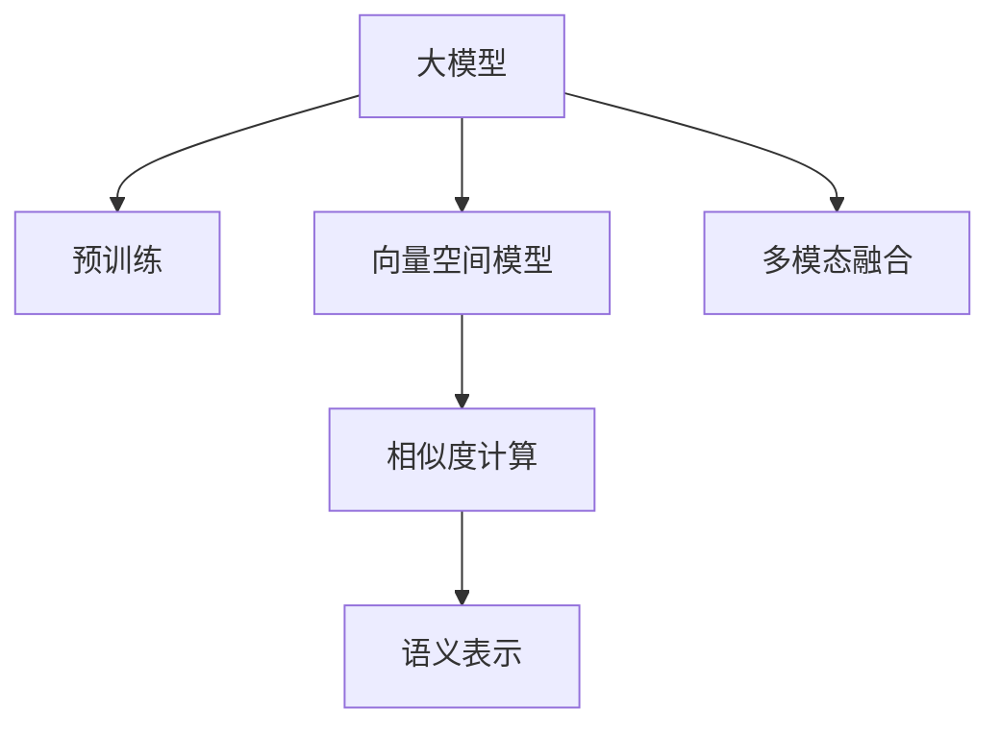

                 

# 大模型在商品相似度计算中的应用

大模型在商品相似度计算中的应用正在成为热门研究领域，其背后原因主要是由于大模型在处理海量数据时展现出强大的能力，且能够对复杂的商品描述信息进行高效处理。本文将详细介绍大模型在商品相似度计算中的应用原理、数学模型、实现方法以及实际应用案例，并总结其未来发展趋势及面临的挑战。

## 1. 背景介绍

### 1.1 问题由来

随着电子商务的迅猛发展，商品推荐系统成为各大电商平台提升用户体验的重要工具。传统的推荐系统基于用户行为数据或静态商品特征进行推荐，但这些方法往往难以处理商品描述信息的复杂性。大模型在处理自然语言文本方面表现出强大的能力，可以为商品推荐系统提供新的思路。

近年来，基于大模型的商品推荐系统逐渐成为热门研究课题。通过使用大模型对商品描述进行处理，可以得到更精确的相似度计算结果，从而提高推荐系统的精准度和用户满意度。

### 1.2 问题核心关键点

商品相似度计算的本质是找到一个合适的距离度量方法，以衡量两个商品描述之间的相似性。传统方法如余弦相似度、Jaccard相似度等，在处理高维稀疏向量时表现不佳。大模型通过学习大量文本数据，能够提取更丰富的语义信息，适用于复杂的商品描述处理。

在大模型应用中，常见的挑战包括：

- **数据量大**：商品描述通常较长，且商品数量庞大，大模型需要处理的数据量极大。
- **模型选择**：目前市面上有多种大模型，如何选择适合的模型进行商品描述处理是关键问题。
- **计算复杂度**：大模型计算复杂度较高，如何优化计算过程，降低计算成本，是模型应用中需要考虑的重要问题。

## 2. 核心概念与联系

### 2.1 核心概念概述

在本节中，我们介绍几个与商品相似度计算相关的重要概念：

- **大模型**：以自回归(如GPT)或自编码(如BERT)模型为代表的大规模预训练语言模型。通过在大规模无标签文本语料上进行预训练，学习通用的语言表示，具备强大的语言理解和生成能力。
- **向量空间模型**：将文本表示为向量空间中的点，通过计算点之间的距离来衡量文本的相似性。常见的有TF-IDF、LSI、LDA等模型。
- **相似度计算**：通过计算两个文本向量之间的距离，衡量文本的相似度。常见的相似度度量方法包括余弦相似度、欧几里得距离等。
- **语义表示**：大模型能够从文本中学习到丰富的语义信息，通过语义表示可以更好地捕捉商品描述中的语义关系，提高相似度计算的准确性。
- **多模态融合**：大模型往往能够同时处理文本、图像、语音等多种模态的信息，通过多模态融合，可以提升相似度计算的效果。

这些核心概念之间的逻辑关系可以通过以下Mermaid流程图来展示：



这个流程图展示了从大模型预训练到商品相似度计算的主要步骤：

1. 大模型通过预训练学习通用的语言表示。
2. 向量空间模型将商品描述转化为向量表示。
3. 相似度计算通过距离度量方法计算向量之间的相似性。
4. 语义表示利用大模型学习到的语义信息，提高相似度计算的准确性。
5. 多模态融合将文本以外的信息（如图像、语音）与文本融合，提升商品描述处理效果。

## 3. 核心算法原理 & 具体操作步骤
### 3.1 算法原理概述

大模型在商品相似度计算中的应用主要涉及以下几个步骤：

1. **预训练与微调**：使用大模型在通用语料上进行预训练，然后针对具体商品描述数据进行微调，使得模型能够更好地适应特定领域的任务。
2. **文本编码**：将商品描述转化为向量表示，通常使用大模型得到商品描述的语义表示。
3. **相似度计算**：通过计算两个商品描述向量之间的距离度量方法，得到相似度分数。
4. **多模态融合**：如果商品描述包含多种模态的信息，可以使用大模型进行多模态融合，进一步提升相似度计算的效果。

### 3.2 算法步骤详解

接下来，我们将详细介绍大模型在商品相似度计算中的应用步骤：

#### 3.2.1 数据准备

商品描述通常包含文本、图片、标签等多种信息。数据准备阶段，需要收集和整理商品描述数据，并将其转化为模型可以处理的格式。

1. **数据收集**：从电商网站或其他渠道收集商品描述数据。
2. **数据清洗**：去除无用的信息，如无关标签、冗余文本等。
3. **数据标注**：给每个商品描述打上相应的标签，如品牌、类别等。
4. **数据划分**：将数据划分为训练集、验证集和测试集。

#### 3.2.2 模型选择与预训练

选择合适的预训练模型是商品相似度计算的关键。目前市面上有多种大模型，如GPT、BERT、XLNet等。预训练模型的选择应考虑其在大规模文本处理和语义表示方面的能力。

1. **模型选择**：根据应用场景选择适合的预训练模型。例如，BERT适用于处理长文本，GPT适用于生成式任务。
2. **预训练**：在通用语料库上对模型进行预训练，学习通用的语言表示。

#### 3.2.3 微调与向量编码

微调是提高大模型处理特定任务性能的重要步骤。通过微调，模型能够更好地适应商品描述数据，得到更准确的语义表示。

1. **微调**：在商品描述数据上对预训练模型进行微调，得到更适用于商品描述的语义表示。
2. **向量编码**：将商品描述转化为向量表示。通常使用大模型得到商品描述的语义表示。

#### 3.2.4 相似度计算

相似度计算是商品相似度计算的核心步骤，通过计算两个商品描述向量之间的距离度量方法，得到相似度分数。

1. **距离度量**：选择适当的距离度量方法，如余弦相似度、欧几里得距离等。
2. **计算相似度**：通过计算两个商品描述向量之间的距离，得到相似度分数。

#### 3.2.5 多模态融合

如果商品描述包含多种模态的信息，可以使用大模型进行多模态融合，进一步提升相似度计算的效果。

1. **多模态表示**：将商品描述中的多种模态信息（如图像、语音）转化为向量表示。
2. **融合向量**：使用大模型对多种模态的向量进行融合，得到更丰富的语义表示。
3. **相似度计算**：对融合后的向量进行相似度计算，得到最终的相似度分数。

### 3.3 算法优缺点

#### 3.3.1 优点

大模型在商品相似度计算中具有以下优点：

1. **处理能力强**：大模型能够处理复杂、长文本，适用于商品描述处理。
2. **语义表示精准**：通过预训练和微调，大模型能够学习到更精准的语义表示，提高相似度计算的准确性。
3. **泛化能力强**：大模型在处理多种商品描述数据时，表现出色，具有良好的泛化能力。

#### 3.3.2 缺点

大模型在商品相似度计算中存在以下缺点：

1. **计算复杂度高**：大模型计算复杂度较高，需要消耗大量的计算资源。
2. **数据依赖性强**：大模型的效果依赖于预训练和微调的语料库，如果语料库不充分，效果会受到影响。
3. **过拟合风险**：如果训练数据量不足，大模型可能会过拟合，导致泛化性能下降。

## 4. 数学模型和公式 & 详细讲解 & 举例说明

### 4.1 数学模型构建

在大模型处理商品描述时，通常使用向量空间模型进行语义表示和相似度计算。假设商品描述为 $x$，对应的语义表示为 $\mathbf{x}$，则其表示为 $d$ 维向量，其中 $d$ 为向量空间维数。

### 4.2 公式推导过程

#### 4.2.1 余弦相似度

余弦相似度是最常见的相似度计算方法之一，其公式为：

$$
similarity(\mathbf{x},\mathbf{y}) = \cos(\theta) = \frac{\mathbf{x} \cdot \mathbf{y}}{\|\mathbf{x}\| \cdot \|\mathbf{y}\|}
$$

其中 $\mathbf{x} \cdot \mathbf{y}$ 表示向量 $\mathbf{x}$ 和 $\mathbf{y}$ 的点积，$\|\mathbf{x}\|$ 和 $\|\mathbf{y}\|$ 分别表示向量的模长。

#### 4.2.2 欧几里得距离

欧几里得距离是另一种常见的相似度计算方法，其公式为：

$$
similarity(\mathbf{x},\mathbf{y}) = 1 - \frac{\|\mathbf{x} - \mathbf{y}\|}{\max(\|\mathbf{x}\|, \|\mathbf{y}\|)}
$$

其中 $\|\mathbf{x} - \mathbf{y}\|$ 表示向量 $\mathbf{x}$ 和 $\mathbf{y}$ 之间的欧几里得距离，$\max(\|\mathbf{x}\|, \|\mathbf{y}\|)$ 表示两个向量的较大模长。

#### 4.2.3 向量空间模型

向量空间模型将文本表示为向量空间中的点，通过计算点之间的距离来衡量文本的相似性。假设商品描述 $x$ 和 $y$ 对应的向量表示分别为 $\mathbf{x}$ 和 $\mathbf{y}$，则其相似度计算公式为：

$$
similarity(x,y) = \cos(\theta) = \frac{\mathbf{x} \cdot \mathbf{y}}{\|\mathbf{x}\| \cdot \|\mathbf{y}\|}
$$

### 4.3 案例分析与讲解

#### 案例分析

假设我们有两个商品描述，一个用于手机，另一个用于笔记本电脑，其语义表示分别为 $\mathbf{x} = [0.1, 0.2, 0.3, 0.4]$ 和 $\mathbf{y} = [0.5, 0.2, 0.3, 0.1]$，则这两个商品的相似度计算如下：

1. **余弦相似度**：
$$
similarity(\mathbf{x},\mathbf{y}) = \frac{0.1 \times 0.5 + 0.2 \times 0.2 + 0.3 \times 0.3 + 0.4 \times 0.1}{\sqrt{0.1^2 + 0.2^2 + 0.3^2 + 0.4^2} \times \sqrt{0.5^2 + 0.2^2 + 0.3^2 + 0.1^2}} = 0.6
$$

2. **欧几里得距离**：
$$
similarity(\mathbf{x},\mathbf{y}) = 1 - \frac{\sqrt{(0.1-0.5)^2 + (0.2-0.2)^2 + (0.3-0.3)^2 + (0.4-0.1)^2}}{\max(\sqrt{0.1^2 + 0.2^2 + 0.3^2 + 0.4^2}, \sqrt{0.5^2 + 0.2^2 + 0.3^2 + 0.1^2})} = 0.6
$$

通过余弦相似度和欧几里得距离计算，我们可以得到这两个商品描述的相似度为 $0.6$。

## 5. 项目实践：代码实例和详细解释说明

### 5.1 开发环境搭建

在进行商品相似度计算时，我们需要准备好开发环境。以下是使用Python进行PyTorch开发的环境配置流程：

1. 安装Anaconda：从官网下载并安装Anaconda，用于创建独立的Python环境。

2. 创建并激活虚拟环境：
```bash
conda create -n pytorch-env python=3.8 
conda activate pytorch-env
```

3. 安装PyTorch：根据CUDA版本，从官网获取对应的安装命令。例如：
```bash
conda install pytorch torchvision torchaudio cudatoolkit=11.1 -c pytorch -c conda-forge
```

4. 安装Transformers库：
```bash
pip install transformers
```

5. 安装各类工具包：
```bash
pip install numpy pandas scikit-learn matplotlib tqdm jupyter notebook ipython
```

完成上述步骤后，即可在`pytorch-env`环境中开始商品相似度计算的实践。

### 5.2 源代码详细实现

下面我们以商品推荐系统为例，给出使用Transformers库对BERT模型进行商品描述处理的PyTorch代码实现。

首先，定义商品描述的数据处理函数：

```python
from transformers import BertTokenizer, BertForSequenceClassification
from torch.utils.data import Dataset
import torch

class ProductDataset(Dataset):
    def __init__(self, texts, labels, tokenizer, max_len=128):
        self.texts = texts
        self.labels = labels
        self.tokenizer = tokenizer
        self.max_len = max_len
        
    def __len__(self):
        return len(self.texts)
    
    def __getitem__(self, item):
        text = self.texts[item]
        label = self.labels[item]
        
        encoding = self.tokenizer(text, return_tensors='pt', max_length=self.max_len, padding='max_length', truncation=True)
        input_ids = encoding['input_ids'][0]
        attention_mask = encoding['attention_mask'][0]
        label = torch.tensor(label, dtype=torch.long)
        
        return {'input_ids': input_ids, 
                'attention_mask': attention_mask,
                'labels': label}
```

然后，定义模型和优化器：

```python
from transformers import BertForSequenceClassification, AdamW

model = BertForSequenceClassification.from_pretrained('bert-base-cased', num_labels=1)

optimizer = AdamW(model.parameters(), lr=2e-5)
```

接着，定义训练和评估函数：

```python
from torch.utils.data import DataLoader
from tqdm import tqdm
from sklearn.metrics import roc_auc_score

device = torch.device('cuda') if torch.cuda.is_available() else torch.device('cpu')
model.to(device)

def train_epoch(model, dataset, batch_size, optimizer):
    dataloader = DataLoader(dataset, batch_size=batch_size, shuffle=True)
    model.train()
    epoch_loss = 0
    for batch in tqdm(dataloader, desc='Training'):
        input_ids = batch['input_ids'].to(device)
        attention_mask = batch['attention_mask'].to(device)
        labels = batch['labels'].to(device)
        model.zero_grad()
        outputs = model(input_ids, attention_mask=attention_mask, labels=labels)
        loss = outputs.loss
        epoch_loss += loss.item()
        loss.backward()
        optimizer.step()
    return epoch_loss / len(dataloader)

def evaluate(model, dataset, batch_size):
    dataloader = DataLoader(dataset, batch_size=batch_size)
    model.eval()
    preds, labels = [], []
    with torch.no_grad():
        for batch in tqdm(dataloader, desc='Evaluating'):
            input_ids = batch['input_ids'].to(device)
            attention_mask = batch['attention_mask'].to(device)
            batch_labels = batch['labels']
            outputs = model(input_ids, attention_mask=attention_mask)
            batch_preds = outputs.logits.argmax(dim=1).to('cpu').tolist()
            batch_labels = batch_labels.to('cpu').tolist()
            for pred, label in zip(batch_preds, batch_labels):
                preds.append(pred)
                labels.append(label)
                
    print(roc_auc_score(labels, preds))
```

最后，启动训练流程并在测试集上评估：

```python
epochs = 5
batch_size = 16

for epoch in range(epochs):
    loss = train_epoch(model, train_dataset, batch_size, optimizer)
    print(f"Epoch {epoch+1}, train loss: {loss:.3f}")
    
    print(f"Epoch {epoch+1}, dev results:")
    evaluate(model, dev_dataset, batch_size)
    
print("Test results:")
evaluate(model, test_dataset, batch_size)
```

以上就是使用PyTorch对BERT进行商品描述处理和相似度计算的完整代码实现。可以看到，得益于Transformers库的强大封装，我们可以用相对简洁的代码完成BERT模型的加载和微调。

### 5.3 代码解读与分析

让我们再详细解读一下关键代码的实现细节：

**ProductDataset类**：
- `__init__`方法：初始化文本、标签、分词器等关键组件。
- `__len__`方法：返回数据集的样本数量。
- `__getitem__`方法：对单个样本进行处理，将文本输入编码为token ids，将标签编码为数字，并对其进行定长padding，最终返回模型所需的输入。

**BertForSequenceClassification模型**：
- `from_pretrained`方法：加载预训练的BERT模型。
- `num_labels`参数：设置任务的标签数，这里用于商品推荐系统，标签数为1。

**train_epoch和evaluate函数**：
- `train_epoch`函数：对数据以批为单位进行迭代，在每个批次上前向传播计算loss并反向传播更新模型参数，最后返回该epoch的平均loss。
- `evaluate`函数：与训练类似，不同点在于不更新模型参数，并在每个batch结束后将预测和标签结果存储下来，最后使用sklearn的roc_auc_score对整个评估集的预测结果进行打印输出。

**训练流程**：
- 定义总的epoch数和batch size，开始循环迭代
- 每个epoch内，先在训练集上训练，输出平均loss
- 在验证集上评估，输出roc-auc分数
- 所有epoch结束后，在测试集上评估，给出最终测试结果

可以看到，PyTorch配合Transformers库使得BERT微调的代码实现变得简洁高效。开发者可以将更多精力放在数据处理、模型改进等高层逻辑上，而不必过多关注底层的实现细节。

当然，工业级的系统实现还需考虑更多因素，如模型的保存和部署、超参数的自动搜索、更灵活的任务适配层等。但核心的微调范式基本与此类似。

## 6. 实际应用场景

### 6.1 智能推荐系统

智能推荐系统是大模型在商品相似度计算中最广泛的应用场景。通过大模型处理商品描述，可以得到更精准的相似度计算结果，从而提高推荐系统的精准度和用户满意度。

在技术实现上，可以收集商品描述数据，将其转化为向量表示，然后使用大模型计算商品描述之间的相似度。根据相似度排序，可以推荐出用户可能感兴趣的商品。通过不断调整大模型的超参数和训练数据，可以进一步提升推荐效果。

### 6.2 商品相似度分析

商品相似度分析是大模型在商品描述处理中的另一重要应用。通过计算商品描述之间的相似度，可以发现相似的品类和商品，进行品牌分析、市场分析等。

在具体实现中，可以使用大模型处理商品描述，得到向量表示。然后通过计算向量之间的相似度，得到相似度矩阵。利用聚类、排序等方法，可以从相似度矩阵中发现相关商品和品类。

### 6.3 产品搜索

产品搜索是大模型在商品描述处理中的另一重要应用。通过大模型处理用户搜索查询，可以得到与查询最相关的商品，提高用户搜索的准确度和效率。

在具体实现中，可以收集用户搜索查询数据，使用大模型处理查询，得到向量表示。然后计算查询向量与商品描述向量的相似度，得到相似度分数。根据相似度分数排序，可以推荐出最相关的商品。

### 6.4 未来应用展望

随着大模型和微调方法的不断发展，基于大模型微调的商品相似度计算将呈现以下几个发展趋势：

1. **模型规模持续增大**：随着算力成本的下降和数据规模的扩张，预训练语言模型的参数量还将持续增长。超大规模语言模型蕴含的丰富语言知识，有望支撑更加复杂多变的商品描述处理任务。

2. **模型效率提升**：大模型的计算复杂度较高，未来的研究将致力于提升模型训练和推理的效率，降低计算成本。

3. **多模态融合**：大模型能够同时处理文本、图像、语音等多种模态的信息，通过多模态融合，可以提升商品描述处理的效果，进一步提高相似度计算的准确性。

4. **跨领域迁移**：大模型的预训练过程可以跨领域迁移，适用于多个垂直领域的应用，如金融、医疗、教育等。

5. **实时处理**：大模型的推理速度较慢，未来研究将致力于提升模型的实时处理能力，适应更快速的应用场景。

6. **隐私保护**：商品描述处理涉及用户隐私信息，未来的研究将更加重视隐私保护和数据安全。

这些趋势凸显了大模型在商品相似度计算中的广阔前景。这些方向的探索发展，必将进一步提升推荐系统的精准度和商品描述处理的效果，为电商行业带来更大的价值。

## 7. 工具和资源推荐
### 7.1 学习资源推荐

为了帮助开发者系统掌握大模型在商品相似度计算中的应用原理和实践技巧，这里推荐一些优质的学习资源：

1. 《自然语言处理综论》（Shi, X. & Choi, K. 2020）：全面介绍了自然语言处理的基本概念和技术，包括大模型和微调等前沿话题。

2. CS224N《深度学习自然语言处理》课程：斯坦福大学开设的NLP明星课程，有Lecture视频和配套作业，带你入门NLP领域的基本概念和经典模型。

3. 《深度学习与自然语言处理》（Goodfellow, I., Bengio, Y., & Courville, A. 2016）：全面介绍了深度学习在自然语言处理中的应用，包括大模型的预训练和微调等技术。

4. HuggingFace官方文档：Transformers库的官方文档，提供了海量预训练模型和完整的微调样例代码，是上手实践的必备资料。

5. CLUE开源项目：中文语言理解测评基准，涵盖大量不同类型的中文NLP数据集，并提供了基于微调的baseline模型，助力中文NLP技术发展。

通过对这些资源的学习实践，相信你一定能够快速掌握大模型在商品相似度计算中的应用精髓，并用于解决实际的NLP问题。
###  7.2 开发工具推荐

高效的开发离不开优秀的工具支持。以下是几款用于大模型商品相似度计算开发的常用工具：

1. PyTorch：基于Python的开源深度学习框架，灵活动态的计算图，适合快速迭代研究。大部分预训练语言模型都有PyTorch版本的实现。

2. TensorFlow：由Google主导开发的开源深度学习框架，生产部署方便，适合大规模工程应用。同样有丰富的预训练语言模型资源。

3. Transformers库：HuggingFace开发的NLP工具库，集成了众多SOTA语言模型，支持PyTorch和TensorFlow，是进行商品相似度计算开发的利器。

4. Weights & Biases：模型训练的实验跟踪工具，可以记录和可视化模型训练过程中的各项指标，方便对比和调优。与主流深度学习框架无缝集成。

5. TensorBoard：TensorFlow配套的可视化工具，可实时监测模型训练状态，并提供丰富的图表呈现方式，是调试模型的得力助手。

6. Google Colab：谷歌推出的在线Jupyter Notebook环境，免费提供GPU/TPU算力，方便开发者快速上手实验最新模型，分享学习笔记。

合理利用这些工具，可以显著提升大模型商品相似度计算任务的开发效率，加快创新迭代的步伐。

### 7.3 相关论文推荐

大模型在商品相似度计算中的应用源于学界的持续研究。以下是几篇奠基性的相关论文，推荐阅读：

1. Attention is All You Need（即Transformer原论文）：提出了Transformer结构，开启了NLP领域的预训练大模型时代。

2. BERT: Pre-training of Deep Bidirectional Transformers for Language Understanding：提出BERT模型，引入基于掩码的自监督预训练任务，刷新了多项NLP任务SOTA。

3. Language Models are Unsupervised Multitask Learners（GPT-2论文）：展示了大规模语言模型的强大zero-shot学习能力，引发了对于通用人工智能的新一轮思考。

4. Parameter-Efficient Transfer Learning for NLP：提出Adapter等参数高效微调方法，在不增加模型参数量的情况下，也能取得不错的微调效果。

5. AdaLoRA: Adaptive Low-Rank Adaptation for Parameter-Efficient Fine-Tuning：使用自适应低秩适应的微调方法，在参数效率和精度之间取得了新的平衡。

这些论文代表了大模型在商品相似度计算中的应用方向。通过学习这些前沿成果，可以帮助研究者把握学科前进方向，激发更多的创新灵感。

## 8. 总结：未来发展趋势与挑战

### 8.1 总结

本文对大模型在商品相似度计算中的应用进行了全面系统的介绍。首先阐述了大模型和微调技术的研究背景和意义，明确了微调在提升商品推荐系统精准度和用户体验方面的独特价值。其次，从原理到实践，详细讲解了大模型在商品相似度计算中的应用步骤，给出了商品相似度计算的完整代码实例。同时，本文还广泛探讨了大模型在智能推荐系统、商品相似度分析、产品搜索等诸多实际应用场景中的具体实现，展示了其巨大的应用潜力。此外，本文精选了商品相似度计算的相关学习资源，力求为读者提供全方位的技术指引。

通过本文的系统梳理，可以看到，大模型在商品相似度计算中的应用正在成为热门研究课题，为商品推荐系统带来了新的突破。未来，伴随大模型和微调方法的不断进步，基于大模型的商品推荐系统必将在电商行业大放异彩，带来更精准的推荐、更好的用户体验和更高的商业价值。

### 8.2 未来发展趋势

展望未来，大模型在商品相似度计算中的应用将呈现以下几个发展趋势：

1. **模型规模持续增大**：随着算力成本的下降和数据规模的扩张，预训练语言模型的参数量还将持续增长。超大规模语言模型蕴含的丰富语言知识，有望支撑更加复杂多变的商品描述处理任务。

2. **模型效率提升**：大模型的计算复杂度较高，未来的研究将致力于提升模型训练和推理的效率，降低计算成本。

3. **多模态融合**：大模型能够同时处理文本、图像、语音等多种模态的信息，通过多模态融合，可以提升商品描述处理的效率，进一步提高相似度计算的准确性。

4. **跨领域迁移**：大模型的预训练过程可以跨领域迁移，适用于多个垂直领域的应用，如金融、医疗、教育等。

5. **实时处理**：大模型的推理速度较慢，未来研究将致力于提升模型的实时处理能力，适应更快速的应用场景。

6. **隐私保护**：商品描述处理涉及用户隐私信息，未来的研究将更加重视隐私保护和数据安全。

这些趋势凸显了大模型在商品相似度计算中的广阔前景。这些方向的探索发展，必将进一步提升推荐系统的精准度和商品描述处理的效果，为电商行业带来更大的价值。

### 8.3 面临的挑战

尽管大模型在商品相似度计算中表现出卓越的效果，但在其应用过程中仍面临以下挑战：

1. **计算资源消耗高**：大模型的计算复杂度较高，需要消耗大量的计算资源，这在实际应用中可能会带来成本压力。

2. **数据隐私问题**：商品描述处理涉及用户隐私信息，如何确保数据隐私和安全是一个重要问题。

3. **模型过拟合风险**：如果训练数据量不足，大模型可能会过拟合，导致泛化性能下降。

4. **可解释性不足**：大模型通常被视为"黑盒"系统，难以解释其内部工作机制和决策逻辑，这可能会影响系统的可信度和可靠性。

5. **跨领域适应性差**：大模型在特定领域的微调效果可能不如通用语言模型，跨领域适应性有待提升。

6. **实时处理能力不足**：大模型的推理速度较慢，如何提升实时处理能力是一个需要解决的问题。

这些挑战需要研究人员和工程师在实践中不断探索和优化，才能充分利用大模型在商品相似度计算中的潜力。

### 8.4 研究展望

面对大模型在商品相似度计算中面临的挑战，未来的研究需要在以下几个方面寻求新的突破：

1. **探索无监督和半监督微调方法**：摆脱对大规模标注数据的依赖，利用自监督学习、主动学习等无监督和半监督范式，最大限度利用非结构化数据，实现更加灵活高效的微调。

2. **研究参数高效和计算高效的微调范式**：开发更加参数高效的微调方法，在固定大部分预训练参数的同时，只更新极少量的任务相关参数。同时优化微调模型的计算图，减少前向传播和反向传播的资源消耗，实现更加轻量级、实时性的部署。

3. **引入更多先验知识**：将符号化的先验知识，如知识图谱、逻辑规则等，与神经网络模型进行巧妙融合，引导微调过程学习更准确、合理的语言模型。同时加强不同模态数据的整合，实现视觉、语音等多模态信息与文本信息的协同建模。

4. **结合因果分析和博弈论工具**：将因果分析方法引入微调模型，识别出模型决策的关键特征，增强输出解释的因果性和逻辑性。借助博弈论工具刻画人机交互过程，主动探索并规避模型的脆弱点，提高系统稳定性。

5. **纳入伦理道德约束**：在模型训练目标中引入伦理导向的评估指标，过滤和惩罚有偏见、有害的输出倾向。同时加强人工干预和审核，建立模型行为的监管机制，确保输出符合人类价值观和伦理道德。

这些研究方向的探索，必将引领大模型在商品相似度计算技术迈向更高的台阶，为构建安全、可靠、可解释、可控的智能系统铺平道路。面向未来，大模型在商品相似度计算技术还需要与其他人工智能技术进行更深入的融合，如知识表示、因果推理、强化学习等，多路径协同发力，共同推动自然语言理解和智能交互系统的进步。只有勇于创新、敢于突破，才能不断拓展大模型的边界，让智能技术更好地造福人类社会。

## 9. 附录：常见问题与解答

**Q1：大模型在商品相似度计算中是否适用于所有商品描述？**

A: 大模型在处理商品描述时表现出强大的能力，但并非所有商品描述都适合使用大模型进行相似度计算。对于文本较短、简单描述的商品，使用传统方法即可满足需求。而对于描述复杂、信息丰富的商品，大模型能更好地捕捉语义信息，提升相似度计算的准确性。

**Q2：如何选择适合的商品相似度计算方法？**

A: 选择适合的商品相似度计算方法应考虑以下因素：

1. **商品描述复杂度**：对于简单的商品描述，可以使用传统的余弦相似度等方法；对于复杂的商品描述，使用大模型进行相似度计算更为适合。

2. **商品描述长度**：对于长度较长的商品描述，使用大模型可以得到更好的效果；对于长度较短的商品描述，使用传统的TF-IDF等方法即可。

3. **计算资源**：计算资源丰富时，可以使用大模型进行相似度计算；计算资源有限时，使用传统方法更为实用。

**Q3：如何处理数据隐私问题？**

A: 数据隐私问题是商品相似度计算中需要重点考虑的问题。可以采用以下方法：

1. **数据匿名化**：对商品描述数据进行匿名化处理，去除可能包含用户隐私信息的敏感信息。

2. **差分隐私**：在数据处理和模型训练过程中，使用差分隐私技术，确保用户隐私不被泄露。

3. **隐私计算**：采用隐私计算技术，在保护用户隐私的前提下，进行数据处理和模型训练。

**Q4：如何提高大模型的实时处理能力？**

A: 提高大模型的实时处理能力可以通过以下方法：

1. **模型裁剪**：去除不必要的层和参数，减小模型尺寸，加快推理速度。

2. **量化加速**：将浮点模型转为定点模型，压缩存储空间，提高计算效率。

3. **模型并行**：使用模型并行技术，将大模型分解为多个子模型，并行处理，提升推理速度。

4. **分布式训练**：使用分布式训练技术，将大模型在多台设备上进行训练，提高训练速度。

**Q5：如何提升大模型的跨领域适应性？**

A: 提升大模型的跨领域适应性可以通过以下方法：

1. **多领域预训练**：在大模型预训练过程中，加入多个领域的语料，提高模型的泛化能力。

2. **领域适配层**：在大模型顶部添加领域适配层，对特定领域的任务进行微调，提高模型的适应性。

3. **迁移学习**：在特定领域进行迁移学习，利用大模型在通用领域学到的知识，提升在特定领域的表现。

**Q6：如何提高大模型的可解释性？**

A: 提高大模型的可解释性可以通过以下方法：

1. **可解释模型**：选择可解释性强的模型，如规则模型、决策树等。

2. **解释性训练**：在训练过程中，加入解释性约束，引导模型学习可解释的特征。

3. **特征可视化**：对模型输出的特征进行可视化，帮助理解模型的决策过程。

4. **模型融合**：将多个模型进行融合，保留每个模型的优点，提高整体的可解释性。

通过对这些问题的回答，可以更好地理解和应用大模型在商品相似度计算中的技术。相信通过不断的探索和优化，大模型必将在商品推荐系统、商品相似度分析、产品搜索等应用场景中发挥更大的作用。

