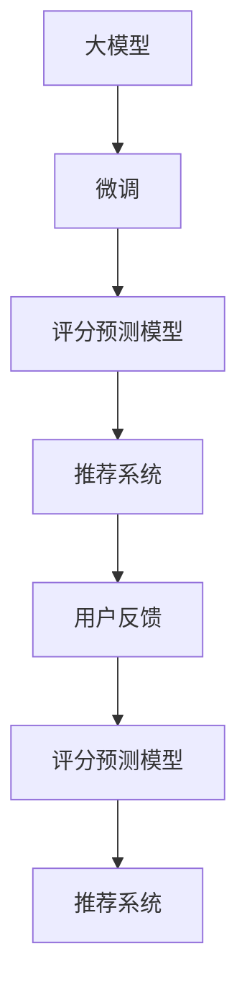

                 

# 大模型在商品评分预测中的应用

> 关键词：大模型,商品评分预测,深度学习,自然语言处理(NLP),机器学习,数据挖掘,推荐系统

## 1. 背景介绍

商品评分预测是大数据分析和机器学习领域的一个重要应用，旨在通过历史评分数据预测用户对未评分商品的评分。这一任务对于提升电商平台的用户体验、优化商品推荐系统具有重要意义。传统的评分预测方法基于统计学或基于特征的机器学习方法，但随着深度学习和大模型的发展，基于预训练语言模型(Pre-trained Language Models, PLMs)的方法开始崭露头角，并展现出了巨大的潜力。

### 1.1 问题由来

随着互联网电商的普及，消费者对商品评价和反馈的贡献越来越重要。商品评分预测可以通过消费者对已购买商品的评分，来推测其对未购买商品的评分，从而优化商品推荐、定价策略和库存管理等。传统的评分预测方法依赖于统计学假设和手工设计的特征工程，难以充分利用海量的文本数据和大规模预训练模型的知识。而基于大模型的预测方法，通过微调预训练模型来适应特定任务，显著提升了预测的准确性和泛化能力。

### 1.2 问题核心关键点
- **预训练语言模型**：大规模的预训练模型，如BERT、GPT等，通过对大规模无标签文本数据的自监督训练，获得了丰富的语言表示能力。
- **微调**：在预训练模型基础上，通过有监督的微调过程，针对特定评分预测任务进行参数调整，从而提升模型的预测能力。
- **数据驱动**：评分预测主要依赖于历史评分数据和用户评论等文本数据，需要收集和清洗大规模的数据集。
- **模型集成**：通过集成多个微调模型或引入外部知识库，提高评分预测的稳定性和鲁棒性。
- **反馈循环**：评分预测结果通过推荐系统反哺用户，用户行为又不断影响评分预测模型的训练，形成正反馈循环。

## 2. 核心概念与联系

### 2.1 核心概念概述

为了更好地理解大模型在商品评分预测中的应用，本节将介绍几个关键概念及其相互联系：

- **大模型**：如BERT、GPT等预训练语言模型，通过对大规模无标签文本数据的自监督训练，获得了丰富的语言表示能力。
- **微调**：在预训练模型基础上，通过有监督的微调过程，针对特定评分预测任务进行参数调整，从而提升模型的预测能力。
- **评分预测**：根据用户的历史评分数据和文本反馈，预测用户对未评分商品的评分，优化商品推荐系统。
- **用户反馈**：用户对商品的评分和评论，是评分预测模型的关键输入，反映了用户对商品的主观评价和满意度。
- **推荐系统**：基于用户评分预测结果，动态调整推荐算法，提升用户满意度，促进电商平台的商业价值。

这些概念通过一系列技术手段和算法流程，相互关联、相互促进，共同构成了商品评分预测的完整体系。

### 2.2 核心概念原理和架构的 Mermaid 流程图



该流程图展示了大模型在商品评分预测中的核心流程和相互关系：

1. 大模型通过预训练学习丰富的语言表示。
2. 基于微调过程，模型适配特定评分预测任务，获得更强的预测能力。
3. 评分预测模型对用户反馈进行评分预测，生成商品推荐结果。
4. 推荐系统根据评分预测结果，动态调整推荐算法。
5. 用户反馈不断回流到评分预测模型，进一步提升模型的预测能力。

## 3. 核心算法原理 & 具体操作步骤
### 3.1 算法原理概述

基于大模型的商品评分预测方法，本质上是一个有监督的细粒度迁移学习过程。其核心思想是：利用预训练大模型的语言表示能力，通过微调针对特定评分预测任务进行参数调整，使得模型能够更准确地预测用户对商品的评分。

形式化地，假设预训练模型为 $M_{\theta}$，其中 $\theta$ 为预训练得到的模型参数。给定商品评分预测任务 $T$ 的训练集 $D=\{(x_i, y_i)\}_{i=1}^N$，评分预测模型的目标是找到新的模型参数 $\hat{\theta}$，使得：

$$
\hat{\theta}=\mathop{\arg\min}_{\theta} \mathcal{L}(M_{\theta},D)
$$

其中 $\mathcal{L}$ 为针对任务 $T$ 设计的损失函数，用于衡量模型预测输出与真实标签之间的差异。常见的损失函数包括交叉熵损失、均方误差损失等。

通过梯度下降等优化算法，评分预测模型不断更新模型参数 $\theta$，最小化损失函数 $\mathcal{L}$，使得模型输出逼近真实标签。由于 $\theta$ 已经通过预训练获得了较强的表示能力，因此即便在评分预测任务上数据量较少的情况下，也能较快收敛到理想的模型参数 $\hat{\theta}$。

### 3.2 算法步骤详解

基于大模型的商品评分预测一般包括以下几个关键步骤：

**Step 1: 准备预训练模型和数据集**
- 选择合适的预训练语言模型 $M_{\theta}$ 作为初始化参数，如 BERT、GPT等。
- 准备商品评分预测任务的训练集 $D$，包含用户对已购买商品的评分和对应的文本评论。一般要求数据集和预训练数据的分布不要差异过大。

**Step 2: 添加评分预测层**
- 根据评分预测任务，在预训练模型顶层设计合适的评分预测器。
- 对于二元评分预测任务，通常在顶层添加线性分类器和交叉熵损失函数。
- 对于多元评分预测任务，可以使用回归损失函数，如均方误差、绝对误差等。

**Step 3: 设置微调超参数**
- 选择合适的优化算法及其参数，如 AdamW、SGD 等，设置学习率、批大小、迭代轮数等。
- 设置正则化技术及强度，包括权重衰减、Dropout、Early Stopping等。
- 确定冻结预训练参数的策略，如仅微调顶层，或全部参数都参与微调。

**Step 4: 执行梯度训练**
- 将训练集数据分批次输入模型，前向传播计算损失函数。
- 反向传播计算参数梯度，根据设定的优化算法和学习率更新模型参数。
- 周期性在验证集上评估模型性能，根据性能指标决定是否触发 Early Stopping。
- 重复上述步骤直到满足预设的迭代轮数或 Early Stopping 条件。

**Step 5: 测试和部署**
- 在测试集上评估微调后评分预测模型的性能，对比微调前后的精度提升。
- 使用微调后的模型对新商品进行评分预测，集成到实际的商品推荐系统中。
- 持续收集新的评分数据，定期重新微调模型，以适应评分分布的变化。

以上是基于大模型的商品评分预测的一般流程。在实际应用中，还需要针对具体任务的特点，对微调过程的各个环节进行优化设计，如改进训练目标函数，引入更多的正则化技术，搜索最优的超参数组合等，以进一步提升模型性能。

### 3.3 算法优缺点

基于大模型的商品评分预测方法具有以下优点：
1. 准确性高。通过预训练模型的迁移学习能力，模型可以在数据量较少的情况下，获得较好的预测性能。
2. 泛化能力强。预训练模型具备较强的泛化能力，对新商品的评分预测也表现出较好的性能。
3. 参数高效。利用参数高效微调技术，在固定大部分预训练参数的情况下，仍可取得不错的预测效果。
4. 处理能力强。大模型可以处理复杂的多元评分预测任务，能够准确捕捉商品评分的多样性和层次性。

同时，该方法也存在一定的局限性：
1. 数据依赖。评分预测任务严重依赖于标注数据的质量和数量，获取高质量标注数据的成本较高。
2. 数据偏差。预训练模型可能学习到与特定商品或用户群体相关的偏见，影响评分预测的公平性和可靠性。
3. 计算资源消耗大。大模型的微调需要大量计算资源，对于计算资源有限的场景，可能难以实现。
4. 模型复杂度高。大规模预训练模型和微调过程较复杂，模型的部署和维护成本较高。

尽管存在这些局限性，但基于大模型的商品评分预测方法在电商推荐系统中仍具有重要应用价值。未来相关研究的重点在于如何进一步降低对标注数据的依赖，提高模型的泛化能力和鲁棒性，同时兼顾可解释性和成本效益等因素。

### 3.4 算法应用领域

基于大模型的商品评分预测方法，已经在电商推荐系统、金融风控、客户评价分析等多个领域得到了广泛的应用，涵盖了从二元评分预测到多元评分预测、从静态评分预测到动态评分预测等多个任务，为数据驱动的决策优化提供了强大的技术支持。

## 4. 数学模型和公式 & 详细讲解 & 举例说明

### 4.1 数学模型构建

本节将使用数学语言对基于大模型的商品评分预测过程进行更加严格的刻画。

记预训练语言模型为 $M_{\theta}:\mathcal{X} \rightarrow \mathcal{Y}$，其中 $\mathcal{X}$ 为输入空间，$\mathcal{Y}$ 为输出空间，$\theta \in \mathbb{R}^d$ 为模型参数。假设评分预测任务的训练集为 $D=\{(x_i, y_i)\}_{i=1}^N, x_i \in \mathcal{X}, y_i \in \mathcal{Y}$，其中 $y_i$ 为 $[0, 5]$ 之间的评分或标签。

定义模型 $M_{\theta}$ 在输入 $x$ 上的评分预测为 $\hat{y}=M_{\theta}(x) \in [0,5]$。评分预测模型的目标是最小化经验风险，即找到最优参数：

$$
\theta^* = \mathop{\arg\min}_{\theta} \mathcal{L}(\theta)
$$

其中，$\mathcal{L}$ 为评分预测任务设计的损失函数，用于衡量模型预测输出与真实标签之间的差异。常见的损失函数包括交叉熵损失、均方误差损失等。

### 4.2 公式推导过程

以下我们以二元评分预测任务为例，推导交叉熵损失函数及其梯度的计算公式。

假设模型 $M_{\theta}$ 在输入 $x$ 上的预测评分 $\hat{y}=M_{\theta}(x)$，真实标签 $y \in \{0,1\}$。则二元交叉熵损失函数定义为：

$$
\ell(M_{\theta}(x),y) = -y\log M_{\theta}(x) - (1-y)\log (1-M_{\theta}(x))
$$

将其代入经验风险公式，得：

$$
\mathcal{L}(\theta) = -\frac{1}{N}\sum_{i=1}^N \ell(M_{\theta}(x_i),y_i)
$$

根据链式法则，损失函数对参数 $\theta_k$ 的梯度为：

$$
\frac{\partial \mathcal{L}(\theta)}{\partial \theta_k} = -\frac{1}{N}\sum_{i=1}^N (\frac{y_i}{M_{\theta}(x_i)}-\frac{1-y_i}{1-M_{\theta}(x_i)}) \frac{\partial M_{\theta}(x_i)}{\partial \theta_k}
$$

其中 $\frac{\partial M_{\theta}(x_i)}{\partial \theta_k}$ 可进一步递归展开，利用自动微分技术完成计算。

在得到损失函数的梯度后，即可带入参数更新公式，完成模型的迭代优化。重复上述过程直至收敛，最终得到适应评分预测任务的最优模型参数 $\theta^*$。

## 5. 项目实践：代码实例和详细解释说明
### 5.1 开发环境搭建

在进行评分预测实践前，我们需要准备好开发环境。以下是使用Python进行PyTorch开发的环境配置流程：

1. 安装Anaconda：从官网下载并安装Anaconda，用于创建独立的Python环境。

2. 创建并激活虚拟环境：
```bash
conda create -n pytorch-env python=3.8 
conda activate pytorch-env
```

3. 安装PyTorch：根据CUDA版本，从官网获取对应的安装命令。例如：
```bash
conda install pytorch torchvision torchaudio cudatoolkit=11.1 -c pytorch -c conda-forge
```

4. 安装Transformers库：
```bash
pip install transformers
```

5. 安装各类工具包：
```bash
pip install numpy pandas scikit-learn matplotlib tqdm jupyter notebook ipython
```

完成上述步骤后，即可在`pytorch-env`环境中开始评分预测实践。

### 5.2 源代码详细实现

下面我以电商平台的商品评分预测任务为例，给出使用Transformers库对BERT模型进行评分预测的PyTorch代码实现。

首先，定义评分预测任务的数据处理函数：

```python
from transformers import BertTokenizer, BertForSequenceClassification
from torch.utils.data import Dataset, DataLoader
import torch

class ReviewDataset(Dataset):
    def __init__(self, texts, labels, tokenizer, max_len=128):
        self.texts = texts
        self.labels = labels
        self.tokenizer = tokenizer
        self.max_len = max_len
        
    def __len__(self):
        return len(self.texts)
    
    def __getitem__(self, item):
        text = self.texts[item]
        label = self.labels[item]
        
        encoding = self.tokenizer(text, return_tensors='pt', max_length=self.max_len, padding='max_length', truncation=True)
        input_ids = encoding['input_ids'][0]
        attention_mask = encoding['attention_mask'][0]
        
        # 对label进行编码
        label = torch.tensor(label, dtype=torch.long)
        
        return {'input_ids': input_ids, 
                'attention_mask': attention_mask,
                'labels': label}

# 创建dataset
tokenizer = BertTokenizer.from_pretrained('bert-base-cased')

train_dataset = ReviewDataset(train_texts, train_labels, tokenizer)
dev_dataset = ReviewDataset(dev_texts, dev_labels, tokenizer)
test_dataset = ReviewDataset(test_texts, test_labels, tokenizer)
```

然后，定义模型和优化器：

```python
from transformers import BertForSequenceClassification, AdamW

model = BertForSequenceClassification.from_pretrained('bert-base-cased', num_labels=2)

optimizer = AdamW(model.parameters(), lr=2e-5)
```

接着，定义训练和评估函数：

```python
from tqdm import tqdm

device = torch.device('cuda') if torch.cuda.is_available() else torch.device('cpu')
model.to(device)

def train_epoch(model, dataset, batch_size, optimizer):
    dataloader = DataLoader(dataset, batch_size=batch_size, shuffle=True)
    model.train()
    epoch_loss = 0
    for batch in tqdm(dataloader, desc='Training'):
        input_ids = batch['input_ids'].to(device)
        attention_mask = batch['attention_mask'].to(device)
        labels = batch['labels'].to(device)
        model.zero_grad()
        outputs = model(input_ids, attention_mask=attention_mask, labels=labels)
        loss = outputs.loss
        epoch_loss += loss.item()
        loss.backward()
        optimizer.step()
    return epoch_loss / len(dataloader)

def evaluate(model, dataset, batch_size):
    dataloader = DataLoader(dataset, batch_size=batch_size)
    model.eval()
    preds, labels = [], []
    with torch.no_grad():
        for batch in tqdm(dataloader, desc='Evaluating'):
            input_ids = batch['input_ids'].to(device)
            attention_mask = batch['attention_mask'].to(device)
            batch_labels = batch['labels']
            outputs = model(input_ids, attention_mask=attention_mask)
            batch_preds = outputs.logits.argmax(dim=1).to('cpu').tolist()
            batch_labels = batch_labels.to('cpu').tolist()
            for pred, label in zip(batch_preds, batch_labels):
                preds.append(pred.item())
                labels.append(label.item())
                
    print(classification_report(labels, preds))
```

最后，启动训练流程并在测试集上评估：

```python
epochs = 5
batch_size = 16

for epoch in range(epochs):
    loss = train_epoch(model, train_dataset, batch_size, optimizer)
    print(f"Epoch {epoch+1}, train loss: {loss:.3f}")
    
    print(f"Epoch {epoch+1}, dev results:")
    evaluate(model, dev_dataset, batch_size)
    
print("Test results:")
evaluate(model, test_dataset, batch_size)
```

以上就是使用PyTorch对BERT进行评分预测任务微调的完整代码实现。可以看到，得益于Transformers库的强大封装，我们可以用相对简洁的代码完成BERT模型的加载和微调。

### 5.3 代码解读与分析

让我们再详细解读一下关键代码的实现细节：

**ReviewDataset类**：
- `__init__`方法：初始化文本、标签、分词器等关键组件。
- `__len__`方法：返回数据集的样本数量。
- `__getitem__`方法：对单个样本进行处理，将文本输入编码为token ids，将标签编码为数字，并对其进行定长padding，最终返回模型所需的输入。

**模型和优化器**：
- 使用BERT模型作为评分预测任务的预训练模型，通过`BertForSequenceClassification`进行加载。
- 设置AdamW优化器，并设置较小的学习率，避免破坏预训练权重。

**训练和评估函数**：
- 使用PyTorch的DataLoader对数据集进行批次化加载，供模型训练和推理使用。
- 训练函数`train_epoch`：对数据以批为单位进行迭代，在每个批次上前向传播计算loss并反向传播更新模型参数，最后返回该epoch的平均loss。
- 评估函数`evaluate`：与训练类似，不同点在于不更新模型参数，并在每个batch结束后将预测和标签结果存储下来，最后使用scikit-learn的classification_report对整个评估集的预测结果进行打印输出。

**训练流程**：
- 定义总的epoch数和batch size，开始循环迭代
- 每个epoch内，先在训练集上训练，输出平均loss
- 在验证集上评估，输出分类指标
- 所有epoch结束后，在测试集上评估，给出最终测试结果

可以看到，PyTorch配合Transformers库使得评分预测任务的微调代码实现变得简洁高效。开发者可以将更多精力放在数据处理、模型改进等高层逻辑上，而不必过多关注底层的实现细节。

当然，工业级的系统实现还需考虑更多因素，如模型的保存和部署、超参数的自动搜索、更灵活的任务适配层等。但核心的评分预测过程基本与此类似。

## 6. 实际应用场景
### 6.1 电商推荐系统

基于大模型的评分预测技术，可以广泛应用于电商推荐系统的构建。传统推荐系统依赖于用户行为数据和商品特征，难以充分利用商品评论和用户评分等文本信息。通过评分预测模型，电商推荐系统可以更好地理解用户对商品的评价，动态调整推荐策略，提升推荐效果。

在技术实现上，可以收集用户对商品的评分和评论，将评分和评论作为训练数据，在此基础上对预训练模型进行微调。微调后的评分预测模型能够自动理解用户对商品的主观评价，优化推荐算法。对于新商品，模型还可以动态预测评分，作为推荐依据。如此构建的电商推荐系统，能大幅提升商品推荐的相关性和用户体验。

### 6.2 客户评价分析

客户评价是衡量商品质量和服务质量的重要指标。传统的评价分析方法依赖于手工标注，费时费力且难以获取大规模数据。基于大模型的评分预测技术，可以快速高效地分析客户评价，提取出用户对商品的主要关注点，帮助企业改进商品质量和服务。

在实践上，可以收集用户对商品的所有评价，将评价作为训练数据，在预训练模型基础上进行评分预测微调。微调后的模型能够自动识别出评价中的情感倾向和主要问题，通过可视化工具展示分析结果，供企业进行决策。

### 6.3 金融风险控制

金融风控是金融机构评估信贷风险、识别欺诈行为的重要环节。传统的风控方法依赖于统计学模型和规则库，难以应对新兴的金融欺诈和贷款违约问题。通过评分预测模型，金融机构可以实时监测客户的信用评分，动态调整贷款审批策略，降低金融风险。

在实践上，可以收集客户的贷款记录、交易行为、社交媒体评论等数据，将数据作为训练数据，对预训练模型进行评分预测微调。微调后的模型能够自动分析客户的信用风险，评估贷款违约概率，提升贷款审批的准确性和效率。

### 6.4 未来应用展望

随着大语言模型和评分预测技术的不断发展，基于微调范式将在更多领域得到应用，为数据驱动的决策优化提供更强的技术支持。

在智慧医疗领域，评分预测技术可应用于病患康复情况评估、药物效果分析等任务，帮助医生制定更个性化的治疗方案。

在智能教育领域，评分预测技术可应用于学生学习效果评估、智能作业批改等任务，提升教学质量和学习效果。

在智慧城市治理中，评分预测技术可应用于市民满意度调查、城市事件处理等任务，提升城市管理水平和市民满意度。

此外，在企业生产、社会治理、文娱传媒等众多领域，基于大模型评分预测的技术应用也将不断涌现，为经济社会发展注入新的动力。相信随着技术的日益成熟，评分预测技术必将在构建智慧决策系统、提升决策科学性方面发挥更大的作用。

## 7. 工具和资源推荐
### 7.1 学习资源推荐

为了帮助开发者系统掌握评分预测理论基础和实践技巧，这里推荐一些优质的学习资源：

1. 《Natural Language Processing with Transformers》书籍：Transformer库的作者所著，全面介绍了如何使用Transformers库进行NLP任务开发，包括评分预测在内的诸多范式。

2. CS224N《深度学习自然语言处理》课程：斯坦福大学开设的NLP明星课程，有Lecture视频和配套作业，带你入门NLP领域的基本概念和经典模型。

3. 《Transformers from Scratch》系列博文：由大模型技术专家撰写，深入浅出地介绍了Transformer原理、BERT模型、评分预测技术等前沿话题。

4. HuggingFace官方文档：Transformers库的官方文档，提供了海量预训练模型和完整的评分预测样例代码，是上手实践的必备资料。

5. Kaggle竞赛：参加Kaggle上的评分预测竞赛，通过实践积累经验，提升评分预测技术。

通过对这些资源的学习实践，相信你一定能够快速掌握评分预测的精髓，并用于解决实际的NLP问题。
###  7.2 开发工具推荐

高效的开发离不开优秀的工具支持。以下是几款用于评分预测开发的常用工具：

1. PyTorch：基于Python的开源深度学习框架，灵活动态的计算图，适合快速迭代研究。大部分预训练语言模型都有PyTorch版本的实现。

2. TensorFlow：由Google主导开发的开源深度学习框架，生产部署方便，适合大规模工程应用。同样有丰富的预训练语言模型资源。

3. Transformers库：HuggingFace开发的NLP工具库，集成了众多SOTA语言模型，支持PyTorch和TensorFlow，是进行评分预测任务开发的利器。

4. Weights & Biases：模型训练的实验跟踪工具，可以记录和可视化模型训练过程中的各项指标，方便对比和调优。与主流深度学习框架无缝集成。

5. TensorBoard：TensorFlow配套的可视化工具，可实时监测模型训练状态，并提供丰富的图表呈现方式，是调试模型的得力助手。

6. Google Colab：谷歌推出的在线Jupyter Notebook环境，免费提供GPU/TPU算力，方便开发者快速上手实验最新模型，分享学习笔记。

合理利用这些工具，可以显著提升评分预测任务的开发效率，加快创新迭代的步伐。

### 7.3 相关论文推荐

评分预测技术的发展源于学界的持续研究。以下是几篇奠基性的相关论文，推荐阅读：

1. Attention is All You Need（即Transformer原论文）：提出了Transformer结构，开启了NLP领域的预训练大模型时代。

2. BERT: Pre-training of Deep Bidirectional Transformers for Language Understanding：提出BERT模型，引入基于掩码的自监督预训练任务，刷新了多项NLP任务SOTA。

3. Deep Learning for Sentiment Analysis: A Review：综述了基于深度学习的情感分析技术，为评分预测提供了理论基础和模型设计思路。

4. Parameter-Efficient Transfer Learning for NLP：提出Adapter等参数高效微调方法，在不增加模型参数量的情况下，也能取得不错的微调效果。

5. A Survey on Deep Learning Approaches for Sentiment Analysis：综述了情感分析的最新进展，为评分预测提供了多种算法选择。

这些论文代表了大模型评分预测技术的发展脉络。通过学习这些前沿成果，可以帮助研究者把握学科前进方向，激发更多的创新灵感。

## 8. 总结：未来发展趋势与挑战

### 8.1 总结

本文对基于大模型的商品评分预测方法进行了全面系统的介绍。首先阐述了评分预测任务的背景和意义，明确了评分预测在电商推荐、金融风控、客户评价分析等领域的独特价值。其次，从原理到实践，详细讲解了评分预测的数学原理和关键步骤，给出了评分预测任务开发的完整代码实例。同时，本文还广泛探讨了评分预测技术在多个行业领域的应用前景，展示了评分预测技术的巨大潜力。最后，本文精选了评分预测技术的各类学习资源，力求为读者提供全方位的技术指引。

通过本文的系统梳理，可以看到，基于大模型的评分预测方法正在成为NLP领域的重要范式，极大地拓展了预训练语言模型的应用边界，催生了更多的落地场景。受益于大规模语料的预训练，评分预测模型以更低的时间和标注成本，在小样本条件下也能取得不俗的效果，有力推动了NLP技术的产业化进程。未来，伴随预训练语言模型和评分预测方法的持续演进，相信NLP技术将在更广阔的应用领域大放异彩，深刻影响人类的生产生活方式。

### 8.2 未来发展趋势

展望未来，大模型评分预测技术将呈现以下几个发展趋势：

1. 模型规模持续增大。随着算力成本的下降和数据规模的扩张，预训练语言模型的参数量还将持续增长。超大规模语言模型蕴含的丰富语言知识，有望支撑更加复杂多变的评分预测任务。

2. 评分预测范式多样化。除了传统的全参数微调外，未来会涌现更多参数高效的评分预测方法，如Prefix-Tuning、LoRA等，在节省计算资源的同时也能保证评分预测精度。

3. 评分预测过程自动化。评分预测过程将越来越多地融入自动化决策流程中，如智能客服、智能推荐系统等，通过机器学习算法辅助人类进行评分预测和决策。

4. 评分预测结果可解释性增强。未来评分预测模型将更多地关注模型的可解释性，通过可视化工具展示预测过程，帮助用户理解模型的推理逻辑和决策依据。

5. 评分预测跨领域应用拓展。评分预测技术将从单一领域向多领域拓展，如医疗、教育、金融等，为不同行业的评分预测需求提供支撑。

6. 评分预测动态化。随着用户行为的不断变化，评分预测模型需要具备动态调整的能力，及时响应新情况，保持评分预测的准确性和及时性。

以上趋势凸显了大模型评分预测技术的广阔前景。这些方向的探索发展，必将进一步提升评分预测模型的性能和应用范围，为数据驱动的决策优化提供更强的技术支持。

### 8.3 面临的挑战

尽管大模型评分预测技术已经取得了瞩目成就，但在迈向更加智能化、普适化应用的过程中，它仍面临着诸多挑战：

1. 数据依赖。评分预测任务严重依赖于标注数据的质量和数量，获取高质量标注数据的成本较高。如何进一步降低评分预测对标注样本的依赖，将是一大难题。

2. 模型鲁棒性不足。评分预测模型面对域外数据时，泛化性能往往大打折扣。对于测试样本的微小扰动，评分预测模型的预测也容易发生波动。如何提高评分预测模型的鲁棒性，避免灾难性遗忘，还需要更多理论和实践的积累。

3. 推理效率有待提高。大规模语言模型虽然精度高，但在实际部署时往往面临推理速度慢、内存占用大等效率问题。如何在保证性能的同时，简化模型结构，提升推理速度，优化资源占用，将是重要的优化方向。

4. 评分预测结果可解释性亟需加强。当前评分预测模型更像是"黑盒"系统，难以解释其内部工作机制和决策逻辑。对于医疗、金融等高风险应用，算法的可解释性和可审计性尤为重要。如何赋予评分预测模型更强的可解释性，将是亟待攻克的难题。

5. 安全性有待保障。评分预测模型可能学习到有害信息，通过评分预测传递到推荐系统，影响用户选择。如何从数据和算法层面消除模型偏见，避免恶意用途，确保输出的安全性，也将是重要的研究课题。

6. 模型通用性增强。当前评分预测模型往往局限于单一任务，难以灵活吸收和运用更广泛的先验知识。如何让评分预测过程更好地与外部知识库、规则库等专家知识结合，形成更加全面、准确的信息整合能力，还有很大的想象空间。

这些挑战凸显了大模型评分预测技术在实际应用中仍然需要克服的多重难题。唯有在数据、算法、工程、伦理等多个维度共同努力，才能充分发挥大模型评分预测技术的优势，实现其在大数据时代的广泛应用。

### 8.4 研究展望

面对大模型评分预测所面临的挑战，未来的研究需要在以下几个方面寻求新的突破：

1. 探索无监督和半监督评分预测方法。摆脱对大规模标注数据的依赖，利用自监督学习、主动学习等无监督和半监督范式，最大限度利用非结构化数据，实现更加灵活高效的评分预测。

2. 研究参数高效和计算高效的评分预测范式。开发更加参数高效的评分预测方法，在固定大部分预训练参数的情况下，仍可取得不错的评分预测效果。同时优化评分预测模型的计算图，减少前向传播和反向传播的资源消耗，实现更加轻量级、实时性的部署。

3. 融合因果和对比学习范式。通过引入因果推断和对比学习思想，增强评分预测模型建立稳定因果关系的能力，学习更加普适、鲁棒的语言表征，从而提升评分预测泛化性和抗干扰能力。

4. 引入更多先验知识。将符号化的先验知识，如知识图谱、逻辑规则等，与神经网络模型进行巧妙融合，引导评分预测过程学习更准确、合理的语言模型。同时加强不同模态数据的整合，实现视觉、语音等多模态信息与文本信息的协同建模。

5. 结合因果分析和博弈论工具。将因果分析方法引入评分预测模型，识别出模型决策的关键特征，增强预测结果的因果性和逻辑性。借助博弈论工具刻画人机交互过程，主动探索并规避模型的脆弱点，提高系统稳定性。

6. 纳入伦理道德约束。在评分预测目标中引入伦理导向的评估指标，过滤和惩罚有害的预测输出，确保评分预测结果符合人类价值观和伦理道德。同时加强人工干预和审核，建立评分预测模型的监管机制，确保输出行为的合法合规。

这些研究方向的探索，必将引领大模型评分预测技术迈向更高的台阶，为构建智能化的决策支持系统提供更坚实的基础。面向未来，评分预测技术还需要与其他人工智能技术进行更深入的融合，如知识表示、因果推理、强化学习等，多路径协同发力，共同推动评分预测技术的进步。只有勇于创新、敢于突破，才能不断拓展评分预测技术的边界，让智能技术更好地服务于人类社会。

## 9. 附录：常见问题与解答

**Q1：大模型评分预测是否适用于所有评分预测任务？**

A: 大模型评分预测在大多数评分预测任务上都能取得不错的效果，特别是对于数据量较小的任务。但对于一些特定领域的任务，如医学、法律等，仅仅依靠通用语料预训练的模型可能难以很好地适应。此时需要在特定领域语料上进一步预训练，再进行评分预测微调，才能获得理想效果。

**Q2：评分预测过程中如何选择合适的学习率？**

A: 评分预测的学习率一般要比预训练时小1-2个数量级，如果使用过大的学习率，容易破坏预训练权重，导致过拟合。一般建议从1e-5开始调参，逐步减小学习率，直至收敛。也可以使用warmup策略，在开始阶段使用较小的学习率，再逐渐过渡到预设值。需要注意的是，不同的优化器(如AdamW、Adafactor等)以及不同的学习率调度策略，可能需要设置不同的学习率阈值。

**Q3：评分预测过程中如何缓解过拟合问题？**

A: 过拟合是评分预测面临的主要挑战，尤其是在标注数据不足的情况下。常见的缓解策略包括：
1. 数据增强：通过回译、近义替换等方式扩充训练集
2. 正则化：使用L2正则、Dropout、Early Stopping等避免过拟合
3. 对抗训练：引入对抗样本，提高模型鲁棒性
4. 参数高效微调：只调整少量参数(如Adapter、Prefix等)，减小过拟合风险
5. 多模型集成：训练多个评分预测模型，取平均输出，抑制过拟合

这些策略往往需要根据具体任务和数据特点进行灵活组合。只有在数据、模型、训练、推理等各环节进行全面优化，才能最大限度地发挥大模型评分预测的潜力。

**Q4：评分预测结果的可解释性如何提升？**

A: 评分预测结果的可解释性是评分预测模型面临的重要问题。当前的评分预测模型更像是"黑盒"系统，难以解释其内部工作机制和决策逻辑。未来可以通过引入因果分析、博弈论等工具，增强预测结果的因果性和逻辑性。同时，可以利用可视化工具展示预测过程，帮助用户理解模型的推理逻辑和决策依据。

**Q5：评分预测的效率如何提升？**

A: 评分预测模型的推理效率在实际部署时往往面临挑战。为了提升推理效率，可以采用以下方法：
1. 模型裁剪：去除不必要的层和参数，减小模型尺寸，加快推理速度
2. 量化加速：将浮点模型转为定点模型，压缩存储空间，提高计算效率
3. 服务化封装：将模型封装为标准化服务接口，便于集成调用
4. 弹性伸缩：根据请求流量动态调整资源配置，平衡服务质量和成本
5. 监控告警：实时采集系统指标，设置异常告警阈值，确保服务稳定性

合理利用这些方法，可以显著提升评分预测模型的推理速度和系统稳定性。

---

作者：禅与计算机程序设计艺术 / Zen and the Art of Computer Programming

