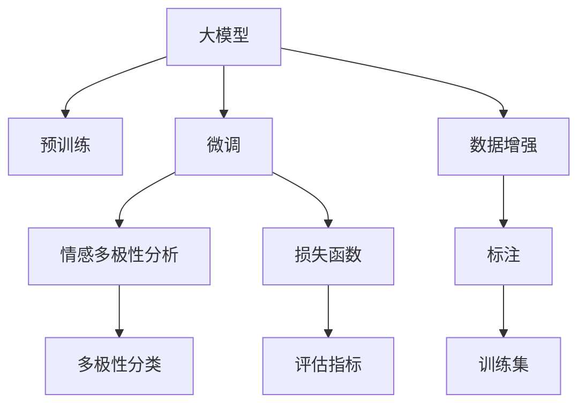

                 

# 大模型在商品评论情感多极性分析中的应用

> 关键词：大模型, 商品评论, 情感分析, 多极性, 自然语言处理(NLP), 自然语言理解(NLU), 预训练模型

## 1. 背景介绍

### 1.1 问题由来

商品评论情感分析是电商领域的一项重要任务，旨在自动检测和分析消费者对商品的评价，提取出评论中的情感倾向，并进行极性分类，例如正面、中性、负面等。这种分析有助于电商平台提升用户体验，优化商品展示，精准匹配用户需求。然而，传统的基于规则和词典的方法往往难以准确捕捉复杂的情感表达，且泛化能力有限。近年来，基于深度学习的大模型如BERT、GPT等，因其强大的语义理解能力和泛化能力，成为商品评论情感分析的主要工具。

然而，现有的基于大模型的情感分析方法主要集中在二元分类上，即正面/负面情感分类。这种简单二元分类方法难以充分表达商品评论情感的复杂性和多极性特征。因此，为了更全面地分析商品评论情感的多极性特征，需要开发新的基于大模型的情感分析方法，以实现更细致的情感极性划分，即除了正面/负面外，还应包括中性、模糊、复杂情感等更精细的极性类别。

### 1.2 问题核心关键点

情感多极性分析的核心在于：
1. 如何在大模型预训练任务的基础上，增加新的极性类别，并保持模型的泛化能力。
2. 如何通过训练样本的数据增强和标注，丰富模型对多极性情感的识别能力。
3. 如何设计有效的损失函数和评估指标，评价模型对多极性情感的准确预测。

本文将基于现有的预训练大模型，研究并实现商品评论情感的多极性分析任务，并通过实际应用场景展示该方法的优越性。

## 2. 核心概念与联系

### 2.1 核心概念概述

为更好地理解基于大模型的情感多极性分析方法，本节将介绍几个关键概念：

- 大模型(Large Model)：指具有海量参数的深度学习模型，如BERT、GPT等，通常基于大规模无标签文本数据进行预训练，学习到丰富的语言知识。
- 情感分析(Sentiment Analysis)：对文本数据中的情感倾向进行分类，通常分为正面、中性、负面等。
- 多极性(Multidimensionality)：指同一情感表达可能包含多种极性特征，如正面、中性、负面、模糊等。
- 预训练(Pre-training)：指在大规模无标签文本数据上进行自监督学习，学习语言的一般性表示。
- 微调(Fine-tuning)：指在预训练模型的基础上，使用带有标签的训练数据进一步优化模型，使其适应特定任务。
- 数据增强(Data Augmentation)：指通过扩充训练数据，增强模型对数据的泛化能力。
- 损失函数(Loss Function)：用于衡量模型预测与真实标签之间的差异，指导模型优化。
- 评估指标(Evaluation Metrics)：用于衡量模型性能的指标，如准确率、精确率、召回率、F1-score等。

这些概念之间的逻辑关系可以通过以下Mermaid流程图来展示：



这个流程图展示了从大模型预训练到情感多极性分析的流程：

1. 大模型通过预训练获得语言表示能力。
2. 微调针对特定任务（商品评论情感分析）进一步优化模型。
3. 情感多极性分析任务通过多极性分类标签的引入，实现更精细的情感极性划分。
4. 数据增强和标注丰富训练数据，提高模型泛化能力。
5. 损失函数指导模型预测和训练，优化模型性能。
6. 评估指标衡量模型效果，指导模型调参。

## 3. 核心算法原理 & 具体操作步骤

### 3.1 算法原理概述

基于大模型的商品评论情感多极性分析，主要依赖以下两个步骤：

1. 在大模型的预训练任务基础上，增加多极性情感分类标签。
2. 使用数据增强和标注丰富训练集，并通过微调训练模型，使其对多极性情感进行准确分类。

通过在预训练任务的基础上增加多极性情感分类标签，可以使得大模型学习到更丰富的语言表示，提升对复杂情感表达的识别能力。同时，通过数据增强和标注，可以丰富训练集的多样性，增强模型对不同情感极性的泛化能力。最终，通过微调训练，模型能够在商品评论数据上实现更精细的情感多极性分类。

### 3.2 算法步骤详解

基于大模型的商品评论情感多极性分析主要包括以下关键步骤：

**Step 1: 准备数据集**

- 收集商品评论数据，确保数据来源多样，包含不同情感极性的评论。
- 标注评论的情感极性，如正面、中性、负面、模糊、复杂情感等。
- 将标注数据划分为训练集、验证集和测试集，保证数据集的平衡和多样性。

**Step 2: 添加多极性情感分类层**

- 在大模型的顶层添加一个全连接层，用于处理多极性情感分类任务。
- 设定输出层的激活函数为softmax，输出维度为多极性情感类别数（如7类：正面、中性、负面、模糊、复杂情感A、复杂情感B、复杂情感C）。
- 设计合适的损失函数，如交叉熵损失，用于衡量模型预测与真实标签的差异。

**Step 3: 设置微调超参数**

- 选择合适的优化算法及其参数，如Adam、SGD等，设置学习率、批大小、迭代轮数等。
- 设置正则化技术，如L2正则、Dropout等，防止模型过拟合。
- 确定冻结预训练参数的策略，如仅微调顶层，或部分冻结底层参数。

**Step 4: 执行微调**

- 使用训练集进行梯度训练，计算损失函数并反向传播更新模型参数。
- 周期性在验证集上评估模型性能，根据性能指标决定是否触发Early Stopping。
- 重复上述步骤直到满足预设的迭代轮数或Early Stopping条件。

**Step 5: 测试和部署**

- 在测试集上评估微调后模型的性能，对比微调前后的精度提升。
- 使用微调后的模型对新的商品评论进行情感极性分类，集成到实际的应用系统中。

### 3.3 算法优缺点

基于大模型的商品评论情感多极性分析方法具有以下优点：

1. **精度提升**：通过增加多极性情感分类标签，可以提升模型对复杂情感表达的识别能力，实现更精细的情感极性划分。
2. **泛化能力**：数据增强和标注丰富了训练集的多样性，增强了模型对不同情感极性的泛化能力。
3. **适用性广**：适用于多种商品评论情感分类任务，只需设计合适的分类标签和损失函数即可。
4. **参数高效**：利用参数高效微调技术，可以在固定大部分预训练参数的情况下，仍可取得不错的微调效果。

同时，该方法也存在以下局限性：

1. **标注成本高**：多极性情感分类标签的标注成本较高，获取高质量标注数据需要大量人力和时间。
2. **数据增强难度大**：需要设计巧妙的数据增强方法，丰富训练集的多样性，提高模型泛化能力。
3. **模型复杂度**：增加多极性情感分类层可能增加模型复杂度，增加训练和推理的计算量。
4. **评估指标复杂**：多极性分类任务的评估指标较为复杂，需要设计多类别分类准确率等指标。

尽管存在这些局限性，但通过合理的设计和优化，可以克服这些缺点，使得基于大模型的商品评论情感多极性分析方法具有较高的实用价值。

### 3.4 算法应用领域

基于大模型的商品评论情感多极性分析方法，在电商领域有着广泛的应用前景，具体包括：

1. **商品评价分析**：通过分析商品评论的情感多极性，帮助电商平台识别出不同情感极性的客户评价，进行个性化推荐和服务优化。
2. **用户行为预测**：预测用户的情感极性变化趋势，为用户提供个性化的购物建议和推荐。
3. **品牌管理**：分析品牌在不同产品上的情感多极性表现，识别品牌形象的变化趋势，进行品牌管理。
4. **市场研究**：通过情感多极性分析，研究市场对不同产品的情感反应，优化产品设计和市场策略。

## 4. 数学模型和公式 & 详细讲解 & 举例说明

### 4.1 数学模型构建

假设大模型为 $M_{\theta}$，其中 $\theta$ 为模型参数。设训练集为 $D=\{(x_i, y_i)\}_{i=1}^N$，其中 $x_i$ 为商品评论文本，$y_i$ 为多极性情感标签。

定义模型 $M_{\theta}$ 在输入 $x$ 上的输出为 $\hat{y}=M_{\theta}(x)$，则多极性情感分类任务的目标是最大化交叉熵损失函数：

$$
\ell(M_{\theta}(x),y) = -\sum_{i=1}^N y_i\log M_{\theta}(x_i)
$$

其中 $y_i$ 为真实情感标签，$M_{\theta}(x_i)$ 为模型对评论文本 $x_i$ 的情感极性预测。

通过最小化交叉熵损失，优化模型参数 $\theta$，使得模型预测的情感极性与真实情感标签尽量接近。

### 4.2 公式推导过程

为了计算交叉熵损失，首先需要将多极性情感分类标签进行独热编码（One-Hot Encoding），得到概率分布 $p(y_i|x_i)$：

$$
p(y_i|x_i) = \frac{\exp(\hat{y}_i^T\log M_{\theta}(x_i))}{\sum_{j=1}^K \exp(\hat{y}_j^T\log M_{\theta}(x_i))}
$$

其中 $K$ 为多极性情感类别数，$\hat{y}_j$ 为第 $j$ 个极性分类的预测概率分布。

然后，交叉熵损失函数可以表示为：

$$
\ell(M_{\theta}(x),y) = -\sum_{i=1}^N \sum_{j=1}^K y_{ij}\log M_{\theta}(x_i)_j
$$

其中 $y_{ij}$ 为真实情感标签 $y_i$ 的第 $j$ 个极性分类。

通过最小化上述损失函数，优化模型参数 $\theta$，使得模型预测的情感极性与真实情感标签尽量接近。

### 4.3 案例分析与讲解

以电商平台的商品评价分析为例，展示多极性情感分析的实际应用。

假设某电商平台收集了大量的商品评论数据，每个评论包含多个情感标签，如正面、中性、负面、模糊、复杂情感A等。通过对评论进行预处理和标注，得到标注数据集 $D=\{(x_i, y_i)\}_{i=1}^N$。

在模型预训练的基础上，添加一个多极性情感分类层，设定输出层的激活函数为softmax，输出维度为7（包含正面、中性、负面等7个情感极性类别）。

使用交叉熵损失函数计算模型预测与真实情感标签的差异，通过Adam优化算法进行微调训练。在训练过程中，使用数据增强和标注丰富训练集，防止过拟合。

通过验证集的评估，调整模型超参数，最终在测试集上评估模型性能，对比微调前后的精度提升。

## 5. 项目实践：代码实例和详细解释说明

### 5.1 开发环境搭建

在进行商品评论情感多极性分析项目开发前，需要先准备好开发环境。以下是使用Python进行PyTorch开发的环境配置流程：

1. 安装Anaconda：从官网下载并安装Anaconda，用于创建独立的Python环境。

2. 创建并激活虚拟环境：
```bash
conda create -n pytorch-env python=3.8 
conda activate pytorch-env
```

3. 安装PyTorch：根据CUDA版本，从官网获取对应的安装命令。例如：
```bash
conda install pytorch torchvision torchaudio cudatoolkit=11.1 -c pytorch -c conda-forge
```

4. 安装Transformer库：
```bash
pip install transformers
```

5. 安装各类工具包：
```bash
pip install numpy pandas scikit-learn matplotlib tqdm jupyter notebook ipython
```

完成上述步骤后，即可在`pytorch-env`环境中开始项目开发。

### 5.2 源代码详细实现

下面我们以商品评论情感多极性分析任务为例，给出使用Transformers库进行BERT模型微调的PyTorch代码实现。

首先，定义情感多极性分类标签的独热编码：

```python
import torch
from sklearn.preprocessing import MultiLabelBinarizer

# 定义情感标签
labels = ["正面", "中性", "负面", "模糊", "复杂情感A", "复杂情感B", "复杂情感C"]

# 创建MultiLabelBinarizer对象
mlb = MultiLabelBinarizer()

# 将情感标签进行独热编码
label_ids = mlb.fit_transform(labels)
```

然后，定义模型和优化器：

```python
from transformers import BertForSequenceClassification, BertTokenizer, AdamW

# 定义BERT模型的情感多极性分类任务
model = BertForSequenceClassification.from_pretrained('bert-base-cased', num_labels=7)

# 定义优化器
optimizer = AdamW(model.parameters(), lr=2e-5)
```

接着，定义训练和评估函数：

```python
from torch.utils.data import DataLoader
from tqdm import tqdm

# 加载数据集
tokenizer = BertTokenizer.from_pretrained('bert-base-cased')
train_dataset = ...
dev_dataset = ...
test_dataset = ...

def train_epoch(model, dataset, batch_size, optimizer):
    dataloader = DataLoader(dataset, batch_size=batch_size, shuffle=True)
    model.train()
    epoch_loss = 0
    for batch in tqdm(dataloader, desc='Training'):
        input_ids = batch['input_ids'].to(device)
        attention_mask = batch['attention_mask'].to(device)
        labels = batch['labels'].to(device)
        model.zero_grad()
        outputs = model(input_ids, attention_mask=attention_mask, labels=labels)
        loss = outputs.loss
        epoch_loss += loss.item()
        loss.backward()
        optimizer.step()
    return epoch_loss / len(dataloader)

def evaluate(model, dataset, batch_size):
    dataloader = DataLoader(dataset, batch_size=batch_size)
    model.eval()
    preds, labels = [], []
    with torch.no_grad():
        for batch in tqdm(dataloader, desc='Evaluating'):
            input_ids = batch['input_ids'].to(device)
            attention_mask = batch['attention_mask'].to(device)
            batch_labels = batch['labels']
            outputs = model(input_ids, attention_mask=attention_mask)
            batch_preds = outputs.logits.argmax(dim=2).to('cpu').tolist()
            batch_labels = batch_labels.to('cpu').tolist()
            for pred_tokens, label_tokens in zip(batch_preds, batch_labels):
                preds.append(pred_tokens[:len(label_tokens)])
                labels.append(label_tokens)
                
    print(classification_report(labels, preds))
```

最后，启动训练流程并在测试集上评估：

```python
epochs = 5
batch_size = 16

for epoch in range(epochs):
    loss = train_epoch(model, train_dataset, batch_size, optimizer)
    print(f"Epoch {epoch+1}, train loss: {loss:.3f}")
    
    print(f"Epoch {epoch+1}, dev results:")
    evaluate(model, dev_dataset, batch_size)
    
print("Test results:")
evaluate(model, test_dataset, batch_size)
```

以上就是使用PyTorch对BERT进行商品评论情感多极性分析的完整代码实现。可以看到，通过添加情感多极性分类层和交叉熵损失函数，我们可以在已有预训练模型基础上进行微调，实现更精细的情感极性分类。

### 5.3 代码解读与分析

让我们再详细解读一下关键代码的实现细节：

**情感标签的独热编码**：
- 使用`MultiLabelBinarizer`将情感标签转换为独热编码，方便模型处理。

**模型和优化器的定义**：
- 使用`BertForSequenceClassification`从预训练模型中加载情感多极性分类任务，设定输出层为softmax函数，输出维度为7。
- 定义AdamW优化器，设置学习率为2e-5。

**训练和评估函数**：
- 使用`DataLoader`对数据集进行批次化加载，供模型训练和推理使用。
- 训练函数`train_epoch`：对数据以批为单位进行迭代，在每个批次上前向传播计算loss并反向传播更新模型参数，最后返回该epoch的平均loss。
- 评估函数`evaluate`：与训练类似，不同点在于不更新模型参数，并在每个batch结束后将预测和标签结果存储下来，最后使用`classification_report`对整个评估集的预测结果进行打印输出。

**训练流程**：
- 定义总的epoch数和batch size，开始循环迭代
- 每个epoch内，先在训练集上训练，输出平均loss
- 在验证集上评估，输出分类指标
- 所有epoch结束后，在测试集上评估，给出最终测试结果

可以看到，PyTorch配合Transformers库使得BERT微调的代码实现变得简洁高效。开发者可以将更多精力放在数据处理、模型改进等高层逻辑上，而不必过多关注底层的实现细节。

当然，工业级的系统实现还需考虑更多因素，如模型的保存和部署、超参数的自动搜索、更灵活的任务适配层等。但核心的微调范式基本与此类似。

## 6. 实际应用场景

### 6.1 电商平台的商品评价分析

电商平台通过商品评论情感多极性分析，可以更全面地了解用户对商品的评价，从而优化商品展示和推荐策略，提升用户体验。具体应用场景包括：

- **商品展示优化**：通过分析商品评论的情感多极性，识别出不同情感极性的客户评价，进行个性化的商品展示和推荐。
- **用户情感追踪**：跟踪用户对商品情感的长期变化趋势，预测用户未来的购买行为，优化营销策略。
- **品牌管理**：分析品牌在不同产品上的情感多极性表现，识别品牌形象的变化趋势，进行品牌管理。

### 6.2 金融行业的情感分析

金融行业对客户情感的及时监控和分析至关重要，有助于识别市场情绪变化，预测金融风险。基于大模型的商品评论情感多极性分析方法，同样可以应用于金融行业，帮助金融机构进行情感分析和风险管理。

具体应用场景包括：

- **市场情绪监控**：通过分析客户对金融产品的情感评价，识别市场情绪变化趋势，预测市场波动。
- **客户服务优化**：监控客户对金融服务的情感反应，优化服务流程，提升客户满意度。
- **投资策略优化**：分析投资者对金融市场的情感反馈，优化投资策略，降低投资风险。

### 6.3 智能客服系统的情感识别

智能客服系统通过分析用户对客服对话的情感多极性，可以更准确地识别用户的情感需求，提供更好的服务体验。具体应用场景包括：

- **用户情绪识别**：识别用户在对话中的情感状态，及时调整服务策略。
- **对话内容分析**：分析用户在对话中的情感倾向，优化客服回答模板，提升回答质量。
- **用户满意度监测**：通过情感多极性分析，监测用户对话中的情感变化，优化客服服务质量。

## 7. 工具和资源推荐

### 7.1 学习资源推荐

为了帮助开发者系统掌握商品评论情感多极性分析的理论基础和实践技巧，这里推荐一些优质的学习资源：

1. 《Transformer从原理到实践》系列博文：由大模型技术专家撰写，深入浅出地介绍了Transformer原理、BERT模型、情感分析等前沿话题。

2. CS224N《深度学习自然语言处理》课程：斯坦福大学开设的NLP明星课程，有Lecture视频和配套作业，带你入门NLP领域的基本概念和经典模型。

3. 《Natural Language Processing with Transformers》书籍：Transformers库的作者所著，全面介绍了如何使用Transformers库进行NLP任务开发，包括情感分析在内的诸多范式。

4. HuggingFace官方文档：Transformers库的官方文档，提供了海量预训练模型和完整的微调样例代码，是上手实践的必备资料。

5. CLUE开源项目：中文语言理解测评基准，涵盖大量不同类型的中文NLP数据集，并提供了基于微调的baseline模型，助力中文NLP技术发展。

通过对这些资源的学习实践，相信你一定能够快速掌握商品评论情感多极性分析的精髓，并用于解决实际的NLP问题。

### 7.2 开发工具推荐

高效的开发离不开优秀的工具支持。以下是几款用于商品评论情感多极性分析开发的常用工具：

1. PyTorch：基于Python的开源深度学习框架，灵活动态的计算图，适合快速迭代研究。大部分预训练语言模型都有PyTorch版本的实现。

2. TensorFlow：由Google主导开发的开源深度学习框架，生产部署方便，适合大规模工程应用。同样有丰富的预训练语言模型资源。

3. Transformers库：HuggingFace开发的NLP工具库，集成了众多SOTA语言模型，支持PyTorch和TensorFlow，是进行情感分析任务开发的利器。

4. Weights & Biases：模型训练的实验跟踪工具，可以记录和可视化模型训练过程中的各项指标，方便对比和调优。与主流深度学习框架无缝集成。

5. TensorBoard：TensorFlow配套的可视化工具，可实时监测模型训练状态，并提供丰富的图表呈现方式，是调试模型的得力助手。

6. Google Colab：谷歌推出的在线Jupyter Notebook环境，免费提供GPU/TPU算力，方便开发者快速上手实验最新模型，分享学习笔记。

合理利用这些工具，可以显著提升商品评论情感多极性分析任务的开发效率，加快创新迭代的步伐。

### 7.3 相关论文推荐

商品评论情感多极性分析的研究源于学界的持续研究。以下是几篇奠基性的相关论文，推荐阅读：

1. Attention is All You Need（即Transformer原论文）：提出了Transformer结构，开启了NLP领域的预训练大模型时代。

2. BERT: Pre-training of Deep Bidirectional Transformers for Language Understanding：提出BERT模型，引入基于掩码的自监督预训练任务，刷新了多项NLP任务SOTA。

3. Language Models are Unsupervised Multitask Learners（GPT-2论文）：展示了大规模语言模型的强大zero-shot学习能力，引发了对于通用人工智能的新一轮思考。

4. Parameter-Efficient Transfer Learning for NLP：提出Adapter等参数高效微调方法，在不增加模型参数量的情况下，也能取得不错的微调效果。

5. Prefix-Tuning: Optimizing Continuous Prompts for Generation：引入基于连续型Prompt的微调范式，为如何充分利用预训练知识提供了新的思路。

6. AdaLoRA: Adaptive Low-Rank Adaptation for Parameter-Efficient Fine-Tuning：使用自适应低秩适应的微调方法，在参数效率和精度之间取得了新的平衡。

这些论文代表了大模型情感多极性分析的发展脉络。通过学习这些前沿成果，可以帮助研究者把握学科前进方向，激发更多的创新灵感。

## 8. 总结：未来发展趋势与挑战

### 8.1 总结

本文对基于大模型的商品评论情感多极性分析方法进行了全面系统的介绍。首先阐述了商品评论情感多极性分析的研究背景和意义，明确了多极性情感分析在电商、金融、智能客服等实际场景中的应用价值。其次，从原理到实践，详细讲解了基于大模型的情感多极性分析的数学模型和关键步骤，给出了微调任务开发的完整代码实例。同时，本文还广泛探讨了情感多极性分析方法在电商、金融、智能客服等不同行业领域的应用前景，展示了情感多极性分析方法的广阔应用空间。最后，本文精选了情感多极性分析的各类学习资源，力求为读者提供全方位的技术指引。

通过本文的系统梳理，可以看到，基于大模型的商品评论情感多极性分析方法，已经在多个实际应用中取得了显著效果，为电商平台、金融机构、智能客服系统等带来了实际价值。未来，随着大模型和微调技术的不断演进，基于情感多极性分析的方法将会有更广阔的应用前景。

### 8.2 未来发展趋势

展望未来，商品评论情感多极性分析技术将呈现以下几个发展趋势：

1. **数据量持续增大**：随着电商、金融等行业数据的不断积累，商品评论数据量将持续增大，有助于进一步提升情感多极性分析的准确性。
2. **模型规模不断扩大**：超大模型和大规模训练数据的应用，将进一步提升情感多极性分析的泛化能力和精度。
3. **情感极性粒度细化**：未来情感多极性分析将不断细化情感极性粒度，引入更多情感类别，如复杂情感B、复杂情感C等。
4. **多模态融合**：结合视觉、语音等多模态信息，提升情感多极性分析的准确性和鲁棒性。
5. **动态情感识别**：引入时间序列模型，分析用户情感的动态变化，实现实时情感监控。
6. **跨领域迁移**：将情感多极性分析方法应用于更多垂直领域，如医疗、旅游等，实现跨领域的情感分析。

### 8.3 面临的挑战

尽管基于大模型的商品评论情感多极性分析技术已经取得了不错的效果，但在实现更精细的情感极性分类时，仍面临以下挑战：

1. **数据获取困难**：情感多极性标签的标注成本较高，获取高质量标注数据需要大量人力和时间。
2. **多极性分类复杂**：情感多极性分析涉及多个情感极性分类，模型设计复杂，需要更强的泛化能力。
3. **模型资源消耗大**：超大模型的计算资源消耗大，对硬件设备要求高，需要更高效的模型压缩和优化方法。
4. **跨领域适应性差**：不同领域的数据分布差异大，情感多极性分析方法的跨领域适应性仍需加强。

尽管存在这些挑战，但通过合理的算法设计和优化，可以克服这些困难，使得基于大模型的商品评论情感多极性分析方法具有更高的实用价值。

### 8.4 研究展望

面向未来，商品评论情感多极性分析技术需要在以下几个方向进行深入研究：

1. **无监督和多模态学习**：探索无监督和多模态学习范式，减少对标注数据的依赖，提升情感多极性分析的鲁棒性。
2. **动态情感建模**：引入时间序列模型，分析用户情感的动态变化，实现实时情感监控。
3. **跨领域迁移学习**：研究跨领域迁移学习方法，增强情感多极性分析的通用性和可适应性。
4. **多极性情感分类**：进一步细化情感极性分类，引入更多情感类别，提升情感分析的精度和细粒度。
5. **模型压缩和优化**：研究高效模型压缩和优化方法，减少模型资源消耗，提升情感分析的实时性。

这些研究方向将引领情感多极性分析技术向更深的层次和更广的领域拓展，为电商、金融、智能客服等领域带来更多创新和突破。

## 9. 附录：常见问题与解答

**Q1：什么是情感多极性分析？**

A: 情感多极性分析是指对文本数据中的情感倾向进行分类，不仅仅局限于正面和负面两种极性，还包括中性、模糊、复杂情感等更精细的极性类别。

**Q2：情感多极性分析在实际应用中有哪些场景？**

A: 情感多极性分析在电商、金融、智能客服等领域有广泛的应用场景。例如，电商平台的商品评价分析、金融行业的情感监控、智能客服系统的用户情感识别等。

**Q3：情感多极性分析的难点是什么？**

A: 情感多极性分析的难点主要在于：
1. 标注成本高：多极性情感标签的标注需要大量人力和时间。
2. 模型设计复杂：需要设计合适的分类层和损失函数。
3. 跨领域适应性差：不同领域的数据分布差异大，情感多极性分析方法需要在跨领域上有所改进。

**Q4：情感多极性分析的解决方案是什么？**

A: 情感多极性分析的解决方案主要包括以下几个方面：
1. 数据增强和标注：通过数据增强和标注丰富训练集，防止过拟合。
2. 多极性分类层：在大模型的顶层添加一个全连接层，用于处理多极性情感分类任务。
3. 交叉熵损失函数：设计合适的损失函数，如交叉熵损失，用于衡量模型预测与真实标签的差异。
4. 参数高效微调：利用参数高效微调技术，在固定大部分预训练参数的情况下，仍可取得不错的微调效果。

**Q5：情感多极性分析在电商中的应用场景有哪些？**

A: 情感多极性分析在电商中的应用场景包括：
1. 商品展示优化：通过分析商品评论的情感多极性，进行个性化的商品展示和推荐。
2. 用户情感追踪：跟踪用户对商品情感的长期变化趋势，预测用户未来的购买行为。
3. 品牌管理：分析品牌在不同产品上的情感多极性表现，进行品牌管理。

---

作者：禅与计算机程序设计艺术 / Zen and the Art of Computer Programming

