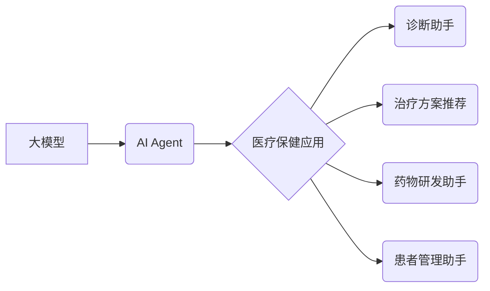

> 大模型、AI Agent、医疗保健、自然语言处理、机器学习、深度学习、医疗诊断、药物研发

## 1. 背景介绍

医疗保健行业正处于数字化转型和智能化升级的关键时期。随着大数据、人工智能等技术的快速发展，医疗保健领域迎来了一次前所未有的变革。大模型作为人工智能领域的新兴技术，凭借其强大的学习能力和泛化能力，在医疗保健领域展现出巨大的应用潜力。

传统的医疗保健模式面临着诸多挑战，例如医疗资源短缺、诊断效率低下、药物研发周期长等。大模型的应用可以有效解决这些问题，提升医疗服务的质量和效率。例如，大模型可以辅助医生进行诊断，预测疾病风险，加速药物研发，并提供个性化的医疗方案。

## 2. 核心概念与联系

### 2.1 大模型

大模型是指参数规模庞大、训练数据海量的人工智能模型。大模型通常基于深度学习技术，拥有强大的语义理解和文本生成能力。

### 2.2 AI Agent

AI Agent是指能够感知环境、做出决策并执行行动的智能体。AI Agent可以是软件程序、机器人或其他智能系统。

### 2.3 医疗保健应用

在医疗保健领域，AI Agent可以扮演多种角色，例如：

* **诊断助手:** 辅助医生进行疾病诊断，提高诊断准确率。
* **治疗方案推荐:** 根据患者的病情和个人信息，推荐个性化的治疗方案。
* **药物研发助手:** 辅助药物研发过程，加速新药的开发。
* **患者管理助手:** 管理患者的健康信息，提醒患者服药和进行健康检查。

**核心概念与联系流程图:**



## 3. 核心算法原理 & 具体操作步骤

### 3.1 算法原理概述

大模型在医疗保健领域的应用主要基于以下核心算法：

* **自然语言处理 (NLP):** 用于处理和理解医疗文本数据，例如病历、医学文献等。
* **机器学习 (ML):** 用于从医疗数据中学习模式和规律，进行疾病预测、风险评估等。
* **深度学习 (DL):** 用于构建更复杂的模型，提高算法的性能。

### 3.2 算法步骤详解

**以医疗诊断为例，大模型应用的具体步骤如下：**

1. **数据收集和预处理:** 收集医疗文本数据，例如病历、医学文献等，并进行清洗、标注等预处理工作。
2. **模型训练:** 使用 NLP、ML 或 DL 算法训练大模型，使其能够理解医疗文本并进行疾病诊断。
3. **模型评估:** 使用测试数据评估模型的性能，例如准确率、召回率等。
4. **模型部署:** 将训练好的模型部署到实际应用场景中，例如医院的诊断系统。
5. **模型监控和更新:** 定期监控模型的性能，并根据需要进行模型更新和优化。

### 3.3 算法优缺点

**大模型在医疗保健领域的应用具有以下优点:**

* **提高诊断准确率:** 大模型可以分析海量医疗数据，识别疾病的细微特征，提高诊断的准确率。
* **加速药物研发:** 大模型可以辅助药物研发过程，例如预测药物的疗效和安全性，缩短药物研发的周期。
* **个性化医疗:** 大模型可以根据患者的个人信息和病史，提供个性化的医疗方案。

**但也存在一些缺点:**

* **数据依赖:** 大模型的性能依赖于训练数据的质量和数量。
* **解释性差:** 大模型的决策过程往往难以解释，这可能导致医生难以信任模型的诊断结果。
* **伦理问题:** 大模型的应用可能引发一些伦理问题，例如数据隐私、算法偏见等。

### 3.4 算法应用领域

大模型在医疗保健领域的应用领域非常广泛，包括：

* **疾病诊断:** 辅助医生进行疾病诊断，例如癌症、心血管疾病等。
* **药物研发:** 辅助药物研发过程，例如药物靶点发现、药物筛选等。
* **患者管理:** 管理患者的健康信息，提醒患者服药和进行健康检查。
* **医疗影像分析:** 分析医疗影像数据，例如X光片、CT扫描等，辅助医生进行诊断。

## 4. 数学模型和公式 & 详细讲解 & 举例说明

### 4.1 数学模型构建

大模型的训练过程本质上是一个优化问题，目标是找到模型参数，使得模型在训练数据上的损失函数最小。常用的损失函数包括交叉熵损失函数、均方误差损失函数等。

**交叉熵损失函数:**

$$
H(p,q) = -\sum_{i=1}^{n} p(i) \log q(i)
$$

其中：

* $p(i)$ 是真实标签的概率分布。
* $q(i)$ 是模型预测的概率分布。

**均方误差损失函数:**

$$
L(y, \hat{y}) = \frac{1}{n} \sum_{i=1}^{n} (y_i - \hat{y}_i)^2
$$

其中：

* $y_i$ 是真实值。
* $\hat{y}_i$ 是模型预测值。

### 4.2 公式推导过程

损失函数的最小化可以通过梯度下降算法实现。梯度下降算法的基本思想是迭代更新模型参数，使得损失函数不断减小。

**梯度下降算法:**

$$
\theta = \theta - \alpha \nabla L(\theta)
$$

其中：

* $\theta$ 是模型参数。
* $\alpha$ 是学习率。
* $\nabla L(\theta)$ 是损失函数对模型参数的梯度。

### 4.3 案例分析与讲解

例如，在医疗诊断任务中，可以使用交叉熵损失函数来评估模型的性能。训练过程中，模型会不断调整参数，使得预测的概率分布与真实标签的概率分布越接近，从而降低损失函数的值。

## 5. 项目实践：代码实例和详细解释说明

### 5.1 开发环境搭建

* **操作系统:** Ubuntu 20.04
* **编程语言:** Python 3.8
* **深度学习框架:** TensorFlow 2.0
* **其他依赖库:** numpy, pandas, matplotlib等

### 5.2 源代码详细实现

```python
import tensorflow as tf

# 定义模型结构
model = tf.keras.Sequential([
    tf.keras.layers.Embedding(input_dim=10000, output_dim=128),
    tf.keras.layers.LSTM(units=64),
    tf.keras.layers.Dense(units=1, activation='sigmoid')
])

# 编译模型
model.compile(optimizer='adam', loss='binary_crossentropy', metrics=['accuracy'])

# 训练模型
model.fit(x_train, y_train, epochs=10)

# 评估模型
loss, accuracy = model.evaluate(x_test, y_test)
print('Loss:', loss)
print('Accuracy:', accuracy)
```

### 5.3 代码解读与分析

* **Embedding层:** 将单词转换为稠密的向量表示。
* **LSTM层:** 用于处理序列数据，例如医疗文本。
* **Dense层:** 全连接层，用于输出预测结果。
* **Adam优化器:** 用于更新模型参数。
* **Binary Crossentropy损失函数:** 用于二分类任务，例如疾病诊断。

### 5.4 运行结果展示

训练完成后，可以评估模型的性能，例如准确率、召回率等。

## 6. 实际应用场景

### 6.1 医疗诊断辅助系统

大模型可以辅助医生进行疾病诊断，例如癌症、心血管疾病等。

### 6.2 药物研发助手

大模型可以辅助药物研发过程，例如预测药物的疗效和安全性，缩短药物研发的周期。

### 6.3 患者管理系统

大模型可以管理患者的健康信息，提醒患者服药和进行健康检查。

### 6.4 未来应用展望

大模型在医疗保健领域的应用前景广阔，未来可能应用于：

* **个性化医疗:** 根据患者的个人信息和病史，提供个性化的医疗方案。
* **远程医疗:** 远程诊断和治疗，提高医疗服务的覆盖范围。
* **医疗机器人:** 辅助医生进行手术和护理。

## 7. 工具和资源推荐

### 7.1 学习资源推荐

* **课程:** Coursera、edX 等平台上的深度学习课程。
* **书籍:** 《深度学习》、《自然语言处理》等。
* **博客:** TensorFlow、PyTorch 等深度学习框架的官方博客。

### 7.2 开发工具推荐

* **深度学习框架:** TensorFlow、PyTorch、Keras 等。
* **编程语言:** Python。
* **云计算平台:** AWS、Google Cloud、Azure 等。

### 7.3 相关论文推荐

* **BERT:** Devlin et al. (2018)
* **GPT-3:** Brown et al. (2020)
* **AlphaFold:** Jumper et al. (2021)

## 8. 总结：未来发展趋势与挑战

### 8.1 研究成果总结

大模型在医疗保健领域的应用取得了显著成果，例如提高了疾病诊断的准确率、加速了药物研发的周期等。

### 8.2 未来发展趋势

未来，大模型在医疗保健领域的应用将更加广泛和深入，例如：

* **更强大的模型:** 参数规模更大、性能更强的模型将不断涌现。
* **更精准的诊断:** 大模型将能够识别疾病的更细微特征，提高诊断的精准度。
* **更个性化的治疗:** 大模型将能够根据患者的个人信息和病史，提供更个性化的治疗方案。

### 8.3 面临的挑战

大模型在医疗保健领域的应用也面临一些挑战，例如：

* **数据隐私:** 大模型的训练需要海量医疗数据，如何保护患者的隐私是一个重要问题。
* **算法偏见:** 大模型的训练数据可能存在偏见，导致模型的决策结果存在偏见。
* **解释性差:** 大模型的决策过程往往难以解释，这可能导致医生难以信任模型的诊断结果。

### 8.4 研究展望

未来，需要进一步研究如何解决大模型在医疗保健领域的挑战，例如：

* **开发隐私保护的训练方法:** 保护患者隐私的同时，仍然能够训练出性能良好的模型。
* **减轻算法偏见:** 通过数据预处理和模型设计，减轻算法偏见的影响。
* **提高模型的解释性:** 研究如何解释大模型的决策过程，提高医生的信任度。

## 9. 附录：常见问题与解答

### 9.1 Q1: 大模型的训练需要多少数据？

**A1:** 大模型的训练需要海量数据，通常需要百万甚至数十亿条数据。

### 9.2 Q2: 大模型的训练需要多长时间？

**A2:** 大模型的训练时间取决于模型的规模、数据的规模和计算资源等因素，通常需要几天甚至几周的时间。

### 9.3 Q3: 大模型的应用有哪些伦理问题？

**A3:** 大模型的应用可能引发一些伦理问题，例如数据隐私、算法偏见、责任归属等。

作者：禅与计算机程序设计艺术 / Zen and the Art of Computer Programming


<end_of_turn>