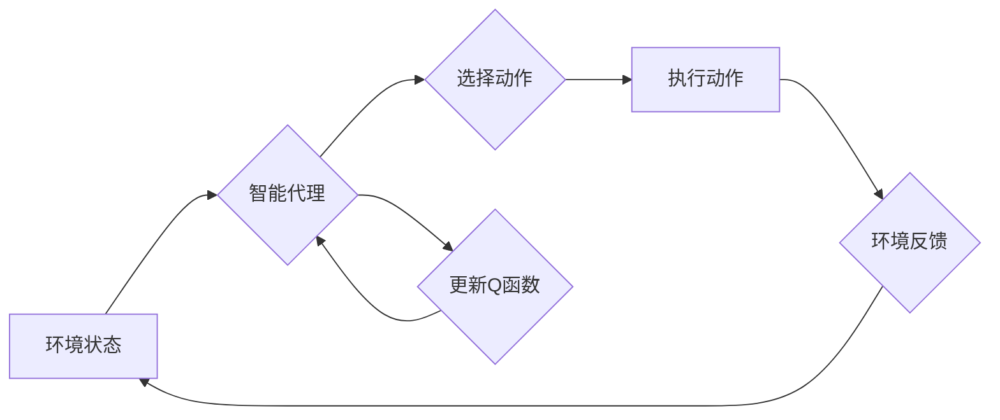

> 深度强化学习，DQN，网络流量控制，自适应，带宽管理，QoS

## 1. 背景介绍

随着互联网的蓬勃发展，网络流量呈指数级增长，网络资源的竞争日益激烈。传统的网络流量控制方法往往是基于预设规则和静态配置，难以适应不断变化的网络环境和用户需求。因此，如何实现智能、自适应的网络流量控制，保障网络资源的有效利用和用户体验，成为一个重要的研究课题。

深度强化学习（Deep Reinforcement Learning，DRL）作为一种新兴的机器学习方法，能够通过智能代理与环境的交互学习最优策略，在解决复杂决策问题方面展现出强大的潜力。近年来，DRL在网络流量控制领域得到了广泛的应用，取得了显著的成果。

本文将深入探讨深度强化学习算法DQN（Deep Q-Network）在自适应网络流量控制中的应用，分析其核心原理、算法步骤、数学模型以及实际应用场景，并展望其未来发展趋势。

## 2. 核心概念与联系

### 2.1 深度强化学习

深度强化学习（DRL）是一种结合深度神经网络和强化学习的机器学习方法。它将智能代理视为一个学习者，网络环境视为一个决策环境。智能代理通过与环境的交互，不断学习和优化其行为策略，以最大化累积的奖励。

**强化学习的核心概念：**

* **状态（State）：** 环境当前的状态，例如网络流量、带宽利用率等。
* **动作（Action）：** 智能代理可以采取的行动，例如调整带宽分配、丢包率等。
* **奖励（Reward）：** 环境对智能代理动作的反馈，例如网络拥塞程度、用户体验等。
* **策略（Policy）：** 智能代理根据当前状态选择动作的策略。

**深度神经网络的作用：**

深度神经网络用于学习复杂的映射关系，将环境状态映射到最优动作。

### 2.2 DQN算法

DQN算法是一种基于深度神经网络的强化学习算法，它通过学习一个Q函数来估计在特定状态下采取特定动作的期望累积奖励。

**DQN算法的核心思想：**

* **Q函数：** Q函数表示在状态s下采取动作a的期望累积奖励。
* **目标网络：** 使用一个目标网络来评估Q函数，目标网络的参数是主网络参数的固定版本。
* **经验回放：** 将过去的经验存储在经验回放池中，并随机采样经验进行训练。
* **深度神经网络：** 使用深度神经网络来逼近Q函数。

**DQN算法流程：**



## 3. 核心算法原理 & 具体操作步骤

### 3.1 算法原理概述

DQN算法的核心是学习一个Q函数，该函数能够估计在特定状态下采取特定动作的期望累积奖励。DQN算法通过以下步骤实现：

1. **初始化Q函数：** 使用随机初始化Q函数的参数。
2. **收集经验：** 智能代理与环境交互，收集状态、动作、奖励和下一个状态的经验。
3. **经验回放：** 将收集到的经验存储在经验回放池中。
4. **训练Q函数：** 从经验回放池中随机采样经验，使用深度神经网络对Q函数进行训练。
5. **更新目标网络：** 定期更新目标网络的参数，使其与主网络的参数保持一致。
6. **选择动作：** 根据当前状态和学习到的Q函数，选择最优动作。

### 3.2 算法步骤详解

1. **环境初始化：** 设置网络环境，例如网络拓扑、流量模式等。
2. **智能代理初始化：** 初始化智能代理，例如其初始状态、策略等。
3. **交互循环：**
    * 智能代理根据当前状态选择动作。
    * 环境根据动作反馈状态、奖励和下一个状态。
    * 智能代理将经验存储在经验回放池中。
4. **训练Q函数：** 从经验回放池中随机采样经验，使用深度神经网络对Q函数进行训练。
5. **更新目标网络：** 定期更新目标网络的参数，使其与主网络的参数保持一致。
6. **重复步骤3-5：** 直到智能代理学习到最优策略。

### 3.3 算法优缺点

**优点：**

* **能够学习复杂的映射关系：** 深度神经网络能够学习复杂的映射关系，适用于处理复杂网络环境。
* **自适应性强：** DQN算法能够根据环境变化动态调整策略，具有较强的自适应性。
* **无需人工设计规则：** DQN算法能够通过学习自动发现最优策略，无需人工设计规则。

**缺点：**

* **训练时间长：** DQN算法的训练时间相对较长，需要大量的训练数据和计算资源。
* **参数量大：** 深度神经网络的参数量较大，容易导致过拟合问题。
* **探索与利用的平衡：** DQN算法需要平衡探索和利用，以找到最优策略。

### 3.4 算法应用领域

DQN算法在网络流量控制领域具有广泛的应用前景，例如：

* **带宽分配：** 根据用户需求和网络状态动态分配带宽资源。
* **拥塞控制：** 通过调整数据包发送速率和丢包率来缓解网络拥塞。
* **QoS保证：** 为不同类型的流量提供不同的服务质量。

## 4. 数学模型和公式 & 详细讲解 & 举例说明

### 4.1 数学模型构建

DQN算法的核心是学习一个Q函数，该函数估计在状态s下采取动作a的期望累积奖励。

$$Q(s, a) = E[\sum_{t=0}^{\infty} \gamma^t r_{t+1} | s_t = s, a_t = a]$$

其中：

* $Q(s, a)$：状态s下采取动作a的期望累积奖励。
* $E$：期望值。
* $\gamma$：折扣因子，控制未来奖励的权重。
* $r_{t+1}$：时间步t+1的奖励。
* $s_t$：时间步t的状态。
* $a_t$：时间步t的动作。

### 4.2 公式推导过程

DQN算法使用深度神经网络来逼近Q函数，并通过最小化以下损失函数来训练Q网络：

$$L(θ) = E[(y_i - Q(s_i, a_i))^2]$$

其中：

* $θ$：Q网络的参数。
* $y_i$：目标值，计算公式如下：

$$y_i = r_{i+1} + \gamma \max_{a'} Q(s_{i+1}, a')$$

* $s_i$：时间步i的状态。
* $a_i$：时间步i的动作。
* $s_{i+1}$：时间步i+1的状态。

### 4.3 案例分析与讲解

假设网络环境中存在两个用户，用户A和用户B，他们分别需要传输数据包。DQN算法可以学习到以下策略：

* 当网络带宽充足时，优先分配带宽给用户A，因为用户A的流量更大。
* 当网络带宽紧张时，根据用户B的流量和重要性，调整带宽分配比例。

通过学习，DQN算法可以找到最优的带宽分配策略，最大化网络资源利用率和用户体验。

## 5. 项目实践：代码实例和详细解释说明

### 5.1 开发环境搭建

* 操作系统：Ubuntu 20.04
* Python版本：3.8
* 深度学习框架：TensorFlow 2.0

### 5.2 源代码详细实现

```python
import tensorflow as tf

# 定义DQN网络结构
class DQN(tf.keras.Model):
    def __init__(self, state_size, action_size):
        super(DQN, self).__init__()
        self.dense1 = tf.keras.layers.Dense(64, activation='relu')
        self.dense2 = tf.keras.layers.Dense(32, activation='relu')
        self.output = tf.keras.layers.Dense(action_size)

    def call(self, state):
        x = self.dense1(state)
        x = self.dense2(x)
        return self.output(x)

# 定义DQN算法
class DQNAgent:
    def __init__(self, state_size, action_size, learning_rate=0.001):
        self.state_size = state_size
        self.action_size = action_size
        self.learning_rate = learning_rate
        self.model = DQN(state_size, action_size)
        self.target_model = DQN(state_size, action_size)
        self.optimizer = tf.keras.optimizers.Adam(learning_rate=self.learning_rate)

    def train(self, state, action, reward, next_state, done):
        with tf.GradientTape() as tape:
            target = reward
            if not done:
                target = reward + self.target_model.predict(next_state)
            q_values = self.model.predict(state)
            loss = tf.keras.losses.MeanSquaredError()(target, q_values[0, action])
        gradients = tape.gradient(loss, self.model.trainable_variables)
        self.optimizer.apply_gradients(zip(gradients, self.model.trainable_variables))

    def predict_action(self, state):
        q_values = self.model.predict(state)
        return tf.argmax(q_values[0]).numpy()

# ... 其他代码 ...
```

### 5.3 代码解读与分析

* **DQN网络结构：** 代码中定义了一个DQN网络结构，包含两层全连接层和一层输出层。
* **DQN算法：** 代码中定义了一个DQN算法类，包含模型初始化、训练和预测动作等方法。
* **训练过程：** 训练过程包括收集经验、计算目标值、计算损失函数和更新模型参数。
* **预测动作：** 预测动作时，根据当前状态预测所有动作的Q值，选择Q值最大的动作。

### 5.4 运行结果展示

运行代码后，可以观察到DQN算法的学习过程，例如Q值的变化趋势和最终的策略。

## 6. 实际应用场景

### 6.1 网络流量控制

DQN算法可以用于网络流量控制，例如：

* **带宽分配：** 根据用户需求和网络状态动态分配带宽资源。
* **拥塞控制：** 通过调整数据包发送速率和丢包率来缓解网络拥塞。
* **QoS保证：** 为不同类型的流量提供不同的服务质量。

### 6.2 其他应用场景

DQN算法还可以应用于其他领域，例如：

* **机器人控制：** 训练机器人学习最优控制策略。
* **游戏AI：** 训练游戏AI学习最优游戏策略。
* **推荐系统：** 训练推荐系统学习用户偏好。

### 6.4 未来应用展望

随着深度学习技术的不断发展，DQN算法在网络流量控制领域的应用前景更加广阔。未来，DQN算法可能会应用于以下领域：

* **软件定义网络（SDN）：** 在SDN环境中，DQN算法可以用于动态配置网络流量规则。
* **网络安全：** DQN算法可以用于检测和防御网络攻击。
* **边缘计算：** DQN算法可以用于边缘设备的流量控制和资源管理。

## 7. 工具和资源推荐

### 7.1 学习资源推荐

* **书籍：**
    * Deep Reinforcement Learning Hands-On
    * Reinforcement