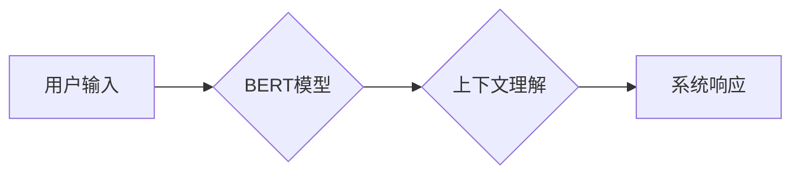

> 上下文理解，CUI，自然语言处理，深度学习，Transformer，BERT，对话系统，用户体验

## 1. 背景介绍

随着人工智能技术的飞速发展，自然语言处理（NLP）领域取得了显著的突破。特别是深度学习技术的应用，使得机器能够更好地理解和生成人类语言。在用户界面（UI）设计方面，传统的基于文本输入和输出的界面逐渐被更智能、更自然的交互方式所取代。其中，基于对话的交互方式（CUI，Conversational User Interface）作为一种新兴的交互模式，凭借其更接近人类自然语言交互的特点，逐渐受到越来越多的关注。

CUI的核心在于能够理解用户的意图和上下文，并提供相应的响应。然而，实现有效的上下文理解仍然是一个巨大的挑战。传统的基于规则的系统难以处理复杂的语义关系和上下文依赖，而基于统计的方法则缺乏对语义的理解能力。

近年来，深度学习技术在NLP领域的应用取得了突破性进展，为CUI的上下文理解提供了新的思路和方法。特别是Transformer模型的出现，使得机器能够更好地捕捉长距离依赖关系，从而实现更准确的上下文理解。

## 2. 核心概念与联系

**2.1 上下文理解**

上下文理解是指机器能够理解文本或对话中的语义关系和上下文依赖，从而准确地理解用户的意图和需求。

**2.2 CUI**

CUI是一种基于对话的交互方式，用户可以通过自然语言与系统进行交互。CUI的目标是提供更自然、更直观的交互体验，就像与人类进行对话一样。

**2.3 Transformer模型**

Transformer模型是一种基于深度学习的序列到序列模型，其核心是注意力机制，能够有效地捕捉长距离依赖关系。

**2.4 BERT模型**

BERT（Bidirectional Encoder Representations from Transformers）是一种基于Transformer模型的预训练语言模型，通过双向语言建模，能够更好地理解上下文信息。

**2.5 流程图**



## 3. 核心算法原理 & 具体操作步骤

**3.1 算法原理概述**

BERT模型通过双向语言建模，学习到每个词语在句子中的上下文语义表示。在进行上下文理解时，BERT模型会将用户输入的文本作为输入，并通过其预训练的权重进行编码，从而获得每个词语的上下文语义向量。

**3.2 算法步骤详解**

1. **预训练:** BERT模型在大量的文本数据上进行预训练，学习到语言的语法和语义知识。
2. **微调:** 将预训练好的BERT模型微调到特定的任务，例如上下文理解。
3. **输入编码:** 将用户输入的文本转换为BERT模型可以理解的格式，并将其输入到BERT模型中。
4. **上下文编码:** BERT模型对输入的文本进行编码，并获得每个词语的上下文语义向量。
5. **意图识别:** 根据上下文语义向量，识别用户的意图。
6. **响应生成:** 根据用户的意图，生成相应的系统响应。

**3.3 算法优缺点**

**优点:**

* 能够捕捉长距离依赖关系，理解复杂的语义关系。
* 预训练模型可以有效地利用已有知识，提高模型的性能。
* 能够处理多种类型的文本数据，例如对话、文章、评论等。

**缺点:**

* 模型训练需要大量的计算资源和时间。
* 模型参数量较大，部署成本较高。
* 对训练数据的质量要求较高，如果训练数据质量差，模型性能会下降。

**3.4 算法应用领域**

* **对话系统:** 理解用户的意图，并提供相应的响应。
* **搜索引擎:** 理解用户的搜索意图，并返回相关的搜索结果。
* **机器翻译:** 理解源语言的语义，并将其翻译成目标语言。
* **文本摘要:** 理解文本的主题和关键信息，并生成简洁的摘要。

## 4. 数学模型和公式 & 详细讲解 & 举例说明

**4.1 数学模型构建**

BERT模型的核心是Transformer模型，其使用注意力机制来捕捉文本中的长距离依赖关系。注意力机制可以看作是一种加权求和操作，它将每个词语的上下文语义向量赋予不同的权重，从而突出重要的信息。

**4.2 公式推导过程**

注意力机制的计算公式如下：

$$
Attention(Q, K, V) = softmax(\frac{QK^T}{\sqrt{d_k}})V
$$

其中：

* $Q$：查询向量
* $K$：键向量
* $V$：值向量
* $d_k$：键向量的维度
* $softmax$：softmax函数

**4.3 案例分析与讲解**

假设我们有一个句子：“我爱吃苹果”。

* $Q$：查询向量为“吃”的词语向量。
* $K$：键向量为每个词语的词向量。
* $V$：值向量为每个词语的词向量。

通过计算注意力机制，我们可以得到每个词语对“吃”的词语的权重，从而突出与“吃”相关的词语，例如“苹果”。

## 5. 项目实践：代码实例和详细解释说明

**5.1 开发环境搭建**

* Python 3.6+
* TensorFlow 2.0+
* PyTorch 1.0+
* CUDA 10.0+

**5.2 源代码详细实现**

```python
import tensorflow as tf

# 定义BERT模型
bert_model = tf.keras.applications.BERT_EN_uncased(
    include_output_layer=False,
    weights='bert_base_uncased'
)

# 定义上下文理解模型
input_layer = tf.keras.layers.Input(shape=(None,))
embedding_layer = bert_model(input_layer)
output_layer = tf.keras.layers.Dense(units=1, activation='sigmoid')(embedding_layer[:, 0, :])

model = tf.keras.Model(inputs=input_layer, outputs=output_layer)

# 编译模型
model.compile(optimizer='adam', loss='binary_crossentropy', metrics=['accuracy'])

# 训练模型
model.fit(x_train, y_train, epochs=10)

# 预测
predictions = model.predict(x_test)
```

**5.3 代码解读与分析**

* 使用预训练好的BERT模型提取文本的上下文语义向量。
* 使用全连接层将上下文语义向量映射到输出层。
* 使用sigmoid激活函数将输出值映射到0到1之间，表示用户意图的置信度。

**5.4 运行结果展示**

* 训练完成后，模型可以用于预测用户的意图。
* 预测结果可以用于引导对话系统，提供更准确的响应。

## 6. 实际应用场景

**6.1 智能客服系统**

CUI技术可以用于构建智能客服系统，帮助企业自动处理客户咨询和投诉。通过上下文理解，智能客服系统能够理解用户的需求，并提供相应的解决方案。

**6.2 个性化推荐系统**

CUI技术可以用于构建个性化推荐系统，根据用户的兴趣和偏好，推荐相关的商品、服务或内容。

**6.3 教育辅助系统**

CUI技术可以用于构建教育辅助系统，帮助学生学习和理解知识。通过上下文理解，教育辅助系统能够理解学生的疑问，并提供相应的解释和帮助。

**6.4 未来应用展望**

随着人工智能技术的不断发展，CUI技术将在更多领域得到应用，例如医疗、金融、交通等。

## 7. 工具和资源推荐

**7.1 学习资源推荐**

* **书籍:**
    * 《深度学习》
    * 《自然语言处理》
* **在线课程:**
    * Coursera: 自然语言处理
    * edX: 深度学习
* **博客:**
    * Jay Alammar's Blog
    * Google AI Blog

**7.2 开发工具推荐**

* **TensorFlow:** 开源深度学习框架
* **PyTorch:** 开源深度学习框架
* **Hugging Face Transformers:** 预训练语言模型库

**7.3 相关论文推荐**

* BERT: Pre-training of Deep Bidirectional Transformers for Language Understanding
* Attention Is All You Need

## 8. 总结：未来发展趋势与挑战

**8.1 研究成果总结**

近年来，深度学习技术在CUI的上下文理解方面取得了显著的进展，特别是Transformer模型的出现，使得机器能够更好地捕捉长距离依赖关系，从而实现更准确的上下文理解。

**8.2 未来发展趋势**

* **更强大的预训练模型:** 预训练模型的规模和能力将不断提升，从而提高上下文理解的准确性。
* **多模态上下文理解:** 将文本、图像、音频等多模态信息融合在一起，实现更全面的上下文理解。
* **个性化上下文理解:** 根据用户的个人特征和偏好，定制化的上下文理解模型。

**8.3 面临的挑战**

* **数据标注:** 高质量的上下文理解数据标注仍然是一个挑战。
* **模型解释性:** 深度学习模型的决策过程难以解释，这对于CUI的可靠性和可信度是一个挑战。
* **跨语言理解:** 跨语言上下文理解仍然是一个难题。

**8.4 研究展望**

未来，CUI技术将继续朝着更智能、更自然、更个性化的方向发展。研究者将继续探索新的算法和模型，以解决当前面临的挑战，并推动CUI技术的广泛应用。

## 9. 附录：常见问题与解答

**9.1 如何评估上下文理解模型的性能？**

常用的评估指标包括准确率、召回率、F1-score等。

**9.2 如何处理用户输入中的歧义？**

可以使用语义解析、知识图谱等技术来处理用户输入中的歧义。

**9.3 如何提高模型的鲁棒性？**

可以使用数据增强、对抗训练等技术来提高模型的鲁棒性。


作者：禅与计算机程序设计艺术 / Zen and the Art of Computer Programming 
<end_of_turn>