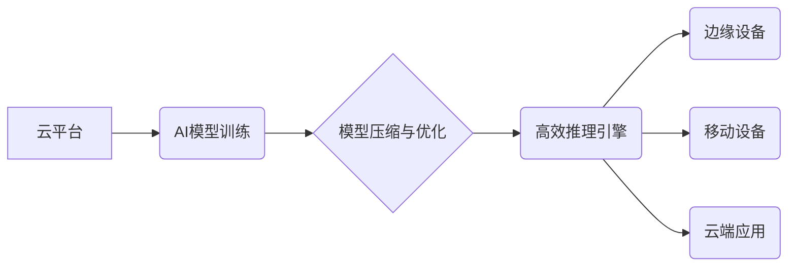

> 云计算,人工智能,深度学习,贾扬清,Lepton AI,阿里巴巴,模型压缩,高效推理

## 1. 背景介绍

人工智能（AI）正以惊人的速度发展，其应用领域不断扩展，从自动驾驶到医疗诊断，再到个性化推荐，AI正在深刻地改变着我们的生活。然而，AI技术的落地和应用也面临着诸多挑战，其中之一就是高效的模型部署和推理。传统的AI模型往往体积庞大，计算资源需求高，难以在移动设备或边缘计算环境中部署。

贾扬清，一位享誉全球的AI专家，曾任阿里巴巴集团首席科学家，现任Lepton AI创始人兼CEO，他一直致力于解决AI模型部署和推理效率问题。在他的带领下，Lepton AI致力于构建高效的AI推理引擎，并将其应用于云端、边缘计算和移动设备等多种场景。

## 2. 核心概念与联系

云计算和AI技术的融合是当前科技发展的重要趋势。云计算提供强大的计算资源和存储能力，为AI模型的训练和部署提供了基础设施支持。而AI技术则赋予云计算新的智能能力，使其能够更好地理解和处理数据，提供更个性化和智能化的服务。

**云与AI融合的架构**



**核心概念：**

* **云计算:** 提供按需使用的计算资源、存储资源和网络资源，支持大规模数据处理和模型训练。
* **人工智能:** 利用算法和数据，使计算机能够模拟人类的智能行为，例如学习、推理和决策。
* **模型压缩:** 通过算法和技术手段，减少AI模型的大小和参数量，降低模型部署和推理的成本。
* **高效推理引擎:** 专为加速AI模型推理而设计的软件或硬件平台，能够提高推理速度和降低功耗。

## 3. 核心算法原理 & 具体操作步骤

### 3.1  算法原理概述

Lepton AI的核心技术之一是模型压缩技术，通过量化、剪枝和知识蒸馏等方法，有效地减少模型大小和参数量，同时保持模型性能。

* **量化:** 将模型参数从高精度浮点数（例如32位）降级到低精度整数（例如8位），减少存储空间和计算量。
* **剪枝:** 移除模型中不重要的权重参数，减少模型复杂度和计算量。
* **知识蒸馏:** 将大型模型的知识迁移到小型模型中，使小型模型能够达到接近大型模型的性能。

### 3.2  算法步骤详解

**模型量化:**

1. 选择合适的量化方法，例如均匀量化、非均匀量化等。
2. 将模型参数转换为低精度整数。
3. 对量化后的模型进行微调，以恢复模型性能。

**模型剪枝:**

1. 使用正则化技术或其他方法，评估模型中每个权重参数的重要性。
2. 移除不重要的权重参数，形成剪枝后的模型。
3. 对剪枝后的模型进行微调，以恢复模型性能。

**知识蒸馏:**

1. 选择一个大型模型作为教师模型，一个小型模型作为学生模型。
2. 让教师模型和学生模型分别对输入数据进行预测。
3. 使用教师模型的预测结果作为学生模型的监督信号，训练学生模型。

### 3.3  算法优缺点

**优点:**

* 模型大小和参数量显著减少，降低部署和推理成本。
* 提高模型推理速度和效率。
* 降低模型对硬件资源的需求。

**缺点:**

* 模型性能可能略有下降。
* 模型压缩和优化需要一定的专业知识和技术手段。

### 3.4  算法应用领域

模型压缩技术广泛应用于以下领域：

* **移动设备:** 将大型AI模型部署到移动设备上，实现本地推理，例如语音识别、图像识别和自然语言处理。
* **边缘计算:** 将AI模型部署到边缘设备上，实现实时数据处理和决策，例如工业自动化、智能家居和无人驾驶。
* **云端计算:** 压缩云端AI模型，降低存储和计算成本，提高模型部署效率。

## 4. 数学模型和公式 & 详细讲解 & 举例说明

### 4.1  数学模型构建

模型压缩的目标是找到一个更小的模型，其性能接近原始模型。我们可以使用以下数学模型来表示模型压缩过程：

$$
\min_{w'} \mathcal{L}(w', x, y)
$$

其中：

* $w'$ 是压缩后的模型参数。
* $\mathcal{L}$ 是损失函数，用于衡量模型预测结果与真实值的差异。
* $x$ 是输入数据。
* $y$ 是真实标签。

### 4.2  公式推导过程

模型压缩过程通常涉及以下步骤：

1. **量化:** 将模型参数从高精度浮点数转换为低精度整数。量化过程可以使用以下公式：

$$
q(w) = \text{round}(w / \Delta)
$$

其中：

* $q(w)$ 是量化后的参数。
* $w$ 是原始参数。
* $\Delta$ 是量化步长。

2. **剪枝:** 移除模型中不重要的权重参数。剪枝方法通常使用正则化技术或其他方法来评估权重参数的重要性。

3. **知识蒸馏:** 将大型模型的知识迁移到小型模型中。知识蒸馏的目标是使小型模型的预测结果与教师模型的预测结果尽可能接近。

### 4.3  案例分析与讲解

**量化案例:**

假设一个模型的参数为32位浮点数，我们将其量化为8位整数。量化步长可以设置为255，则量化后的参数范围为0-255。

**剪枝案例:**

我们可以使用L1正则化来评估模型中每个权重参数的重要性。L1正则化项会惩罚模型参数的绝对值，因此可以有效地移除不重要的权重参数。

**知识蒸馏案例:**

我们可以使用教师模型的输出概率作为学生模型的监督信号，训练学生模型。

## 5. 项目实践：代码实例和详细解释说明

### 5.1  开发环境搭建

Lepton AI提供了丰富的开发工具和SDK，支持多种编程语言和平台。

**开发环境搭建步骤:**

1. 下载并安装Lepton AI SDK。
2. 配置开发环境变量。
3. 安装必要的依赖库。

### 5.2  源代码详细实现

Lepton AI提供了多种模型压缩和优化算法的实现代码，例如量化、剪枝和知识蒸馏。

**代码示例:**

```python
# 量化模型
from leptonai.quantization import quantize_model

model = load_model("model.h5")
quantized_model = quantize_model(model, bit_width=8)

# 保存量化模型
save_model(quantized_model, "quantized_model.h5")
```

### 5.3  代码解读与分析

代码示例演示了如何使用Lepton AI SDK对模型进行量化操作。

* `load_model()` 函数用于加载预训练的模型。
* `quantize_model()` 函数用于对模型进行量化操作。
* `save_model()` 函数用于保存量化后的模型。

### 5.4  运行结果展示

运行上述代码后，将生成一个量化后的模型文件。

## 6. 实际应用场景

Lepton AI的模型压缩技术已应用于多个实际场景，例如：

### 6.1  移动语音识别

Lepton AI的模型压缩技术可以将大型语音识别模型部署到移动设备上，实现离线语音识别功能。

### 6.2  智能家居

Lepton AI的模型压缩技术可以将AI模型部署到智能家居设备上，实现语音控制、图像识别和场景感知等功能。

### 6.3  工业自动化

Lepton AI的模型压缩技术可以将AI模型部署到工业设备上，实现机器视觉、缺陷检测和过程控制等功能。

### 6.4  未来应用展望

Lepton AI的模型压缩技术将在未来应用于更多场景，例如：

* **自动驾驶:** 将大型自动驾驶模型部署到车载设备上，实现更安全和智能的驾驶体验。
* **医疗诊断:** 将AI模型部署到医疗设备上，辅助医生进行疾病诊断和治疗方案制定。
* **个性化教育:** 将AI模型部署到教育平台上，提供个性化的学习内容和辅导服务。

## 7. 工具和资源推荐

### 7.1  学习资源推荐

* Lepton AI官方文档：https://docs.lepton.ai/
* Lepton AI GitHub仓库：https://github.com/lepton-ai

### 7.2  开发工具推荐

* Lepton AI SDK：https://lepton.ai/sdk

### 7.3  相关论文推荐

* **模型压缩技术综述:** https://arxiv.org/abs/1901.07637
* **知识蒸馏技术综述:** https://arxiv.org/abs/1503.02531

## 8. 总结：未来发展趋势与挑战

### 8.1  研究成果总结

Lepton AI在模型压缩技术方面取得了显著成果，其高效的推理引擎和丰富的开发工具，为AI技术的落地和应用提供了强有力的支持。

### 8.2  未来发展趋势

未来，模型压缩技术将朝着以下方向发展：

* **更有效的压缩算法:** 开发更先进的模型压缩算法，进一步降低模型大小和参数量，同时保持模型性能。
* **硬件加速:** 利用专用硬件加速模型推理，提高推理速度和效率。
* **联邦学习:** 将模型压缩技术与联邦学习结合，实现隐私保护下的模型训练和部署。

### 8.3  面临的挑战

模型压缩技术还面临着一些挑战：

* **模型性能损失:** 模型压缩可能会导致模型性能损失，需要不断探索新的方法来最小化性能损失。
* **硬件平台限制:** 不同的硬件平台对模型压缩算法的支持程度不同，需要针对不同的硬件平台进行优化。
* **标准化和开源:** 模型压缩技术缺乏统一的标准和开源平台，需要加强行业合作和标准化工作。

### 8.4  研究展望

Lepton AI将继续致力于模型压缩技术的研究和应用，推动AI技术的普及和发展。

## 9. 附录：常见问题与解答

**常见问题:**

* **模型压缩会降低模型性能吗？**

**解答:** 模型压缩可能会导致模型性能损失，但Lepton AI的模型压缩技术致力于最小化性能损失。

* **Lepton AI的模型压缩技术适用于哪些场景？**

**解答:** Lepton AI的模型压缩技术适用于各种需要部署到资源受限设备上的AI场景，例如移动设备、边缘计算和云端计算。

* **如何使用Lepton AI的模型压缩工具？**

**解答:** Lepton AI提供了丰富的开发工具和SDK，详细的使用说明请参考Lepton AI官方文档。


作者：禅与计算机程序设计艺术 / Zen and the Art of Computer Programming 
<end_of_turn>