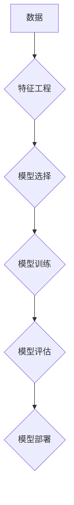

> 人工智能、机器学习、深度学习、数学基础、算法原理、代码实战、Python

## 1. 背景介绍

人工智能（AI）作为21世纪最具颠覆性的技术之一，正在深刻地改变着我们的生活和工作方式。从自动驾驶汽车到智能语音助手，从医疗诊断到金融风险评估，AI技术的应用领域日益广泛。然而，想要真正理解和掌握AI的精髓，就必须深入了解其背后的数学基础原理。

传统的编程方法依赖于明确的指令和规则，而AI则更侧重于学习和模仿人类的智能行为。这使得AI的数学基础更加复杂和抽象，涵盖了概率论、统计学、线性代数、微积分等多个学科。

本篇文章将深入探讨人工智能的核心数学基础原理，并结合Python代码实战案例，帮助读者理解AI算法的运作机制，并掌握基本的AI开发技能。

## 2. 核心概念与联系

**2.1  机器学习**

机器学习是人工智能的一个重要分支，它通过算法学习数据中的模式和规律，从而实现对新数据的预测和分类。

**2.2  深度学习**

深度学习是机器学习的一个子领域，它利用多层神经网络来模拟人类大脑的学习过程，能够处理更复杂的数据类型，并取得更优异的性能。

**2.3  算法原理**

机器学习和深度学习算法的核心原理是通过调整模型参数，使得模型在训练数据上表现最佳。

**2.4  数学模型**

机器学习和深度学习算法通常可以用数学模型来表示，例如线性回归、逻辑回归、支持向量机、神经网络等。

**2.5  代码实现**

Python是机器学习和深度学习开发的常用语言，它拥有丰富的库和工具，例如NumPy、Pandas、Scikit-learn、TensorFlow、PyTorch等。

**Mermaid 流程图**

## 3. 核心算法原理 & 具体操作步骤

### 3.1  算法原理概述

本节将介绍线性回归算法的原理，线性回归是一种常用的监督学习算法，用于预测连续值。

**3.1.1  假设函数**

线性回归假设目标变量与输入特征之间存在线性关系，可以用以下公式表示：

$$y = w_0 + w_1x_1 + w_2x_2 + ... + w_nx_n + \epsilon$$

其中：

* $y$ 是目标变量
* $x_1, x_2, ..., x_n$ 是输入特征
* $w_0, w_1, w_2, ..., w_n$ 是模型参数
* $\epsilon$ 是误差项

**3.1.2  损失函数**

线性回归的目标是找到最优的模型参数，使得预测值与真实值之间的误差最小。常用的损失函数是均方误差（MSE）：

$$MSE = \frac{1}{n}\sum_{i=1}^{n}(y_i - \hat{y}_i)^2$$

其中：

* $n$ 是样本数量
* $y_i$ 是真实值
* $\hat{y}_i$ 是预测值

**3.1.3  梯度下降**

梯度下降是一种常用的优化算法，用于找到最小化损失函数的参数值。

### 3.2  算法步骤详解

1. **数据预处理:** 对数据进行清洗、转换和特征工程，例如标准化、归一化等。
2. **模型选择:** 选择合适的线性回归模型，例如普通线性回归、岭回归、LASSO回归等。
3. **模型训练:** 使用梯度下降算法，最小化损失函数，得到最优的模型参数。
4. **模型评估:** 使用测试数据评估模型的性能，例如R-squared、均方根误差（RMSE）等。
5. **模型部署:** 将训练好的模型部署到实际应用场景中。

### 3.3  算法优缺点

**优点:**

* 算法简单易懂，易于实现。
* 训练速度快，计算量小。
* 可解释性强，可以直观地理解模型的决策过程。

**缺点:**

* 只能处理线性关系，对于非线性关系的预测效果较差。
* 对异常值敏感，容易受到异常值的影响。

### 3.4  算法应用领域

* 房价预测
* 股票价格预测
* 销售预测
* 医疗诊断
* 经济预测

## 4. 数学模型和公式 & 详细讲解 & 举例说明

### 4.1  数学模型构建

线性回归模型可以表示为一个线性方程，其中目标变量是输入特征的线性组合加上一个误差项。

### 4.2  公式推导过程

损失函数的最小化可以通过梯度下降算法实现。梯度下降算法的基本思想是迭代地更新模型参数，使得损失函数不断减小。

### 4.3  案例分析与讲解

通过一个具体的案例，例如预测房价，来讲解线性回归模型的应用过程。

## 5. 项目实践：代码实例和详细解释说明

### 5.1  开发环境搭建

使用Python语言和相关的库，例如NumPy、Pandas、Scikit-learn等，搭建开发环境。

### 5.2  源代码详细实现

提供一个完整的线性回归模型的Python代码实现，并进行详细的解释。

### 5.3  代码解读与分析

对代码进行逐行解读，解释每个代码块的功能和作用。

### 5.4  运行结果展示

展示代码运行的结果，例如预测结果、评估指标等。

## 6. 实际应用场景

### 6.1  金融领域

* 股票价格预测
* 贷款风险评估
* 欺诈检测

### 6.2  医疗领域

* 疾病诊断
* 药物研发
* 患者风险评估

### 6.3  电商领域

* 商品推荐
* 销售预测
* 客户画像

### 6.4  未来应用展望

人工智能技术的发展将进一步推动AI在各个领域的应用，例如自动驾驶、机器人、个性化教育等。

## 7. 工具和资源推荐

### 7.1  学习资源推荐

* 书籍：《Python机器学习》、《深度学习》
* 在线课程：Coursera、edX、Udacity
* 博客和论坛：Towards Data Science、Kaggle

### 7.2  开发工具推荐

* Python
* NumPy
* Pandas
* Scikit-learn
* TensorFlow
* PyTorch

### 7.3  相关论文推荐

* 《ImageNet Classification with Deep Convolutional Neural Networks》
* 《Attention Is All You Need》
* 《BERT: Pre-training of Deep Bidirectional Transformers for Language Understanding》

## 8. 总结：未来发展趋势与挑战

### 8.1  研究成果总结

人工智能技术取得了长足的进步，在各个领域都取得了显著的应用成果。

### 8.2  未来发展趋势

* 模型更加复杂和强大
* 数据更加丰富和多样化
* 应用场景更加广泛和深入

### 8.3  面临的挑战

* 数据隐私和安全
* 算法可解释性和公平性
* 人工智能伦理问题

### 8.4  研究展望

未来人工智能研究将更加注重模型的可解释性、公平性和安全性，并探索人工智能与人类更加紧密地融合。

## 9. 附录：常见问题与解答

* 什么是机器学习？
* 什么是深度学习？
* 如何选择合适的机器学习算法？
* 如何评估机器学习模型的性能？

作者：禅与计算机程序设计艺术 / Zen and the Art of Computer Programming

<end_of_turn>