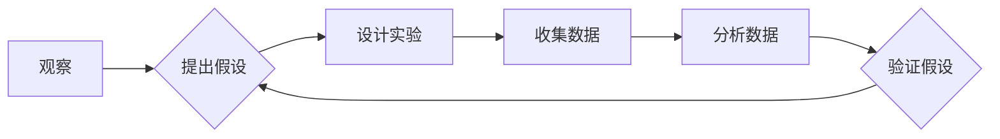

> 科学方法论，循环迭代，假说检验，验证，反证，真理，人工智能，机器学习

## 1. 背景介绍

在瞬息万变的科技时代，人工智能（AI）正以惊人的速度发展，其应用领域不断拓展，深刻地改变着我们的生活。然而，AI的发展并非一帆风顺，其核心在于如何构建能够有效学习、推理和决策的智能系统。而科学方法论，作为人类探索真理的宝贵工具，为AI的发展提供了重要的指导思想。

科学方法论的核心在于“从假说到真理”的循环迭代过程。它强调通过观察、假设、实验、分析和总结，不断修正和完善对世界的理解。这种循环迭代的过程，正是AI发展所必需的。

## 2. 核心概念与联系

科学方法论的核心概念包括：

* **观察:** 对现象进行仔细的观察和记录，收集数据和信息。
* **假设:** 根据观察结果，提出一个可被检验的假设，即对现象的解释。
* **实验:** 设计和进行实验，收集数据来检验假设的正确性。
* **分析:** 对实验结果进行分析，判断假设是否得到支持。
* **总结:** 根据分析结果，总结经验教训，修正假设或提出新的假设，并继续循环迭代。

**Mermaid 流程图:**



在AI领域，观察可以是收集用户数据、网络流量等信息；假设可以是设计新的算法模型；实验可以是训练模型、测试模型性能；分析可以是评估模型的准确率、效率等指标；总结可以是根据分析结果改进模型参数、算法结构等。

## 3. 核心算法原理 & 具体操作步骤

### 3.1  算法原理概述

**机器学习**作为AI的核心技术之一，正是基于科学方法论的循环迭代过程。它通过训练模型，使模型能够从数据中学习规律，并对新的数据进行预测或分类。

**监督学习**是机器学习的一种重要类型，它通过标记数据，训练模型学习输入与输出之间的映射关系。例如，在图像分类任务中，需要将图像与对应的类别标签进行配对，训练模型识别不同类别的图像。

### 3.2  算法步骤详解

1. **数据收集和预处理:** 收集相关数据，并进行清洗、转换、特征提取等预处理操作，以确保数据质量和模型训练效果。
2. **模型选择:** 根据任务需求选择合适的机器学习模型，例如线性回归、逻辑回归、决策树、支持向量机等。
3. **模型训练:** 使用标记数据训练模型，调整模型参数，使模型能够准确地预测或分类。
4. **模型评估:** 使用测试数据评估模型的性能，例如准确率、召回率、F1-score等指标。
5. **模型调优:** 根据评估结果，调整模型参数、算法结构等，进一步提高模型性能。
6. **模型部署:** 将训练好的模型部署到实际应用场景中，用于预测或分类新的数据。

### 3.3  算法优缺点

**优点:**

* 能够从数据中学习规律，自动进行预测或分类。
* 适应性强，能够处理复杂、非线性问题。
* 可扩展性好，能够处理海量数据。

**缺点:**

* 需要大量的标记数据进行训练。
* 模型训练过程可能耗时较长。
* 模型解释性较差，难以理解模型的决策过程。

### 3.4  算法应用领域

监督学习算法广泛应用于各个领域，例如：

* **图像识别:** 人脸识别、物体检测、图像分类等。
* **自然语言处理:** 文本分类、情感分析、机器翻译等。
* **推荐系统:** 商品推荐、用户画像、个性化服务等。
* **医疗诊断:** 疾病预测、影像分析、药物研发等。

## 4. 数学模型和公式 & 详细讲解 & 举例说明

### 4.1  数学模型构建

在监督学习中，常用的数学模型是**线性回归模型**。它假设输入特征与输出变量之间存在线性关系。

**线性回归模型公式:**

$$y = w_0 + w_1x_1 + w_2x_2 + ... + w_nx_n + \epsilon$$

其中：

* $y$ 是输出变量。
* $x_1, x_2, ..., x_n$ 是输入特征。
* $w_0, w_1, w_2, ..., w_n$ 是模型参数。
* $\epsilon$ 是误差项。

### 4.2  公式推导过程

模型参数的学习过程是通过**最小化误差**来实现的。常用的误差函数是**均方误差（MSE）**。

**均方误差公式:**

$$MSE = \frac{1}{n}\sum_{i=1}^{n}(y_i - \hat{y}_i)^2$$

其中：

* $n$ 是样本数量。
* $y_i$ 是第 $i$ 个样本的真实值。
* $\hat{y}_i$ 是第 $i$ 个样本的预测值。

通过**梯度下降算法**，可以迭代地更新模型参数，使MSE最小化。

### 4.3  案例分析与讲解

假设我们有一个数据集，包含房屋面积和房屋价格的信息。我们想要构建一个线性回归模型，预测房屋价格。

我们可以将房屋面积作为输入特征，房屋价格作为输出变量。通过训练线性回归模型，我们可以得到一个模型参数，例如：

$$y = 50000 + 200x$$

其中：

* $y$ 是房屋价格。
* $x$ 是房屋面积。

这个模型表示，房屋面积每增加1平方米，房屋价格就会增加200元。

## 5. 项目实践：代码实例和详细解释说明

### 5.1  开发环境搭建

* Python 3.x
* scikit-learn 库

### 5.2  源代码详细实现

```python
from sklearn.linear_model import LinearRegression
from sklearn.model_selection import train_test_split
import numpy as np

# 生成示例数据
np.random.seed(0)
X = np.random.rand(100, 1) * 100
y = 2 * X + 1 + np.random.randn(100, 1)

# 将数据划分为训练集和测试集
X_train, X_test, y_train, y_test = train_test_split(X, y, test_size=0.2, random_state=42)

# 创建线性回归模型
model = LinearRegression()

# 训练模型
model.fit(X_train, y_train)

# 预测测试集数据
y_pred = model.predict(X_test)

# 评估模型性能
from sklearn.metrics import mean_squared_error
mse = mean_squared_error(y_test, y_pred)
print(f"均方误差: {mse}")
```

### 5.3  代码解读与分析

* 首先，我们生成一些示例数据，模拟房屋面积和房屋价格的关系。
* 然后，我们将数据划分为训练集和测试集，用于训练和评估模型。
* 接下来，我们创建线性回归模型，并使用训练数据训练模型。
* 训练完成后，我们使用测试数据预测房屋价格，并计算模型的均方误差来评估模型性能。

### 5.4  运行结果展示

运行代码后，会输出模型的均方误差值。这个值越小，表示模型的预测效果越好。

## 6. 实际应用场景

监督学习算法在各个领域都有广泛的应用，例如：

* **医疗诊断:** 利用患者的病史、检查结果等数据，训练模型预测疾病风险或诊断疾病类型。
* **金融风险管理:** 利用客户的信用记录、交易行为等数据，训练模型评估客户的信用风险或预测市场风险。
* **精准营销:** 利用用户的购买记录、浏览历史等数据，训练模型推荐个性化商品或服务。

### 6.4  未来应用展望

随着数据量的不断增长和计算能力的提升，监督学习算法将有更广泛的应用场景，例如：

* **个性化教育:** 根据学生的学习情况，定制个性化的学习方案。
* **智能交通:** 利用交通流量、路况等数据，优化交通流量，提高道路安全。
* **自动驾驶:** 利用传感器数据，训练模型实现自动驾驶功能。

## 7. 工具和资源推荐

### 7.1  学习资源推荐

* **书籍:**
    * 《机器学习》 - 周志华
    * 《深入理解机器学习》 -  李航
* **在线课程:**
    * Coursera: Machine Learning by Andrew Ng
    * edX: Artificial Intelligence by Columbia University

### 7.2  开发工具推荐

* **Python:** 作为机器学习的常用编程语言。
* **scikit-learn:** Python机器学习库，提供各种机器学习算法和工具。
* **TensorFlow:** Google开发的开源机器学习框架。
* **PyTorch:** Facebook开发的开源机器学习框架。

### 7.3  相关论文推荐

* **《Support Vector Machines》** - Vapnik, V. N. (1995)
* **《A Probabilistic Approach to Neural Network Learning》** - Bishop, C. M. (1995)
* **《Deep Learning》** - Goodfellow, I., Bengio, Y., & Courville, A. (2016)

## 8. 总结：未来发展趋势与挑战

### 8.1  研究成果总结

科学方法论为AI的发展提供了重要的指导思想，监督学习算法在各个领域取得了显著的成果。

### 8.2  未来发展趋势

* **模型更加复杂:** 随着数据量的增长和计算能力的提升，AI模型将更加复杂，例如深度学习模型。
* **解释性更强:** 如何解释AI模型的决策过程，提高模型的透明度和可信度，是未来研究的重要方向。
* **更广泛的应用:** AI将应用于更多领域，例如医疗、教育、交通等，带来更大的社会效益。

### 8.3  面临的挑战

* **数据质量:** AI模型的性能依赖于数据质量，如何获取高质量的数据是关键挑战。
* **算法效率:** 训练复杂模型需要大量的计算资源，如何提高算法效率是重要的研究方向。
* **伦理问题:** AI技术的发展也带来了伦理问题，例如算法偏见、隐私保护等，需要认真思考和解决。

### 8.4  研究展望

未来，AI研究将继续朝着更智能、更安全、更可解释的方向发展，为人类社会带来更多福祉。

## 9. 附录：常见问题与解答

* **什么是监督学习？**

监督学习是一种机器学习方法，它通过标记数据，训练模型学习输入与输出之间的映射关系。

* **什么是线性回归模型？**

线性回归模型假设输入特征与输出变量之间存在线性关系。

* **如何评估机器学习模型的性能？**

常用的评估指标包括准确率、召回率、F1-score、均方误差等。

* **如何解决算法偏见问题？**

可以通过数据预处理、算法设计、模型评估等方式来解决算法偏见问题。


作者：禅与计算机程序设计艺术 / Zen and the Art of Computer Programming 
<end_of_turn>