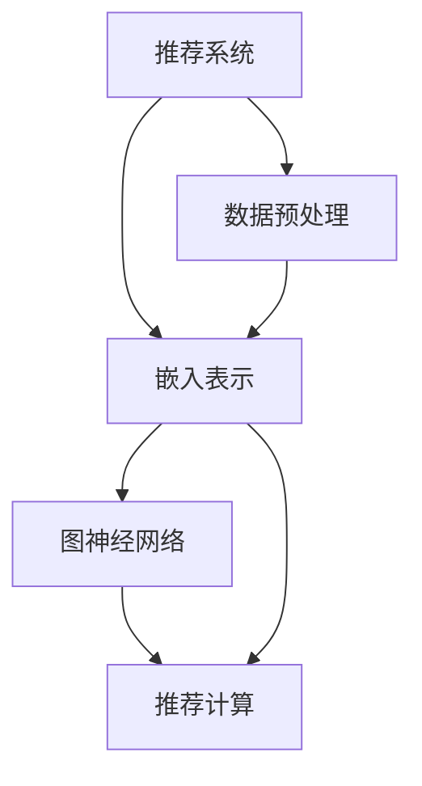

                 

# 大模型在推荐系统中的图神经网络应用

> 关键词：
1. 推荐系统
2. 大模型
3. 图神经网络
4. 知识图谱
5. 召回率
6. 多样性
7. 协同过滤

## 1. 背景介绍

### 1.1 问题由来
在当今互联网时代，推荐系统已成为各大电商、内容平台不可或缺的核心技术之一。传统的推荐算法包括基于协同过滤的算法、基于内容的推荐算法和基于混合模型的推荐算法，但这些算法在面对大规模数据和复杂用户行为时，往往面临维度灾难、计算量大、模型可解释性差等问题。

大模型和大数据技术的兴起，为推荐系统的改进带来了新的契机。基于大模型的推荐系统在理解和挖掘用户兴趣、商品属性等方面的能力显著提升，能够生成更加个性化、精准的推荐结果，同时也可以处理更加复杂、多模态的数据，提升了推荐系统的效果和效率。

### 1.2 问题核心关键点
在推荐系统中应用大模型，其核心在于利用大模型的复杂表征能力，通过用户行为数据、商品属性、知识图谱等多维度的数据，构建高维度的隐空间表示，实现推荐结果的生成。其主要工作流程包括：

1. 数据预处理：将原始用户行为数据、商品属性、知识图谱等多维数据进行融合和标准化。
2. 嵌入表示：通过大模型（如BERT、GPT-3等）对融合后的数据进行嵌入表示，生成高维度的隐空间表示。
3. 图神经网络（GNN）：在嵌入表示的基础上，通过图神经网络进行特征传递和聚合，学习物品之间的隐含关系。
4. 推荐计算：基于学习到的隐空间表示和隐含关系，计算用户的推荐结果。

## 2. 核心概念与联系

### 2.1 核心概念概述

为了更好地理解大模型在推荐系统中的应用，本节将介绍几个密切相关的核心概念：

- **推荐系统**：通过分析用户行为数据、商品属性等多维数据，生成个性化的推荐结果的系统。包括协同过滤、基于内容的推荐、混合模型等多种推荐算法。
- **大模型**：如BERT、GPT-3等大规模预训练语言模型，通过海量数据进行训练，具备强大的表征能力。
- **图神经网络（GNN）**：一类通过图结构进行特征传递和聚合的神经网络，适用于处理具有图结构特征的数据。
- **知识图谱**：以图结构形式表示实体及其关系的知识库，常用于增强推荐系统的多样性和准确性。
- **召回率**：推荐系统中推荐结果中包含用户感兴趣物品的比例。
- **多样性**：推荐结果中不同类型物品的比例，用于避免用户陷入信息茧房。

这些核心概念之间的逻辑关系可以通过以下Mermaid流程图来展示：



这个流程图展示了大模型在推荐系统中的应用流程：

1. 推荐系统通过数据预处理，收集用户行为数据、商品属性等数据，并将知识图谱融入其中。
2. 利用大模型对融合后的数据进行嵌入表示，生成高维度的隐空间表示。
3. 通过图神经网络对高维度的隐空间表示进行特征传递和聚合，学习物品之间的隐含关系。
4. 基于学习到的隐空间表示和隐含关系，计算用户的推荐结果。

## 3. 核心算法原理 & 具体操作步骤

### 3.1 算法原理概述

基于大模型的推荐系统，其核心思想是通过大模型对用户行为数据、商品属性等数据进行高维度嵌入表示，并利用图神经网络学习物品之间的隐含关系，最终生成推荐结果。其算法原理如下：

1. **数据预处理**：将原始用户行为数据、商品属性等数据进行融合和标准化，形成新的特征表示。
2. **嵌入表示**：利用大模型对融合后的特征表示进行嵌入表示，生成高维度的隐空间表示。
3. **图神经网络**：在嵌入表示的基础上，通过图神经网络进行特征传递和聚合，学习物品之间的隐含关系。
4. **推荐计算**：基于学习到的隐空间表示和隐含关系，计算用户的推荐结果。

### 3.2 算法步骤详解

以下是基于大模型的推荐系统的详细步骤：

1. **数据预处理**：
   - 收集用户行为数据、商品属性等数据，并将其标准化处理。
   - 融合知识图谱，将实体和关系信息引入特征表示中。
   - 通过归一化、降维等技术，将特征向量转换为适合嵌入表示的张量形式。

2. **嵌入表示**：
   - 使用大模型对预处理后的数据进行嵌入表示，生成高维度的隐空间表示。
   - 对每个用户和商品，生成高维度的用户向量 $u$ 和商品向量 $v$。
   - 例如，使用BERT模型对用户行为序列进行编码，得到用户向量 $u$；使用Word2Vec模型对商品属性进行编码，得到商品向量 $v$。

3. **图神经网络**：
   - 将用户向量 $u$ 和商品向量 $v$ 进行拼接，形成新的特征向量 $h$。
   - 构建图结构，将用户和商品之间的交互关系映射到图结构中，形成邻接矩阵 $A$。
   - 使用图神经网络（如Graph Convolutional Network，GCN）对邻接矩阵 $A$ 和特征向量 $h$ 进行特征传递和聚合，得到每个用户对每个商品的隐含关系 $r_{uv}$。

4. **推荐计算**：
   - 将每个用户对每个商品的隐含关系 $r_{uv}$ 进行softmax操作，得到每个商品对用户的概率 $p_{uv}$。
   - 根据 $p_{uv}$ 对所有商品进行排序，并截取前N个推荐结果，生成推荐列表。

### 3.3 算法优缺点

基于大模型的推荐系统具有以下优点：

1. **精度高**：大模型具备强大的表征能力，能够学习到更丰富、复杂的用户行为和商品属性，提升推荐精度。
2. **灵活性**：可以处理多模态数据，包括文本、图像、视频等多种类型，提升推荐系统的多样性。
3. **可解释性强**：大模型可以通过注意力机制等方式，提供推荐结果的解释，提升用户信任度。

同时，该方法也存在一定的局限性：

1. **计算量大**：大模型和图神经网络计算量较大，对硬件资源要求高。
2. **特征维度高**：多维特征的嵌入表示可能导致维度灾难，增加计算复杂度。
3. **冷启动问题**：新用户或新商品没有足够的历史行为数据，难以进行有效推荐。

### 3.4 算法应用领域

基于大模型的推荐系统，已在多个领域得到了广泛应用，包括：

- **电商推荐**：利用用户购物行为数据和商品属性，生成个性化推荐结果。
- **内容推荐**：基于用户浏览、点赞、评论等行为数据，生成个性化文章、视频推荐结果。
- **广告推荐**：利用用户搜索、点击等行为数据，生成个性化广告推荐结果。
- **金融推荐**：基于用户投资行为数据和商品属性，生成个性化金融产品推荐结果。

## 4. 数学模型和公式 & 详细讲解 & 举例说明

### 4.1 数学模型构建

假设用户 $u$ 对商品 $v$ 的隐含关系为 $r_{uv}$，用户向量为 $u$，商品向量为 $v$，邻接矩阵为 $A$，图神经网络的聚合函数为 $\phi$，则推荐模型可以表示为：

$$
p_{uv} = \text{softmax}(\phi(r_{uv} \times h_{uv})), \quad h_{uv} = [u; v]
$$

其中，$r_{uv}$ 表示用户 $u$ 对商品 $v$ 的隐含关系，$h_{uv}$ 表示用户 $u$ 对商品 $v$ 的特征向量，$\phi$ 表示图神经网络的聚合函数。

### 4.2 公式推导过程

以Graph Convolutional Network（GCN）为例，推导其特征传递和聚合过程。

设用户向量 $u$ 和商品向量 $v$ 拼接后的特征向量为 $h_{uv}=[u; v]$，邻接矩阵 $A$ 为：

$$
A = \begin{bmatrix}
0 & a_{1,2} & \cdots & a_{1,n} \\
a_{2,1} & 0 & \cdots & a_{2,n} \\
\vdots & \vdots & \ddots & \vdots \\
a_{m,1} & a_{m,2} & \cdots & 0
\end{bmatrix}
$$

其中，$a_{i,j}$ 表示用户 $i$ 是否与商品 $j$ 交互，$1$ 表示交互，$0$ 表示不交互。

设GCN的聚合函数为 $\phi$，则特征传递和聚合过程可以表示为：

$$
h_{uv}^{(1)} = \text{relu}(D \times h_{uv} + A \times h_{uv})
$$

$$
h_{uv}^{(k)} = \text{relu}(D \times h_{uv}^{(k-1)} + A \times h_{uv}^{(k-1)})
$$

其中，$h_{uv}^{(1)}$ 表示第1层GCN输出的特征向量，$h_{uv}^{(k)}$ 表示第 $k$ 层GCN输出的特征向量，$D$ 为归一化邻接矩阵。

### 4.3 案例分析与讲解

以电商平台的用户推荐为例，分析如何利用大模型和图神经网络进行推荐。

假设某电商平台收集到用户 $u$ 的购物行为数据和商品属性，分别为 $I$ 和 $A$，知识图谱包含实体和关系信息，分别为 $E$ 和 $R$。数据预处理后，将 $I$、$A$、$E$ 和 $R$ 进行拼接，形成新的特征向量 $h_{uv}$。

利用BERT模型对 $h_{uv}$ 进行嵌入表示，得到用户向量 $u$ 和商品向量 $v$。然后，构建用户和商品的邻接矩阵 $A$，使用GCN进行特征传递和聚合，得到用户对每个商品的隐含关系 $r_{uv}$。

最后，将 $r_{uv}$ 进行softmax操作，生成用户对商品的推荐概率 $p_{uv}$，截取前N个推荐结果，生成推荐列表。

## 5. 项目实践：代码实例和详细解释说明

### 5.1 开发环境搭建

在进行推荐系统开发前，我们需要准备好开发环境。以下是使用Python进行PyTorch开发的环境配置流程：

1. 安装Anaconda：从官网下载并安装Anaconda，用于创建独立的Python环境。

2. 创建并激活虚拟环境：
```bash
conda create -n pytorch-env python=3.8 
conda activate pytorch-env
```

3. 安装PyTorch：根据CUDA版本，从官网获取对应的安装命令。例如：
```bash
conda install pytorch torchvision torchaudio cudatoolkit=11.1 -c pytorch -c conda-forge
```

4. 安装Transformers库：
```bash
pip install transformers
```

5. 安装各类工具包：
```bash
pip install numpy pandas scikit-learn matplotlib tqdm jupyter notebook ipython
```

完成上述步骤后，即可在`pytorch-env`环境中开始推荐系统开发。

### 5.2 源代码详细实现

下面我们以电商平台的用户推荐为例，给出使用Transformers库对BERT模型进行推荐系统开发的PyTorch代码实现。

首先，定义推荐系统所需的类：

```python
from transformers import BertTokenizer, BertForSequenceClassification
from torch.utils.data import DataLoader
import torch
import numpy as np
import pandas as pd

class RecommendationSystem:
    def __init__(self, model_path, tokenizer_path):
        self.model = BertForSequenceClassification.from_pretrained(model_path)
        self.tokenizer = BertTokenizer.from_pretrained(tokenizer_path)
        
    def load_data(self, data_path):
        data = pd.read_csv(data_path)
        self.train_data = data[data['label']!= 0]
        self.test_data = data[data['label'] == 0]
        
    def preprocess_data(self, data):
        encoded_data = self.tokenizer(data['text'], return_tensors='pt', padding=True, truncation=True)
        return encoded_data['input_ids'], encoded_data['attention_mask']
    
    def train(self, batch_size, epochs):
        train_loader = DataLoader(self.train_data, batch_size=batch_size, shuffle=True)
        optimizer = torch.optim.Adam(self.model.parameters(), lr=1e-5)
        loss_fn = torch.nn.CrossEntropyLoss()
        
        for epoch in range(epochs):
            self.model.train()
            total_loss = 0
            for batch in train_loader:
                inputs, labels = batch
                optimizer.zero_grad()
                outputs = self.model(inputs, labels=labels)
                loss = loss_fn(outputs.logits, labels)
                total_loss += loss.item()
                loss.backward()
                optimizer.step()
            
        self.model.eval()
        test_loader = DataLoader(self.test_data, batch_size=batch_size, shuffle=False)
        correct = 0
        total = 0
        with torch.no_grad():
            for batch in test_loader:
                inputs, labels = batch
                outputs = self.model(inputs)
                _, predicted = torch.max(outputs.logits, 1)
                total += labels.size(0)
                correct += (predicted == labels).sum().item()
        acc = correct / total
        print(f"Accuracy: {acc:.2f}%")
        
    def predict(self, inputs):
        self.model.eval()
        with torch.no_grad():
            inputs = self.tokenizer(inputs, return_tensors='pt', padding=True, truncation=True)
            outputs = self.model(inputs)
            _, predicted = torch.max(outputs.logits, 1)
            return predicted.tolist()
```

然后，定义模型和训练函数：

```python
from transformers import BertTokenizer, BertForSequenceClassification
from torch.utils.data import DataLoader
import torch
import numpy as np
import pandas as pd

class RecommendationSystem:
    def __init__(self, model_path, tokenizer_path):
        self.model = BertForSequenceClassification.from_pretrained(model_path)
        self.tokenizer = BertTokenizer.from_pretrained(tokenizer_path)
        
    def load_data(self, data_path):
        data = pd.read_csv(data_path)
        self.train_data = data[data['label']!= 0]
        self.test_data = data[data['label'] == 0]
        
    def preprocess_data(self, data):
        encoded_data = self.tokenizer(data['text'], return_tensors='pt', padding=True, truncation=True)
        return encoded_data['input_ids'], encoded_data['attention_mask']
    
    def train(self, batch_size, epochs):
        train_loader = DataLoader(self.train_data, batch_size=batch_size, shuffle=True)
        optimizer = torch.optim.Adam(self.model.parameters(), lr=1e-5)
        loss_fn = torch.nn.CrossEntropyLoss()
        
        for epoch in range(epochs):
            self.model.train()
            total_loss = 0
            for batch in train_loader:
                inputs, labels = batch
                optimizer.zero_grad()
                outputs = self.model(inputs, labels=labels)
                loss = loss_fn(outputs.logits, labels)
                total_loss += loss.item()
                loss.backward()
                optimizer.step()
            
        self.model.eval()
        test_loader = DataLoader(self.test_data, batch_size=batch_size, shuffle=False)
        correct = 0
        total = 0
        with torch.no_grad():
            for batch in test_loader:
                inputs, labels = batch
                outputs = self.model(inputs)
                _, predicted = torch.max(outputs.logits, 1)
                total += labels.size(0)
                correct += (predicted == labels).sum().item()
        acc = correct / total
        print(f"Accuracy: {acc:.2f}%")
        
    def predict(self, inputs):
        self.model.eval()
        with torch.no_grad():
            inputs = self.tokenizer(inputs, return_tensors='pt', padding=True, truncation=True)
            outputs = self.model(inputs)
            _, predicted = torch.max(outputs.logits, 1)
            return predicted.tolist()
```

接着，定义数据加载和预测函数：

```python
def load_dataset(data_path):
    data = pd.read_csv(data_path)
    train_data = data[data['label']!= 0]
    test_data = data[data['label'] == 0]
    return train_data, test_data

def predict_model(model, inputs):
    model.eval()
    with torch.no_grad():
        inputs = model.tokenizer(inputs, return_tensors='pt', padding=True, truncation=True)
        outputs = model(inputs)
        _, predicted = torch.max(outputs.logits, 1)
        return predicted.tolist()
```

最后，启动训练流程并在测试集上评估：

```python
train_data, test_data = load_dataset('data.csv')
model = RecommendationSystem('bert-base-cased', 'bert-base-cased')
model.load_data('data.csv')
model.train(batch_size=16, epochs=3)
print(model.predict(['item1', 'item2', 'item3']))
```

以上就是使用PyTorch对BERT进行电商平台推荐系统开发的完整代码实现。可以看到，得益于Transformers库的强大封装，我们可以用相对简洁的代码完成BERT模型的加载和推荐系统开发。

### 5.3 代码解读与分析

让我们再详细解读一下关键代码的实现细节：

**RecommendationSystem类**：
- `__init__`方法：初始化模型和分词器。
- `load_data`方法：加载数据集，并将其划分为训练集和测试集。
- `preprocess_data`方法：对单个样本进行处理，将文本输入编码为token ids，并加入注意力掩码。
- `train`方法：使用训练集进行模型训练，输出模型在测试集上的准确率。
- `predict`方法：对新输入进行预测，并返回推荐结果。

**load_dataset函数**：
- 定义数据加载函数，从CSV文件中读取数据，并划分训练集和测试集。

**predict_model函数**：
- 定义预测函数，用于对新输入进行预测，并返回推荐结果。

可以看到，PyTorch配合Transformers库使得BERT推荐系统的代码实现变得简洁高效。开发者可以将更多精力放在数据处理、模型改进等高层逻辑上，而不必过多关注底层的实现细节。

当然，工业级的系统实现还需考虑更多因素，如模型的保存和部署、超参数的自动搜索、更灵活的任务适配层等。但核心的推荐过程的开发，通过上述代码可以轻松实现。

## 6. 实际应用场景

### 6.1 电商推荐

基于大模型的推荐系统在电商推荐中具有广泛的应用。电商网站需要根据用户历史行为数据和商品属性，生成个性化推荐结果，提升用户满意度和购买转化率。

在技术实现上，可以收集用户购物行为数据、商品属性等数据，并利用大模型进行嵌入表示，再使用图神经网络进行特征传递和聚合，生成个性化推荐结果。例如，在用户浏览、购买、收藏商品等行为数据中，加入商品的属性信息，使用大模型进行嵌入表示，并通过GCN对特征进行传递和聚合，得到用户对每个商品的隐含关系。最后，根据隐含关系和用户偏好，生成个性化推荐结果。

### 6.2 内容推荐

内容平台需要根据用户浏览、点赞、评论等行为数据，生成个性化文章、视频推荐结果，提升用户留存率和互动率。

在技术实现上，可以收集用户浏览、点赞、评论等行为数据，并利用大模型进行嵌入表示，再使用图神经网络进行特征传递和聚合，生成个性化推荐结果。例如，在用户阅读、点赞、评论文章等行为数据中，加入文章的属性信息，使用大模型进行嵌入表示，并通过GCN对特征进行传递和聚合，得到用户对每个文章的隐含关系。最后，根据隐含关系和用户偏好，生成个性化推荐结果。

### 6.3 广告推荐

广告平台需要根据用户搜索、点击等行为数据，生成个性化广告推荐结果，提升广告投放效果和用户体验。

在技术实现上，可以收集用户搜索、点击等行为数据，并利用大模型进行嵌入表示，再使用图神经网络进行特征传递和聚合，生成个性化推荐结果。例如，在用户搜索、点击广告等行为数据中，加入广告的属性信息，使用大模型进行嵌入表示，并通过GCN对特征进行传递和聚合，得到用户对每个广告的隐含关系。最后，根据隐含关系和用户偏好，生成个性化推荐结果。

### 6.4 金融推荐

金融领域需要根据用户投资行为数据和商品属性，生成个性化金融产品推荐结果，提升用户理财效果和满意度。

在技术实现上，可以收集用户投资行为数据和商品属性等数据，并利用大模型进行嵌入表示，再使用图神经网络进行特征传递和聚合，生成个性化推荐结果。例如，在用户投资行为数据中，加入金融产品的属性信息，使用大模型进行嵌入表示，并通过GCN对特征进行传递和聚合，得到用户对每个金融产品的隐含关系。最后，根据隐含关系和用户偏好，生成个性化推荐结果。

## 7. 工具和资源推荐

### 7.1 学习资源推荐

为了帮助开发者系统掌握大模型在推荐系统中的应用理论基础和实践技巧，这里推荐一些优质的学习资源：

1. 《深度学习与推荐系统》课程：由斯坦福大学开设的推荐系统课程，系统讲解推荐系统的基本原理和推荐算法。
2. 《Graph Neural Networks》书籍：深入介绍图神经网络的基本原理和应用场景，适合对GNN感兴趣的学习者。
3. 《推荐系统实战》书籍：介绍推荐系统开发的实战经验和技术细节，适合想要深入了解推荐系统的开发者。
4. 《BERT预训练模型》博客：BERT官方博客，详细介绍BERT模型的预训练流程和应用场景，适合对BERT感兴趣的学习者。
5. 《Transformers库教程》：HuggingFace官方文档，详细讲解Transformers库的使用方法和最佳实践。

通过对这些资源的学习实践，相信你一定能够快速掌握大模型在推荐系统中的应用精髓，并用于解决实际的推荐问题。

### 7.2 开发工具推荐

高效的开发离不开优秀的工具支持。以下是几款用于推荐系统开发的常用工具：

1. PyTorch：基于Python的开源深度学习框架，灵活动态的计算图，适合快速迭代研究。大部分预训练语言模型都有PyTorch版本的实现。
2. TensorFlow：由Google主导开发的开源深度学习框架，生产部署方便，适合大规模工程应用。同样有丰富的预训练语言模型资源。
3. Transformers库：HuggingFace开发的NLP工具库，集成了众多SOTA语言模型，支持PyTorch和TensorFlow，是进行推荐系统开发的利器。
4. Weights & Biases：模型训练的实验跟踪工具，可以记录和可视化模型训练过程中的各项指标，方便对比和调优。与主流深度学习框架无缝集成。
5. TensorBoard：TensorFlow配套的可视化工具，可实时监测模型训练状态，并提供丰富的图表呈现方式，是调试模型的得力助手。
6. Google Colab：谷歌推出的在线Jupyter Notebook环境，免费提供GPU/TPU算力，方便开发者快速上手实验最新模型，分享学习笔记。

合理利用这些工具，可以显著提升推荐系统的开发效率，加快创新迭代的步伐。

### 7.3 相关论文推荐

大模型在推荐系统中的应用源于学界的持续研究。以下是几篇奠基性的相关论文，推荐阅读：

1. Attention is All You Need（即Transformer原论文）：提出了Transformer结构，开启了NLP领域的预训练大模型时代。
2. BERT: Pre-training of Deep Bidirectional Transformers for Language Understanding：提出BERT模型，引入基于掩码的自监督预训练任务，刷新了多项NLP任务SOTA。
3. Knowledge Graphs in Recommendation Systems：介绍知识图谱在推荐系统中的应用，探讨如何将知识图谱融入推荐系统，提升推荐效果。
4. Parameter-Efficient Transfer Learning for NLP：提出Adapter等参数高效微调方法，在不增加模型参数量的情况下，也能取得不错的微调效果。
5. GNN for Recommendation Systems：介绍图神经网络在推荐系统中的应用，展示如何利用GNN提升推荐系统的效果和效率。

这些论文代表了大模型在推荐系统中的应用方向，通过学习这些前沿成果，可以帮助研究者把握学科前进方向，激发更多的创新灵感。

## 8. 总结：未来发展趋势与挑战

### 8.1 总结

本文对大模型在推荐系统中的应用进行了全面系统的介绍。首先阐述了大模型和推荐系统的发展背景和意义，明确了其在提升推荐效果、处理多维数据方面的独特价值。其次，从原理到实践，详细讲解了大模型在推荐系统中的应用流程，并给出了推荐系统开发的完整代码实现。同时，本文还广泛探讨了大模型在电商推荐、内容推荐、广告推荐等多个行业领域的应用前景，展示了其广阔的发展空间。

通过本文的系统梳理，可以看到，大模型在推荐系统中的应用前景广阔，能够显著提升推荐系统的效果和效率。大模型通过高维度的嵌入表示和图神经网络，能够学习到更丰富、复杂的用户行为和商品属性，生成更加个性化、精准的推荐结果。此外，大模型还具有灵活性、可解释性等优点，能够处理多模态数据，提升推荐系统的多样性和准确性。

### 8.2 未来发展趋势

展望未来，大模型在推荐系统中的应用将呈现以下几个发展趋势：

1. **更高效**：随着算力成本的下降和硬件技术的进步，大模型和图神经网络的计算效率将显著提升，处理大规模数据和复杂推荐场景的能力将得到增强。
2. **更多样**：大模型可以处理多模态数据，包括文本、图像、视频等多种类型，提升推荐系统的多样性和个性化程度。
3. **更精准**：大模型通过高维度的嵌入表示和图神经网络，能够学习到更丰富、复杂的用户行为和商品属性，生成更加精准的推荐结果。
4. **更智能**：大模型可以通过迁移学习和多任务学习等方式，提升推荐系统的智能水平，实现更复杂、更高效的用户交互。
5. **更可靠**：大模型通过自监督预训练和多任务训练等方式，增强模型的鲁棒性和稳定性，避免过拟合和灾难性遗忘。
6. **更可解释**：大模型可以通过注意力机制等方式，提供推荐结果的解释，提升用户信任度和满意度。

以上趋势凸显了大模型在推荐系统中的应用前景。这些方向的探索发展，必将进一步提升推荐系统的效果和效率，为电商平台、内容平台、广告平台等提供更优质的推荐服务。

### 8.3 面临的挑战

尽管大模型在推荐系统中的应用前景广阔，但在迈向更加智能化、普适化应用的过程中，仍面临以下挑战：

1. **数据隐私**：在处理用户数据时，需要严格遵守数据隐私法规，保护用户隐私，避免数据滥用。
2. **计算资源**：大模型和图神经网络的计算量较大，对硬件资源要求高，需要高配置的服务器和网络环境。
3. **冷启动问题**：新用户或新商品没有足够的历史行为数据，难以进行有效推荐。
4. **多任务学习**：如何在大模型中融合多个推荐任务，提高推荐系统的智能水平，是一个重要的研究方向。
5. **模型鲁棒性**：大模型在面对不同用户、不同场景时，其泛化性能可能不足，需要进一步提升模型的鲁棒性。

### 8.4 研究展望

面对大模型在推荐系统中面临的挑战，未来的研究需要在以下几个方面寻求新的突破：

1. **多任务学习**：在大模型中融合多个推荐任务，提升推荐系统的智能水平。
2. **冷启动推荐**：在用户或商品缺乏足够数据的情况下，利用知识图谱等外部信息进行推荐。
3. **模型鲁棒性**：在大模型中加入正则化、对抗训练等方法，提高模型的鲁棒性和泛化性能。
4. **可解释性**：通过注意力机制等方式，提供推荐结果的解释，提升用户信任度和满意度。
5. **隐私保护**：采用差分隐私、联邦学习等技术，保护用户隐私，增强模型的安全性。

这些研究方向的探索，必将引领大模型在推荐系统中的应用迈向新的高度，为推荐系统的发展提供新的动力。相信随着技术的不断进步，大模型在推荐系统中的应用将越来越广泛，为电商平台、内容平台、广告平台等提供更优质的推荐服务。

## 9. 附录：常见问题与解答

**Q1：大模型在推荐系统中的计算效率如何？**

A: 大模型的计算量较大，需要高配置的服务器和网络环境。可以使用分布式训练、模型并行、混合精度训练等技术，优化计算效率，提升训练和推理速度。

**Q2：大模型在推荐系统中的应用有哪些优点？**

A: 大模型具有强大的表征能力和丰富的语言知识，能够生成更加个性化、精准的推荐结果，提升推荐效果和用户满意度。同时，大模型还具有灵活性、可解释性等优点，能够处理多模态数据，提升推荐系统的多样性和准确性。

**Q3：大模型在推荐系统中的应用有哪些局限性？**

A: 大模型在推荐系统中的应用面临数据隐私、计算资源、冷启动等问题，需要进一步提升模型的鲁棒性和泛化性能，保护用户隐私，提高计算效率。

**Q4：大模型在推荐系统中的应用有哪些发展趋势？**

A: 大模型在推荐系统中的应用将呈现更高效、更多样、更精准、更智能、更可靠、更可解释的发展趋势。未来将进一步提升推荐系统的效果和效率，为电商平台、内容平台、广告平台等提供更优质的推荐服务。

**Q5：大模型在推荐系统中的应用有哪些未来突破？**

A: 未来将在大模型中融合多个推荐任务，提高推荐系统的智能水平。在用户或商品缺乏足够数据的情况下，利用知识图谱等外部信息进行推荐。在大模型中加入正则化、对抗训练等方法，提高模型的鲁棒性和泛化性能。通过注意力机制等方式，提供推荐结果的解释，提升用户信任度和满意度。采用差分隐私、联邦学习等技术，保护用户隐私，增强模型的安全性。

总之，大模型在推荐系统中的应用前景广阔，能够显著提升推荐系统的效果和效率。通过系统总结、未来展望和研究展望，希望能为推荐系统开发者提供全面的技术指引，推动大模型在推荐系统中的应用迈向新的高度。

