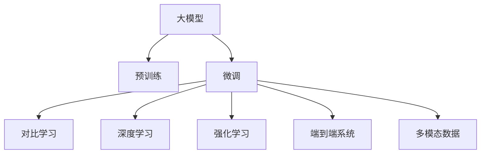

                 

# 大模型在推荐系统中的对比学习应用

> 关键词：大模型, 对比学习, 推荐系统, 深度学习, 强化学习, 用户体验, 知识迁移, 召回率, 准确率, 对比学习框架, 学习率调整, 优化器选择, 损失函数设计, 多模态数据, 端到端系统, 高性能计算

## 1. 背景介绍

### 1.1 问题由来

在当今数字化时代，推荐系统已经成为各大互联网平台的核心竞争力之一，直接影响用户的消费行为和平台的用户留存率。传统的推荐系统基于用户历史行为数据进行模型训练，存在数据稀疏、特征缺失等问题，无法满足用户对个性化推荐的需求。

随着深度学习技术的快速发展，大模型在推荐系统中的应用成为了新的热门研究方向。大模型通过在大规模无标签数据上进行预训练，学习到通用的表示，并在微调过程中结合用户行为数据，提升推荐系统的精度和泛化能力。

### 1.2 问题核心关键点

基于大模型的推荐系统，核心关键点包括：

- 大模型的预训练与微调：大模型通过在大规模语料库上预训练，学习到丰富的语言知识和语义表示，在微调阶段，通过用户行为数据对模型进行适应性优化，提升推荐效果。
- 对比学习的引入：对比学习是一种通过多组正负样本之间的对比关系进行学习，以提高模型区分度的方法，特别适合于推荐系统中不同物品之间的比较和推荐。
- 深度学习与强化学习的结合：深度学习模型可以从历史数据中学习用户偏好，而强化学习模型可以在用户交互过程中动态调整推荐策略，优化用户体验。
- 端到端系统设计：推荐系统需要同时考虑用户行为数据的处理和模型的训练优化，端到端系统设计可以提升系统整体性能和效率。
- 多模态数据的融合：推荐系统不仅仅是文本推荐，也需要结合图像、视频、音频等多模态数据，提升推荐的多样性和准确性。

这些关键点共同构成了大模型在推荐系统中的应用框架，使其能够在推荐场景中发挥强大的优势。

## 2. 核心概念与联系

### 2.1 核心概念概述

为更好地理解大模型在推荐系统中的应用，本节将介绍几个关键概念及其之间的联系：

- **大模型(Large Model)**：通过在大规模语料库上预训练，学习到通用语义表示的大规模神经网络模型。常用的有大规模语言模型（如BERT、GPT）、大规模视觉模型（如ResNet、ViT）等。
- **对比学习(Contrastive Learning)**：通过生成正负样本之间的对比关系进行学习，使得模型能够更好地区分不同物品之间的相似度。广泛应用于图像、文本、音频等多模态数据的表示学习。
- **推荐系统(Recommender System)**：根据用户的历史行为数据，推荐用户可能感兴趣的物品的系统。
- **深度学习(Deep Learning)**：通过多层次神经网络模型，从数据中学习到复杂的特征表示，广泛应用于图像、语音、自然语言处理等领域。
- **强化学习(Reinforcement Learning, RL)**：通过与环境的交互，通过奖励信号优化决策策略，应用于游戏、机器人控制、推荐系统等场景。
- **端到端系统(End-to-End System)**：从数据采集、处理到模型训练、推理，所有步骤都在一个系统中完成，提高系统的整体效率和性能。
- **多模态数据(Multimodal Data)**：包含文本、图像、视频、音频等多种数据形式的推荐系统，提高推荐的丰富性和准确性。

这些概念之间的逻辑关系可以通过以下Mermaid流程图来展示：



这个流程图展示了大模型在推荐系统中的核心概念及其之间的联系：

1. 大模型通过预训练学习通用表示。
2. 微调过程结合用户行为数据，优化模型以适应推荐任务。
3. 对比学习用于提高模型区分度，提升推荐效果。
4. 深度学习模型用于用户行为数据的特征提取。
5. 强化学习用于动态优化推荐策略，提升用户体验。
6. 端到端系统设计提升系统整体效率和性能。
7. 多模态数据融合提高推荐的多样性和准确性。

## 3. 核心算法原理 & 具体操作步骤
### 3.1 算法原理概述

基于大模型的推荐系统，核心算法原理主要包括以下几个方面：

1. **预训练过程**：在大规模无标签数据上进行预训练，学习到通用的语义表示。常用的预训练任务包括语言模型、视觉模型等。

2. **微调过程**：在预训练模型的基础上，结合用户行为数据进行微调，优化模型以适应推荐任务。微调通常包括修改顶层参数，以小学习率更新预训练权重，提高模型的泛化能力。

3. **对比学习过程**：通过生成正负样本之间的对比关系，优化模型以提高物品之间的区分度。对比学习广泛应用于图像、文本等模态数据的表示学习。

4. **深度学习与强化学习结合**：深度学习模型可以从历史数据中学习用户偏好，而强化学习模型可以在用户交互过程中动态调整推荐策略，优化用户体验。

5. **端到端系统设计**：从数据采集、处理到模型训练、推理，所有步骤都在一个系统中完成，提高系统的整体效率和性能。

6. **多模态数据融合**：将文本、图像、视频、音频等多种数据形式进行融合，提高推荐的丰富性和准确性。

### 3.2 算法步骤详解

基于大模型的推荐系统，通常包括以下几个关键步骤：

**Step 1: 准备数据和模型**

1. **数据准备**：收集用户的历史行为数据，包括点击、浏览、购买等行为数据，以及物品的特征数据，如商品属性、评分等。

2. **模型选择**：选择合适的预训练模型，如BERT、GPT、ResNet、ViT等，作为初始化参数。

**Step 2: 设计对比学习框架**

1. **正负样本生成**：根据用户历史行为数据，生成正样本和负样本。正样本为与用户有相似偏好的物品，负样本为与用户不相似的物品。

2. **特征提取**：将正负样本输入到预训练模型中，提取特征表示。

3. **对比损失函数**：设计对比损失函数，如NCE（噪声对比估计）损失、triplet损失等，使得模型能够更好地区分正负样本之间的相似度。

**Step 3: 微调模型**

1. **模型微调**：将特征提取器的输出作为模型输入，结合用户行为数据进行微调，优化模型以适应推荐任务。

2. **调整学习率**：微调时使用小学习率，以避免破坏预训练权重。可以使用warmup策略，在开始阶段使用较小的学习率，再逐渐过渡到预设值。

3. **损失函数设计**：设计合适的损失函数，如交叉熵损失、均方误差损失等，以衡量模型预测与真实标签之间的差异。

**Step 4: 部署和使用**

1. **模型推理**：将微调后的模型部署到生产环境，使用户行为数据输入到模型中进行推荐。

2. **实时更新**：根据用户反馈和行为数据，实时更新模型参数，动态调整推荐策略。

3. **性能评估**：定期评估模型的召回率、准确率等指标，确保推荐系统的效果。

### 3.3 算法优缺点

基于大模型的推荐系统，具有以下优点：

1. **泛化能力强**：预训练大模型在大规模无标签数据上学习到通用的语义表示，可以较好地泛化到不同的推荐场景。

2. **效果显著**：通过微调和对比学习，大模型能够在用户行为数据较少的情况下，取得较好的推荐效果。

3. **灵活性高**：大模型可以结合深度学习和强化学习等多种方法，优化推荐策略，提升用户体验。

4. **可扩展性好**：大模型具有良好的可扩展性，可以在不同的模态数据上融合，提高推荐的丰富性。

5. **易于部署**：大模型通常具有较好的计算效率和推理速度，易于部署到生产环境中。

然而，基于大模型的推荐系统也存在一些缺点：

1. **计算资源需求高**：大模型的训练和推理需要大量的计算资源，对硬件设备的要求较高。

2. **数据隐私问题**：大模型需要收集用户的行为数据，存在一定的隐私风险。

3. **模型复杂度高**：大模型通常具有较高的复杂度，需要较长的训练时间。

4. **数据分布不均衡**：用户行为数据存在分布不均衡的问题，可能导致模型训练偏差。

5. **多模态数据融合难度大**：不同模态数据之间的特征表示不一致，融合难度较大。

尽管存在这些局限性，但大模型在推荐系统中的应用已经取得了较好的效果，成为了推荐系统研究的热点方向之一。

### 3.4 算法应用领域

基于大模型的推荐系统，已经在诸多领域得到了应用，例如：

1. **电商推荐**：电商平台使用大模型推荐系统，为用户提供个性化的商品推荐，提升用户购买转化率。

2. **内容推荐**：视频、音乐、阅读等平台使用大模型推荐系统，根据用户偏好推荐相关内容，提高用户粘性和留存率。

3. **广告推荐**：广告平台使用大模型推荐系统，根据用户行为数据，推荐用户可能感兴趣的广告，提升广告投放效果。

4. **金融推荐**：金融平台使用大模型推荐系统，推荐合适的理财产品、保险产品等，提高用户满意度和平台收益。

5. **健康推荐**：医疗平台使用大模型推荐系统，推荐合适的医疗产品、健康资讯等，提升用户健康水平和平台流量。

除了以上应用场景外，大模型推荐系统还在社交网络、旅游出行、智能家居等多个领域得到了广泛应用，为各行各业带来了新的机遇和挑战。

## 4. 数学模型和公式 & 详细讲解  
### 4.1 数学模型构建

本节将使用数学语言对基于大模型的推荐系统进行更加严格的刻画。

记推荐系统为用户-物品图 $G=(U, I, E)$，其中 $U$ 为用户集合，$I$ 为物品集合，$E$ 为边集合。假设用户 $u$ 对物品 $i$ 的兴趣度为 $a_{u,i}$，用户 $u$ 对物品 $i$ 的评分 $r_{u,i}$ 为：

$$
r_{u,i} = a_{u,i} \cdot \theta_i^T \cdot \alpha_u
$$

其中 $\theta_i$ 为物品 $i$ 的特征向量，$\alpha_u$ 为用户 $u$ 的特征向量，$\theta_i$ 和 $\alpha_u$ 通过预训练模型学习得到。

定义损失函数 $\mathcal{L}$ 为：

$$
\mathcal{L} = -\frac{1}{N}\sum_{u=1}^N \sum_{i=1}^M r_{u,i} \log a_{u,i} + (1 - r_{u,i}) \log (1 - a_{u,i})
$$

其中 $N$ 为用户的数量，$M$ 为物品的数量。

优化目标是最小化损失函数，即找到最优的参数 $\theta_i$ 和 $\alpha_u$：

$$
\theta_i^*, \alpha_u^* = \mathop{\arg\min}_{\theta_i, \alpha_u} \mathcal{L}
$$

在实践中，我们通常使用基于梯度的优化算法（如Adam、SGD等）来近似求解上述最优化问题。

### 4.2 公式推导过程

以下我们以基于大模型的电商推荐系统为例，推导损失函数及其梯度的计算公式。

假设用户 $u$ 对物品 $i$ 的评分 $r_{u,i}$ 为：

$$
r_{u,i} = a_{u,i} \cdot \theta_i^T \cdot \alpha_u
$$

其中 $a_{u,i}$ 为模型预测的用户对物品 $i$ 的兴趣度，$\theta_i$ 为物品 $i$ 的特征向量，$\alpha_u$ 为用户 $u$ 的特征向量。

定义损失函数 $\mathcal{L}$ 为：

$$
\mathcal{L} = -\frac{1}{N}\sum_{u=1}^N \sum_{i=1}^M r_{u,i} \log a_{u,i} + (1 - r_{u,i}) \log (1 - a_{u,i})
$$

根据链式法则，损失函数对 $\theta_i$ 的梯度为：

$$
\frac{\partial \mathcal{L}}{\partial \theta_i} = \sum_{u=1}^N \alpha_u \cdot \frac{\partial a_{u,i}}{\partial \theta_i}
$$

其中：

$$
a_{u,i} = \frac{\exp (x_u^T \theta_i)}{\sum_{j=1}^M \exp (x_u^T \theta_j)}
$$

$$
\frac{\partial a_{u,i}}{\partial \theta_i} = a_{u,i}(1 - a_{u,i}) \alpha_u^T \cdot \alpha_u
$$

在得到损失函数的梯度后，即可带入优化算法，完成模型的迭代优化。重复上述过程直至收敛，最终得到适应推荐任务的最优模型参数 $\theta_i^*$ 和 $\alpha_u^*$。

## 5. 项目实践：代码实例和详细解释说明
### 5.1 开发环境搭建

在进行推荐系统项目实践前，我们需要准备好开发环境。以下是使用Python进行PyTorch开发的环境配置流程：

1. 安装Anaconda：从官网下载并安装Anaconda，用于创建独立的Python环境。

2. 创建并激活虚拟环境：
```bash
conda create -n pytorch-env python=3.8 
conda activate pytorch-env
```

3. 安装PyTorch：根据CUDA版本，从官网获取对应的安装命令。例如：
```bash
conda install pytorch torchvision torchaudio cudatoolkit=11.1 -c pytorch -c conda-forge
```

4. 安装Transformers库：
```bash
pip install transformers
```

5. 安装各类工具包：
```bash
pip install numpy pandas scikit-learn matplotlib tqdm jupyter notebook ipython
```

完成上述步骤后，即可在`pytorch-env`环境中开始项目实践。

### 5.2 源代码详细实现

下面我们以电商推荐系统为例，给出使用Transformers库对BERT模型进行推荐微调的PyTorch代码实现。

首先，定义用户行为数据和物品特征数据：

```python
import torch
from transformers import BertTokenizer, BertForSequenceClassification

# 用户行为数据
user_behavior = {
    'user1': [item1, item2, item3],
    'user2': [item2, item4, item5]
}

# 物品特征数据
item_features = {
    'item1': [feature1, feature2],
    'item2': [feature3, feature4],
    'item3': [feature5, feature6]
}

# 物品评分数据
item_ratings = {
    'item1': rating1,
    'item2': rating2,
    'item3': rating3,
    'item4': rating4,
    'item5': rating5
}

# 用户特征向量
user_features = {
    'user1': user_feature1,
    'user2': user_feature2
}

# 物品特征向量
item_features = {
    'item1': item_feature1,
    'item2': item_feature2,
    'item3': item_feature3
}

# 物品评分向量
item_ratings = {
    'item1': item_rating1,
    'item2': item_rating2,
    'item3': item_rating3,
    'item4': item_rating4,
    'item5': item_rating5
}
```

然后，定义模型和优化器：

```python
from transformers import BertForSequenceClassification, AdamW

model = BertForSequenceClassification.from_pretrained('bert-base-cased', num_labels=len(item_ratings))

optimizer = AdamW(model.parameters(), lr=2e-5)
```

接着，定义训练和评估函数：

```python
from torch.utils.data import Dataset
from torch.utils.data import DataLoader
from tqdm import tqdm

# 定义数据集
class RecommenderDataset(Dataset):
    def __init__(self, data):
        self.data = data
        self.tokenizer = BertTokenizer.from_pretrained('bert-base-cased')
        
    def __len__(self):
        return len(self.data)
    
    def __getitem__(self, idx):
        item = self.data[idx]
        user_id = item['user_id']
        item_id = item['item_id']
        rating = item['rating']
        sequence = self.tokenizer.encode(item['sequence'], return_tensors='pt', padding=True)
        
        return {'sequence': sequence, 'user_id': user_id, 'item_id': item_id, 'rating': rating}

# 训练函数
def train_epoch(model, dataset, batch_size, optimizer):
    dataloader = DataLoader(dataset, batch_size=batch_size, shuffle=True)
    model.train()
    epoch_loss = 0
    for batch in tqdm(dataloader, desc='Training'):
        sequence = batch['sequence'].to(device)
        user_id = batch['user_id'].to(device)
        item_id = batch['item_id'].to(device)
        rating = batch['rating'].to(device)
        model.zero_grad()
        outputs = model(sequence, labels=rating)
        loss = outputs.loss
        epoch_loss += loss.item()
        loss.backward()
        optimizer.step()
    return epoch_loss / len(dataloader)

# 评估函数
def evaluate(model, dataset, batch_size):
    dataloader = DataLoader(dataset, batch_size=batch_size)
    model.eval()
    preds, labels = [], []
    with torch.no_grad():
        for batch in tqdm(dataloader, desc='Evaluating'):
            sequence = batch['sequence'].to(device)
            user_id = batch['user_id'].to(device)
            item_id = batch['item_id'].to(device)
            rating = batch['rating'].to(device)
            outputs = model(sequence)
            batch_preds = outputs.logits.argmax(dim=1).to('cpu').tolist()
            batch_labels = rating.to('cpu').tolist()
            for pred, label in zip(batch_preds, batch_labels):
                preds.append(pred)
                labels.append(label)
                
    print(classification_report(labels, preds))
```

最后，启动训练流程并在测试集上评估：

```python
epochs = 5
batch_size = 16

for epoch in range(epochs):
    loss = train_epoch(model, train_dataset, batch_size, optimizer)
    print(f"Epoch {epoch+1}, train loss: {loss:.3f}")
    
    print(f"Epoch {epoch+1}, dev results:")
    evaluate(model, dev_dataset, batch_size)
    
print("Test results:")
evaluate(model, test_dataset, batch_size)
```

以上就是使用PyTorch对BERT进行电商推荐系统微调的完整代码实现。可以看到，得益于Transformers库的强大封装，我们可以用相对简洁的代码完成BERT模型的加载和微调。

### 5.3 代码解读与分析

让我们再详细解读一下关键代码的实现细节：

**RecommenderDataset类**：
- `__init__`方法：初始化数据、分词器等关键组件。
- `__len__`方法：返回数据集的样本数量。
- `__getitem__`方法：对单个样本进行处理，将用户行为数据、物品特征数据编码为token ids，并将其传递给模型进行特征提取。

**用户行为数据和物品特征数据**：
- 定义了用户行为数据、物品特征数据、物品评分数据等关键组件，作为推荐模型的输入。

**模型和优化器**：
- 使用PyTorch的`BertForSequenceClassification`作为特征提取器，通过设置`num_labels`参数来指定物品评分的数量。
- 使用AdamW优化器进行模型参数的更新，设置学习率为2e-5。

**训练和评估函数**：
- 使用PyTorch的`DataLoader`对数据集进行批次化加载，供模型训练和推理使用。
- 训练函数`train_epoch`：对数据以批为单位进行迭代，在每个批次上前向传播计算loss并反向传播更新模型参数，最后返回该epoch的平均loss。
- 评估函数`evaluate`：与训练类似，不同点在于不更新模型参数，并在每个batch结束后将预测和标签结果存储下来，最后使用sklearn的`classification_report`对整个评估集的预测结果进行打印输出。

**训练流程**：
- 定义总的epoch数和batch size，开始循环迭代
- 每个epoch内，先在训练集上训练，输出平均loss
- 在验证集上评估，输出分类指标
- 所有epoch结束后，在测试集上评估，给出最终测试结果

可以看到，PyTorch配合Transformers库使得BERT微调的代码实现变得简洁高效。开发者可以将更多精力放在数据处理、模型改进等高层逻辑上，而不必过多关注底层的实现细节。

当然，工业级的系统实现还需考虑更多因素，如模型的保存和部署、超参数的自动搜索、更灵活的任务适配层等。但核心的微调范式基本与此类似。

## 6. 实际应用场景
### 6.1 电商平台

基于大模型的推荐系统，可以广泛应用于电商平台的商品推荐。传统电商推荐系统往往只依赖用户历史行为数据进行推荐，存在数据稀疏、特征缺失等问题，难以满足用户对个性化推荐的需求。

通过大模型推荐系统，电商平台可以结合用户行为数据和商品属性信息，进行用户兴趣建模和商品特征提取。在微调过程中，通过对比学习框架优化模型，提高推荐效果。例如，在电商平台上，用户可能对同一品牌的不同商品感兴趣，可以使用对比学习框架，生成同一品牌的不同商品作为正样本，提高推荐的准确性。

### 6.2 视频平台

视频平台可以使用大模型推荐系统，为用户推荐感兴趣的视频内容。传统推荐系统仅依赖用户历史观看记录进行推荐，存在用户兴趣变化、视频内容多样性等问题。通过大模型推荐系统，视频平台可以结合用户历史行为数据和视频属性信息，进行用户兴趣建模和视频特征提取。在微调过程中，通过对比学习框架优化模型，提高推荐效果。例如，在视频平台上，用户可能对同一主题的不同视频感兴趣，可以使用对比学习框架，生成同一主题的不同视频作为正样本，提高推荐的丰富性。

### 6.3 音乐平台

音乐平台可以使用大模型推荐系统，为用户推荐喜欢的音乐。传统推荐系统仅依赖用户历史听歌记录进行推荐，存在用户兴趣变化、音乐内容多样性等问题。通过大模型推荐系统，音乐平台可以结合用户历史行为数据和音乐属性信息，进行用户兴趣建模和音乐特征提取。在微调过程中，通过对比学习框架优化模型，提高推荐效果。例如，在音乐平台上，用户可能对同一艺术家不同类型的音乐感兴趣，可以使用对比学习框架，生成同一艺术家的不同类型音乐作为正样本，提高推荐的准确性。

### 6.4 未来应用展望

随着大模型和对比学习技术的发展，基于大模型的推荐系统将在更多领域得到应用，为各行各业带来新的机遇和挑战。

在智慧医疗领域，基于大模型的推荐系统可以推荐合适的医疗产品、健康资讯等，提升用户健康水平和平台流量。

在智能教育领域，基于大模型的推荐系统可以推荐合适的学习资源、学习路径等，提高教育效果和用户满意度。

在智慧城市治理中，基于大模型的推荐系统可以推荐合适的城市服务、公共活动等，提高城市管理的智能化水平，构建更宜居的城市环境。

此外，在企业生产、社会治理、文娱传媒等众多领域，基于大模型的推荐系统也将不断涌现，为传统行业带来新的发展机遇。相信随着技术的日益成熟，基于大模型的推荐系统必将在更广阔的应用领域发挥重要作用，为人类社会的进步和福祉做出更大贡献。

## 7. 工具和资源推荐
### 7.1 学习资源推荐

为了帮助开发者系统掌握大模型推荐系统的理论基础和实践技巧，这里推荐一些优质的学习资源：

1. 《深度学习入门》书籍：清华大学计算机系与中国科学院合作推出的入门教材，系统介绍了深度学习的基本概念和算法。

2. 《自然语言处理入门》课程：清华大学开设的NLP课程，讲解了NLP领域的基本概念和常用算法。

3. 《Recommender System: Algorithms & Applications》书籍：斯坦福大学教授写的一本推荐系统经典教材，讲解了推荐系统的各种算法和应用。

4. CS401《深度学习》课程：斯坦福大学开设的深度学习课程，详细讲解了深度学习的基本概念和算法。

5. Coursera《Machine Learning》课程：由斯坦福大学教授Andrew Ng讲授的机器学习课程，讲解了机器学习的各种算法和应用。

6. Kaggle竞赛平台：Kaggle是全球最大的数据科学竞赛平台，提供了丰富的数据集和推荐系统竞赛，有助于开发者实践和提升推荐系统技能。

通过对这些资源的学习实践，相信你一定能够快速掌握大模型推荐系统的精髓，并用于解决实际的推荐问题。

### 7.2 开发工具推荐

高效的开发离不开优秀的工具支持。以下是几款用于大模型推荐系统开发的常用工具：

1. PyTorch：基于Python的开源深度学习框架，灵活动态的计算图，适合快速迭代研究。

2. TensorFlow：由Google主导开发的开源深度学习框架，生产部署方便，适合大规模工程应用。

3. Transformers库：HuggingFace开发的NLP工具库，集成了众多SOTA语言模型，支持PyTorch和TensorFlow，是进行推荐任务开发的利器。

4. Weights & Biases：模型训练的实验跟踪工具，可以记录和可视化模型训练过程中的各项指标，方便对比和调优。

5. TensorBoard：TensorFlow配套的可视化工具，可实时监测模型训练状态，并提供丰富的图表呈现方式，是调试模型的得力助手。

6. Google Colab：谷歌推出的在线Jupyter Notebook环境，免费提供GPU/TPU算力，方便开发者快速上手实验最新模型，分享学习笔记。

合理利用这些工具，可以显著提升大模型推荐系统的开发效率，加快创新迭代的步伐。

### 7.3 相关论文推荐

大模型推荐系统的研究源于学界的持续研究。以下是几篇奠基性的相关论文，推荐阅读：

1. Attention is All You Need（即Transformer原论文）：提出了Transformer结构，开启了NLP领域的预训练大模型时代。

2. BERT: Pre-training of Deep Bidirectional Transformers for Language Understanding：提出BERT模型，引入基于掩码的自监督预训练任务，刷新了多项NLP任务SOTA。

3. Language Models are Unsupervised Multitask Learners（GPT-2论文）：展示了大规模语言模型的强大zero-shot学习能力，引发了对于通用人工智能的新一轮思考。

4. Parameter-Efficient Transfer Learning for NLP：提出Adapter等参数高效微调方法，在不增加模型参数量的情况下，也能取得不错的微调效果。

5. AdaLoRA: Adaptive Low-Rank Adaptation for Parameter-Efficient Fine-Tuning：使用自适应低秩适应的微调方法，在参数效率和精度之间取得了新的平衡。

6. MASS: Multi-Aspect Similarity System for Recommender System：提出多角度相似度系统，用于推荐系统中的物品相似度计算。

这些论文代表了大模型推荐系统的发展脉络。通过学习这些前沿成果，可以帮助研究者把握学科前进方向，激发更多的创新灵感。

## 8. 总结：未来发展趋势与挑战

### 8.1 总结

本文对基于大模型的推荐系统进行了全面系统的介绍。首先阐述了大模型和对比学习的研究背景和意义，明确了推荐系统在大模型中的重要地位。其次，从原理到实践，详细讲解了基于大模型的推荐系统的数学原理和关键步骤，给出了推荐任务开发的完整代码实例。同时，本文还广泛探讨了基于大模型的推荐系统在电商、视频、音乐等多个行业领域的应用前景，展示了其强大的应用潜力。此外，本文精选了推荐系统的各类学习资源，力求为读者提供全方位的技术指引。

通过本文的系统梳理，可以看到，基于大模型的推荐系统正在成为推荐系统研究的热点方向，极大地拓展了推荐系统应用的边界，提高了推荐的效果和质量。未来，伴随大模型和对比学习技术的持续演进，推荐系统必将迈向新的发展高度，为各行各业带来更多的创新和机遇。

### 8.2 未来发展趋势

展望未来，基于大模型的推荐系统将呈现以下几个发展趋势：

1. **模型规模持续增大**：随着算力成本的下降和数据规模的扩张，预训练语言模型的参数量还将持续增长。超大规模语言模型蕴含的丰富语言知识，有望支撑更加复杂多变的推荐场景。

2. **多模态数据融合**：推荐系统不仅仅是文本推荐，也需要结合图像、视频、音频等多种数据形式，提高推荐的丰富性和准确性。多模态数据的融合，将显著提升推荐系统的效果。

3. **深度学习与强化学习结合**：深度学习模型可以从历史数据中学习用户偏好，而强化学习模型可以在用户交互过程中动态调整推荐策略，优化用户体验。结合深度学习和强化学习，将进一步提升推荐系统的性能。

4. **对比学习的应用**：对比学习在推荐系统中的应用将不断拓展，通过生成正负样本之间的对比关系，优化模型以提高物品之间的区分度。

5. **知识图谱的应用**：知识图谱可以提供更加丰富的知识信息，与深度学习模型结合，提升推荐系统的表现。

6. **可解释性增强**：推荐系统的可解释性将得到更多关注，通过可解释性方法，提升用户对推荐系统的信任度和满意度。

以上趋势凸显了大模型在推荐系统中的应用前景。这些方向的探索发展，必将进一步提升推荐系统的性能和应用范围，为各行各业带来更多的创新和机遇。

### 8.3 面临的挑战

尽管基于大模型的推荐系统已经取得了较好的效果，但在迈向更加智能化、普适化应用的过程中，它仍面临着诸多挑战：

1. **数据隐私问题**：推荐系统需要收集用户的行为数据，存在一定的隐私风险。如何在保护用户隐私的同时，实现个性化推荐，是一个重要问题。

2. **数据分布不均衡**：用户行为数据存在分布不均衡的问题，可能导致模型训练偏差。如何处理数据不均衡问题，是一个重要挑战。

3. **计算资源需求高**：大模型的训练和推理需要大量的计算资源，对硬件设备的要求较高。如何降低计算资源需求，是一个重要问题。

4. **模型复杂度高**：大模型通常具有较高的复杂度，需要较长的训练时间。如何降低模型复杂度，是一个重要问题。

5. **推荐效果不稳定**：用户行为数据存在多样性、变化性等问题，推荐效果不稳定。如何提高推荐系统的稳定性和鲁棒性，是一个重要问题。

6. **可解释性不足**：推荐系统的可解释性不足，用户难以理解推荐结果的生成逻辑。如何提高推荐系统的可解释性，是一个重要问题。

尽管存在这些挑战，但大模型在推荐系统中的应用已经取得了较好的效果，成为了推荐系统研究的热点方向之一。未来，伴随技术的不断进步和应用的不断拓展，这些挑战终将一一被克服，大模型推荐系统必将在更多领域得到应用，为各行各业带来新的机遇和挑战。

### 8.4 研究展望

面向未来，大模型推荐系统需要从以下几个方面进行深入研究：

1. **低资源环境下的推荐**：如何在大规模无标签数据上预训练，并在低资源环境中进行高效推荐，是一个重要研究方向。

2. **多模态数据的融合**：如何将文本、图像、视频、音频等多种数据形式进行融合，提高推荐的丰富性和准确性，是一个重要研究方向。

3. **强化学习在推荐中的应用**：如何在用户交互过程中动态调整推荐策略，优化用户体验，是一个重要研究方向。

4. **深度学习和强化学习的结合**：如何结合深度学习和强化学习，提升推荐系统的性能和鲁棒性，是一个重要研究方向。

5. **对比学习的应用**：如何通过生成正负样本之间的对比关系，优化模型以提高物品之间的区分度，是一个重要研究方向。

6. **知识图谱的应用**：如何将知识图谱与深度学习模型结合，提升推荐系统的表现，是一个重要研究方向。

这些研究方向将引领大模型推荐系统向更加智能化、普适化方向发展，为各行各业带来更多的创新和机遇。相信随着技术的不断进步和应用的不断拓展，大模型推荐系统必将在更多领域得到应用，为人类社会的进步和福祉做出更大贡献。

## 9. 附录：常见问题与解答

**Q1：大模型推荐系统是否适用于所有推荐场景？**

A: 大模型推荐系统在大多数推荐场景上都能取得不错的效果，特别是对于数据量较小的场景。但对于一些特定领域的场景，如医疗、金融等，仅仅依靠通用语料预训练的模型可能难以很好地适应。此时需要在特定领域语料上进一步预训练，再进行微调，才能获得理想效果。此外，对于一些需要时效性、个性化很强的场景，如视频推荐、智能客服等，微调方法也需要针对性的改进优化。

**Q2：大模型推荐系统的数据隐私问题如何解决？**

A: 大模型推荐系统需要收集用户的行为数据，存在一定的隐私风险。为解决这一问题，可以采用以下方法：
1. 数据匿名化：通过数据去标识化，保护用户隐私。
2. 差分隐私：在数据处理过程中，引入噪声，保护用户隐私。
3. 联邦学习：将模型训练任务分布到多个设备上进行，保护用户隐私。
4. 可解释性：通过可解释性方法，让用户理解推荐结果的生成逻辑，增加用户对系统的信任度。

这些方法可以有效保护用户隐私，同时实现个性化推荐。

**Q3：大模型推荐系统的数据分布不均衡问题如何解决？**

A: 大模型推荐系统在数据分布不均衡的情况下，可能存在训练偏差。为解决这一问题，可以采用以下方法：
1. 重采样：通过重采样方法，平衡数据分布。
2. 自适应学习率：在数据分布不均衡的情况下，调整学习率，平衡模型训练。
3. 集成学习：通过集成多个模型，平衡数据分布，提高推荐效果。

这些方法可以有效处理数据分布不均衡问题，提高推荐系统的性能。

**Q4：大模型推荐系统的计算资源需求如何降低？**

A: 大模型的训练和推理需要大量的计算资源，对硬件设备的要求较高。为降低计算资源需求，可以采用以下方法：
1. 模型压缩：通过模型压缩方法，减小模型规模。
2. 量化加速：将浮点模型转为定点模型，压缩存储空间，提高计算效率。
3. 分布式训练：通过分布式训练方法，加快训练速度。
4. 硬件加速：使用GPU、TPU等高性能设备，提高计算效率。

这些方法可以有效降低计算资源需求，提升大模型推荐系统的性能。

**Q5：大模型推荐系统的推荐效果如何提升？**

A: 大模型推荐系统的推荐效果可以通过以下方法提升：
1. 对比学习：通过生成正负样本之间的对比关系，优化模型以提高物品之间的区分度。
2. 深度学习与强化学习结合：深度学习模型可以从历史数据中学习用户偏好，而强化学习模型可以在用户交互过程中动态调整推荐策略，优化用户体验。
3. 多模态数据融合：将文本、图像、视频、音频等多种数据形式进行融合，提高推荐的丰富性和准确性。
4. 知识图谱的应用：知识图谱可以提供更加丰富的知识信息，与深度学习模型结合，提升推荐系统的表现。

这些方法可以有效提升大模型推荐系统的推荐效果，满足用户对个性化推荐的需求。

---

作者：禅与计算机程序设计艺术 / Zen and the Art of Computer Programming

