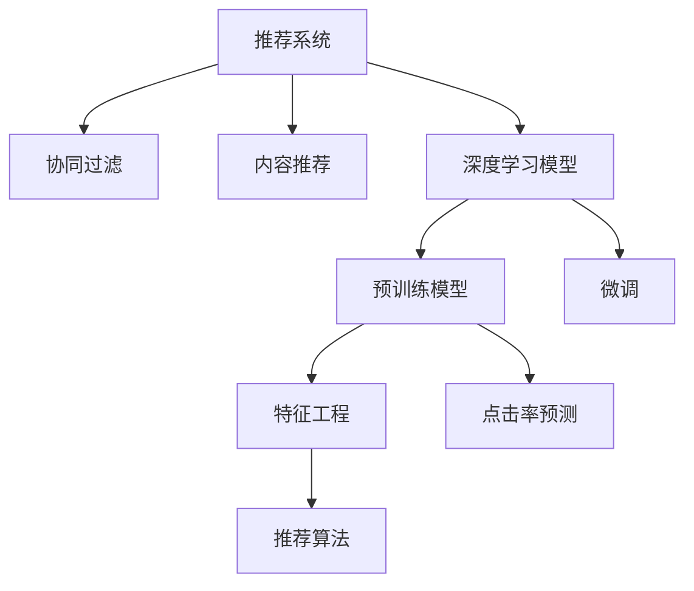

                 

# 大模型在推荐系统中的应用：潜力与挑战

> 关键词：大模型,推荐系统,推荐算法,深度学习,协同过滤,内容推荐,点击率预测

## 1. 背景介绍

### 1.1 问题由来
推荐系统(Recommender System)是互联网时代的重要应用之一，旨在帮助用户发现感兴趣的内容。传统的推荐方法主要依赖基于协同过滤、内容推荐等简单算法，难以充分挖掘用户行为和物品特征的复杂关系，推荐效果有限。近年来，深度学习技术迅猛发展，基于神经网络的大模型在推荐系统中逐渐成为新的主流范式。大模型凭借其强大的特征学习能力和表达能力，显著提升了推荐系统的表现，推动了个性化推荐技术的发展。

### 1.2 问题核心关键点
大模型在推荐系统中的应用，主要依赖于以下几个关键点：

- 特征学习能力强：大模型可以自动提取数据中的高阶特征，有效捕捉用户和物品间的复杂关联。
- 可解释性高：通过可解释性增强的深度模型，可以更好地理解推荐逻辑，提升推荐系统的可信任度。
- 跨领域迁移能力强：大模型通过预训练可以学习到通用的知识表示，适用于不同领域和场景下的推荐任务。
- 可扩展性强：大模型的庞大参数量和强大的表达能力，可以应对大规模、高维度的数据特征。
- 适应性强：大模型可以在不同用户偏好和行为模式中保持稳定性能，适应多变的推荐场景。

这些关键点使得大模型在推荐系统中展现出巨大的应用潜力。但与此同时，其也面临着显著的挑战，如计算资源消耗、模型参数爆炸、泛化能力等，需要在实际应用中进一步探索和优化。

### 1.3 问题研究意义
研究大模型在推荐系统中的应用，对推动个性化推荐技术的发展、优化用户体验、加速内容变现具有重要意义：

1. 提升推荐效果：通过深度学习大模型的特征学习能力，推荐系统能够更加精准地匹配用户需求，提高点击率和转化率。
2. 个性化推荐：大模型可以分析用户的历史行为和兴趣特征，提供更个性化的内容推荐，满足用户的个性化需求。
3. 提升用户满意度：个性化的推荐内容能够增加用户黏性，提高用户满意度和忠诚度，进而提升商业价值。
4. 优化决策流程：深度学习模型通过机器学习自动决策，减轻人工干预，提升推荐效率和质量。
5. 降低运营成本：自动化推荐算法可以大幅降低推荐系统的运营成本，特别是在高流量的场景中。

综上所述，大模型在推荐系统中的应用，是大数据、深度学习与用户行为分析技术结合的产物，具有显著的应用价值和广阔的发展前景。

## 2. 核心概念与联系

### 2.1 核心概念概述

为更好地理解大模型在推荐系统中的应用，本节将介绍几个密切相关的核心概念：

- 推荐系统(Recommender System)：通过算法和模型，向用户推荐其可能感兴趣的内容或产品，涵盖个性化推荐、协同过滤、深度学习等多种技术。

- 协同过滤(Collaborative Filtering)：通过分析用户的历史行为数据，推荐系统能够推测用户可能感兴趣的内容。主要包括用户间协同过滤和物品间协同过滤。

- 内容推荐(Content-Based Recommendation)：基于物品的属性特征，通过相似度匹配推荐系统推荐相似物品。

- 深度学习模型(Deep Learning Model)：基于多层神经网络的模型，可以处理高维、非线性的数据，具有强大的特征学习和表达能力。

- 预训练模型(Pre-trained Model)：在大规模无标签数据上进行自监督预训练，学习到通用的语言或特征表示，进而应用于推荐任务。

- 微调(Fine-tuning)：在预训练模型的基础上，使用特定领域的标注数据进行有监督学习，优化模型在推荐任务上的性能。

- 特征工程(Feature Engineering)：通过手工特征提取和预处理，提高模型的输入数据质量，增强推荐效果。

- 点击率预测(Click-through Rate Prediction)：预测用户对推荐物品的点击概率，评估推荐系统的效果。

这些核心概念之间的逻辑关系可以通过以下Mermaid流程图来展示：



这个流程图展示了大模型在推荐系统中的应用核心概念及其之间的关系：

1. 推荐系统利用多种技术，包括协同过滤、内容推荐和深度学习模型，进行推荐。
2. 深度学习模型中，预训练模型通过自监督任务进行特征学习，微调模型通过标注数据进行特定任务优化。
3. 特征工程通过手工提取和预处理，提升模型输入数据质量。
4. 点击率预测用于评估推荐系统的效果，反馈优化模型的性能。

这些概念共同构成了推荐系统的技术框架，使得大模型在推荐场景中得到广泛应用。通过理解这些核心概念，我们可以更好地把握大模型在推荐系统中的工作原理和优化方向。

## 3. 核心算法原理 & 具体操作步骤
### 3.1 算法原理概述

大模型在推荐系统中的应用，主要基于深度学习模型的特征学习和表达能力。其核心思想是通过预训练和微调，使模型学习到用户和物品间的复杂关系，进而根据用户的兴趣和行为预测其可能感兴趣的物品。

形式化地，假设推荐系统中的用户集合为 $U$，物品集合为 $I$，用户行为数据为 $D=\{(u,v,r)\}_{(u,v) \in D}$，其中 $u \in U, v \in I, r \in \{0,1\}$。目标是通过预训练和微调过程，构建推荐模型 $M_{\theta}$，使得 $M_{\theta}(u,v)$ 近似于 $r$。

预训练过程通常使用大规模无标签数据，通过自监督学习任务训练模型，学习通用的语言或特征表示。微调过程则使用用户和物品的交互数据，有监督地训练模型，使其适配特定领域的推荐任务。具体而言，微调过程可以采用以下两种方式：

1. 全参数微调(Full Parameter Fine-Tuning, FPFT)：冻结预训练模型的参数，只更新模型顶层和任务相关的参数。
2. 参数高效微调(Parameter-Efficient Fine-Tuning, PEFT)：仅更新少部分预训练参数，保持大部分参数不变，降低微调过程中的计算资源消耗。

### 3.2 算法步骤详解

大模型在推荐系统中的应用，一般包括以下几个关键步骤：

**Step 1: 准备数据集和预训练模型**
- 收集推荐系统的训练数据 $D=\{(u,v,r)\}_{(u,v) \in D}$，其中 $u$ 为用户的ID，$v$ 为物品的ID，$r$ 为行为标记。
- 选择合适的预训练模型 $M_{\theta}$ 作为初始化参数，如BERT、GPT等。

**Step 2: 构建特征向量**
- 使用预训练模型对用户和物品进行编码，生成用户特征向量 $u_{emb}$ 和物品特征向量 $v_{emb}$。
- 对于全参数微调，只对顶层和任务相关的参数进行微调，其他参数保持不变。

**Step 3: 设计推荐算法**
- 根据推荐任务，设计合适的推荐算法，如基于排序的推荐、基于置信度的推荐等。
- 在推荐算法中，通常需要计算用户和物品之间的相似度或相关性。

**Step 4: 微调模型**
- 使用用户和物品的交互数据，对微调后的推荐模型 $M_{\hat{\theta}}$ 进行有监督学习。
- 通过优化算法（如AdamW、SGD等）更新模型参数，最小化预测点击率与真实点击率的差距。

**Step 5: 评估和优化**
- 在测试集上评估推荐模型的性能，使用点击率预测等指标进行评估。
- 根据评估结果，调整模型参数，优化推荐效果。

### 3.3 算法优缺点

大模型在推荐系统中的应用，具有以下优点：

- 特征学习能力强：大模型可以自动提取高阶特征，捕捉用户和物品间的复杂关系。
- 可解释性高：深度学习模型的特征可视化方法，可以揭示推荐模型的内部工作机制和决策逻辑。
- 跨领域迁移能力强：预训练模型可以学习到通用的知识表示，适应不同领域和场景的推荐任务。
- 可扩展性强：大模型的庞大参数量和强大的表达能力，可以应对大规模、高维度的数据特征。
- 适应性强：大模型可以在不同用户偏好和行为模式中保持稳定性能，适应多变的推荐场景。

同时，该方法也存在一些局限性：

- 计算资源消耗高：大模型的参数量较大，需要强大的计算资源进行训练和推理。
- 模型复杂度高：大模型的结构复杂，难以理解其内部工作机制和决策逻辑。
- 泛化能力有限：大模型在特定领域的泛化能力有限，可能存在数据过拟合的问题。
- 可解释性不足：深度学习模型的决策过程缺乏可解释性，难以进行解释和调试。

尽管存在这些局限性，但就目前而言，大模型在推荐系统中的应用仍然是最主流范式。未来相关研究的重点在于如何进一步降低大模型的计算资源消耗，提高模型的泛化能力，同时兼顾可解释性和伦理安全性等因素。

### 3.4 算法应用领域

大模型在推荐系统中的应用，已经广泛应用于各类垂直领域，包括但不限于以下方面：

- 电商推荐：利用大模型对用户行为和商品特征进行建模，推荐商品给用户。
- 内容推荐：基于大模型对用户兴趣和内容特征进行分析，推荐相关内容给用户。
- 广告推荐：通过大模型对广告与用户兴趣的相关性进行评估，推荐广告给目标用户。
- 社交推荐：利用大模型对用户社交网络进行建模，推荐用户可能感兴趣的人或内容。
- 个性化推荐：根据用户的历史行为和兴趣特征，利用大模型提供个性化的推荐服务。

除了上述这些经典领域外，大模型在推荐系统中的应用还在不断拓展，如面向自然语言处理的文本推荐、面向图像的视觉推荐等，为推荐技术带来了新的突破。随着预训练模型和微调方法的不断进步，相信大模型推荐技术将在更多场景中得到应用，为各行业的数字化转型提供新的动力。

## 4. 数学模型和公式 & 详细讲解 & 举例说明
### 4.1 数学模型构建

本节将使用数学语言对大模型在推荐系统中的应用进行更加严格的刻画。

记推荐系统中的用户集合为 $U$，物品集合为 $I$，用户行为数据为 $D=\{(u,v,r)\}_{(u,v) \in D}$，其中 $u \in U, v \in I, r \in \{0,1\}$。目标是通过预训练和微调过程，构建推荐模型 $M_{\theta}$，使得 $M_{\theta}(u,v)$ 近似于 $r$。

设用户特征向量为 $u_{emb} \in \mathbb{R}^d$，物品特征向量为 $v_{emb} \in \mathbb{R}^d$，推荐模型的预测概率为 $p(u,v)$。

**推荐模型的构建**：

1. 用户特征编码：将用户 $u$ 的ID编码为特征向量 $u_{emb}$，通常使用预训练模型进行编码。
2. 物品特征编码：将物品 $v$ 的ID编码为特征向量 $v_{emb}$，同样使用预训练模型进行编码。
3. 推荐模型预测：利用用户和物品的特征向量，计算预测概率 $p(u,v)$。

**推荐模型的微调**：

设 $M_{\theta}(u,v)$ 为推荐模型的预测概率，目标是最小化预测概率与真实点击率 $r$ 的差距，即：

$$
\min_{\theta} \mathcal{L}(\theta) = \sum_{(u,v,r) \in D} \log(1 + \exp(-M_{\theta}(u,v) * r))
$$

其中 $\mathcal{L}$ 为交叉熵损失函数，$M_{\theta}(u,v)$ 为推荐模型的预测概率。

### 4.2 公式推导过程

以下我们以点击率预测任务为例，推导推荐模型的预测概率公式及其梯度的计算。

假设用户 $u$ 的物品集合为 $I$，物品 $v$ 的特征向量为 $v_{emb}$，用户 $u$ 的物品集合为 $I_u$。假设 $M_{\theta}(u,v)$ 为推荐模型的预测概率，则点击率预测任务的目标是最小化预测概率与真实点击率 $r$ 的差距，即：

$$
\min_{\theta} \mathcal{L}(\theta) = \sum_{(u,v,r) \in D} \log(1 + \exp(-M_{\theta}(u,v) * r))
$$

根据链式法则，推荐模型的预测概率 $M_{\theta}(u,v)$ 可以表示为：

$$
M_{\theta}(u,v) = \text{softmax}(\theta^T[\text{encoder}(u) \odot \text{encoder}(v)])
$$

其中 $\theta$ 为模型参数，$\text{encoder}$ 为预训练模型的编码器部分，$\odot$ 表示逐元素相乘。

根据上述公式，点击率预测任务的损失函数可以表示为：

$$
\mathcal{L}(\theta) = -\frac{1}{N} \sum_{(u,v,r) \in D} [r \cdot \log(1 + \exp(-M_{\theta}(u,v))) + (1-r) \cdot \log(1 + \exp(M_{\theta}(u,v))))
$$

通过反向传播算法，求出推荐模型的参数 $\theta$ 的梯度，用于优化模型的预测概率。

在得到损失函数的梯度后，即可带入优化算法（如AdamW、SGD等），更新模型参数，使得预测概率与真实点击率的差距最小化，从而提升模型的推荐效果。

### 4.3 案例分析与讲解

假设一个在线电商推荐系统，收集用户对商品的点击和购买数据。在预训练阶段，使用BERT模型对用户和商品进行编码，生成用户特征向量 $u_{emb}$ 和商品特征向量 $v_{emb}$。在微调阶段，利用点击和购买数据，对微调后的推荐模型 $M_{\hat{\theta}}$ 进行有监督学习。具体而言，微调过程如下：

1. 收集用户对商品的点击和购买数据，构建训练集 $D=\{(u,v,r)\}_{(u,v) \in D}$。
2. 使用预训练的BERT模型对用户和商品进行编码，生成用户特征向量 $u_{emb}$ 和商品特征向量 $v_{emb}$。
3. 构建推荐模型 $M_{\theta}(u,v)$，通常使用深度学习模型（如MLP）计算预测概率。
4. 在训练集上使用交叉熵损失函数，最小化预测概率与真实点击率的差距。
5. 在测试集上评估微调后的推荐模型的性能，使用点击率预测等指标进行评估。

通过上述步骤，即可利用大模型在电商推荐系统中进行个性化推荐。需要注意的是，在实际应用中，还需要考虑模型的计算资源消耗、模型的可解释性、模型的泛化能力等诸多因素，进行综合优化。

## 5. 项目实践：代码实例和详细解释说明
### 5.1 开发环境搭建

在进行推荐系统开发前，我们需要准备好开发环境。以下是使用Python进行PyTorch开发的环境配置流程：

1. 安装Anaconda：从官网下载并安装Anaconda，用于创建独立的Python环境。

2. 创建并激活虚拟环境：
```bash
conda create -n pytorch-env python=3.8 
conda activate pytorch-env
```

3. 安装PyTorch：根据CUDA版本，从官网获取对应的安装命令。例如：
```bash
conda install pytorch torchvision torchaudio cudatoolkit=11.1 -c pytorch -c conda-forge
```

4. 安装TensorFlow：
```bash
pip install tensorflow
```

5. 安装TensorBoard：
```bash
pip install tensorboard
```

6. 安装PyTorch Lightning：
```bash
pip install pytorch-lightning
```

7. 安装Scikit-learn和Pandas：
```bash
pip install scikit-learn pandas
```

完成上述步骤后，即可在`pytorch-env`环境中开始推荐系统开发。

### 5.2 源代码详细实现

这里我们以电商推荐系统为例，给出使用PyTorch和PyTorch Lightning进行推荐模型微调的完整代码实现。

首先，定义推荐系统的数据处理函数：

```python
import pandas as pd
import numpy as np
import torch
from torch.utils.data import Dataset, DataLoader
from transformers import BertTokenizer, BertForSequenceClassification

class RecommendationDataset(Dataset):
    def __init__(self, data_path, tokenizer, max_len=128):
        self.data = pd.read_csv(data_path)
        self.tokenizer = tokenizer
        self.max_len = max_len
        
    def __len__(self):
        return len(self.data)
    
    def __getitem__(self, item):
        user_id = self.data.iloc[item]['user_id']
        item_id = self.data.iloc[item]['item_id']
        label = self.data.iloc[item]['label']
        
        user_seq = [str(user_id)] * self.max_len
        item_seq = [str(item_id)] * self.max_len
        
        encoding = self.tokenizer(user_seq, item_seq, padding='max_length', truncation=True, return_tensors='pt')
        user_ids = encoding['input_ids'][0].flatten()
        item_ids = encoding['input_ids'][1].flatten()
        
        label = torch.tensor(label, dtype=torch.float)
        
        return {'user_ids': user_ids, 
                'item_ids': item_ids,
                'labels': label}

# 使用BERT预训练模型作为特征编码器
tokenizer = BertTokenizer.from_pretrained('bert-base-uncased')
```

然后，定义模型和优化器：

```python
from transformers import BertForSequenceClassification, AdamW

model = BertForSequenceClassification.from_pretrained('bert-base-uncased', num_labels=2)

optimizer = AdamW(model.parameters(), lr=2e-5)
```

接着，定义训练和评估函数：

```python
from torch.utils.data import DataLoader
from tqdm import tqdm
from sklearn.metrics import accuracy_score

device = torch.device('cuda') if torch.cuda.is_available() else torch.device('cpu')
model.to(device)

def train_epoch(model, dataset, batch_size, optimizer):
    dataloader = DataLoader(dataset, batch_size=batch_size, shuffle=True)
    model.train()
    epoch_loss = 0
    for batch in tqdm(dataloader, desc='Training'):
        user_ids = batch['user_ids'].to(device)
        item_ids = batch['item_ids'].to(device)
        labels = batch['labels'].to(device)
        model.zero_grad()
        outputs = model(user_ids, item_ids)
        loss = outputs.loss
        epoch_loss += loss.item()
        loss.backward()
        optimizer.step()
    return epoch_loss / len(dataloader)

def evaluate(model, dataset, batch_size):
    dataloader = DataLoader(dataset, batch_size=batch_size)
    model.eval()
    preds, labels = [], []
    with torch.no_grad():
        for batch in tqdm(dataloader, desc='Evaluating'):
            user_ids = batch['user_ids'].to(device)
            item_ids = batch['item_ids'].to(device)
            labels = batch['labels'].to(device)
            outputs = model(user_ids, item_ids)
            preds.append(outputs.logits.argmax(dim=1).to('cpu').tolist())
            labels.append(labels.to('cpu').tolist())
            
    print(accuracy_score(labels, preds))
```

最后，启动训练流程并在测试集上评估：

```python
epochs = 5
batch_size = 16

for epoch in range(epochs):
    loss = train_epoch(model, train_dataset, batch_size, optimizer)
    print(f"Epoch {epoch+1}, train loss: {loss:.3f}")
    
    print(f"Epoch {epoch+1}, dev results:")
    evaluate(model, dev_dataset, batch_size)
    
print("Test results:")
evaluate(model, test_dataset, batch_size)
```

以上就是使用PyTorch和PyTorch Lightning对BERT模型进行电商推荐系统微调的完整代码实现。可以看到，得益于PyTorch Lightning的强大封装，我们可以用相对简洁的代码完成BERT模型的加载和微调。

### 5.3 代码解读与分析

让我们再详细解读一下关键代码的实现细节：

**RecommendationDataset类**：
- `__init__`方法：初始化训练集、分词器、最大序列长度等关键组件。
- `__len__`方法：返回数据集的样本数量。
- `__getitem__`方法：对单个样本进行处理，将用户和物品的ID序列输入编码为token ids，最终返回模型所需的输入。

**tokenizer变量**：
- 定义了BERT分词器的对象，用于将用户和物品的ID序列转换为token ids。

**模型和优化器**：
- 使用BertForSequenceClassification类定义推荐模型，使用AdamW优化器进行参数优化。

**训练和评估函数**：
- 使用PyTorch的DataLoader对数据集进行批次化加载，供模型训练和推理使用。
- 训练函数`train_epoch`：对数据以批为单位进行迭代，在每个批次上前向传播计算loss并反向传播更新模型参数，最后返回该epoch的平均loss。
- 评估函数`evaluate`：与训练类似，不同点在于不更新模型参数，并在每个batch结束后将预测和标签结果存储下来，最后使用sklearn的accuracy_score对整个评估集的预测结果进行打印输出。

**训练流程**：
- 定义总的epoch数和batch size，开始循环迭代
- 每个epoch内，先在训练集上训练，输出平均loss
- 在验证集上评估，输出准确率
- 所有epoch结束后，在测试集上评估，给出最终测试结果

可以看到，PyTorch Lightning配合PyTorch使得BERT微调的代码实现变得简洁高效。开发者可以将更多精力放在数据处理、模型改进等高层逻辑上，而不必过多关注底层的实现细节。

当然，工业级的系统实现还需考虑更多因素，如模型的保存和部署、超参数的自动搜索、更灵活的任务适配层等。但核心的微调范式基本与此类似。

## 6. 实际应用场景
### 6.1 电商推荐

电商推荐系统通过利用大模型的特征学习能力，能够更好地理解用户的行为模式和兴趣偏好，从而推荐更符合用户需求的商品。

在技术实现上，可以收集用户的历史浏览、点击、购买等行为数据，将数据作为监督信号，对预训练的大模型进行微调。微调后的模型能够通过计算用户和商品的相似度，预测用户对商品的可能兴趣，推荐相应商品给用户。对于新商品，还可以使用检索系统实时搜索相关信息，动态调整推荐结果。

### 6.2 内容推荐

内容推荐系统基于用户的浏览和阅读行为，推荐其可能感兴趣的内容。通过预训练和微调，大模型可以学习到用户和内容的复杂关联，提升推荐的准确性和多样性。

在实际应用中，可以收集用户的阅读历史和评分数据，将数据作为监督信号，对预训练的大模型进行微调。微调后的模型可以计算用户和内容的相关性，推荐相似的内容给用户。对于新内容，可以使用检索系统实时搜索相关信息，提高推荐的及时性和相关性。

### 6.3 广告推荐

广告推荐系统利用大模型的特征学习能力，对广告与用户兴趣的相关性进行评估，推荐广告给目标用户。通过预训练和微调，大模型可以学习到广告与用户兴趣的复杂关联，提升广告的点击率和转化率。

在实际应用中，可以收集用户的点击和浏览行为数据，将数据作为监督信号，对预训练的大模型进行微调。微调后的模型可以计算广告与用户兴趣的相关性，推荐合适的广告给用户。

### 6.4 社交推荐

社交推荐系统利用大模型的特征学习能力，推荐用户可能感兴趣的人或内容。通过预训练和微调，大模型可以学习到用户社交网络中的复杂关系，提升推荐的个性化和多样性。

在实际应用中，可以收集用户的社交行为数据，将数据作为监督信号，对预训练的大模型进行微调。微调后的模型可以计算用户与朋友、关注的用户的相似度，推荐合适的人或内容给用户。

### 6.5 个性化推荐

个性化推荐系统根据用户的历史行为和兴趣特征，利用大模型的特征学习能力，提供个性化的推荐服务。通过预训练和微调，大模型可以学习到用户的个性化偏好，提升推荐的精准度和用户体验。

在实际应用中，可以收集用户的历史浏览、点击、评分等行为数据，将数据作为监督信号，对预训练的大模型进行微调。微调后的模型可以计算用户对不同物品的兴趣度，推荐最符合用户需求的商品或内容。

## 7. 工具和资源推荐
### 7.1 学习资源推荐

为了帮助开发者系统掌握大模型在推荐系统中的应用理论基础和实践技巧，这里推荐一些优质的学习资源：

1. 《深度学习与推荐系统》书籍：系统介绍深度学习在推荐系统中的应用，涵盖协同过滤、内容推荐、深度学习等多个方面。

2. 《Recommender Systems》课程：由Coursera开设的推荐系统课程，讲解推荐系统理论和实践，适合入门学习。

3. 《Recommender Systems Handbook》书籍：推荐系统领域的经典参考书，系统总结了推荐系统的各类算法和实践。

4. HuggingFace官方文档：深度学习模型库的官方文档，提供了完整的模型微调代码，是进行微调任务开发的必备资料。

5. TensorFlow官方文档：深度学习框架的官方文档，提供了多种深度学习模型的实现，适合进一步学习和应用。

6. PyTorch Lightning官方文档：深度学习框架的封装库，提供了高效的模型微调和训练功能，适合快速迭代研究。

通过对这些资源的学习实践，相信你一定能够快速掌握大模型在推荐系统中的应用，并用于解决实际的推荐问题。
###  7.2 开发工具推荐

高效的开发离不开优秀的工具支持。以下是几款用于大模型推荐系统开发的常用工具：

1. PyTorch：基于Python的开源深度学习框架，灵活动态的计算图，适合快速迭代研究。大部分深度学习模型都有PyTorch版本的实现。

2. TensorFlow：由Google主导开发的开源深度学习框架，生产部署方便，适合大规模工程应用。同样有丰富的深度学习模型资源。

3. PyTorch Lightning：深度学习框架的封装库，提供了高效的模型微调和训练功能，适合快速迭代研究。

4. Weights & Biases：模型训练的实验跟踪工具，可以记录和可视化模型训练过程中的各项指标，方便对比和调优。与主流深度学习框架无缝集成。

5. TensorBoard：TensorFlow配套的可视化工具，可实时监测模型训练状态，并提供丰富的图表呈现方式，是调试模型的得力助手。

6. Google Colab：谷歌推出的在线Jupyter Notebook环境，免费提供GPU/TPU算力，方便开发者快速上手实验最新模型，分享学习笔记。

合理利用这些工具，可以显著提升大模型推荐系统的开发效率，加快创新迭代的步伐。

### 7.3 相关论文推荐

大模型在推荐系统中的应用源于学界的持续研究。以下是几篇奠基性的相关论文，推荐阅读：

1. Attention is All You Need（即Transformer原论文）：提出了Transformer结构，开启了深度学习在大规模推荐系统中的应用。

2. Recommender Systems with Deep Transfer Learning Methods: A Survey and Taxonomy：总结了深度学习在推荐系统中的应用，提供了推荐系统的理论和实践参考。

3. Adaptive Multi-view Multi-task Learning for Personalized Recommendations：提出了一种多视图多任务学习的推荐方法，可以同时考虑用户和物品的多角度信息，提升推荐效果。

4. Neural Collaborative Filtering：提出了一种基于神经网络的协同过滤方法，可以通过学习用户和物品的交互特征，提升推荐效果。

5. Deep Interest Network: Multi-Task Learning for Large-Scale Recommender Systems：提出了一种多任务学习的推荐方法，可以同时考虑用户兴趣和物品特征，提升推荐效果。

6. Attention-based Recommender System: A Survey and Taxonomy：总结了基于注意力机制的推荐系统，提供了推荐系统的理论和实践参考。

这些论文代表了大模型在推荐系统中的应用的发展脉络。通过学习这些前沿成果，可以帮助研究者把握学科前进方向，激发更多的创新灵感。

## 8. 总结：未来发展趋势与挑战

### 8.1 总结

本文对大模型在推荐系统中的应用进行了全面系统的介绍。首先阐述了大模型和微调技术的研究背景和意义，明确了大模型在推荐系统中的应用潜力。其次，从原理到实践，详细讲解了大模型的特征学习能力和微调过程，给出了推荐系统开发的完整代码实例。同时，本文还广泛探讨了大模型在电商推荐、内容推荐、广告推荐、社交推荐等多个领域的应用场景，展示了大模型推荐系统的巨大潜力。

通过本文的系统梳理，可以看到，大模型在推荐系统中的应用，是大数据、深度学习与用户行为分析技术结合的产物，具有显著的应用价值和广阔的发展前景。

### 8.2 未来发展趋势

展望未来，大模型在推荐系统中的应用将呈现以下几个发展趋势：

1. 特征学习能力进一步提升：随着预训练模型和微调技术的不断发展，大模型的特征学习能力将进一步增强，可以更好地捕捉用户和物品间的复杂关系。

2. 模型规模持续增大：随着算力成本的下降和数据规模的扩张，预训练模型和微调模型的参数量将持续增长。超大规模语言模型蕴含的丰富语言知识，有望支撑更加复杂多变的推荐任务。

3. 深度学习与传统算法的结合：深度学习模型与协同过滤、内容推荐等传统算法相结合，将提升推荐系统的综合性能。

4. 跨领域迁移能力的提升：预训练模型和微调模型将在不同领域和场景下得到应用，提升跨领域推荐效果。

5. 实时性和个性化：通过持续学习和大数据实时更新，推荐系统将更加个性化和实时化，提升用户满意度。

6. 多模态推荐：将视觉、语音等多模态数据与文本数据相结合，提升推荐系统的综合性能。

7. 可解释性和可信任度：深度学习模型通过可解释性增强，可以提升推荐系统的可信任度，降低用户的怀疑和抵触情绪。

以上趋势凸显了大模型在推荐系统中的应用前景。这些方向的探索发展，必将进一步提升推荐系统的表现，为各行业的数字化转型提供新的动力。

### 8.3 面临的挑战

尽管大模型在推荐系统中的应用已经取得了显著成效，但在迈向更加智能化、普适化应用的过程中，它仍面临着显著的挑战：

1. 计算资源消耗高：大模型的参数量较大，需要强大的计算资源进行训练和推理。

2. 模型复杂度高：大模型的结构复杂，难以理解其内部工作机制和决策逻辑。

3. 泛化能力有限：大模型在特定领域的泛化能力有限，可能存在数据过拟合的问题。

4. 可解释性不足：深度学习模型的决策过程缺乏可解释性，难以进行解释和调试。

5. 数据隐私和安全：在推荐系统中，用户数据隐私和数据安全问题至关重要，需要采取有效的保护措施。

尽管存在这些挑战，但随着深度学习技术的发展和实际应用的不断成熟，大模型在推荐系统中的应用前景仍然广阔。未来需要进一步探索提高大模型推荐系统的计算效率、可解释性和数据隐私保护等关键问题。

### 8.4 研究展望

面向未来，大模型在推荐系统中的应用需要重点关注以下几个方向：

1. 探索参数高效和计算高效的推荐方法：开发更加参数高效的推荐模型，在固定大部分预训练参数的同时，只更新极少量的任务相关参数。同时优化推荐模型的计算图，减少前向传播和反向传播的资源消耗，实现更加轻量级、实时性的部署。

2. 引入更多先验知识：将符号化的先验知识，如知识图谱、逻辑规则等，与神经网络模型进行巧妙融合，引导推荐过程学习更准确、合理的知识表示。同时加强不同模态数据的整合，实现视觉、语音等多模态信息与文本信息的协同建模。

3. 引入因果分析和博弈论工具：将因果分析方法引入推荐模型，识别出模型决策的关键特征，增强推荐逻辑的因果性和逻辑性。借助博弈论工具刻画人机交互过程，主动探索并规避推荐模型的脆弱点，提高系统稳定性。

4. 纳入伦理道德约束：在推荐模型中引入伦理导向的评估指标，过滤和惩罚有害的推荐结果，确保输出符合人类价值观和伦理道德。同时加强人工干预和审核，建立推荐系统的监管机制，确保数据和模型的安全。

这些研究方向的探索，必将引领大模型推荐系统迈向更高的台阶，为构建安全、可靠、可解释、可控的智能推荐系统铺平道路。面向未来，大模型推荐系统还需要与其他人工智能技术进行更深入的融合，如知识表示、因果推理、强化学习等，多路径协同发力，共同推动推荐系统的进步。只有勇于创新、敢于突破，才能不断拓展推荐系统的边界，让推荐技术更好地服务于各行业的数字化转型。

## 9. 附录：常见问题与解答

**Q1：大模型在推荐系统中是否能够解决所有的推荐问题？**

A: 大模型在推荐系统中具备强大的特征学习能力和泛化能力，能够适应大多数推荐场景。但对于一些特定领域的推荐任务，如医学、法律等，单纯依靠大模型可能难以取得理想的效果。此时需要在特定领域语料上进一步预训练，再进行微调，才能获得理想的效果。

**Q2：大模型推荐系统的计算资源消耗是否可以接受？**

A: 大模型的参数量较大，需要强大的计算资源进行训练和推理。但随着算力成本的下降和硬件技术的进步，目前已经存在一些可行的解决方案，如使用GPU、TPU等高性能设备，或者通过分布式训练和模型压缩等技术进行优化。

**Q3：大模型推荐系统的可解释性问题如何解决？**

A: 深度学习模型的决策过程缺乏可解释性，可以通过可解释性增强的深度学习模型，如LIME、SHAP等，进行模型解释和调试。同时，也可以通过特征可视化、规则提取等方法，增强推荐模型的可解释性。

**Q4：大模型推荐系统的数据隐私和安全问题如何解决？**

A: 数据隐私和安全是推荐系统中的重要问题，可以采用数据匿名化、差分隐私等技术进行保护。同时，还可以设计隐私保护机制，如差分隐私、联邦学习等，确保数据的安全性。

**Q5：大模型推荐系统中的超参数调优问题如何解决？**

A: 大模型的超参数调优通常采用网格搜索、贝叶斯优化等方法进行。需要结合具体问题，选择适当的超参数调优方法，确保模型性能和计算资源的平衡。

通过上述回答，相信你能够更好地理解和应对大模型在推荐系统中的应用所面临的问题。未来，随着深度学习技术的不断进步和实际应用的深入，大模型推荐系统将在更多的领域得到应用，为各行各业带来变革性影响。

