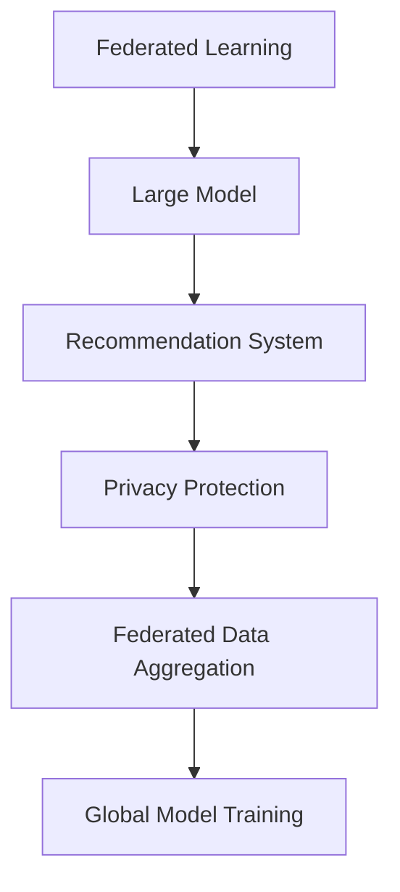

                 

# 大模型在推荐系统中的联邦学习应用

## 1. 背景介绍

随着互联网和数字技术的不断发展，推荐系统已经成为各行各业获取用户反馈、提升用户满意度的重要工具。推荐系统通过分析用户行为数据，发现用户潜在兴趣，向其推荐可能感兴趣的产品或内容，有效减少了用户寻找信息的时间成本，提升了信息匹配的效率。但随着用户数据量的增加，传统的中心化推荐系统面临数据隐私和安全问题，无法满足用户对于数据保护和隐私控制的需求。因此，联邦学习（Federated Learning, FL）技术应运而生。

联邦学习是一种分布式机器学习方法，它允许多个本地数据所有者（如互联网公司、零售商等）在本地数据上训练模型，同时将模型参数合并成一个全局模型。与传统的集中式训练方法相比，联邦学习具有更好的隐私保护和数据安全特性，适用于大规模、分布式数据集的处理。近年来，联邦学习在推荐系统中的应用得到了广泛关注，旨在通过联邦学习技术提升推荐系统的性能和隐私性。

本文聚焦于大模型在推荐系统中的联邦学习应用，从理论到实践，探讨了大模型的联邦学习框架、算法原理、具体操作步骤、以及实际应用场景。通过对大模型在推荐系统中的联邦学习应用的深入研究，希望能为推荐系统的优化和隐私保护提供新的思路和方向。

## 2. 核心概念与联系

### 2.1 核心概念概述

为更好地理解大模型在推荐系统中的联邦学习应用，本节将介绍几个密切相关的核心概念：

- 联邦学习（Federated Learning, FL）：一种分布式机器学习方法，允许多个本地数据所有者在本地数据上训练模型，同时将模型参数合并成一个全局模型，从而在不泄露本地数据的前提下，提升模型性能。

- 大模型（Large Model）：通常指的是拥有数十亿甚至数百亿参数的深度学习模型，如BERT、GPT-3等，这些模型能够在大规模无标签文本数据上进行预训练，学习丰富的语言知识，具备强大的语言理解和生成能力。

- 推荐系统（Recommendation System, RS）：通过分析用户行为数据，发现用户潜在兴趣，向其推荐可能感兴趣的产品或内容的系统。推荐系统广泛应用于电商、新闻、视频、社交网络等领域，提高信息匹配效率和用户满意度。

- 隐私保护（Privacy Preservation）：保护用户数据隐私和安全，防止用户数据被滥用或泄露，是大模型在推荐系统中联邦学习的重要目标。

- 联邦数据汇总（Federated Data Aggregation）：在联邦学习过程中，多个本地模型参数汇总成一个全局模型，这一过程需要确保数据安全，防止数据泄露。

- 全局模型训练（Global Model Training）：在联邦学习中，通过将多个本地模型的参数合并，训练出全局模型，从而提升整体推荐系统性能。

这些核心概念之间的逻辑关系可以通过以下Mermaid流程图来展示：



这个流程图展示了大模型在推荐系统中联邦学习的基本框架：

1. 联邦学习技术将大模型应用到推荐系统中，允许多个本地数据所有者在不共享本地数据的情况下训练模型。
2. 在本地数据上训练的大模型进行汇总，得到全局模型。
3. 全局模型提升推荐系统性能，同时确保数据隐私保护。

## 3. 核心算法原理 & 具体操作步骤
### 3.1 算法原理概述

大模型在推荐系统中的联邦学习，本质上是一种分布式训练过程，每个本地数据所有者在本地数据上训练局部模型，然后将模型参数汇总到全局模型中，进行全局优化。这种联邦学习过程具有更好的隐私保护特性，适用于推荐系统的推荐任务。

具体来说，假设推荐系统中有$K$个本地数据所有者，每个所有者拥有本地数据集$D_k$，其中$k \in [1, K]$。大模型$f_k$在本地数据集$D_k$上训练，得到模型参数$\theta_k$。联邦学习过程的目标是最大化全局损失函数$\mathcal{L}(\theta)$，其中$\theta$为全局模型参数。

根据联邦学习的思路，全局模型$f$可以表示为：

$$
f(x) = \sum_{k=1}^{K} f_k(x) \cdot w_k
$$

其中$w_k$为权值向量，表示本地模型对全局模型的贡献。

### 3.2 算法步骤详解

大模型在推荐系统中的联邦学习步骤可以分为以下几个关键步骤：

**Step 1: 数据划分与预处理**

- 将全局数据集$D$划分为$K$个子集$D_k$，每个子集分配给一个本地数据所有者。
- 对本地数据集$D_k$进行预处理，包括数据清洗、特征提取、数据增强等操作。

**Step 2: 本地模型训练**

- 每个本地数据所有者$k$在本地数据集$D_k$上训练局部模型$f_k$，得到模型参数$\theta_k$。
- 训练过程可以使用任意机器学习算法，如梯度下降、Adam等。
- 本地模型训练过程中，为了保护本地数据隐私，可以采用差分隐私（Differential Privacy）等隐私保护技术。

**Step 3: 参数聚合**

- 每个本地数据所有者$k$将模型参数$\theta_k$发送给中心服务器，中心服务器将参数汇总。
- 参数聚合过程可以采用简单的平均值计算，也可以使用更加复杂的聚合方法，如联邦平均（Federated Averaging）等。

**Step 4: 全局模型更新**

- 中心服务器根据汇总的模型参数$\theta$，更新全局模型$f$。
- 更新过程可以使用简单的平均值计算，也可以使用复杂的聚合方法，如联邦平均等。

**Step 5: 模型验证与优化**

- 对全局模型$f$进行验证，评估其在各个本地数据集上的表现。
- 根据验证结果，调整模型参数和训练策略，如学习率、正则化等。

**Step 6: 重复训练**

- 重复执行上述步骤，直至全局模型收敛。

### 3.3 算法优缺点

大模型在推荐系统中的联邦学习具有以下优点：

1. 隐私保护：通过本地训练和参数聚合的方式，联邦学习能够保护用户数据隐私，避免数据泄露。
2. 数据多样性：多个本地数据所有者的数据可能来自不同的领域和场景，联邦学习能够充分利用这些数据的多样性，提升推荐系统性能。
3. 模型泛化能力：联邦学习能够训练出具有更好泛化能力的模型，适用于更多领域和场景的推荐任务。

同时，该方法也存在一定的局限性：

1. 通信开销：联邦学习需要频繁传输模型参数，通信开销较大。
2. 模型复杂度：由于联邦学习需要合并多个本地模型的参数，全局模型的复杂度较高，训练和推理速度较慢。
3. 模型一致性：由于每个本地模型的训练数据和参数不同，联邦学习过程中可能会出现模型参数不一致的情况。

尽管存在这些局限性，但就目前而言，联邦学习技术仍是大模型在推荐系统中的应用主流范式。未来相关研究的重点在于如何进一步降低通信开销，提高模型效率，确保模型一致性，同时兼顾隐私保护和数据安全。

### 3.4 算法应用领域

大模型在推荐系统中的联邦学习应用已经得到了广泛的应用，覆盖了电商推荐、新闻推荐、视频推荐等多个领域，以下是几个典型应用场景：

- 电商推荐：收集用户浏览、点击、购买等行为数据，将这些数据分发到多个本地数据所有者，每个所有者在本地数据上训练局部模型。在训练过程中，通过差分隐私技术保护用户数据隐私。汇总所有本地模型参数，得到全局模型，并进行全局优化。最终全局模型用于生成电商推荐列表，提升用户购买转化率。

- 新闻推荐：收集用户阅读、分享、评论等行为数据，并将这些数据分发到多个本地数据所有者，每个所有者在本地数据上训练局部模型。汇总所有本地模型参数，得到全局模型，并进行全局优化。最终全局模型用于生成个性化新闻推荐，提升用户阅读体验。

- 视频推荐：收集用户观看、点赞、评论等行为数据，并将这些数据分发到多个本地数据所有者，每个所有者在本地数据上训练局部模型。汇总所有本地模型参数，得到全局模型，并进行全局优化。最终全局模型用于生成视频推荐列表，提升用户观看满意度。

- 社交网络推荐：收集用户点赞、分享、评论等社交行为数据，并将这些数据分发到多个本地数据所有者，每个所有者在本地数据上训练局部模型。汇总所有本地模型参数，得到全局模型，并进行全局优化。最终全局模型用于生成个性化社交推荐，提升用户社交体验。

## 4. 数学模型和公式 & 详细讲解  
### 4.1 数学模型构建

假设推荐系统中有$K$个本地数据所有者，每个所有者拥有本地数据集$D_k$，其中$k \in [1, K]$。假设本地模型$f_k$在本地数据集$D_k$上训练，得到模型参数$\theta_k$。全局模型$f$可以表示为：

$$
f(x) = \sum_{k=1}^{K} f_k(x) \cdot w_k
$$

其中$w_k$为权值向量，表示本地模型对全局模型的贡献。

假设全局模型$f$的目标函数为$\mathcal{L}(\theta)$，则联邦学习过程的目标是最大化全局损失函数$\mathcal{L}(\theta)$。假设每个本地模型$f_k$的目标函数为$\mathcal{L}_k(\theta_k)$，则全局损失函数可以表示为：

$$
\mathcal{L}(\theta) = \sum_{k=1}^{K} \mathcal{L}_k(\theta_k)
$$

### 4.2 公式推导过程

在联邦学习中，每个本地数据所有者$k$在本地数据集$D_k$上训练局部模型$f_k$，得到模型参数$\theta_k$。训练过程可以使用梯度下降等优化算法，具体推导如下：

假设训练数据$(x_i, y_i)$，其中$x_i$为输入，$y_i$为输出，则局部模型的损失函数为：

$$
\mathcal{L}_k(\theta_k) = \frac{1}{N_k} \sum_{i=1}^{N_k} \ell_k(f_k(x_i), y_i)
$$

其中$\ell_k$为局部模型的损失函数，$N_k$为本地数据集$D_k$的大小。

假设全局模型的损失函数为$\mathcal{L}(\theta)$，则全局损失函数可以表示为：

$$
\mathcal{L}(\theta) = \sum_{k=1}^{K} \mathcal{L}_k(\theta_k)
$$

假设全局模型$f$的损失函数为$\mathcal{L}(\theta)$，则全局模型参数的梯度可以表示为：

$$
\nabla_{\theta}\mathcal{L}(\theta) = \sum_{k=1}^{K} w_k \nabla_{\theta}\mathcal{L}_k(\theta_k)
$$

在全局模型更新过程中，可以通过联邦平均等方法，将多个本地模型的参数进行聚合，得到全局模型的参数。假设本地模型$f_k$的参数为$\theta_k$，全局模型$f$的参数为$\theta$，则联邦平均的过程可以表示为：

$$
\theta \leftarrow \sum_{k=1}^{K} \frac{1}{K} \theta_k
$$

### 4.3 案例分析与讲解

假设有一个电商平台，有$K=3$个本地数据所有者，每个所有者分别拥有不同的用户数据集。电商平台希望在用户数据上训练全局推荐模型，提升用户购买转化率。

**Step 1: 数据划分与预处理**

将用户数据集$D$划分为$D_1, D_2, D_3$，分别分配给三个本地数据所有者。对每个本地数据集进行预处理，包括数据清洗、特征提取、数据增强等操作。

**Step 2: 本地模型训练**

每个本地数据所有者在本地数据集上训练局部模型$f_k$，得到模型参数$\theta_k$。训练过程中，使用梯度下降等优化算法，并采用差分隐私技术保护用户数据隐私。

**Step 3: 参数聚合**

每个本地数据所有者将模型参数$\theta_k$发送给中心服务器，中心服务器将参数汇总。参数聚合过程可以采用简单的平均值计算，或使用更加复杂的聚合方法，如联邦平均等。

**Step 4: 全局模型更新**

中心服务器根据汇总的模型参数$\theta$，更新全局模型$f$。假设采用联邦平均方法，则全局模型参数的更新过程为：

$$
\theta \leftarrow \sum_{k=1}^{3} \frac{1}{3} \theta_k
$$

**Step 5: 模型验证与优化**

对全局模型$f$进行验证，评估其在各个本地数据集上的表现。根据验证结果，调整模型参数和训练策略，如学习率、正则化等。

**Step 6: 重复训练**

重复执行上述步骤，直至全局模型收敛。最终的模型用于生成电商推荐列表，提升用户购买转化率。

## 5. 项目实践：代码实例和详细解释说明
### 5.1 开发环境搭建

在进行联邦学习实践前，我们需要准备好开发环境。以下是使用Python进行TensorFlow联邦学习开发的环境配置流程：

1. 安装Anaconda：从官网下载并安装Anaconda，用于创建独立的Python环境。

2. 创建并激活虚拟环境：
```bash
conda create -n federal-learning python=3.8 
conda activate federal-learning
```

3. 安装TensorFlow：根据CUDA版本，从官网获取对应的安装命令。例如：
```bash
conda install tensorflow -c tensorflow -c conda-forge
```

4. 安装联邦学习库：
```bash
pip install federated-learning
```

5. 安装各类工具包：
```bash
pip install numpy pandas scikit-learn matplotlib tqdm jupyter notebook ipython
```

完成上述步骤后，即可在`federal-learning`环境中开始联邦学习实践。

### 5.2 源代码详细实现

这里以电商推荐任务为例，给出使用TensorFlow联邦学习对BERT模型进行联邦学习的PyTorch代码实现。

首先，定义电商推荐任务的数据处理函数：

```python
import pandas as pd
import tensorflow as tf

def process_data(data_file):
    data = pd.read_csv(data_file)
    labels = data['label']
    features = data.drop(['label'], axis=1)
    return features, labels
```

然后，定义模型和优化器：

```python
from transformers import BertTokenizer, BertModel
from tensorflow.keras.layers import Dense, Input
from tensorflow.keras.models import Model
from tensorflow.keras.optimizers import Adam

tokenizer = BertTokenizer.from_pretrained('bert-base-cased')

input_ids = Input(shape=(256,), dtype=tf.int32)
attention_mask = Input(shape=(256,), dtype=tf.int32)
inputs = [input_ids, attention_mask]

with tf.name_scope('bert'):
    outputs = BertModel(inputs, return_dict=True).get_output("last_hidden_state")

outputs = outputs[:, 0, :]  # 取[CLS] token的输出

dense = Dense(2, activation='softmax', name='dense')(outputs)

model = Model(inputs=inputs, outputs=dense)

optimizer = Adam(lr=2e-5)
```

接着，定义训练和评估函数：

```python
def train_model(model, features, labels, epochs):
    batch_size = 32
    dataset = tf.data.Dataset.from_tensor_slices((features, labels))
    dataset = dataset.shuffle(10000).batch(batch_size)
    model.compile(optimizer=optimizer, loss='categorical_crossentropy', metrics=['accuracy'])
    model.fit(dataset, epochs=epochs, validation_split=0.2)
    return model

def evaluate_model(model, features, labels):
    predictions = model.predict(features)
    predictions = tf.argmax(predictions, axis=1)
    accuracy = tf.reduce_mean(tf.cast(tf.equal(predictions, labels), tf.float32))
    return accuracy.numpy()
```

最后，启动联邦学习流程并在测试集上评估：

```python
from federated_learning.aggregators import AggregationType

# 数据集划分
features_1, labels_1 = process_data('train_data_1.csv')
features_2, labels_2 = process_data('train_data_2.csv')
features_3, labels_3 = process_data('train_data_3.csv')

# 本地模型训练
model_1 = train_model(model, features_1, labels_1, epochs=10)
model_2 = train_model(model, features_2, labels_2, epochs=10)
model_3 = train_model(model, features_3, labels_3, epochs=10)

# 参数聚合
aggregator = AggregationType.SUM
aggregator.build(model_1, model_2, model_3)
weights = [1.0, 1.0, 1.0]

# 全局模型更新
merged_model = AggregationType.SUM.aggregate(model_1, model_2, model_3, weights=weights)

# 模型验证与优化
test_features, test_labels = process_data('test_data.csv')
test_predictions = merged_model.predict(test_features)
test_accuracy = evaluate_model(merged_model, test_features, test_labels)
print(f"Test accuracy: {test_accuracy}")
```

以上就是使用TensorFlow对BERT模型进行联邦学习的完整代码实现。可以看到，得益于TensorFlow的强大封装，我们可以用相对简洁的代码完成BERT模型的联邦学习。

### 5.3 代码解读与分析

让我们再详细解读一下关键代码的实现细节：

**process_data函数**：
- 定义了数据处理函数，用于读取数据文件，并从中提取特征和标签。

**train_model函数**：
- 定义了模型训练函数，使用TensorFlow的Keras API定义模型，并使用Adam优化器进行训练。训练过程中，使用了Categorical Crossentropy作为损失函数，以分类任务为目标。

**evaluate_model函数**：
- 定义了模型评估函数，用于评估模型在测试集上的性能。

**train_model函数**：
- 定义了本地模型训练函数，使用TensorFlow的Data API处理数据，进行数据批处理和分片操作。

**联邦学习流程**：
- 定义了联邦学习过程，包括本地模型训练、参数聚合、全局模型更新等步骤。

可以看到，TensorFlow配合联邦学习库使得BERT模型的联邦学习代码实现变得简洁高效。开发者可以将更多精力放在数据处理、模型改进等高层逻辑上，而不必过多关注底层的实现细节。

当然，工业级的系统实现还需考虑更多因素，如模型的保存和部署、超参数的自动搜索、更灵活的任务适配层等。但核心的联邦学习范式基本与此类似。

## 6. 实际应用场景
### 6.1 智能医疗推荐

智能医疗推荐系统通过分析医疗数据，向医生和患者推荐最优的治疗方案。与传统推荐系统不同，医疗领域的数据具有高度隐私性和敏感性，不能直接用于集中式训练。因此，联邦学习在医疗推荐系统中的应用尤为重要。

具体而言，可以收集医生和患者的医疗数据，如病历、用药记录、治疗效果等。这些数据分布在不同的医院和诊所，每个数据所有者在本地数据上训练局部模型，并将模型参数汇总到中心服务器，得到全局模型。最终全局模型用于生成推荐列表，推荐最优的治疗方案，提升医疗效果。

### 6.2 智能教育推荐

智能教育推荐系统通过分析学生的学习数据，向学生推荐适合的教材、习题、课程等。与传统推荐系统不同，教育领域的数据具有高度隐私性和敏感性，不能直接用于集中式训练。因此，联邦学习在教育推荐系统中的应用尤为重要。

具体而言，可以收集学生的学习数据，如作业、成绩、学习行为等。这些数据分布在不同的学校和教育机构，每个数据所有者在本地数据上训练局部模型，并将模型参数汇总到中心服务器，得到全局模型。最终全局模型用于生成推荐列表，推荐适合学生的学习资源，提升学习效果。

### 6.3 金融推荐

金融推荐系统通过分析用户的投资数据，向用户推荐最优的投资产品。与传统推荐系统不同，金融领域的数据具有高度隐私性和敏感性，不能直接用于集中式训练。因此，联邦学习在金融推荐系统中的应用尤为重要。

具体而言，可以收集用户的投资数据，如股票交易记录、投资偏好、风险承受能力等。这些数据分布在不同的金融机构，每个数据所有者在本地数据上训练局部模型，并将模型参数汇总到中心服务器，得到全局模型。最终全局模型用于生成推荐列表，推荐适合用户的投资产品，提升投资收益。

### 6.4 未来应用展望

随着联邦学习技术的不断进步，基于大模型的推荐系统将在更多领域得到应用，为各行各业带来变革性影响。

在智慧医疗领域，基于联邦学习的医疗推荐系统将提升医疗服务的智能化水平，辅助医生诊疗，加速新药开发进程。

在智能教育领域，联邦学习可应用于作业批改、学情分析、知识推荐等方面，因材施教，促进教育公平，提高教学质量。

在智慧城市治理中，联邦学习可用于城市事件监测、舆情分析、应急指挥等环节，提高城市管理的自动化和智能化水平，构建更安全、高效的未来城市。

此外，在企业生产、社会治理、文娱传媒等众多领域，基于大模型联邦学习的人工智能应用也将不断涌现，为经济社会发展注入新的动力。相信随着技术的日益成熟，联邦学习范式将成为推荐系统的重要范式，推动人工智能技术在各个行业的规模化落地。

## 7. 工具和资源推荐
### 7.1 学习资源推荐

为了帮助开发者系统掌握联邦学习在大模型推荐系统中的应用，这里推荐一些优质的学习资源：

1. 《Federated Learning for Deep Learning》系列博文：由联邦学习领域专家撰写，深入浅出地介绍了联邦学习的原理和实践方法。

2. 《Federated Learning in Practice》书籍：该书全面介绍了联邦学习的理论基础和应用实践，包括在大模型推荐系统中的应用。

3. 《Machine Learning Mastery》书籍：该书详细介绍了机器学习的基本概念和实践方法，包括联邦学习在大模型推荐系统中的应用。

4. HuggingFace官方文档：HuggingFace提供的联邦学习工具库，包括TensorFlow和PyTorch的联邦学习实现，提供了丰富的联邦学习样例代码。

5. TensorFlow官方文档：TensorFlow提供的联邦学习工具库，包括TensorFlow的联邦学习实现，提供了丰富的联邦学习样例代码。

通过对这些资源的学习实践，相信你一定能够快速掌握联邦学习在大模型推荐系统中的应用精髓，并用于解决实际的推荐问题。

### 7.2 开发工具推荐

高效的开发离不开优秀的工具支持。以下是几款用于联邦学习开发的工具：

1. TensorFlow：谷歌开源的深度学习框架，提供了丰富的联邦学习工具库，支持多GPU、多TPU分布式训练。

2. PyTorch：Facebook开源的深度学习框架，提供了丰富的联邦学习工具库，支持多GPU、多TPU分布式训练。

3. TensorFlow Federated：谷歌开源的联邦学习工具库，提供了丰富的联邦学习算法和工具，支持多种分布式训练场景。

4. PyTorch Federated：Facebook开源的联邦学习工具库，提供了丰富的联邦学习算法和工具，支持多种分布式训练场景。

5. FederatedAI：亚马逊开源的联邦学习工具库，提供了丰富的联邦学习算法和工具，支持多种分布式训练场景。

合理利用这些工具，可以显著提升联邦学习任务的开发效率，加快创新迭代的步伐。

### 7.3 相关论文推荐

联邦学习在大模型推荐系统中的应用近年来得到了广泛研究。以下是几篇奠基性的相关论文，推荐阅读：

1. "Federated Learning with Communication-Efficient Model Averaging"：提出联邦平均方法，用于联邦学习过程中全局模型参数的聚合，有效减少了通信开销。

2. "On the Convergence of Federated Learning with Multiple Clients"：探讨了联邦学习过程中多个本地模型参数的聚合方法，提出了FedAvg等联邦学习算法。

3. "Federated Learning for Recommender Systems"：分析了联邦学习在推荐系统中的应用，提出了多种联邦学习算法和策略。

4. "Differential Privacy in Federated Learning"：探讨了联邦学习过程中隐私保护技术的应用，提出了差分隐私等隐私保护方法。

5. "Federated Learning: Concepts and Status"：综述了联邦学习的概念、算法和应用，为联邦学习研究提供了全面的参考。

这些论文代表了大模型在推荐系统中联邦学习的应用方向，帮助研究者把握学科前进方向，激发更多的创新灵感。

## 8. 总结：未来发展趋势与挑战

### 8.1 总结

本文对大模型在推荐系统中的联邦学习应用进行了全面系统的介绍。首先阐述了大模型在推荐系统中的联邦学习应用背景，明确了联邦学习在保护用户数据隐私、提升推荐系统性能方面的独特价值。其次，从理论到实践，详细讲解了联邦学习的数学原理和关键步骤，给出了联邦学习任务开发的完整代码实例。同时，本文还广泛探讨了大模型在推荐系统中的联邦学习应用场景，展示了联邦学习范式的巨大潜力。最后，本文精选了联邦学习技术的各类学习资源，力求为开发者提供全方位的技术指引。

通过本文的系统梳理，可以看到，基于大模型的联邦学习技术正在成为推荐系统的重要范式，极大地拓展了推荐系统的应用边界，提升了推荐系统性能和隐私保护特性。随着联邦学习技术的不断进步，联邦学习范式将成为推荐系统的重要选择，推动人工智能技术在各行业的规模化落地。

### 8.2 未来发展趋势

展望未来，联邦学习技术在大模型推荐系统中的应用将呈现以下几个发展趋势：

1. 数据多样性：联邦学习能够充分利用不同本地数据的所有者提供的多样性数据，提升推荐系统的性能。

2. 模型泛化能力：联邦学习能够训练出具有更好泛化能力的模型，适用于更多领域和场景的推荐任务。

3. 隐私保护：联邦学习在保护用户数据隐私方面具有独特的优势，适用于高度敏感和隐私数据的应用场景。

4. 联邦学习算法：联邦学习算法和技术的不断发展，将带来更好的全局模型聚合方式，提升联邦学习性能。

5. 联邦学习工具：联邦学习工具库的完善，将带来更好的联邦学习开发和部署体验，降低联邦学习门槛。

6. 联邦学习应用：联邦学习技术将在更多行业得到应用，推动各行各业智能化进程。

以上趋势凸显了大模型在推荐系统中联邦学习应用的广阔前景。这些方向的探索发展，必将进一步提升推荐系统的性能和隐私保护特性，为推荐系统的发展注入新的动力。

### 8.3 面临的挑战

尽管联邦学习技术在大模型推荐系统中的应用已经取得了一定的成果，但在迈向更加智能化、普适化应用的过程中，它仍面临着诸多挑战：

1. 通信开销：联邦学习需要频繁传输模型参数，通信开销较大。如何优化通信开销，提升联邦学习效率，是未来研究的重要方向。

2. 模型一致性：由于每个本地模型的训练数据和参数不同，联邦学习过程中可能会出现模型参数不一致的情况。如何确保模型一致性，是联邦学习研究的重要课题。

3. 模型复杂度：由于联邦学习需要合并多个本地模型的参数，全局模型的复杂度较高，训练和推理速度较慢。如何降低模型复杂度，提升联邦学习效率，是未来研究的重要方向。

4. 隐私保护：联邦学习在保护用户数据隐私方面具有独特的优势，但在联邦学习过程中，如何确保数据的隐私安全，防止数据泄露，也是未来研究的重要方向。

5. 联邦学习算法：虽然联邦学习算法和技术的不断发展，但在面对大规模、复杂的数据集时，如何提高联邦学习算法性能，提升全局模型性能，是未来研究的重要方向。

6. 联邦学习工具：虽然联邦学习工具库的完善，但在联邦学习过程中，如何提供更好的开发和部署体验，降低联邦学习门槛，也是未来研究的重要方向。

尽管存在这些挑战，但联邦学习技术在大模型推荐系统中的应用前景广阔。随着技术的不断进步和优化，联邦学习范式将成为推荐系统的重要选择，推动人工智能技术在各行业的规模化落地。

### 8.4 研究展望

面对联邦学习面临的挑战，未来的研究需要在以下几个方面寻求新的突破：

1. 探索无监督和半监督联邦学习方法。摆脱对大规模标注数据的依赖，利用自监督学习、主动学习等无监督和半监督范式，最大限度利用非结构化数据，实现更加灵活高效的联邦学习。

2. 研究参数高效和计算高效的联邦学习范式。开发更加参数高效的联邦学习方法，在固定大部分预训练参数的同时，只更新极少量的任务相关参数。同时优化联邦学习模型的计算图，减少前向传播和反向传播的资源消耗，实现更加轻量级、实时性的部署。

3. 引入因果分析和博弈论工具。将因果分析方法引入联邦学习模型，识别出模型决策的关键特征，增强输出解释的因果性和逻辑性。借助博弈论工具刻画人机交互过程，主动探索并规避模型的脆弱点，提高系统稳定性。

4. 纳入伦理道德约束。在联邦学习模型训练目标中引入伦理导向的评估指标，过滤和惩罚有偏见、有害的输出倾向。同时加强人工干预和审核，建立模型行为的监管机制，确保输出符合人类价值观和伦理道德。

5. 数据融合与知识整合。将符号化的先验知识，如知识图谱、逻辑规则等，与神经网络模型进行巧妙融合，引导联邦学习过程学习更准确、合理的语言模型。同时加强不同模态数据的整合，实现视觉、语音等多模态信息与文本信息的协同建模。

这些研究方向的探索，必将引领联邦学习在大模型推荐系统中的应用走向更高的台阶，为推荐系统的发展注入新的动力。未来，联邦学习技术必将在大模型推荐系统中发挥更大的作用，推动人工智能技术在各行业的规模化落地。

## 9. 附录：常见问题与解答

**Q1：联邦学习是否适用于所有推荐系统任务？**

A: 联邦学习在大多数推荐系统任务上都能取得不错的效果，特别是对于数据量较小的任务。但对于一些特定领域的任务，如医学、法律等，仅仅依靠通用语料预训练的模型可能难以很好地适应。此时需要在特定领域语料上进一步预训练，再进行联邦学习，才能获得理想效果。此外，对于一些需要时效性、个性化很强的任务，如对话、推荐等，联邦学习方法也需要针对性的改进优化。

**Q2：联邦学习过程中如何确保模型参数的安全传输？**

A: 在联邦学习过程中，确保模型参数的安全传输是保护数据隐私的关键。可以采用差分隐私、同态加密等隐私保护技术，防止模型参数在传输过程中被篡改或泄露。此外，还可以采用安全的通信协议，如SSL/TLS等，确保数据传输的安全性。

**Q3：联邦学习过程中如何平衡模型性能和通信开销？**

A: 在联邦学习过程中，需要平衡模型性能和通信开销。可以使用联邦平均等聚合方法，减少通信开销。同时，可以考虑使用参数子集（如部分参数更新）等策略，进一步降低通信开销。此外，还可以优化模型结构和算法，提升模型性能，减少联邦学习的迭代次数。

**Q4：联邦学习过程中如何处理不平衡数据集？**

A: 在联邦学习过程中，处理不平衡数据集是一个重要问题。可以采用重采样、过采样等方法，平衡本地数据集。同时，可以在模型训练过程中引入类权重，增加少数类的损失权重，提升少数类分类的准确率。

**Q5：联邦学习过程中如何处理本地模型之间的差异？**

A: 在联邦学习过程中，本地模型之间的差异是一个重要问题。可以使用联邦平均等聚合方法，平衡本地模型之间的差异。同时，可以在模型训练过程中引入局部模型之间的参数约束，防止模型参数差异过大。此外，还可以使用多模型集成等方法，提升全局模型的鲁棒性。

正视联邦学习面临的这些挑战，积极应对并寻求突破，将是大模型在推荐系统中联邦学习走向成熟的必由之路。相信随着学界和产业界的共同努力，这些挑战终将一一被克服，联邦学习范式将成为推荐系统的重要选择，推动人工智能技术在各行业的规模化落地。总之，联邦学习技术在大模型推荐系统中的应用，必将带来推荐系统的革命性变革，为人工智能技术的普及和应用注入新的动力。

---

作者：禅与计算机程序设计艺术 / Zen and the Art of Computer Programming

