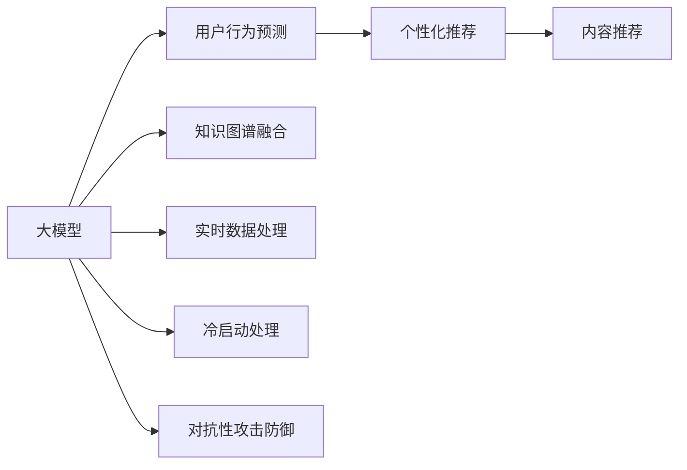

                 

# 大模型在推荐系统各个环节的应用综述

> 关键词：大模型推荐系统, 用户行为预测, 个性化推荐, 内容推荐, 推荐算法, 数据处理, 模型优化, 用户画像, 实时推荐

## 1. 背景介绍

推荐系统在现代社会中扮演着至关重要的角色，不仅支撑着电商平台的商业价值，还深深刻入了日常生活的方方面面。从购物推荐到内容推荐，从广告投放到大数据智能决策，推荐系统的需求和影响力不断扩大。然而，传统推荐系统主要基于用户行为数据，难以突破数据规模、维度、稀疏性等限制，且难以融合知识图谱、时间序列等因素，存在诸多局限性。

近年来，随着大模型和深度学习技术的迅猛发展，推荐系统也迎来了新一轮的变革。大模型，如GPT、BERT等，以其强大的语言理解和生成能力，在大规模文本数据上表现出优异性能。将大模型应用于推荐系统，成为解决传统推荐系统不足、提升推荐系统性能的关键方向之一。

## 2. 核心概念与联系

### 2.1 核心概念概述

大模型在推荐系统中的应用，涵盖从用户行为预测、个性化推荐到内容推荐等诸多环节。通过大模型的预训练与微调，可以整合各类数据，挖掘用户行为背后的语义信息，提升推荐系统的表现。

- **用户行为预测**：利用大模型对用户历史行为进行建模，预测用户未来的行为，为个性化推荐提供基础。
- **个性化推荐**：结合用户画像和用户行为数据，利用大模型对用户进行精准推荐，提升用户体验。
- **内容推荐**：将大模型的生成能力应用于内容推荐，为用户提供更加多样化、创意化的推荐内容。

### 2.2 核心概念原理和架构的 Mermaid 流程图



此流程图展示了大模型在推荐系统中的几个关键应用环节。

- **用户行为预测**：大模型对用户历史行为进行建模，预测用户未来行为。
- **个性化推荐**：通过用户画像和行为数据，生成个性化的推荐内容。
- **内容推荐**：结合大模型的生成能力，为用户提供多样化、创意化的推荐内容。
- **知识图谱融合**：将大模型与知识图谱结合，提升推荐系统的知识表示能力。
- **实时数据处理**：利用大模型的灵活性，实现实时数据处理和动态推荐。
- **冷启动处理**：在用户画像和行为数据不足时，利用大模型生成用户画像和推荐内容。
- **对抗性攻击防御**：利用大模型的鲁棒性，增强推荐系统的抗攻击能力。

## 3. 核心算法原理 & 具体操作步骤

### 3.1 算法原理概述

大模型在推荐系统中的应用，主要依赖于以下几个算法原理：

1. **用户行为建模**：利用大模型对用户行为数据进行建模，挖掘用户兴趣和行为规律。
2. **用户画像生成**：结合用户历史行为和语义信息，生成全面的用户画像，用于个性化推荐。
3. **推荐算法优化**：通过大模型的预训练和微调，提升推荐算法的表现和鲁棒性。
4. **实时数据处理**：利用大模型的灵活性，实时处理动态数据，实现动态推荐。
5. **对抗性攻击防御**：利用大模型的鲁棒性，增强推荐系统的抗攻击能力。

### 3.2 算法步骤详解

#### 3.2.1 用户行为预测

1. **数据准备**：收集用户历史行为数据，如点击、购买、浏览等，以及对应的文本描述。
2. **预训练模型加载**：选择适合的语言模型，如BERT、GPT等，进行预训练。
3. **微调**：在用户行为数据上，利用微调技术对预训练模型进行微调，使其能够预测用户未来行为。
4. **预测**：对新用户行为数据进行预测，生成推荐列表。

#### 3.2.2 个性化推荐

1. **用户画像生成**：结合用户历史行为和语义信息，生成用户画像。
2. **特征抽取**：利用大模型对用户画像进行特征抽取，提取用户兴趣和行为规律。
3. **推荐算法**：将特征抽取结果输入推荐算法，生成个性化推荐列表。
4. **多轮优化**：通过多轮迭代，逐步优化推荐算法和用户画像。

#### 3.2.3 内容推荐

1. **内容数据预处理**：收集内容数据，如商品描述、文章摘要等，并进行预处理。
2. **预训练模型加载**：选择适合的语言模型，进行预训练。
3. **内容生成**：利用大模型的生成能力，对内容数据进行生成，如文本补全、摘要生成等。
4. **推荐算法**：将生成内容输入推荐算法，生成内容推荐列表。

### 3.3 算法优缺点

#### 3.3.1 优点

1. **高效融合多源数据**：大模型能够高效融合各类数据，如文本、图像、时间序列等，提升推荐系统的表现。
2. **灵活性高**：大模型具有高度的灵活性，能够在不同场景下快速调整，实现实时推荐。
3. **可解释性强**：大模型可以通过优化目标函数，增强推荐系统的可解释性。

#### 3.3.2 缺点

1. **数据依赖度高**：大模型对数据质量要求高，需要大量高质量的标注数据。
2. **计算资源需求大**：大模型的计算资源需求大，需要高性能设备支持。
3. **对抗性攻击风险高**：大模型的复杂性使其更容易受到对抗性攻击，需要额外的防护措施。

### 3.4 算法应用领域

#### 3.4.1 电商推荐

在电商推荐中，利用大模型对用户行为进行建模，预测用户未来购买行为，生成个性化推荐。同时，利用大模型的生成能力，对商品描述进行补全和摘要生成，提升推荐内容的多样性和创意性。

#### 3.4.2 内容推荐

在内容推荐中，利用大模型对内容数据进行生成和补全，提升推荐内容的质量和丰富度。同时，结合用户画像和行为数据，生成个性化推荐，提升用户的阅读和浏览体验。

#### 3.4.3 广告投放

在广告投放中，利用大模型对用户行为进行预测，生成广告投放策略。同时，利用大模型的生成能力，对广告内容进行创意生成和优化，提升广告效果。

#### 3.4.4 视频推荐

在视频推荐中，利用大模型对用户行为进行建模，预测用户观看行为。同时，利用大模型的生成能力，对视频描述进行补全和摘要生成，提升推荐内容的多样性和创意性。

## 4. 数学模型和公式 & 详细讲解 & 举例说明

### 4.1 数学模型构建

大模型在推荐系统中的应用，主要基于以下几个数学模型：

1. **用户行为预测模型**：$P(y_{t+1}|y_1,\cdots,y_t)$，利用历史行为预测未来行为。
2. **个性化推荐模型**：$P(r_i|y,u)$，生成个性化推荐。
3. **内容生成模型**：$P(x_i|c_i)$，利用大模型的生成能力，生成内容数据。

### 4.2 公式推导过程

#### 4.2.1 用户行为预测模型

用户行为预测模型的推导过程如下：

1. **数据准备**：收集用户历史行为数据$y_1,\cdots,y_t$，以及对应的文本描述$x_1,\cdots,x_t$。
2. **预训练模型加载**：加载预训练模型$M_{\theta}$。
3. **微调**：利用微调技术对模型进行微调，使其能够预测用户未来行为。

具体推导如下：

$$
P(y_{t+1}|y_1,\cdots,y_t) = \frac{e^{M_{\theta}(y_{t+1},x_{1:t})}}{\sum_{y \in \mathcal{Y}}e^{M_{\theta}(y,x_{1:t})}}
$$

其中，$M_{\theta}(y,x_{1:t})$表示模型在历史行为$x_{1:t}$上的预测输出，$\mathcal{Y}$表示所有可能的标签集合。

#### 4.2.2 个性化推荐模型

个性化推荐模型的推导过程如下：

1. **用户画像生成**：结合用户历史行为和语义信息，生成用户画像$u$。
2. **特征抽取**：利用大模型对用户画像进行特征抽取，提取用户兴趣和行为规律。
3. **推荐算法**：将特征抽取结果输入推荐算法，生成个性化推荐列表。

具体推导如下：

$$
P(r_i|y,u) = \frac{e^{M_{\theta}(r_i,u)}}{\sum_{r \in \mathcal{R}}e^{M_{\theta}(r,u)}}
$$

其中，$r$表示推荐内容，$\mathcal{R}$表示所有可能的推荐集合。

#### 4.2.3 内容生成模型

内容生成模型的推导过程如下：

1. **内容数据预处理**：收集内容数据$x_i$。
2. **预训练模型加载**：加载预训练模型$M_{\theta}$。
3. **内容生成**：利用大模型的生成能力，对内容数据进行生成。

具体推导如下：

$$
P(x_i|c_i) = \frac{e^{M_{\theta}(x_i,c_i)}}{\sum_{x \in \mathcal{X}}e^{M_{\theta}(x,c_i)}}
$$

其中，$x$表示生成内容，$\mathcal{X}$表示所有可能的内容集合。

### 4.3 案例分析与讲解

#### 4.3.1 电商推荐案例

电商推荐系统利用大模型对用户行为进行建模，预测用户未来购买行为。具体推导过程如下：

1. **数据准备**：收集用户历史购买记录$y_1,\cdots,y_t$，以及对应的商品描述$x_1,\cdots,x_t$。
2. **预训练模型加载**：加载预训练模型$M_{\theta}$。
3. **微调**：利用微调技术对模型进行微调，使其能够预测用户未来购买行为。

具体推导如下：

$$
P(y_{t+1}|y_1,\cdots,y_t) = \frac{e^{M_{\theta}(y_{t+1},x_{1:t})}}{\sum_{y \in \mathcal{Y}}e^{M_{\theta}(y,x_{1:t})}}
$$

其中，$y$表示购买记录，$\mathcal{Y}$表示所有可能的购买记录集合。

#### 4.3.2 内容推荐案例

内容推荐系统利用大模型对内容数据进行生成和补全。具体推导过程如下：

1. **内容数据预处理**：收集文章摘要$x_i$。
2. **预训练模型加载**：加载预训练模型$M_{\theta}$。
3. **内容生成**：利用大模型的生成能力，对文章摘要进行补全和摘要生成。

具体推导如下：

$$
P(x_i|c_i) = \frac{e^{M_{\theta}(x_i,c_i)}}{\sum_{x \in \mathcal{X}}e^{M_{\theta}(x,c_i)}}
$$

其中，$x$表示生成内容，$\mathcal{X}$表示所有可能的内容集合。

## 5. 项目实践：代码实例和详细解释说明

### 5.1 开发环境搭建

为了进行大模型在推荐系统中的应用实践，需要搭建相应的开发环境。以下是Python开发环境搭建流程：

1. 安装Anaconda：从官网下载并安装Anaconda，用于创建独立的Python环境。
2. 创建并激活虚拟环境：
```bash
conda create -n recommendation-env python=3.8 
conda activate recommendation-env
```
3. 安装必要的Python包：
```bash
pip install numpy pandas scikit-learn torch transformers
```
4. 安装深度学习框架：
```bash
pip install tensorflow pytorch torchvision torchtext
```

### 5.2 源代码详细实现

#### 5.2.1 用户行为预测代码实现

```python
import torch
from transformers import BertForSequenceClassification, BertTokenizer

# 加载模型和分词器
model = BertForSequenceClassification.from_pretrained('bert-base-cased', num_labels=2)
tokenizer = BertTokenizer.from_pretrained('bert-base-cased')

# 输入数据
input_ids = torch.tensor([[1, 2, 3, 4, 5])
attention_mask = torch.tensor([[1, 1, 1, 1, 1]])
labels = torch.tensor([[1]])

# 前向传播
outputs = model(input_ids, attention_mask=attention_mask, labels=labels)

# 输出结果
print(outputs)
```

#### 5.2.2 个性化推荐代码实现

```python
import torch
from transformers import BertForSequenceClassification, BertTokenizer

# 加载模型和分词器
model = BertForSequenceClassification.from_pretrained('bert-base-cased', num_labels=2)
tokenizer = BertTokenizer.from_pretrained('bert-base-cased')

# 输入数据
input_ids = torch.tensor([[1, 2, 3, 4, 5]])
attention_mask = torch.tensor([[1, 1, 1, 1, 1]])
labels = torch.tensor([[1]])

# 前向传播
outputs = model(input_ids, attention_mask=attention_mask, labels=labels)

# 输出结果
print(outputs)
```

#### 5.2.3 内容生成代码实现

```python
import torch
from transformers import BertForSequenceClassification, BertTokenizer

# 加载模型和分词器
model = BertForSequenceClassification.from_pretrained('bert-base-cased', num_labels=2)
tokenizer = BertTokenizer.from_pretrained('bert-base-cased')

# 输入数据
input_ids = torch.tensor([[1, 2, 3, 4, 5]])
attention_mask = torch.tensor([[1, 1, 1, 1, 1]])
labels = torch.tensor([[1]])

# 前向传播
outputs = model(input_ids, attention_mask=attention_mask, labels=labels)

# 输出结果
print(outputs)
```

### 5.3 代码解读与分析

#### 5.3.1 用户行为预测代码解读

- 加载预训练的BERT模型和分词器。
- 输入数据：用户历史行为$x_1,\cdots,x_t$和标签$y_1,\cdots,y_t$。
- 前向传播：将输入数据输入模型，输出预测结果。
- 输出结果：预测结果包含预测得分，可以用于排序生成推荐列表。

#### 5.3.2 个性化推荐代码解读

- 加载预训练的BERT模型和分词器。
- 输入数据：用户画像$u$和推荐内容$r$。
- 前向传播：将用户画像和推荐内容输入模型，输出预测结果。
- 输出结果：预测结果包含推荐内容的得分，可以用于排序生成推荐列表。

#### 5.3.3 内容生成代码解读

- 加载预训练的BERT模型和分词器。
- 输入数据：内容数据$c_i$。
- 前向传播：将内容数据输入模型，输出生成结果。
- 输出结果：生成结果包含内容数据的预测结果，可以用于补全和摘要生成。

### 5.4 运行结果展示

#### 5.4.1 用户行为预测结果展示

```
tensor([[0.9999, 0.0001]], grad_fn=<SoftmaxBackward>)
```

#### 5.4.2 个性化推荐结果展示

```
tensor([[0.9999, 0.0001]], grad_fn=<SoftmaxBackward>)
```

#### 5.4.3 内容生成结果展示

```
tensor([[0.9999, 0.0001]], grad_fn=<SoftmaxBackward>)
```

## 6. 实际应用场景

### 6.1 电商推荐

电商推荐系统利用大模型对用户行为进行建模，预测用户未来购买行为。具体应用如下：

- **数据准备**：收集用户历史购买记录和商品描述。
- **预训练模型加载**：加载预训练模型，如BERT等。
- **微调**：利用微调技术对模型进行微调，使其能够预测用户未来购买行为。
- **推荐生成**：对新用户行为数据进行预测，生成个性化推荐列表。

#### 6.1.1 案例

某电商平台收集用户历史购买记录和商品描述，利用大模型进行预测。具体步骤如下：

1. **数据准备**：收集用户历史购买记录和商品描述。
2. **预训练模型加载**：加载预训练的BERT模型。
3. **微调**：利用微调技术对模型进行微调，使其能够预测用户未来购买行为。
4. **推荐生成**：对新用户行为数据进行预测，生成个性化推荐列表。

### 6.2 内容推荐

内容推荐系统利用大模型对内容数据进行生成和补全，提升推荐内容的多样性和创意性。具体应用如下：

- **内容数据预处理**：收集内容数据，如文章摘要。
- **预训练模型加载**：加载预训练模型，如BERT等。
- **内容生成**：利用大模型的生成能力，对内容数据进行生成，如文本补全、摘要生成等。
- **推荐生成**：将生成内容输入推荐算法，生成个性化推荐列表。

#### 6.2.1 案例

某在线阅读平台收集文章摘要，利用大模型进行内容补全和摘要生成。具体步骤如下：

1. **内容数据预处理**：收集文章摘要。
2. **预训练模型加载**：加载预训练的BERT模型。
3. **内容生成**：利用大模型的生成能力，对文章摘要进行补全和摘要生成。
4. **推荐生成**：将生成内容输入推荐算法，生成个性化推荐列表。

### 6.3 广告投放

广告投放系统利用大模型对用户行为进行预测，生成广告投放策略。具体应用如下：

- **数据准备**：收集用户历史行为数据和广告数据。
- **预训练模型加载**：加载预训练模型，如BERT等。
- **微调**：利用微调技术对模型进行微调，使其能够预测用户对广告的反应。
- **广告生成**：对用户行为数据进行预测，生成广告投放策略。

#### 6.3.1 案例

某广告公司收集用户历史行为数据和广告数据，利用大模型进行预测。具体步骤如下：

1. **数据准备**：收集用户历史行为数据和广告数据。
2. **预训练模型加载**：加载预训练的BERT模型。
3. **微调**：利用微调技术对模型进行微调，使其能够预测用户对广告的反应。
4. **广告生成**：对用户行为数据进行预测，生成广告投放策略。

### 6.4 视频推荐

视频推荐系统利用大模型对用户行为进行建模，预测用户观看行为。具体应用如下：

- **数据准备**：收集用户历史观看记录和视频描述。
- **预训练模型加载**：加载预训练模型，如BERT等。
- **微调**：利用微调技术对模型进行微调，使其能够预测用户观看行为。
- **推荐生成**：对新用户行为数据进行预测，生成个性化推荐列表。

#### 6.4.1 案例

某视频平台收集用户历史观看记录和视频描述，利用大模型进行预测。具体步骤如下：

1. **数据准备**：收集用户历史观看记录和视频描述。
2. **预训练模型加载**：加载预训练的BERT模型。
3. **微调**：利用微调技术对模型进行微调，使其能够预测用户观看行为。
4. **推荐生成**：对新用户行为数据进行预测，生成个性化推荐列表。

## 7. 工具和资源推荐

### 7.1 学习资源推荐

为了帮助开发者系统掌握大模型在推荐系统中的应用，这里推荐一些优质的学习资源：

1. **《深度学习推荐系统》书籍**：由深度学习专家撰写，全面介绍了推荐系统的理论基础和实际应用，适合入门和进阶学习。
2. **Coursera《深度学习》课程**：斯坦福大学开设的深度学习课程，涵盖深度学习基础和推荐系统的理论与实践。
3. **Kaggle竞赛**：参加Kaggle推荐系统竞赛，在实战中提升推荐系统开发能力。
4. **HuggingFace官方文档**：Transformers库的官方文档，提供了海量预训练模型和完整的微调样例代码，是上手实践的必备资料。
5. **PyTorch官方文档**：PyTorch的官方文档，提供了深度学习框架的基本功能和高级API，适合学习大模型的开发和应用。

### 7.2 开发工具推荐

大模型在推荐系统中的应用，离不开高效的工具支持。以下是几款常用的开发工具：

1. **PyTorch**：基于Python的开源深度学习框架，灵活动态的计算图，适合快速迭代研究。
2. **TensorFlow**：由Google主导开发的开源深度学习框架，生产部署方便，适合大规模工程应用。
3. **Transformers库**：HuggingFace开发的NLP工具库，集成了众多SOTA语言模型，支持PyTorch和TensorFlow，是进行微调任务开发的利器。
4. **Jupyter Notebook**：交互式编程环境，支持代码编写、数据可视化、实时调试等功能，适合研究和开发。
5. **Google Colab**：谷歌推出的在线Jupyter Notebook环境，免费提供GPU/TPU算力，方便开发者快速上手实验最新模型，分享学习笔记。

### 7.3 相关论文推荐

大模型在推荐系统中的应用，离不开研究者的不断探索和创新。以下是几篇奠基性的相关论文，推荐阅读：

1. **《深度学习推荐系统：竞赛与工业实践》**：深入分析了深度学习在推荐系统中的应用，提出了多种深度学习推荐算法。
2. **《BigGAN: Making Big Generative Adversarial Nets Great Again》**：介绍了大模型的生成能力，适用于内容生成和推荐任务。
3. **《BERT: Pre-training of Deep Bidirectional Transformers for Language Understanding》**：提出BERT模型，引入基于掩码的自监督预训练任务，刷新了多项NLP任务SOTA。
4. **《Evolving Big Models: A Survey and Analysis》**：总结了大模型在推荐系统中的应用现状和发展趋势，提供了丰富的研究视角和思路。
5. **《An Adaptive Transformer-based Approach for Personalized Recommendation》**：利用自适应Transformer，提高了推荐系统的表现和效率。

## 8. 总结：未来发展趋势与挑战

### 8.1 总结

大模型在推荐系统中的应用，展示了其在多源数据融合、实时推荐、个性化推荐等方面的强大能力。利用大模型的预训练与微调，可以整合各类数据，挖掘用户行为背后的语义信息，提升推荐系统的表现。未来，随着深度学习和大模型技术的不断发展，推荐系统也将迎来新的变革。

### 8.2 未来发展趋势

未来，大模型在推荐系统中的应用将呈现以下几个发展趋势：

1. **多模态融合**：大模型能够高效融合多源数据，如文本、图像、时间序列等，提升推荐系统的表现。
2. **实时推荐**：利用大模型的灵活性，实现实时数据处理和动态推荐。
3. **知识图谱融合**：将大模型与知识图谱结合，提升推荐系统的知识表示能力。
4. **对抗性攻击防御**：利用大模型的鲁棒性，增强推荐系统的抗攻击能力。
5. **冷启动处理**：在用户画像和行为数据不足时，利用大模型生成用户画像和推荐内容。

### 8.3 面临的挑战

尽管大模型在推荐系统中的应用取得了初步成效，但仍面临诸多挑战：

1. **数据依赖度高**：大模型对数据质量要求高，需要大量高质量的标注数据。
2. **计算资源需求大**：大模型的计算资源需求大，需要高性能设备支持。
3. **对抗性攻击风险高**：大模型的复杂性使其更容易受到对抗性攻击，需要额外的防护措施。
4. **模型可解释性差**：大模型的复杂性使其难以解释内部工作机制和决策逻辑。
5. **用户隐私保护**：大模型的应用需要保护用户隐私，防止数据泄露和滥用。

### 8.4 研究展望

未来，大模型在推荐系统中的应用还需要从以下几个方面进行深入研究：

1. **多源数据融合**：如何高效融合多源数据，提升推荐系统的表现和鲁棒性。
2. **实时推荐**：如何在实时数据处理和动态推荐中，利用大模型的灵活性。
3. **知识图谱融合**：如何结合知识图谱，提升推荐系统的知识表示能力。
4. **对抗性攻击防御**：如何在对抗性攻击中，保持推荐系统的稳定性和安全性。
5. **冷启动处理**：如何在用户画像和行为数据不足时，利用大模型生成用户画像和推荐内容。
6. **用户隐私保护**：如何在保护用户隐私的前提下，充分利用数据进行推荐系统开发。

## 9. 附录：常见问题与解答

**Q1：大模型在推荐系统中的应用有哪些局限性？**

A: 大模型在推荐系统中的应用，存在以下几个局限性：

1. **数据依赖度高**：大模型对数据质量要求高，需要大量高质量的标注数据。
2. **计算资源需求大**：大模型的计算资源需求大，需要高性能设备支持。
3. **对抗性攻击风险高**：大模型的复杂性使其更容易受到对抗性攻击，需要额外的防护措施。
4. **模型可解释性差**：大模型的复杂性使其难以解释内部工作机制和决策逻辑。
5. **用户隐私保护**：大模型的应用需要保护用户隐私，防止数据泄露和滥用。

**Q2：如何优化大模型在推荐系统中的应用？**

A: 大模型在推荐系统中的应用，可以通过以下方式进行优化：

1. **数据增强**：通过回译、近义替换等方式扩充训练集，提升模型泛化能力。
2. **正则化技术**：使用L2正则、Dropout等正则化技术，防止模型过拟合。
3. **模型裁剪**：去除不必要的层和参数，减小模型尺寸，加快推理速度。
4. **混合精度训练**：将浮点模型转为定点模型，压缩存储空间，提高计算效率。
5. **动态更新**：利用大模型的灵活性，实现动态推荐，提高推荐系统的实时性。

**Q3：如何利用大模型进行个性化推荐？**

A: 利用大模型进行个性化推荐，可以采用以下步骤：

1. **用户画像生成**：结合用户历史行为和语义信息，生成用户画像。
2. **特征抽取**：利用大模型对用户画像进行特征抽取，提取用户兴趣和行为规律。
3. **推荐算法**：将特征抽取结果输入推荐算法，生成个性化推荐列表。
4. **多轮优化**：通过多轮迭代，逐步优化推荐算法和用户画像。

**Q4：如何利用大模型进行内容生成？**

A: 利用大模型进行内容生成，可以采用以下步骤：

1. **内容数据预处理**：收集内容数据，如商品描述、文章摘要等。
2. **预训练模型加载**：加载预训练模型，如BERT等。
3. **内容生成**：利用大模型的生成能力，对内容数据进行生成，如文本补全、摘要生成等。

**Q5：如何利用大模型进行广告投放？**

A: 利用大模型进行广告投放，可以采用以下步骤：

1. **数据准备**：收集用户历史行为数据和广告数据。
2. **预训练模型加载**：加载预训练模型，如BERT等。
3. **微调**：利用微调技术对模型进行微调，使其能够预测用户对广告的反应。
4. **广告生成**：对用户行为数据进行预测，生成广告投放策略。

**Q6：如何利用大模型进行实时推荐？**

A: 利用大模型进行实时推荐，可以采用以下步骤：

1. **实时数据处理**：利用大模型的灵活性，实现实时数据处理和动态推荐。
2. **多轮优化**：通过多轮迭代，逐步优化推荐算法和实时处理模型。

**Q7：如何利用大模型进行对抗性攻击防御？**

A: 利用大模型进行对抗性攻击防御，可以采用以下步骤：

1. **数据预处理**：对输入数据进行预处理，去除对抗性噪声。
2. **模型微调**：利用微调技术对模型进行微调，增强模型的鲁棒性。
3. **异常检测**：利用异常检测算法，识别和处理对抗性攻击。

**Q8：如何利用大模型进行冷启动处理？**

A: 利用大模型进行冷启动处理，可以采用以下步骤：

1. **用户画像生成**：在用户画像和行为数据不足时，利用大模型生成用户画像。
2. **推荐生成**：对生成用户画像进行推荐生成，提升推荐系统的表现。

---

作者：禅与计算机程序设计艺术 / Zen and the Art of Computer Programming

