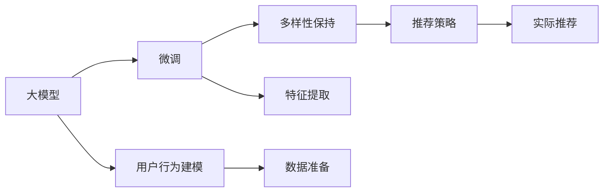

                 

## 1. 背景介绍

推荐系统在现代互联网应用中发挥着至关重要的作用，通过智能算法为用户推荐其可能感兴趣的内容，极大地提高了用户满意度和平台活跃度。然而，推荐系统在长期运行中很容易陷入所谓的“过滤泡沫”(Filter Bubble)，即用户只能接收到符合其已有兴趣偏好的内容，逐渐失去探索新事物的意愿。这种现象不仅限制了用户的知识边界，也影响了平台的长期增长潜力。

为了应对这一问题，一些推荐系统开始引入多样性保持策略，即在推荐内容时，不仅要考虑用户的历史兴趣偏好，还要适当推荐与用户已有偏好不同的内容，帮助用户拓宽兴趣领域，提升平台的整体多样性。本文将探讨如何利用大模型，通过微调算法，实现推荐系统中用户兴趣多样性的保持。

## 2. 核心概念与联系

### 2.1 核心概念概述

大模型在推荐系统中的应用，本质上是基于大模型微调的推荐算法。具体来说，有以下几个关键概念：

- **大模型（Large Model）**：指具有大规模参数量（通常以亿计）的深度学习模型，如BERT、GPT-3、T5等。这些模型在预训练阶段通过大量无标签文本数据的自监督学习，掌握了丰富的语言知识和常识，具备强大的语言理解和生成能力。

- **微调（Fine-Tuning）**：指在大模型预训练的基础上，通过有监督的监督学习，对模型进行特定任务适配的过程。对于推荐系统而言，微调的过程就是根据用户历史行为和兴趣偏好，对模型进行训练，使其能够预测用户可能感兴趣的新内容。

- **多样性保持（Diversity Preservation）**：指在推荐内容时，不仅要优先推荐用户已有的兴趣偏好，还要考虑推荐与用户已有兴趣不同的内容，以达到用户兴趣的多样化。

- **跨领域泛化（Cross-domain Generalization）**：指模型在特定任务上的性能不依赖于特定的训练数据集，能够泛化到不同的数据分布上。推荐系统中的多样性保持，本质上就是模型在多领域数据上的泛化能力。

- **用户行为建模（User Behavior Modeling）**：指通过机器学习算法，对用户的历史行为数据进行建模，预测用户未来的行为，如点击、购买、评分等。

这些概念共同构成了大模型在推荐系统中的应用框架，通过微调算法和大模型，推荐系统可以在用户个性化推荐的同时，考虑多样性保持，提升用户体验和平台效果。

### 2.2 核心概念联系

大模型在推荐系统中的应用，可以通过以下示意图展示其核心概念之间的关系：



- **大模型（A）**：作为推荐系统的基础，大模型在预训练阶段学习到了丰富的语言知识，具备较强的语言理解和生成能力。
- **微调（B）**：通过微调算法，将大模型适配到特定的推荐任务，提升模型在推荐新内容时的准确性和多样性。
- **用户行为建模（C）**：通过对用户历史行为数据的建模，预测用户未来的兴趣偏好。
- **数据准备（E）**：将用户行为数据和大模型预测结果进行整理和准备，输入到模型中进行微调。
- **特征提取（F）**：从用户行为数据和大模型预测结果中提取关键特征，供微调算法使用。
- **多样性保持（D）**：通过微调算法，考虑用户已有的兴趣偏好，同时适当推荐不同兴趣的内容，保持用户兴趣的多样性。
- **推荐策略（G）**：根据多样性保持的微调结果，制定推荐策略，实现用户个性化推荐。
- **实际推荐（H）**：将推荐策略应用到实际推荐系统，为用户生成推荐内容。

以上各概念相互配合，共同构成了基于大模型的推荐系统。

## 3. 核心算法原理 & 具体操作步骤

### 3.1 算法原理概述

大模型在推荐系统中的应用，主要基于以下原理：

1. **预训练与微调**：在大规模无标签文本数据上预训练大模型，然后在特定推荐任务的数据集上进行微调，使模型能够预测用户可能感兴趣的新内容。
2. **用户行为建模**：通过对用户历史行为数据的建模，预测用户未来的兴趣偏好。
3. **多样性保持**：在微调过程中，考虑用户已有的兴趣偏好，同时适当推荐不同兴趣的内容，保持用户兴趣的多样性。
4. **跨领域泛化**：通过微调，模型能够在不同领域的数据上保持泛化能力，适应多样的推荐任务。

### 3.2 算法步骤详解

基于大模型的推荐系统，主要分为以下几个步骤：

**Step 1: 数据准备**
- 收集用户的历史行为数据，如浏览记录、购买记录、评分记录等。
- 将用户行为数据进行清洗和整理，提取用户的行为特征。
- 准备推荐任务的标注数据集，如电影评分数据、商品购买数据等。

**Step 2: 特征提取**
- 使用大模型进行用户行为特征的提取。通常可以使用预训练模型（如BERT）对用户行为文本进行编码，得到用户行为的向量表示。
- 根据用户历史行为和推荐任务的数据集，提取特征。例如，可以将用户的历史兴趣偏好与推荐数据中的商品特征进行拼接，得到输入特征向量。

**Step 3: 微调模型**
- 使用微调算法对大模型进行适配，使其能够预测用户对推荐内容的兴趣。
- 在微调过程中，考虑用户已有的兴趣偏好，同时引入多样性保持机制，推荐与用户已有兴趣不同的内容。
- 使用交叉验证等技术，评估模型在不同领域数据上的泛化能力，确保模型在不同数据集上的一致性。

**Step 4: 推荐策略制定**
- 根据微调后的模型，制定推荐策略。可以设计多臂老虎机（Multi-armed Bandit）算法、协同过滤（Collaborative Filtering）等推荐策略。
- 在推荐策略中，综合考虑用户兴趣偏好和多样性保持的要求，为用户生成推荐内容。

**Step 5: 实际推荐**
- 将推荐策略应用到实际推荐系统中，为用户生成个性化的推荐内容。
- 根据用户的反馈和行为数据，不断调整推荐策略，提升推荐效果。

### 3.3 算法优缺点

基于大模型的推荐系统具有以下优点：

1. **丰富语义表示**：大模型在预训练阶段学习了丰富的语言知识，能够更好地捕捉用户兴趣的多样性。
2. **跨领域泛化**：大模型在多个领域数据上的泛化能力，使得模型能够在不同任务上保持一致性。
3. **高效推荐**：大模型的预训练和微调过程可以在大规模数据上进行，从而提升推荐效率。

同时，该方法也存在一些局限性：

1. **数据依赖性**：大模型的微调需要大量的标注数据，对于一些长尾应用场景，获取高质量标注数据成本较高。
2. **资源消耗**：大模型的预训练和微调需要大量的计算资源，对硬件设备的要求较高。
3. **过拟合风险**：模型在特定领域数据上过度拟合，可能导致在实际推荐场景中的泛化性能不足。
4. **冷启动问题**：对于新用户或新商品，缺乏足够的行为数据，模型难以进行准确推荐。

### 3.4 算法应用领域

基于大模型的推荐系统已经在多个领域得到了广泛应用，例如：

1. **电商推荐**：为用户推荐可能感兴趣的商品。通过用户行为数据和大模型的微调，能够提升推荐的个性化和多样性。
2. **视频推荐**：为用户推荐可能感兴趣的视频内容。通过视频标签和大模型的微调，能够提升视频的推荐效果。
3. **新闻推荐**：为用户推荐可能感兴趣的新闻文章。通过用户历史阅读记录和大模型的微调，能够提升新闻的推荐准确性。
4. **音乐推荐**：为用户推荐可能感兴趣的音乐。通过用户听歌记录和大模型的微调，能够提升音乐的推荐效果。
5. **旅游推荐**：为用户推荐可能感兴趣的目的地。通过用户历史旅行记录和大模型的微调，能够提升旅游的推荐效果。

除了上述这些经典应用外，大模型在推荐系统中的应用还在不断拓展，如多模态推荐、异构数据融合、社交网络推荐等，为推荐系统带来了新的突破。

## 4. 数学模型和公式 & 详细讲解 & 举例说明

### 4.1 数学模型构建

假设用户的历史行为数据为 $\mathbf{x} \in \mathbb{R}^{d}$，推荐任务的数据集为 $\mathcal{D} = \{(\mathbf{x}_i, y_i)\}_{i=1}^N$，其中 $y_i$ 为推荐内容的兴趣评分。

大模型的微调目标是最小化预测误差，即：

$$
\hat{y} = M_{\theta}(\mathbf{x})
$$

$$
\mathcal{L}(\theta) = \frac{1}{N} \sum_{i=1}^N \ell(\hat{y}_i, y_i)
$$

其中 $\ell$ 为损失函数，如均方误差（MSE）、交叉熵（Cross-Entropy）等。

在微调过程中，我们希望模型能够准确预测用户对推荐内容的兴趣评分，同时考虑多样性保持的要求，即引入正则项约束，使得模型预测的评分尽可能均匀地分布在不同分数区间内。

### 4.2 公式推导过程

以交叉熵损失函数为例，其推导过程如下：

假设用户行为数据的向量表示为 $\mathbf{x}$，推荐任务的标注数据集为 $\mathcal{D}$，其中 $\mathbf{x}_i$ 为第 $i$ 个样本的特征向量，$y_i$ 为对应的标签。微调后的模型预测输出为 $\hat{y}$，则交叉熵损失函数定义为：

$$
\ell(\hat{y}, y) = -y \log \hat{y} - (1-y) \log (1-\hat{y})
$$

将上式扩展到整个数据集，得到经验风险：

$$
\mathcal{L}(\theta) = -\frac{1}{N} \sum_{i=1}^N [y_i \log \hat{y}_i + (1-y_i) \log (1-\hat{y}_i)]
$$

在微调过程中，我们希望最小化经验风险 $\mathcal{L}(\theta)$，即：

$$
\hat{\theta} = \mathop{\arg\min}_{\theta} \mathcal{L}(\theta)
$$

通过梯度下降等优化算法，最小化损失函数，更新模型参数 $\theta$，得到最优参数 $\hat{\theta}$。

### 4.3 案例分析与讲解

以电商推荐为例，假设用户的历史浏览记录为 $\mathbf{x}$，推荐任务的数据集为 $\mathcal{D}$，其中 $\mathbf{x}_i$ 为第 $i$ 个商品的描述文本，$y_i$ 为对应的点击次数。

在微调过程中，我们希望模型能够预测用户对商品的点击概率。假设模型为 BERT，则其输入向量为：

$$
\mathbf{x}_{bert} = \mathcal{T}_{bert}(\mathbf{x})
$$

其中 $\mathcal{T}_{bert}$ 为 BERT 特征提取函数。

模型的预测输出为：

$$
\hat{p} = \sigma(\mathbf{W} \mathbf{x}_{bert} + \mathbf{b})
$$

其中 $\mathbf{W}$ 和 $\mathbf{b}$ 为可训练参数，$\sigma$ 为 sigmoid 函数，将预测输出映射到 $[0, 1]$ 区间内。

损失函数采用交叉熵损失：

$$
\mathcal{L}(\theta) = -\frac{1}{N} \sum_{i=1}^N [y_i \log \hat{p}_i + (1-y_i) \log (1-\hat{p}_i)]
$$

通过梯度下降算法，最小化损失函数 $\mathcal{L}(\theta)$，更新模型参数 $\theta$，得到最优参数 $\hat{\theta}$。

## 5. 项目实践：代码实例和详细解释说明

### 5.1 开发环境搭建

在进行大模型推荐系统微调实践前，我们需要准备好开发环境。以下是使用Python进行PyTorch开发的环境配置流程：

1. 安装Anaconda：从官网下载并安装Anaconda，用于创建独立的Python环境。

2. 创建并激活虚拟环境：
```bash
conda create -n pytorch-env python=3.8 
conda activate pytorch-env
```

3. 安装PyTorch：根据CUDA版本，从官网获取对应的安装命令。例如：
```bash
conda install pytorch torchvision torchaudio cudatoolkit=11.1 -c pytorch -c conda-forge
```

4. 安装Transformers库：
```bash
pip install transformers
```

5. 安装各类工具包：
```bash
pip install numpy pandas scikit-learn matplotlib tqdm jupyter notebook ipython
```

完成上述步骤后，即可在`pytorch-env`环境中开始微调实践。

### 5.2 源代码详细实现

这里我们以电商推荐为例，给出使用Transformers库对BERT模型进行微调的PyTorch代码实现。

首先，定义数据处理函数：

```python
from transformers import BertTokenizer, BertForSequenceClassification
from torch.utils.data import Dataset
import torch

class MovieDataset(Dataset):
    def __init__(self, texts, labels):
        self.texts = texts
        self.labels = labels
        self.tokenizer = BertTokenizer.from_pretrained('bert-base-cased')
        self.max_len = 128
        
    def __len__(self):
        return len(self.texts)
    
    def __getitem__(self, item):
        text = self.texts[item]
        label = self.labels[item]
        
        encoding = self.tokenizer(text, return_tensors='pt', max_length=self.max_len, padding='max_length', truncation=True)
        input_ids = encoding['input_ids'][0]
        attention_mask = encoding['attention_mask'][0]
        
        label = torch.tensor(label, dtype=torch.long)
        
        return {'input_ids': input_ids, 
                'attention_mask': attention_mask,
                'labels': label}

# 标签与id的映射
label2id = {'positive': 1, 'negative': 0}
id2label = {v: k for k, v in label2id.items()}

# 创建dataset
tokenizer = BertTokenizer.from_pretrained('bert-base-cased')

train_dataset = MovieDataset(train_texts, train_labels)
dev_dataset = MovieDataset(dev_texts, dev_labels)
test_dataset = MovieDataset(test_texts, test_labels)
```

然后，定义模型和优化器：

```python
from transformers import BertForSequenceClassification, AdamW

model = BertForSequenceClassification.from_pretrained('bert-base-cased', num_labels=2)

optimizer = AdamW(model.parameters(), lr=2e-5)
```

接着，定义训练和评估函数：

```python
from torch.utils.data import DataLoader
from tqdm import tqdm
from sklearn.metrics import accuracy_score

device = torch.device('cuda') if torch.cuda.is_available() else torch.device('cpu')
model.to(device)

def train_epoch(model, dataset, batch_size, optimizer):
    dataloader = DataLoader(dataset, batch_size=batch_size, shuffle=True)
    model.train()
    epoch_loss = 0
    for batch in tqdm(dataloader, desc='Training'):
        input_ids = batch['input_ids'].to(device)
        attention_mask = batch['attention_mask'].to(device)
        labels = batch['labels'].to(device)
        model.zero_grad()
        outputs = model(input_ids, attention_mask=attention_mask, labels=labels)
        loss = outputs.loss
        epoch_loss += loss.item()
        loss.backward()
        optimizer.step()
    return epoch_loss / len(dataloader)

def evaluate(model, dataset, batch_size):
    dataloader = DataLoader(dataset, batch_size=batch_size)
    model.eval()
    preds, labels = [], []
    with torch.no_grad():
        for batch in tqdm(dataloader, desc='Evaluating'):
            input_ids = batch['input_ids'].to(device)
            attention_mask = batch['attention_mask'].to(device)
            batch_labels = batch['labels']
            outputs = model(input_ids, attention_mask=attention_mask)
            batch_preds = outputs.logits.argmax(dim=1).to('cpu').tolist()
            batch_labels = batch_labels.to('cpu').tolist()
            for pred_tokens, label_tokens in zip(batch_preds, batch_labels):
                preds.append(pred_tokens)
                labels.append(label_tokens)
                
    print(f'Accuracy: {accuracy_score(labels, preds)}')
```

最后，启动训练流程并在测试集上评估：

```python
epochs = 5
batch_size = 16

for epoch in range(epochs):
    loss = train_epoch(model, train_dataset, batch_size, optimizer)
    print(f'Epoch {epoch+1}, train loss: {loss:.3f}')
    
    print(f'Epoch {epoch+1}, dev results:')
    evaluate(model, dev_dataset, batch_size)
    
print(f'Epoch {epochs+1}, test results:')
evaluate(model, test_dataset, batch_size)
```

以上就是使用PyTorch对BERT进行电商推荐系统微调的完整代码实现。可以看到，得益于Transformers库的强大封装，我们可以用相对简洁的代码完成BERT模型的加载和微调。

### 5.3 代码解读与分析

让我们再详细解读一下关键代码的实现细节：

**MovieDataset类**：
- `__init__`方法：初始化文本、标签、分词器等关键组件。
- `__len__`方法：返回数据集的样本数量。
- `__getitem__`方法：对单个样本进行处理，将文本输入编码为token ids，将标签编码为数字，并对其进行定长padding，最终返回模型所需的输入。

**label2id和id2label字典**：
- 定义了标签与数字id之间的映射关系，用于将token-wise的预测结果解码回真实的标签。

**训练和评估函数**：
- 使用PyTorch的DataLoader对数据集进行批次化加载，供模型训练和推理使用。
- 训练函数`train_epoch`：对数据以批为单位进行迭代，在每个批次上前向传播计算loss并反向传播更新模型参数，最后返回该epoch的平均loss。
- 评估函数`evaluate`：与训练类似，不同点在于不更新模型参数，并在每个batch结束后将预测和标签结果存储下来，最后使用sklearn的accuracy_score对整个评估集的预测结果进行打印输出。

**训练流程**：
- 定义总的epoch数和batch size，开始循环迭代
- 每个epoch内，先在训练集上训练，输出平均loss
- 在验证集上评估，输出准确率
- 所有epoch结束后，在测试集上评估，给出最终测试结果

可以看到，PyTorch配合Transformers库使得BERT微调的代码实现变得简洁高效。开发者可以将更多精力放在数据处理、模型改进等高层逻辑上，而不必过多关注底层的实现细节。

当然，工业级的系统实现还需考虑更多因素，如模型的保存和部署、超参数的自动搜索、更灵活的任务适配层等。但核心的微调范式基本与此类似。

## 6. 实际应用场景

### 6.1 电商推荐

在电商推荐系统中，基于大模型的推荐系统可以广泛应用于个性化推荐和多样性保持。

电商推荐系统需要根据用户的历史浏览和购买记录，推荐用户可能感兴趣的商品。传统的基于协同过滤或基于内容的推荐方法，往往只能推荐用户已有兴趣的商品，难以发现新的兴趣点。

使用大模型微调的方法，可以从用户历史行为数据中提取语义特征，输入到预训练模型中进行编码。通过微调模型，可以学习到用户对不同商品的兴趣权重，并根据多样性保持的要求，适当推荐与用户已有兴趣不同的商品。

例如，对于某用户浏览记录中的电影商品，可以使用BERT模型对其进行编码，得到向量表示。然后，将向量输入到微调后的模型中，得到用户对电影的兴趣评分。根据评分排序，为用户推荐最可能感兴趣的电影，同时考虑推荐多样性，推荐与用户已有偏好不同的电影。

### 6.2 视频推荐

视频推荐系统需要对用户观看历史和评分数据进行建模，推荐用户可能感兴趣的视频内容。传统的推荐方法，如协同过滤、基于内容的推荐，往往难以处理多模态数据，难以发现用户的新兴趣点。

使用大模型微调的方法，可以从视频描述文本和标签中提取语义特征，输入到预训练模型中进行编码。通过微调模型，可以学习到用户对不同视频的兴趣权重，并根据多样性保持的要求，适当推荐与用户已有兴趣不同的视频。

例如，对于某用户观看历史中的电影视频，可以使用BERT模型对其视频描述文本进行编码，得到向量表示。然后，将向量输入到微调后的模型中，得到用户对电影的兴趣评分。根据评分排序，为用户推荐最可能感兴趣的电影，同时考虑推荐多样性，推荐与用户已有偏好不同的电影。

### 6.3 新闻推荐

新闻推荐系统需要根据用户的历史阅读记录和兴趣偏好，推荐用户可能感兴趣的新闻内容。传统的推荐方法，如协同过滤、基于内容的推荐，往往难以处理长文本数据，难以发现用户的新兴趣点。

使用大模型微调的方法，可以从用户历史阅读记录和新闻内容中提取语义特征，输入到预训练模型中进行编码。通过微调模型，可以学习到用户对不同新闻的兴趣权重，并根据多样性保持的要求，适当推荐与用户已有兴趣不同的新闻。

例如，对于某用户阅读历史中的新闻文章，可以使用BERT模型对新闻文章进行编码，得到向量表示。然后，将向量输入到微调后的模型中，得到用户对新闻文章的兴趣评分。根据评分排序，为用户推荐最可能感兴趣的新闻，同时考虑推荐多样性，推荐与用户已有偏好不同的新闻。

### 6.4 未来应用展望

随着大模型和微调技术的不断发展，基于大模型的推荐系统将展现出广阔的应用前景。未来的推荐系统不仅可以在用户个性化推荐的同时，保持多样性，还可以考虑更多的因素，如时间、地点、场景等，提供更加精准和丰富的推荐内容。

在大模型推荐系统中，除了电商推荐、视频推荐、新闻推荐等传统应用场景，还可以拓展到更多领域，如旅游推荐、餐饮推荐、游戏推荐等，为不同领域的推荐系统带来新的突破。

此外，大模型推荐系统还可以与其他技术结合，如深度强化学习、多臂老虎机算法、因果推断等，提升推荐效果和用户体验。通过多路径协同发力，大模型推荐系统将在推荐技术中发挥更大的作用，为推荐系统带来新的变革。

## 7. 工具和资源推荐

### 7.1 学习资源推荐

为了帮助开发者系统掌握大模型微调的理论基础和实践技巧，这里推荐一些优质的学习资源：

1. 《Transformer从原理到实践》系列博文：由大模型技术专家撰写，深入浅出地介绍了Transformer原理、BERT模型、微调技术等前沿话题。

2. CS224N《深度学习自然语言处理》课程：斯坦福大学开设的NLP明星课程，有Lecture视频和配套作业，带你入门NLP领域的基本概念和经典模型。

3. 《Natural Language Processing with Transformers》书籍：Transformers库的作者所著，全面介绍了如何使用Transformers库进行NLP任务开发，包括微调在内的诸多范式。

4. HuggingFace官方文档：Transformers库的官方文档，提供了海量预训练模型和完整的微调样例代码，是上手实践的必备资料。

5. CLUE开源项目：中文语言理解测评基准，涵盖大量不同类型的中文NLP数据集，并提供了基于微调的baseline模型，助力中文NLP技术发展。

通过对这些资源的学习实践，相信你一定能够快速掌握大模型微调的精髓，并用于解决实际的NLP问题。

### 7.2 开发工具推荐

高效的开发离不开优秀的工具支持。以下是几款用于大模型微调开发的常用工具：

1. PyTorch：基于Python的开源深度学习框架，灵活动态的计算图，适合快速迭代研究。大部分预训练语言模型都有PyTorch版本的实现。

2. TensorFlow：由Google主导开发的开源深度学习框架，生产部署方便，适合大规模工程应用。同样有丰富的预训练语言模型资源。

3. Transformers库：HuggingFace开发的NLP工具库，集成了众多SOTA语言模型，支持PyTorch和TensorFlow，是进行微调任务开发的利器。

4. Weights & Biases：模型训练的实验跟踪工具，可以记录和可视化模型训练过程中的各项指标，方便对比和调优。与主流深度学习框架无缝集成。

5. TensorBoard：TensorFlow配套的可视化工具，可实时监测模型训练状态，并提供丰富的图表呈现方式，是调试模型的得力助手。

6. Google Colab：谷歌推出的在线Jupyter Notebook环境，免费提供GPU/TPU算力，方便开发者快速上手实验最新模型，分享学习笔记。

合理利用这些工具，可以显著提升大模型微调任务的开发效率，加快创新迭代的步伐。

### 7.3 相关论文推荐

大模型和微调技术的发展源于学界的持续研究。以下是几篇奠基性的相关论文，推荐阅读：

1. Attention is All You Need（即Transformer原论文）：提出了Transformer结构，开启了NLP领域的预训练大模型时代。

2. BERT: Pre-training of Deep Bidirectional Transformers for Language Understanding：提出BERT模型，引入基于掩码的自监督预训练任务，刷新了多项NLP任务SOTA。

3. Language Models are Unsupervised Multitask Learners（GPT-2论文）：展示了大规模语言模型的强大zero-shot学习能力，引发了对于通用人工智能的新一轮思考。

4. Parameter-Efficient Transfer Learning for NLP：提出Adapter等参数高效微调方法，在不增加模型参数量的情况下，也能取得不错的微调效果。

5. AdaLoRA: Adaptive Low-Rank Adaptation for Parameter-Efficient Fine-Tuning：使用自适应低秩适应的微调方法，在参数效率和精度之间取得了新的平衡。

6. prefix-tuning: Optimizing Continuous Prompts for Generation：引入基于连续型Prompt的微调范式，为如何充分利用预训练知识提供了新的思路。

这些论文代表了大模型微调技术的发展脉络。通过学习这些前沿成果，可以帮助研究者把握学科前进方向，激发更多的创新灵感。

## 8. 总结：未来发展趋势与挑战

### 8.1 总结

本文对基于大模型的推荐系统进行了全面系统的介绍。首先阐述了大模型微调在推荐系统中的应用背景和意义，明确了多样性保持在大模型微调中的重要性。其次，从原理到实践，详细讲解了大模型微调在推荐系统中的数学模型和操作步骤，给出了电商推荐、视频推荐、新闻推荐等实际应用的完整代码实例。同时，本文还广泛探讨了大模型微调在更多推荐系统中的应用前景，展示了多样性保持的强大潜力。此外，本文精选了微调技术的各类学习资源，力求为读者提供全方位的技术指引。

通过本文的系统梳理，可以看到，基于大模型的推荐系统在大规模数据上的预训练和微调，能够有效保持用户兴趣的多样性，提升推荐系统的个性化和泛化能力。得益于大模型的丰富语义表示和跨领域泛化能力，推荐系统可以在更少标注数据和更小计算资源的情况下，获得优异的推荐效果。未来，伴随大模型和微调方法的持续演进，推荐系统必将在更多领域得到应用，为个性化推荐带来新的突破。

### 8.2 未来发展趋势

展望未来，大模型微调在推荐系统中的应用将呈现以下几个发展趋势：

1. **多样化推荐**：大模型微调能够更好地处理多模态数据，将文本、图片、视频等不同类型的推荐数据融合在一起，提升推荐效果。
2. **跨领域泛化**：大模型微调能够学习到更通用的语言表示，跨领域泛化能力更强，适应更多推荐任务。
3. **多目标优化**：大模型微调可以同时考虑多样性保持和个性化推荐，优化推荐系统的效果。
4. **动态推荐**：大模型微调可以根据用户实时行为和反馈动态调整推荐策略，提升推荐系统的实时性和个性化。
5. **冷启动问题**：大模型微调可以更好地处理冷启动问题，对于新用户和新商品，也能提供准确的推荐。

### 8.3 面临的挑战

尽管大模型微调在推荐系统中的应用已经取得了瞩目成就，但在迈向更加智能化、普适化应用的过程中，它仍面临着诸多挑战：

1. **数据依赖性**：大模型的微调需要大量的标注数据，对于一些长尾应用场景，获取高质量标注数据成本较高。
2. **资源消耗**：大模型的预训练和微调需要大量的计算资源，对硬件设备的要求较高。
3. **过拟合风险**：模型在特定领域数据上过度拟合，可能导致在实际推荐场景中的泛化性能不足。
4. **冷启动问题**：对于新用户或新商品，缺乏足够的行为数据，模型难以进行准确推荐。
5. **动态推荐**：动态推荐需要实时处理用户行为数据，对实时计算和存储的要求较高。

### 8.4 研究展望

面对大模型微调在推荐系统中的应用所面临的挑战，未来的研究需要在以下几个方面寻求新的突破：

1. **自监督学习**：通过自监督学习的方法，利用无标签数据进行预训练和微调，减少对标注数据的依赖。
2. **小样本学习**：开发小样本学习算法，在标注数据不足的情况下，也能进行有效推荐。
3. **多任务学习**：将多个推荐任务进行联合训练，提升模型在多个任务上的泛化能力。
4. **迁移学习**：利用已有领域的数据进行迁移学习，提升模型的跨领域泛化能力。
5. **可解释性**：开发可解释性较强的模型，让用户了解推荐过程和决策依据。
6. **推荐策略**：结合强化学习、多臂老虎机等方法，设计更高效的推荐策略。

通过这些研究方向的探索，大模型微调技术将在推荐系统中发挥更大的作用，为推荐系统带来新的变革。面向未来，大模型微调需要与其他AI技术进行更深入的融合，如深度强化学习、多任务学习、因果推断等，多路径协同发力，共同推动推荐技术的发展。

## 9. 附录：常见问题与解答

**Q1：大模型微调推荐系统是否适用于所有推荐场景？**

A: 大模型微调推荐系统在大多数推荐场景上都能取得不错的效果，特别是对于数据量较大的推荐任务。但对于一些特定领域（如医疗、法律等），由于数据量有限，推荐效果可能不佳。此时需要在特定领域数据上进行预训练和微调，才能取得理想效果。

**Q2：大模型微调推荐系统如何处理冷启动问题？**

A: 大模型微调推荐系统可以通过引入先验知识、多任务学习等方法处理冷启动问题。例如，在电商推荐中，可以利用用户的基础信息（如年龄、性别、地理位置等）进行预训练，或者在多任务学习中同时训练多个推荐任务，提升模型在冷启动场景下的泛化能力。

**Q3：大模型微调推荐系统是否需要大量的标注数据？**

A: 大模型微调推荐系统在大多数情况下不需要大量的标注数据。通过大模型在无标签数据上的预训练，可以学习到丰富的语言知识，然后在有少量标注数据的情况下进行微调，即可取得较好的推荐效果。但对于一些长尾应用场景，获取高质量标注数据仍然是一个挑战。

**Q4：大模型微调推荐系统的资源消耗如何？**

A: 大模型微调推荐系统需要大量的计算资源，尤其是预训练和微调阶段。对于大规模模型，预训练和微调需要GPU/TPU等高性能设备，计算成本较高。为减少资源消耗，可以采用参数高效微调、模型压缩等技术。

**Q5：大模型微调推荐系统的过拟合问题如何解决？**

A: 大模型微调推荐系统可以通过数据增强、正则化等技术解决过拟合问题。例如，可以引入对抗样本、数据增强、Dropout等技术，提升模型的鲁棒性和泛化能力。同时，可以通过小样本学习、多任务学习等方法，增强模型的泛化能力。

**Q6：大模型微调推荐系统的实际部署需要注意哪些问题？**

A: 大模型微调推荐系统的实际部署需要注意以下几点：
1. 模型裁剪：去除不必要的层和参数，减小模型尺寸，加快推理速度。
2. 量化加速：将浮点模型转为定点模型，压缩存储空间，提高计算效率。
3. 服务化封装：将模型封装为标准化服务接口，便于集成调用。
4. 弹性伸缩：根据请求流量动态调整资源配置，平衡服务质量和成本。
5. 监控告警：实时采集系统指标，设置异常告警阈值，确保服务稳定性。
6. 安全防护：采用访问鉴权、数据脱敏等措施，保障数据和模型安全。

大模型微调推荐系统需要在实际部署中考虑多方面的因素，才能保证系统的稳定性和可靠性。通过合理设计推荐策略、优化模型结构，大模型微调推荐系统能够实现高效、个性化的推荐服务。

