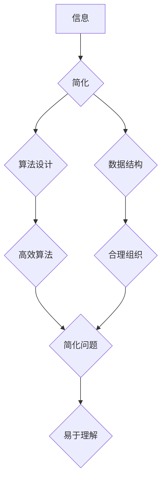

> 信息简化，复杂系统，算法设计，数据结构，软件架构，代码优化，可读性，可维护性

## 1. 背景介绍

在当今信息爆炸的时代，我们被海量数据和复杂系统所包围。从庞大的互联网网络到复杂的软件应用程序，从基因组测序到金融市场预测，无处不在的复杂性正在挑战我们的认知和解决问题的能力。在这种情况下，信息简化显得尤为重要。信息简化不仅仅是减少冗余信息，更是一种思维方式，一种将复杂问题分解成简单易懂的组成部分，并通过清晰的结构和逻辑表达，使信息更加易于理解、记忆和应用。

信息简化在软件开发领域有着重要的意义。优秀的软件架构师和程序员都明白，简洁明了的代码不仅更容易阅读和维护，更能提高开发效率和软件质量。然而，信息简化并非易事，它需要我们具备扎实的技术基础、敏锐的洞察力和严谨的逻辑思维。

## 2. 核心概念与联系

信息简化是一个多层次的概念，涉及到算法设计、数据结构、软件架构、代码风格等多个方面。

**2.1 信息简化原则**

* **最小化冗余：** 避免重复信息，使用简洁的语言和结构表达。
* **突出重点：** 明确信息的核心内容，并将其突出显示。
* **层次化结构：** 将复杂信息分解成层次结构，方便理解和导航。
* **清晰的逻辑：** 使用清晰的逻辑关系连接信息，使信息流暢自然。

**2.2 信息简化与复杂系统**

复杂系统是指由众多相互作用的个体组成的系统，其整体行为难以通过简单分析预测。信息简化在复杂系统中尤为重要，因为它可以帮助我们理解和控制复杂系统的行为。

**2.3 信息简化与算法设计**

算法设计是信息简化的重要组成部分。高效的算法可以将复杂问题分解成简单的步骤，并以最小的计算量完成任务。

**Mermaid 流程图**



## 3. 核心算法原理 & 具体操作步骤

### 3.1 算法原理概述

**3.1.1 分治法**

分治法是一种将复杂问题分解成若干个子问题，然后递归地解决这些子问题，最后将子问题的解合并成最终解的算法设计策略。

**3.1.2 动态规划**

动态规划是一种解决优化问题的算法设计策略，它通过将问题分解成若干个子问题，并存储子问题的解，避免重复计算，从而提高算法效率。

### 3.2 算法步骤详解

**3.2.1 分治法步骤**

1. 将问题分解成若干个子问题。
2. 递归地解决这些子问题。
3. 将子问题的解合并成最终解。

**3.2.2 动态规划步骤**

1. 将问题分解成若干个子问题。
2. 存储子问题的解，避免重复计算。
3. 根据子问题的解，计算最终解。

### 3.3 算法优缺点

**3.3.1 分治法**

* **优点：** 
    * 适用于许多类型的问题。
    * 容易理解和实现。
* **缺点：** 
    * 可能存在大量的重复计算。
    * 对于某些问题，效率可能较低。

**3.3.2 动态规划**

* **优点：** 
    * 能够避免重复计算，提高效率。
    * 适用于许多优化问题。
* **缺点：** 
    * 存储子问题的解需要消耗空间。
    * 对于某些问题，可能难以找到合适的子问题分解方式。

### 3.4 算法应用领域

**3.4.1 分治法**

* 快速排序
* 二分查找
* 归并排序

**3.4.2 动态规划**

* 最长公共子序列
* 最小路径问题
* 背包问题

## 4. 数学模型和公式 & 详细讲解 & 举例说明

### 4.1 数学模型构建

**4.1.1 信息熵**

信息熵是衡量信息不确定性的度量，其公式为：

$$H(X) = -\sum_{i=1}^{n} p(x_i) \log_2 p(x_i)$$

其中：

* $X$ 是一个随机变量。
* $p(x_i)$ 是 $x_i$ 的概率。

**4.1.2 决策树**

决策树是一种树形结构的模型，用于分类或回归问题。其节点表示特征或决策，分支表示决策结果，叶子节点表示最终分类或回归结果。

### 4.2 公式推导过程

**4.2.1 信息增益**

信息增益是衡量特征对信息熵的影响的度量，其公式为：

$$Gain(S,A) = H(S) - \sum_{v \in Values(A)} \frac{|S_v|}{|S|} H(S_v)$$

其中：

* $S$ 是训练数据集。
* $A$ 是一个特征。
* $Values(A)$ 是特征 $A$ 的所有取值。
* $S_v$ 是特征 $A$ 取值为 $v$ 的子集。

**4.2.2 Gini 不纯度**

Gini 不纯度是衡量数据集不纯度的度量，其公式为：

$$Gini(S) = 1 - \sum_{i=1}^{k} p_i^2$$

其中：

* $k$ 是数据集的类别数。
* $p_i$ 是类别 $i$ 的概率。

### 4.3 案例分析与讲解

**4.3.1 信息熵应用**

在文本分类任务中，可以使用信息熵来衡量不同类别文本的分布情况，并选择最能区分不同类别的特征。

**4.3.2 决策树应用**

在医疗诊断领域，可以使用决策树模型来预测患者的疾病风险，并根据患者的症状和病史提供个性化的治疗方案。

## 5. 项目实践：代码实例和详细解释说明

### 5.1 开发环境搭建

* 操作系统：Ubuntu 20.04
* 编程语言：Python 3.8
* 开发工具：VS Code

### 5.2 源代码详细实现

```python
# 分治法实现快速排序
def quick_sort(arr):
    if len(arr) <= 1:
        return arr
    pivot = arr[len(arr) // 2]
    left = [x for x in arr if x < pivot]
    middle = [x for x in arr if x == pivot]
    right = [x for x in arr if x > pivot]
    return quick_sort(left) + middle + quick_sort(right)

# 动态规划实现最长公共子序列
def longest_common_subsequence(str1, str2):
    n = len(str1)
    m = len(str2)
    dp = [[0 for _ in range(m + 1)] for _ in range(n + 1)]
    for i in range(1, n + 1):
        for j in range(1, m + 1):
            if str1[i - 1] == str2[j - 1]:
                dp[i][j] = dp[i - 1][j - 1] + 1
            else:
                dp[i][j] = max(dp[i - 1][j], dp[i][j - 1])
    return dp[n][m]
```

### 5.3 代码解读与分析

* **快速排序算法**：
    * 选择一个元素作为枢轴，将数组划分为小于枢轴和大于枢轴的两个子数组。
    * 递归地对两个子数组进行排序。
    * 返回排序后的数组。
* **最长公共子序列算法**：
    * 使用动态规划方法，构建一个二维数组 `dp`，其中 `dp[i][j]` 表示字符串 `str1[:i]` 和 `str2[:j]` 的最长公共子序列长度。
    * 遍历 `dp` 数组，根据字符串的字符是否相等，更新 `dp` 数组的值。
    * 最终返回 `dp[n][m]`，即字符串 `str1` 和 `str2` 的最长公共子序列长度。

### 5.4 运行结果展示

```
>>> quick_sort([3, 7, 8, 5, 2, 1, 9, 5, 4])
[1, 2, 3, 4, 5, 5, 7, 8, 9]
>>> longest_common_subsequence("AGGTAB", "GXTXAYB")
4
```

## 6. 实际应用场景

### 6.1 信息简化在软件开发中的应用

* **代码可读性：** 简洁明了的代码更容易理解和维护。
* **代码可扩展性：** 简洁的代码结构更容易进行修改和扩展。
* **代码效率：** 优化后的代码可以提高执行效率。

### 6.2 信息简化在数据分析中的应用

* **数据可视化：** 使用简洁的图表和图形来展示数据趋势和模式。
* **数据挖掘：** 使用算法简化数据处理过程，提取有价值的信息。
* **数据报告：** 使用清晰的语言和结构来撰写数据报告，方便用户理解。

### 6.3 信息简化在用户体验设计中的应用

* **用户界面设计：** 使用简洁明了的界面元素，提高用户体验。
* **用户手册：** 使用清晰的语言和结构，方便用户理解产品功能。
* **在线帮助：** 使用简洁的语言和结构，方便用户快速找到解决方案。

### 6.4 未来应用展望

随着信息技术的不断发展，信息简化将发挥越来越重要的作用。未来，信息简化技术将应用于更多领域，例如：

* **人工智能：** 简化人工智能模型的结构，提高模型的效率和可解释性。
* **物联网：** 简化物联网设备的数据处理和通信，提高设备的性能和可靠性。
* **区块链：** 简化区块链数据的存储和验证，提高区块链系统的效率和安全性。

## 7. 工具和资源推荐

### 7.1 学习资源推荐

* **书籍：**
    * 《设计模式：复用面向对象软件的建模》
    * 《算法导论》
    * 《深入理解计算机系统》
* **在线课程：**
    * Coursera: 数据结构与算法
    * edX: 计算机科学导论
    * Udemy: 软件架构设计

### 7.2 开发工具推荐

* **代码编辑器：** VS Code, Sublime Text, Atom
* **版本控制系统：** Git, GitHub
* **数据库：** MySQL, PostgreSQL, MongoDB

### 7.3 相关论文推荐

* **信息熵：**
    * Shannon, C. E. (1948). A mathematical theory of communication. The Bell System Technical Journal, 27(3), 379-423.
* **决策树：**
    * Quinlan, J. R. (1986). Induction of decision trees. Machine learning, 1(1), 81-106.

## 8. 总结：未来发展趋势与挑战

### 8.1 研究成果总结

信息简化是一个不断发展的领域，近年来取得了显著的成果。

* **算法设计：** 出现了许多新的高效算法，例如分治法、动态规划