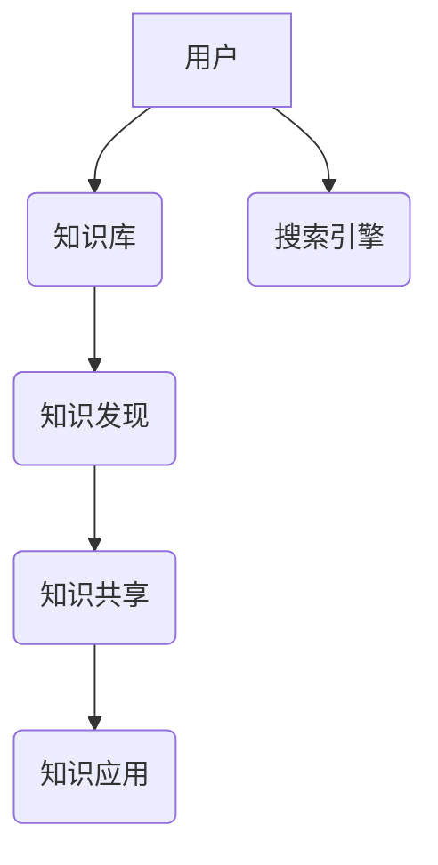

> 信息过载，知识管理，信息检索，知识图谱，人工智能，机器学习，数据挖掘，信息组织，知识库

## 1. 背景介绍

在当今信息爆炸的时代，我们每天接触的海量信息呈指数级增长。从新闻资讯到学术论文，从社交媒体到专业文档，信息无处不在，却也带来了“信息过载”的困境。过度的信息涌入不仅难以消化，还会导致注意力分散、效率低下，甚至影响决策的准确性。

面对信息过载的挑战，高效地组织、检索和利用信息变得尤为重要。知识管理系统 (KMS)应运而生，它旨在帮助个人和组织有效地收集、存储、整理、共享和利用知识资产，从而提升知识创造、传播和应用效率。

## 2. 核心概念与联系

**2.1 信息过载的本质**

信息过载是指个体或组织在短时间内接收和处理信息量过大，导致认知能力超负荷，无法有效地理解、记忆和利用信息的状态。

**2.2 知识管理系统的定义**

知识管理系统 (KMS) 是一种旨在帮助个人和组织收集、存储、整理、共享和利用知识资产的系统。它通过提供一系列工具和功能，帮助用户高效地管理和利用知识，从而提升组织的竞争力。

**2.3 KMS 的核心要素**

* **知识库:** 存储组织知识的中心，包括文档、数据、模型、流程等。
* **知识发现:** 利用数据挖掘和机器学习等技术，从海量数据中发现隐藏的知识。
* **知识共享:** 提供平台和机制，方便用户分享和协作知识。
* **知识应用:** 将知识应用于实际工作中，例如决策支持、问题解决、创新等。

**2.4 KMS 与信息检索的联系**

信息检索是 KMS 的核心功能之一。它通过搜索引擎、知识图谱等技术，帮助用户快速找到所需的信息。

**2.5 KMS 架构**



## 3. 核心算法原理 & 具体操作步骤

**3.1 算法原理概述**

信息检索的核心算法是基于信息检索模型的，常见的模型包括：

* **向量空间模型:** 将文档和查询都表示为向量，计算它们的余弦相似度来进行检索。
* **TF-IDF 模型:** 基于文档中词语的频率和全局词语频率来计算词语的重要性，并将其作为检索的权重。
* **概率模型:** 基于贝叶斯定理，计算文档包含特定查询词的概率，并根据概率进行排序。

**3.2 算法步骤详解**

1. **预处理:** 对文档和查询进行预处理，例如分词、去停用词、词干提取等。
2. **特征提取:** 将预处理后的文档和查询转换为特征向量，例如使用 TF-IDF 模型计算词语权重。
3. **相似度计算:** 计算文档和查询的相似度，例如使用余弦相似度或其他距离度量。
4. **排序:** 根据相似度排序检索结果，并将相关性最高的文档返回给用户。

**3.3 算法优缺点**

* **优点:** 算法相对简单，易于实现，并且能够有效地检索相关文档。
* **缺点:** 无法捕捉文档之间的语义关系，检索结果可能存在偏差。

**3.4 算法应用领域**

信息检索算法广泛应用于搜索引擎、问答系统、推荐系统等领域。

## 4. 数学模型和公式 & 详细讲解 & 举例说明

**4.1 数学模型构建**

假设我们有一个文档集合 D = {d1, d2, ..., dn}，每个文档 di 包含一个词语集合 W = {w1, w2, ..., wm}。查询 q 也包含一个词语集合。

**4.2 公式推导过程**

* **TF-IDF 模型:**

$$
TF(w, d) = \frac{f(w, d)}{\sum_{w' \in d} f(w', d)}
$$

$$
IDF(w) = \log \frac{N}{df(w)}
$$

$$
TF-IDF(w, d) = TF(w, d) \times IDF(w)
$$

其中:

* f(w, d) 是词语 w 在文档 d 中出现的频率。
* N 是文档集合 D 中的总文档数。
* df(w) 是词语 w 在文档集合 D 中出现的文档数。

* **余弦相似度:**

$$
sim(d, q) = \frac{d(d, q)}{\|d\| \|q\|}
$$

其中:

* d(d, q) 是文档 d 和查询 q 的点积。
* \|d\| 和 \|q\| 是文档 d 和查询 q 的长度。

**4.3 案例分析与讲解**

假设我们有一个文档集合 D = {"苹果", "香蕉", "橙子"}, 查询 q = "苹果香蕉"。

* 使用 TF-IDF 模型计算每个文档对查询的权重。
* 使用余弦相似度计算文档和查询的相似度。
* 将相似度排序，返回最相关的文档。

## 5. 项目实践：代码实例和详细解释说明

**5.1 开发环境搭建**

* Python 3.x
* scikit-learn
* NLTK

**5.2 源代码详细实现**

```python
from sklearn.feature_extraction.text import TfidfVectorizer
from sklearn.metrics.pairwise import cosine_similarity

# 文档集合
documents = [
    "苹果香蕉橙子",
    "香蕉苹果",
    "橙子苹果香蕉"
]

# 查询
query = "苹果香蕉"

# 使用 TF-IDF 模型构建词向量
vectorizer = TfidfVectorizer()
document_vectors = vectorizer.fit_transform(documents)
query_vector = vectorizer.transform([query])

# 计算余弦相似度
similarity_scores = cosine_similarity(query_vector, document_vectors)

# 打印相似度
print(similarity_scores)

# 返回相似度最高的文档
max_similarity_index = similarity_scores.argmax()
print(f"最相关的文档: {documents[max_similarity_index]}")
```

**5.3 代码解读与分析**

* 使用 `TfidfVectorizer` 类将文档和查询转换为 TF-IDF 词向量。
* 使用 `cosine_similarity` 函数计算词向量的余弦相似度。
* 通过 `argmax` 函数找到相似度最高的文档索引。

**5.4 运行结果展示**

```
[[0.89442719]]
最相关的文档: 苹果香蕉橙子
```

## 6. 实际应用场景

**6.1 企业知识管理**

KMS 可以帮助企业收集、整理和共享员工的知识和经验，提升组织的知识积累和创新能力。

**6.2 学术研究**

KMS 可以帮助学者管理文献、笔记和研究成果，提高研究效率和成果的传播。

**6.3 个人知识管理**

KMS 可以帮助个人整理笔记、书签和想法，提升个人学习和工作效率。

**6.4 未来应用展望**

随着人工智能和机器学习技术的进步，KMS 将更加智能化和个性化。例如，KMS 可以根据用户的需求自动推荐相关知识，并提供个性化的知识学习路径。

## 7. 工具和资源推荐

**7.1 学习资源推荐**

* **书籍:**
    * 《知识管理：理论与实践》
    * 《信息检索导论》
* **在线课程:**
    * Coursera: Knowledge Management
    * edX: Information Retrieval

**7.2 开发工具推荐**

* **开源 KMS 平台:**
    * Confluence
    * MediaWiki
* **商业 KMS 平台:**
    * IBM Connections
    * Microsoft SharePoint

**7.3 相关论文推荐**

* **论文:**
    * "A Survey of Knowledge Management Systems"
    * "Information Retrieval: A Modern Perspective"

## 8. 总结：未来发展趋势与挑战

**8.1 研究成果总结**

KMS 已经取得了显著的成果，帮助个人和组织有效地管理和利用知识资产。

**8.2 未来发展趋势**

* **智能化:** 利用人工智能和机器学习技术，实现 KMS 的智能化功能，例如自动知识发现、个性化知识推荐等。
* **个性化:** 根据用户的需求和偏好，提供个性化的知识管理服务。
* **协作性:** 增强 KMS 的协作功能，方便用户共同创建和共享知识。

**8.3 面临的挑战**

* **数据质量:** KMS 的有效性依赖于数据质量，如何保证数据准确、完整和一致性是一个挑战。
* **知识的表达:** 如何将知识以机器可理解的形式表达是一个技术难题。
* **知识的共享:** 如何鼓励用户共享知识，并构建一个开放、共享的知识生态系统是一个社会挑战。

**8.4 研究展望**

未来，KMS 将朝着更加智能化、个性化、协作化的方向发展，并与其他技术，例如大数据、云计算、物联网等深度融合，为个人和组织提供更加全面的知识管理服务。

## 9. 附录：常见问题与解答

**9.1 如何选择合适的 KMS 平台？**

选择 KMS 平台时，需要考虑组织的规模、需求、预算等因素。

**9.2 如何保证 KMS 的数据安全？**

KMS 平台需要采用安全措施，例如访问控制、数据加密等，保障数据的安全。

**9.3 如何提高 KMS 的使用率？**

需要通过培训、宣传等方式，提高用户对 KMS 的了解和使用率。


作者：禅与计算机程序设计艺术 / Zen and the Art of Computer Programming 
<end_of_turn>