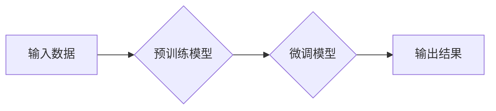

> 生成式AI, 语言模型, 深度学习, Transformer, GPT, DALL-E, 文本生成, 图像生成, 创作工具, 伦理问题

## 1. 背景介绍

近年来，人工智能（AI）技术取得了飞速发展，其中生成式AI作为其重要分支，正在迅速改变着我们与世界互动的方式。生成式AI是指能够根据输入数据生成新内容的AI模型，例如文本、图像、音频、视频等。与传统的AI模型相比，生成式AI更注重创造性和想象力，能够突破数据本身的局限性，生成全新的、有价值的内容。

### 1.1  AI技术发展历程

人工智能的发展历程可以追溯到20世纪50年代，早期主要集中在规则式AI和专家系统领域。随着计算机硬件和算法的进步，深度学习技术在21世纪初兴起，为AI的发展带来了革命性的变革。深度学习模型能够从海量数据中自动学习特征，从而实现更精准、更智能的决策和预测。

### 1.2  生成式AI的兴起

生成式AI的兴起与深度学习技术的进步密不可分。深度学习模型的强大能力使得它能够学习复杂的模式和关系，从而生成逼真的、高质量的新内容。近年来，一些突破性的进展，例如Transformer模型的提出和GPT系列语言模型的开发，进一步推动了生成式AI的发展。

## 2. 核心概念与联系

### 2.1  生成式AI的核心概念

* **生成模型:** 生成模型是一种能够从输入数据中学习并生成新数据的机器学习模型。
* **深度学习:** 深度学习是一种基于多层神经网络的机器学习方法，能够从复杂的数据中自动学习特征。
* **Transformer:** Transformer是一种新型的神经网络架构，能够有效处理序列数据，例如文本和音频。
* **语言模型:** 语言模型是一种能够预测文本序列中下一个词的模型，例如GPT-3。
* **图像生成模型:** 图像生成模型能够根据文本描述或其他输入生成图像，例如DALL-E。

### 2.2  生成式AI的架构



**流程说明:**

1. **输入数据:** 生成式AI模型需要大量的训练数据，例如文本、图像、音频等。
2. **预训练模型:** 预训练模型是在大量数据上进行训练的通用模型，例如GPT-3或DALL-E。
3. **微调模型:** 根据特定任务，对预训练模型进行微调，使其能够生成更符合要求的结果。
4. **输出结果:** 微调后的模型能够根据输入数据生成新的文本、图像、音频等内容。

## 3. 核心算法原理 & 具体操作步骤

### 3.1  算法原理概述

生成式AI的核心算法原理是基于深度学习的概率模型。这些模型学习数据中的概率分布，并根据该分布生成新的数据。常见的生成式AI算法包括：

* **变分自编码器 (VAE):** VAE是一种生成模型，它将输入数据编码成一个低维表示，然后解码成新的数据。
* **生成对抗网络 (GAN):** GAN由两个网络组成：生成器和鉴别器。生成器试图生成逼真的数据，而鉴别器试图区分真实数据和生成数据。两者相互竞争，最终生成器能够生成逼真的数据。

### 3.2  算法步骤详解

以变分自编码器为例，其具体操作步骤如下：

1. **编码器:** 将输入数据编码成一个低维表示，称为隐变量。
2. **解码器:** 根据隐变量解码生成新的数据。
3. **训练过程:** 通过最小化重建误差和KL散度来训练编码器和解码器。

### 3.3  算法优缺点

**VAE的优点:**

* 可以生成高质量的数据。
* 可以控制生成的样本的分布。

**VAE的缺点:**

* 训练过程比较复杂。
* 生成的数据可能存在模式重复的问题。

**GAN的优点:**

* 可以生成非常逼真的数据。
* 不需要事先定义数据分布。

**GAN的缺点:**

* 训练过程比较不稳定。
* 难以评估模型的性能。

### 3.4  算法应用领域

生成式AI算法在各个领域都有广泛的应用，例如：

* **文本生成:** 自动写作、机器翻译、对话系统等。
* **图像生成:** 图像合成、图像修复、图像风格迁移等。
* **音频生成:** 音频合成、音乐创作、语音识别等。
* **视频生成:** 视频合成、视频特效等。

## 4. 数学模型和公式 & 详细讲解 & 举例说明

### 4.1  数学模型构建

**变分自编码器 (VAE)**

VAE的数学模型可以概括为以下公式：

$$
\begin{aligned}
z &= \text{Encoder}(x) \\
\hat{x} &= \text{Decoder}(z)
\end{aligned}
$$

其中：

* $x$ 是输入数据。
* $z$ 是隐变量。
* $\hat{x}$ 是解码后的输出数据。

**生成对抗网络 (GAN)**

GAN由两个网络组成：生成器 $G$ 和鉴别器 $D$。

* 生成器 $G$ 的目标是生成逼真的数据，其输出为：

$$
\hat{x} = G(z)
$$

其中 $z$ 是随机噪声。

* 鉴别器 $D$ 的目标是区分真实数据和生成数据，其输出为：

$$
p(real) = D(x)
$$

$$
p(fake) = D(\hat{x})
$$

其中 $x$ 是真实数据，$\hat{x}$ 是生成数据。

### 4.2  公式推导过程

VAE的训练目标是最小化重建误差和KL散度。

* 重建误差：

$$
\mathcal{L}_{reconstruction} = ||x - \hat{x}||^2
$$

* KL散度：

$$
\mathcal{L}_{KL} = D_{KL}(q(z|x) || p(z))
$$

其中 $q(z|x)$ 是编码器输出的隐变量分布，$p(z)$ 是先验分布。

GAN的训练目标是最大化鉴别器的准确率，同时最小化生成器的损失。

* 鉴别器损失：

$$
\mathcal{L}_D = \mathbb{E}_{x \sim p_{data}(x)}[log(D(x))] + \mathbb{E}_{\hat{x} \sim p_G(\hat{x})}[log(1 - D(\hat{x}))]
$$

* 生成器损失：

$$
\mathcal{L}_G = \mathbb{E}_{\hat{x} \sim p_G(\hat{x})}[log(D(\hat{x}))]
$$

### 4.3  案例分析与讲解

**VAE案例:**

VAE可以用于图像压缩和生成。通过训练一个VAE模型，可以将图像编码成一个低维表示，然后解码成新的图像。

**GAN案例:**

GAN可以用于生成逼真的图像、视频和音频。例如，DeepFake技术利用GAN生成人脸视频，而Jukebox则可以生成逼真的音乐。

## 5. 项目实践：代码实例和详细解释说明

### 5.1  开发环境搭建

* **操作系统:** Linux/macOS/Windows
* **编程语言:** Python
* **深度学习框架:** TensorFlow/PyTorch
* **其他工具:** Git、Jupyter Notebook

### 5.2  源代码详细实现

以下是一个使用TensorFlow实现VAE图像生成模型的简单代码示例：

```python
import tensorflow as tf

# 定义编码器
encoder = tf.keras.Sequential([
    tf.keras.layers.Conv2D(32, (3, 3), activation='relu', input_shape=(28, 28, 1)),
    tf.keras.layers.MaxPooling2D((2, 2)),
    tf.keras.layers.Conv2D(64, (3, 3), activation='relu'),
    tf.keras.layers.MaxPooling2D((2, 2)),
    tf.keras.layers.Flatten(),
    tf.keras.layers.Dense(latent_dim)
])

# 定义解码器
decoder = tf.keras.Sequential([
    tf.keras.layers.Dense(7 * 7 * 64, activation='relu'),
    tf.keras.layers.Reshape((7, 7, 64)),
    tf.keras.layers.Conv2DTranspose(64, (3, 3), strides=(2, 2), activation='relu'),
    tf.keras.layers.Conv2DTranspose(32, (3, 3), strides=(2, 2), activation='relu'),
    tf.keras.layers.Conv2D(1, (3, 3), activation='sigmoid', output_shape=(28, 28, 1))
])

# 定义VAE模型
vae = tf.keras.Model(inputs=encoder.input, outputs=decoder(encoder.output))

# 训练VAE模型
vae.compile(optimizer='adam', loss='binary_crossentropy')
vae.fit(x_train, x_train, epochs=10)

# 生成新图像
z = tf.random.normal(shape=(1, latent_dim))
generated_image = decoder(z)
```

### 5.3  代码解读与分析

* **编码器:** 编码器将输入图像编码成一个低维表示，即隐变量。
* **解码器:** 解码器将隐变量解码成新的图像。
* **VAE模型:** VAE模型将编码器和解码器组合在一起，并使用重建误差和KL散度作为损失函数进行训练。
* **训练过程:** 训练VAE模型时，输入真实图像，并通过编码器和解码器生成新的图像。然后，使用损失函数计算重建误差和KL散度，并根据梯度下降算法更新模型参数。

### 5.4  运行结果展示

训练完成后，可以将随机噪声输入到解码器中，生成新的图像。这些生成的图像可能与训练数据相似，但也会有一些差异，体现了VAE模型的生成能力。

## 6. 实际应用场景

### 6.1  文本生成

* **自动写作:** 生成新闻报道、产品描述、小说等文本内容。
* **机器翻译:** 将文本从一种语言翻译成另一种语言。
* **对话系统:** 创建能够与人类进行自然对话的聊天机器人。

### 6.2  图像生成

* **图像合成:** 生成逼真的图像，例如合成人物肖像、场景图像等。
* **图像修复:** 修复损坏的图像，例如修复缺失的部分或去除噪声。
* **图像风格迁移:** 将图像的风格迁移到其他图像，例如将照片风格化成油画风格。

### 6.3  音频生成

* **音频合成:** 生成逼真的语音，例如用于语音助手、虚拟助理等。
* **音乐创作:** 生成新的音乐旋律和伴奏。
* **语音识别:** 将语音转换为文本。

### 6.4  未来应用展望

生成式AI技术的发展将带来更多创新应用，例如：

* **个性化内容生成:** 根据用户的喜好生成个性化的内容，例如新闻推荐、电影推荐等。
* **虚拟现实和增强现实:** 生成逼真的虚拟场景和增强现实体验。
* **药物研发:** 利用生成式AI模型设计新的药物分子。

## 7. 工具和资源推荐

### 7.1  学习资源推荐

* **书籍:**
    * 《深度学习》
    * 《生成对抗网络》
* **在线课程:**
    * Coursera: 深度学习
    * Udacity: 生成对抗网络
* **博客和网站:**
    * TensorFlow博客
    * PyTorch博客
    * OpenAI博客

### 7.2  开发工具推荐

* **深度学习框架:** TensorFlow, PyTorch
