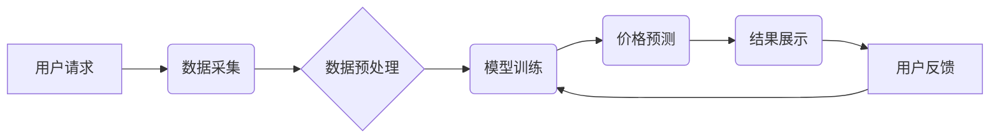

> 全网比价系统，人工智能，机器学习，深度学习，自然语言处理，数据挖掘，推荐系统，电商平台

## 1. 背景介绍

在当今数字经济时代，消费者在购物决策前往往需要花费大量时间和精力进行价格比较，以确保获得最佳性价比。全网比价系统应运而生，旨在帮助消费者快速、便捷地比较不同电商平台上的商品价格，从而做出更明智的购买决策。传统的全网比价系统主要依赖于爬虫技术和规则引擎，存在效率低、数据准确性差、更新速度慢等问题。随着人工智能技术的快速发展，基于AI的全网比价系统逐渐成为行业发展趋势。

## 2. 核心概念与联系

**2.1 核心概念**

* **全网比价:** 指通过收集和分析来自不同电商平台的商品价格信息，并进行比较和排序，为消费者提供最优价格的商品推荐。
* **人工智能 (AI):**  模拟人类智能行为的计算机系统，包括机器学习、深度学习、自然语言处理等技术。
* **机器学习 (ML):**  一种人工智能技术，通过算法训练模型，使模型能够从数据中学习并做出预测或决策。
* **深度学习 (DL):**  一种机器学习的子集，利用多层神经网络模拟人类大脑的学习过程，能够处理更复杂的数据和任务。
* **自然语言处理 (NLP):**  一种人工智能技术，旨在使计算机能够理解、处理和生成人类语言。

**2.2 架构关系**



**2.3 系统流程**

1. **用户请求:** 用户输入商品名称或关键词，触发比价系统。
2. **数据采集:** 系统从多个电商平台抓取相关商品信息，包括价格、规格、评价等。
3. **数据预处理:** 对采集到的数据进行清洗、转换、格式化等处理，使其适合模型训练。
4. **模型训练:** 利用机器学习算法，训练模型以预测商品价格。
5. **价格预测:** 系统根据用户请求和模型预测，给出不同电商平台的商品价格比较结果。
6. **结果展示:** 将价格比较结果以图表、列表等形式展示给用户。
7. **用户反馈:** 用户对结果进行评价，反馈信息用于模型优化和改进。

## 3. 核心算法原理 & 具体操作步骤

**3.1 算法原理概述**

全网比价系统中常用的算法包括：

* **线性回归:** 用于预测商品价格与其他特征之间的线性关系。
* **决策树:** 通过一系列规则划分数据，预测商品价格。
* **支持向量机 (SVM):**  通过寻找最佳分割超平面，将数据分类，用于预测商品价格。
* **神经网络:**  模拟人类大脑神经网络结构，能够处理更复杂的数据和关系，用于预测商品价格。

**3.2 算法步骤详解**

以线性回归为例，其步骤如下：

1. **数据收集:** 收集商品价格和相关特征数据，例如商品类别、品牌、规格、评价等。
2. **数据预处理:** 对数据进行清洗、转换、标准化等处理，使其适合模型训练。
3. **模型训练:** 使用线性回归算法训练模型，找到最佳的回归系数。
4. **模型评估:** 使用测试数据评估模型的预测精度，例如使用均方误差 (MSE) 或 R-squared 等指标。
5. **模型部署:** 将训练好的模型部署到生产环境中，用于预测商品价格。

**3.3 算法优缺点**

* **线性回归:** 优点：简单易懂，计算速度快；缺点：只能处理线性关系，对异常数据敏感。
* **决策树:** 优点：易于理解和解释，可以处理非线性关系；缺点：容易过拟合，对数据特征依赖性强。
* **支持向量机:** 优点：可以处理高维数据，具有较好的泛化能力；缺点：训练时间较长，参数选择较复杂。
* **神经网络:** 优点：可以处理复杂非线性关系，具有较高的预测精度；缺点：训练时间较长，参数量大，需要大量数据训练。

**3.4 算法应用领域**

全网比价系统中的算法广泛应用于电商平台、金融机构、旅游平台等领域，用于商品价格预测、风险评估、用户画像等任务。

## 4. 数学模型和公式 & 详细讲解 & 举例说明

**4.1 数学模型构建**

假设我们想要预测商品价格 $y$，其与特征 $x_1, x_2, ..., x_n$ 之间的关系可以用线性回归模型表示：

$$y = \beta_0 + \beta_1x_1 + \beta_2x_2 + ... + \beta_nx_n + \epsilon$$

其中：

* $y$: 商品价格
* $x_1, x_2, ..., x_n$: 商品特征，例如商品类别、品牌、规格、评价等
* $\beta_0, \beta_1, ..., \beta_n$: 回归系数，需要通过模型训练得到
* $\epsilon$: 随机误差项

**4.2 公式推导过程**

线性回归模型的目标是找到最佳的回归系数，使模型预测的商品价格与实际价格之间的误差最小。常用的误差函数是均方误差 (MSE)：

$$MSE = \frac{1}{n}\sum_{i=1}^{n}(y_i - \hat{y}_i)^2$$

其中：

* $n$: 数据样本数量
* $y_i$: 实际价格
* $\hat{y}_i$: 模型预测的价格

通过最小化 MSE，可以得到最佳的回归系数。可以使用梯度下降算法等优化算法求解。

**4.3 案例分析与讲解**

假设我们想要预测手机价格，其特征包括品牌、屏幕尺寸、内存容量等。我们可以收集手机价格和特征数据，训练线性回归模型。模型训练完成后，我们可以输入新的手机特征，预测其价格。例如，输入一个品牌为“小米”，屏幕尺寸为“6.5英寸”，内存容量为“8GB”的手机，模型可以预测其价格为“2500元”。

## 5. 项目实践：代码实例和详细解释说明

**5.1 开发环境搭建**

* 操作系统: Ubuntu 20.04
* Python 版本: 3.8
* 必要的库: pandas, numpy, scikit-learn, matplotlib

**5.2 源代码详细实现**

```python
import pandas as pd
from sklearn.linear_model import LinearRegression
from sklearn.model_selection import train_test_split
from sklearn.metrics import mean_squared_error

# 加载数据
data = pd.read_csv('手机价格数据.csv')

# 选择特征和目标变量
X = data[['品牌', '屏幕尺寸', '内存容量']]
y = data['价格']

# 将数据分为训练集和测试集
X_train, X_test, y_train, y_test = train_test_split(X, y, test_size=0.2, random_state=42)

# 创建线性回归模型
model = LinearRegression()

# 训练模型
model.fit(X_train, y_train)

# 预测测试集价格
y_pred = model.predict(X_test)

# 计算均方误差
mse = mean_squared_error(y_test, y_pred)
print(f'均方误差: {mse}')

# 可视化预测结果
import matplotlib.pyplot as plt
plt.scatter(y_test, y_pred)
plt.xlabel('实际价格')
plt.ylabel('预测价格')
plt.title('线性回归预测结果')
plt.show()
```

**5.3 代码解读与分析**

1. 首先，我们加载数据，选择特征和目标变量。
2. 然后，我们将数据分为训练集和测试集，用于模型训练和评估。
3. 创建线性回归模型，并使用训练集训练模型。
4. 使用训练好的模型预测测试集价格，并计算均方误差。
5. 最后，我们可视化预测结果，观察模型的预测精度。

**5.4 运行结果展示**

运行代码后，会输出均方误差值，以及预测结果的可视化图。均方误差值越小，模型的预测精度越高。

## 6. 实际应用场景

全网比价系统已广泛应用于电商平台、金融机构、旅游平台等领域，例如：

* **电商平台:** 为消费者提供商品价格比较服务，帮助他们找到最优价格。
* **金融机构:** 用于信用卡消费分析、风险评估等。
* **旅游平台:** 用于比较不同旅行社的旅游套餐价格，帮助用户选择最优惠的方案。

**6.4 未来应用展望**

随着人工智能技术的不断发展，全网比价系统将更加智能化、个性化。未来，全网比价系统可能具备以下功能：

* **个性化推荐:** 根据用户的购买历史、偏好等信息，提供个性化的价格比较结果。
* **动态价格预测:** 利用机器学习算法，预测商品价格的未来变化趋势，帮助用户做出更明智的购买决策。
* **跨平台比价:** 将不同电商平台的数据整合在一起，提供更全面的价格比较服务。

## 7. 工具和资源推荐

**7.1 学习资源推荐**

* **书籍:**
    * 《Python机器学习》
    * 《深度学习》
* **在线课程:**
    * Coursera: 机器学习
    * edX: 深度学习
* **博客:**
    * 机器学习 Mastery
    * Towards Data Science

**7.2 开发工具推荐**

* **Python:** 
* **Scikit-learn:** 机器学习库
* **TensorFlow/PyTorch:** 深度学习库
* **Pandas/NumPy:** 数据处理库

**7.3 相关论文推荐**

* **基于深度学习的全网商品价格预测研究**
* **基于机器学习的电商平台商品价格预测模型**

## 8. 总结：未来发展趋势与挑战

**8.1 研究成果总结**

全网比价系统是人工智能技术在电商领域的典型应用，能够帮助消费者节省时间和精力，做出更明智的购买决策。

**8.2 未来发展趋势**

未来，全网比价系统将更加智能化、个性化、跨平台化。

**8.3 面临的挑战**

* 数据获取和清洗: 由于电商平台数据分散、格式不统一，数据获取和清洗难度较大。
* 模型训练和评估: 需要大量的训练数据和专业的模型训练经验。
* 算法解释性和可信度: 提高算法的解释性和可信度，增强用户对系统的信任。

**8.4 研究展望**

未来研究方向包括：

* 开发更有效的算法和模型，提高价格预测的精度和效率。
* 研究跨平台数据整合和融合技术，提供更全面的价格比较服务。
* 探索个性化推荐和动态价格预测等新功能，提升用户体验。


## 9. 附录：常见问题与解答

**9.1  问题:** 全网比价系统的数据准确性如何保证？

**9.2  解答:** 全网比价系统的数据准确性依赖于数据采集、清洗和预处理的质量。系统会采用多种数据来源和验证机制，确保数据准确性和可靠性。

**9.3  问题:** 全网比价系统会侵犯用户的隐私吗？

**9.4  解答:** 全网比价系统不会收集用户的个人隐私信息，只收集商品价格和相关特征数据。

**9.5  问题:** 全网比价系统如何应对价格波动？

**9.6  解答:** 全网比价系统会利用机器学习算法，预测商品价格的未来变化趋势，并及时更新价格信息，帮助用户做出更明智的购买决策。


作者：禅与计算机程序设计艺术 / Zen and the Art of Computer Programming 
<end_of_turn>