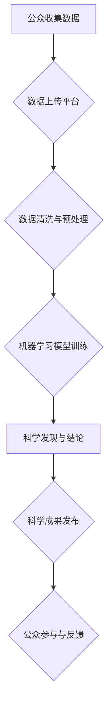

> 公民科学，科学研究，公众参与，数据分析，人工智能，机器学习，科学普及

## 1. 背景介绍

科学研究，作为人类探索世界、理解自然规律和解决实际问题的重要手段，历来依赖于专业科研人员的投入和努力。然而，随着科学技术的不断发展，科学研究面临着越来越大的挑战：

* **数据爆炸**:  现代科学研究产生海量数据，需要强大的计算能力和数据分析能力进行处理和挖掘。
* **研究成本高昂**:  大型科学实验和研究项目往往需要巨额资金投入，限制了科研人员的探索范围。
* **科学知识普及不足**:  科学研究成果往往被局限于学术界，缺乏有效的传播机制，难以普及到大众。

面对这些挑战，一种新的科学研究模式——公民科学应运而生。公民科学是指公众参与到科学研究过程中，通过收集、分析和解释数据，为科学研究提供支持和贡献。

## 2. 核心概念与联系

公民科学的核心概念是将科学研究的参与主体从专业科研人员扩展到公众，打破了传统科学研究的封闭性，促进了科学研究的民主化和开放化。

**公民科学的参与方式多样化:**

* **数据收集**: 公众可以利用手机、相机等设备收集自然现象、环境变化等数据。
* **数据分析**: 公众可以利用在线平台和工具对收集到的数据进行分析和处理。
* **科学实验**: 公众可以参与到科学实验中，例如观测星空、记录鸟类迁徙等。
* **科学传播**: 公众可以将科学研究成果传播给身边的人，提高公众对科学的理解和认识。

**公民科学与人工智能的结合:**

人工智能技术为公民科学的发展提供了强大的支持。

* **数据分析**: 人工智能算法可以帮助公众对海量数据进行快速、准确的分析，发现隐藏的规律和模式。
* **自动化**: 人工智能可以自动化一些重复性的任务，例如数据标注、图像识别等，减轻公众的负担。
* **个性化**: 人工智能可以根据公众的兴趣和知识水平提供个性化的科学内容和学习资源。

**公民科学与机器学习的结合:**

机器学习算法可以帮助公民科学项目进行数据挖掘和模式识别，从而发现新的科学现象和规律。

**Mermaid 流程图:**



## 3. 核心算法原理 & 具体操作步骤

### 3.1  算法原理概述

公民科学项目中常用的算法包括数据清洗、分类、聚类、预测等。这些算法基于统计学、机器学习等领域，通过对数据进行分析和处理，可以帮助公众发现隐藏的规律和模式。

### 3.2  算法步骤详解

**数据清洗:**

1. 数据收集: 从各种来源收集数据，例如传感器数据、图像数据、文本数据等。
2. 数据清洗: 去除重复数据、缺失数据、错误数据等，确保数据质量。
3. 数据转换: 将数据转换为统一的格式，方便后续分析。

**分类:**

1. 数据预处理: 对数据进行特征提取、归一化等处理。
2. 模型训练: 使用分类算法，例如支持向量机、决策树等，对数据进行训练，建立分类模型。
3. 模型评估: 使用测试数据评估模型的准确率、召回率等指标。

**聚类:**

1. 数据预处理: 对数据进行特征提取、归一化等处理。
2. 模型训练: 使用聚类算法，例如k-means、层次聚类等，对数据进行聚类，将数据划分为不同的类别。
3. 模型评估: 使用聚类指标，例如Silhouette score、Dunn index等，评估模型的聚类效果。

### 3.3  算法优缺点

**数据清洗:**

* 优点: 提高数据质量，为后续分析提供可靠的数据基础。
* 缺点: 需要耗费时间和精力，对数据清洗规则的制定和执行需要专业知识。

**分类:**

* 优点: 可以将数据分类，方便数据分析和管理。
* 缺点: 需要大量的训练数据，模型的准确率受训练数据质量的影响。

**聚类:**

* 优点: 可以发现数据中的潜在结构和模式，帮助人们理解数据。
* 缺点: 聚类结果的解释性较弱，需要结合实际情况进行分析。

### 3.4  算法应用领域

公民科学项目中，这些算法可以应用于各种领域，例如：

* **生物学:** 识别和分类动植物物种、分析基因组数据。
* **环境科学:** 监测空气质量、水质、土壤污染等。
* **社会科学:** 分析社会网络、舆情趋势、人口流动等。
* **天文科学:** 观测天体、分析星系结构。

## 4. 数学模型和公式 & 详细讲解 & 举例说明

### 4.1  数学模型构建

公民科学项目中，可以使用数学模型来描述和预测科学现象。例如，可以使用Logistic回归模型来预测物种的分布范围，可以使用线性回归模型来预测气温的变化趋势。

### 4.2  公式推导过程

**Logistic回归模型:**

$$
P(y=1|x) = \frac{1}{1 + e^{-(w^T x + b)}}
$$

其中:

* $P(y=1|x)$ 是给定特征向量 $x$ 时，预测结果为 1 的概率。
* $w$ 是模型参数向量。
* $b$ 是模型偏置项。
* $e$ 是自然对数的底数。

### 4.3  案例分析与讲解

**案例:** 使用Logistic回归模型预测鸟类物种的分布范围。

**数据:** 收集鸟类物种的地理位置、栖息地类型、气候条件等数据。

**模型训练:** 使用训练数据训练Logistic回归模型，学习鸟类物种分布的规律。

**模型预测:** 使用训练好的模型预测其他地区的鸟类物种分布。

## 5. 项目实践：代码实例和详细解释说明

### 5.1  开发环境搭建

* 操作系统: Ubuntu 20.04
* Python 版本: 3.8
* 必要的库: pandas, numpy, scikit-learn, matplotlib

### 5.2  源代码详细实现

```python
import pandas as pd
from sklearn.linear_model import LogisticRegression
from sklearn.model_selection import train_test_split
from sklearn.metrics import accuracy_score

# 加载数据
data = pd.read_csv('bird_data.csv')

# 特征选择
features = ['latitude', 'longitude', 'temperature', 'precipitation']
target = 'species'

# 数据分割
X_train, X_test, y_train, y_test = train_test_split(data[features], data[target], test_size=0.2)

# 模型训练
model = LogisticRegression()
model.fit(X_train, y_train)

# 模型预测
y_pred = model.predict(X_test)

# 模型评估
accuracy = accuracy_score(y_test, y_pred)
print(f'模型准确率: {accuracy}')
```

### 5.3  代码解读与分析

* 代码首先加载数据，选择特征和目标变量。
* 然后使用 `train_test_split` 函数将数据分割成训练集和测试集。
* 使用 `LogisticRegression` 类创建Logistic回归模型，并使用 `fit` 方法训练模型。
* 使用 `predict` 方法对测试集进行预测，并使用 `accuracy_score` 函数计算模型的准确率。

### 5.4  运行结果展示

运行代码后，会输出模型的准确率。

## 6. 实际应用场景

### 6.1  生物多样性监测

公民科学项目可以帮助监测生物多样性，例如记录鸟类、昆虫、植物等物种的分布和数量变化。

### 6.2  环境污染监测

公民科学项目可以帮助监测环境污染，例如收集空气质量、水质、土壤污染等数据。

### 6.3  气候变化研究

公民科学项目可以帮助研究气候变化，例如记录气温、降雨量、冰雪覆盖等数据。

### 6.4  未来应用展望

随着人工智能技术的不断发展，公民科学项目将有更广泛的应用场景，例如：

* **个性化科学教育**: 根据用户的兴趣和知识水平，提供个性化的科学学习资源。
* **科学决策支持**: 将公民科学数据纳入科学决策体系，为政策制定提供参考。
* **全球科学合作**: 通过网络平台，连接全球的公民科学家，促进科学合作和知识共享。

## 7. 工具和资源推荐

### 7.1  学习资源推荐

* **Coursera**: 提供各种关于公民科学和人工智能的在线课程。
* **edX**: 提供各种关于科学研究和数据分析的在线课程。
* **Kaggle**: 提供各种科学竞赛和数据分析挑战，可以帮助你学习和实践公民科学技能。

### 7.2  开发工具推荐

* **Python**: 广泛应用于数据分析和机器学习，是公民科学项目开发的常用语言。
* **R**: 专门用于统计分析和数据可视化，也是公民科学项目开发的常用语言。
* **Jupyter Notebook**: 提供交互式编程环境，方便进行数据分析和模型开发。

### 7.3  相关论文推荐

* **Citizen Science: Public Participation in Scientific Research** by Bonney, R., et al. (2014)
* **The Promise of Citizen Science for Environmental Monitoring** by Silvertown, J. (2009)
* **Harnessing the Power of Citizen Science for Global Health** by  Horton, R. (2013)

## 8. 总结：未来发展趋势与挑战

### 8.1  研究成果总结

公民科学为科学研究提供了新的思路和方法，促进了科学研究的民主化和开放化，并取得了一系列成果。例如，公民科学项目帮助科学家发现了新的物种、监测了环境变化、预测了疾病流行等。

### 8.2  未来发展趋势

* **人工智能技术的应用**: 人工智能技术将进一步推动公民科学的发展，例如自动数据分析、个性化学习资源推荐等。
* **数据共享与开放**: 数据共享和开放将成为公民科学发展的重要趋势，促进科学研究的协同和创新。
* **跨学科合作**: 跨学科合作将成为公民科学发展的重要方向，例如将公民科学与社会科学、人文科学等领域结合起来。

### 8.3  面临的挑战

* **数据质量**: 公民科学数据往往存在质量问题，需要加强数据标准化和质量控制。
* **参与者激励**: 如何激励公众持续参与公民科学项目，需要探索新的激励机制。
* **伦理问题**: 公民科学项目涉及到数据隐私、知识产权等伦理问题，需要加强伦理规范和监管。

### 8.4  研究展望

未来，公民科学将继续发展壮大，成为科学研究的重要组成部分。我们需要加强对公民科学的理论研究和实践探索，推动公民科学的健康发展，为人类社会创造更多价值。

## 9. 附录：常见问题与解答

**常见问题:**

* 如何参与公民科学项目？
* 公民科学项目有哪些？
* 公民科学项目需要哪些技能？

**解答:**

* 可以通过在线平台、社交媒体等渠道寻找公民科学项目。
* 公民科学项目种类繁多，涵盖生物学、环境科学、社会科学等多个领域。
* 参与公民科学项目不需要专业知识，只需要具备基本的科学素养和学习能力。


作者：禅与计算机程序设计艺术 / Zen and the Art of Computer Programming 
<end_of_turn>