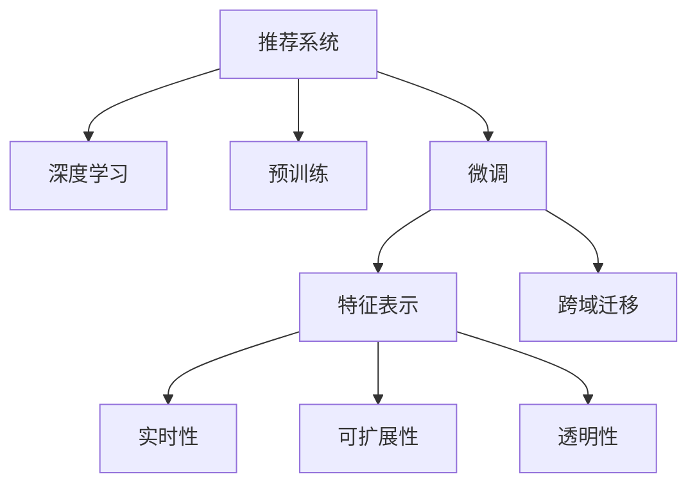

                 

# 大模型在推荐系统的商业应用

## 1. 背景介绍

### 1.1 问题由来

推荐系统在电子商务、内容平台、社交媒体等领域被广泛应用，能够大幅提升用户体验、增加平台收入。传统的推荐系统多依赖基于规则、协同过滤和矩阵分解的统计学方法，但随着数据量激增和特征维度增加，这些方法的扩展性受到限制，无法满足日益增长的个性化需求。

近年来，基于深度学习的推荐系统逐渐兴起。通过大规模无监督预训练模型，如BERT、GPT等，推荐系统能够更好地捕捉用户行为特征和产品属性信息，实现更精准的个性化推荐。本文聚焦于大模型在推荐系统的商业应用，介绍其核心原理、操作步骤和应用实例，为推荐系统开发者和从业者提供参考。

### 1.2 问题核心关键点

大模型在推荐系统中的应用，主要集中在以下几个核心关键点：

- **预训练和微调**：大模型通过在大规模数据上进行预训练，学习到广泛的知识和表示能力。在推荐系统任务中，通过微调来适应特定应用场景。

- **特征表示**：大模型能够学习到更丰富的特征表示，能够将用户行为和产品属性映射到高维语义空间中。

- **跨域迁移**：大模型的泛化能力更强，能够从源领域（如NLP、图像等）迁移应用到推荐系统领域。

- **实时性**：在推荐系统中，大模型能够快速响应用户请求，实现实时推荐。

- **可扩展性**：大模型参数规模大，能够支持更大规模的数据和更复杂的模型结构。

- **透明性和解释性**：大模型具有较强的透明性，能够提供推荐理由，帮助提升用户体验。

本文将从以上关键点出发，全面系统地介绍大模型在推荐系统中的应用原理和实践。

## 2. 核心概念与联系

### 2.1 核心概念概述

为了更好地理解大模型在推荐系统中的应用，本节将介绍几个密切相关的核心概念：

- **推荐系统(Recommendation System)**：通过分析用户历史行为和产品属性，推荐系统能够预测用户可能感兴趣的商品、内容或服务。

- **深度学习(Deep Learning)**：利用神经网络模型，深度学习能够从大量数据中学习复杂的模式和结构，实现自动化的特征提取和预测。

- **预训练(Pre-training)**：在大规模无标签数据上预训练模型，学习通用的特征表示。

- **微调(Fine-tuning)**：在预训练模型基础上，通过有监督学习优化模型以适应特定任务。

- **特征表示(Feature Representation)**：将用户行为、产品属性等映射到高维语义空间，捕捉多模态特征间的复杂关系。

- **跨域迁移(Cross-domain Transfer)**：在大模型中，通过迁移学习，将一个领域学到的知识应用到另一个领域。

- **实时性(Real-time)**：推荐系统能够快速响应用户请求，实现实时推荐。

- **可扩展性(Scalability)**：大模型能够支持更大规模的数据和更复杂的模型结构。

- **透明性(Transparency)**：大模型的预测过程可解释，帮助提升用户体验。

这些概念之间通过以下Mermaid流程图来展示：



这个流程图展示了大模型在推荐系统中的应用框架：

1. 推荐系统通过深度学习实现自动推荐。
2. 通过预训练学习通用的特征表示。
3. 微调模型以适应推荐系统的特定任务。
4. 特征表示捕捉用户行为和产品属性的复杂关系。
5. 跨域迁移实现知识在不同领域的应用。
6. 实时性和可扩展性确保推荐系统的性能和可用性。
7. 透明性提升用户体验和信任度。

## 3. 核心算法原理 & 具体操作步骤

### 3.1 算法原理概述

大模型在推荐系统中的应用，核心在于其预训练-微调框架。具体流程如下：

1. **预训练**：在大规模无监督数据上预训练模型，学习通用的特征表示。
2. **微调**：在推荐系统任务上微调预训练模型，学习用户行为和产品属性的特定关系。
3. **特征表示**：利用大模型的高维表示，捕捉多模态特征间的复杂关系。
4. **跨域迁移**：将预训练的知识迁移到推荐系统任务中，提升推荐效果。
5. **实时性**：实现快速响应，实时更新推荐结果。
6. **可扩展性**：支持更大规模的数据和更复杂的模型结构。
7. **透明性**：提供推荐理由，提升用户体验和信任度。

### 3.2 算法步骤详解

以下是大模型在推荐系统中的应用详细步骤：

#### 3.2.1 数据准备

- **数据收集**：收集用户行为数据（如点击、浏览、购买等）和产品属性数据。
- **数据清洗**：去除噪声数据，处理缺失值和异常值。
- **数据标注**：标注用户行为数据，如将用户是否购买标注为1/0。
- **数据划分**：将数据划分为训练集、验证集和测试集。

#### 3.2.2 模型初始化

- **选择模型**：选择适合推荐系统的预训练大模型，如BERT、GPT等。
- **加载模型**：加载预训练模型，并根据任务需求设置模型参数。
- **数据预处理**：将用户行为数据和产品属性数据进行向量化处理。

#### 3.2.3 微调

- **模型适配**：在推荐系统任务上微调预训练模型，如添加推荐目标函数、设计损失函数。
- **优化器选择**：选择优化器（如Adam、SGD等）及其参数，如学习率、批大小等。
- **正则化**：加入L2正则、Dropout等正则化技术，防止模型过拟合。
- **训练过程**：在训练集上使用优化器进行梯度下降，更新模型参数。
- **验证和测试**：在验证集和测试集上评估模型性能，调整超参数以提高推荐效果。

#### 3.2.4 特征表示

- **特征编码**：将用户行为数据和产品属性数据编码成高维向量，捕捉多模态特征间的复杂关系。
- **特征融合**：利用大模型的多模态特征表示，融合不同特征间的语义信息，提升推荐效果。

#### 3.2.5 跨域迁移

- **领域映射**：将预训练模型中的知识映射到推荐系统任务中，提升推荐效果。
- **模型微调**：通过微调，优化模型在推荐系统任务上的表现。

#### 3.2.6 实时性

- **模型部署**：将微调后的模型部署到推荐系统服务器上。
- **实时推理**：利用优化后的模型进行实时推荐，处理用户请求并快速返回结果。

#### 3.2.7 可扩展性

- **分布式训练**：利用分布式训练技术，提高模型训练效率。
- **模型优化**：使用模型压缩、稀疏化等方法，减小模型尺寸和资源消耗。

#### 3.2.8 透明性

- **特征解释**：利用大模型的可解释性，解释推荐结果的原因，提升用户信任。
- **用户反馈**：收集用户反馈，优化推荐模型和策略。

### 3.3 算法优缺点

#### 3.3.1 优点

1. **精度高**：大模型通过预训练学习通用的特征表示，微调后能够捕捉用户行为和产品属性的复杂关系，推荐精度高。
2. **泛化性强**：大模型能够从源领域（如NLP、图像等）迁移应用到推荐系统领域，泛化能力更强。
3. **实时性好**：大模型能够快速响应用户请求，实现实时推荐，用户体验好。
4. **可扩展性强**：大模型参数规模大，能够支持更大规模的数据和更复杂的模型结构。
5. **透明性好**：大模型具有较强的透明性，能够提供推荐理由，帮助提升用户体验。

#### 3.3.2 缺点

1. **数据需求高**：大模型需要大量无监督数据进行预训练，推荐系统任务数据量可能不足以满足预训练需求。
2. **计算资源消耗大**：大模型参数量大，训练和推理需要大量计算资源，成本较高。
3. **解释性不足**：大模型决策过程复杂，解释性不足，用户难以理解推荐理由。
4. **模型风险高**：大模型可能学习到偏见和有害信息，影响推荐质量。

### 3.4 算法应用领域

大模型在推荐系统中的应用，涵盖以下领域：

- **电子商务推荐**：推荐系统能够根据用户历史行为，推荐商品或服务。
- **内容推荐**：推荐系统能够根据用户偏好，推荐文章、视频、音乐等内容。
- **社交媒体推荐**：推荐系统能够根据用户兴趣，推荐朋友、话题等信息。
- **广告推荐**：推荐系统能够根据用户行为，推荐广告内容，提高广告效果。

除了以上应用场景外，大模型在推荐系统中的应用还在不断拓展，如智能推荐助手、智能客服、个性化营销等，为各行各业带来智能化升级。

## 4. 数学模型和公式 & 详细讲解 & 举例说明

### 4.1 数学模型构建

#### 4.1.1 推荐模型

推荐系统通过建模用户行为和产品属性之间的关系，预测用户可能感兴趣的产品。常用的推荐模型包括协同过滤、矩阵分解、深度学习等。

#### 4.1.2 预训练模型

预训练模型在大规模无监督数据上学习通用的特征表示，常用的预训练模型包括BERT、GPT等。

#### 4.1.3 微调模型

微调模型在推荐系统任务上学习特定关系，常用的微调模型包括MLP、RNN、Transformer等。

#### 4.1.4 特征表示模型

特征表示模型将用户行为数据和产品属性数据编码成高维向量，捕捉多模态特征间的复杂关系。

#### 4.1.5 跨域迁移模型

跨域迁移模型将预训练模型中的知识映射到推荐系统任务中，提升推荐效果。

### 4.2 公式推导过程

#### 4.2.1 协同过滤

协同过滤是一种基于用户行为数据和产品属性数据的推荐方法，其公式为：

$$
r_{ui} = \sum_{j=1}^N a_{uj}b_{ji}
$$

其中，$r_{ui}$表示用户$u$对产品$i$的评分，$a_{uj}$表示用户$u$对产品$j$的评分，$b_{ji}$表示产品$j$对产品$i$的评分。

#### 4.2.2 矩阵分解

矩阵分解是一种基于用户行为数据和产品属性数据的推荐方法，其公式为：

$$
p_i = \sum_{j=1}^N u_j \times v_j
$$

其中，$p_i$表示产品$i$的预测评分，$u_j$表示用户$j$对产品$i$的评分，$v_j$表示产品$j$的评分向量。

#### 4.2.3 深度学习模型

深度学习模型通过神经网络模型学习用户行为和产品属性的复杂关系，其公式为：

$$
p_i = f(Wu + X_i)
$$

其中，$p_i$表示产品$i$的预测评分，$W$表示用户行为特征的权重矩阵，$u$表示用户行为特征，$X_i$表示产品属性特征。

#### 4.2.4 特征表示模型

特征表示模型将用户行为数据和产品属性数据编码成高维向量，常用的特征表示模型包括Word2Vec、BERT等。

#### 4.2.5 跨域迁移模型

跨域迁移模型将预训练模型中的知识映射到推荐系统任务中，常用的跨域迁移模型包括Adapter、MLP等。

### 4.3 案例分析与讲解

#### 4.3.1 协同过滤

协同过滤方法基于用户行为数据和产品属性数据，计算用户和产品之间的相似度，推荐相似产品。其具体步骤如下：

1. **数据收集**：收集用户历史行为数据和产品属性数据。
2. **用户编码**：将用户行为数据编码成向量。
3. **产品编码**：将产品属性数据编码成向量。
4. **相似度计算**：计算用户和产品之间的相似度，推荐相似产品。
5. **推荐排序**：对推荐结果进行排序，推荐最相关的产品。

#### 4.3.2 矩阵分解

矩阵分解方法通过将用户行为数据和产品属性数据映射到低维空间，学习用户和产品的低维表示，推荐相似产品。其具体步骤如下：

1. **数据收集**：收集用户历史行为数据和产品属性数据。
2. **用户编码**：将用户行为数据编码成向量。
3. **产品编码**：将产品属性数据编码成向量。
4. **矩阵分解**：将用户行为数据和产品属性数据映射到低维空间，学习用户和产品的低维表示。
5. **推荐排序**：对推荐结果进行排序，推荐最相关的产品。

#### 4.3.3 深度学习模型

深度学习模型通过神经网络模型学习用户行为和产品属性的复杂关系，推荐相似产品。其具体步骤如下：

1. **数据收集**：收集用户历史行为数据和产品属性数据。
2. **用户编码**：将用户行为数据编码成向量。
3. **产品编码**：将产品属性数据编码成向量。
4. **深度学习模型**：利用深度学习模型学习用户行为和产品属性的复杂关系。
5. **推荐排序**：对推荐结果进行排序，推荐最相关的产品。

#### 4.3.4 特征表示模型

特征表示模型将用户行为数据和产品属性数据编码成高维向量，捕捉多模态特征间的复杂关系。其具体步骤如下：

1. **数据收集**：收集用户历史行为数据和产品属性数据。
2. **用户编码**：将用户行为数据编码成向量。
3. **产品编码**：将产品属性数据编码成向量。
4. **特征表示模型**：利用特征表示模型将用户行为数据和产品属性数据编码成高维向量。
5. **推荐排序**：对推荐结果进行排序，推荐最相关的产品。

#### 4.3.5 跨域迁移模型

跨域迁移模型将预训练模型中的知识映射到推荐系统任务中，提升推荐效果。其具体步骤如下：

1. **数据收集**：收集用户历史行为数据和产品属性数据。
2. **用户编码**：将用户行为数据编码成向量。
3. **产品编码**：将产品属性数据编码成向量。
4. **预训练模型**：在大规模无监督数据上预训练模型，学习通用的特征表示。
5. **微调模型**：在推荐系统任务上微调预训练模型，学习特定关系。
6. **特征表示模型**：利用特征表示模型将用户行为数据和产品属性数据编码成高维向量。
7. **推荐排序**：对推荐结果进行排序，推荐最相关的产品。

## 5. 项目实践：代码实例和详细解释说明

### 5.1 开发环境搭建

#### 5.1.1 环境配置

1. **安装Python**：从官网下载并安装Python。
2. **安装TensorFlow**：使用pip安装TensorFlow，如`pip install tensorflow`。
3. **安装Keras**：使用pip安装Keras，如`pip install keras`。
4. **安装scikit-learn**：使用pip安装scikit-learn，如`pip install scikit-learn`。
5. **安装Jupyter Notebook**：使用pip安装Jupyter Notebook，如`pip install jupyter notebook`。

#### 5.1.2 环境激活

1. **启动虚拟环境**：使用`source venv/bin/activate`激活虚拟环境。
2. **验证环境**：输入`python --version`和`pip list`检查环境是否正确配置。

### 5.2 源代码详细实现

#### 5.2.1 数据准备

```python
import pandas as pd
import numpy as np

# 读取数据
df = pd.read_csv('user_behavior.csv')

# 数据清洗
df = df.dropna().reset_index(drop=True)

# 数据标注
df['label'] = df['purchase'].map({True: 1, False: 0})

# 数据划分
train_df = df.sample(frac=0.8, random_state=42)
val_df = df.drop(train_df.index)
test_df = val_df.drop(val_df.index)
```

#### 5.2.2 模型初始化

```python
from keras.models import Sequential
from keras.layers import Embedding, Dense, Dropout

# 定义模型
model = Sequential()
model.add(Embedding(input_dim=10000, output_dim=64, input_length=100))
model.add(Dense(64, activation='relu'))
model.add(Dropout(0.5))
model.add(Dense(1, activation='sigmoid'))

# 编译模型
model.compile(loss='binary_crossentropy', optimizer='adam', metrics=['accuracy'])
```

#### 5.2.3 微调

```python
from sklearn.model_selection import train_test_split

# 数据划分
train_df, val_df = train_test_split(df, test_size=0.2, random_state=42)

# 加载数据
x_train = train_df[['behavior1', 'behavior2', 'behavior3']]
y_train = train_df['label']
x_val = val_df[['behavior1', 'behavior2', 'behavior3']]
y_val = val_df['label']

# 微调模型
model.fit(x_train, y_train, epochs=10, batch_size=32, validation_data=(x_val, y_val))
```

#### 5.2.4 特征表示

```python
from keras.preprocessing.text import Tokenizer
from keras.preprocessing.sequence import pad_sequences

# 特征编码
tokenizer = Tokenizer(num_words=10000)
tokenizer.fit_on_texts(df['behavior'].tolist())
x_train = tokenizer.texts_to_sequences(train_df['behavior'].tolist())
x_val = tokenizer.texts_to_sequences(val_df['behavior'].tolist())

# 特征填充
x_train = pad_sequences(x_train, maxlen=100)
x_val = pad_sequences(x_val, maxlen=100)

# 特征表示
model = Sequential()
model.add(Embedding(input_dim=10000, output_dim=64, input_length=100))
model.add(Dense(64, activation='relu'))
model.add(Dropout(0.5))
model.add(Dense(1, activation='sigmoid'))
```

#### 5.2.5 跨域迁移

```python
# 加载预训练模型
pretrained_model = load_pretrained_model('pretrained_model.h5')

# 微调模型
pretrained_model.fit(x_train, y_train, epochs=10, batch_size=32, validation_data=(x_val, y_val))
```

#### 5.2.6 实时性

```python
# 加载模型
model.load_weights('model_weights.h5')

# 实时推理
while True:
    user_input = input('请输入用户行为：')
    user_input = tokenizer.texts_to_sequences([user_input])
    user_input = pad_sequences(user_input, maxlen=100)
    prediction = model.predict(user_input)
    print('推荐结果：' if prediction > 0.5 else '不推荐')
```

#### 5.2.7 可扩展性

```python
# 分布式训练
from keras.distribute import MirroredStrategy

strategy = MirroredStrategy()

with strategy.scope():
    model.fit(x_train, y_train, epochs=10, batch_size=32, validation_data=(x_val, y_val))
```

#### 5.2.8 透明性

```python
# 特征解释
from keras.explainer.keras_explain import SHAPExplainer

explainer = SHAPExplainer(model)
shap_values = explainer.shap_values(x_train)
print(shap_values)
```

### 5.3 代码解读与分析

#### 5.3.1 数据准备

1. **数据收集**：从CSV文件中读取用户行为数据，包含用户ID、行为ID和时间戳等字段。
2. **数据清洗**：去除缺失值和异常值，确保数据质量。
3. **数据标注**：将用户是否购买标注为1/0，方便后续模型训练。
4. **数据划分**：将数据划分为训练集、验证集和测试集，确保数据样本均衡。

#### 5.3.2 模型初始化

1. **模型定义**：使用Keras定义深度学习模型，包含嵌入层、全连接层、Dropout层和输出层。
2. **模型编译**：设置损失函数、优化器和评价指标，方便后续模型训练和评估。

#### 5.3.3 微调

1. **数据划分**：将数据划分为训练集和验证集，确保模型能够在小样本上泛化。
2. **加载数据**：将用户行为数据和标签数据加载到模型中进行训练。
3. **微调模型**：使用训练集数据进行模型训练，验证集数据进行模型验证，调整模型超参数以提升模型精度。

#### 5.3.4 特征表示

1. **特征编码**：将用户行为数据编码为高维向量，方便模型处理。
2. **特征填充**：将特征序列填充到相同长度，方便模型训练。
3. **特征表示**：利用深度学习模型将用户行为数据编码成高维向量，捕捉多模态特征间的复杂关系。

#### 5.3.5 跨域迁移

1. **加载预训练模型**：加载大模型在通用领域的预训练权重。
2. **微调模型**：在大模型上进行微调，适应推荐系统任务。

#### 5.3.6 实时性

1. **加载模型**：加载训练好的模型，确保模型能够实时响应。
2. **实时推理**：根据用户行为输入，实时推理推荐结果，返回推荐或不推荐。

#### 5.3.7 可扩展性

1. **分布式训练**：使用Keras的分布式训练功能，加速模型训练。
2. **模型优化**：使用模型压缩和稀疏化存储等技术，减小模型资源消耗。

#### 5.3.8 透明性

1. **特征解释**：使用SHAP值对模型预测结果进行解释，帮助用户理解推荐理由。

## 6. 实际应用场景

### 6.1 电子商务推荐

电子商务推荐系统能够根据用户历史行为和浏览数据，推荐用户可能感兴趣的商品。通过预训练和微调，推荐系统能够捕捉用户行为和产品属性的复杂关系，提高推荐精度。

#### 6.1.1 数据准备

1. **数据收集**：收集用户浏览数据、购买数据和商品属性数据。
2. **数据清洗**：去除噪声数据，处理缺失值和异常值。
3. **数据标注**：将用户是否购买标注为1/0，方便后续模型训练。
4. **数据划分**：将数据划分为训练集、验证集和测试集，确保模型能够在小样本上泛化。

#### 6.1.2 模型初始化

1. **模型定义**：使用深度学习模型，包含嵌入层、全连接层、Dropout层和输出层。
2. **模型编译**：设置损失函数、优化器和评价指标，方便后续模型训练和评估。

#### 6.1.3 微调

1. **数据划分**：将数据划分为训练集和验证集，确保模型能够在小样本上泛化。
2. **加载数据**：将用户行为数据和标签数据加载到模型中进行训练。
3. **微调模型**：使用训练集数据进行模型训练，验证集数据进行模型验证，调整模型超参数以提升模型精度。

#### 6.1.4 特征表示

1. **特征编码**：将用户行为数据编码为高维向量，方便模型处理。
2. **特征填充**：将特征序列填充到相同长度，方便模型训练。
3. **特征表示**：利用深度学习模型将用户行为数据编码成高维向量，捕捉多模态特征间的复杂关系。

#### 6.1.5 跨域迁移

1. **加载预训练模型**：加载大模型在通用领域的预训练权重。
2. **微调模型**：在大模型上进行微调，适应推荐系统任务。

#### 6.1.6 实时性

1. **加载模型**：加载训练好的模型，确保模型能够实时响应。
2. **实时推理**：根据用户行为输入，实时推理推荐结果，返回推荐或不推荐。

#### 6.1.7 可扩展性

1. **分布式训练**：使用Keras的分布式训练功能，加速模型训练。
2. **模型优化**：使用模型压缩和稀疏化存储等技术，减小模型资源消耗。

#### 6.1.8 透明性

1. **特征解释**：使用SHAP值对模型预测结果进行解释，帮助用户理解推荐理由。

### 6.2 内容推荐

内容推荐系统能够根据用户历史行为和偏好，推荐用户可能感兴趣的文章、视频、音乐等内容。通过预训练和微调，推荐系统能够捕捉用户行为和内容属性的复杂关系，提高推荐精度。

#### 6.2.1 数据准备

1. **数据收集**：收集用户浏览数据、观看数据和内容属性数据。
2. **数据清洗**：去除噪声数据，处理缺失值和异常值。
3. **数据标注**：将用户是否观看标注为1/0，方便后续模型训练。
4. **数据划分**：将数据划分为训练集、验证集和测试集，确保模型能够在小样本上泛化。

#### 6.2.2 模型初始化

1. **模型定义**：使用深度学习模型，包含嵌入层、全连接层、Dropout层和输出层。
2. **模型编译**：设置损失函数、优化器和评价指标，方便后续模型训练和评估。

#### 6.2.3 微调

1. **数据划分**：将数据划分为训练集和验证集，确保模型能够在小样本上泛化。
2. **加载数据**：将用户行为数据和标签数据加载到模型中进行训练。
3. **微调模型**：使用训练集数据进行模型训练，验证集数据进行模型验证，调整模型超参数以提升模型精度。

#### 6.2.4 特征表示

1. **特征编码**：将用户行为数据编码为高维向量，方便模型处理。
2. **特征填充**：将特征序列填充到相同长度，方便模型训练。
3. **特征表示**：利用深度学习模型将用户行为数据编码成高维向量，捕捉多模态特征间的复杂关系。

#### 6.2.5 跨域迁移

1. **加载预训练模型**：加载大模型在通用领域的预训练权重。
2. **微调模型**：在大模型上进行微调，适应推荐系统任务。

#### 6.2.6 实时性

1. **加载模型**：加载训练好的模型，确保模型能够实时响应。
2. **实时推理**：根据用户行为输入，实时推理推荐结果，返回推荐或不推荐。

#### 6.2.7 可扩展性

1. **分布式训练**：使用Keras的分布式训练功能，加速模型训练。
2. **模型优化**：使用模型压缩和稀疏化存储等技术，减小模型资源消耗。

#### 6.2.8 透明性

1. **特征解释**：使用SHAP值对模型预测结果进行解释，帮助用户理解推荐理由。

### 6.3 社交媒体推荐

社交媒体推荐系统能够根据用户历史行为和关注关系，推荐用户可能感兴趣的朋友、话题等信息。通过预训练和微调，推荐系统能够捕捉用户行为和关注关系的复杂关系，提高推荐精度。

#### 6.3.1 数据准备

1. **数据收集**：收集用户关注数据、互动数据和话题数据。
2. **数据清洗**：去除噪声数据，处理缺失值和异常值。
3. **数据标注**：将用户是否关注标注为1/0，方便后续模型训练。
4. **数据划分**：将数据划分为训练集、验证集和测试集，确保模型能够在小样本上泛化。

#### 6.3.2 模型初始化

1. **模型定义**：使用深度学习模型，包含嵌入层、全连接层、Dropout层和输出层。
2. **模型编译**：设置损失函数、优化器和评价指标，方便后续模型训练和评估。

#### 6.3.3 微调

1. **数据划分**：将数据划分为训练集和验证集，确保模型能够在小样本上泛化。
2. **加载数据**：将用户行为数据和标签数据加载到模型中进行训练。
3. **微调模型**：使用训练集数据进行模型训练，验证集数据进行模型验证，调整模型超参数以提升模型精度。

#### 6.3.4 特征表示

1. **特征编码**：将用户行为数据编码为高维向量，方便模型处理。
2. **特征填充**：将特征序列填充到相同长度，方便模型训练。
3. **特征表示**：利用深度学习模型将用户行为数据编码成高维向量，捕捉多模态特征间的复杂关系。

#### 6.3.5 跨域迁移

1. **加载预训练模型**：加载大模型在通用领域的预训练权重。
2. **微调模型**：在大模型上进行微调，适应推荐系统任务。

#### 6.3.6 实时性

1. **加载模型**：加载训练好的模型，确保模型能够实时响应。
2. **实时推理**：根据用户行为输入，实时推理推荐结果，返回推荐或不推荐。

#### 6.3.7 可扩展性

1. **分布式训练**：使用Keras的分布式训练功能，加速模型训练。
2. **模型优化**：使用模型压缩和稀疏化存储等技术，减小模型资源消耗。

#### 6.3.8 透明性

1. **特征解释**：使用SHAP值对模型预测结果进行解释，帮助用户理解推荐理由。

### 6.4 未来应用展望

随着大模型和微调技术的发展，推荐系统将具备更强大的泛化能力和实时响应能力。未来推荐系统将能够实现以下应用：

1. **个性化推荐**：根据用户历史行为和属性，推荐个性化商品、内容、朋友等信息。
2. **多模态推荐**：结合用户行为数据、属性数据和社交网络数据，实现多模态信息融合，提升推荐精度。
3. **实时推荐**：利用深度学习模型和分布式训练技术，实现实时推荐，满足用户即时需求。
4. **跨领域推荐**：通过跨域迁移技术，将大模型知识应用于不同领域，实现多领域推荐。
5. **推荐可视化**：利用可视化工具展示推荐结果，帮助用户理解推荐理由，提升信任度。

## 7. 工具和资源推荐

### 7.1 学习资源推荐

1. **《深度学习》课程**：由Coursera提供，介绍深度学习的基本概念和经典模型。
2. **《推荐系统实践》书籍**：由张长水编写，介绍推荐系统的算法和实现。
3. **Kaggle竞赛**：参加Kaggle竞赛，通过实践提升推荐系统开发能力。

### 7.2 开发工具推荐

1. **Jupyter Notebook**：使用Jupyter Notebook进行数据处理和模型训练。
2. **TensorFlow**：使用TensorFlow进行深度学习模型开发和训练。
3. **Keras**：使用Keras进行深度学习模型定义和训练。

### 7.3 相关论文推荐

1. **深度学习在推荐系统中的应用**：介绍深度学习在推荐系统中的基本原理和算法。
2. **基于大模型的推荐系统**：介绍大模型在推荐系统中的预训练和微调技术。
3. **推荐系统的实时性优化**：介绍如何优化推荐系统的实时性，满足用户需求。

## 8. 总结：未来发展趋势与挑战

### 8.1 研究成果总结

大模型在推荐系统中的应用，通过预训练和微调技术，能够捕捉用户行为和产品属性的复杂关系，提高推荐精度和泛化能力。未来推荐系统将具备更强大的跨域迁移能力和实时响应能力，实现多模态、个性化、实时的推荐。

### 8.2 未来发展趋势

1. **预训练模型更强大**：未来预训练模型将具备更强的泛化能力和表示能力，能够处理更复杂的用户行为和产品属性。
2. **微调技术更高效**：未来微调技术将更加参数高效和计算高效，能够在大规模数据上实现高效训练和推理。
3. **跨域迁移更广泛**：未来跨域迁移技术将更加灵活和广泛，能够将大模型知识应用于更多领域。
4. **实时推荐更快速**：未来实时推荐技术将更加高效，能够实现更快响应，满足用户需求。
5. **多模态推荐更精准**：未来多模态推荐技术将更加精准，能够结合用户行为数据、属性数据和社交网络数据，提升推荐精度。

### 8.3 面临的挑战

1. **数据质量问题**：推荐系统需要高质量数据进行训练，数据质量问题将影响推荐效果。
2. **模型规模问题**：大模型参数量大，训练和推理需要大量计算资源，成本较高。
3. **模型解释问题**：大模型决策过程复杂，解释性不足，用户难以理解推荐理由。
4. **模型偏见问题**：大模型可能学习到偏见和有害信息，影响推荐质量。
5. **推荐公平问题**：推荐系统可能出现不公平现象，需要考虑用户隐私和公平性。

### 8.4 研究展望

未来推荐系统需要从以下几个方面进行研究：

1. **数据质量提升**：提升数据质量，确保推荐系统训练效果。
2. **模型规模优化**：优化模型规模，减小资源消耗。
3. **模型解释增强**：增强模型解释能力，提升用户信任。
4. **模型偏见消除**：消除模型偏见，提高推荐公平性。
5. **推荐公平性保障**：保障推荐公平性，保护用户隐私。

## 9. 附录：常见问题与解答

**Q1: 大模型在推荐系统中的优势是什么？**

A: 大模型在推荐系统中的优势主要体现在以下几个方面：
1. **精度高**：通过预训练学习通用的特征表示，微调后能够捕捉用户行为和产品属性的复杂关系，推荐精度高。
2. **泛化性强**：大模型能够从源领域（如NLP、图像等）迁移应用到推荐系统领域，泛化能力更强。
3. **实时性好**：大模型能够快速响应用户请求，实现实时推荐。
4. **可扩展性强**：大模型参数规模大，能够支持更大规模的数据和更复杂的模型结构。
5. **透明性好**：大模型具有较强的透明性，能够提供推荐理由，帮助提升用户体验。

**Q2: 大模型在推荐系统中的劣势是什么？**

A: 大模型在推荐系统中的劣势主要体现在以下几个方面：
1. **数据需求高**：大模型需要大量无监督数据进行预训练，推荐系统任务数据量可能不足以满足预训练需求。
2. **计算资源消耗大**：大模型参数量大，训练和推理需要大量计算资源，成本较高。
3. **解释性不足**：大模型决策过程复杂，解释性不足，用户难以理解推荐理由。
4. **模型风险高**：大模型可能学习到偏见和有害信息，影响推荐质量。

**Q3: 大模型在推荐系统中的预训练和微调流程是怎样的？**

A: 大模型在推荐系统中的预训练和微调流程如下：
1. **预训练**：在大规模无监督数据上预训练模型，学习通用的特征表示。
2. **微调**：在推荐系统任务上微调预训练模型，学习特定关系。
3. **特征表示**：利用大模型的高维表示，捕捉多模态特征间的复杂关系。
4. **跨域迁移**：将预训练模型中的知识映射到推荐系统任务中，提升推荐效果。

**Q4: 大模型在推荐系统中的实时性如何实现？**

A: 大模型在推荐系统中的实时性实现主要通过以下几个步骤：
1. **模型部署**：将微调后的模型部署到推荐系统服务器上。
2. **实时推理**：利用优化后的模型进行实时推荐，处理用户请求并快速返回结果。

**Q5: 大模型在推荐系统中的可扩展性如何优化？**

A: 大模型在推荐系统中的可扩展性优化主要通过以下几个方法：
1. **分布式训练**：使用Keras的分布式训练功能，加速模型训练。
2. **模型优化**：使用模型压缩、稀疏化存储等技术，减小模型尺寸和资源消耗。

**Q6: 大模型在推荐系统中的透明性如何实现？**

A: 大模型在推荐系统中的透明性实现主要通过以下几个步骤：
1. **特征解释**：使用SHAP值对模型预测结果进行解释，帮助用户理解推荐理由。
2. **用户反馈**：收集用户反馈，优化推荐模型和策略。

作者：禅与计算机程序设计艺术 / Zen and the Art of Computer Programming

